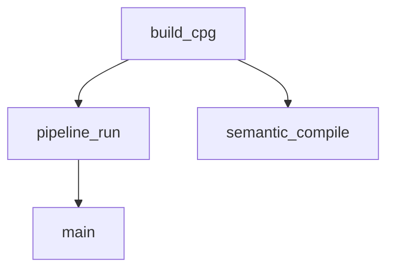
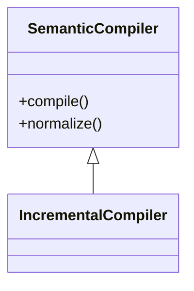

# Code Query (cq) Reference Documentation

> Version 0.3.0 | Schema: cq.v1

## Overview

Code Query (cq) is a high-signal code analysis tool designed for Claude Code. It provides structured, markdown-formatted analysis that integrates directly into the conversation context. Unlike simple grep searches, cq performs semantic analysis using Python's AST, symtable, bytecode inspection, and intelligent call resolution.

## Architecture

```
┌──────────────────────────────────────────────────────────────────┐
│                      CLI Layer (Cyclopts)                        │
│  tools/cq/cli_app/app.py → meta-app launcher → command dispatch  │
│  Global options: --root, --format, --verbose, etc.               │
└──────────────────────────────────────────────────────────────────┘
                              │
                              ▼
┌──────────────────────────────────────────────────────────────────┐
│                        Context Layer                             │
│  cli_app/context.py → CliContext (toolchain, root, format, etc.) │
│  cli_app/config.py → Config chain (TOML + env vars + CLI)        │
└──────────────────────────────────────────────────────────────────┘
                              │
                              ▼
┌──────────────────────────────────────────────────────────────────┐
│                      Command Modules                             │
│  commands/analysis.py → impact, calls, imports, etc.             │
│  commands/query.py → q command                                   │
│  commands/report.py → report command                             │
│  commands/admin.py → index, cache                                │
└──────────────────────────────────────────────────────────────────┘
                              │
                              ▼
┌──────────────────────────────────────────────────────────────────┐
│                         Macro Layer                               │
│  macros/{impact,calls,imports,exceptions,sig_impact,...}.py       │
│  Each macro: Request dataclass → analysis → CqResult              │
└──────────────────────────────────────────────────────────────────┘
                              │
                              ▼
┌──────────────────────────────────────────────────────────────────┐
│                         Index Layer                               │
│  index/def_index.py   - Repo-wide symbol index (FnDecl, ClassDecl)│
│  index/call_resolver.py - Multi-strategy call target resolution  │
│  index/arg_binder.py  - Argument → parameter binding              │
└──────────────────────────────────────────────────────────────────┘
                              │
                              ▼
┌──────────────────────────────────────────────────────────────────┐
│                          Core Layer                               │
│  core/schema.py       - CqResult, Finding, Section, Anchor        │
│  core/scoring.py      - Impact/Confidence signal computation      │
│  core/findings_table.py - Polars-based filtering + rehydration    │
│  core/report.py       - Markdown rendering                        │
│  core/artifacts.py    - JSON artifact persistence                 │
│  core/toolchain.py    - External tool detection (rg, sg)          │
└──────────────────────────────────────────────────────────────────┘
```

## Global Options Reference

All cq commands accept these global options, handled by the meta-app launcher.

### Option Details

| Option | Type | Env Var | Default | Description |
|--------|------|---------|---------|-------------|
| `--root` | Path | `CQ_ROOT` | Auto-detect | Repository root path. Auto-detects from current directory if not specified. |
| `--config` | Path | `CQ_CONFIG` | `.cq.toml` | Path to TOML config file. |
| `--no-config` | bool | `CQ_NO_CONFIG` | `false` | Skip loading config file entirely. |
| `--verbose`, `-v` | int | `CQ_VERBOSE` | `0` | Verbosity level (0=quiet, 1=info, 2=debug, 3=trace). |
| `--format` | enum | `CQ_FORMAT` | `md` | Output format. See Output Formats below. |
| `--artifact-dir` | Path | `CQ_ARTIFACT_DIR` | `.cq/artifacts` | Directory for saving JSON artifacts. |
| `--no-save-artifact` | bool | `CQ_NO_SAVE_ARTIFACT` | `false` | Skip saving JSON artifacts. |

### Output Formats

| Format | Description | Use Case |
|--------|-------------|----------|
| `md` | Markdown with sections and code blocks | Claude context (default) |
| `json` | Full structured JSON | Programmatic processing |
| `both` | Markdown followed by JSON block | Debugging |
| `summary` | Single-line summary | CI/CD integration |
| `mermaid` | Mermaid flowchart syntax | Call graph visualization |
| `mermaid-class` | Mermaid class diagram syntax | Class hierarchy visualization |
| `mermaid-cfg` | Mermaid control flow graph | Function CFG visualization |
| `dot` | Graphviz DOT syntax | Complex graph export |

### Configuration Precedence

Options are resolved in this order (highest priority first):

1. **CLI flags** - Explicit command-line arguments
2. **Environment variables** - `CQ_*` prefixed variables
3. **Config file** - TOML file (`.cq.toml` or `--config` path)
4. **Defaults** - Built-in default values

### Config File Format

Create `.cq.toml` in your repository root:

```toml
[cq]
# Output format (md, json, both, summary, mermaid, mermaid-class, mermaid-cfg, dot)
format = "md"

# Verbosity level (0-3)
verbose = 0

# Artifact directory
artifact_dir = ".cq/artifacts"

# Save artifacts by default
save_artifact = true

# Default root (usually auto-detected)
# root = "/path/to/repo"
```

### Environment Variable Reference

| Variable | Type | Example |
|----------|------|---------|
| `CQ_ROOT` | path | `/home/user/project` |
| `CQ_CONFIG` | path | `/home/user/.cq.toml` |
| `CQ_NO_CONFIG` | bool | `true`, `1`, `yes` |
| `CQ_VERBOSE` | int | `0`, `1`, `2`, `3` |
| `CQ_FORMAT` | string | `md`, `json`, `mermaid` |
| `CQ_ARTIFACT_DIR` | path | `.cq/artifacts` |
| `CQ_NO_SAVE_ARTIFACT` | bool | `true`, `1`, `yes` |

---

## Schema Definitions

### CqResult (Top-level structure)

Every cq command returns a `CqResult` with these components:

| Field | Type | Description |
|-------|------|-------------|
| `run` | `RunMeta` | Invocation metadata (macro, argv, root, timing, toolchain) |
| `summary` | `dict[str, Any]` | Key metrics at a glance |
| `key_findings` | `list[Finding]` | Top-level actionable insights |
| `sections` | `list[Section]` | Organized finding groups |
| `evidence` | `list[Finding]` | Supporting details (often truncated in display) |
| `artifacts` | `list[Artifact]` | Saved JSON artifact references |

### Finding

Individual analysis findings:

| Field | Type | Description |
|-------|------|-------------|
| `category` | `str` | Finding type (e.g., "call_site", "hazard", "scope") |
| `message` | `str` | Human-readable description |
| `anchor` | `Anchor \| None` | Source location: `file:line[:col]` |
| `severity` | `str` | One of: "error", "warning", "info" |
| `details` | `dict[str, Any]` | Structured metadata including scoring |

### Anchor

Source code location:

| Field | Type | Description |
|-------|------|-------------|
| `file` | `str` | Relative file path from repo root |
| `line` | `int` | 1-indexed line number |
| `col` | `int \| None` | 0-indexed column offset |
| `end_line` | `int \| None` | End line for spans |
| `end_col` | `int \| None` | End column for spans |

---

## Scoring System

### Impact Score (0.0 - 1.0)

Computed as weighted sum of normalized signals:

| Signal | Weight | Normalizer | Description |
|--------|--------|------------|-------------|
| `sites` | 45% | /100 | Number of affected call/usage sites |
| `files` | 25% | /20 | Number of affected files |
| `depth` | 15% | /10 | Propagation depth (taint analysis) |
| `breakages` | 10% | /10 | Breaking changes count |
| `ambiguities` | 5% | /10 | Uncertain/forwarding cases |

**Severity multiplier** (optional):
- `error`: 1.5x
- `warning`: 1.0x
- `info`: 0.5x

### Confidence Score (0.0 - 1.0)

Based on evidence quality:

| Evidence Kind | Score | Description |
|---------------|-------|-------------|
| `resolved_ast` | 0.95 | Full AST analysis with symbol resolution |
| `bytecode` | 0.90 | Bytecode inspection |
| `resolved_ast_heuristic` | 0.75 | AST with heuristic matching |
| `bytecode_heuristic` | 0.75 | Bytecode with heuristics |
| `cross_file_taint` | 0.70 | Multi-file taint propagation |
| `heuristic` | 0.60 | Pattern matching only |
| `rg_only` | 0.45 | Ripgrep text search only |
| `unresolved` | 0.30 | Unverified/fallback |

### Bucket Thresholds

| Bucket | Threshold |
|--------|-----------|
| `high` | >= 0.7 |
| `med` | >= 0.4 |
| `low` | < 0.4 |

---

## Commands Reference

### impact - Parameter Taint Analysis

Traces data flow from a function parameter to identify downstream consumers.

```bash
/cq impact <FUNCTION_NAME> --param <PARAM_NAME> [--depth N]
```

**How it works:**
1. Builds `DefIndex` of all functions/classes in repo
2. Finds function by name or qualified name (`Class.method`)
3. Initializes taint set with the specified parameter
4. Walks function AST, propagating taint through:
   - Assignments (`x = param` → x is tainted)
   - Calls with tainted args → records call site
   - Returns with tainted values → marks return as tainted
5. Recursively analyzes callees where tainted args are passed
6. Also finds callers via ripgrep for broader impact

**Taint propagation rules:**
- `ast.Name` → tainted if identifier in taint set
- `ast.Attribute` → tainted if receiver is tainted
- `ast.Subscript` → tainted if base or slice is tainted
- `ast.BinOp`, `ast.UnaryOp` → tainted if operand(s) tainted
- `ast.Call` → tainted if any arg tainted
- `ast.IfExp`, `ast.Compare`, `ast.BoolOp` → tainted if any branch tainted
- `ast.JoinedStr` (f-strings) → tainted if any value tainted
- Comprehensions → tainted if iterating over tainted data

**Output sections:**
- Summary: sites, files, max depth
- Key Findings: taint propagation summary by depth
- Taint Sites by kind (assign, call, return)
- Callers via ripgrep
- Evidence

**Example:**
```bash
/cq impact build_graph_product --param repo_root --depth 5
```

---

### calls - Call Site Census

Finds all call sites for a function with argument shape analysis.

```bash
/cq calls <FUNCTION_NAME>
```

**How it works:**
1. Uses ripgrep to find candidate lines matching `function_name(`
2. Parses candidate files with AST
3. `CallFinder` visitor matches calls by name or qualified name
4. Analyzes each call for:
   - Number of positional/keyword arguments
   - Keyword argument names used
   - `*args`/`**kwargs` forwarding
   - Calling context (containing function)
   - Argument preview string

**Output sections:**
- Summary: total sites, files, signature preview
- Argument Shape Histogram: distribution of arg patterns
- Keyword Argument Usage: which kwargs used how often
- Calling Contexts: which functions call this one
- Call Sites: detailed list with previews
- Evidence

**Example:**
```bash
/cq calls DefIndex.build
/cq calls render_markdown
```

---

### imports - Import Structure Analysis

Analyzes module import structure with optional cycle detection.

```bash
/cq imports [--cycles] [--module <MODULE>]
```

**How it works:**
1. Scans all Python files for import statements
2. Builds import graph (module → imported modules)
3. If `--cycles`: runs DFS-based cycle detection
4. If `--module`: focuses analysis on specific module

**Output sections:**
- Summary: modules scanned, imports found
- Import Cycles (if detected)
- Module Dependencies
- Evidence

**Example:**
```bash
/cq imports --cycles
/cq imports --module src.relspec
```

---

### exceptions - Exception Handling Analysis

Analyzes exception handling patterns across the codebase.

```bash
/cq exceptions [--function <FUNCTION>]
```

**How it works:**
1. Walks AST for all files (or focused function)
2. Records `raise` statements with exception types
3. Records `try/except` handlers with caught types
4. Identifies bare `except:` clauses (potential hazard)
5. Detects exception chaining (`raise ... from ...`)

**Output sections:**
- Summary: raises, catches, bare excepts
- Raised Exceptions by type
- Caught Exceptions by type
- Bare Except Clauses (warnings)
- Exception Chaining
- Evidence

**Example:**
```bash
/cq exceptions
/cq exceptions --function cmd_impact
```

---

### sig-impact - Signature Change Analysis

Simulates a signature change and classifies call sites.

```bash
/cq sig-impact <FUNCTION_NAME> --to "<new_signature>"
```

**How it works:**
1. Parses new signature into `SigParam` list
2. Finds all call sites using `calls` infrastructure
3. Classifies each call site:
   - `would_break`: Missing required param, excess positional args, unknown keyword
   - `ambiguous`: Uses `*args`/`**kwargs` (can't verify statically)
   - `ok`: Compatible with new signature

**Signature parsing:**
- Extracts parameter names, defaults, keyword-only status
- Handles `*args`, `**kwargs`, positional-only (`/`)

**Output sections:**
- Summary: call sites, would_break, ambiguous, ok counts
- Key Findings: breakage/compatibility summary
- Would Break Sites (with specific reasons)
- Ambiguous Sites
- OK Sites
- Evidence

**Example:**
```bash
/cq sig-impact _find_repo_root --to "_find_repo_root(start: Path | None = None, *, strict: bool = False)"
```

---

### side-effects - Import-Time Side Effects

Detects side effects at module import time.

```bash
/cq side-effects [--max-files <N>]
```

**How it works:**
1. Scans module-level code (outside functions/classes)
2. Detects:
   - Top-level function calls
   - Global variable mutations
   - Ambient state access (sys.path, os.environ, etc.)
   - Module-level I/O operations

**Output sections:**
- Summary: files scanned, effects found
- Side Effects by type
- Files with Effects
- Evidence

**Example:**
```bash
/cq side-effects --max-files 500
```

---

### scopes - Closure Scope Analysis

Uses Python's `symtable` to analyze scope capture for closures.

```bash
/cq scopes <FILE_OR_SYMBOL>
```

**How it works:**
1. Resolves target to file(s) containing symbol
2. Builds symbol table with `symtable.symtable()`
3. Recursively extracts scope info:
   - `free_vars`: Variables captured from enclosing scope
   - `cell_vars`: Variables provided to nested scopes
   - `nonlocals`: Explicit `nonlocal` declarations
   - `globals_used`: Global variable references

**Use case:** Before extracting a nested function, check if it captures variables that would break when moved.

**Output sections:**
- Summary: files analyzed, scopes with captures
- Key Findings: closure count, provider count, nonlocal usage
- Scope Capture Details
- Evidence

**Example:**
```bash
/cq scopes tools/cq/macros/impact.py
/cq scopes TaintVisitor
```

---

### async-hazards - Blocking in Async Detection

Finds blocking calls inside async functions.

```bash
/cq async-hazards [--profiles "<blocking_patterns>"]
```

**Default blocking patterns:**
- `time.sleep`, `sleep`
- `requests.{get,post,put,delete,head,patch,request}`
- `subprocess.{run,call,check_call,check_output,Popen}`
- `os.system`, `os.popen`
- `urllib.request.urlopen`, `urlopen`
- `socket.socket.{recv,send,connect}`
- `open` (file I/O)

**How it works:**
1. Scans files for `async def` functions
2. Within async scopes, detects calls matching blocking patterns
3. Records hazards with async function name and blocking call

**Output sections:**
- Summary: files scanned, async functions, hazards
- Key Findings: hazard count, most common blocker
- Async Hazards list
- By Blocking Call Type
- Evidence

**Example:**
```bash
/cq async-hazards
/cq async-hazards --profiles "redis.get,mysql.execute"
```

---

### bytecode-surface - Bytecode Analysis

Analyzes Python bytecode for hidden dependencies.

```bash
/cq bytecode-surface <FILE_OR_SYMBOL> [--show <categories>]
```

**Show categories:**
- `globals`: Global name loads (`LOAD_GLOBAL`)
- `attrs`: Attribute access (`LOAD_ATTR`, `STORE_ATTR`)
- `constants`: Constant values (`LOAD_CONST`)
- `opcodes`: Opcode frequency analysis

Default: `globals,attrs,constants`

**How it works:**
1. Compiles source to bytecode
2. Uses `dis` module to disassemble
3. Extracts:
   - Global variable references (including builtins)
   - Attribute access patterns
   - Constant values embedded in bytecode
   - Opcode distribution

**Use case:** Finding hidden dependencies that aren't visible in import statements (e.g., globals accessed via `eval`, dynamic attribute access).

**Output sections:**
- Summary: file, opcodes analyzed
- Global References
- Attribute Access
- Constants
- Evidence

**Example:**
```bash
/cq bytecode-surface tools/cq/macros/calls.py --show globals,attrs
```

---

### q - Declarative Entity Queries

The `q` command provides a composable, declarative query system for finding and analyzing code entities using ast-grep.

```bash
/cq q "<query_string>"
```

**How it works:**
1. Parses query string into structured Query IR
2. Planner determines which ast-grep record types to collect
3. Optional ripgrep prefilter narrows files by name pattern
4. ast-grep scans files, collecting matching records
5. Executor filters by entity type and name, builds findings

**Query Syntax:**

```
entity=TYPE [name=PATTERN] [in=DIR] [exclude=DIRS] [expand=KIND(depth=N)] [fields=FIELDS] [limit=N] [explain=true]
```

**Entity Types:**

| Entity | ast-grep Kinds | Description |
|--------|---------------|-------------|
| `function` | function, async_function | Function definitions |
| `class` | class, class_bases | Class definitions |
| `method` | function (in class context) | Method definitions |
| `import` | import, import_as, from_import, from_import_as, from_import_multi, from_import_paren | All import forms |
| `callsite` | call_name, call_attr | Call sites |

**Name Patterns:**

- **Exact match**: `name=build_graph_product`
- **Regex match**: `name=~^build.*` (prefix with `~`)

The planner generates ripgrep patterns to prefilter files:
- Functions: `def\s+NAME\s*\(`
- Classes: `class\s+NAME\s*[:\[]`
- Imports: `import\s+NAME` or `from\s+\S+\s+import\s+.*NAME`

**Scope Constraints:**

| Parameter | Example | Description |
|-----------|---------|-------------|
| `in=` | `in=src/semantics/` | Search only in directory |
| `exclude=` | `exclude=tests,venv` | Exclude directories (comma-separated) |

**Expanders:**

Graph expansion operators for traversing relationships:

| Expander | Default Depth | Description |
|----------|---------------|-------------|
| `callers` | 1 | Find functions calling the target |
| `callees` | 1 | Find functions called by target |
| `imports` | 1 | Find related imports |
| `raises` | 1 | Find exception handling |
| `scope` | 1 | Analyze closure captures |

Depth syntax: `expand=callers(depth=2)` for transitive analysis.

**Output Fields:**

| Field | Description |
|-------|-------------|
| `def` | Definition signature and location (default) |
| `callers` | Section showing calling functions |
| `callees` | Section showing called functions |
| `hazards` | Hazard detection (dynamic dispatch, forwarding) |
| `evidence` | Supporting evidence with scores |

**Output Structure:**

For `entity=import`, findings have:
- `category`: "import" or "from_import"
- `message`: e.g., "from_import: Path"
- `anchor`: file, line, col, end_line, end_col
- `details`: kind, name, text

For `entity=function/class`, findings have:
- `category`: "definition"
- `message`: e.g., "function: build_graph_product"
- `details`: kind, name, calls_within, impact_score, confidence_score

**Hazard Detection:**

When `fields=hazards` is specified:

| Hazard | Pattern | Reason |
|--------|---------|--------|
| dynamic_dispatch | `getattr(...)` | May resolve dynamically |
| forwarding | `*args`/`**kwargs` in call | Obscures call target |

**Examples:**

```bash
# Find all imports of a specific module
/cq q "entity=import name=Path"

# Find imports with regex pattern
/cq q "entity=import name=~pandas"

# Find functions in a directory
/cq q "entity=function in=src/semantics/"

# Find functions by pattern with caller analysis
/cq q "entity=function name=~^compile expand=callers(depth=2)"

# Class definitions with hazards
/cq q "entity=class fields=def,hazards in=src/"

# Limit results
/cq q "entity=import limit=20"

# Show query execution plan
/cq q "entity=function name=build explain=true"
```

**Comparison: Macros vs Query Command:**

| Aspect | Macros (`impact`, `calls`) | Query (`q`) |
|--------|---------------------------|-------------|
| Purpose | High-level domain analyses | Low-level composable queries |
| Input | Named CLI flags | Key=value query string |
| Flexibility | Fixed analysis patterns | User-defined combinations |
| Use case | Common analysis tasks | Custom entity searches |

Use macros for specific analyses (parameter flow, signature changes). Use `q` for flexible entity discovery and custom queries.

---

## Filtering Options

All commands support these filtering options:

### File Pattern Filters

| Option | Description |
|--------|-------------|
| `--include <pattern>` | Include files matching pattern (repeatable) |
| `--exclude <pattern>` | Exclude files matching pattern (repeatable) |

**Pattern syntax:**
- Glob patterns: `*.py`, `src/**/*.py`, `*test*`
- Regex patterns: `~src/(extract\|normalize)/.*\.py$` (prefix with `~`)

### Score Filters

| Option | Description |
|--------|-------------|
| `--impact <buckets>` | Filter by impact: `low`, `med`, `high` (comma-separated) |
| `--confidence <buckets>` | Filter by confidence: `low`, `med`, `high` (comma-separated) |
| `--severity <levels>` | Filter by severity: `error`, `warning`, `info` (comma-separated) |

### Output Limits

| Option | Description |
|--------|-------------|
| `--limit <N>` | Maximum number of findings |

### Filtering Examples

```bash
# High-impact, high-confidence findings in src/
/cq impact build_graph_product --param repo_root --impact high --confidence high --include "src/"

# Exclude tests, limit to 100 findings
/cq exceptions --exclude "tests/" --limit 100

# Multiple includes with regex
/cq side-effects --include "~src/(extract|normalize)/.*\.py$"

# Combine filters
/cq calls DefIndex.build --impact med,high --include "src/relspec/" --exclude "*test*"
```

---

## Output Formats

| Format | Description |
|--------|-------------|
| `--format md` | Markdown (default) - optimized for Claude context |
| `--format json` | Full JSON - for programmatic use |
| `--format both` | Markdown followed by JSON |
| `--format summary` | Condensed single-line - for CI integration |

### Summary Format

```
calls: 45 total sites [3 error, 12 warning, 30 info] [impact:high confidence:high]
```

---

## Artifact Persistence

By default, cq saves JSON artifacts to `.cq/artifacts/`:

```
.cq/artifacts/
├── impact_20240115_143022.json
├── calls_20240115_143145.json
└── ...
```

**Options:**
- `--artifact-dir <path>`: Custom artifact directory
- `--no-save-artifact`: Skip artifact saving

---

## Toolchain Requirements

cq detects and uses external tools:

| Tool | Required | Purpose |
|------|----------|---------|
| `rg` (ripgrep) | Yes | Fast file search for candidates |
| `sg` (ast-grep) | Optional | Structural code search (future) |
| Python | Yes | AST parsing, symtable, bytecode |

**Installation:**
```bash
# macOS
brew install ripgrep

# Linux
apt install ripgrep

# ast-grep (optional)
pip install ast-grep-py
# or
cargo install ast-grep
```

---

## Definition Index (DefIndex)

The `DefIndex` is cq's core data structure for repo-wide symbol resolution.

### What it captures:

**FnDecl (Function Declaration):**
- `name`: Function name
- `file`: Relative file path
- `line`: Definition line number
- `params`: List of `ParamInfo` (name, annotation, default, kind)
- `is_async`: Whether async
- `is_method`: Whether method (has self/cls)
- `class_name`: Containing class (if method)
- `decorators`: Decorator names
- `qualified_name`: `Class.method` or `function`
- `key`: `file::qualified_name`

**ClassDecl (Class Declaration):**
- `name`: Class name
- `file`: Relative file path
- `line`: Definition line number
- `bases`: Base class names
- `methods`: List of `FnDecl`
- `decorators`: Decorator names

**ModuleInfo:**
- `functions`: Top-level functions
- `classes`: Class definitions
- `module_aliases`: `import numpy as np` → `{"np": "numpy"}`
- `symbol_aliases`: `from pathlib import Path` → `{"Path": ("pathlib", "Path")}`

### Building the index:

```python
index = DefIndex.build(
    root="/path/to/repo",
    max_files=10000,
    include_patterns=["**/*.py"],
    exclude_patterns=["**/venv/**", "**/__pycache__/**"],
)
```

### Querying:

```python
# Find by name
functions = index.find_function_by_name("build")

# Find by qualified name
functions = index.find_function_by_qualified_name("DefIndex.build")

# Resolve import alias
module, symbol = index.resolve_import_alias("src/foo.py", "np.array")
# → ("numpy", "array")
```

---

## Findings Table (Polars-Based Filtering)

cq uses Polars DataFrames for efficient filtering:

### Column Schema

| Column | Type | Description |
|--------|------|-------------|
| `macro` | `Utf8` | Macro name |
| `group` | `Utf8` | "key_findings", "evidence", or section title |
| `category` | `Utf8` | Finding category |
| `message` | `Utf8` | Finding message |
| `file` | `Utf8` | File path (nullable) |
| `line` | `Int64` | Line number (nullable) |
| `col` | `Int64` | Column (nullable) |
| `impact_score` | `Float64` | Computed impact |
| `impact_bucket` | `Utf8` | high/med/low |
| `confidence_score` | `Float64` | Computed confidence |
| `confidence_bucket` | `Utf8` | high/med/low |
| `evidence_kind` | `Utf8` | Evidence source |
| `severity` | `Utf8` | error/warning/info |

### Filter flow:

```
CqResult → flatten_result() → FindingRecord[] → build_frame() → pl.DataFrame
    → apply_filters(df, include=..., exclude=..., impact=...) → filtered_df
    → rehydrate_result(original, filtered_df) → filtered CqResult
```

---

## Best Practices

### Before Refactoring

1. **Check callers first:**
   ```bash
   /cq calls function_to_modify
   ```

2. **Verify signature change safety:**
   ```bash
   /cq sig-impact function_name --to "function_name(new, signature)"
   ```

3. **Trace parameter impact:**
   ```bash
   /cq impact function_name --param param_to_change
   ```

### Before Extracting Nested Functions

```bash
/cq scopes file_with_nested_function.py
```

Check for captured variables that would break extraction.

### Investigating Async Issues

```bash
/cq async-hazards --impact high
```

### Understanding Module Dependencies

```bash
/cq imports --cycles
/cq imports --module your.module.path
```

### CI Integration

```bash
# Fail if high-impact breaking changes detected
./scripts/cq sig-impact foo --to "foo(new_sig)" --format summary --impact high
```

---

## Troubleshooting

### "ripgrep (rg) is required but not found"

Install ripgrep:
```bash
brew install ripgrep  # macOS
apt install ripgrep   # Debian/Ubuntu
```

### "Function 'X' not found in index"

- Check spelling and qualified name format
- Try both `function_name` and `Class.method`
- Increase `--max-files` if repo is large
- Check if file is in excluded directory

### Empty results

- Verify file patterns with `--include`/`--exclude`
- Lower impact/confidence thresholds
- Check if function exists in scanned files

### Slow performance

- Use `--max-files` to limit scope
- Add `--include` patterns to narrow search
- Ensure ripgrep is installed (much faster than pure Python)

### JSON artifact location

Default: `.cq/artifacts/`
Override: `--artifact-dir /custom/path`
Disable: `--no-save-artifact`

---

## Pattern Queries (Structural Search)

Pattern queries use ast-grep syntax for structural code matching. Unlike regex, patterns match actual code structure without false positives from strings or comments.

### Pattern Syntax

Patterns use metavariables to capture code structure:

| Metavariable | Meaning |
|--------------|---------|
| `$X` | Match a single AST node (expression, identifier, etc.) |
| `$$$` | Match zero or more AST nodes (variadic) |
| `$$X` | Match zero or more nodes and bind to name X |
| `$_` | Match a single node (anonymous, no binding) |

### Query Syntax

```bash
/cq q "pattern='<ast-grep-pattern>'" [strictness=MODE]
```

### Strictness Modes

| Mode | Description |
|------|-------------|
| `cst` | Exact CST match (whitespace-sensitive) |
| `smart` | Default - balances precision and recall |
| `ast` | Pure AST match (ignores whitespace, parentheses) |
| `relaxed` | Looser matching for exploratory queries |
| `signature` | Match function signatures only |

### Pattern Examples

```bash
# Find dynamic attribute access
/cq q "pattern='getattr(\$X, \$Y)'"

# Find all f-string usages
/cq q "pattern='f\"\$\$\$\"'"

# Find specific decorator usage
/cq q "pattern='@dataclass'"

# Find eval/exec hazards
/cq q "pattern='eval(\$X)'"

# Find pickle.load (security hazard)
/cq q "pattern='pickle.load(\$X)'"

# Find functions that take **kwargs
/cq q "pattern='def \$F(\$\$\$, **\$K)'"

# Find try blocks without except
/cq q "pattern='try: \$\$\$ finally: \$\$\$'"

# Find async function definitions
/cq q "pattern='async def \$F(\$$$)'"

# Match with strictness
/cq q "pattern='def \$F(\$_): ...' strictness=signature"
```

### Pattern Object Syntax (Deep Dive)

When simple patterns are ambiguous (e.g., `{ "k": v }` matches both dict literals and JSON pairs), use pattern objects for disambiguation.

**Full Syntax:**
```
pattern.context='<outer_pattern>' pattern.selector=<node_kind> [pattern.strictness=MODE]
```

**How It Works:**
1. `context` provides the outer pattern that establishes scope
2. `selector` specifies which AST node kind to extract from matches
3. The system generates an inline YAML rule for ast-grep

**Common Selectors:**

| Selector | Description | Use Case |
|----------|-------------|----------|
| `pair` | Key-value pair in dict | JSON/dict entries |
| `argument` | Function call argument | Specific arg positions |
| `parameter` | Function definition parameter | Specific param positions |
| `decorator` | Decorator expression | Extract decorators |
| `keyword` | Keyword argument | Named arguments |
| `expression_statement` | Statement expression | Side-effect calls |

**Generated YAML Rule:**
When using pattern objects, cq generates an inline rule like:
```yaml
id: inline_pattern_selector
language: python
rule:
  kind: pair
  inside:
    kind: dictionary
    pattern: '{ "$K": $V }'
```

**Examples:**

```bash
# Extract dictionary pairs from specific patterns
/cq q "pattern.context='{ \"\$K\": \$V, \$$$REST }' pattern.selector=pair"

# Extract first argument from specific function calls
/cq q "pattern.context='requests.get(\$URL, \$$$)' pattern.selector=argument" nthChild=1

# Extract decorators from async functions
/cq q "pattern.context='@\$D async def \$F(\$$$)' pattern.selector=decorator"
```

### Strictness Mode Reference

| Mode | AST Changes Ignored | Whitespace Ignored | Comments Ignored | Use Case |
|------|---------------------|-------------------|-----------------|----------|
| `cst` | No | No | No | Exact formatting match |
| `smart` | Some (parens) | Yes | Yes | General use (default) |
| `ast` | All | Yes | Yes | Pure structure |
| `relaxed` | All + some names | Yes | Yes | Exploratory |
| `signature` | Body | Yes | Yes | API shape only |

**Mode Details:**

**cst (Concrete Syntax Tree):**
- Whitespace-sensitive matching
- Preserves original formatting
- Use for: formatting-aware linting, style checks

**smart (default):**
- Normalizes parentheses: `(x)` matches `x`
- Ignores trivial whitespace differences
- Use for: most queries

**ast (Abstract Syntax Tree):**
- Purely structural matching
- `(((x)))` matches `x`
- Extra parentheses ignored
- Use for: semantic equivalence

**relaxed:**
- All `ast` normalizations
- Some identifier variations allowed
- Use for: finding similar patterns

**signature:**
- Matches function signature only
- Ignores function body entirely
- Use for: API compatibility checks

### Meta-Variable Reference (Deep Dive)

**Equality Enforcement:**

When a named meta-variable appears multiple times, all captures must be identical:

```bash
# $X appears twice - must match same value
/cq q "pattern='\$X = \$X'"       # Finds: x = x, foo = foo
/cq q "pattern='\$A + \$A'"       # Finds: n + n, but not n + m
```

**Multi-Capture Behavior:**

| Syntax | Captures | Binding | Equality |
|--------|----------|---------|----------|
| `$X` | Exactly 1 node | Named | Enforced |
| `$$X` | 0 or more nodes | Named | Enforced across all |
| `$$$` | 0 or more nodes | None | N/A |
| `$_` | Exactly 1 node | None | Not enforced |
| `$_X` | Exactly 1 node | Named (no equality) | Not enforced |

**MetaVarFilter Regex Syntax:**

Filters are applied post-match to captured values:

| Syntax | Effect | Example |
|--------|--------|---------|
| `$X=~pattern` | Keep if matches | `\$X=~'^test'` |
| `$X=!~pattern` | Keep if NOT matches | `\$X=!~'_internal$'` |

**Filter Examples:**

```bash
# Find string literals only
/cq q "pattern='\$X' \$X=~'^[\"\\']'"

# Find variables not starting with underscore
/cq q "pattern='\$VAR = \$VALUE' \$VAR=!~'^_'"

# Find numeric comparisons
/cq q "pattern='\$A \$\$OP \$B' \$\$OP=~'^[<>]'"
```

### Composite Query Reference (Deep Dive)

**Operator Semantics:**

| Operator | Logic | Short-Circuit | Capture Order |
|----------|-------|---------------|---------------|
| `all` | AND | No (all must match) | Preserved |
| `any` | OR | Yes (first match wins) | First match |
| `not` | Negation | N/A | N/A |

**all - Ordered Capture:**

Patterns in `all` are matched in order, and meta-variable captures from earlier patterns are available to later patterns:

```bash
# Match where $A is assigned then used
/cq q "all='\$A = \$B', 'func(\$A)'"
```

**any - First Match:**

Returns the first matching pattern:

```bash
# Match any logging pattern
/cq q "any='logger.info(\$$$)', 'print(\$$$)', 'console.log(\$$$)'"
```

**not - Exclusion:**

Can be applied to the main pattern or relational constraints:

```bash
# Pattern NOT matching
/cq q "pattern='def \$F' not='def test_'"

# Relational NOT
/cq q "entity=function not.has='return'"
/cq q "entity=class not.inside='class \$Parent'"
```

**Complex Nesting:**

```bash
# Functions with await but without try/except
/cq q "entity=function all='await \$X' not.has='try:'"

# Any security hazard in API routes
/cq q "inside='@app.route' any='eval(\$X)', 'exec(\$X)', 'pickle.load(\$X)'"
```

**YAML Rule Generation:**

Composite queries generate combined YAML rules:
```yaml
id: composite_all
rule:
  all:
    - pattern: 'await $X'
    - pattern: 'return $Y'
```

### Pattern vs Regex

| Aspect | Pattern Query | Grep/Regex |
|--------|--------------|------------|
| False positives | None from strings/comments | Common |
| Structure awareness | Yes (AST-based) | No (text-based) |
| Metavariables | Yes (`$X`, `$$$`) | Capture groups only |
| Context constraints | Yes (`inside`, `has`) | No |

---

## Relational Constraints (Contextual Search)

Find code patterns in specific structural contexts using relational constraints.

### Available Constraints

| Constraint | Description |
|------------|-------------|
| `inside='<pattern>'` | Pattern must be within a containing pattern |
| `has='<pattern>'` | Pattern must contain a nested pattern |
| `precedes='<pattern>'` | Pattern must appear before another |
| `follows='<pattern>'` | Pattern must appear after another |

### Stop-by Modes

For `inside` and `has`, control how far to search:

| Mode | Description |
|------|-------------|
| `neighbor` | Stop at immediate neighbors (default) |
| `end` | Search to end of containing scope |

### Examples

```bash
# Find methods inside Config classes
/cq q "entity=function inside='class Config'"

# Find functions that contain getattr calls
/cq q "entity=function has='getattr(\$X, \$Y)'"

# Find functions inside async context managers
/cq q "entity=function inside='async with \$X'"

# Find return statements inside try blocks
/cq q "pattern='return \$X' inside='try: \$\$\$'"

# Find assignments that precede return statements
/cq q "pattern='\$X = \$Y' precedes='return'"
```

### Combining Constraints

Multiple constraints can be combined:

```bash
# Find getattr inside Config classes that has a string literal
/cq q "pattern='getattr(\$X, \$Y)' inside='class Config' has='\"\$S\"'"
```

---

## Scope Filtering (Closure Analysis)

Filter functions by scope characteristics using Python's symtable module. Essential for safe refactoring of nested functions.

### Scope Types

| Type | Description |
|------|-------------|
| `module` | Module-level (top-level) functions |
| `function` | Functions nested inside other functions |
| `class` | Methods defined inside classes |
| `closure` | Functions that capture variables from enclosing scope |

### Query Syntax

```bash
/cq q "entity=function scope=TYPE"
```

### Scope Filters

| Filter | Description |
|--------|-------------|
| `scope=closure` | Functions that capture variables (have free vars) |
| `scope=module` | Top-level module functions |
| `scope=class` | Methods in classes |
| `captures=<var>` | Functions capturing a specific variable |
| `has_cells=true` | Functions that provide variables to nested scopes |

### Examples

```bash
# Find all closures in the codebase
/cq q "entity=function scope=closure"

# Find closures in a specific directory
/cq q "entity=function scope=closure in=src/semantics/"

# Find functions capturing a specific variable
/cq q "entity=function captures=config"

# Find functions that provide variables to nested scopes
/cq q "entity=function has_cells=true"

# Find module-level functions only
/cq q "entity=function scope=module in=src/"
```

### Understanding Scope Output

The scope analysis output includes:

| Field | Description |
|-------|-------------|
| `free_vars` | Variables captured from enclosing scope |
| `cell_vars` | Variables provided to nested scopes |
| `nonlocals` | Explicit `nonlocal` declarations |
| `globals_used` | Global variable references |

**Use case:** Before extracting a nested function, use scope filtering to identify captured variables that would break when moved.

---

## Decorator Queries

Find decorated functions or analyze decorator usage patterns.

### Entity Type

```bash
/cq q "entity=decorator"  # Find decorator definitions
```

### Decorator Filters

| Filter | Description |
|--------|-------------|
| `decorated_by=<name>` | Functions with specific decorator |
| `decorator_count_min=N` | Functions with at least N decorators |
| `decorator_count_max=N` | Functions with at most N decorators |

### Examples

```bash
# Find all @pytest.fixture decorated functions
/cq q "entity=function decorated_by=fixture"

# Find @dataclass decorated classes
/cq q "entity=class decorated_by=dataclass"

# Find heavily decorated functions (3+ decorators)
/cq q "entity=function decorator_count_min=3"

# Find functions with @staticmethod decorator
/cq q "entity=function decorated_by=staticmethod"

# Find functions with @property decorator
/cq q "entity=function decorated_by=property"

# Find async functions with decorators
/cq q "entity=function decorated_by=asynccontextmanager"
```

### Decorator Extraction

When using `fields=def`, decorator information is included:

```json
{
  "name": "my_function",
  "decorators": ["staticmethod", "cache"],
  "decorator_count": 2
}
```

---

## Join Queries (Cross-Entity Relationships)

Find entities by their relationships to other entities using join operations.

### Join Target Syntax

```
entity:name
```

Where `entity` is the entity type and `name` is the entity name.

### Available Joins

| Join | Description |
|------|-------------|
| `used_by=function:name` | Find entities called by the named function |
| `defines=class:name` | Find modules that define the named class |
| `raises=class:Exception` | Find functions that raise the named exception |
| `exports=function:name` | Find modules that export the named function |

### Examples

```bash
# Find functions called by main
/cq q "entity=function used_by=function:main"

# Find modules that define Config class
/cq q "entity=module defines=class:Config"

# Find functions that raise ValueError
/cq q "entity=function raises=class:ValueError"

# Find modules that export build_graph_product
/cq q "entity=module exports=function:build_graph_product"

# Find functions used by build_cpg
/cq q "entity=function used_by=function:build_cpg"
```

### Join Depth

Joins can be combined with `expand` for transitive analysis:

```bash
# Find all functions transitively called by main
/cq q "entity=function used_by=function:main expand=callees(depth=3)"
```

---

## Bytecode Introspection API

cq integrates with Python's `dis` module for bytecode-level analysis.

### InstructionFact Fields

Each bytecode instruction is captured as an `InstructionFact`:

| Field | Type | Description |
|-------|------|-------------|
| `opname` | str | Instruction name (e.g., `LOAD_GLOBAL`) |
| `opcode` | int | Numeric opcode |
| `arg` | int \| None | Instruction argument |
| `argval` | Any | Resolved argument value |
| `argrepr` | str | Human-readable argument |
| `offset` | int | Byte offset in code |
| `line_number` | int \| None | Source line (if available) |
| `is_jump_target` | bool | Is target of a jump |
| `positions` | tuple | (start_line, end_line, start_col, end_col) |
| `baseopname` | str | Non-specialized opcode name |
| `baseopcode` | int | Non-specialized opcode number |
| `stack_effect` | int | Net stack change |
| `cache_entries` | int | Cache entries (3.11+) |

### BytecodeIndex Query Methods

The `BytecodeIndex` provides efficient lookups:

| Method | Description |
|--------|-------------|
| `by_opname(name)` | Find by exact opcode name |
| `by_opname_regex(pattern)` | Find by opcode regex |
| `by_jump_targets()` | All jump target instructions |
| `by_line(n)` | Instructions on line n |
| `by_stack_effect_range(min, max)` | By stack effect |
| `specialized_only()` | Only specialized opcodes |

**Query Syntax:**

```bash
# Exact opcode match
/cq q "entity=function bytecode.opname=LOAD_GLOBAL"

# Regex opcode match
/cq q "entity=function bytecode.opname=~^CALL"

# Jump targets (branch points)
/cq q "entity=function bytecode.is_jump_target=true"

# Stack effect filtering
/cq q "entity=function bytecode.stack_effect>=2"
/cq q "entity=function bytecode.stack_effect<0"

# Specialized opcodes (adaptive interpreter)
/cq q "entity=function bytecode.specialized=true"
```

### CFG/DFG Structure

cq can build control flow and data flow graphs from bytecode:

**Basic Block:**
| Field | Type | Description |
|-------|------|-------------|
| `id` | int | Block identifier |
| `instructions` | list | Instructions in block |
| `predecessors` | list[int] | Incoming edges |
| `successors` | list[int] | Outgoing edges |
| `is_entry` | bool | Entry block |
| `is_exit` | bool | Exit block (RETURN/RAISE) |

**CFG Edge Types:**
| Type | Description |
|------|-------------|
| `FALL_THROUGH` | Sequential execution |
| `JUMP_UNCONDITIONAL` | Unconditional branch |
| `JUMP_CONDITIONAL_TRUE` | Branch if true |
| `JUMP_CONDITIONAL_FALSE` | Branch if false |
| `EXCEPTION` | Exception handler edge |

**Visualization:**

```bash
# Control flow graph as Mermaid
/cq q "entity=function name=complex_fn" --format mermaid-cfg

# Include block metadata
/cq q "entity=function name=fn fields=cfg_blocks" --format json
```

**Complexity Metrics:**

| Field | Description |
|-------|-------------|
| `basic_block_count` | Number of basic blocks |
| `cyclomatic_complexity` | McCabe complexity from CFG |
| `exception_handler_count` | Exception table entries |

### Exception Table Queries

Python 3.11+ exception tables:

| Field | Description |
|-------|-------------|
| `start` | Start offset of try block |
| `end` | End offset of try block |
| `target` | Handler offset |
| `depth` | Nesting depth |
| `lasti` | Restore LASTI flag |

```bash
# Find functions with exception handlers
/cq q "entity=function bytecode.exc_table_exists=true"

# Filter by handler depth
/cq q "entity=function bytecode.exc_handler.depth>=2"
```

---

## Hazard Detection

cq includes builtin hazard detection for security, correctness, design, and performance issues.

### Hazard Categories

| Category | Description |
|----------|-------------|
| `SECURITY` | Security vulnerabilities (eval, pickle, etc.) |
| `CORRECTNESS` | Logic errors, type issues |
| `DESIGN` | Design smells, complexity issues |
| `PERFORMANCE` | Performance anti-patterns |

### Hazard Severity

| Severity | Description |
|----------|-------------|
| `ERROR` | Critical issues requiring immediate attention |
| `WARNING` | Issues that should be addressed |
| `INFO` | Informational notes |

### Complete Hazard Pattern Catalog

**Security Hazards (30+ patterns):**

| Pattern | Severity | Description | OWASP Category |
|---------|----------|-------------|----------------|
| `eval($X)` | ERROR | Dynamic code execution | A03:Injection |
| `exec($X)` | ERROR | Dynamic code execution | A03:Injection |
| `compile($X, $Y, 'exec')` | ERROR | Dynamic compilation | A03:Injection |
| `pickle.load($X)` | ERROR | Unsafe deserialization | A08:Integrity |
| `pickle.loads($X)` | ERROR | Unsafe deserialization | A08:Integrity |
| `marshal.load($X)` | ERROR | Unsafe deserialization | A08:Integrity |
| `yaml.load($X)` | WARNING | Potentially unsafe YAML | A08:Integrity |
| `yaml.unsafe_load($X)` | ERROR | Explicitly unsafe YAML | A08:Integrity |
| `json.loads($X, object_hook=$Y)` | WARNING | Custom deserializer | A08:Integrity |
| `subprocess.*(shell=True)` | WARNING | Shell injection risk | A03:Injection |
| `os.system($X)` | WARNING | Shell command execution | A03:Injection |
| `os.popen($X)` | WARNING | Shell command execution | A03:Injection |
| `os.spawn*($X)` | WARNING | Process execution | A03:Injection |
| `commands.getoutput($X)` | WARNING | Shell execution (legacy) | A03:Injection |
| `__import__($X)` | WARNING | Dynamic import | A03:Injection |
| `importlib.import_module($X)` | WARNING | Dynamic import | A03:Injection |
| `input()` (Python 2) | ERROR | Executes input | A03:Injection |
| `tempfile.mktemp()` | WARNING | Race condition | A01:Access |
| `assert $X` | INFO | Disabled with -O | A04:Design |
| `hashlib.md5($X)` | INFO | Weak hash (non-security) | A02:Crypto |
| `hashlib.sha1($X)` | INFO | Weak hash (non-security) | A02:Crypto |
| `random.random()` | INFO | Non-cryptographic PRNG | A02:Crypto |
| `ssl._create_unverified_context()` | ERROR | SSL bypass | A07:Auth |
| `urllib.request.urlopen($X, context=None)` | WARNING | No SSL verification | A07:Auth |
| `requests.get($X, verify=False)` | WARNING | No SSL verification | A07:Auth |

**Correctness Hazards:**

| Pattern | Severity | Description | Issue |
|---------|----------|-------------|-------|
| `getattr($X, $Y)` | INFO | Dynamic attribute access | May fail at runtime |
| `setattr($X, $Y, $Z)` | INFO | Dynamic attribute modification | May violate invariants |
| `delattr($X, $Y)` | INFO | Dynamic attribute deletion | May break object |
| `hasattr($X, $Y)` | INFO | Dynamic attribute check | Suppresses exceptions |
| `globals()` | INFO | Global namespace access | Side effects |
| `locals()` | INFO | Local namespace access | Read-only in functions |
| `vars($X)` | INFO | Object __dict__ access | May be read-only |
| `type($X, $Y, $Z)` | WARNING | Dynamic class creation | Hard to analyze |
| `*args, **kwargs` forwarding | INFO | Obscures signatures | Hard to trace calls |
| `functools.partial($F, $$$)` | INFO | Partial application | Hides arguments |
| `operator.attrgetter($X)` | INFO | Dynamic accessor | Runtime attribute |
| `operator.methodcaller($X)` | INFO | Dynamic method call | Runtime dispatch |

**Design Hazards:**

| Pattern | Severity | Description | Issue |
|---------|----------|-------------|-------|
| `except:` (bare) | WARNING | Catches all exceptions | Including SystemExit |
| `except Exception:` | INFO | Too broad | Catches unintended |
| `pass` in except | WARNING | Silent failure | Hides errors |
| `...` in except | WARNING | Silent failure | Hides errors |
| `raise` without exception | INFO | Re-raises in except | Context-dependent |
| `global $X` | INFO | Global state mutation | Side effects |
| `nonlocal $X` | INFO | Closure mutation | Complex flow |
| `lambda: $X` in loop | WARNING | Late binding | Common bug |
| `mutable default arg` | WARNING | Shared state | Common bug |

### HazardDetector API

The `HazardDetector` class provides programmatic hazard detection:

```python
from tools.cq.query.hazards import HazardDetector, HazardSeverity

detector = HazardDetector()

# Detect hazards in code
hazards = detector.detect(source_code, filename="example.py")

# Filter by severity
errors = [h for h in hazards if h.severity == HazardSeverity.ERROR]

# Custom hazard patterns
detector.add_pattern(
    pattern="custom_unsafe($X)",
    category="SECURITY",
    severity=HazardSeverity.WARNING,
    message="Custom unsafe function"
)
```

### Confidence Penalties

Hazards apply confidence penalties to call site resolution:

| Hazard Type | Penalty | Rationale |
|-------------|---------|-----------|
| SECURITY/ERROR | -0.30 | High uncertainty |
| SECURITY/WARNING | -0.15 | Medium uncertainty |
| CORRECTNESS/WARNING | -0.10 | May affect resolution |
| CORRECTNESS/INFO | -0.05 | Minor uncertainty |
| DESIGN/* | 0.00 | No resolution impact |

### Using Hazard Detection

```bash
# Include hazards in output
/cq q "entity=function fields=hazards"

# Find functions with hazards in a directory
/cq q "entity=function in=src/ fields=def,hazards"

# Combine with pattern search
/cq q "pattern='eval(\$X)'"
```

### Hazard Output Format

When `fields=hazards` is specified, findings include:

```json
{
  "hazards": [
    {
      "category": "SECURITY",
      "severity": "ERROR",
      "pattern": "eval($X)",
      "message": "Dynamic code execution",
      "anchor": {"file": "src/foo.py", "line": 42}
    }
  ]
}
```

---

## Visualization Outputs

Generate visual representations of code structure for understanding complex relationships.

### Output Formats

| Format | Flag | Description |
|--------|------|-------------|
| Mermaid Flowchart | `--format mermaid` | Call graphs, data flow |
| Mermaid Class Diagram | `--format mermaid-class` | Class hierarchies |
| Graphviz DOT | `--format dot` | Complex graphs for external tools |

### Mermaid Flowchart

```bash
# Generate call graph for a function
/cq q "entity=function name=build_cpg expand=callers" --format mermaid
```

Output:


### Mermaid Class Diagram

```bash
# Generate class diagram for a module
/cq q "entity=class in=src/semantics/" --format mermaid-class
```

Output:


### Graphviz DOT

```bash
# Export for Graphviz
/cq q "entity=function expand=callees" --format dot > graph.dot

# Render with Graphviz
dot -Tpng graph.dot -o graph.png
```

### When to Use Each Format

| Use Case | Format |
|----------|--------|
| Quick visualization in docs | `mermaid` |
| Class hierarchy documentation | `mermaid-class` |
| Complex graphs for analysis | `dot` |
| CI integration | `dot` (machine-readable) |

### Visualization Examples

```bash
# Visualize call hierarchy before refactoring
/cq q "entity=function name=compile_query expand=callers(depth=2)" --format mermaid

# Visualize class inheritance
/cq q "entity=class name=~^Semantic expand=bases" --format mermaid-class

# Export full call graph
/cq q "entity=function in=src/semantics/ expand=callees" --format dot
```

---

## Cache Management

cq uses intelligent caching to speed up repeated queries.

### Cache Architecture

- Query results cached by query fingerprint + file modification times
- Cache invalidated when source files change
- SQLite-based storage in `.cq/cache/`

### Cache Commands

```bash
# Show cache statistics
/cq cache --stats

# Clear the cache
/cq cache --clear
```

### Cache Stats Output

```
Cache Statistics:
  Location: .cq/cache/query_cache.db
  Entries: 1,247
  Size: 12.3 MB
  Hit rate: 78.4%
  Last pruned: 2024-01-15 14:23:00
```

### Bypassing Cache

```bash
# Run query without using cache
/cq q "entity=function" --no-cache
```

### Cache Invalidation

The cache is automatically invalidated when:
- Source files are modified (based on mtime)
- File hashes change
- Query parameters change

### Cache Configuration

Environment variables:

| Variable | Default | Description |
|----------|---------|-------------|
| `CQ_CACHE_DIR` | `.cq/cache` | Cache directory location |
| `CQ_CACHE_TTL` | `3600` | Cache TTL in seconds |
| `CQ_CACHE_DISABLED` | `false` | Disable caching entirely |

---

## Complete Query Reference

### Full Query Syntax

```
entity=TYPE [name=PATTERN] [in=DIR] [exclude=DIRS]
  [pattern='<ast-grep>'] [strictness=MODE]
  [inside='<pattern>'] [has='<pattern>']
  [precedes='<pattern>'] [follows='<pattern>']
  [scope=TYPE] [captures=VAR] [has_cells=BOOL]
  [decorated_by=NAME] [decorator_count_min=N] [decorator_count_max=N]
  [used_by=TYPE:NAME] [defines=TYPE:NAME] [raises=TYPE:NAME]
  [expand=KIND(depth=N)] [fields=FIELDS]
  [limit=N] [explain=true]
```

### Parameter Reference

| Parameter | Values | Description |
|-----------|--------|-------------|
| `entity` | function, class, import, callsite, decorator, module | Entity type to find |
| `name` | exact or `~regex` | Name pattern |
| `in` | directory path | Search scope |
| `exclude` | comma-separated dirs | Exclusions |
| `pattern` | ast-grep pattern | Structural pattern |
| `strictness` | cst, smart, ast, relaxed, signature | Pattern matching mode |
| `inside` | ast-grep pattern | Containing context |
| `has` | ast-grep pattern | Nested context |
| `precedes` | ast-grep pattern | Sequential before |
| `follows` | ast-grep pattern | Sequential after |
| `scope` | module, function, class, closure | Scope type filter |
| `captures` | variable name | Captured variable filter |
| `has_cells` | true/false | Cell variable filter |
| `decorated_by` | decorator name | Decorator filter |
| `decorator_count_min` | integer | Minimum decorator count |
| `decorator_count_max` | integer | Maximum decorator count |
| `used_by` | type:name | Usage join |
| `defines` | type:name | Definition join |
| `raises` | type:name | Exception join |
| `expand` | callers, callees, imports, raises, scope | Graph expansion |
| `fields` | def, callers, callees, hazards, evidence | Output fields |
| `limit` | integer | Result limit |
| `explain` | true | Show query plan |

---

## Advanced Examples

### Security Audit

```bash
# Find all security hazards
/cq q "entity=function fields=hazards" | grep -i security

# Find eval/exec usage
/cq q "pattern='eval(\$X)'"
/cq q "pattern='exec(\$X)'"

# Find unsafe deserialization
/cq q "pattern='pickle.load(\$X)'"
/cq q "pattern='yaml.load(\$X)'"
```

### Pre-Refactoring Analysis

```bash
# Understand function usage before changing signature
/cq calls function_name
/cq sig-impact function_name --to "function_name(new, sig)"

# Find all closures before extracting functions
/cq q "entity=function scope=closure in=src/module/"

# Visualize call hierarchy
/cq q "entity=function name=target expand=callers(depth=3)" --format mermaid
```

### Codebase Understanding

```bash
# Find all entry points (module-level functions)
/cq q "entity=function scope=module decorated_by=main"

# Find all dataclasses
/cq q "entity=class decorated_by=dataclass"

# Find complex functions (many decorators)
/cq q "entity=function decorator_count_min=3"

# Understand class hierarchy
/cq q "entity=class in=src/semantics/" --format mermaid-class
```

### Debugging Patterns

```bash
# Find all logging calls
/cq q "pattern='logger.\$METHOD(\$$$)'"

# Find print statements
/cq q "pattern='print(\$$$)'"

# Find assertion usage
/cq q "pattern='assert \$X'"
```
