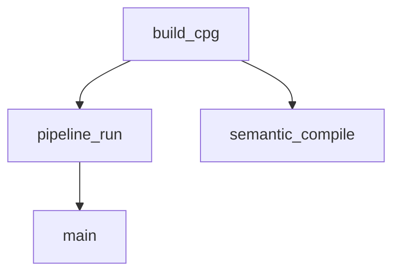
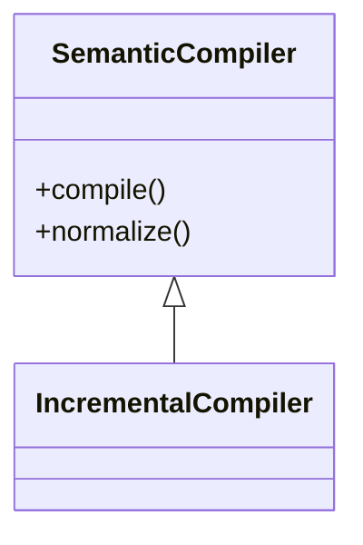

# Code Query (cq) Reference Documentation

> Version 0.1.0 | Schema: cq.v2

## Overview

Code Query (cq) is a high-signal code analysis tool designed for Claude Code. It provides structured, markdown-formatted analysis that integrates directly into the conversation context. Unlike simple grep searches, cq performs semantic analysis using Python's AST, symtable, bytecode inspection, and intelligent call resolution.

## Scope Integrity and Code Overview Metadata

- Language scope is extension-authoritative:
  - `python` scope accepts only `.py` and `.pyi`.
  - `rust` scope accepts only `.rs`.
  - `auto` scope accepts the union.
- Top-level Code Overview metadata is guaranteed by convention:
  - `summary.query` and `summary.mode` are populated for `search`, `q`, `run`, and macro outputs.
  - `run` uses synthetic metadata for mixed plans (`mode="run"`, `query="multi-step plan (<n> steps)"`).
  - macro outputs use `mode="macro:<name>"` and derive `query` from macro intent fields with argv fallback.
- Scope drops are surfaced in summary diagnostics:
  - `summary.dropped_by_scope` reports per-language candidate counts removed by strict extension filtering.

## Architecture

```
┌──────────────────────────────────────────────────────────────────┐
│                      CLI Layer (Cyclopts)                        │
│  tools/cq/cli_app/app.py → meta-app launcher → command dispatch  │
│  Global options: --root, --format, --verbose, etc.               │
└──────────────────────────────────────────────────────────────────┘
                              │
                              ▼
┌──────────────────────────────────────────────────────────────────┐
│                        Context Layer                             │
│  cli_app/context.py → CliContext (toolchain, root, format, etc.) │
│  cli_app/config.py → Config chain (TOML + env vars + CLI)        │
└──────────────────────────────────────────────────────────────────┘
                              │
                              ▼
┌──────────────────────────────────────────────────────────────────┐
│                      Command Modules                             │
│  commands/analysis.py → impact, calls, imports, etc.              │
│  commands/query.py → q command                                    │
│  commands/search.py → search command                              │
│  commands/run.py → run command                                    │
│  commands/chain.py → chain command                                │
│  commands/report.py → report command                              │
│  commands/neighborhood.py → neighborhood/nb command               │
│  commands/ldmd.py → ldmd index/get/search/neighbors              │
│  commands/admin.py → index (deprecated), cache (deprecated), schema │
└──────────────────────────────────────────────────────────────────┘
                              │
                              ▼
┌──────────────────────────────────────────────────────────────────┐
│                     Neighborhood Layer                            │
│  neighborhood/target_resolution.py → parse + resolve targets      │
│  neighborhood/bundle_builder.py → structural + LSP slice assembly │
│  neighborhood/snb_renderer.py → CqResult rendering                │
│  neighborhood/scan_snapshot.py → in-memory scan index             │
└──────────────────────────────────────────────────────────────────┘
                              │
                              ▼
┌──────────────────────────────────────────────────────────────────┐
│                         LDMD Layer                                │
│  ldmd/format.py → marker parser, indexer, section extraction      │
│  ldmd/writer.py → CqResult → LDMD marker generation              │
└──────────────────────────────────────────────────────────────────┘
                              │
                              ▼
┌──────────────────────────────────────────────────────────────────┐
│                        Run/Batch Layer                            │
│  run/loader.py → plan parsing + step conversion                   │
│  run/runner.py → step execution + merging                         │
│  query/batch.py → shared scan for q steps                          │
│  query/batch_spans.py → relational span batching                   │
└──────────────────────────────────────────────────────────────────┘
                              │
                              ▼
┌──────────────────────────────────────────────────────────────────┐
│                         Macro Layer                               │
│  macros/{impact,calls,imports,exceptions,sig_impact,...}.py       │
│  Each macro: Request dataclass → analysis → CqResult              │
│  calls: on-demand signature lookup (no full index build)          │
└──────────────────────────────────────────────────────────────────┘
                              │
                              ▼
┌──────────────────────────────────────────────────────────────────┐
│                    Index Layer (Optional)                         │
│  index/def_index.py   - Repo-wide symbol index (impact, sig-impact)│
│  index/call_resolver.py - Call target resolution (impact, sig-impact)│
│  index/arg_binder.py  - Argument → parameter binding              │
│  Note: calls uses on-demand lookup, bypasses full index build     │
└──────────────────────────────────────────────────────────────────┘
                              │
                              ▼
┌──────────────────────────────────────────────────────────────────┐
│                          Core Layer                               │
│  core/schema.py       - CqResult, Finding, Section, Anchor        │
│  core/scoring.py      - Impact/Confidence signal computation      │
│  core/findings_table.py - Polars-based filtering + rehydration    │
│  core/report.py       - Markdown rendering + section reordering   │
│  core/artifacts.py    - JSON artifact persistence + diagnostics   │
│  core/front_door_insight.py - FrontDoorInsightV1 contract + render│
│  core/toolchain.py    - External tool detection (rg, ast-grep)      │
└──────────────────────────────────────────────────────────────────┘
```

### Request Objects

CQ uses frozen `msgspec.Struct` request objects to define clean input contracts for internal operations:

| Request | Module | Purpose |
|---------|--------|---------|
| `RgRunRequest` | `search/requests.py` | Native ripgrep JSON execution input |
| `CandidateCollectionRequest` | `search/requests.py` | Raw candidate collection input |
| `PythonNodeEnrichmentRequest` | `search/requests.py` | Node-anchored Python enrichment input |
| `PythonByteRangeEnrichmentRequest` | `search/requests.py` | Byte-range Python enrichment input |
| `RustEnrichmentRequest` | `search/requests.py` | Rust enrichment input |
| `SummaryBuildRequest` | `core/requests.py` | Multi-language summary assembly with `lang_scope`, `languages`, `language_order`, `cross_language_diagnostics`, `language_capabilities`, `enrichment_telemetry` |
| `MergeResultsRequest` | `core/requests.py` | Multi-language result merge with per-language `CqResult` instances, `diagnostic_payloads`, and `language_capabilities` |

All request objects are frozen (immutable) and use `CqStruct` as their base class for consistent serialization behavior.

### Tree-Sitter Query Packs

Tree-sitter enrichment uses `.scm` query files for language-specific pattern matching:

| Query Pack | Location | Purpose |
|-----------|----------|---------|
| `enrichment_core.scm` | `search/queries/python/` | Function/class definitions, call expressions |
| `enrichment_imports.scm` | `search/queries/python/` | Import and from-import statements |
| `enrichment_locals.scm` | `search/queries/python/` | Identifiers and attribute expressions |

Query packs enable declarative pattern specification separate from enrichment logic, making it easy to extend enrichment coverage by adding new `.scm` files.

## Global Options Reference

All cq commands accept these global options, handled by the meta-app launcher.

### Option Details

| Option | Type | Env Var | Default | Description |
|--------|------|---------|---------|-------------|
| `--root` | Path | `CQ_ROOT` | Auto-detect | Repository root path. Auto-detects from current directory if not specified. |
| `--config` | Path | `CQ_CONFIG` | `.cq.toml` | Path to TOML config file. |
| `--no-config` | bool | `CQ_NO_CONFIG` | `false` | Skip loading config file entirely. |
| `--verbose`, `-v` | int | `CQ_VERBOSE` | `0` | Verbosity level (0=normal, 1=verbose, 2=debug, 3=trace). |
| `--format` | enum | `CQ_FORMAT` | `md` | Output format. See Output Formats below. |
| `--artifact-dir` | Path | `CQ_ARTIFACT_DIR` | `.cq/artifacts` | Directory for saving JSON artifacts. |
| `--no-save-artifact` | bool | `CQ_NO_SAVE_ARTIFACT` | `false` | Skip saving JSON artifacts. |

### Output Formats

| Format | Description | Use Case |
|--------|-------------|----------|
| `md` | Markdown with sections and code blocks | Claude context (default) |
| `json` | Full structured JSON | Programmatic processing |
| `both` | Markdown followed by JSON block | Debugging |
| `summary` | Single-line summary | CI/CD integration |
| `mermaid` | Mermaid flowchart syntax | Call graph visualization |
| `mermaid-class` | Mermaid class diagram syntax | Class hierarchy visualization |
| `dot` | Graphviz DOT syntax | Complex graph export |
| `ldmd` | LDMD marker-preserving markdown | Progressive disclosure for long outputs |

### Configuration Precedence

Options are resolved in this order (highest priority first):

1. **CLI flags** - Explicit command-line arguments
2. **Environment variables** - `CQ_*` prefixed variables
3. **Config file** - TOML file (`.cq.toml` or `--config` path)
4. **Defaults** - Built-in default values

### Config File Format

Create `.cq.toml` in your repository root:

```toml
[cq]
# Output format (md, json, both, summary, mermaid, mermaid-class, dot, ldmd)
format = "md"

# Verbosity level (0-3)
verbose = 0

# Artifact directory
artifact_dir = ".cq/artifacts"

# Save artifacts by default
save_artifact = true

# Default root (usually auto-detected)
# root = "/path/to/repo"
```

### Environment Variable Reference

| Variable | Type | Example |
|----------|------|---------|
| `CQ_ROOT` | path | `/home/user/project` |
| `CQ_CONFIG` | path | `/home/user/.cq.toml` |
| `CQ_NO_CONFIG` | bool | `true`, `1`, `yes` |
| `CQ_VERBOSE` | int | `0`, `1`, `2`, `3` |
| `CQ_FORMAT` | string | `md`, `json`, `mermaid` |
| `CQ_ARTIFACT_DIR` | path | `.cq/artifacts` |
| `CQ_NO_SAVE_ARTIFACT` | bool | `true`, `1`, `yes` |

---

## Schema Definitions

### CqResult (Top-level structure)

Every cq command returns a `CqResult` with these components:

| Field | Type | Description |
|-------|------|-------------|
| `run` | `RunMeta` | Invocation metadata (macro, argv, root, timing, toolchain) |
| `summary` | `dict[str, object]` | Key metrics at a glance (includes `front_door_insight` for search/calls/entity) |
| `key_findings` | `list[Finding]` | Top-level actionable insights |
| `sections` | `list[Section]` | Organized finding groups |
| `evidence` | `list[Finding]` | Supporting details (often truncated in display) |
| `artifacts` | `list[Artifact]` | Saved JSON artifact references |

### Finding

Individual analysis findings:

| Field | Type | Description |
|-------|------|-------------|
| `category` | `str` | Finding type (e.g., "call_site", "hazard", "scope") |
| `message` | `str` | Human-readable description |
| `anchor` | `Anchor \| None` | Source location: `file:line[:col]` |
| `severity` | `str` | One of: "error", "warning", "info" |
| `details` | `DetailPayload` | Structured metadata including scoring |

### Anchor

Source code location:

| Field | Type | Description |
|-------|------|-------------|
| `file` | `str` | Relative file path from repo root |
| `line` | `int` | 1-indexed line number |
| `col` | `int \| None` | 0-indexed column offset |
| `end_line` | `int \| None` | End line for spans |
| `end_col` | `int \| None` | End column for spans |

### ScoreDetails

Structured scoring metadata attached to findings via `DetailPayload`:

| Field | Type | Description |
|-------|------|-------------|
| `impact_score` | `float \| None` | Computed impact score (0.0-1.0) |
| `impact_bucket` | `str \| None` | Bucket label: "high", "med", or "low" |
| `confidence_score` | `float \| None` | Computed confidence score (0.0-1.0) |
| `confidence_bucket` | `str \| None` | Bucket label: "high", "med", or "low" |
| `evidence_kind` | `str \| None` | Evidence type backing the finding |

### DetailPayload

Structured details payload for findings (replaces legacy `dict[str, Any]`):

| Field | Type | Description |
|-------|------|-------------|
| `kind` | `str \| None` | Finding detail kind (e.g., "call_site", "import") |
| `score` | `ScoreDetails \| None` | Structured scoring metadata |
| `data` | `dict[str, object]` | Arbitrary additional data fields |

`DetailPayload` supports mapping-style access (`get`, `__getitem__`, `__contains__`) and provides `from_legacy()` for backward-compatible conversion from unstructured dicts. Score fields (`impact_score`, `confidence_score`, etc.) are transparently delegated to the nested `ScoreDetails`.

---

## Scoring System

### Impact Score (0.0 - 1.0)

Computed as weighted sum of normalized signals:

| Signal | Weight | Normalizer | Description |
|--------|--------|------------|-------------|
| `sites` | 45% | /100 | Number of affected call/usage sites |
| `files` | 25% | /20 | Number of affected files |
| `depth` | 15% | /10 | Propagation depth (taint analysis) |
| `breakages` | 10% | /10 | Breaking changes count |
| `ambiguities` | 5% | /10 | Uncertain/forwarding cases |

**Severity multiplier** (optional):
- `error`: 1.5x
- `warning`: 1.0x
- `info`: 0.5x

### Confidence Score (0.0 - 1.0)

Based on evidence quality:

| Evidence Kind | Score | Description |
|---------------|-------|-------------|
| `resolved_ast` | 0.95 | Full AST analysis with symbol resolution |
| `bytecode` | 0.90 | Bytecode inspection |
| `resolved_ast_heuristic` | 0.75 | AST with heuristic matching |
| `bytecode_heuristic` | 0.75 | Bytecode with heuristics |
| `cross_file_taint` | 0.70 | Multi-file taint propagation |
| `heuristic` | 0.60 | Pattern matching only |
| `rg_only` | 0.45 | Ripgrep text search only |
| `unresolved` | 0.30 | Unverified/fallback |

### Bucket Thresholds

| Bucket | Threshold |
|--------|-----------|
| `high` | >= 0.7 |
| `med` | >= 0.4 |
| `low` | < 0.4 |

---

## Commands Reference

### search - Smart Search (Code Discovery)

The default tool for finding code patterns with semantic enrichment.

```bash
/cq search <QUERY> [--regex] [--literal] [--in DIR] [--include-strings]
```

**Query Modes:**
| Mode | Flag | Pattern |
|------|------|---------|
| Identifier | (default) | Word-boundary: `\bquery\b` |
| Regex | `--regex` | User regex pattern |
| Literal | `--literal` | Exact string match |

**Options:**
| Option | Description |
|--------|-------------|
| `--in DIR` | Restrict search to directory |
| `--include-strings` | Include matches in strings/comments/docstrings |
| `--include PATTERN` | Include files matching glob |
| `--exclude PATTERN` | Exclude files matching glob |

All commands support filtering options; see **Filtering Options** for details.

**How it works:**
1. **Candidate Generation**: Native rg process scans files for pattern matches
2. **Heuristic Classification**: O(1) line-based pattern detection (comment, import, def)
3. **AST Classification**: ast-grep-py node lookup for structural context
4. **Symtable Enrichment**: Optional scope analysis for high-value matches
5. **Result Assembly**: Grouped by containing function, ranked by relevance
6. **Enrichment Pipeline**: 5-stage enrichment (ast_grep, python_ast, import_detail, libcst, tree_sitter)

**Parallel Classification:**

For large result sets, the classification phase runs in parallel:
- Matches are partitioned by file
- Up to 4 worker processes classify partitions concurrently
- Worker pools run with multiprocessing `spawn` context (safe in multi-threaded parents)
- Results are merged back in original order
- On any worker failure, classification falls back to sequential processing

**Classification Categories:**
| Category | Description |
|----------|-------------|
| `definition` | Function/class/method definitions |
| `callsite` | Function/method calls |
| `import`, `from_import` | Import statements |
| `reference` | Name/attribute access |
| `assignment` | Variable assignments |
| `annotation` | Type hints |
| `docstring_match` | In docstrings (hidden by default) |
| `comment_match` | In comments (hidden by default) |
| `string_match` | In string literals (hidden by default) |

**Relevance Scoring:**
- Kind weights: definition (1.0) > callsite (0.8) > import (0.7) > reference (0.6)
- File role: src/ > tests/ > docs/
- Confidence from classification evidence

**Output sections** (Insight Card and Code Overview are rendered before section reordering; remaining sections follow `_SECTION_ORDER_MAP`):
- Insight Card: FrontDoorInsightV1 card (target, neighborhood, risk) when a top definition exists
- Code Overview: query/mode/language scope/top symbols/top files/categories
- Target Candidates: top definitions
- Neighborhood Preview: caller/callee/reference totals and previews
- Definitions: function/class definitions (identifier mode)
- Top Contexts: grouped by containing function
- Imports: import statements
- Callsites: function calls
- Uses by Kind: category counts
- Non-Code Matches (Strings / Comments / Docstrings): strings/comments (collapsed)
- Hot Files: files with most matches
- Suggested Follow-ups: next commands
- Cross-Language Diagnostics: cross-language scope/capability diagnostics

**Examples:**
```bash
# Find all uses of build_graph
/cq search build_graph

# Find config patterns with regex
/cq search "config.*path" --regex

# Search only in core directory
/cq search CqResult --in tools/cq/core

# Include documentation matches
/cq search api_key --include-strings

# Plain query fallback (same result)
/cq q build_graph
```

---

## Multi-Source Python Enrichment Pipeline

Smart search results include deep semantic enrichment from multiple analysis sources. Each Python match undergoes a 5-stage enrichment pipeline that extracts complementary information from different analysis tools.

### Enrichment Stages

| Stage | Source | What It Provides |
|-------|--------|-----------------|
| `ast_grep` | ast-grep-py | Node kind, enclosing scope, symbol role, structural context |
| `python_ast` | Python `ast` module | AST node type, scope nesting, decorator context |
| `import_detail` | Python `ast` import visitor | Module path, alias resolution, import form |
| `libcst` | LibCST metadata providers | Qualified names, scope analysis, binding candidates, expression context |
| `tree_sitter` | tree-sitter with query packs | Parse quality metrics, structural pattern matches, syntax validation |

### Enrichment Payload Structure

Each enriched finding carries a structured payload organized into semantic sections:

| Section | Purpose | Key Fields |
|---------|---------|------------|
| `meta` | Pipeline metadata | `enrichment_status`, `stage_status`, `stage_timings_ms` |
| `resolution` | Symbol resolution | `qualified_name_candidates`, `binding_candidates`, `import_alias_chain`, `call_target` |
| `behavior` | Runtime behavior flags | `has_await`, `has_yield`, `has_raise`, `in_try`, `in_except`, `in_with`, `in_loop` |
| `structural` | Code structure | `enclosing_callable`, `enclosing_class`, `nesting_depth`, `decorator_list` |
| `parse_quality` | Source quality metrics | `syntax_valid`, `parse_error_count`, `tree_sitter_node_count` |
| `agreement` | Cross-source validation | `status` ("full"/"partial"/"conflict"), `sources_agree`, `sources_disagree` |

### Stage Status Tracking

Each stage reports its outcome:

| Status | Meaning |
|--------|---------|
| `applied` | Stage ran successfully and contributed data |
| `degraded` | Stage ran but with partial results (e.g., parse error) |
| `skipped` | Stage was not applicable or was disabled |
| `error` | Stage failed (error isolated, other stages unaffected) |

### Cross-Source Agreement

When multiple enrichment sources analyze the same construct, their results are cross-checked:

- **full**: All 3 sources (ast_grep, libcst, tree_sitter) agree on the classification
- **partial**: Some sources agree, others differ or were unavailable
- **conflict**: Sources produced contradictory results (investigate manually)

Agreement tracking helps identify ambiguous code patterns where static analysis tools disagree, signaling areas that may need manual review.

### PythonAnalysisSession

To avoid redundant parsing, cq caches per-file analysis artifacts in a `PythonAnalysisSession`:

- ast-grep root node and node index
- Python AST tree and symtable
- LibCST wrapper with metadata providers
- tree-sitter parse tree

Sessions are keyed by content hash with a maximum cache of 64 entries. When multiple findings reference the same file, they share a single session, significantly reducing parse overhead.

### Environment Controls

| Variable | Default | Description |
|----------|---------|-------------|
| `CQ_PY_ENRICHMENT_CROSSCHECK` | `0` | Emit Python cross-source mismatch payloads when set to `1` |
| `CQ_RUST_ENRICHMENT_CROSSCHECK` | `0` | Emit Rust ast-grep/tree-sitter mismatch payloads when set to `1` |

---

## Advanced LSP Enrichment Planes

CQ includes implemented advanced enrichment planes under `tools/cq/search/` that provide deeper semantic analysis via LSP servers. All planes are capability-gated and fail-open: they enrich outputs without blocking core search/query/run execution.

### Semantic Overlays (`semantic_overlays.py`)

Normalized semantic tokens and inlay hints from LSP servers.

| Type | Description |
|------|-------------|
| `SemanticTokenSpanV1` | Decoded token with resolved type/modifier names: `line`, `start_char`, `length`, `token_type`, `modifiers` |
| `SemanticTokenBundleV1` | Atomic bundle: position encoding, server legend (token types/modifiers), raw data stream, decoded token rows |
| `InlayHintV1` | Type/parameter hints from LSP inlay hint responses |

### Diagnostics Pull (`diagnostics_pull.py`)

Shared pull-diagnostics helpers for `textDocument/diagnostic` and `workspace/diagnostic`.

| Function | Description |
|----------|-------------|
| `pull_text_document_diagnostics()` | Pull per-file diagnostics via `textDocument/diagnostic` |
| `pull_workspace_diagnostics()` | Workspace-level diagnostics via `workspace/diagnostic` |

Both functions are capability-gated (check `_supports_method()`) and return `None` when the server does not support the protocol.

### Refactor Actions (`refactor_actions.py`)

Code action bridge for diagnostics + resolve/execute workflows.

| Type | Description |
|------|-------------|
| `PrepareRenameResultV1` | Result of `textDocument/prepareRename`: rename range + placeholder + `can_rename` flag |
| `DiagnosticItemV1` | Normalized diagnostic with action-bridge fidelity fields: URI, message, severity, range, code, source |

### Rust Extensions (`rust_extensions.py`)

Rust-analyzer specific extensions with fail-open behavior.

| Type | Description |
|------|-------------|
| `RustMacroExpansionV1` | Result of `rust-analyzer/expandMacro`: name, expanded text, byte length |
| `RustRunnableV1` | Normalized runnable from `rust-analyzer/runnables`: label, kind (cargo/test/bench), args, location |

---

## Pyrefly LSP Integration

CQ integrates with Pyrefly (Python type checker) for symbol grounding, call graph, and type contract enrichment.

**Architecture modules:**

| Module | Purpose |
|--------|---------|
| `search/pyrefly_lsp.py` | Pyrefly LSP session management and enrichment orchestration |
| `search/pyrefly_contracts.py` | Typed contract structs for Pyrefly enrichment payloads |
| `search/pyrefly_capability_gates.py` | Capability gating for Pyrefly features |

**Key contract types:**

| Type | Description |
|------|-------------|
| `PyreflyTarget` | Location target row: kind, uri, file, line, col |
| `PyreflySymbolGrounding` | Grounding targets for one anchor: definition, declaration, type definition, implementation targets |
| `PyreflyTypeContract` | Resolved type/call signature: resolved type, callable signature, parameters, return type, generics, async/generator flags |
| `PyreflyCallGraphEdge` | Incoming/outgoing call graph row: symbol, file, line, col |
| `PyreflyOverview` | Aggregate summary for code-overview rendering: primary symbol, caller/callee counts, implementations, diagnostics |
| `PyreflyTelemetry` | Execution telemetry: attempted, applied, failed, skipped, timed out counts |

---

## Rust LSP Integration

CQ integrates with rust-analyzer for Rust symbol grounding, call/type hierarchies, document symbols, and diagnostics.

**Architecture modules:**

| Module | Purpose |
|--------|---------|
| `search/rust_lsp.py` | Rust-analyzer LSP session management and enrichment |
| `search/rust_lsp_contracts.py` | Typed contract structs for Rust LSP payloads |

**Key contract types:**

| Type | Description |
|------|-------------|
| `LspCapabilitySnapshotV1` | Typed capability snapshot: server, client, and experimental capabilities |
| `LspSessionEnvV1` | LSP session envelope: server name/version, position encoding, capabilities, health, quiescent state |
| `RustDiagnosticV1` | Normalized LSP diagnostic: URI, range, severity, code, source, message, related info, data passthrough |
| `RustSymbolGrounding` | Symbol grounding bundle: definitions, type definitions, implementations, references |
| `RustCallGraph` | Call graph bundle: incoming callers + outgoing callees |
| `RustTypeHierarchy` | Type hierarchy bundle: supertypes + subtypes |
| `RustLspEnrichmentPayload` | Unified Rust LSP enrichment payload: session env, grounding, call graph, type hierarchy, document symbols, diagnostics, hover text |

---

## Enrichment Contracts

Typed enrichment contracts shared across Python and Rust pipelines (`search/enrichment/contracts.py`):

| Type | Description |
|------|-------------|
| `EnrichmentMeta` | Common metadata: language, status (`applied`/`degraded`/`skipped`/`error`), sources, degrade reason, payload size hint, dropped/truncated fields |
| `PythonEnrichmentPayload` | Typed Python enrichment wrapper: `meta: EnrichmentMeta` + `data: dict[str, object]` |
| `RustEnrichmentPayload` | Typed Rust enrichment wrapper: `meta: EnrichmentMeta` + `data: dict[str, object]` |

These contracts ensure consistent enrichment metadata across language boundaries while allowing flexible data payloads.

---

## Code Facts Rendering in Markdown Output

When using markdown format (`--format md`), each finding renders enrichment as a
**Code Facts** block (not tables). Code Facts appears immediately below the finding
line and before the context snippet.

### Code Facts Clusters

Each finding is grouped into stable clusters:

| Cluster | Purpose |
|---------|---------|
| **Identity** | Language, symbol role, qualified names, binding candidates |
| **Scope** | Enclosing callable/class, import alias chain, visibility |
| **Interface** | Signature, parameters, return type, attributes/decorators |
| **Behavior** | Async/generator, await/yield, raise/control-flow context |
| **Structure** | Shape-oriented fields (struct/enum metadata where available) |

The renderer uses language-specific enrichment for each finding:
- Python findings render Python enrichment payloads.
- Rust findings render Rust enrichment payloads.
- The opposite language payload is not materialized for that finding.

### N/A Semantics

Missing values are rendered explicitly:

| Value | Meaning |
|-------|---------|
| `N/A — not applicable` | Source field/section not applicable for this finding |
| `N/A — not resolved` | Source ran but no confident value was resolved |
| `N/A — enrichment unavailable` | Enrichment payload was unavailable for this finding |

Use these meanings to guide follow-up actions:
- `not applicable`: expected absence (language/kind mismatch); usually no follow-up required.
- `not resolved`: applicable but unresolved; narrow scope (`--in`), run structural query (`q pattern=...`), or inspect nearby symbols/imports.
- `enrichment unavailable`: enrichment did not run or failed-open; retry with focused input (single file/symbol) to improve enrichment coverage.

### Placement and Prioritization

- Code-first content appears near the top of each finding (`Code Facts`, then `Context`).
- Residual compact `Details` are rendered after context.
- Tooling/diagnostic metadata stays in summary/footer (`scan_method`, telemetry, capabilities).

---

## Render-Time Enrichment

For findings that were not enriched during the initial search phase (e.g., from macro commands), cq performs on-demand enrichment at markdown render time.

### How It Works

1. During `render_markdown()`, findings without enrichment data are identified
2. A pre-computation pass collects enrichment for up to 9 unique files (`MAX_RENDER_ENRICH_FILES`)
3. Enrichment runs in parallel via `ProcessPoolExecutor` with up to 4 workers using `spawn`
4. Results are cached by `(file, line, col, language)` tuple
5. Each finding is then rendered with `Code Facts` clusters

### Limitations

- Limited to the first 9 files encountered (original anchor file + next 8)
- Findings in files beyond this limit render without render-time enrichment
- Parallel workers are capped at 4 to avoid resource contention

---

## Enrichment Telemetry

Smart search results include telemetry data about the enrichment pipeline's performance.

### Telemetry Fields

Telemetry lives under `summary.enrichment_telemetry` in markdown summary JSON.

| Field | Description |
|-------|-------------|
| `summary.enrichment_telemetry.python.applied` | Python findings that received enrichment |
| `summary.enrichment_telemetry.python.degraded` | Python findings with partial/degraded enrichment |
| `summary.enrichment_telemetry.python.skipped` | Python findings skipped for enrichment |
| `summary.enrichment_telemetry.python.stages.*` | Per-stage breakdown (ast_grep, python_ast, import_detail, libcst, tree_sitter) |
| `summary.enrichment_telemetry.rust.applied` | Rust findings that received enrichment |
| `summary.enrichment_telemetry.rust.degraded` | Rust findings with partial/degraded enrichment |
| `summary.enrichment_telemetry.rust.skipped` | Rust findings skipped for enrichment |
| `summary.enrichment_telemetry.rust.cache_hits/misses/evictions` | Rust enrichment cache behavior |

### Per-Stage Metrics

Each stage in `summary.enrichment_telemetry.python.stages` reports:

| Metric | Description |
|--------|-------------|
| `applied` | Number of findings this stage enriched |
| `degraded` | Number of findings with degraded results |
| `skipped` | Number of findings this stage skipped |
| `summary.enrichment_telemetry.python.timings_ms.<stage>` | Total wall-clock time for that stage |

### Cache Statistics

When Python tree-sitter caching is active:

| Metric | Description |
|--------|-------------|
| `summary.enrichment_telemetry.python.tree_sitter_cache.cache_hits` | Tree-sitter parse cache reused |
| `summary.enrichment_telemetry.python.tree_sitter_cache.cache_misses` | New tree-sitter parse entries created |
| `summary.enrichment_telemetry.python.tree_sitter_cache.cache_evictions` | Cache evictions due to bounded size |

### Using Telemetry

Telemetry helps diagnose enrichment issues:
- High `degraded` counts suggest parse errors in source files
- High `skipped` counts for a stage may indicate missing dependencies
- Stage timing helps identify enrichment bottlenecks
- Cache hit rates show session reuse efficiency

---

## Front-Door Insight Contract (FrontDoorInsightV1)

Front-door commands (`search`, `calls`, `entity`) embed a shared `FrontDoorInsightV1` contract in `summary["front_door_insight"]`. This provides agents with immediate target identity, neighborhood context, risk assessment, and confidence in a single consistent schema.

**Module:** `tools/cq/core/front_door_insight.py` (~1022 lines)

### Type Aliases

| Alias | Type | Values |
|-------|------|--------|
| `InsightSource` | `Literal` | `"search"`, `"calls"`, `"entity"` |
| `Availability` | `Literal` | `"full"`, `"partial"`, `"unavailable"` |
| `NeighborhoodSource` | `Literal` | `"structural"`, `"lsp"`, `"heuristic"`, `"none"` |
| `RiskLevel` | `Literal` | `"low"`, `"med"`, `"high"` |
| `LspStatus` | `Literal` | `"unavailable"`, `"skipped"`, `"failed"`, `"partial"`, `"ok"`, `"none"` |

### Schema

```text
FrontDoorInsightV1:
  source: InsightSource
  target: InsightTargetV1
    symbol: str
    kind: str = "unknown"
    location: InsightLocationV1 (file, line, col)
    signature: str | None
    qualname: str | None
    selection_reason: str
  neighborhood: InsightNeighborhoodV1
    callers: InsightSliceV1 (total, preview, availability, source, overflow_artifact_ref)
    callees: InsightSliceV1
    references: InsightSliceV1
    hierarchy_or_scope: InsightSliceV1
  risk: InsightRiskV1
    level: RiskLevel = "low"
    drivers: tuple[str, ...]
    counters: InsightRiskCountersV1
      callers, callees, files_with_calls, arg_shape_count,
      forwarding_count, hazard_count, closure_capture_count
  confidence: InsightConfidenceV1
    evidence_kind: str = "unknown"
    score: float = 0.0
    bucket: str = "low"
  degradation: InsightDegradationV1
    lsp: LspStatus = "none"
    scan: str = "ok"
    scope_filter: str = "none"
    notes: tuple[str, ...]
  budget: InsightBudgetV1
    top_candidates: int = 3
    preview_per_slice: int = 5
    lsp_targets: int = 1
  artifact_refs: InsightArtifactRefsV1
    diagnostics: str | None
    telemetry: str | None
    neighborhood_overflow: str | None
  schema_version: str = "cq.insight.v1"
```

### Risk Computation

Risk level is computed deterministically by `_risk_level_from_counters()`:

- **high**: callers > 10 OR hazard_count > 0 OR (forwarding_count > 0 AND callers > 0)
- **med**: callers > 3 OR arg_shape_count > 3 OR files_with_calls > 3 OR closure_capture_count > 0
- **low**: all other cases

Risk drivers are explicit strings: `high_call_surface`, `medium_call_surface`, `argument_forwarding`, `dynamic_hazards`, `arg_shape_variance`, `closure_capture`.

### Builder Functions

| Function | Source Command | Key Inputs |
|----------|---------------|------------|
| `build_search_insight()` | search | Top definition, neighborhood counts, risk/confidence/degradation |
| `build_calls_insight()` | calls | Resolved target, call census, callee extraction |
| `build_entity_insight()` | entity (q) | Top entity result, mini-neighborhood counts |

### Cross-Language Stability (Delta E)

`mark_partial_for_missing_languages()` ensures stable `InsightSliceV1` keys across all language scopes. When languages are missing, slices are marked `availability="partial"` or `"unavailable"` with explicit `source` markers rather than being omitted. Degradation notes list the missing languages.

### Rendering

The Insight Card is rendered as the **first section** in markdown output (after the title), via `_render_insight_card_from_summary()` in `report.py`. It shows:
- Target symbol, kind, location, signature
- Neighborhood totals (callers, callees, references, hierarchy)
- Risk level and drivers
- Confidence bucket and evidence kind
- Degradation status (LSP, scan, scope filter)

---

## Artifact-First Diagnostics

Heavy diagnostic payloads are offloaded to `.cq/artifacts/` and replaced by compact status lines in rendered output.

### Offloaded Keys (ARTIFACT_ONLY_KEYS)

| Key | Contents |
|-----|----------|
| `enrichment_telemetry` | Per-language per-stage enrichment metrics |
| `pyrefly_telemetry` | Pyrefly LSP execution telemetry |
| `pyrefly_diagnostics` | Full Pyrefly diagnostic list |
| `language_capabilities` | Per-language capability matrix |
| `cross_language_diagnostics` | Cross-language diagnostic events |

### Compact Summary

`compact_summary_for_rendering()` splits the summary dict into a compact display dict (with status lines replacing heavy payloads) and offloaded `(key, payload)` pairs for artifact persistence.

### Artifact Types

| Type | Function | Suffix | Contents |
|------|----------|--------|----------|
| Result | `save_artifact_json()` | `result` | Full CqResult as JSON |
| Diagnostics | `save_diagnostics_artifact()` | `diagnostics` | Offloaded diagnostic payloads |
| Neighborhood Overflow | `save_neighborhood_overflow_artifact()` | `neighborhood_overflow` | Truncated preview slices with full data |

Artifact filenames: `{macro}_{suffix}_{timestamp}_{run_id}.json`

Default directory: `.cq/artifacts/` (configurable via `--artifact-dir`)

### Section Reordering

Front-door commands use `_SECTION_ORDER_MAP` to reorder sections for optimal signal density:

The Insight Card is rendered independently **before** section reordering (directly after the title), via `_render_insight_card_from_summary()`. The `_SECTION_ORDER_MAP` controls the remaining sections:

**search:** Target Candidates → Neighborhood Preview → Definitions → Top Contexts → Imports → Callsites → Uses by Kind → Non-Code Matches (Strings / Comments / Docstrings) → Hot Files → Suggested Follow-ups → Cross-Language Diagnostics

**calls:** Neighborhood Preview → Target Callees → Argument Shape Histogram → Hazards → Keyword Argument Usage → Calling Contexts → Call Sites

Sections not in the order map are appended at the end.

---

### impact - Parameter Taint Analysis

Traces data flow from a function parameter to identify downstream consumers.

```bash
/cq impact <FUNCTION_NAME> --param <PARAM_NAME> [--depth N]
```

**How it works:**
1. Builds `DefIndex` of all functions/classes in repo
2. Finds function by name or qualified name (`Class.method`)
3. Initializes taint set with the specified parameter
4. Walks function AST, propagating taint through:
   - Assignments (`x = param` → x is tainted)
   - Calls with tainted args → records call site
   - Returns with tainted values → marks return as tainted
5. Recursively analyzes callees where tainted args are passed
6. Also finds callers via ripgrep for broader impact

**Taint propagation rules:**
- `ast.Name` → tainted if identifier in taint set
- `ast.Attribute` → tainted if receiver is tainted
- `ast.Subscript` → tainted if base or slice is tainted
- `ast.BinOp`, `ast.UnaryOp` → tainted if operand(s) tainted
- `ast.Call` → tainted if any arg tainted
- `ast.IfExp`, `ast.Compare`, `ast.BoolOp` → tainted if any branch tainted
- `ast.JoinedStr` (f-strings) → tainted if any value tainted
- Comprehensions → tainted if iterating over tainted data

**Output sections:**
- Summary: sites, files, max depth
- Key Findings: taint propagation summary by depth
- Taint Sites by kind (assign, call, return)
- Callers via ripgrep
- Evidence

**Example:**
```bash
/cq impact build_graph_product --param repo_root --depth 5
```

---

### calls - Call Site Census

Finds all call sites for a function with argument shape analysis and context enrichment.

```bash
/cq calls <FUNCTION_NAME>
```

**How it works:**
1. Uses ripgrep to pre-filter files containing `function_name(`
2. Uses on-demand signature lookup (parses only the definition file, not full repo)
3. Parses candidate files with AST via ast-grep
4. `CallFinder` visitor matches calls by name or qualified name
5. Analyzes each call for:
   - Number of positional/keyword arguments
   - Keyword argument names used
   - `*args`/`**kwargs` forwarding
   - Calling context (containing function)
   - Argument preview string
   - Context window with source snippet

**Performance:** The on-demand signature lookup avoids a full repository scan. Instead of parsing all Python files to build a complete index, cq finds only the file containing the function definition and extracts the signature from that single file.

**Output sections** (Insight Card is rendered before section reordering; remaining sections follow `_SECTION_ORDER_MAP`):
- Insight Card: FrontDoorInsightV1 card (target + call surface, risk, neighborhood)
- Neighborhood Preview: target callees preview
- Target Callees: functions called by the target
- Argument Shape Histogram: distribution of arg patterns
- Hazards: promoted above long callsite list
- Keyword Argument Usage: which kwargs used how often
- Calling Contexts: which functions call this one
- Call Sites: detailed list with previews and context

**Example:**
```bash
/cq calls build_graph_product
/cq calls render_markdown
```

**Enrichment Fields:**

Each call site includes enrichment data for deeper analysis:

| Field | Description |
|-------|-------------|
| `context_window` | Line range of containing function (`start_line`, `end_line`) |
| `context_snippet` | Source code of the containing function (truncated if >30 lines) |
| `symtable_info` | Symbol table analysis for the containing scope |
| `bytecode_info` | Bytecode-level analysis of the call site |

**context_window structure:**

| Key | Type | Description |
|-----|------|-------------|
| `start_line` | int | First line of containing function definition |
| `end_line` | int | Last line of containing function definition |

**context_snippet:**

The context snippet provides the actual source code of the containing function, using a smart block selection algorithm:

1. **Docstring skipping**: Leading docstrings are omitted to focus on logic
2. **Function header**: The `def` line and signature are always included
3. **Anchor block**: Lines around the actual call site (the match line) are prioritized
4. **Omission markers**: Gaps between included blocks show `# ... omitted (N lines) ...`

This approach ensures the most relevant code is visible even in long functions, with the call site itself always shown in context rather than being truncated away.

**symtable_info structure:**

| Key | Type | Description |
|-----|------|-------------|
| `is_closure` | bool | Whether the containing function is a closure |
| `free_vars` | list[str] | Variables captured from enclosing scope |
| `globals_used` | list[str] | Global variable references |
| `nested_scopes` | int | Count of nested function definitions |

**bytecode_info structure:**

| Key | Type | Description |
|-----|------|-------------|
| `load_globals` | list[str] | Global names loaded near the call |
| `load_attrs` | list[str] | Attribute accesses near the call |
| `call_functions` | list[str] | Other function calls in the context |

---

### imports - Import Structure Analysis

Analyzes module import structure with optional cycle detection.

```bash
/cq imports [--cycles] [--module <MODULE>]
```

**How it works:**
1. Scans all Python files for import statements
2. Builds import graph (module → imported modules)
3. If `--cycles`: runs DFS-based cycle detection
4. If `--module`: focuses analysis on specific module

**Output sections:**
- Summary: modules scanned, imports found
- Import Cycles (if detected)
- Module Dependencies
- Evidence

**Example:**
```bash
/cq imports --cycles
/cq imports --module src.relspec
```

---

### exceptions - Exception Handling Analysis

Analyzes exception handling patterns across the codebase.

```bash
/cq exceptions [--function <FUNCTION>]
```

**How it works:**
1. Walks AST for all files (or focused function)
2. Records `raise` statements with exception types
3. Records `try/except` handlers with caught types
4. Identifies bare `except:` clauses (potential hazard)
5. Detects exception chaining (`raise ... from ...`)

**Output sections:**
- Summary: raises, catches, bare excepts
- Raised Exceptions by type
- Caught Exceptions by type
- Bare Except Clauses (warnings)
- Exception Chaining
- Evidence

**Example:**
```bash
/cq exceptions
/cq exceptions --function cmd_impact
```

---

### sig-impact - Signature Change Analysis

Simulates a signature change and classifies call sites.

```bash
/cq sig-impact <FUNCTION_NAME> --to "<new_signature>"
```

**How it works:**
1. Parses new signature into `SigParam` list
2. Finds all call sites using `calls` infrastructure
3. Classifies each call site:
   - `would_break`: Missing required param, excess positional args, unknown keyword
   - `ambiguous`: Uses `*args`/`**kwargs` (can't verify statically)
   - `ok`: Compatible with new signature

**Signature parsing:**
- Extracts parameter names, defaults, keyword-only status
- Handles `*args`, `**kwargs`, positional-only (`/`)

**Output sections:**
- Summary: call sites, would_break, ambiguous, ok counts
- Key Findings: breakage/compatibility summary
- Would Break Sites (with specific reasons)
- Ambiguous Sites
- OK Sites
- Evidence

**Example:**
```bash
/cq sig-impact _find_repo_root --to "_find_repo_root(start: Path | None = None, *, strict: bool = False)"
```

---

### side-effects - Import-Time Side Effects

Detects side effects at module import time.

```bash
/cq side-effects [--max-files <N>]
```

**How it works:**
1. Scans module-level code (outside functions/classes)
2. Detects:
   - Top-level function calls
   - Global variable mutations
   - Ambient state access (sys.path, os.environ, etc.)
   - Module-level I/O operations

**Output sections:**
- Summary: files scanned, effects found
- Side Effects by type
- Files with Effects
- Evidence

**Example:**
```bash
/cq side-effects --max-files 500
```

---

### scopes - Closure Scope Analysis

Uses Python's `symtable` to analyze scope capture for closures.

```bash
/cq scopes <FILE_OR_SYMBOL>
```

**How it works:**
1. Resolves target to file(s) containing symbol
2. Builds symbol table with `symtable.symtable()`
3. Recursively extracts scope info:
   - `free_vars`: Variables captured from enclosing scope
   - `cell_vars`: Variables provided to nested scopes
   - `nonlocals`: Explicit `nonlocal` declarations
   - `globals_used`: Global variable references

**Use case:** Before extracting a nested function, check if it captures variables that would break when moved.

**Output sections:**
- Summary: files analyzed, scopes with captures
- Key Findings: closure count, provider count, nonlocal usage
- Scope Capture Details
- Evidence

**Example:**
```bash
/cq scopes tools/cq/macros/impact.py
/cq scopes TaintVisitor
```

---

### bytecode-surface - Bytecode Analysis

Analyzes Python bytecode for hidden dependencies.

```bash
/cq bytecode-surface <FILE_OR_SYMBOL> [--show <categories>]
```

**Show categories:**
- `globals`: Global name loads (`LOAD_GLOBAL`)
- `attrs`: Attribute access (`LOAD_ATTR`, `STORE_ATTR`)
- `constants`: Constant values (`LOAD_CONST`)
- `opcodes`: Opcode frequency analysis

Default: `globals,attrs,constants`

**How it works:**
1. Compiles source to bytecode
2. Uses `dis` module to disassemble
3. Extracts:
   - Global variable references (including builtins)
   - Attribute access patterns
   - Constant values embedded in bytecode
   - Opcode distribution

**Use case:** Finding hidden dependencies that aren't visible in import statements (e.g., globals accessed via `eval`, dynamic attribute access).

**Output sections:**
- Summary: file, opcodes analyzed
- Global References
- Attribute Access
- Constants
- Evidence

**Example:**
```bash
/cq bytecode-surface tools/cq/macros/calls.py --show globals,attrs
```

---

### neighborhood / nb - Semantic Neighborhood Analysis

Builds a semantic neighborhood around a target location or symbol and returns structural plus LSP-backed slices.

```bash
/cq neighborhood <TARGET> [--lang python|rust] [--top-k N] [--no-lsp]
/cq nb <TARGET> [--lang python|rust] [--top-k N] [--no-lsp]
```

**Target Formats:**

| Format | Example | Description |
|--------|---------|-------------|
| `file:line` | `src/foo.py:120` | File with line number |
| `file:line:col` | `src/foo.py:120:4` | File with line and column |
| `symbol` | `build_graph_product` | Symbol name (resolved via scan snapshot) |

**Options:**

| Option | Default | Description |
|--------|---------|-------------|
| `--lang` | `python` | Query language (`python` or `rust`) |
| `--top-k` | `10` | Maximum items per slice |
| `--no-lsp` | `false` | Disable LSP enrichment |

**How it works:**

1. **Scan**: ast-grep scans the repository to build a `ScanSnapshot` (in-memory index)
2. **Resolve**: `parse_target_spec()` + `resolve_target()` determine the anchor location
   - File:line targets resolve directly
   - Symbol targets use scan snapshot with deterministic fallback
3. **Bundle Build**: `build_neighborhood_bundle()` assembles slices:
   - **Structural slices**: definitions, references, call sites, imports from scan snapshot
   - **LSP slices** (when enabled): references, implementations, supertypes, subtypes via LSP adapters
4. **Render**: `render_snb_result()` converts `SemanticNeighborhoodBundleV1` to `CqResult`

**Resolution Cascade:**

The target resolver follows a deterministic cascade:
1. Parse target spec (file:line:col or symbol)
2. For file targets: validate file exists, resolve line/col
3. For symbol targets: search scan snapshot, apply tie-breaking (prefer definitions over references)
4. Record degrade events when resolution requires fallback

**Structural Slice Kinds:**

| Kind | Description |
|------|-------------|
| `definitions` | Symbol definitions near the target |
| `references` | References to/from the target symbol |
| `call_sites` | Call expressions involving the target |
| `imports` | Import statements related to the target |

**LSP Slice Kinds (capability-gated):**

| Kind | Python (Pyrefly) | Rust (rust-analyzer) |
|------|-------------------|---------------------|
| `references` | Yes | Yes |
| `implementations` | Yes | Yes |
| `supertypes` | Yes | Yes (type hierarchy) |
| `subtypes` | Yes | Yes (type hierarchy) |
| `hover` | No | Yes |
| `diagnostics` | No | Yes |

**Run Step Format:**

```json
{"type": "neighborhood", "target": "src/foo.py:120:4", "lang": "python", "top_k": 10, "no_lsp": false}
```

**Examples:**

```bash
# Analyze neighborhood of a specific line
/cq neighborhood tools/cq/search/rust_lsp.py:745:1

# Symbol-first resolution
/cq nb build_graph_product

# Rust target with LSP disabled
/cq neighborhood rust/src/lib.rs:50 --lang rust --no-lsp

# In a run plan
/cq run --steps '[{"type":"neighborhood","target":"src/foo.py:120:4","top_k":8}]'
```

---

### ldmd - Progressive Disclosure Protocol

LDMD (LLM-friendly Markdown) provides progressive section retrieval for large CQ output artifacts. It uses structured markers to index, search, and extract sections with depth and mode controls.

```bash
/cq ldmd <subcommand> <PATH> [options]
```

**Subcommands:**

| Subcommand | Description |
|------------|-------------|
| `index` | Index an LDMD document and return section metadata |
| `get` | Extract content from a section by ID |
| `search` | Search within LDMD sections |
| `neighbors` | Get neighboring sections for navigation |

**LDMD Marker Grammar:**

LDMD documents use HTML comment markers to define sections:

```
<!--LDMD:BEGIN id="section_id" title="Human Title" level="1" parent="parent_id" tags="tag1,tag2"-->
section content...
<!--LDMD:END id="section_id"-->
```

The parser validates:
- BEGIN/END nesting (stack-based)
- No duplicate section IDs
- Correct parent/child relationships

#### ldmd index

```bash
/cq ldmd index <PATH>
```

Returns JSON with section metadata:

```json
{
  "sections": [
    {"id": "root", "start_offset": 0, "end_offset": 1024, "depth": 0, "collapsed": false}
  ],
  "total_bytes": 1024
}
```

#### ldmd get

```bash
/cq ldmd get <PATH> --id <SECTION_ID> [--mode full|preview|tldr] [--depth N] [--limit-bytes N]
```

| Option | Default | Description |
|--------|---------|-------------|
| `--id` | (required) | Section ID to extract |
| `--mode` | `full` | Extraction mode: `full`, `preview` (abbreviated), or `tldr` (summary) |
| `--depth` | `0` | Include nested sections up to this depth (0 = section only) |
| `--limit-bytes` | `0` | Maximum bytes to return (0 = unlimited) |

#### ldmd search

```bash
/cq ldmd search <PATH> --query <TEXT>
```

Returns JSON with section matches containing the query text.

#### ldmd neighbors

```bash
/cq ldmd neighbors <PATH> --id <SECTION_ID>
```

Returns JSON with prev/next section IDs for navigation.

**Core Types:**

| Type | Module | Description |
|------|--------|-------------|
| `LdmdIndex` | `ldmd/format.py` | Section metadata with byte offsets and nesting depth |
| `SectionMeta` | `ldmd/format.py` | Individual section: id, start/end offset, depth, collapsed |

**Examples:**

```bash
# Index a document
/cq ldmd index .cq/artifacts/analysis_output.ldmd

# Get preview of a section
/cq ldmd get .cq/artifacts/analysis_output.ldmd --id summary --mode preview --depth 1

# Search for a term
/cq ldmd search .cq/artifacts/analysis_output.ldmd --query "build_graph"

# Navigate to next section
/cq ldmd neighbors .cq/artifacts/analysis_output.ldmd --id summary
```

---

### run - Multi-Step Execution

Execute multiple cq commands with shared scanning for improved performance.

```bash
/cq run --plan <PLAN_FILE> [--step <JSON>] [--steps <JSON_ARRAY>] [--stop-on-error]
```

**Input Sources (at least one required):**

| Option | Description |
|--------|-------------|
| `--plan PATH` | TOML plan file |
| `--step JSON` | Repeatable JSON step object |
| `--steps JSON` | JSON array of steps |

**Behavior Options:**

| Option | Default | Description |
|--------|---------|-------------|
| `--stop-on-error` | false | Stop execution on first step error |

**Run Notes:**
- `--step` and `--steps` accept JSON in a single token (quote the entire JSON).
- Runs continue on error by default; `--stop-on-error` fails fast.
- Merged results include `details.data["source_step"]` and `details.data["source_macro"]`.
- Section titles are prefixed with `{step_id}:`.

**How it works:**
1. Parse plan file and/or inline JSON steps
2. Normalize step IDs (auto-generate if missing: `{type}_{index}`)
3. Partition steps: `q` steps batched separately for single-scan optimization
4. Execute each step, collecting results
5. Merge all step results with provenance (`source_step`, `source_macro`)

**TOML Plan File Format:**

```toml
version = 1                    # Required
in_dir = "src/"               # Optional: global scope restriction
exclude = ["tests/"]          # Optional: global excludes

[[steps]]
type = "q"
query = "entity=function name=build_graph"

[[steps]]
type = "calls"
function = "build_graph"
```

**JSON Step Format:**

```json
{"type": "q", "query": "entity=function name=foo", "id": "my_step"}
```

**Available Step Types (11 total):**

| Type | Required Fields | Optional Fields |
|------|-----------------|-----------------|
| `q` | `query` | `id` |
| `search` | `query` | `regex`, `literal`, `include_strings`, `in_dir`, `lang_scope`, `id` |
| `calls` | `function` | `id` |
| `impact` | `function`, `param` | `depth`, `id` |
| `imports` | — | `cycles`, `module`, `id` |
| `exceptions` | — | `function`, `id` |
| `sig-impact` | `symbol`, `to` | `id` |
| `side-effects` | — | `max_files`, `id` |
| `scopes` | `target` | `max_files`, `id` |
| `bytecode-surface` | `target` | `show`, `max_files`, `id` |
| `neighborhood` | `target` | `lang`, `top_k`, `no_lsp`, `id` |

**Performance:**

Multiple `q` steps share a single repo scan via `BatchEntityQuerySession`, avoiding redundant file parsing. This is a significant speedup when running multiple entity queries.

**Examples:**

```bash
# From TOML plan file
/cq run --plan docs/plans/my_analysis.toml

# Inline JSON steps (agent-friendly)
/cq run --steps '[{"type":"search","query":"build_graph"},{"type":"calls","function":"build_graph"}]'

# Mixed: plan + additional steps
/cq run --plan base.toml --step '{"type":"impact","function":"foo","param":"x"}'

# Stop on first error
/cq run --plan analysis.toml --stop-on-error
```

---

### chain - Command Chaining Frontend

Execute multiple commands with delimiter-based syntax, sharing a single scan.

```bash
/cq chain <CMD1_ARGS> [DELIMITER] <CMD2_ARGS> [DELIMITER] <CMD3_ARGS> [--delimiter DELIM]
```

**Options:**

| Option | Default | Description |
|--------|---------|-------------|
| `--delimiter` | `AND` | Token that separates command groups |

**How it works:**
1. Split tokens by delimiter
2. Parse each group as a complete cq subcommand
3. Compile to `RunPlan` with corresponding `RunStep` for each group
4. Execute via `execute_run_plan()` (same engine as `/cq run`)

**Notes:**
- Delimiter is a token (default `AND`).
- Quote multi-word queries so they remain in a single token.

**Supported Commands:**

All 11 step types: `q`, `search`, `calls`, `impact`, `imports`, `exceptions`, `sig-impact`, `side-effects`, `scopes`, `bytecode-surface`, `neighborhood`

**Examples:**

```bash
# Default AND delimiter
/cq chain q "entity=function name=build_graph" AND calls build_graph AND search build_graph

# Custom delimiter
/cq chain q "entity=function" OR calls foo OR search bar --delimiter OR

# Complex analysis workflow
/cq chain search build_graph AND q "entity=function name=build_graph expand=callers" AND impact build_graph --param root
```

---

### report - Bundled Analysis Presets

Run target-scoped report bundles that combine multiple analyses into a single output.

```bash
/cq report <preset> --target <spec>
```

**Presets:**
- `refactor-impact`
- `safety-reliability`
- `change-propagation`
- `dependency-health`

**Target spec examples:**
- `function:build_graph_product`
- `class:SemanticCompiler`
- `module:src.semantics.pipeline`
- `path:src/semantics/`

**Example:**
```bash
/cq report refactor-impact --target function:build_graph_product
```

---

### q - Declarative Entity Queries

The `q` command provides a composable, declarative query system for finding and analyzing code entities using ast-grep.

```bash
/cq q "<query_string>"
```

**Fallback Behavior:**
Plain queries without `key=value` pairs fall back to smart search:
```bash
/cq q build_graph
```

**How it works:**
1. Parses query string into structured Query IR
2. Planner determines which ast-grep record types to collect
3. Optional ripgrep prefilter narrows files by name pattern
4. ast-grep scans files, collecting matching records
5. Executor filters by entity type and name, builds findings

**Query Syntax:**

```
entity=TYPE [name=PATTERN] [in=DIR] [exclude=DIRS] [expand=KIND(depth=N)] [fields=FIELDS] [limit=N] [explain=true]
```

> **Note:** `limit=N` is enforced for pattern queries only. Entity queries do not currently cap results via `limit`.

**Entity Types (Python, default):**

| Entity | ast-grep Kinds | Description |
|--------|---------------|-------------|
| `function` | function, async_function | Function definitions |
| `class` | class, class_bases | Class definitions |
| `import` | import, import_as, from_import, from_import_as, from_import_multi, from_import_paren | All import forms |
| `callsite` | call_name, call_attr | Call sites |
| `method` | function (not class-context validated) | Matches all functions, not just methods |
| `module` | — | Not implemented (always empty) |
| `decorator` | — | Decorated definitions (see Decorator Queries) |

**Entity Types (Rust, with `lang=rust`):**

| Entity | ast-grep Kinds | Description |
|--------|---------------|-------------|
| `function` | function_item | `fn` declarations |
| `class` | struct_item, enum_item, trait_item | struct/enum/trait definitions |
| `import` | use_declaration | `use` declarations |
| `callsite` | call_expression, macro_invocation | Function calls and macro invocations |
| `method` | function_item (impl-scoped) | `fn` inside `impl` blocks |
| `module` | mod_item | Rust module declarations (partial) |
| `decorator` | — | Not applicable (Rust has no decorators) |

**Name Patterns:**

- **Exact match**: `name=build_graph_product`
- **Regex match**: `name=~^build.*` (prefix with `~`)

The planner generates ripgrep patterns to prefilter files:
- Functions: `def\s+NAME\s*\(`
- Classes: `class\s+NAME\s*[:\[]`
- Imports: `import\s+NAME` or `from\s+\S+\s+import\s+.*NAME`

**Scope Constraints:**

| Parameter | Example | Description |
|-----------|---------|-------------|
| `in=` | `in=src/semantics` | Search only in directory |
| `exclude=` | `exclude=tests,venv` | Exclude directories (comma-separated) |

**Expanders:**

Graph expansion operators for traversing relationships:

| Expander | Default Depth | Description |
|----------|---------------|-------------|
| `callers` | 1 | Find functions calling the target |
| `callees` | 1 | Find functions called by target |
| `imports` | 1 | Find related imports |
| `raises` | 1 | Find exception handling |
| `scope` | 1 | Analyze closure captures |

Depth syntax: `expand=callers(depth=2)` for transitive analysis.

**Output Fields:**

| Field | Description |
|-------|-------------|
| `def` | Definition signature and location (default) |
| `callers` | Section showing calling functions |
| `callees` | Section showing called functions |
| `evidence` | Supporting evidence with scores |

**Output Structure:**

For `entity=import`, findings have:
- `category`: "import" or "from_import"
- `message`: e.g., "from_import: Path"
- `anchor`: file, line, col, end_line, end_col
- `details`: kind, name, text

For `entity=function/class`, findings have:
- `category`: "definition"
- `message`: e.g., "function: build_graph_product"
- `details`: kind, name, calls_within, impact_score, confidence_score

**Hazard Detection:**

Hazards are detected automatically in macro commands (`calls`, `impact`). For `q` queries, use pattern queries to find hazard patterns directly:

```bash
/cq q "pattern='getattr(\$X, \$Y)'"   # Dynamic dispatch
/cq q "pattern='eval(\$X)'"           # Code execution
```

**Examples:**

```bash
# Find all imports of a specific module
/cq q "entity=import name=Path"

# Find imports with regex pattern
/cq q "entity=import name=~pandas"

# Find functions in a directory
/cq q "entity=function in=src/semantics"

# Find functions by pattern with caller analysis
/cq q "entity=function name=~^compile expand=callers(depth=2)"

# Class definitions with def info
/cq q "entity=class fields=def in=src"

# Limit results
/cq q "entity=import limit=20"

# Show query execution plan
/cq q "entity=function name=build explain=true"
```

**Comparison: Macros vs Query Command:**

| Aspect | Macros (`impact`, `calls`) | Query (`q`) |
|--------|---------------------------|-------------|
| Purpose | High-level domain analyses | Low-level composable queries |
| Input | Named CLI flags | Key=value query string |
| Flexibility | Fixed analysis patterns | User-defined combinations |
| Use case | Common analysis tasks | Custom entity searches |

Use macros for specific analyses (parameter flow, signature changes). Use `q` for flexible entity discovery and custom queries.

---

## Filtering Options

All commands support these filtering options:

### File Pattern Filters

| Option | Description |
|--------|-------------|
| `--include <pattern>` | Include files matching pattern (repeatable) |
| `--exclude <pattern>` | Exclude files matching pattern (repeatable) |

**Pattern syntax:**
- Glob patterns: `*.py`, `src/**/*.py`, `*test*`
- Regex patterns: `~src/(extract\|normalize)/.*\.py$` (prefix with `~`)

### Score Filters

| Option | Description |
|--------|-------------|
| `--impact <buckets>` | Filter by impact: `low`, `med`, `high` (comma-separated) |
| `--confidence <buckets>` | Filter by confidence: `low`, `med`, `high` (comma-separated) |
| `--severity <levels>` | Filter by severity: `error`, `warning`, `info` (comma-separated) |

### Output Limits

| Option | Description |
|--------|-------------|
| `--limit <N>` | Maximum number of findings |

### Filtering Examples

```bash
# High-impact, high-confidence findings in src/
/cq impact build_graph_product --param repo_root --impact high --confidence high --include "src/"

# Exclude tests, limit to 100 findings
/cq exceptions --exclude "tests/" --limit 100

# Multiple includes with regex
/cq side-effects --include "~src/(extract|normalize)/.*\.py$"

# Combine filters
/cq calls DefIndex.build --impact med,high --include "src/relspec/" --exclude "*test*"
```

---

## Output Formats

| Format | Description |
|--------|-------------|
| `--format md` | Markdown (default) - optimized for Claude context |
| `--format json` | Full JSON - for programmatic use |
| `--format both` | Markdown followed by JSON |
| `--format summary` | Condensed single-line - for CI integration |
| `--format ldmd` | LDMD marker-preserving - for progressive disclosure |

### Summary Format

Summary output appears at the end of markdown output (after artifacts) as a single ordered JSON line:

```
{"query":"build_graph","mode":"identifier","lang_scope":"auto","language_order":["python","rust"],"returned_matches":12,"total_matches":12,"matched_files":4,"scanned_files":19,"languages":{"python":{...},"rust":{...}},"dropped_by_scope":{"rust":2},"cross_language_diagnostics":[],"language_capabilities":{...},"enrichment_telemetry":{...}}
```

Summary keys are ordered by priority:
1. Query intent and scope (`query`, `mode`, `lang_scope`, `language_order`)
2. Match counters (`returned_matches`, `total_matches`, `matched_files`, `scanned_files`)
3. Per-language partitions (`languages`)
4. Diagnostics and capabilities (`dropped_by_scope`, `cross_language_diagnostics`, `language_capabilities`)
5. Telemetry and command-specific metrics (`enrichment_telemetry`, macro-specific counters)

This compact format enables efficient parsing while preserving all key metrics in a deterministic order.

### Markdown Output Structure

The markdown report is ordered for code-first analysis:

1. Title (`# cq <command>`)
2. `Insight Card` (FrontDoorInsightV1 card, when a target exists — rendered first)
3. `Code Overview` (query/mode/language scope/top symbols/top files/categories)
4. `Key Findings`
5. `Sections` (reordered per `_SECTION_ORDER_MAP` for search/calls; other commands use original order)
6. `Evidence`
7. `Artifacts`
8. `Summary` (single compact JSON line, with heavy diagnostics offloaded to artifacts)
9. Footer (`Completed in ... | Schema ...`)

### Output Interpretation

Use this priority when reading CQ markdown:
1. `Insight Card`: target identity, neighborhood, risk, confidence (first screen for agent orientation).
2. `Code Overview`: confirm intent, scope, and headline coverage.
3. `Code Facts`: primary actionable context for each finding.
4. `Context` + `Details`: local source evidence and compact residual payload.
5. `Summary` + footer: diagnostics, capabilities, telemetry, and processing metadata (heavy payloads in artifacts).

---

## Artifact Persistence

By default, cq saves JSON artifacts to `.cq/artifacts/`:

```
.cq/artifacts/
├── search_result_20240115_143022_abc123.json
├── calls_diagnostics_20240115_143145_def456.json
├── search_neighborhood_overflow_20240115_143200_ghi789.json
└── ...
```

**Artifact Types:**

| Type | Function | Suffix | Description |
|------|----------|--------|-------------|
| Result | `save_artifact_json()` | `result` | Full CqResult as JSON |
| Diagnostics | `save_diagnostics_artifact()` | `diagnostics` | Offloaded diagnostic payloads (enrichment_telemetry, pyrefly_telemetry, pyrefly_diagnostics, language_capabilities, cross_language_diagnostics) |
| Neighborhood Overflow | `save_neighborhood_overflow_artifact()` | `neighborhood_overflow` | Full neighborhood data when insight preview is truncated |

**Filename pattern:** `{macro}_{suffix}_{timestamp}_{run_id}.json`

**Options:**
- `--artifact-dir <path>`: Custom artifact directory
- `--no-save-artifact`: Skip artifact saving

---

## Toolchain Requirements

cq detects and uses external tools:

| Tool | Required | Purpose |
|------|----------|---------|
| `rg` (ripgrep) | Yes | Fast file search for candidates (native process execution) |
| `ast-grep-py` | Yes | Structural matching for `q` and classification (Python and Rust) |
| Python | Yes | AST parsing, symtable, bytecode |

**Rust Capability Note:** Rust support uses ast-grep for structural queries (entity search, pattern matching, relational constraints). Deep analysis commands that depend on Python-specific tooling (symtable, dis, AST walkers) are not available for Rust. See the Rust Limitations section below for details.

**Installation:**
```bash
# macOS
brew install ripgrep

# Linux
apt install ripgrep

# Python packages
pip install ast-grep-py
```

---

## Rust Limitations

Rust support in cq covers structural queries (entity search, pattern matching, relational constraints) via ast-grep. However, several capabilities are Python-only due to their reliance on Python-specific tooling:

**Python-only commands (no Rust support):**

| Command | Reason |
|---------|--------|
| `calls` | Requires Python AST walker and symtable for call resolution |
| `impact` | Requires Python AST taint analysis |
| `sig-impact` | Requires Python AST signature parsing and call binding |
| `imports` | Requires Python `ast` module for import graph construction |
| `exceptions` | Requires Python AST for raise/except analysis |
| `side-effects` | Requires Python AST for module-level effect detection |
| `scopes` | Requires Python `symtable` for closure/scope analysis |
| `bytecode-surface` | Requires Python `dis` module for bytecode inspection |

**Partial Rust support:**

| Feature | Limitation |
|---------|-----------|
| `calls` macro for Rust | Provides location-only results with low confidence scores |
| `module` entity | Rust `mod_item` declarations only (partial coverage) |
| Scope filtering | Not available (Python symtable only) |
| Bytecode queries | Not available (Python dis only) |

**Capability diagnostics:** When a command has limited or no Rust support, cq automatically includes diagnostic messages in results indicating what capabilities are unavailable and why.

---

## Definition Index (DefIndex)

The `DefIndex` is cq's data structure for repo-wide symbol resolution, used by commands that require full symbol lookup (`impact`, `sig-impact`).

**Note:** The `calls` command bypasses the full index build for performance. It uses on-demand signature lookup, parsing only the file containing the function definition.

### What it captures:

**FnDecl (Function Declaration):**
- `name`: Function name
- `file`: Relative file path
- `line`: Definition line number
- `params`: List of `ParamInfo` (name, annotation, default, kind)
- `is_async`: Whether async
- `is_method`: Whether method (has self/cls)
- `class_name`: Containing class (if method)
- `decorators`: Decorator names
- `qualified_name`: `Class.method` or `function`
- `key`: `file::qualified_name`

**ClassDecl (Class Declaration):**
- `name`: Class name
- `file`: Relative file path
- `line`: Definition line number
- `bases`: Base class names
- `methods`: List of `FnDecl`
- `decorators`: Decorator names

**ModuleInfo:**
- `functions`: Top-level functions
- `classes`: Class definitions
- `module_aliases`: `import numpy as np` → `{"np": "numpy"}`
- `symbol_aliases`: `from pathlib import Path` → `{"Path": ("pathlib", "Path")}`

### Building the index:

```python
index = DefIndex.build(
    root="/path/to/repo",
    max_files=10000,
    include_patterns=["**/*.py"],
    exclude_patterns=["**/venv/**", "**/__pycache__/**"],
)
```

### Querying:

```python
# Find by name
functions = index.find_function_by_name("build")

# Find by qualified name
functions = index.find_function_by_qualified_name("DefIndex.build")

# Resolve import alias
module, symbol = index.resolve_import_alias("src/foo.py", "np.array")
# → ("numpy", "array")
```

---

## Findings Table (Polars-Based Filtering)

cq uses Polars DataFrames for efficient filtering:

### Column Schema

| Column | Type | Description |
|--------|------|-------------|
| `macro` | `Utf8` | Macro name |
| `group` | `Utf8` | "key_findings", "evidence", or section title |
| `category` | `Utf8` | Finding category |
| `message` | `Utf8` | Finding message |
| `file` | `Utf8` | File path (nullable) |
| `line` | `Int64` | Line number (nullable) |
| `col` | `Int64` | Column (nullable) |
| `impact_score` | `Float64` | Computed impact |
| `impact_bucket` | `Utf8` | high/med/low |
| `confidence_score` | `Float64` | Computed confidence |
| `confidence_bucket` | `Utf8` | high/med/low |
| `evidence_kind` | `Utf8` | Evidence source |
| `severity` | `Utf8` | error/warning/info |

### Filter flow:

```
CqResult → flatten_result() → FindingRecord[] → build_frame() → pl.DataFrame
    → apply_filters(df, include=..., exclude=..., impact=...) → filtered_df
    → rehydrate_result(original, filtered_df) → filtered CqResult
```

---

## Best Practices

### Before Refactoring

1. **Check callers first:**
   ```bash
   /cq calls function_to_modify
   ```

2. **Verify signature change safety:**
   ```bash
   /cq sig-impact function_name --to "function_name(new, signature)"
   ```

3. **Trace parameter impact:**
   ```bash
   /cq impact function_name --param param_to_change
   ```

### Before Extracting Nested Functions

```bash
/cq scopes file_with_nested_function.py
```

Check for captured variables that would break extraction.

### Understanding Module Dependencies

```bash
/cq imports --cycles
/cq imports --module your.module.path
```

### CI Integration

```bash
# Fail if high-impact breaking changes detected
./cq sig-impact foo --to "foo(new_sig)" --format summary --impact high
```

---

## Troubleshooting

### "ripgrep (rg) is required but not found"

Install ripgrep:
```bash
brew install ripgrep  # macOS
apt install ripgrep   # Debian/Ubuntu
```

### "Function 'X' not found in index"

- Check spelling and qualified name format
- Try both `function_name` and `Class.method`
- Increase `--max-files` if repo is large
- Check if file is in excluded directory

### Empty results

- Verify file patterns with `--include`/`--exclude`
- Lower impact/confidence thresholds
- Check if function exists in scanned files

### Slow performance

- Use `--max-files` to limit scope
- Add `--include` patterns to narrow search
- Ensure ripgrep is installed (much faster than pure Python)

### JSON artifact location

Default: `.cq/artifacts/`
Override: `--artifact-dir /custom/path`
Disable: `--no-save-artifact`

---

## Pattern Queries (Structural Search)

Pattern queries use ast-grep syntax for structural code matching. Unlike regex, patterns match actual code structure without false positives from strings or comments.

### Pattern Syntax

Patterns use metavariables to capture code structure:

| Metavariable | Meaning |
|--------------|---------|
| `$X` | Match a single AST node (expression, identifier, etc.) |
| `$$$` | Match zero or more AST nodes (variadic) |
| `$$X` | Match zero or more nodes and bind to name X |
| `$_` | Match a single node (anonymous, no binding) |

### Query Syntax

```bash
/cq q "pattern='<ast-grep-pattern>'" [strictness=MODE]
```

### Strictness Modes

| Mode | Description |
|------|-------------|
| `cst` | Exact CST match (whitespace-sensitive) |
| `smart` | Default - balances precision and recall |
| `ast` | Pure AST match (ignores whitespace, parentheses) |
| `relaxed` | Looser matching for exploratory queries |
| `signature` | Match function signatures only |

### Pattern Examples

```bash
# Find dynamic attribute access
/cq q "pattern='getattr(\$X, \$Y)'"

# Find all f-string usages
/cq q "pattern='f\"\$\$\$\"'"

# Find specific decorator usage
/cq q "pattern='@dataclass'"

# Find eval/exec hazards
/cq q "pattern='eval(\$X)'"

# Find pickle.load (security hazard)
/cq q "pattern='pickle.load(\$X)'"

# Find functions that take **kwargs
/cq q "pattern='def \$F(\$\$\$, **\$K)'"

# Find try blocks without except
/cq q "pattern='try: \$\$\$ finally: \$\$\$'"

# Find async function definitions
/cq q "pattern='async def \$F(\$$$)'"

# Match with strictness
/cq q "pattern='def \$F(\$_): ...' strictness=signature"
```

### Pattern Object Syntax (Deep Dive)

When simple patterns are ambiguous (e.g., `{ "k": v }` matches both dict literals and JSON pairs), use pattern objects for disambiguation.

**Full Syntax:**
```
pattern.context='<outer_pattern>' pattern.selector=<node_kind> [pattern.strictness=MODE]
```

**How It Works:**
1. `context` provides the outer pattern that establishes scope
2. `selector` specifies which AST node kind to extract from matches
3. The system generates an inline YAML rule for ast-grep

**Common Selectors:**

| Selector | Description | Use Case |
|----------|-------------|----------|
| `pair` | Key-value pair in dict | JSON/dict entries |
| `argument` | Function call argument | Specific arg positions |
| `parameter` | Function definition parameter | Specific param positions |
| `decorator` | Decorator expression | Extract decorators |
| `keyword` | Keyword argument | Named arguments |
| `expression_statement` | Statement expression | Side-effect calls |

**Generated YAML Rule:**
When using pattern objects, cq generates an inline rule like:
```yaml
id: inline_pattern_selector
language: python
rule:
  kind: pair
  inside:
    kind: dictionary
    pattern: '{ "$K": $V }'
```

**Examples:**

```bash
# Extract dictionary pairs from specific patterns
/cq q "pattern.context='{ \"\$K\": \$V, \$$$REST }' pattern.selector=pair"

# Extract first argument from specific function calls
/cq q "pattern.context='requests.get(\$URL, \$$$)' pattern.selector=argument" nthChild=1

# Extract decorators from async functions
/cq q "pattern.context='@\$D async def \$F(\$$$)' pattern.selector=decorator"
```

### Strictness Mode Reference

| Mode | AST Changes Ignored | Whitespace Ignored | Comments Ignored | Use Case |
|------|---------------------|-------------------|-----------------|----------|
| `cst` | No | No | No | Exact formatting match |
| `smart` | Some (parens) | Yes | Yes | General use (default) |
| `ast` | All | Yes | Yes | Pure structure |
| `relaxed` | All + some names | Yes | Yes | Exploratory |
| `signature` | Body | Yes | Yes | API shape only |

**Mode Details:**

**cst (Concrete Syntax Tree):**
- Whitespace-sensitive matching
- Preserves original formatting
- Use for: formatting-aware linting, style checks

**smart (default):**
- Normalizes parentheses: `(x)` matches `x`
- Ignores trivial whitespace differences
- Use for: most queries

**ast (Abstract Syntax Tree):**
- Purely structural matching
- `(((x)))` matches `x`
- Extra parentheses ignored
- Use for: semantic equivalence

**relaxed:**
- All `ast` normalizations
- Some identifier variations allowed
- Use for: finding similar patterns

**signature:**
- Matches function signature only
- Ignores function body entirely
- Use for: API compatibility checks

### Meta-Variable Reference (Deep Dive)

**Equality Enforcement:**

When a named meta-variable appears multiple times, all captures must be identical:

```bash
# $X appears twice - must match same value
/cq q "pattern='\$X = \$X'"       # Finds: x = x, foo = foo
/cq q "pattern='\$A + \$A'"       # Finds: n + n, but not n + m
```

**Multi-Capture Behavior:**

| Syntax | Captures | Binding | Equality |
|--------|----------|---------|----------|
| `$X` | Exactly 1 node | Named | Enforced |
| `$$X` | 0 or more nodes | Named | Enforced across all |
| `$$$` | 0 or more nodes | None | N/A |
| `$_` | Exactly 1 node | None | Not enforced |
| `$_X` | Exactly 1 node | Named (no equality) | Not enforced |

**MetaVarFilter Regex Syntax:**

Filters are applied post-match to captured values:

| Syntax | Effect | Example |
|--------|--------|---------|
| `$X=~pattern` | Keep if matches | `\$X=~'^test'` |
| `$X=!~pattern` | Keep if NOT matches | `\$X=!~'_internal$'` |

**Filter Examples:**

```bash
# Find string literals only
/cq q "pattern='\$X' \$X=~'^[\"\\']'"

# Find variables not starting with underscore
/cq q "pattern='\$VAR = \$VALUE' \$VAR=!~'^_'"

# Find numeric comparisons
/cq q "pattern='\$A \$\$OP \$B' \$\$OP=~'^[<>]'"
```

### Composite Query Reference (Deep Dive)

**Operator Semantics:**

| Operator | Logic | Short-Circuit | Capture Order |
|----------|-------|---------------|---------------|
| `all` | AND | No (all must match) | Preserved |
| `any` | OR | Yes (first match wins) | First match |
| `not` | Negation | N/A | N/A |

**all - Ordered Capture:**

Patterns in `all` are matched in order, and meta-variable captures from earlier patterns are available to later patterns:

```bash
# Match where $A is assigned then used
/cq q "all='\$A = \$B,func(\$A)'"
```

**any - First Match:**

Returns the first matching pattern:

```bash
# Match any logging pattern
/cq q "any='logger.info(\$$$),print(\$$$),console.log(\$$$)'"
```

**not - Exclusion:**

Can be applied to the main pattern or relational constraints:

```bash
# Pattern NOT matching
/cq q "pattern='def \$F' not='def test_'"

# Relational NOT
/cq q "entity=function not.has='return'"
/cq q "entity=class not.inside='class \$Parent'"
```

**Complex Nesting:**

```bash
# Functions with await but without try/except
/cq q "entity=function all='await \$X' not.has='try:'"

# Any security hazard in API routes
/cq q "inside='@app.route' any='eval(\$X),exec(\$X),pickle.load(\$X)'"
```

**YAML Rule Generation:**

Composite queries generate combined YAML rules:
```yaml
id: composite_all
rule:
  all:
    - pattern: 'await $X'
    - pattern: 'return $Y'
```

### Pattern vs Regex

| Aspect | Pattern Query | Grep/Regex |
|--------|--------------|------------|
| False positives | None from strings/comments | Common |
| Structure awareness | Yes (AST-based) | No (text-based) |
| Metavariables | Yes (`$X`, `$$$`) | Capture groups only |
| Context constraints | Yes (`inside`, `has`) | No |

---

## Relational Constraints (Contextual Search)

Find code patterns in specific structural contexts using relational constraints.

### Available Constraints

| Constraint | Description |
|------------|-------------|
| `inside='<pattern>'` | Pattern must be within a containing pattern |
| `has='<pattern>'` | Pattern must contain a nested pattern |
| `precedes='<pattern>'` | Pattern must appear before another |
| `follows='<pattern>'` | Pattern must appear after another |

### Stop-by Modes

For `inside` and `has`, control how far to search:

| Mode | Description |
|------|-------------|
| `neighbor` | Stop at immediate neighbors (default) |
| `end` | Search to end of containing scope |

### Examples

```bash
# Find methods inside Config classes
/cq q "entity=function inside='class Config'"

# Find functions that contain getattr calls
/cq q "entity=function has='getattr(\$X, \$Y)'"

# Find functions inside async context managers
/cq q "entity=function inside='async with \$X'"

# Find return statements inside try blocks
/cq q "pattern='return \$X' inside='try: \$\$\$'"

# Find assignments that precede return statements
/cq q "pattern='\$X = \$Y' precedes='return'"
```

### Combining Constraints

Multiple constraints can be combined:

```bash
# Find getattr inside Config classes that has a string literal
/cq q "pattern='getattr(\$X, \$Y)' inside='class Config' has='\"\$S\"'"
```

---

## Scope Filtering (Closure Analysis)

Filter functions by scope characteristics using Python's symtable module. Essential for safe refactoring of nested functions.

### Scope Types

| Type | Description |
|------|-------------|
| `closure` | Functions that capture variables from enclosing scope |
| `nested` | Functions nested inside other functions |
| `toplevel` | Top-level (module-level) functions |

### Query Syntax

```bash
/cq q "entity=function scope=TYPE"
```

### Scope Filters

| Filter | Description |
|--------|-------------|
| `scope=closure` | Functions that capture variables (have free vars) |
| `scope=nested` | Functions nested inside other functions |
| `scope=toplevel` | Top-level (module-level) functions |
| `captures=<var>` | Functions capturing a specific variable |
| `has_cells=true` | Functions that provide variables to nested scopes |

### Examples

```bash
# Find all closures in the codebase
/cq q "entity=function scope=closure"

# Find closures in a specific directory
/cq q "entity=function scope=closure in=src/semantics"

# Find functions capturing a specific variable
/cq q "entity=function captures=config"

# Find functions that provide variables to nested scopes
/cq q "entity=function has_cells=true"

# Find module-level functions only
/cq q "entity=function scope=toplevel in=src"
```

### Understanding Scope Output

The scope analysis output includes:

| Field | Description |
|-------|-------------|
| `free_vars` | Variables captured from enclosing scope |
| `cell_vars` | Variables provided to nested scopes |
| `nonlocals` | Explicit `nonlocal` declarations |
| `globals_used` | Global variable references |

**Use case:** Before extracting a nested function, use scope filtering to identify captured variables that would break when moved.

---

## Decorator Queries

Find decorated definitions using `entity=decorator`.

> **Note:** `decorated_by` and `decorator_count_*` filters are only enforced with `entity=decorator`. They are silently ignored for `entity=function` or `entity=class`.

### Decorator Filters

| Filter | Description |
|--------|-------------|
| `decorated_by=<name>` | Filter to specific decorator name |
| `decorator_count_min=N` | Definitions with at least N decorators |
| `decorator_count_max=N` | Definitions with at most N decorators |

### Examples

```bash
# Find all decorated definitions
/cq q "entity=decorator"

# Find definitions with @pytest.fixture
/cq q "entity=decorator decorated_by=fixture"

# Find definitions with 3+ decorators
/cq q "entity=decorator decorator_count_min=3"

# Alternative: use pattern queries for decorator-aware search
/cq q "pattern='@dataclass' inside='class \$C'"
/cq q "pattern='@staticmethod' inside='class \$C'"
```

### Decorator Extraction

When using `fields=def`, decorator information is included:

```json
{
  "name": "my_function",
  "decorators": ["staticmethod", "cache"],
  "decorator_count": 2
}
```

---

## Join Queries (Cross-Entity Relationships) — Planned

> **Status: Planned.** Join syntax is parsed but join filters are not yet enforced at runtime. Queries with join clauses will return unfiltered results. Use `expand=callers` or pattern queries for relationship analysis until joins are implemented.

### Join Target Syntax

```
entity:name
```

Where `entity` is the entity type and `name` is the entity name.

### Available Joins

| Join | Description |
|------|-------------|
| `used_by=function:name` | Find entities called by the named function |
| `defines=class:name` | Find modules that define the named class |
| `raises=class:Exception` | Find functions that raise the named exception |
| `exports=function:name` | Find modules that export the named function |

### Examples

```bash
# Find functions called by main
/cq q "entity=function used_by=function:main"

# Find modules that define Config class
/cq q "entity=module defines=class:Config"

# Find functions that raise ValueError
/cq q "entity=function raises=class:ValueError"

# Find modules that export build_graph_product
/cq q "entity=module exports=function:build_graph_product"

# Find functions used by build_cpg
/cq q "entity=function used_by=function:build_cpg"
```

### Join Depth

Joins can be combined with `expand` for transitive analysis:

```bash
# Find all functions transitively called by main
/cq q "entity=function used_by=function:main expand=callees(depth=3)"
```

---

## Bytecode Introspection API

cq integrates with Python's `dis` module for bytecode-level analysis.

### InstructionFact Fields

Each bytecode instruction is captured as an `InstructionFact`:

| Field | Type | Description |
|-------|------|-------------|
| `opname` | str | Instruction name (e.g., `LOAD_GLOBAL`) |
| `opcode` | int | Numeric opcode |
| `arg` | int \| None | Instruction argument |
| `argval` | Any | Resolved argument value |
| `argrepr` | str | Human-readable argument |
| `offset` | int | Byte offset in code |
| `line_number` | int \| None | Source line (if available) |
| `is_jump_target` | bool | Is target of a jump |
| `positions` | tuple | (start_line, end_line, start_col, end_col) |
| `baseopname` | str | Non-specialized opcode name |
| `baseopcode` | int | Non-specialized opcode number |
| `stack_effect` | int | Net stack change |
| `cache_entries` | int | Cache entries (3.11+) |

### BytecodeIndex Query Methods

The `BytecodeIndex` provides efficient lookups:

| Method | Description |
|--------|-------------|
| `by_opname(name)` | Find by exact opcode name |
| `by_opname_regex(pattern)` | Find by opcode regex |
| `by_jump_targets()` | All jump target instructions |
| `by_line(n)` | Instructions on line n |
| `by_stack_effect_range(min, max)` | By stack effect |
| `specialized_only()` | Only specialized opcodes |

**Query Syntax:**

```bash
# Exact opcode match
/cq q "entity=function bytecode.opname=LOAD_GLOBAL"

# Regex opcode match
/cq q "entity=function bytecode.opname=~^CALL"

# Jump targets (branch points)
/cq q "entity=function bytecode.is_jump_target=true"

# Stack effect filtering
/cq q "entity=function bytecode.stack_effect>=2"
/cq q "entity=function bytecode.stack_effect<0"

# Specialized opcodes (adaptive interpreter)
/cq q "entity=function bytecode.specialized=true"
```

### CFG/DFG Structure

cq can build control flow and data flow graphs from bytecode:

**Basic Block:**
| Field | Type | Description |
|-------|------|-------------|
| `id` | int | Block identifier |
| `instructions` | list | Instructions in block |
| `predecessors` | list[int] | Incoming edges |
| `successors` | list[int] | Outgoing edges |
| `is_entry` | bool | Entry block |
| `is_exit` | bool | Exit block (RETURN/RAISE) |

**CFG Edge Types:**
| Type | Description |
|------|-------------|
| `FALL_THROUGH` | Sequential execution |
| `JUMP_UNCONDITIONAL` | Unconditional branch |
| `JUMP_CONDITIONAL_TRUE` | Branch if true |
| `JUMP_CONDITIONAL_FALSE` | Branch if false |
| `EXCEPTION` | Exception handler edge |

**Visualization:**

```bash
# Include block metadata
/cq q "entity=function name=fn fields=cfg_blocks" --format json
```

**Complexity Metrics:**

| Field | Description |
|-------|-------------|
| `basic_block_count` | Number of basic blocks |
| `cyclomatic_complexity` | McCabe complexity from CFG |
| `exception_handler_count` | Exception table entries |

### Exception Table Queries

Python 3.11+ exception tables:

| Field | Description |
|-------|-------------|
| `start` | Start offset of try block |
| `end` | End offset of try block |
| `target` | Handler offset |
| `depth` | Nesting depth |
| `lasti` | Restore LASTI flag |

```bash
# Find functions with exception handlers
/cq q "entity=function bytecode.exc_table_exists=true"

# Filter by handler depth
/cq q "entity=function bytecode.exc_handler.depth>=2"
```

---

## Hazard Detection

cq includes builtin hazard detection for security, correctness, design, and performance issues.

### Hazard Categories

| Category | Description |
|----------|-------------|
| `SECURITY` | Security vulnerabilities (eval, pickle, etc.) |
| `CORRECTNESS` | Logic errors, type issues |
| `DESIGN` | Design smells, complexity issues |
| `PERFORMANCE` | Performance anti-patterns |

### Hazard Severity

| Severity | Description |
|----------|-------------|
| `ERROR` | Critical issues requiring immediate attention |
| `WARNING` | Issues that should be addressed |
| `INFO` | Informational notes |

### Complete Hazard Pattern Catalog

**Security Hazards (30+ patterns):**

| Pattern | Severity | Description | OWASP Category |
|---------|----------|-------------|----------------|
| `eval($X)` | ERROR | Dynamic code execution | A03:Injection |
| `exec($X)` | ERROR | Dynamic code execution | A03:Injection |
| `compile($X, $Y, 'exec')` | ERROR | Dynamic compilation | A03:Injection |
| `pickle.load($X)` | ERROR | Unsafe deserialization | A08:Integrity |
| `pickle.loads($X)` | ERROR | Unsafe deserialization | A08:Integrity |
| `marshal.load($X)` | ERROR | Unsafe deserialization | A08:Integrity |
| `yaml.load($X)` | WARNING | Potentially unsafe YAML | A08:Integrity |
| `yaml.unsafe_load($X)` | ERROR | Explicitly unsafe YAML | A08:Integrity |
| `json.loads($X, object_hook=$Y)` | WARNING | Custom deserializer | A08:Integrity |
| `subprocess.*(shell=True)` | WARNING | Shell injection risk | A03:Injection |
| `os.system($X)` | WARNING | Shell command execution | A03:Injection |
| `os.popen($X)` | WARNING | Shell command execution | A03:Injection |
| `os.spawn*($X)` | WARNING | Process execution | A03:Injection |
| `commands.getoutput($X)` | WARNING | Shell execution (legacy) | A03:Injection |
| `__import__($X)` | WARNING | Dynamic import | A03:Injection |
| `importlib.import_module($X)` | WARNING | Dynamic import | A03:Injection |
| `input()` (Python 2) | ERROR | Executes input | A03:Injection |
| `tempfile.mktemp()` | WARNING | Race condition | A01:Access |
| `assert $X` | INFO | Disabled with -O | A04:Design |
| `hashlib.md5($X)` | INFO | Weak hash (non-security) | A02:Crypto |
| `hashlib.sha1($X)` | INFO | Weak hash (non-security) | A02:Crypto |
| `random.random()` | INFO | Non-cryptographic PRNG | A02:Crypto |
| `ssl._create_unverified_context()` | ERROR | SSL bypass | A07:Auth |
| `urllib.request.urlopen($X, context=None)` | WARNING | No SSL verification | A07:Auth |
| `requests.get($X, verify=False)` | WARNING | No SSL verification | A07:Auth |

**Correctness Hazards:**

| Pattern | Severity | Description | Issue |
|---------|----------|-------------|-------|
| `getattr($X, $Y)` | INFO | Dynamic attribute access | May fail at runtime |
| `setattr($X, $Y, $Z)` | INFO | Dynamic attribute modification | May violate invariants |
| `delattr($X, $Y)` | INFO | Dynamic attribute deletion | May break object |
| `hasattr($X, $Y)` | INFO | Dynamic attribute check | Suppresses exceptions |
| `globals()` | INFO | Global namespace access | Side effects |
| `locals()` | INFO | Local namespace access | Read-only in functions |
| `vars($X)` | INFO | Object __dict__ access | May be read-only |
| `type($X, $Y, $Z)` | WARNING | Dynamic class creation | Hard to analyze |
| `*args, **kwargs` forwarding | INFO | Obscures signatures | Hard to trace calls |
| `functools.partial($F, $$$)` | INFO | Partial application | Hides arguments |
| `operator.attrgetter($X)` | INFO | Dynamic accessor | Runtime attribute |
| `operator.methodcaller($X)` | INFO | Dynamic method call | Runtime dispatch |

**Design Hazards:**

| Pattern | Severity | Description | Issue |
|---------|----------|-------------|-------|
| `except:` (bare) | WARNING | Catches all exceptions | Including SystemExit |
| `except Exception:` | INFO | Too broad | Catches unintended |
| `pass` in except | WARNING | Silent failure | Hides errors |
| `...` in except | WARNING | Silent failure | Hides errors |
| `raise` without exception | INFO | Re-raises in except | Context-dependent |
| `global $X` | INFO | Global state mutation | Side effects |
| `nonlocal $X` | INFO | Closure mutation | Complex flow |
| `lambda: $X` in loop | WARNING | Late binding | Common bug |
| `mutable default arg` | WARNING | Shared state | Common bug |

### HazardDetector API

The `HazardDetector` class provides programmatic hazard detection:

```python
from tools.cq.query.hazards import HazardDetector, HazardSeverity

detector = HazardDetector()

# Detect hazards in code
hazards = detector.detect(source_code, filename="example.py")

# Filter by severity
errors = [h for h in hazards if h.severity == HazardSeverity.ERROR]

# Custom hazard patterns
detector.add_pattern(
    pattern="custom_unsafe($X)",
    category="SECURITY",
    severity=HazardSeverity.WARNING,
    message="Custom unsafe function"
)
```

### Confidence Penalties

Hazards apply confidence penalties to call site resolution:

| Hazard Type | Penalty | Rationale |
|-------------|---------|-----------|
| SECURITY/ERROR | -0.30 | High uncertainty |
| SECURITY/WARNING | -0.15 | Medium uncertainty |
| CORRECTNESS/WARNING | -0.10 | May affect resolution |
| CORRECTNESS/INFO | -0.05 | Minor uncertainty |
| DESIGN/* | 0.00 | No resolution impact |

### Using Hazard Detection

```bash
# Find security-sensitive patterns
/cq q "pattern='eval(\$X)'"

# Find functions with definition info in a directory
/cq q "entity=function in=src fields=def"

# Combine with pattern search
/cq q "pattern='eval(\$X)'"
```

### Hazard Output Format

Hazard output format (from macro commands):

```json
{
  "hazards": [
    {
      "category": "SECURITY",
      "severity": "ERROR",
      "pattern": "eval($X)",
      "message": "Dynamic code execution",
      "anchor": {"file": "src/foo.py", "line": 42}
    }
  ]
}
```

---

## Visualization Outputs

Generate visual representations of code structure for understanding complex relationships.

### Output Formats

| Format | Flag | Description |
|--------|------|-------------|
| Mermaid Flowchart | `--format mermaid` | Call graphs, data flow |
| Mermaid Class Diagram | `--format mermaid-class` | Class hierarchies |
| Graphviz DOT | `--format dot` | Complex graphs for external tools |

### Mermaid Flowchart

```bash
# Generate call graph for a function
/cq q "entity=function name=build_cpg expand=callers" --format mermaid
```

Output:


### Mermaid Class Diagram

```bash
# Generate class diagram for a module
/cq q "entity=class in=src/semantics" --format mermaid-class
```

Output:


### Graphviz DOT

```bash
# Export for Graphviz
/cq q "entity=function expand=callees" --format dot > graph.dot

# Render with Graphviz
dot -Tpng graph.dot -o graph.png
```

### When to Use Each Format

| Use Case | Format |
|----------|--------|
| Quick visualization in docs | `mermaid` |
| Class hierarchy documentation | `mermaid-class` |
| Complex graphs for analysis | `dot` |
| CI integration | `dot` (machine-readable) |

### Visualization Examples

```bash
# Visualize call hierarchy before refactoring
/cq q "entity=function name=compile_query expand=callers(depth=2)" --format mermaid

# Visualize class inheritance
/cq q "entity=class name=~^Semantic expand=bases" --format mermaid-class

# Export full call graph
/cq q "entity=function in=src/semantics expand=callees" --format dot
```

---

## Complete Query Reference

### Full Query Syntax

```
entity=TYPE [name=PATTERN] [in=DIR] [exclude=DIRS]
  [pattern='<ast-grep>'] [strictness=MODE]
  [inside='<pattern>'] [has='<pattern>']
  [precedes='<pattern>'] [follows='<pattern>']
  [scope=TYPE] [captures=VAR] [has_cells=BOOL]
  [decorated_by=NAME] [decorator_count_min=N] [decorator_count_max=N]
  [used_by=TYPE:NAME] [defines=TYPE:NAME] [raises=TYPE:NAME]
  [expand=KIND(depth=N)] [fields=FIELDS]
  [limit=N] [explain=true]
```

### Parameter Reference

| Parameter | Values | Description |
|-----------|--------|-------------|
| `entity` | function, class, import, callsite, decorator | Entity type to find (`method` and `module` have limited support) |
| `name` | exact or `~regex` | Name pattern |
| `in` | directory path | Search scope |
| `exclude` | comma-separated dirs | Exclusions |
| `pattern` | ast-grep pattern | Structural pattern |
| `strictness` | cst, smart, ast, relaxed, signature | Pattern matching mode |
| `inside` | ast-grep pattern | Containing context |
| `has` | ast-grep pattern | Nested context |
| `precedes` | ast-grep pattern | Sequential before |
| `follows` | ast-grep pattern | Sequential after |
| `scope` | closure, nested, toplevel | Scope type filter |
| `captures` | variable name | Captured variable filter |
| `has_cells` | true/false | Cell variable filter |
| `decorated_by` | decorator name | Decorator filter |
| `decorator_count_min` | integer | Minimum decorator count |
| `decorator_count_max` | integer | Maximum decorator count |
| `used_by` | type:name | Usage join |
| `defines` | type:name | Definition join |
| `raises` | type:name | Exception join |
| `expand` | callers, callees, imports, raises, scope | Graph expansion |
| `fields` | def, loc, callers, callees, evidence, imports, decorators, decorated_functions | Output fields |
| `limit` | integer | Result limit |
| `explain` | true | Show query plan |

---

## Advanced Examples

### Security Audit

```bash
# Find eval/exec usage
/cq q "pattern='eval(\$X)'"
/cq q "pattern='exec(\$X)'"

# Find unsafe deserialization
/cq q "pattern='pickle.load(\$X)'"
/cq q "pattern='yaml.load(\$X)'"
```

### Pre-Refactoring Analysis

```bash
# Understand function usage before changing signature
/cq calls function_name
/cq sig-impact function_name --to "function_name(new, sig)"

# Find all closures before extracting functions
/cq q "entity=function scope=closure in=src/module"

# Visualize call hierarchy
/cq q "entity=function name=target expand=callers(depth=3)" --format mermaid
```

### Codebase Understanding

```bash
# Find all entry points (module-level functions)
/cq q "entity=function scope=toplevel"

# Find all decorated definitions
/cq q "entity=decorator decorated_by=dataclass"

# Find definitions with many decorators
/cq q "entity=decorator decorator_count_min=3"

# Understand class hierarchy
/cq q "entity=class in=src/semantics" --format mermaid-class
```

### Debugging Patterns

```bash
# Find all logging calls
/cq q "pattern='logger.\$METHOD(\$$$)'"

# Find print statements
/cq q "pattern='print(\$$$)'"

# Find assertion usage
/cq q "pattern='assert \$X'"
```
