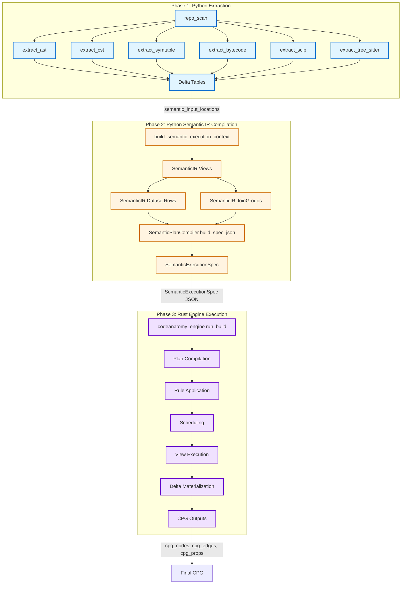

# System Overview & Pipeline Architecture

## Purpose

CodeAnatomy is an inference-driven Code Property Graph (CPG) builder that transforms Python source code into a rich, queryable graph representation. The system extracts multiple evidence layers from Python codebases using diverse parsers (LibCST, AST, symtable, bytecode, SCIP, tree-sitter), compiles them into a semantic intermediate representation, and materializes a CPG through a Rust-native execution engine. The architecture enforces deterministic transformations via contract-validated specifications, schema inference, and Delta Lake versioned storage.

**Core Value Proposition:**
- **Multi-Source Evidence Fusion** - Combines complementary parsing technologies to capture structure, semantics, symbols, and control flow
- **Inference-Driven Compilation** - Automatically derives join strategies, cache policies, and execution plans from semantic IR metadata
- **Deterministic Execution** - Produces reproducible outputs via plan fingerprinting, immutable boundary contracts, and byte-span canonicalization
- **Production-Ready Execution** - Rust engine handles scheduling, rule application, Delta materialization, and observability at scale

---

## Three-Phase Pipeline

CodeAnatomy operates as a **three-phase pipeline** that cleanly separates extraction, semantic compilation, and execution concerns:



### Phase 1: Python Extraction

**Location:** `src/extraction/orchestrator.py::run_extraction()`

Extracts raw evidence from Python source files via multiple parsers:

| Stage | Extractor | Output | Purpose |
|-------|-----------|--------|---------|
| Stage 0 | `repo_scan` | `repo_files_v1` | Enumerate Python files, compute file hashes |
| Stage 1 | `extract_ast` | `ast_files_v1` | Python AST nodes, names, expressions |
| Stage 1 | `extract_cst` | `libcst_files_v1` | LibCST concrete syntax nodes with trivia |
| Stage 1 | `extract_symtable` | `symtable_files_v1` | Symbol scopes, bindings, flags |
| Stage 1 | `extract_bytecode` | `bytecode_files_v1` | Bytecode instructions, CFG blocks |
| Stage 1 | `extract_scip` | `scip_files_v1` | SCIP symbols, occurrences, cross-repo resolution |
| Stage 1 | `extract_tree_sitter` | `tree_sitter_files_v1` | Error-tolerant parse trees |

**Execution Model:**
- Stage 0 runs sequentially (prerequisite for all extractors)
- Stage 1 extractors run in parallel via `ThreadPoolExecutor` (default: 6 workers)
- Each extractor writes Arrow tables directly to Delta Lake
- Output: `semantic_input_locations` dict mapping logical names to Delta paths

**Key Properties:**
- Direct function calls (no Hamilton orchestration)
- Fail-fast on Stage 0 errors
- Graceful degradation on Stage 1 failures (logged but non-blocking)
- Deterministic file ordering via stable repo scan

### Phase 2: Python Semantic IR Compilation

**Location:** `src/semantics/compile_context.py::build_semantic_execution_context()`

Compiles extraction outputs into a semantic intermediate representation (IR):

```python
execution_context = build_semantic_execution_context(
    runtime_profile=runtime_profile.datafusion,
    outputs=None,
    policy="schema_only",
    ctx=ctx,
    input_mapping=semantic_input_locations,
)
```

**IR Components:**

| Component | Type | Purpose |
|-----------|------|---------|
| `views` | `list[SemanticViewMetadata]` | Named view definitions with dependencies |
| `dataset_rows` | `list[DatasetRowMetadata]` | Materialized dataset metadata |
| `join_groups` | `list[JoinGroupMetadata]` | Shared join configurations for relationship building |

**Compilation Process:**
1. Register extraction Delta tables as DataFusion inputs
2. Apply semantic normalization rules (byte-span canonicalization, stable IDs)
3. Infer join strategies from annotated schemas
4. Build relationship views via span overlap/containment joins
5. Union node/edge tables with discriminators
6. Validate schema alignment across view dependencies

**Output:**
- `SemanticExecutionContext` with manifest containing `SemanticIR`
- `SemanticPlanCompiler.build_spec_json()` produces frozen `SemanticExecutionSpec`

**Boundary Contract:**
The `SemanticExecutionSpec` is an **immutable msgspec struct** that encodes:
- Input relations (Delta table locations with optional version pins)
- View definitions (DAG nodes with dependencies and transforms)
- Join graph (relationship edges and constraints)
- Output targets (CPG table materialization specs)
- Rule intents (analyzer/optimizer/physical rules)
- Rulepack profile (`Default`, `LowLatency`, `Replay`, `Strict`)
- Runtime config (tracing, tuner, compliance capture)

### Phase 3: Rust Engine Execution

**Location:** `rust/codeanatomy_engine/src/lib.rs::run_build()`

The Rust engine is a ~21K LOC execution runtime that handles:

```rust
pub fn run_build(request_json: &str) -> PyResult<PyObject> {
    // 1. Deserialize SemanticExecutionSpec
    // 2. Initialize DataFusion SessionContext with profile
    // 3. Register Delta tables from input_relations
    // 4. Compile view definitions to DataFrames
    // 5. Apply rule intents (analyzer/optimizer/physical)
    // 6. Schedule view execution (topological sort with parallelization)
    // 7. Materialize output_targets to Delta Lake
    // 8. Collect observability artifacts (timing, metrics, errors)
    // 9. Return RunResult envelope
}
```

**Engine Capabilities:**
- **Plan Compilation** - Translates view definitions to DataFusion logical plans
- **Rule Application** - Applies semantic integrity, cost-shape, Delta-aware rules
- **Scheduling** - Topological sort with generation-based parallelization
- **Delta Materialization** - Handles partitioning, write modes (Append/Overwrite), commit retries
- **Observability** - Collects plan fingerprints, timing metrics, row counts, warnings
- **Error Handling** - Typed error boundary with stage/code attribution

**Engine Profiles:**

| Profile | Target Workload | Memory | Parallelism |
|---------|----------------|---------|-------------|
| `small` | < 1K files | 2 GB | 2 threads |
| `medium` | 1K-10K files | 8 GB | 4 threads |
| `large` | > 10K files | 16 GB | 8 threads |

**Rulepack Profiles:**

| Profile | Purpose | Rules Applied |
|---------|---------|---------------|
| `Default` | Standard CPG build | Semantic integrity, cost-shape baseline |
| `LowLatency` | Fast incremental updates | Minimal rule set, no Delta CDF |
| `Replay` | Deterministic replay | Canonical sorting, no sampling |
| `Strict` | Maximum validation | All integrity checks, schema enforcement |

---

## Technology Stack

| Component | Technology | Version | Purpose |
|-----------|------------|---------|---------|
| **Query Engine** | Apache DataFusion | 51.0 | SQL execution, plan optimization, lineage extraction |
| **Data Format** | PyArrow | Latest | Columnar data interchange |
| **Storage** | Delta Lake (deltalake) | 1.3.2+ | Versioned table storage with CDF |
| **Serialization** | msgspec | 0.20.0+ | Fast binary serialization for boundary contracts |
| **Python Parsing** | LibCST, ast, symtable | Latest | CST/AST/symbol extraction |
| **Bytecode Analysis** | dis module | 3.13 | Instruction/CFG extraction |
| **Error-Tolerant Parsing** | tree-sitter | Latest | Resilient parse trees |
| **Cross-Repo Symbols** | SCIP | - | Semantic code intelligence protocol |
| **Git Integration** | pygit2 | 1.19.1+ | Repository history access |
| **Observability** | OpenTelemetry | 0.60b1+ | Metrics, tracing, logging |
| **Runtime** | Python | 3.13.12 | Pinned Python version (exact) |
| **Package Manager** | uv | Latest | Fast dependency resolution |
| **Rust Engine** | codeanatomy_engine | 0.1.0 | Native execution runtime (~21K LOC) |
| **DataFusion Extensions** | datafusion_ext | 0.1.0 | Custom UDFs, Delta ops, plugin API |

**Deprecated Components (Removed):**
- Hamilton (replaced by direct function calls in extraction, Rust engine in execution)
- rustworkx scheduling (replaced by Rust engine topological sort)

---

## Architectural Invariants

CodeAnatomy enforces five core invariants across all subsystems:

### 1. Byte Spans Are Canonical

**Principle:** All normalizations anchor to byte offsets (`bstart`, `bend`), not line/column coordinates.

**Rationale:**
- Line/column coordinates vary by parser (zero-indexed vs one-indexed, UTF-8 vs UTF-16)
- Byte offsets provide a universal coordinate system independent of encoding
- Enables deterministic span overlap/containment joins

**Implementation:**
- Extraction outputs use parser-native coordinates
- Semantic normalization projects all spans to `(bstart, bend)` byte pairs
- Span UDFs (`span_make`, `span_overlaps`, `span_contains`) operate on byte ranges

### 2. Determinism Contract

**Principle:** All Acero/DataFusion plans must be reproducible. Plans include `spec_hash` and schema fingerprints.

**Enforcement:**
- `SemanticExecutionSpec` includes `spec_hash` (Blake3 hash of serialized spec)
- View definitions capture transform metadata and output schemas
- Delta input relations support optional version pins for time-travel
- Rulepack profiles control rule selection and execution order

**Observability:**
- Plan fingerprints recorded in run manifest
- Substrait plans captured when `compliance_capture=true`
- Optimizer lab artifacts track rule application history

### 3. Inference-Driven

**Principle:** Don't specify intermediate schemas or join keys—infer from semantic types and annotated schemas.

**Mechanisms:**
- **Join Strategy Inference** - `infer_join_strategy_with_confidence()` selects equi-join vs span joins
- **Schema Alignment** - Annotated schemas provide compatibility groups for join key resolution
- **Cache Policy Inference** - Runtime profile determines memory/disk cache thresholds
- **Partition Inference** - File-level partitioning inferred from `file_id` columns

**Benefits:**
- Reduced boilerplate in view definitions
- Automatic adaptation to schema evolution
- Type-safe cross-module data flow

### 4. Graceful Degradation

**Principle:** Missing optional inputs produce correct-schema empty outputs, not exceptions.

**Examples:**
- SCIP extraction failures produce empty `scip_files_v1` table
- Missing file quality signals fallback to base confidence scores
- Absent CDF versions trigger full table scans instead of incremental reads

**Implementation:**
- Semantic views use `coalesce()` for nullable joins
- Rust engine validates input availability before execution
- Output targets write empty partitions when upstream views are empty

### 5. Immutable Boundary Contract

**Principle:** `SemanticExecutionSpec` is frozen after creation and never mutated during execution.

**Guarantees:**
- Spec JSON is serialized once at Python/Rust boundary
- Rust engine deserializes to immutable Rust structs
- Runtime overrides (tuner mode, tracing) pass through separate `RuntimeConfig` channel
- Spec hash provides tamper detection

**Validation:**
- `msgspec.Struct(frozen=True)` enforces immutability in Python
- Rust types use `#[readonly]` attributes for spec fields
- Spec hash mismatch triggers build failure

---

## Module Map

```
src/
├── extract/                 # Stage 1: Multi-source extraction
│   ├── extractors/          # Parser-specific extractors (AST, CST, symtable, bytecode, SCIP, tree-sitter)
│   ├── scanning/            # Repository file discovery and scope filtering
│   └── session.py           # ExtractSession coordination

├── extraction/              # Extraction orchestration layer
│   ├── orchestrator.py      # run_extraction() entry point
│   ├── contracts.py         # Semantic input location resolution
│   ├── options.py           # ExtractionRunOptions normalization
│   └── runtime_profile.py   # Engine/rulepack profile resolution

├── semantics/               # Stage 2: Semantic IR compilation
│   ├── compile_context.py   # build_semantic_execution_context()
│   ├── compiler.py          # SemanticCompiler (normalize/relate/union operations)
│   ├── spec_registry.py     # Declarative normalization/relationship specs
│   ├── catalog/             # View catalog with metadata and fingerprints
│   ├── joins/               # Schema-driven join strategy inference
│   ├── types/               # Semantic type system and annotated schemas
│   └── incremental/         # CDF cursors, readers, merge strategies

├── planning_engine/         # Boundary contract types
│   ├── spec_contracts.py    # SemanticExecutionSpec, RuntimeConfig, InputRelation
│   └── output_contracts.py  # CPG output naming and aliasing

├── datafusion_engine/       # DataFusion integration (Python-side)
│   ├── session/             # SessionContext management, streaming
│   ├── schema/              # Schema contracts, inference, alignment
│   ├── lineage/             # Plan lineage extraction (deprecated, moved to Rust)
│   └── udf/                 # UDF catalog and runtime (Python UDFs)

├── storage/                 # Delta Lake integration (Python-side)
│   └── deltalake/           # Read/write operations, file pruning

├── obs/                     # Observability layer
│   ├── diagnostics.py       # DiagnosticsCollector + event recording
│   ├── otel/                # OpenTelemetry bootstrap + instrumentation
│   └── engine_artifacts.py  # Engine execution summary recording

├── graph/                   # Public API entry point
│   ├── product_build.py     # build_graph_product() + GraphProductBuildRequest
│   └── build_pipeline.py    # orchestrate_build() three-phase controller

└── utils/                   # Cross-cutting utilities
    ├── hashing.py           # Deterministic hashing (msgpack, JSON)
    ├── env_utils.py         # Environment parsing helpers
    └── registry_protocol.py # Registry abstractions

rust/
├── codeanatomy_engine/      # Phase 3: Rust engine (~21K LOC)
│   ├── src/lib.rs           # PyO3 entry point (run_build)
│   ├── plan_compiler/       # View definition to DataFusion plan compilation
│   ├── rule_engine/         # Analyzer/optimizer/physical rule application
│   ├── scheduler/           # Topological sort + generation-based execution
│   ├── delta_ops/           # Delta Lake materialization
│   └── observability/       # Timing, metrics, error collection

├── codeanatomy_engine_py/   # PyO3 bindings for codeanatomy_engine
├── datafusion_ext/          # Core DataFusion extensions (UDFs, Delta ops)
├── datafusion_ext_py/       # PyO3 wrapper for datafusion_ext
├── datafusion_python/       # DataFusion Python bindings with CodeAnatomy extensions
├── df_plugin_api/           # ABI-stable plugin API
├── df_plugin_host/          # Plugin host
└── df_plugin_codeanatomy/   # CodeAnatomy plugin
```

**Key Directories:**

| Path | Purpose | Lines of Code |
|------|---------|---------------|
| `src/extract/` | Multi-source evidence extraction | ~8K |
| `src/semantics/` | Semantic IR compilation and normalization | ~12K |
| `src/datafusion_engine/` | Python-side DataFusion integration | ~6K |
| `src/graph/` | Public API and orchestration | ~2K |
| `rust/codeanatomy_engine/` | Rust execution engine | ~21K |
| `rust/datafusion_ext/` | DataFusion extensions (UDFs, Delta) | ~5K |

---

## Public API

### Entry Point

**Function:** `build_graph_product(request: GraphProductBuildRequest) -> GraphProductBuildResult`

**Location:** `src/graph/product_build.py`

**Lifecycle:**
1. Resolve and validate paths (`repo_root`, `output_dir`, `work_dir`)
2. Apply configuration overrides and generate run ID (UUID7)
3. Configure OpenTelemetry with repository context
4. Execute three-phase pipeline via `orchestrate_build()`
5. Parse `BuildResult` into stable `GraphProductBuildResult`
6. Write diagnostics bundle (if `include_run_bundle=True`)
7. Return typed result with CPG output paths

### GraphProductBuildRequest

Primary fields for controlling the build:

| Field | Type | Default | Description |
|-------|------|---------|-------------|
| `repo_root` | `PathLike` | (required) | Repository root directory to analyze |
| `product` | `GraphProduct` | `"cpg"` | Graph product to build (currently only `"cpg"`) |
| `engine_profile` | `str` | `"medium"` | Engine execution profile (`small`, `medium`, `large`) |
| `rulepack_profile` | `str` | `"default"` | Rulepack profile (`Default`, `LowLatency`, `Replay`, `Strict`) |
| `runtime_config` | `RuntimeConfig \| None` | `None` | Optional runtime controls (tracing, tuner, compliance) |
| `output_dir` | `PathLike \| None` | `None` | Output directory (defaults to `{repo_root}/build`) |
| `work_dir` | `PathLike \| None` | `None` | Work directory for extraction (defaults to `{repo_root}/work`) |

Extraction configuration:

| Field | Type | Default | Description |
|-------|------|---------|-------------|
| `extraction_config` | `dict[str, object] \| None` | `None` | Extraction options (SCIP, tree-sitter, repo scope) |

Output control flags:

| Field | Type | Default | Description |
|-------|------|---------|-------------|
| `include_extract_errors` | `bool` | `True` | Include extraction error artifacts |
| `include_manifest` | `bool` | `True` | Include run manifest metadata |
| `include_run_bundle` | `bool` | `False` | Include full diagnostics bundle |

### GraphProductBuildResult

Core CPG outputs:

| Field | Type | Description |
|-------|------|-------------|
| `product` | `GraphProduct` | Product type built (`"cpg"`) |
| `product_version` | `str` | Product version string (`cpg_ultimate_v1`) |
| `engine_versions` | `Mapping[str, str]` | Engine component versions (PyArrow, DataFusion) |
| `run_id` | `str \| None` | Unique run identifier (UUID7) |
| `repo_root` | `Path` | Repository root path |
| `output_dir` | `Path` | CPG output directory |
| `cpg_nodes` | `FinalizeDeltaReport` | CPG nodes table (path, rows, error_rows) |
| `cpg_edges` | `FinalizeDeltaReport` | CPG edges table |
| `cpg_props` | `FinalizeDeltaReport` | CPG properties table |

Index tables for accelerated queries:

| Field | Type | Description |
|-------|------|-------------|
| `cpg_props_map` | `TableDeltaReport` | Property name to ID mapping |
| `cpg_edges_by_src` | `TableDeltaReport` | Edges indexed by source node |
| `cpg_edges_by_dst` | `TableDeltaReport` | Edges indexed by destination node |

Optional auxiliary outputs:

| Field | Type | Description |
|-------|------|-------------|
| `extract_error_artifacts` | `JsonDict \| None` | Extraction error artifacts (if `include_extract_errors=True`) |
| `manifest_path` | `Path \| None` | Run manifest path (if `include_manifest=True`) |
| `run_bundle_dir` | `Path \| None` | Diagnostics bundle directory (if `include_run_bundle=True`) |

---

## Usage Examples

### Minimal Build

```python
from graph.product_build import build_graph_product, GraphProductBuildRequest

result = build_graph_product(
    GraphProductBuildRequest(repo_root="/path/to/repository")
)

print(f"CPG nodes: {result.cpg_nodes.rows} rows")
print(f"CPG edges: {result.cpg_edges.rows} rows")
print(f"Output directory: {result.output_dir}")
```

### Production Configuration

```python
from graph.product_build import build_graph_product, GraphProductBuildRequest
from planning_engine.spec_contracts import RuntimeConfig

result = build_graph_product(
    GraphProductBuildRequest(
        repo_root="/home/user/my-project",
        output_dir="/mnt/storage/cpg_outputs",
        work_dir="/mnt/storage/work",

        # Engine configuration
        engine_profile="large",
        rulepack_profile="Strict",

        # Runtime controls
        runtime_config=RuntimeConfig(
            compliance_capture=True,
            tuner_mode="Apply",
            enable_tracing=True,
            enable_rule_tracing=True,
        ),

        # Extraction configuration
        extraction_config={
            "scip_index_config": {"enabled": True, "run_scip_test": True},
            "tree_sitter_enabled": True,
            "max_workers": 8,
        },

        # Output control
        include_extract_errors=True,
        include_manifest=True,
        include_run_bundle=True,
    )
)

print(f"Run ID: {result.run_id}")
print(f"Bundle directory: {result.run_bundle_dir}")
```

### Custom Engine Profiles

```python
from graph.product_build import build_graph_product, GraphProductBuildRequest

# Small repository (< 1K files, 2 GB memory)
result = build_graph_product(
    GraphProductBuildRequest(
        repo_root="/path/to/small-repo",
        engine_profile="small",
    )
)

# Large repository (> 10K files, 16 GB memory)
result = build_graph_product(
    GraphProductBuildRequest(
        repo_root="/path/to/large-repo",
        engine_profile="large",
        rulepack_profile="LowLatency",
    )
)
```

### Incremental Build

```python
from graph.product_build import build_graph_product, GraphProductBuildRequest

result = build_graph_product(
    GraphProductBuildRequest(
        repo_root="/path/to/repo",
        extraction_config={
            "incremental_config": {
                "enabled": True,
                "state_dir": "/path/to/state",
                "git_base_ref": "main",
                "git_head_ref": "HEAD",
                "impact_strategy": "hybrid",
            }
        },
    )
)
```

---

## Command-Line Interface

```bash
# Basic build
codeanatomy build /path/to/repo

# Custom output directory
codeanatomy build /path/to/repo --output-dir ./cpg_output

# Engine profile selection
codeanatomy build /path/to/repo --engine-profile large

# Rulepack profile selection
codeanatomy build /path/to/repo --rulepack-profile Strict

# Enable tracing
codeanatomy build /path/to/repo --enable-tracing --enable-rule-tracing

# Incremental build
codeanatomy build /path/to/repo \
  --incremental \
  --git-base-ref main \
  --git-head-ref HEAD

# Debug mode (compliance capture + full tracing)
codeanatomy build /path/to/repo \
  --compliance-capture \
  --enable-tracing \
  --enable-rule-tracing \
  --include-run-bundle
```

---

## Error Handling

| Exception | Cause | Mitigation |
|-----------|-------|------------|
| `FileNotFoundError` | `repo_root` does not exist | Verify path before calling |
| `PermissionError` | Cannot write to `output_dir` or `work_dir` | Check directory permissions |
| `ValueError` | Invalid configuration parameter | Validate config values against spec |
| `RuntimeError` | Pipeline execution failure | Check logs in `run_bundle_dir` |
| `ImportError` | Rust extension not built | Run `bash scripts/rebuild_rust_artifacts.sh` |

**Error Envelope:**

```python
try:
    result = build_graph_product(GraphProductBuildRequest(repo_root="/path/to/repo"))
except FileNotFoundError as exc:
    print(f"Repository not found: {exc}")
except ImportError as exc:
    print(f"Rust engine not built: {exc}")
except RuntimeError as exc:
    print(f"Pipeline failed: {exc}")
    # Check diagnostics in result.run_bundle_dir if available
else:
    if result.cpg_nodes.error_rows > 0:
        print(f"Warning: {result.cpg_nodes.error_rows} validation errors in cpg_nodes")
```

**Typed Rust Boundary Errors:**

Rust engine failures expose typed attributes:

```python
try:
    result = build_graph_product(GraphProductBuildRequest(...))
except RuntimeError as exc:
    stage = getattr(exc, "stage", None)
    code = getattr(exc, "code", None)
    if stage and code:
        print(f"Engine error at stage {stage} with code {code}: {exc}")
```

---

## Cross-References

### Pipeline Documentation
- **[02_extraction.md](02_extraction.md)** - Multi-source extraction architecture and extractor specifications
- **[03_semantic_compiler.md](03_semantic_compiler.md)** - Semantic normalization rules, join strategies, and IR compilation
- **[04_boundary_contract.md](04_boundary_contract.md)** - SemanticExecutionSpec contract and serialization protocol
- **[05_rust_engine.md](05_rust_engine.md)** - Rust engine internals, rule application, and scheduling
- **[06_execution.md](06_execution.md)** - Orchestration flow, observability, and error handling

### Subsystem Documentation
- **[07_datafusion_and_udfs.md](07_datafusion_and_udfs.md)** - DataFusion session management, UDFs, and plugin system
- **[08_storage.md](08_storage.md)** - Delta Lake storage, incremental processing, and materialization strategies
- **[09_observability_and_config.md](09_observability_and_config.md)** - Observability, configuration, and debugging workflows

**Source Files:**
- `src/graph/product_build.py` - Public API entry point
- `src/graph/build_pipeline.py` - Three-phase orchestration controller
- `src/extraction/orchestrator.py` - Extraction pipeline execution
- `src/semantics/compile_context.py` - Semantic IR compilation
- `rust/codeanatomy_engine/src/lib.rs` - Rust engine entry point
