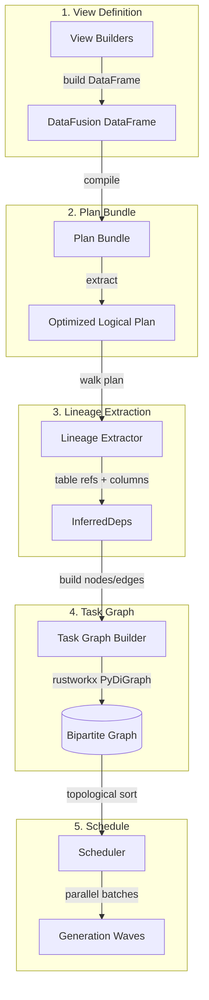

# The Four-Stage Pipeline

## Purpose

This document provides detailed coverage of CodeAnatomy's four-stage pipeline: Extraction → Normalization → Scheduling → CPG Build. Each stage transforms data toward the final Code Property Graph output.

## Key Concepts

- **Bytes-First Design** - All coordinate systems anchor to byte offsets; line/column are auxiliary
- **Inference-Driven Dependencies** - Task dependencies auto-inferred from DataFusion query plans
- **Generation-Based Scheduling** - Parallelizable execution waves derived from bipartite task graphs
- **Graceful Degradation** - Missing optional inputs produce correct-schema empty outputs
- **Entity Family Specs** - Declarative node/property emission driven by specifications

---

## Stage 1: Extraction

The Extraction Stage transforms Python source files into structured evidence tables through multiple parsing strategies. Each extractor captures a distinct view of code structure.

### Architecture

```
┌─────────────────────────────────────────────────────────────────────────┐
│                       EXTRACTION PIPELINE                                │
├─────────────────────────────────────────────────────────────────────────┤
│                                                                          │
│  Repository Scanner                                                      │
│  scan_repo() → scan_repo_blobs() / iter_worklist_contexts()             │
│  Output: repo_files_v1 (file_id, path, abs_path, file_sha256, ...)      │
│                                      │                                   │
│              ┌───────────────────────┼───────────────────┐               │
│              ▼                       ▼                   ▼               │
│  ┌────────────────┐  ┌────────────────┐  ┌────────────────┐             │
│  │  AST Extractor │  │  CST Extractor │  │ Symtable Ext.  │             │
│  │  ast_nodes     │  │  cst_refs      │  │ symtable_blocks│             │
│  │  ast_edges     │  │  cst_imports   │  └───────┬────────┘             │
│  │  ast_docstrings│  │  cst_callsites │          │                      │
│  └───────┬────────┘  │  cst_defs      │          ▼                      │
│          │           └───────┬────────┘    symtable_*_v1                │
│          ▼                   ▼                                          │
│       ast_*_v1           cst_*_v1                                       │
│                                                                          │
│              ┌───────────────────┬───────────────────┐                   │
│              ▼                   ▼                   ▼                   │
│  ┌────────────────┐  ┌────────────────┐  ┌────────────────┐             │
│  │Bytecode Extract│  │ SCIP Extractor │  │ Tree-sitter    │             │
│  │ bytecode_objs  │  │ scip_index     │  │ ts_nodes       │             │
│  └───────┬────────┘  └───────┬────────┘  │ ts_errors      │             │
│          ▼                   ▼           └───────┬────────┘             │
│    bytecode_*_v1         scip_*_v1               ▼                      │
│                                              ts_*_v1                    │
└─────────────────────────────────────────────────────────────────────────┘
```

### Core Patterns

**FileContext** (`src/extract/coordination/context.py`):
```python
@dataclass(frozen=True)
class FileContext:
    file_id: str              # Stable file identifier
    path: str                 # Relative path from repo root
    abs_path: str | None      # Absolute filesystem path
    file_sha256: str | None   # Content hash for caching
    encoding: str | None      # Detected encoding
    text: str | None          # Decoded text content
    data: bytes | None        # Raw byte content
```

**SpanSpec** - Universal coordinate representation:
```python
@dataclass(frozen=True)
class SpanSpec:
    start_line0: int | None    # 0-indexed line start
    start_col: int | None      # Column start (unit varies)
    byte_start: int | None     # Canonical byte offset
    byte_len: int | None       # Canonical byte length
```

**Key Invariant:** `byte_start` and `byte_len` provide the canonical coordinate system.

### Extractors

| Extractor | File | Purpose | Output Tables |
|-----------|------|---------|---------------|
| AST | `extractors/ast_extract.py` | Parse Python AST | ast_nodes_v1, ast_edges_v1, ast_docstrings_v1 |
| LibCST | `extractors/cst_extract.py` | CST with metadata | cst_refs_v1, cst_imports_v1, cst_defs_v1 |
| Symtable | `extractors/symtable_extract.py` | Symbol tables | symtable_blocks_v1 |
| Bytecode | `extractors/bytecode_extract.py` | Instructions, CFG | bytecode_code_objects_v1 |
| SCIP | `extractors/scip/extract.py` | Cross-repo symbols | scip_index_v1 |
| Tree-sitter | `extractors/tree_sitter/extract.py` | Error-tolerant parsing | ts_nodes_v1, ts_errors_v1 |

### Parallel Execution

```python
def parallel_map(items, fn, max_workers=None):
    if _gil_disabled():
        # GIL-free Python: use ThreadPoolExecutor
        with ThreadPoolExecutor(max_workers) as executor:
            for item in executor.map(fn, items): yield item
    else:
        # Standard Python: use fork-based ProcessPoolExecutor
        with _process_executor(max_workers) as executor:
            for item in executor.map(fn, items): yield item
```

### Repository Scanning

**File:** `src/extract/scanning/repo_scan.py`

**Dual-Track Discovery:**
1. **Git-based:** Uses libgit2/pygit2 for index-based discovery
2. **Filesystem fallback:** Uses glob-based matching

**Options:**
- `include_sha256`: Compute content hashes
- `max_file_bytes`: Skip large files
- `diff_base_ref` / `diff_head_ref`: Incremental scanning

---

## Stage 2: Normalization

The Normalization stage transforms heterogeneous extraction outputs into canonical Arrow tables with stable identifiers, byte-span anchors, and join-ready schemas.

### Data Flow

```
Extraction Outputs → View Builders → DataFusion DataFrames → Normalized Views
     (raw)           (transforms)       (lazy plans)          (canonical)
```

### View Builders

**File:** `src/semantics/catalog/analysis_builders.py`

View builders are pure functions that accept a `SessionContext` and return a `DataFrame`:

```python
def type_exprs_df_builder(ctx: SessionContext) -> DataFrame:
    """Build a DataFrame for normalized type expressions."""
    table = ctx.table("cst_type_exprs")

    # Normalize text with UDF
    expr_text = _arrow_cast(col("expr_text"), "Utf8")
    type_repr = utf8_null_if_blank(_normalized_text(expr_text))

    # Generate stable IDs from byte spans
    type_expr_id = _stable_id_expr(
        TYPE_EXPR_ID_SPEC.prefix,
        (col("path"), col("bstart"), col("bend")),
    )

    return df.with_column("type_expr_id", type_expr_id).select(*keep_cols)
```

### Key Mechanisms

**Stable ID Generation:**
IDs are deterministic hashes of normalized content:
```python
type_expr_id = hash("type_expr", path, bstart, bend)
```

These IDs remain stable across re-extraction (same source → same ID), incremental updates, and distributed execution.

**Span Canonicalization:**
All byte spans map to a canonical struct:
```
struct {
  start: {line0: i32, col: i32},
  end: {line0: i32, col: i32},
  byte_span: {byte_start: i32, byte_len: i32},
  col_unit: utf8,
  end_exclusive: bool
}
```

**Graceful Degradation:**
Views attempt to use enhanced data (SCIP) but fall back to base data (CST) if unavailable:
```python
try:
    scip = ctx.table("scip_symbol_information")
    if "type_repr" in scip.schema().names:
        return scip_rows.union(expr_rows).distinct()
except (RuntimeError, KeyError, ValueError):
    pass  # SCIP not available, degrade gracefully
return expr_rows
```

---

## Stage 3: Scheduling

The Scheduling stage transforms view definitions into an executable task schedule through inference-driven dependency resolution.

### Architecture



### InferredDeps

**File:** `src/relspec/inferred_deps.py`

```python
@dataclass(frozen=True)
class InferredDeps:
    task_name: str                                # Task producing output
    output: str                                   # Dataset name produced
    inputs: tuple[str, ...]                       # Table names from scans
    required_columns: Mapping[str, tuple[str, ...]]  # Columns per table
    required_types: Mapping[str, tuple[tuple[str, str], ...]]
    plan_fingerprint: str                         # Stable hash for caching
    required_udfs: tuple[str, ...]               # Rust UDFs referenced
```

**Why Column-Level Precision Matters:**
If a query uses `SELECT node_id, bstart FROM cst_nodes`, the inferred deps capture:
- `inputs = ("cst_nodes",)`
- `required_columns = {"cst_nodes": ("node_id", "bstart")}`

Adding an unused column to `cst_nodes` won't invalidate downstream tasks.

### Lineage Extraction

**File:** `src/datafusion_engine/lineage/datafusion.py`

```python
def extract_lineage(plan: object) -> LineageReport:
    """Extract lineage by walking optimized logical plan."""
    scans: list[ScanLineage] = []
    for node in walk_logical_complete(plan):
        variant = _plan_variant(node)
        tag = _variant_name(node=node, variant=variant)
        scans.extend(_extract_scan_lineage(tag=tag, variant=variant))
    return LineageReport(scans=tuple(scans), ...)
```

### Bipartite Task Graph

**File:** `src/relspec/rustworkx_graph.py`

The task graph has two node types:
1. **Evidence Nodes:** Datasets (tables) that tasks consume or produce
2. **Task Nodes:** Computational units that transform evidence

```
Evidence Nodes:           Task Nodes:              Evidence Nodes:
┌─────────────┐          ┌──────────────┐         ┌──────────────┐
│ cst_nodes   │─────────>│ type_exprs   │────────>│ type_exprs_  │
│ (input)     │ requires │ (normalize)  │produces │ norm_v1      │
└─────────────┘          └──────────────┘         └──────────────┘
```

### Generation-Based Scheduling

**File:** `src/relspec/rustworkx_schedule.py`

```python
@dataclass(frozen=True)
class TaskSchedule:
    ordered_tasks: tuple[str, ...]              # Topological order
    generations: tuple[tuple[str, ...], ...]    # Parallelizable waves
    missing_tasks: tuple[str, ...] = ()         # Unsatisfied deps
```

**Generation Structure:**
```python
generations = (
    ("extract_cst", "extract_ast"),    # Gen 0: parallel extraction
    ("normalize_cst", "normalize_ast"), # Gen 1: parallel normalization
    ("aggregate_types",),               # Gen 2: sequential aggregation
)
```

Tasks within a generation have no dependencies on each other and can execute concurrently.

### Evidence Catalog

**File:** `src/relspec/evidence.py`

```python
@dataclass
class EvidenceCatalog:
    sources: set[str]
    columns_by_dataset: dict[str, set[str]]
    types_by_dataset: dict[str, dict[str, str]]
    contracts_by_dataset: dict[str, SchemaContract]
```

The catalog tracks available datasets and validates edge requirements at schedule time.

---

## Stage 4: CPG Build

The CPG Build stage transforms normalized evidence tables into a queryable Code Property Graph with nodes, edges, and properties.

### CPG Schema

**Node Kinds** (`src/cpg/kind_catalog.py`):
- `PY_FILE`, `CST_REF`, `CST_DEF`, `CST_CALLSITE`
- `SYM_SCOPE`, `SYM_SYMBOL`, `PY_BINDING`
- `SCIP_SYMBOL`, `TYPE_EXPR`, `TYPE`
- `TS_NODE`, `TS_ERROR`, `DIAG`

**Edge Kinds:**
- `SCOPE_PARENT`, `SCOPE_BINDS`, `BINDING_RESOLVES_TO`
- `PY_DEFINES_SYMBOL`, `PY_REFERENCES_SYMBOL`, `PY_CALLS_SYMBOL`
- `SCIP_SYMBOL_REFERENCE`, `SCIP_SYMBOL_DEFINITION`
- `HAS_DIAGNOSTIC`, `HAS_ANNOTATION`, `INFERRED_TYPE`

### Output Schemas

**Nodes:** `node_id, node_kind, path, bstart, bend, file_id`

**Edges:** `edge_id, edge_kind, src_node_id, dst_node_id, path, bstart, bend, origin, resolution_method, confidence, score`

**Properties:** `entity_kind, entity_id, node_kind, prop_key, value_type, value_string, value_int, value_float, value_bool, value_json`

### Entity Family Specifications

**File:** `src/cpg/spec_registry.py`

```python
@dataclass(frozen=True)
class EntityFamilySpec:
    name: str
    node_kind: NodeKindId
    id_cols: tuple[str, ...]
    node_table: str | None
    prop_source_map: Mapping[str, PropFieldInput]
    node_family: NodeFamily | None = None
```

**Example:**
```python
EntityFamilySpec(
    name="file",
    node_kind=NODE_KIND_PY_FILE,
    id_cols=("file_id",),
    node_table="repo_files_nodes",
    node_family=NodeFamily.FILE,
    prop_source_map={
        "path": "path",
        "size_bytes": "size_bytes",
        "file_sha256": "file_sha256",
    },
)
```

### CPG Emission

**File:** `src/cpg/view_builders_df.py`

```python
def build_cpg_nodes_df(session_runtime: SessionRuntime) -> DataFrame:
    """Build CPG nodes DataFrame from view specs."""
    ctx = session_runtime.ctx
    specs = node_plan_specs()

    frames: list[DataFrame] = []
    for spec in specs:
        source_df = ctx.table(spec.table_ref)
        node_df = _emit_nodes_df(source_df, spec=spec.emit)
        frames.append(node_df)

    combined = frames[0]
    for frame in frames[1:]:
        combined = combined.union(frame)

    return combined.select(*_NODE_OUTPUT_COLUMNS)
```

**Node Emission Helper:**
```python
def _emit_nodes_df(df: DataFrame, spec: NodeEmitSpec) -> DataFrame:
    node_id = semantic_tag("NodeId", _stable_id_from_parts("node", ...))
    node_kind = lit(str(spec.node_kind))
    path = _coalesce_cols(df, spec.path_cols)
    bstart = _coalesce_cols(df, spec.bstart_cols)
    bend = _coalesce_cols(df, spec.bend_cols)

    return df.select(
        node_id.alias("node_id"),
        node_kind.alias("node_kind"),
        path.alias("path"),
        bstart.alias("bstart"),
        bend.alias("bend"),
    )
```

### Relationship Specifications

**File:** `src/cpg/relationship_specs.py`

```python
@dataclass(frozen=True)
class RelationshipSpec:
    name: str
    edge_kind: EdgeKindId
    origin: RelationshipOrigin
    src_table: str
    entity_id_col: ColumnSpec
    symbol_col: ColumnSpec
    resolution_method: str
```

Generic builders use these specs to eliminate code duplication.

---

## Hamilton Orchestration

### Execution Modes

```python
class ExecutionMode(StrEnum):
    DETERMINISTIC_SERIAL = "deterministic_serial"  # Single-threaded
    PLAN_PARALLEL = "plan_parallel"                # Dynamic parallel
    PLAN_PARALLEL_REMOTE = "plan_parallel_remote"  # Distributed
```

### Driver Construction

**File:** `src/hamilton_pipeline/driver_factory.py`

```python
def build_driver(
    *,
    config: Mapping[str, JsonValue],
    execution_mode: ExecutionMode = ExecutionMode.PLAN_PARALLEL,
    executor_config: ExecutorConfig | None = None,
) -> driver.Driver:
    """Build a Hamilton Driver for the pipeline."""
    modules = default_modules()
    view_ctx = build_view_graph_context(config)
    plan = _compile_plan(view_ctx, config)

    modules.append(build_execution_plan_module(plan))
    modules.append(build_task_execution_module(plan=plan))

    builder = DriverBuilder()
    builder = builder.with_modules(*modules).with_config(config)
    builder = _apply_dynamic_execution(builder, ...)
    return builder.build()
```

### Task Module Generation

**File:** `src/hamilton_pipeline/task_module_builder.py`

Dynamic modules are generated with one function per task:

```python
def build_task_execution_module(plan: ExecutionPlan) -> ModuleType:
    """Build a Hamilton module with per-task execution nodes."""
    module = ModuleType("generated_tasks")
    for output_name, view_node in outputs.items():
        task_node = _build_task_node(context)
        module.__dict__[output_name] = task_node
    return module
```

### Execution Manager

**File:** `src/hamilton_pipeline/execution_manager.py`

Routes tasks to executors based on task kind and cost:

```python
class PlanExecutionManager(executors.ExecutionManager):
    def get_executor_for_task(self, task) -> executors.TaskExecutor:
        tags = _task_tags(task)
        use_remote = (
            _task_kind(tags) == "scan"
            or _is_high_cost(tags, threshold=self._cost_threshold)
        )
        return self._remote_executor if use_remote else self._local_executor
```

---

## Delta Lake Outputs

All CPG outputs are written to Delta Lake tables:

| Table | Description |
|-------|-------------|
| `cpg_nodes` | CPG node entities |
| `cpg_edges` | CPG relationships |
| `cpg_props` | CPG node properties |
| `cpg_props_map` | Property name → ID mapping |
| `cpg_edges_by_src` | Edges indexed by source |
| `cpg_edges_by_dst` | Edges indexed by destination |

---

## Design Invariants

1. **Inference Completeness:** All task dependencies are inferred from optimized plans. No manual `inputs=` declarations exist.

2. **Column Precision:** Dependencies specify required columns, not just tables. This enables fine-grained invalidation.

3. **Bipartite Integrity:** Task graphs are strictly bipartite. Edges only connect: `Evidence → Task` or `Task → Evidence`.

4. **Graceful Degradation:** Missing optional inputs produce empty DataFrames with correct schemas, not exceptions.

5. **Generation Parallelism:** Tasks within a generation have no mutual dependencies and may execute concurrently.

6. **Schema Stability:** CPG output schemas are versioned. Edge kind requirements are validated at build time.

---

## Cross-References

- **[01_overview.md](01_overview.md)** - System overview and public API
- **[03_semantic_compiler.md](03_semantic_compiler.md)** - Semantic normalization details
- **[04_datafusion_integration.md](04_datafusion_integration.md)** - Query engine integration
- **[06_hamilton_orchestration.md](06_hamilton_orchestration.md)** - Pipeline orchestration details

**Source Files:**
- `src/extract/` - Extraction stage
- `src/semantics/catalog/` - Normalization view builders
- `src/relspec/` - Task catalog and scheduling
- `src/cpg/` - CPG schema and emission
- `src/hamilton_pipeline/` - Orchestration
