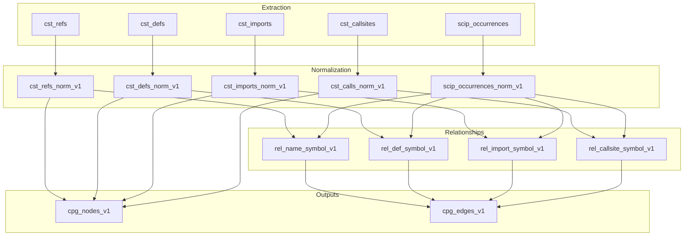

# Semantic Compiler

## Purpose

The semantic compiler transforms extraction tables into CPG outputs using composable rules. It bridges raw extraction outputs (PyArrow Tables with frozen schemas) and the rustworkx/Hamilton scheduling infrastructure by leveraging DataFusion's native plan building capabilities.

## Key Concepts

- **Column Presence Determines Operations** - Tables have semantic types based on what columns they contain
- **10 Composable Rules** - Derivation, join, projection, and aggregation rules that chain through data flow
- **DataFusion-Native** - Uses LogicalPlanBuilder and Rust UDFs, not a custom framework
- **Plan Introspection** - Dependencies are inferred from DataFusion plans, not declared manually
- **Semantic Catalog** - Single source of truth for dataset definitions, schemas, and view builders

---

## Core Design Principle

The fundamental insight is that tables have **semantic types** based on what columns they contain:

```
EVIDENCE_TABLE := has(PATH) ∧ has(SPAN_START) ∧ has(SPAN_END)
ENTITY_TABLE   := EVIDENCE_TABLE ∧ has(ENTITY_ID)
SYMBOL_TABLE   := has(SYMBOL)
RELATION_TABLE := has(ENTITY_ID) ∧ has(SYMBOL)
```

Once we know the semantic type, available operations follow:

- **EVIDENCE_TABLE** → can derive entity IDs, can derive span structs
- **ENTITY_TABLE** → can join with SYMBOL_TABLE to create relationships
- **RELATION_TABLE** → can union into CPG edges

---

## The Semantic Type System

### Column Types

Columns are classified by naming patterns:

```python
class ColumnType(StrEnum):
    PATH = auto()       # path, file_path, document_path
    FILE_ID = auto()    # file_id
    SPAN_START = auto() # bstart, *_bstart, byte_start
    SPAN_END = auto()   # bend, *_bend, byte_end
    ENTITY_ID = auto()  # *_id (excluding file_id)
    SYMBOL = auto()     # symbol, qname, qualified_name
    TEXT = auto()       # *_text, *_name, name
    EVIDENCE = auto()   # confidence, score, origin
    OTHER = auto()      # unclassified
```

**Key benefit**: When column names change, patterns update in one place.

### Table Types

Table types are derived from column type combinations:

```python
def infer_table_type(column_types: set[ColumnType]) -> TableType:
    has_path = ColumnType.PATH in column_types
    has_span = ColumnType.SPAN_START in column_types and ColumnType.SPAN_END in column_types
    has_entity_id = ColumnType.ENTITY_ID in column_types
    has_symbol = ColumnType.SYMBOL in column_types

    if has_entity_id and has_symbol:
        return TableType.RELATION
    if has_entity_id and has_path and has_span:
        return TableType.ENTITY
    if has_path and has_span:
        return TableType.EVIDENCE
    if has_symbol:
        return TableType.SYMBOL_SOURCE
    return TableType.RAW
```

---

## The 10 Semantic Rules

Each rule defines: **IF** condition **THEN** operation is available.

### Derivation Rules (1-3)

Add computed columns to tables:

| Rule | Condition | Operation | Rust UDF |
|------|-----------|-----------|----------|
| 1 | PATH + SPAN | Derive entity_id | `stable_id_parts(prefix, path, bstart, bend)` |
| 2 | SPAN_START + SPAN_END | Derive span struct | `span_make(bstart, bend)` |
| 3 | TEXT columns | Normalize text | `utf8_normalize(text, form="NFC")` |

**Example:**
```python
def normalize(self, table_name: str, *, prefix: str) -> DataFrame:
    info = self.get(table_name)
    sem = info.sem
    return (
        info.df
        .with_column(f"{prefix}_id", sem.entity_id_expr(prefix))
        .with_column("span", sem.span_expr())
    )
```

### Join Rules (4-6)

Combine tables based on semantic compatibility:

| Rule | Condition | Operation |
|------|-----------|-----------|
| 4 | Both have PATH | Equijoin on path |
| 5 | Both EVIDENCE + path join | Filter by `span_overlaps(a, b)` |
| 6 | Both EVIDENCE + path join | Filter by `span_contains(a, b)` |

```python
def join_by_span_overlap(left, right, left_sem, right_sem):
    joined = join_by_path(left, right, left_sem, right_sem)
    return joined.filter(span_overlaps(left_sem.span_expr(), right_sem.span_expr()))
```

### Projection Rule (7)

| Rule | Condition | Operation |
|------|-----------|-----------|
| 7 | ENTITY_ID + SYMBOL after join | Project to relation schema |

The relation schema is canonical:
```
(entity_id, symbol, path, bstart, bend, origin)
```

### Aggregation Rules (8-10)

| Rule | Condition | Operation |
|------|-----------|-----------|
| 8 | Compatible schemas | Union with discriminator |
| 9 | GROUP_KEY + VALUES | `array_agg(values)` by group |
| 10 | KEY + SCORE | Keep best row per key |

---

## Integration with DataFusion

DataFusion provides everything needed for plan building:

```
EXTRACTION TABLES (registered as TableProviders in SessionContext)
                    │
                    ▼
SEMANTIC COLUMN DISCOVERY
    ctx.table("cst_refs").schema() → classify each column:
      - file_id → FILE_IDENTITY
      - path → PATH
      - bstart, bend → SPAN_START, SPAN_END
    Result: SemanticSchema with path_col(), span_expr(), entity_id_expr()
                    │
                    ▼
RUST UDFs (registered in SessionContext)
    span_make(bstart, bend) → struct<start, end, unit>
    stable_id_parts(prefix, path, bstart, bend) → string
    span_overlaps(span_a, span_b) → bool
    span_contains(span_a, span_b) → bool
    utf8_normalize(text, form) → string
                    │
                    ▼
DATAFUSION LOGICALPLANBUILDER
    ctx.table("cst_refs")
        .with_column("ref_id", stable_id_parts(...))
        .with_column("span", span_make(...))
        .join(ctx.table("scip"), on=[path])
        .filter(span_overlaps(...))
        .select(entity_id, symbol, path, bstart, bend, origin)
    → DataFusion handles schema propagation, optimization, execution
```

### Rust UDF Integration

Rust UDFs are accessed through the generic expression helper:

```python
from datafusion_engine.udf.expr import udf_expr

def span_expr(self) -> Expr:
    return udf_expr("span_make", self.span_start_col(), self.span_end_col())

def entity_id_expr(self, prefix: str) -> Expr:
    return udf_expr(
        "stable_id_parts",
        prefix,
        self.path_col(),
        self.span_start_col(),
        self.span_end_col(),
    )
```

---

## Integration with rustworkx

The connection between semantic compilation and rustworkx scheduling is **plan introspection**:

```python
def build_cpg_from_inferred_deps(ctx: SessionContext) -> dict[str, object]:
    from datafusion_engine.lineage.datafusion import extract_lineage

    build_cpg(ctx)  # Registers all views

    deps = {}
    for name in view_names:
        df = ctx.table(name)
        plan = df.optimized_logical_plan()
        lineage = extract_lineage(plan)

        deps[name] = {
            "task_name": name,
            "output": name,
            "inputs": lineage.referenced_tables,
            "required_columns": lineage.required_columns_by_dataset,
            "plan_fingerprint": hash(str(plan)),
        }

    return deps
```

### How It Works

1. **Semantic compilation** produces DataFusion views (lazy—not executed yet)
2. **Plan introspection** walks the `LogicalPlan` tree to extract:
   - Which tables are scanned (`TableScan` nodes)
   - Which columns are required per table (projection analysis)
   - Plan structure for fingerprinting
3. **rustworkx** uses this to build the task graph
4. **Hamilton** generates DAG functions from the scheduled order

---

## Semantic Catalog

The semantic catalog centralizes dataset definitions, schemas, contracts, and view builders.

### Canonical Modules

| Module | Purpose |
|--------|---------|
| `catalog/dataset_rows.py` | `SemanticDatasetRow` definitions |
| `catalog/dataset_specs.py` | `DatasetSpec` entries from rows |
| `catalog/spec_builder.py` | Schema contracts and metadata |
| `catalog/view_builders.py` | Normalization + relationship builders |
| `catalog/analysis_builders.py` | Analysis/diagnostic output builders |

### Data Model

1. **Dataset rows** define structure (fields, join keys, merge keys, metadata)
2. **Dataset specs** derive Arrow schemas and contracts from rows
3. **View builders** materialize DataFusion plans for each dataset row
4. **Runtime** uses the catalog to resolve dataset locations and schema contracts

### Adding a New Dataset

1. Add a `SemanticDatasetRow` entry in `dataset_rows.py`
2. Add corresponding view builder in `view_builders.py` or `analysis_builders.py`
3. Ensure the dataset has:
   - Canonical name with `_v1` suffix
   - Correct `join_keys` and `merge_keys`
   - Appropriate `supports_cdf` and `partition_cols`

---

## Pipeline Data Flow



---

## Table Specifications

### CST Tables

| Table | Primary Span | Entity ID | Foreign Keys |
|-------|--------------|-----------|--------------|
| `cst_refs` | `bstart` to `bend` | `ref_id` | - |
| `cst_defs` | `def_bstart` to `def_bend` | `def_id` | `container_def_id` |
| `cst_imports` | `alias_bstart` to `alias_bend` | `import_id` | - |
| `cst_callsites` | `call_bstart` to `call_bend` | `call_id` | - |
| `cst_call_args` | `bstart` to `bend` | `call_arg_id` | `call_id` |
| `cst_docstrings` | `bstart` to `bend` | `docstring_id` | `owner_def_id` |
| `cst_decorators` | `bstart` to `bend` | `decorator_id` | `owner_def_id` |

### Relationship Specifications

| Relationship | Left Table | Right Table | Join Hint | Origin |
|--------------|------------|-------------|-----------|--------|
| `rel_name_symbol_v1` | `cst_refs_norm_v1` | `scip_occurrences_norm_v1` | `overlap` | `cst_ref_text` |
| `rel_def_symbol_v1` | `cst_defs_norm_v1` | `scip_occurrences_norm_v1` | `contains` | `cst_def_name` |
| `rel_import_symbol_v1` | `cst_imports_norm_v1` | `scip_occurrences_norm_v1` | `overlap` | `cst_import_name` |
| `rel_callsite_symbol_v1` | `cst_calls_norm_v1` | `scip_occurrences_norm_v1` | `overlap` | `cst_callsite` |

---

## Incremental Protocol

The semantic incremental protocol uses Delta Lake Change Data Feed (CDF) for efficient updates.

### Core Workflow

1. **Resolve inputs** and compute plan bundles for semantic tasks
2. **Read CDF** for changed datasets via `read_cdf_changes`
3. **Compute impacted tasks** from evidence and plan fingerprints
4. **Build incremental results** using semantic join builders
5. **Merge outputs** with `CDFMergeStrategy` (upsert, replace, delete/insert)
6. **Update cursors** on successful CDF reads

### Configuration

`IncrementalConfig` controls:

| Field | Purpose |
|-------|---------|
| `enabled` | Enable/disable incremental mode |
| `state_dir` | Cursor + state storage root |
| `cdf_filter_policy` | Change-type selection |
| `default_merge_strategy` | Default merge strategy |
| `impact_strategy` | Closure strategy for impacted files |

### Merge Strategies

| Strategy | Behavior |
|----------|----------|
| `UPSERT` | Merge incremental results by key columns |
| `REPLACE` | Delete partitions then append |
| `APPEND` | Add rows without deletes |
| `DELETE_INSERT` | Delete by keys then insert |

### Storage Layout

```
<state_dir>/
  cursors/       # Per-dataset version checkpoints
  delta/         # Delta table staging
  snapshots/     # State snapshots
  plan_fingerprints/  # Plan hash tracking
```

---

## Example Pipeline

```python
def build_cpg(ctx: SessionContext) -> None:
    compiler = SemanticCompiler(ctx)

    # Stage 1: Normalize extraction tables (Rule 1 + Rule 2)
    ctx.register_view("cst_refs_norm", compiler.normalize("cst_refs", prefix="ref"))
    ctx.register_view("cst_defs_norm", compiler.normalize("cst_defs", prefix="def"))
    ctx.register_view("cst_imports_norm", compiler.normalize("cst_imports", prefix="import"))
    ctx.register_view("cst_calls_norm", compiler.normalize("cst_callsites", prefix="call"))

    # Register for relationship building
    compiler.register("scip_occurrences")

    # Stage 2: Build relationships (Rule 5/6 + Rule 7)
    ctx.register_view("rel_name_symbol", compiler.relate(
        "cst_refs_norm", "scip_occurrences",
        join_type="overlap", origin="cst_ref",
    ))
    ctx.register_view("rel_def_symbol", compiler.relate(
        "cst_defs_norm", "scip_occurrences",
        join_type="contains", origin="cst_def",
    ))

    # Stage 3: Build CPG outputs (Rule 8)
    ctx.register_view("cpg_edges", compiler.union_with_discriminator(
        ["rel_name_symbol", "rel_def_symbol"],
        discriminator="edge_kind",
    ))
```

---

## Comparison: Before and After

| Aspect | Before | After |
|--------|--------|-------|
| Lines of code | ~7,000 | ~1,200 |
| Schema changes | 50+ locations | 1 pattern file |
| Dependency declaration | Manual | Inferred from plans |
| Join logic | 5 parallel builders | 3 helper functions |
| Adding new relationship | Copy-paste 200+ lines | 5-line `compiler.relate()` call |

---

## Design Invariants

1. **Column presence is semantic** - Tables have meaning based on what columns they contain
2. **DataFusion is the framework** - We don't build a custom plan builder
3. **Rules compose cleanly** - Each rule is independent; they chain through data flow
4. **Plan introspection bridges to scheduling** - Dependencies come from the plan, not declarations
5. **Rust UDFs do the heavy lifting** - `span_make`, `stable_id`, `span_overlaps` are fast and correct
6. **Semantic catalog is the single source of truth** - All dataset specs and view builders are centralized

---

## Cross-References

- **[02_pipeline_stages.md](02_pipeline_stages.md)** - Four-stage pipeline overview
- **[04_datafusion_integration.md](04_datafusion_integration.md)** - DataFusion engine details
- **[05_rust_and_udfs.md](05_rust_and_udfs.md)** - Rust UDF implementation
- **[07_storage_and_incremental.md](07_storage_and_incremental.md)** - Delta Lake and CDF

**Source Files:**
- `src/semantics/compiler.py` - SemanticCompiler implementation
- `src/semantics/schema.py` - SemanticSchema and type inference
- `src/semantics/config.py` - SemanticConfig and overrides
- `src/semantics/catalog/` - Dataset rows, specs, and view builders
- `src/semantics/incremental/` - CDF cursors, readers, merge strategies
