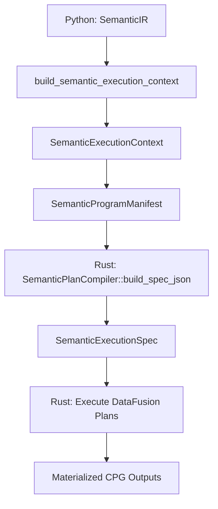
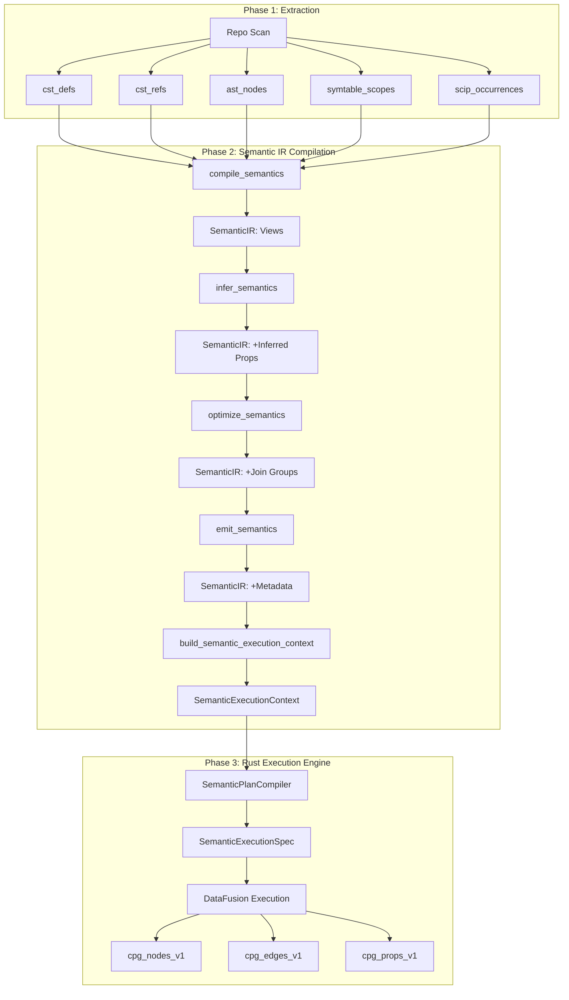

# Semantic IR Compilation (Python)

## Overview

The semantic compiler is **Phase 2** of CodeAnatomy's three-phase pipeline. It consumes extraction tables (Phase 1) and produces a **Semantic IR** (Intermediate Representation) that the Rust engine (Phase 3) compiles into executable DataFusion plans.

This document describes the Python-owned semantic compilation pipeline: what it produces, how it works, and what contracts it enforces. The semantic compiler is **not** an execution engine—it is a specification compiler that generates declarative IR artifacts for the Rust boundary.

**Three-Phase Architecture:**

```
Phase 1: Extraction (Python)
    ↓ Evidence Tables
Phase 2: Semantic IR Compilation (Python) ← THIS DOCUMENT
    ↓ SemanticIR + SemanticExecutionContext
Phase 3: Rust Execution Engine (Rust)
    ↓ CPG Outputs
```

**What the Semantic Compiler Does:**
- Transforms extraction evidence tables into normalized entity views
- Defines relationship joins between entities and symbols
- Builds union views for edges and nodes
- Generates diagnostic and export projections
- Produces a **SemanticIR** structure describing the complete view DAG
- Compiles a **SemanticExecutionContext** with validated inputs and metadata

**What the Semantic Compiler Does NOT Do:**
- Execute DataFusion queries (Rust engine responsibility)
- Materialize Delta Lake tables (Rust engine responsibility)
- Schedule execution (Rust engine responsibility)
- Manage incremental processing (Rust engine responsibility)

---

## Semantic IR Pipeline

The semantic IR compilation proceeds through **four deterministic stages**:


### Stage 1: Compile (`compile_semantics()`)

**Purpose:** Convert `SemanticModel` into `SemanticIRView` nodes.

**Input:** `SemanticModel` with normalization specs, relationship specs, and output specs.

**Output:** `SemanticIR` with `views` tuple (no inferred properties, no join groups).

**Operations:**
1. Emit `normalize` views for each extraction table spec (entity ID + span derivation)
2. Emit `scip_normalize` view (SCIP line→byte offset conversion)
3. Emit `bytecode_line_index` view (bytecode line table enhancement)
4. Emit `span_unnest` views (unnest span arrays from AST, tree-sitter, symtable, bytecode)
5. Emit `symtable` views (bindings, def sites, use sites, type params)
6. Emit `relate` views for each relationship spec (entity-symbol joins)
7. Emit `union_edges` view (union all relationships)
8. Emit `union_nodes` view (union all normalized entities with `include_in_cpg_nodes=True`)
9. Emit `projection` view (final relation schema)
10. Emit `diagnostic` views (quality metrics, ambiguity reports, candidates, decisions)
11. Emit `export` views (exported definitions)
12. Emit `finalize` views (CPG nodes, edges, properties, adjacency maps)

**Key Data Structure:**

```python
SemanticIRView(
    name="cst_defs_norm",
    kind="normalize",
    inputs=("cst_defs",),
    outputs=("cst_defs_norm",),
    inferred_properties=None,  # Not yet inferred
)
```

### Stage 2: Infer (`infer_semantics()`)

**Purpose:** Populate `inferred_properties` on each view using schema metadata and graph topology.

**Input:** `SemanticIR` from compile stage.

**Output:** `SemanticIR` with `inferred_properties` populated on each view.

**Operations:**
1. Build consumer map (which views depend on each view)
2. Classify graph position (source, intermediate, terminal, high_fan_out)
3. Infer join strategy from `AnnotatedSchema` compatibility groups
4. Infer join keys from `FILE_IDENTITY` or `ENTITY_IDENTITY` groups
5. Derive cache policy hint from graph position:
   - `high_fan_out` → `"eager"` (cache to avoid recomputation)
   - `terminal` → `"lazy"` (no intermediate caching needed)
   - Others → `None`
6. Build `InferenceConfidence` metadata for strongest signal (join strategy or cache policy)

**Key Data Structure:**

```python
InferredViewProperties(
    inferred_join_strategy="span_overlap",
    inferred_join_keys=(("file_id", "file_id"), ("path", "path")),
    inferred_cache_policy="eager",
    graph_position="high_fan_out",
    inference_confidence=InferenceConfidence(
        decision_type="join_strategy",
        decision_value="span_overlap",
        confidence_score=0.95,
        evidence_sources=("field_metadata", "schema"),
    ),
)
```

**Graceful Degradation:** If inference fails for any view, `inferred_properties` remains `None` and the view continues with static declarations.

### Stage 3: Optimize (`optimize_semantics()`)

**Purpose:** Deduplicate views, build join-fusion groups, and prune unrequested outputs.

**Input:** `SemanticIR` with inferred properties.

**Output:** `SemanticIR` with `join_groups` and pruned `views`.

**Operations:**
1. Deduplicate views (detect name collisions with different definitions)
2. Group `relate` views sharing the same `(left_view, right_view, left_on, right_on, how)` signature
3. Emit `join_group` views for groups with ≥2 relationships (join-fusion optimization)
4. Order join groups by estimated cost (row count hints, selectivity hints)
5. Sort views by `VIEW_KIND_ORDER` tier
6. Prune views not required by requested outputs (reachability analysis)

**Join Group Example:**

```python
SemanticIRJoinGroup(
    name="join_cst_defs_norm__scip_occurrences_norm__abc123",
    left_view="cst_defs_norm",
    right_view="scip_occurrences_norm",
    left_on=("file_id", "path"),
    right_on=("file_id", "path"),
    how="inner",
    relationship_names=(
        "rel_def_symbol",
        "rel_def_external_symbol",
    ),
)
```

**View Kind Ordering:**

Views are sorted by tier for deterministic execution order:

| Tier | Kind |
|------|------|
| 0 | `normalize` |
| 1 | `scip_normalize` |
| 2 | `bytecode_line_index`, `span_unnest`, `symtable` |
| 3 | `join_group` |
| 4 | `relate` |
| 5 | `union_edges` |
| 6 | `union_nodes` |
| 7 | `projection` |
| 8 | `diagnostic` |
| 9 | `export` |
| 10 | `finalize` |
| 11 | `artifact` |

### Stage 4: Emit (`emit_semantics()`)

**Purpose:** Attach dataset metadata and compute fingerprints.

**Input:** `SemanticIR` from optimize stage.

**Output:** `SemanticIR` with `dataset_rows`, `model_hash`, and `ir_hash`.

**Operations:**
1. Build `SemanticDatasetRow` metadata for all views (inputs, normalizations, relationships, diagnostics, exports, CPG outputs)
2. Compute `model_hash` (semantic model fingerprint)
3. Compute `ir_hash` (IR structure fingerprint)
4. Return final `SemanticIR`

**Dataset Row Metadata:**

Each view receives a `SemanticDatasetRow` describing its schema, bundles, merge keys, join keys, template, and role:

```python
SemanticDatasetRow(
    name="cst_defs_norm",
    version="semantic_v1",
    bundles=("file_identity", "span"),
    fields=("def_id", "entity_id", "def_kind", "def_name", "def_text", ...),
    category="semantic",
    supports_cdf=True,
    merge_keys=("def_id",),
    join_keys=("def_id",),
    template="semantic_normalize",
    register_view=True,
    source_dataset="cst_defs",
)
```

---

## SemanticIR Data Model

The `SemanticIR` is the **primary artifact** produced by the semantic compiler. It describes the complete DAG of semantic views without any execution-specific details.

### SemanticIR

```python
@dataclass(frozen=True)
class SemanticIR:
    views: tuple[SemanticIRView, ...]
    dataset_rows: tuple[SemanticDatasetRow, ...] = ()
    join_groups: tuple[SemanticIRJoinGroup, ...] = ()
    model_hash: str | None = None
    ir_hash: str | None = None
```

**Attributes:**
- `views` — Ordered tuple of all semantic views (compile stage)
- `dataset_rows` — Schema metadata for each view (emit stage)
- `join_groups` — Join-fusion groups for shared joins (optimize stage)
- `model_hash` — Fingerprint of the semantic model (emit stage)
- `ir_hash` — Fingerprint of the IR structure (emit stage)

### SemanticIRView

```python
@dataclass(frozen=True)
class SemanticIRView:
    name: str
    kind: ViewKindStr
    inputs: tuple[str, ...]
    outputs: tuple[str, ...]
    inferred_properties: InferredViewProperties | None = None
```

**Attributes:**
- `name` — Unique view name (e.g., `"cst_defs_norm"`, `"rel_def_symbol"`)
- `kind` — View kind from 14-element vocabulary (see View Kinds section)
- `inputs` — Upstream view names this view depends on
- `outputs` — Output view names this view produces (typically same as `name`)
- `inferred_properties` — Optional inference metadata (added by infer stage)

### SemanticIRJoinGroup

```python
@dataclass(frozen=True)
class SemanticIRJoinGroup:
    name: str
    left_view: str
    right_view: str
    left_on: tuple[str, ...]
    right_on: tuple[str, ...]
    how: JoinHow
    relationship_names: tuple[str, ...]
```

**Attributes:**
- `name` — Generated join group name (hash-based)
- `left_view`, `right_view` — Views to join
- `left_on`, `right_on` — Join key column names
- `how` — Join type (`"inner"`, `"left"`, `"right"`, `"full"`)
- `relationship_names` — Relationship views sharing this join

**Join Fusion:** Multiple relationships sharing the same join signature are grouped to avoid redundant joins. The Rust engine materializes the join once and projects multiple outputs.

### InferredViewProperties

```python
@dataclass(frozen=True)
class InferredViewProperties:
    inferred_join_strategy: str | None = None
    inferred_join_keys: tuple[tuple[str, str], ...] | None = None
    inferred_cache_policy: str | None = None
    graph_position: GraphPosition | None = None
    inference_confidence: InferenceConfidence | None = None
```

**Attributes:**
- `inferred_join_strategy` — Join strategy type (`"span_overlap"`, `"foreign_key"`, `"symbol_match"`, `"equi_join"`)
- `inferred_join_keys` — Ordered join key pairs `[(left_col, right_col), ...]`
- `inferred_cache_policy` — Cache hint (`"eager"`, `"lazy"`, `None`)
- `graph_position` — Topological position (`"source"`, `"intermediate"`, `"terminal"`, `"high_fan_out"`)
- `inference_confidence` — Confidence metadata for the strongest inference decision

**Graph Positions:**

| Position | Meaning | Cache Policy |
|----------|---------|--------------|
| `source` | No upstream dependencies (input views) | None |
| `intermediate` | Has upstream and downstream deps | None |
| `terminal` | No downstream consumers | `"lazy"` |
| `high_fan_out` | 3+ downstream consumers | `"eager"` |

---

## View Kinds

The semantic IR defines **14 view kinds** organized into **11 tiers**. Each kind corresponds to a distinct transformation pattern.

### View Kind Vocabulary

```python
ViewKindStr = Literal[
    "normalize",
    "scip_normalize",
    "bytecode_line_index",
    "span_unnest",
    "symtable",
    "join_group",
    "relate",
    "union_edges",
    "union_nodes",
    "projection",
    "diagnostic",
    "export",
    "finalize",
    "artifact",
]
```

### View Kinds Table

| Kind | Tier | Purpose | Example Views |
|------|------|---------|---------------|
| `normalize` | 0 | Entity ID + span from evidence | `cst_defs_norm`, `cst_refs_norm` |
| `scip_normalize` | 1 | SCIP line→byte offset conversion | `scip_occurrences_norm` |
| `bytecode_line_index` | 2 | Bytecode line table enhancement | `py_bc_line_table_with_bytes` |
| `span_unnest` | 2 | Unnest span arrays | `ast_span_unnest`, `ts_span_unnest` |
| `symtable` | 2 | Symbol table bindings | `symtable_bindings`, `symtable_def_sites` |
| `join_group` | 3 | Pre-joined views for relationships | `join_cst_defs__scip_occurrences__abc123` |
| `relate` | 4 | Entity-symbol joins | `rel_def_symbol`, `rel_ref_symbol` |
| `union_edges` | 5 | Union relationship edges | `semantic_edges_v1` |
| `union_nodes` | 6 | Union normalized entities | `semantic_nodes_v1` |
| `projection` | 7 | Final output schema | `relation_v1` |
| `diagnostic` | 8 | Quality diagnostics | `relationship_quality_metrics` |
| `export` | 9 | Exported definitions | `dim_exported_defs` |
| `finalize` | 10 | CPG emission (Rust-owned) | `cpg_nodes_v1`, `cpg_edges_v1` |
| `artifact` | 11 | Auxiliary artifacts | Custom outputs |

**Execution Order:** Views are executed in tier order (0 → 11). Within a tier, execution order is unspecified.

**Normalization vs. Derivation:**
- **Normalization** (`normalize`, `scip_normalize`, `bytecode_line_index`) — Converts evidence tables to canonical byte-span representation
- **Derivation** (`span_unnest`, `symtable`) — Derives new tables from normalized inputs
- **Relationship** (`join_group`, `relate`) — Joins entities with symbols
- **Aggregation** (`union_edges`, `union_nodes`, `projection`) — Combines multiple views
- **Metadata** (`diagnostic`, `export`, `finalize`, `artifact`) — Produces metadata and CPG outputs

---

## SemanticCompiler Class

`SemanticCompiler` is the **core transformation engine** that applies semantic rules to DataFusion DataFrames. It is used internally by view builders but is **not** invoked directly in the IR pipeline (the IR pipeline generates declarations; the Rust engine executes them).

### 10 Semantic Rules

The compiler encodes **10 semantic rules** that define all transformations:

| # | Name | Condition | Operation |
|---|------|-----------|-----------|
| 1 | Derive Entity ID | `PATH + SPAN` | `stable_id(prefix, path, bstart, bend)` |
| 2 | Derive Span | `SPAN_START + SPAN_END` | `span_make(bstart, bend, "byte")` |
| 3 | Normalize Text | `TEXT` columns | `utf8_normalize(text, "NFC")` |
| 4 | Path Join | Both have `PATH` | Equijoin on `path` |
| 5 | Span Overlap | Both `EVIDENCE` | Filter `span_overlaps(a, b)` |
| 6 | Span Contains | Both `EVIDENCE` | Filter `span_contains(a, b)` |
| 7 | Relation Project | `ENTITY_ID + SYMBOL` | Project to relation schema |
| 8 | Union | Compatible schemas | Union with discriminator |
| 9 | Aggregate | `GROUP_KEY + VALUES` | `array_agg(values)` |
| 10 | Dedupe | `KEY + SCORE` | Keep best per key |

### Core Operations

**Normalization (`normalize()`, `normalize_from_spec()`):**

```python
def normalize_from_spec(self, spec: SemanticTableSpec) -> DataFrame:
    """Apply Rules 1 + 2: entity ID + span derivation."""
```

**Steps:**
1. Validate required columns (path, span start/end, ID cols, FK cols, text cols)
2. Derive canonical span columns (`bstart`, `bend`, `span`)
3. Derive entity ID via `stable_id(namespace, path, bstart, bend)`
4. Derive foreign key IDs with null guards
5. Drop line-based columns (keep only byte-based)

**Example Output:**

```
Input:  cst_defs (def_name, def_kind, def_bstart, def_bend, path, ...)
Output: cst_defs_norm (def_id, entity_id, bstart, bend, span, path, file_id, def_name, ...)
```

**Relationship Building (`relate()`, `compile_relationship_with_quality()`):**

```python
def relate(
    self,
    left_table: str,
    right_table: str,
    *,
    options: RelationOptions,
) -> DataFrame:
    """Apply Rules 5/6 + 7: join by span overlap/containment + project to relation schema."""
```

**Steps:**
1. Infer join strategy from annotated schemas (span overlap, span contains, foreign key, equi-join)
2. Prefix left/right tables to avoid column collisions
3. Execute join with inferred strategy
4. Apply optional filter SQL
5. Project to canonical relation schema: `(entity_id, symbol, path, bstart, bend, origin)`

**Quality-Aware Compilation (`compile_relationship_with_quality()`):**

For quality relationships (with confidence scoring and ambiguity ranking):

1. Alias left/right tables with `l__` and `r__` prefixes
2. Equijoin on hard keys (`left_on`/`right_on`)
3. Optionally join file quality signals via `file_id`
4. Apply hard predicates via `filter()` (creates `hard_1`, `hard_2`, ... columns)
5. Add feature columns via `with_column()` (creates `feat_<name>` columns)
6. Compute `score = base_score + Σ(feat_i × weight_i)`
7. Compute `confidence = base_confidence + score/10000 + quality_adjustment`
8. Add metadata columns (`origin`, `provider`, `rule_name`)
9. Apply ambiguity ranking:
   - Partition by `ambiguity_key_expr` → `ambiguity_group_id`
   - Order by `order_by` expressions
   - Filter to `top_k` if `keep="best"`
10. Project final output columns (select exprs or default projection)

**Union Operations (`union_with_discriminator()`, `union_nodes()`, `union_edges()`):**

```python
def union_nodes(self, table_names: list[str], *, discriminator: str = "node_kind") -> DataFrame:
    """Apply Rule 8: union after canonical projection."""
```

**Steps:**
1. Project each table to canonical schema (`CANONICAL_NODE_SCHEMA` or `CANONICAL_EDGE_SCHEMA`)
2. Add discriminator column (e.g., `"node_kind"`, `"edge_kind"`)
3. Union all tables
4. Return sorted by canonical column order

**Aggregation (`aggregate()`):**

```python
def aggregate(
    self,
    table_name: str,
    *,
    group_by: list[str],
    aggregate: dict[str, str],
) -> DataFrame:
    """Apply Rule 9: array_agg aggregation."""
```

**Deduplication (`dedupe()`):**

```python
def dedupe(
    self,
    table_name: str,
    *,
    key_columns: list[str],
    score_column: str,
    descending: bool = True,
) -> DataFrame:
    """Apply Rule 10: keep best row per key."""
```

### Key Methods Summary

| Method | Rules Applied | Purpose |
|--------|---------------|---------|
| `normalize_from_spec()` | 1, 2 | Entity ID + span derivation |
| `normalize_text()` | 3 | Text normalization (NFC, casefold, collapse_ws) |
| `relate()` | 5/6, 7 | Span-based join + relation projection |
| `compile_relationship_with_quality()` | 4, 5/6, 7, 10 | Quality-scored relationship compilation |
| `union_with_discriminator()` | 8 | Union with discriminator column |
| `union_nodes()` | 8 | Union normalized entities to canonical node schema |
| `union_edges()` | 8 | Union relationships to canonical edge schema |
| `aggregate()` | 9 | Array aggregation |
| `dedupe()` | 10 | Deduplication by score |

---

## Entity Model

The **entity model** elevates semantic declarations from schema-centric table specs to entity-centric declarations. Each `EntityDeclaration` generates a `SemanticTableSpec` losslessly.

### EntityDeclaration

```python
class EntityDeclaration(StructBaseStrict, frozen=True):
    name: str
    source_table: str
    identity: IdentitySpec
    location: LocationSpec
    normalized_name: str | None = None
    content: tuple[str, ...] = ()
    foreign_keys: tuple[ForeignKeySpec, ...] = ()
    span_unit: SpanUnit = "byte"
    include_in_cpg_nodes: bool = True
```

**Attributes:**
- `name` — Logical entity name (e.g., `"cst_ref"`, `"cst_def"`)
- `source_table` — Extraction table name (e.g., `"cst_refs"`, `"cst_defs"`)
- `identity` — How entity ID is derived
- `location` — Span columns locating the entity
- `normalized_name` — Override for normalized output view name
- `content` — Content columns to carry through normalization
- `foreign_keys` — Foreign key references to other entities
- `span_unit` — Span unit (`"byte"` only, currently)
- `include_in_cpg_nodes` — Whether to include in `semantic_nodes_v1` union

### IdentitySpec

```python
class IdentitySpec(StructBaseStrict, frozen=True):
    namespace: str
    id_column: str
```

**Attributes:**
- `namespace` — Stable namespace for deterministic ID hashing (e.g., `"cst_ref"`, `"cst_def"`)
- `id_column` — Output column name for derived entity ID (e.g., `"ref_id"`, `"def_id"`)

### LocationSpec

```python
class LocationSpec(StructBaseStrict, frozen=True):
    start_col: str
    end_col: str
```

**Attributes:**
- `start_col` — Source column for span start byte offset
- `end_col` — Source column for span end byte offset

### ForeignKeySpec

```python
class ForeignKeySpec(StructBaseStrict, frozen=True):
    column: str
    target_entity: str
    ref_start_col: str
    ref_end_col: str
    guard_null_if: tuple[str, ...] = ()
```

**Attributes:**
- `column` — Output column name for derived foreign key ID
- `target_entity` — Namespace of referenced entity
- `ref_start_col`, `ref_end_col` — Reference span columns
- `guard_null_if` — Columns whose NULL values force FK to NULL

**Example Entity Declaration:**

```python
EntityDeclaration(
    name="cst_def",
    source_table="cst_defs",
    identity=IdentitySpec(namespace="cst_def", id_column="def_id"),
    location=LocationSpec(start_col="def_bstart", end_col="def_bend"),
    content=("def_name", "def_kind", "def_text"),
    foreign_keys=(
        ForeignKeySpec(
            column="container_def_id",
            target_entity="cst_def",
            ref_start_col="container_bstart",
            ref_end_col="container_bend",
            guard_null_if=("container_bstart",),
        ),
    ),
    include_in_cpg_nodes=True,
)
```

---

## Semantic Type System

The semantic type system uses **column presence** to determine operations. The presence of specific columns in a table's schema determines its **semantic category** and which rules apply.

### Column Presence Determines Operations

| Columns Present | Semantic Category | Rules Available |
|----------------|-------------------|-----------------|
| `PATH + SPAN_START + SPAN_END` | `EVIDENCE_TABLE` | 1, 2, 3, 4, 5, 6 |
| `ENTITY_ID + PATH + SPAN` | `ENTITY_TABLE` | 4, 5, 6, 7 |
| `SYMBOL` | `SYMBOL_SOURCE` | 4, 5, 6, 7 |
| `ENTITY_ID + SYMBOL + SPAN` | `RELATION_TABLE` | 7, 8, 10 |
| Compatible schemas | `UNION_COMPATIBLE` | 8 |
| `GROUP_KEY` columns | `AGGREGATABLE` | 9 |
| `KEY + SCORE` columns | `DEDUPABLE` | 10 |

### Semantic Schema Detection

The `SemanticSchema` class (in `src/semantics/schema.py`) inspects DataFusion schemas and classifies columns:

```python
class SemanticSchema:
    @classmethod
    def from_df(cls, df: DataFrame, *, table_name: str) -> SemanticSchema:
        """Classify columns and detect semantic capabilities."""
```

**Column Type Classification:**
- `PATH` — File path column
- `SPAN_START` — Byte offset start
- `SPAN_END` — Byte offset end
- `SPAN_STRUCT` — Structured span (bstart + bend)
- `ENTITY_ID` — Entity identifier
- `SYMBOL` — Symbol name
- `FILE_ID` — File identifier (SHA256)
- `TEXT` — Text content

**Semantic Requirements:**

```python
def require_evidence(self, *, table: str) -> None:
    """Require PATH + SPAN_START + SPAN_END columns."""

def require_entity(self, *, table: str) -> None:
    """Require ENTITY_ID column."""

def require_symbol_source(self, *, table: str) -> None:
    """Require SYMBOL column."""
```

**No Explicit Type Annotations:**

The semantic type system is **inference-based**. There are no `TYPE` columns or metadata annotations. Column names and patterns determine semantic types:
- `*_id` → `ENTITY_ID`
- `bstart`, `*_bstart` → `SPAN_START`
- `bend`, `*_bend` → `SPAN_END`
- `span`, `*_span` → `SPAN_STRUCT`
- `symbol`, `*_symbol` → `SYMBOL`
- `path`, `file_path` → `PATH`

---

## Compile Context

The **compile context** (`build_semantic_execution_context()`) orchestrates the full semantic compilation pipeline and produces a `SemanticExecutionContext` ready for the Rust boundary.

### SemanticExecutionContext

```python
@dataclass(frozen=True)
class SemanticExecutionContext:
    manifest: SemanticProgramManifest
    dataset_resolver: ManifestDatasetResolver
    runtime_profile: DataFusionRuntimeProfile
    ctx: SessionContext
    facade: DataFusionExecutionFacade | None = None
```

**Attributes:**
- `manifest` — Compiled semantic program manifest (IR + inputs + validation)
- `dataset_resolver` — Dataset location resolver (maps view names to Delta paths)
- `runtime_profile` — DataFusion runtime configuration
- `ctx` — Active DataFusion session context
- `facade` — Optional execution facade for Python-side execution

### build_semantic_execution_context()

```python
def build_semantic_execution_context(
    *,
    runtime_profile: DataFusionRuntimeProfile,
    outputs: Collection[str] | None = None,
    policy: SemanticInputValidationPolicy = "schema_only",
    ctx: SessionContext | None = None,
    input_mapping: Mapping[str, str] | None = None,
    facade: DataFusionExecutionFacade | None = None,
) -> SemanticExecutionContext:
```

**Parameters:**
- `runtime_profile` — Runtime configuration (session, catalog, storage options)
- `outputs` — Optional subset of outputs to compile (default: all outputs)
- `policy` — Input validation policy (`"none"`, `"schema_only"`, `"strict"`)
- `ctx` — Optional pre-existing session context
- `input_mapping` — Optional input table name overrides
- `facade` — Optional execution facade

**Steps:**

1. **Compile Semantic IR:**
   ```python
   semantic_ir = build_semantic_ir(outputs=canonical_outputs)
   ```

2. **Build Dataset Catalog:**
   ```python
   catalog = dataset_catalog_from_profile(runtime_profile)
   dataset_bindings = ManifestDatasetBindings(
       locations={name: catalog.get(name) for name in catalog.names()}
   )
   ```

3. **Create Manifest:**
   ```python
   manifest = SemanticProgramManifest(
       semantic_ir=semantic_ir,
       requested_outputs=canonical_outputs,
       input_mapping=resolved_input_mapping,
       validation_policy=policy,
       dataset_bindings=dataset_bindings,
       output_name_map=output_name_map_from_views(semantic_ir.views),
   )
   ```

4. **Validate Inputs:**
   ```python
   validation = validate_semantic_inputs(ctx, manifest, policy)
   compiled_manifest = replace(manifest, validation=validation).with_fingerprint()
   ```

5. **Return Context:**
   ```python
   return SemanticExecutionContext(
       manifest=compiled_manifest,
       dataset_resolver=compiled_manifest.dataset_bindings,
       runtime_profile=runtime_profile,
       ctx=ctx,
       facade=facade,
   )
   ```

**Input Validation Policies:**

| Policy | Behavior |
|--------|----------|
| `"none"` | Skip validation entirely |
| `"schema_only"` | Validate schema compatibility only |
| `"strict"` | Validate schemas + row counts + column stats |

---

## Relationship to Rust Engine

The semantic compiler produces **declarative IR artifacts** that the Rust engine compiles into executable plans. This section describes the handoff boundary.

### Python → Rust Handoff



### Handoff Contract

**Python Produces:**
1. `SemanticIR` — View DAG with kinds, inputs, outputs, inferred properties, join groups
2. `SemanticDatasetRow` metadata — Schema, bundles, merge keys, join keys, templates
3. `SemanticProgramManifest` — IR + input mapping + validation + dataset bindings
4. `SemanticExecutionContext` — Manifest + resolver + runtime profile + session

**Rust Consumes:**
1. `SemanticIR` JSON — Deserialized into Rust `SemanticIR` struct
2. `SemanticPlanCompiler` — Converts IR to `SemanticExecutionSpec`
3. `SemanticExecutionSpec` — Executable plan with DataFusion view definitions
4. Rust execution engine — Materializes views, writes Delta tables, emits CPG outputs

**Boundary Format:**

The Rust `SemanticPlanCompiler` receives JSON-serialized `SemanticIR` and a request spec:

```python
from datafusion_engine.semantic_plan_compiler import SemanticPlanCompiler

ir_json = msgspec.json.encode(semantic_ir)
request_json = msgspec.json.encode(execution_request)
spec = SemanticPlanCompiler.build_spec_json(ir_json, request_json)
```

**Rust-Side Authority:**

The Rust engine owns:
- DataFusion plan execution
- Delta Lake materialization
- Incremental processing
- CPG emission (`finalize` views)
- Execution scheduling
- Cache policy enforcement

**Python-Side Authority:**

The Python compiler owns:
- Semantic IR structure
- View kind vocabulary
- Join strategy inference
- Quality relationship compilation
- Input validation
- Dataset catalog management

---

## Design Invariants

The semantic compiler enforces several critical invariants to ensure deterministic, composable, and correct IR generation.

### 1. Column Presence Is Semantic

**Invariant:** Semantic types are determined by column presence, not explicit annotations.

**Rationale:** This enables zero-configuration inference. Any table with `path`, `bstart`, `bend` is automatically recognized as `EVIDENCE_TABLE`.

**Enforcement:** `SemanticSchema` classification is structural, not declarative.

### 2. Rules Compose

**Invariant:** Each semantic rule is independent and composable. Rules do not have hidden dependencies or side effects.

**Rationale:** This enables local reasoning. You can understand Rule 5 (span overlap join) without understanding Rule 9 (aggregation).

**Enforcement:** `SemanticCompiler` methods are pure transformations (DataFrame → DataFrame).

### 3. DataFusion-Native

**Invariant:** All transformations compile to DataFusion expressions. No custom execution logic.

**Rationale:** This ensures the Rust engine can execute the IR without Python-specific runtime dependencies.

**Enforcement:** `SemanticCompiler` uses only DataFusion UDFs (`stable_id`, `span_make`, `span_overlaps`, `span_contains`, `utf8_normalize`).

### 4. Byte Spans Are Canonical

**Invariant:** All span columns use **byte offsets**, not line/column positions.

**Rationale:** Line/column positions are unstable (line ending normalization, tab expansion). Byte offsets are unambiguous.

**Enforcement:** `normalize()` drops line-based columns. All span joins operate on `bstart`/`bend`.

### 5. Stable IDs Are Deterministic

**Invariant:** Entity IDs are deterministic hashes of `(namespace, path, bstart, bend)`.

**Rationale:** This enables incremental processing and stable graph node identifiers.

**Enforcement:** `stable_id()` UDF uses `Blake3` with canonical msgpack serialization.

### 6. Inference Is Graceful

**Invariant:** Inference failures degrade gracefully. Missing inferred properties do not block compilation.

**Rationale:** This enables progressive enhancement. New inference capabilities can be added without breaking existing pipelines.

**Enforcement:** `infer_semantics()` catches exceptions and leaves `inferred_properties=None`.

### 7. Outputs Are Prunable

**Invariant:** The IR can be pruned to a subset of requested outputs without changing semantics.

**Rationale:** This enables efficient partial builds (e.g., diagnostics-only, nodes-only).

**Enforcement:** `optimize_semantics(outputs=...)` performs reachability pruning.

### 8. Join Groups Are Deterministic

**Invariant:** Join groups are named deterministically based on join signature hash.

**Rationale:** This enables stable caching and incremental builds.

**Enforcement:** `_join_group_name()` uses stable hash of `(left_view, right_view, how, left_on, right_on)`.

### 9. View Kinds Are Ordered

**Invariant:** View kinds define a strict execution order (tier 0 → tier 11).

**Rationale:** This ensures normalization completes before relationships, relationships before unions, etc.

**Enforcement:** `VIEW_KIND_ORDER` dictionary and sort key in `optimize_semantics()`.

### 10. IR Is Fingerprinted

**Invariant:** Every IR has a deterministic fingerprint (`model_hash`, `ir_hash`).

**Rationale:** This enables cache invalidation and incremental builds.

**Enforcement:** `semantic_model_fingerprint()` and `semantic_ir_fingerprint()` use canonical msgpack serialization.

---

## Data Flow

The semantic compiler sits between extraction (Phase 1) and the Rust engine (Phase 3):



**Key Transitions:**

1. **Extraction → Semantic IR:** Evidence tables become `normalize` view declarations
2. **Semantic IR → Execution Context:** IR + validation + catalog become `SemanticExecutionContext`
3. **Execution Context → Rust:** `SemanticExecutionContext.manifest` serializes to JSON for Rust
4. **Rust → CPG Outputs:** Rust engine materializes Delta tables and emits CPG artifacts

---

## Cross-References

**Related Documents:**
- `01_overview.md` — High-level pipeline architecture
- `02_extraction.md` — Evidence extraction (Phase 1)
- `04_boundary_contract.md` — Python-Rust boundary protocol
- `05_rust_engine.md` — Rust execution engine (Phase 3)
- `07_datafusion_and_udfs.md` — DataFusion integration and UDFs

**Key Source Modules:**
- `src/semantics/ir_pipeline.py` — Four-stage pipeline (`compile`, `infer`, `optimize`, `emit`)
- `src/semantics/ir.py` — `SemanticIR`, `SemanticIRView`, `SemanticIRJoinGroup` data model
- `src/semantics/view_kinds.py` — 14 view kinds with tier ordering
- `src/semantics/compiler.py` — `SemanticCompiler` class (10 semantic rules)
- `src/semantics/entity_model.py` — `EntityDeclaration` entity-centric model
- `src/semantics/compile_context.py` — `build_semantic_execution_context()` orchestration
- `src/semantics/schema.py` — `SemanticSchema` type inference
- `src/semantics/types/` — Annotated schema and semantic type system
- `src/semantics/joins/` — Join strategy inference
- `src/semantics/quality.py` — Quality relationship specs
- `src/semantics/registry.py` — `SEMANTIC_MODEL` global registry

**Testing:**
- `tests/unit/semantics/` — Unit tests for compiler, schema, types
- `tests/integration/semantics/` — Integration tests for IR pipeline
- `tests/msgspec_contract/` — SemanticIR serialization round-trip tests
