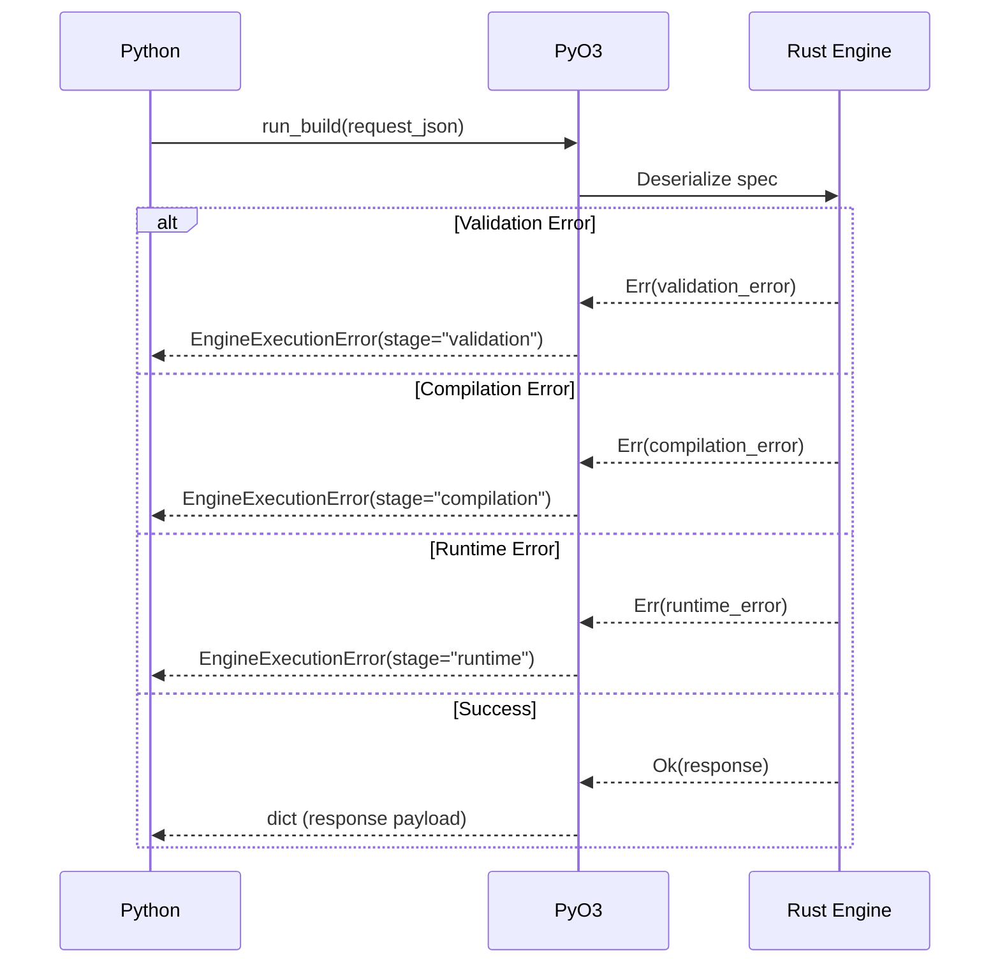

# The Python-Rust Boundary Contract

## Purpose

The Python-Rust boundary is the single most critical interface in the CodeAnatomy architecture. All CPG construction—from semantic compilation to physical materialization—crosses this boundary exactly once through an immutable, versioned contract called the **SemanticExecutionSpec**.

This document specifies the complete contract between Python (the planning layer) and Rust (the execution layer), including:

- The **SemanticExecutionSpec** structure and its 10 component types
- Python-side spec construction via the Rust-exported `SemanticPlanCompiler`
- Rust-side spec consumption through the `run_build()` entry point
- Canonical CPG output mappings
- JSON wire format and serialization guarantees
- Error boundary classification and normalization
- Two-layer determinism (spec_hash + envelope_hash)

**Design Principle**: Python owns semantic intent; Rust owns execution authority. The spec is the immutable handoff that preserves determinism and enables replay.

---

## Boundary Philosophy

### Why a Spec-Based Contract Exists

The spec-based boundary emerged from three architectural requirements:

1. **Determinism by Construction** - Every CPG build must be reproducible given the same inputs, rules, and configuration. The spec encodes this contract explicitly.

2. **Language-Appropriate Separation** - Python excels at semantic modeling, graph reasoning, and incremental logic. Rust excels at high-performance query execution, memory safety, and concurrency. The spec boundary lets each language do what it does best.

3. **Execution Authority** - Rust is the sole authority for DataFusion session management, rule application, plan optimization, and Delta table writes. Python cannot directly manipulate these concerns—it can only express intent through the spec.

### Architectural Invariants

The boundary contract enforces these invariants:

| Invariant | Consequence |
|-----------|-------------|
| **Immutability** | Once built, a spec never changes. If parameters change, a new spec is constructed. |
| **Versioning** | Specs carry a schema version (`SPEC_SCHEMA_VERSION = 4`). Rust rejects specs from incompatible versions. |
| **Deterministic Hashing** | Every spec has a canonical BLAKE3 `spec_hash`. Identical specs produce identical hashes. |
| **No Shared State** | Python and Rust do not share mutable state. All communication flows through the JSON wire format. |
| **Error Normalization** | Rust errors are normalized to `EngineExecutionError` with structured metadata before crossing back to Python. |
| **Single Entry Point** | All spec execution flows through `run_build()`. No alternative execution paths exist. |

---

## SemanticExecutionSpec Structure

The **SemanticExecutionSpec** is the root contract type. Python builds it; Rust consumes it. It encodes the complete semantic execution plan, including inputs, view transformations, join constraints, output targets, rule intents, and runtime configuration.

### Version 4 Schema

**Current version**: `SPEC_SCHEMA_VERSION = 4`

The spec consists of 10 primary sections:

```mermaid
graph TD
    A[SemanticExecutionSpec] --> B[input_relations]
    A --> C[view_definitions]
    A --> D[join_graph]
    A --> E[output_targets]
    A --> F[rule_intents]
    A --> G[rulepack_profile]
    A --> H[typed_parameters]
    A --> I[runtime]
    A --> J[spec_hash]

    B --> K[InputRelation[]]
    C --> L[ViewDefinition[]]
    D --> M[JoinGraph]
    E --> N[OutputTarget[]]
    F --> O[RuleIntent[]]
    I --> P[RuntimeConfig]
    I --> Q[TracingConfig]
```

### Root Spec Fields

| Field | Type | Purpose |
|-------|------|---------|
| `version` | `u32` | Schema version (must match `SPEC_SCHEMA_VERSION`) |
| `input_relations` | `Vec<InputRelation>` | Delta tables to load as logical inputs |
| `view_definitions` | `Vec<ViewDefinition>` | Logical view DAG with transformations |
| `join_graph` | `JoinGraph` | Cross-view join constraints and edges |
| `output_targets` | `Vec<OutputTarget>` | CPG tables to materialize with write policies |
| `rule_intents` | `Vec<RuleIntent>` | Declarative optimizer/analyzer rules to apply |
| `rulepack_profile` | `RulepackProfile` | Preset rule configuration (Default, Strict, LowLatency, Replay) |
| `typed_parameters` | `Vec<TypedParameter>` | Parametric plan bindings (Wave 3 feature) |
| `runtime` | `RuntimeConfig` | Runtime control plane (tracing, tuning, compliance) |
| `spec_hash` | `[u8; 32]` | BLAKE3 canonical hash of the spec (computed on creation) |

**Wave 3 Expansion Fields** (all defaulted for backward compatibility):

| Field | Type | Purpose |
|-------|------|---------|
| `rule_overlay` | `Option<RuleOverlayProfile>` | Per-execution rule additions/exclusions |
| `runtime_profile` | `Option<RuntimeProfileSpec>` | Deterministic session knob snapshot |
| `cache_policy` | `Option<CachePlacementPolicy>` | Policy-based plan cache placement |
| `maintenance` | `Option<MaintenanceSchedule>` | Post-execution Delta maintenance schedule |

### InputRelation

Specifies a Delta table input to load into the session.

**Python Contract** (`src/planning_engine/spec_contracts.py`):
```python
class InputRelation(msgspec.Struct, frozen=True):
    logical_name: str
    delta_location: str
    requires_lineage: bool = False
    version_pin: int | None = None
```

**Rust Contract** (`rust/codeanatomy_engine/src/spec/relations.rs`):
```rust
pub struct InputRelation {
    pub logical_name: String,
    pub delta_location: String,
    #[serde(default)]
    pub requires_lineage: bool,
    pub version_pin: Option<i64>,
}
```

| Field | Semantics |
|-------|-----------|
| `logical_name` | View-space name for referencing in transformations |
| `delta_location` | File path or S3 URI to Delta table root |
| `requires_lineage` | Whether to capture DataFusion lineage for this input |
| `version_pin` | Optional Delta version to pin (for time-travel queries) |

### ViewDefinition

Defines a logical view in the semantic DAG with a transformation and output schema.

**Python Contract**:
```python
class ViewDefinition(msgspec.Struct, frozen=True):
    name: str
    view_kind: str
    view_dependencies: tuple[str, ...] = ()
    transform: dict[str, object] = msgspec.field(default_factory=dict)
    output_schema: dict[str, object] = msgspec.field(default_factory=dict)
```

**Rust Contract**:
```rust
pub struct ViewDefinition {
    pub name: String,
    pub view_kind: String,
    pub view_dependencies: Vec<String>,
    pub transform: ViewTransform,
    pub output_schema: SchemaContract,
}
```

| Field | Semantics |
|-------|-----------|
| `name` | Unique view identifier in the DAG |
| `view_kind` | Semantic category (normalize, relate, union, project, filter, aggregate, cpg_emit) |
| `view_dependencies` | View-to-view dependencies (NOT input relations) |
| `transform` | Tagged transformation variant (see ViewTransform below) |
| `output_schema` | Column name → Arrow type mapping |

### ViewTransform Enum

The transformation is a tagged enum that specifies how to derive the view from upstream sources.

**Rust variants**:

```rust
pub enum ViewTransform {
    Normalize {
        source: String,
        id_columns: Vec<String>,
        span_columns: Option<(String, String)>,
        text_columns: Vec<String>,
    },
    Relate {
        left: String,
        right: String,
        join_type: JoinType,
        join_keys: Vec<JoinKeyPair>,
    },
    Union {
        sources: Vec<String>,
        discriminator_column: Option<String>,
        distinct: bool,
    },
    Project {
        source: String,
        columns: Vec<String>,
    },
    Filter {
        source: String,
        predicate: String, // SQL expression
    },
    Aggregate {
        source: String,
        group_by: Vec<String>,
        aggregations: Vec<AggregationExpr>,
    },
    IncrementalCdf {
        source: String,
        starting_version: Option<i64>,
        ending_version: Option<i64>,
        starting_timestamp: Option<String>,
        ending_timestamp: Option<String>,
    },
    Metadata {
        source: String,
    },
    FileManifest {
        source: String,
    },
    CpgEmit {
        output_kind: CpgOutputKind,
        #[serde(default)]
        sources: Vec<String>,
    },
}
```

| Transform | Purpose |
|-----------|---------|
| **Normalize** | Apply semantic normalization (stable IDs, byte spans, UTF-8 NFC) |
| **Relate** | Join two views by path/span overlap/contains or standard equijoin |
| **Union** | Combine multiple views with optional discriminator and DISTINCT |
| **Project** | Select columns from a view |
| **Filter** | Apply SQL predicate to a view |
| **Aggregate** | Group-by with aggregation expressions |
| **IncrementalCdf** | Scan Delta change-data-feed for incremental processing |
| **Metadata** | Extract Delta table metadata (version, schema, protocol) |
| **FileManifest** | List files in Delta table with stats |
| **CpgEmit** | Final CPG output transform (nodes, edges, props, etc.) |

**CpgOutputKind**:
```rust
pub enum CpgOutputKind {
    Nodes,
    Edges,
    Props,
    PropsMap,
    EdgesBySrc,
    EdgesByDst,
}
```

### JoinGraph

Encodes cross-view join constraints that the optimizer can exploit.

**Python Contract**:
```python
class JoinEdge(msgspec.Struct, frozen=True):
    left_relation: str
    right_relation: str
    join_type: str
    left_keys: tuple[str, ...] = ()
    right_keys: tuple[str, ...] = ()

class JoinGraph(msgspec.Struct, frozen=True):
    edges: tuple[JoinEdge, ...] = ()
    constraints: tuple[dict[str, object], ...] = ()
```

**Rust Contract**:
```rust
pub struct JoinGraph {
    pub edges: Vec<JoinEdge>,
    pub constraints: Vec<Constraint>,
}
```

The join graph allows Rust to infer join reordering opportunities and predicate pushdown across views.

### OutputTarget

Specifies a CPG table to materialize with write policy and partitioning.

**Python Contract**:
```python
class OutputTarget(msgspec.Struct, frozen=True):
    table_name: str
    source_view: str
    columns: tuple[str, ...] = ()
    delta_location: str | None = None
    materialization_mode: MaterializationMode = "Overwrite"
    partition_by: tuple[str, ...] = ()
    write_metadata: dict[str, str] = msgspec.field(default_factory=dict)
    max_commit_retries: int | None = None
```

**Rust Contract**:
```rust
pub struct OutputTarget {
    pub table_name: String,
    pub source_view: String,
    pub columns: Vec<String>,
    pub delta_location: Option<String>,
    pub materialization_mode: MaterializationMode,
    pub partition_by: Vec<String>,
    pub write_metadata: BTreeMap<String, String>,
    pub max_commit_retries: Option<u32>,
}
```

| Field | Semantics |
|-------|-----------|
| `table_name` | Canonical CPG output name (e.g., `cpg_nodes`, `cpg_edges`) |
| `source_view` | View to materialize from the DAG |
| `columns` | Column projection (empty = all columns) |
| `delta_location` | Target Delta table path (inferred from output_dir if None) |
| `materialization_mode` | `Append` or `Overwrite` |
| `partition_by` | Partition column names |
| `write_metadata` | User-defined key-value metadata for Delta commits |
| `max_commit_retries` | Max retry attempts for optimistic concurrency failures |

### RuleIntent

Declarative rule request for the optimizer/analyzer.

**Python Contract**:
```python
class RuleIntent(msgspec.Struct, frozen=True):
    name: str
    rule_class: RuleClass = msgspec.field(name="class")
    params: dict[str, object] = msgspec.field(default_factory=dict)

type RuleClass = Literal[
    "SemanticIntegrity",
    "DeltaScanAware",
    "CostShape",
    "Safety",
]
```

**Rust Contract**:
```rust
pub struct RuleIntent {
    pub name: String,
    pub rule_class: RuleClass,
    pub params: BTreeMap<String, Value>,
}

pub enum RuleClass {
    SemanticIntegrity,
    DeltaScanAware,
    CostShape,
    Safety,
}
```

Rules are applied during logical optimization based on their class and the active rulepack profile.

### RuntimeConfig

Runtime control plane for tracing, tuning, and compliance.

**Python Contract**:
```python
class RuntimeConfig(msgspec.Struct, frozen=True):
    compliance_capture: bool = False
    tuner_mode: RuntimeTunerMode = "Off"
    capture_substrait: bool = False
    capture_optimizer_lab: bool = False
    capture_delta_codec: bool = False
    pushdown_enforcement_mode: PushdownEnforcementMode = "warn"
    extension_governance_mode: ExtensionGovernanceMode = "permissive"
    enable_tracing: bool = False
    enable_rule_tracing: bool = False
    enable_plan_preview: bool = False
    enable_function_factory: bool = False
    enable_domain_planner: bool = False
    lineage_tags: dict[str, str] = msgspec.field(default_factory=dict)
    tracing_preset: TracingPreset | None = None
    tracing: TracingConfig = msgspec.field(default_factory=_default_tracing_config)
```

**Key runtime controls**:

| Field | Purpose |
|-------|---------|
| `enable_tracing` | Enable OpenTelemetry instrumentation |
| `tracing_preset` | Preset tracing configuration (Maximal, MaximalNoData, ProductionLean) |
| `tuner_mode` | Runtime tuning mode (Off, Observe, Apply) |
| `pushdown_enforcement_mode` | Predicate pushdown validation (warn, strict, disabled) |
| `extension_governance_mode` | UDF/UDAF registration policy (strict_allowlist, warn_on_unregistered, permissive) |
| `compliance_capture` | Capture execution metadata for compliance audit |
| `lineage_tags` | User-defined lineage metadata key-value pairs |

### TracingConfig

OpenTelemetry tracing configuration with span sampling and export policies.

**Python Contract**:
```python
class TracingConfig(msgspec.Struct, frozen=True):
    enabled: bool = False
    record_metrics: bool = True
    rule_mode: RuleTraceMode = "Disabled"
    plan_diff: bool = False
    preview_limit: int = 0
    preview_redaction_mode: PreviewRedactionMode = "None"
    preview_redacted_columns: tuple[str, ...] = ()
    preview_redaction_token: str = "[REDACTED]"
    preview_max_width: int = 96
    preview_max_row_height: int = 4
    preview_min_compacted_col_width: int = 10
    instrument_object_store: bool = False
    otlp_endpoint: str | None = None
    otlp_protocol: OtlpProtocol | None = None
    otel_service_name: str | None = None
    otel_resource_attributes: dict[str, str] = msgspec.field(default_factory=dict)
    custom_span_fields: dict[str, str] = msgspec.field(default_factory=dict)
    export_policy: TraceExportPolicy = msgspec.field(default_factory=TraceExportPolicy)
```

**TraceExportPolicy** controls OTLP batch span processor throughput:

| Field | Default | Purpose |
|-------|---------|---------|
| `traces_sampler` | `"parentbased_always_on"` | Sampling strategy |
| `bsp_max_queue_size` | 2048 | Max span queue size before dropping |
| `bsp_max_export_batch_size` | 512 | Max spans per export batch |
| `bsp_schedule_delay_ms` | 5000 | Batch export interval (ms) |
| `bsp_export_timeout_ms` | 30000 | Export timeout (ms) |

---

## Python-Side: Building the Spec

Python constructs the spec in two phases:

1. **Semantic IR Compilation** - Build the semantic intermediate representation (view graph, join constraints, output targets)
2. **Spec Derivation** - Convert the semantic IR to a `SemanticExecutionSpec` via the Rust-exported compiler

### Semantic IR Compilation Phase

**Entry Point**: `src/graph/build_pipeline.py::_compile_semantic_phase()`

```python
def _compile_semantic_phase(
    semantic_input_locations: dict[str, str],
    engine_profile: str,
    rulepack_profile: str,
    *,
    output_dir: Path,
    runtime_config: object | None,
) -> tuple[SemanticExecutionContext, SemanticExecutionSpec]:
    from planning_engine.spec_contracts import RuntimeConfig, SemanticExecutionSpec
    from semantics.compile_context import build_semantic_execution_context

    # Build semantic IR from view catalog
    execution_context = build_semantic_execution_context(
        runtime_profile=runtime_profile.datafusion,
        outputs=None,
        policy="schema_only",
        ctx=ctx,
        input_mapping=semantic_input_locations,
    )

    # Resolve output targets and locations
    output_targets = _resolve_output_targets()
    output_locations = _resolve_output_locations(output_dir, output_targets)

    # Build spec via Rust compiler
    request_payload: dict[str, object] = {
        "input_locations": semantic_input_locations,
        "output_targets": output_targets,
        "rulepack_profile": rulepack_profile,
        "output_locations": output_locations,
        "runtime": to_builtins(runtime_config, str_keys=True) if runtime_config else None,
    }

    compiler = engine_module.SemanticPlanCompiler()
    spec_json = compiler.build_spec_json(
        msgspec.json.encode(to_builtins(semantic_ir, str_keys=True)).decode(),
        msgspec.json.encode(request_payload).decode(),
    )
    spec = msgspec.json.decode(spec_json, type=SemanticExecutionSpec)

    return execution_context, spec
```

**Key Steps**:

1. `build_semantic_execution_context()` builds the semantic IR by compiling the view catalog into a DAG
2. `_resolve_output_targets()` constructs `OutputTarget` entries for canonical CPG outputs
3. `SemanticPlanCompiler().build_spec_json()` (Rust export) converts semantic IR + request to spec JSON
4. Python decodes the JSON to a typed `SemanticExecutionSpec` via msgspec

### Spec Derivation Authority

**Critical**: Rust is the sole authority for building the spec. Python does NOT manually construct `SemanticExecutionSpec` instances—it calls the Rust-exported `SemanticPlanCompiler.build_spec_json()` method, which:

- Translates semantic IR views to `ViewDefinition` entries
- Infers `view_dependencies` from view references
- Constructs `InputRelation` entries from the input mapping
- Maps semantic join groups to `JoinGraph` edges
- Applies default runtime configuration
- Computes the canonical `spec_hash`

This ensures Python and Rust always agree on spec structure and hashing.

---

## Rust-Side: Consuming the Spec

Rust receives the spec through the `run_build()` PyO3 entry point and executes it in three stages:

1. **Spec Deserialization + Validation**
2. **Plan Compilation**
3. **Execution + Materialization**

### PyO3 Entry Point: `run_build()`

**Source**: `rust/codeanatomy_engine_py/src/lib.rs`

```rust
#[pyfunction]
fn run_build(py: Python<'_>, request_json: &str) -> PyResult<Py<pyo3::types::PyAny>> {
    let request: Value = serde_json::from_str(request_json)?;

    let spec_json = request.get("spec_json").and_then(Value::as_str)?;
    let engine_profile = request.get("engine_profile").and_then(Value::as_str).unwrap_or("medium");
    let runtime_overrides = request.get("runtime").cloned();
    let orchestration = request.get("orchestration").cloned().unwrap_or_else(|| json!({}));

    // Merge runtime overrides into spec
    let effective_spec_json = if let Some(runtime_value) = runtime_overrides {
        let mut spec_value: Value = serde_json::from_str(spec_json)?;
        if let Some(spec_obj) = spec_value.as_object_mut() {
            spec_obj.insert("runtime".to_string(), runtime_value);
        }
        serde_json::to_string(&spec_value)?
    } else {
        spec_json.to_string()
    };

    // Compile spec to plan
    let session_factory = session::SessionFactory::from_class_name(engine_profile)?;
    let compiler = compiler::SemanticPlanCompiler::new_internal()?;
    let compiled_plan = compiler.compile_internal(&effective_spec_json)?;

    // Execute plan and materialize outputs
    let materializer = materializer::CpgMaterializer::new_internal()?;
    let run_result = materializer.execute_internal(&session_factory, &compiled_plan)?;

    // Build response payload
    let response = json!({
        "contract_version": 3,
        "run_result": run_result_value,
        "outputs": outputs,
        "warnings": warnings,
        "diagnostics": diagnostics,
        "artifacts": artifacts,
    });

    result::json_value_to_py(py, &response)
}
```

**Request Contract**:
```json
{
  "spec_json": "<SemanticExecutionSpec JSON>",
  "engine_profile": "medium",
  "runtime": { /* RuntimeConfig overrides */ },
  "orchestration": {
    "include_manifest": true,
    "include_run_bundle": false,
    "emit_auxiliary_outputs": true
  }
}
```

**Response Contract**:
```json
{
  "contract_version": 3,
  "run_result": {
    "outputs": [
      {
        "table_name": "cpg_nodes",
        "delta_location": "/path/to/cpg_nodes",
        "rows_written": 12345,
        "partition_count": 8
      }
    ],
    "warnings": [],
    "diagnostics": { /* ... */ }
  },
  "outputs": [ /* same as run_result.outputs */ ],
  "warnings": [ /* ... */ ],
  "diagnostics": {
    "events": [],
    "artifacts": []
  },
  "artifacts": {
    "manifest_path": "/path/to/run_manifest",
    "run_bundle_dir": null,
    "auxiliary_outputs": {
      "normalize_outputs_delta": "/path/to/normalize_outputs",
      "extract_error_artifacts_delta": null,
      "run_manifest_delta": "/path/to/run_manifest"
    }
  }
}
```

### Spec Validation

Rust deserializes the spec with `serde(deny_unknown_fields)`, which ensures:

- No unrecognized fields (guards against version skew)
- All required fields are present
- Type constraints are satisfied

**Validation failures** trigger `EngineExecutionError` with stage `"validation"` and code `"INVALID_SPEC_JSON"`.

### Plan Compilation

`SemanticPlanCompiler.compile_internal()` transforms the spec into a `CompiledPlan`:

1. **View DAG Construction** - Build topological order from `view_dependencies`
2. **Transform Lowering** - Convert each `ViewTransform` to a DataFusion `DataFrame` operation
3. **Rule Registration** - Register analyzer/optimizer rules from `rule_intents` and `rulepack_profile`
4. **Output Mapping** - Map `OutputTarget` entries to materialization instructions

### Execution + Materialization

`CpgMaterializer.execute_internal()` runs the compiled plan:

1. **Session Initialization** - Create DataFusion `SessionContext` from engine profile
2. **Input Registration** - Load Delta tables from `input_relations` and register as tables
3. **View Execution** - Execute view DAG in topological order
4. **Output Materialization** - Write output views to Delta tables per `output_targets`
5. **Envelope Capture** - Capture session state snapshot as `SessionEnvelope`
6. **Result Assembly** - Build `run_result` with output metadata

---

## Output Contracts

The engine produces six canonical CPG outputs plus three auxiliary outputs.

### Canonical CPG Outputs

**Source**: `src/planning_engine/output_contracts.py`

```python
CANONICAL_CPG_OUTPUTS: tuple[str, ...] = (
    "cpg_nodes",
    "cpg_edges",
    "cpg_props",
    "cpg_props_map",
    "cpg_edges_by_src",
    "cpg_edges_by_dst",
)
```

**Output Source**: `rust_engine`

| Table | Purpose |
|-------|---------|
| `cpg_nodes` | Entity nodes with canonical byte spans |
| `cpg_edges` | Relationships between entities |
| `cpg_props` | Property assignments to entities |
| `cpg_props_map` | Key-value property maps |
| `cpg_edges_by_src` | Edge index by source entity |
| `cpg_edges_by_dst` | Edge index by destination entity |

**Legacy Aliases** (retained for one migration window):

```python
LEGACY_CPG_OUTPUTS: tuple[str, ...] = (
    "write_cpg_nodes_delta",
    "write_cpg_edges_delta",
    "write_cpg_props_delta",
    "write_cpg_props_map_delta",
    "write_cpg_edges_by_src_delta",
    "write_cpg_edges_by_dst_delta",
)
```

### Auxiliary Outputs

**Output Source**: `python_auxiliary` or `orchestrator`

| Table | Source | Purpose |
|-------|--------|---------|
| `normalize_outputs_delta` | `python_auxiliary` | Normalized semantic views |
| `extract_error_artifacts_delta` | `python_auxiliary` | Extraction error diagnostics |
| `run_manifest_delta` | `python_auxiliary` | Execution manifest with spec/envelope hashes |
| `run_bundle_dir` | `orchestrator` | Optional bundle of execution artifacts |

### Output Routing

Python determines the source of each output:

```python
OUTPUT_SOURCE_MAP: dict[str, str] = {
    "cpg_nodes": "rust_engine",
    "cpg_edges": "rust_engine",
    # ... (all CANONICAL_CPG_OUTPUTS)
    "normalize_outputs_delta": "python_auxiliary",
    "extract_error_artifacts_delta": "python_auxiliary",
    "run_manifest_delta": "python_auxiliary",
    "run_bundle_dir": "orchestrator",
}
```

---

## JSON Wire Format

The spec crosses the Python-Rust boundary as JSON with strict serialization guarantees.

### Python Serialization (msgspec)

Python uses **msgspec** for serialization with these conventions:

- `msgspec.Struct` types with `frozen=True` for immutability
- Field renaming via `msgspec.field(name="...")` (e.g., `rule_class` → `"class"`)
- Tuples serialize to JSON arrays
- Dict keys are always strings (`str_keys=True`)

**Example**:
```python
spec = SemanticExecutionSpec(
    version=4,
    input_relations=(
        InputRelation(
            logical_name="cst_identifiers",
            delta_location="/data/cst_identifiers",
            requires_lineage=False,
            version_pin=None,
        ),
    ),
    # ...
)

spec_json = msgspec.json.encode(spec).decode()
```

### Rust Deserialization (serde_json)

Rust uses **serde_json** with these conventions:

- `#[serde(deny_unknown_fields)]` on all contract types
- `#[serde(default)]` for optional fields
- `#[serde(tag = "kind")]` for tagged enum variants
- `BTreeMap` for deterministic key ordering
- `#[serde(skip)]` for runtime-only fields (like `spec_hash`)

**Example**:
```rust
let spec: SemanticExecutionSpec = serde_json::from_str(&spec_json)
    .map_err(|err| {
        engine_execution_error(
            "validation",
            "INVALID_SPEC_JSON",
            format!("Failed to parse spec: {err}"),
            None,
        )
    })?;
```

### Wire Format Example

**Minimal spec JSON**:

```json
{
  "version": 4,
  "input_relations": [
    {
      "logical_name": "cst_identifiers",
      "delta_location": "/data/cst_identifiers",
      "requires_lineage": false,
      "version_pin": null
    }
  ],
  "view_definitions": [
    {
      "name": "identifiers_norm",
      "view_kind": "normalize",
      "view_dependencies": [],
      "transform": {
        "kind": "Normalize",
        "source": "cst_identifiers",
        "id_columns": ["path", "bstart", "bend"],
        "span_columns": ["bstart", "bend"],
        "text_columns": ["text"]
      },
      "output_schema": {
        "columns": {
          "entity_id": "Utf8",
          "path": "Utf8",
          "bstart": "Int64",
          "bend": "Int64",
          "text": "Utf8"
        }
      }
    }
  ],
  "join_graph": {
    "edges": [],
    "constraints": []
  },
  "output_targets": [
    {
      "table_name": "cpg_nodes",
      "source_view": "identifiers_norm",
      "columns": [],
      "delta_location": "/output/cpg_nodes",
      "materialization_mode": "Overwrite",
      "partition_by": [],
      "write_metadata": {},
      "max_commit_retries": null
    }
  ],
  "rule_intents": [],
  "rulepack_profile": "Default",
  "typed_parameters": [],
  "runtime": {
    "compliance_capture": false,
    "tuner_mode": "Off",
    "enable_tracing": false,
    "tracing": {
      "enabled": false,
      "record_metrics": true,
      "rule_mode": "Disabled"
    }
  }
}
```

---

## Error Boundary

All Rust errors are normalized to `EngineExecutionError` before crossing back to Python.

### EngineExecutionError Structure

**Python Exception** (`rust/codeanatomy_engine_py/src/errors.rs`):

```rust
create_exception!(codeanatomy_engine, EngineExecutionError, PyException);

pub fn engine_execution_error(
    stage: &str,
    code: &str,
    message: impl Into<String>,
    details: Option<Value>,
) -> PyErr {
    // Builds exception with attributes: stage, code, message, details
}
```

**Attributes**:

| Attribute | Type | Purpose |
|-----------|------|---------|
| `stage` | `str` | Error stage (`"validation"`, `"compilation"`, `"runtime"`) |
| `code` | `str` | Error code (e.g., `"INVALID_SPEC_JSON"`, `"RUN_BUILD_RESULT_PARSE_FAILED"`) |
| `message` | `str` | Human-readable error message |
| `details` | `dict | None` | Optional structured error details |

### Error Categories

| Stage | Codes | Meaning |
|-------|-------|---------|
| `validation` | `INVALID_RUN_BUILD_REQUEST`, `RUN_BUILD_REQUEST_MISSING_SPEC_JSON`, `INVALID_SPEC_JSON` | Request/spec validation failures |
| `compilation` | `SPEC_DESERIALIZATION_FAILED`, `VIEW_LOWERING_FAILED`, `RULE_REGISTRATION_FAILED` | Plan compilation errors |
| `runtime` | `RUN_BUILD_RESULT_PARSE_FAILED`, `SESSION_INITIALIZATION_FAILED`, `OUTPUT_MATERIALIZATION_FAILED` | Execution-time failures |

### Error Flow



### Python Error Handling

**Entry Point**: `src/graph/build_pipeline.py::_execute_engine_phase()`

```python
try:
    response = engine_module.run_build(msgspec.json.encode(request_payload).decode())
except Exception as exc:
    _raise_typed_engine_boundary_error(exc)
```

The error handler inspects `exc.stage`, `exc.code`, and `exc.details` to provide structured diagnostics.

---

## Two-Layer Determinism

CodeAnatomy enforces determinism at two levels: **spec_hash** and **envelope_hash**.

### Layer 1: Spec Hash

The `spec_hash` is a canonical BLAKE3 hash of the execution spec.

**Computation** (`rust/codeanatomy_engine/src/spec/hashing.rs`):

1. Serialize spec to `serde_json::Value`
2. Recursively canonicalize by converting maps to `BTreeMap` (sorted keys)
3. Serialize canonical form to compact JSON bytes (no whitespace)
4. Hash bytes with BLAKE3

```rust
pub fn hash_spec(spec: &SemanticExecutionSpec) -> [u8; 32] {
    let canonical_bytes = build_canonical_form(spec);
    let mut hasher = blake3::Hasher::new();
    hasher.update(&canonical_bytes);
    *hasher.finalize().as_bytes()
}
```

**Invariant**: Identical specs produce identical `spec_hash` values, regardless of:
- Field ordering in JSON objects
- Serialization library (msgspec vs serde_json)
- Python version or Rust version

### Layer 2: Envelope Hash

The `envelope_hash` captures the complete runtime session state.

**SessionEnvelope Structure** (`rust/codeanatomy_engine/src/session/envelope.rs`):

```rust
pub struct SessionEnvelope {
    pub datafusion_version: String,
    pub delta_rs_version: String,
    pub codeanatomy_version: String,
    pub config_snapshot: BTreeMap<String, String>,
    pub target_partitions: u32,
    pub batch_size: u32,
    pub memory_pool_bytes: u64,
    pub spill_enabled: bool,
    pub table_registrations: Vec<String>,
    pub registered_functions: Vec<String>,
    pub spec_hash: [u8; 32],
    pub rulepack_fingerprint: [u8; 32],
    pub planning_surface_hash: [u8; 32],
    pub provider_identity_hash: [u8; 32],
    pub envelope_hash: [u8; 32], // Hash of all above fields
}
```

**Computation**:

```rust
fn compute_envelope_hash(
    datafusion_version: &str,
    delta_rs_version: &str,
    codeanatomy_version: &str,
    config_snapshot: &BTreeMap<String, String>,
    target_partitions: u32,
    batch_size: u32,
    memory_pool_bytes: u64,
    spill_enabled: bool,
    table_registrations: &[String],
    registered_functions: &[String],
    spec_hash: &[u8; 32],
    rulepack_fingerprint: &[u8; 32],
    planning_surface_hash: &[u8; 32],
    provider_identity_hash: &[u8; 32],
) -> [u8; 32] {
    let mut hasher = blake3::Hasher::new();

    hasher.update(datafusion_version.as_bytes());
    hasher.update(delta_rs_version.as_bytes());
    hasher.update(codeanatomy_version.as_bytes());

    for (key, value) in config_snapshot {
        hasher.update(key.as_bytes());
        hasher.update(value.as_bytes());
    }

    hasher.update(&target_partitions.to_le_bytes());
    hasher.update(&batch_size.to_le_bytes());
    hasher.update(&memory_pool_bytes.to_le_bytes());
    hasher.update(&[spill_enabled as u8]);

    for table in table_registrations {
        hasher.update(table.as_bytes());
    }
    for function in registered_functions {
        hasher.update(function.as_bytes());
    }

    hasher.update(spec_hash);
    hasher.update(rulepack_fingerprint);
    hasher.update(planning_surface_hash);
    hasher.update(provider_identity_hash);

    *hasher.finalize().as_bytes()
}
```

**Determinism Contract**:

```rust
pub struct DeterminismContract {
    pub spec_hash: [u8; 32],
    pub envelope_hash: [u8; 32],
}

impl DeterminismContract {
    pub fn is_replay_valid(&self, other: &DeterminismContract) -> bool {
        self.spec_hash == other.spec_hash && self.envelope_hash == other.envelope_hash
    }
}
```

### Replay Validation

To validate replay correctness:

1. Capture `spec_hash` and `envelope_hash` from original execution
2. Re-run with identical spec and engine profile
3. Compare new `envelope_hash` to original
4. If hashes match, execution is deterministic
5. If hashes differ, inspect envelope fields to identify non-determinism source

**Common non-determinism sources**:
- DataFusion version upgrade (changes `datafusion_version`)
- Config drift (changes `config_snapshot`)
- Function registration order (changes `registered_functions`)
- Planning surface changes (changes `planning_surface_hash`)

---

## Cross-References

This document is the architectural keystone for the Python-Rust boundary. Related documents:

- **[01_overview.md](01_overview.md)** - Overall CodeAnatomy architecture and pipeline stages
- **[03_semantic_compiler.md](03_semantic_compiler.md)** - Semantic IR construction and view catalog
- **[05_rust_engine.md](05_rust_engine.md)** - Rust execution engine internals (session management, rule application)
- **[06_execution.md](06_execution.md)** - End-to-end execution flow from request to CPG outputs
- **[09_observability_and_config.md](09_observability_and_config.md)** - Tracing, metrics, and runtime configuration

**Key source files**:

| Component | Python | Rust |
|-----------|--------|------|
| **Spec Contracts** | `src/planning_engine/spec_contracts.py` | `rust/codeanatomy_engine/src/spec/execution_spec.rs` |
| **Output Contracts** | `src/planning_engine/output_contracts.py` | `rust/codeanatomy_engine/src/spec/outputs.rs` |
| **PyO3 Gateway** | N/A | `rust/codeanatomy_engine_py/src/lib.rs` |
| **Spec Hashing** | N/A | `rust/codeanatomy_engine/src/spec/hashing.rs` |
| **Session Envelope** | N/A | `rust/codeanatomy_engine/src/session/envelope.rs` |
| **Build Pipeline** | `src/graph/build_pipeline.py` | N/A |
| **Semantic Compiler** | `src/semantics/compiler.py` | N/A |

---

**Document Status**: Canonical as of 2026-02-12 for `SPEC_SCHEMA_VERSION = 4`.
