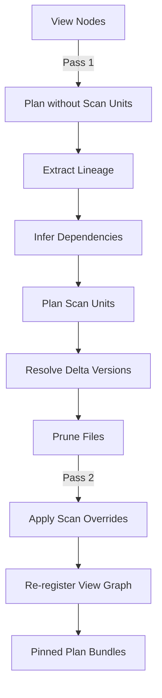

# DataFusion Integration

## Purpose

The DataFusion engine provides query planning and execution infrastructure for CodeAnatomy's inference pipeline. Built on Apache DataFusion (v50.1+), it bridges high-level relational specifications and efficient, deterministic query execution over Arrow-native data.

## Key Concepts

- **Plan Bundles** - Canonical artifacts containing logical, optimized, and physical plans with Substrait serialization
- **Two-Pass Planning** - Delta pin planning separates lineage extraction from scan resolution
- **Substrait-First Execution** - Prioritizes Substrait replay for determinism, falls back to proto cache
- **Schema Contracts** - Declarative schema validation with evolution policies
- **View Graph** - Dependency-aware view registration with topological sorting
- **Lineage Extraction** - Column-level lineage from optimized logical plans drives dependency inference

---

## Architecture Overview

```
┌─────────────────────────────────────────────────────────────────────────────┐
│                        DataFusion Engine Architecture                        │
├─────────────────────────────────────────────────────────────────────────────┤
│                                                                              │
│  DataFrame Builder → SessionContext → DataFrame                              │
│                          │                │                                  │
│                          ▼                ▼                                  │
│                   logical_plan     optimized_logical_plan                    │
│                          │                │                                  │
│                          ▼                ▼                                  │
│                   Substrait Bytes    Execution Plan                          │
│                          │                                                   │
│                          ▼                                                   │
│              ┌─────────────────────────────────────────────┐                │
│              │        DataFusionPlanBundle                  │                │
│              │  ┌────────────────────────────────────────┐ │                │
│              │  │ df, logical_plan, optimized_plan       │ │                │
│              │  │ substrait_bytes, plan_fingerprint      │ │                │
│              │  │ delta_inputs, required_udfs            │ │                │
│              │  └────────────────────────────────────────┘ │                │
│              └─────────────────────────────────────────────┘                │
│                          │                                                   │
│                          ▼                                                   │
│              Scheduling (rustworkx) → Hamilton DAG → CPG Outputs            │
│                                                                              │
└─────────────────────────────────────────────────────────────────────────────┘
```

---

## Module Map

| Subdirectory | Purpose | Key Files |
|--------------|---------|-----------|
| `plan/` | Plan bundling, execution, caching | `bundle.py`, `pipeline.py`, `artifact_store.py` |
| `session/` | Session runtime, facade, factory | `runtime.py`, `facade.py`, `factory.py` |
| `views/` | View graph, registry, specs | `graph.py`, `registration.py`, `registry_specs.py` |
| `lineage/` | Lineage extraction, scan planning | `datafusion.py`, `scan.py`, `diagnostics.py` |
| `schema/` | Contracts, introspection, validation | `contracts.py`, `introspection.py`, `registry.py` |
| `udf/` | UDF catalog, runtime, platform | `catalog.py`, `runtime.py`, `platform.py` |
| `delta/` | Delta Lake integration | `protocol.py`, `control_plane.py`, `store_policy.py` |
| `dataset/` | Registry, resolution | `registry.py`, `resolution.py` |

---

## Plan Bundle System

### DataFusionPlanBundle

The central artifact for all scheduling and execution paths:

```python
@dataclass(frozen=True)
class DataFusionPlanBundle:
    df: DataFrame                           # DataFusion DataFrame
    logical_plan: object                    # Unoptimized logical plan
    optimized_logical_plan: object          # Post-optimization logical plan
    execution_plan: object | None           # Physical execution plan
    substrait_bytes: bytes | None           # Substrait serialization
    plan_fingerprint: str                   # SHA-256 digest for caching
    artifacts: PlanArtifacts                # Serializable metadata
    delta_inputs: tuple[DeltaInputPin, ...] # Pinned Delta versions
    required_udfs: tuple[str, ...]          # UDF dependencies
    required_rewrite_tags: tuple[str, ...]  # Rewrite rule tags
```

### Plan Fingerprinting

The `plan_fingerprint` is a stable hash computed from:

| Component | Purpose |
|-----------|---------|
| Substrait bytes | Serialized optimized plan structure |
| Session settings | Configuration that affects planning |
| Planning environment | DataFusion version, optimizer rules |
| UDF snapshot hash | Registered functions and signatures |
| Delta input pins | Dataset versions |
| Information schema hash | Table schemas at planning time |

**Determinism guarantee**: Matching fingerprints across executions guarantee equivalent results (modulo non-deterministic UDFs).

### Substrait Serialization

Substrait provides a stable, cross-platform plan representation:

1. **Plan Extraction**: `df.optimized_logical_plan()`
2. **Substrait Conversion**: `SubstraitProducer.to_substrait_plan(optimized, ctx)`
3. **Serialization**: `substrait_plan.encode()` → portable bytes
4. **Hashing**: SHA-256 of Substrait bytes → `substrait_hash`

---

## Execution Facade

The `DataFusionExecutionFacade` provides the unified API:

```python
class DataFusionExecutionFacade:
    def compile_to_bundle(self, builder: Callable) -> DataFusionPlanBundle:
        """Compile DataFrame builder to plan bundle."""

    def execute_plan_bundle(self, bundle: DataFusionPlanBundle) -> ExecutionResult:
        """Execute with Substrait-first replay."""

    def register_dataset(self, location: DatasetLocation) -> DataFrame:
        """Register dataset via registry bridge."""

    def ensure_view_graph(self, include_registry: bool = True) -> RustUdfSnapshot:
        """Ensure view graph is registered."""
```

### Substrait-First Execution

```python
def _substrait_first_df(self, bundle: DataFusionPlanBundle) -> tuple[DataFrame, bool]:
    if not substrait_bytes:
        raise ValueError("Plan bundle missing Substrait bytes.")
    try:
        df = replay_substrait_bytes(self.ctx, substrait_bytes)
        return df, False  # Successful replay
    except (RuntimeError, TypeError, ValueError):
        cached_df = self._rehydrate_from_proto(bundle)
        if cached_df is not None:
            return cached_df, True
        return bundle.df, True  # Fallback
```

---

## Two-Pass Delta Planning

The planning pipeline uses two passes to pin Delta versions:

### Pass 1: Baseline Planning

1. Register UDF platform and view graph
2. Plan view nodes without scan units
3. Extract lineage (dataset references, columns, filters)
4. Infer dependencies from view nodes

### Pass 2: Pinned Planning

1. Plan scan units with Delta version resolution
2. Apply file pruning via `evaluate_and_select_files()`
3. Re-register view graph with pinned scan providers
4. Re-plan with scan units in `PlanBundleOptions`



---

## Lineage Extraction

**File**: `src/datafusion_engine/lineage/datafusion.py`

Lineage extraction walks the logical plan tree:

```python
def extract_lineage(plan: LogicalPlan) -> LineageReport:
    for node in walk_logical_complete(plan):
        variant = _plan_variant(node)
        scans.extend(_extract_scan_lineage(variant))
        joins.extend(_extract_join_lineage(variant))
        exprs.extend(_extract_expr_infos(variant))
    return LineageReport(scans, joins, exprs, required_udfs, ...)
```

### LineageReport Components

| Component | Description |
|-----------|-------------|
| `scans` | `ScanLineage` with dataset, columns, filters |
| `joins` | `JoinLineage` with type and key pairs |
| `exprs` | `ExprInfo` with kind, columns, UDFs |
| `required_udfs` | UDF names referenced in plan |
| `required_columns_by_dataset` | Column-level dependency map |

---

## Schema Contracts

**File**: `src/datafusion_engine/schema/contracts.py`

Declarative schema validation with evolution policies:

```python
@dataclass(frozen=True)
class SchemaContract:
    table_name: str
    columns: tuple[ColumnContract, ...]
    partition_cols: tuple[str, ...]
    ordering: tuple[str, ...]
    evolution_policy: EvolutionPolicy
```

### Evolution Policies

| Policy | Behavior |
|--------|----------|
| `STRICT` | No schema changes allowed |
| `ADDITIVE` | New columns allowed, removals fail |
| `RELAXED` | Any compatible change allowed |

### Validation

Contracts detect:
- Missing columns → `MISSING_COLUMN` violation
- Type mismatches → `TYPE_MISMATCH` violation
- Nullability violations → `NULLABILITY_MISMATCH` violation
- Extra columns (STRICT) → `EXTRA_COLUMN` violation

---

## View Graph System

**File**: `src/datafusion_engine/views/graph.py`

Dependency-aware view registration with topological sorting:

```python
@dataclass(frozen=True)
class ViewNode:
    name: str
    deps: tuple[str, ...]  # Auto-inferred from plan bundles
    builder: Callable[[SessionContext], DataFrame]
    contract_builder: Callable[[pa.Schema], SchemaContract] | None = None
    required_udfs: tuple[str, ...] = ()
    plan_bundle: DataFusionPlanBundle | None = None
    cache_policy: Literal["none", "memory", "delta_staging", "delta_output"] = "none"
```

### Cache Policies

| Policy | Behavior |
|--------|----------|
| `"none"` | Register as ephemeral view |
| `"memory"` | Call `df.cache()` before registration |
| `"delta_staging"` | Write to temp Delta table |
| `"delta_output"` | Write to configured dataset location |

### Registration Flow

1. **Validation** - Validate Rust UDF snapshot
2. **Materialization** - Extract deps from plan bundles
3. **Topological Sort** - Order via rustworkx or Kahn's algorithm
4. **Per-View Registration**:
   - Validate dependencies and required UDFs
   - Apply scan unit overrides
   - Build DataFrame, apply cache policy
   - Register view, validate schema contract

---

## Session Runtime

**File**: `src/datafusion_engine/session/runtime.py`

The `SessionRuntime` manages DataFusion session lifecycle:

```python
@dataclass
class SessionRuntime:
    ctx: SessionContext           # Core query engine
    profile: RuntimeProfile       # Configuration
    udf_snapshot: UdfSnapshot     # Cached UDF registry
    settings_hash: str            # For fingerprinting
```

### Profile Presets

| Preset | Memory | Concurrency | Use Case |
|--------|--------|-------------|----------|
| `default` | 8 GiB | 8 | General-purpose |
| `dev` | 4 GiB | 4 | Development |
| `prod` | 16 GiB | 16 | Production |
| `cst_autoload` | 8 GiB | 8 | LibCST extraction |
| `symtable` | 4 GiB | 4 | Symtable extraction |

---

## UDF Platform

**File**: `src/datafusion_engine/udf/platform.py`

Unified installation of planning-critical extensions:

```python
@dataclass(frozen=True)
class RustUdfPlatformOptions:
    enable_udfs: bool = True
    enable_async_udfs: bool = False
    enable_function_factory: bool = True
    enable_expr_planners: bool = True
    expr_planner_names: Sequence[str] = ()
    strict: bool = True
```

### Platform Components

| Component | Purpose |
|-----------|---------|
| Rust UDFs | Scalar, aggregate, window, table functions |
| FunctionFactory | Dynamic function resolution |
| ExprPlanners | Custom expression rewrite rules |
| TableProviderCapsule | Custom scan implementations |

### Installation Pattern

```python
from datafusion_engine.udf.platform import install_rust_udf_platform

ctx = DataFusionRuntimeProfile().session_context()
install_rust_udf_platform(ctx, RustUdfPlatformOptions(
    enable_udfs=True,
    enable_function_factory=True,
    enable_expr_planners=True,
))
```

---

## Delta Lake Integration

### DeltaScanConfig

The plugin path uses `DeltaScanConfig` with builder pattern:

| Option | Purpose |
|--------|---------|
| `table_uri`, `storage_options` | Table location |
| `version` / `timestamp` | Version pinning |
| `file_column_name` | Column collision handling |
| `enable_parquet_pushdown` | Session-derived optimization |
| `schema_ipc` | Schema overrides for plan stability |
| `files` | File-set restriction |

### File Pruning

```python
from storage.deltalake.file_pruning import (
    FilePruningPolicy, evaluate_and_select_files,
)

policy = FilePruningPolicy(
    partition_filters=[PartitionFilter(column="year", op="=", value="2024")],
    stats_filters=[StatsFilter(column="event_ts", op=">=", value=start_ts)],
)
result = evaluate_and_select_files(index, policy, ctx=ctx)
```

---

## Performance Characteristics

| Operation | Complexity | Notes |
|-----------|------------|-------|
| Plan compilation | O(N) in plan nodes | Substrait adds ~10-50ms |
| Fingerprint computation | O(1) | Hash of precomputed inputs |
| Lineage extraction | O(N) in plan nodes | Bounded expression depth |
| Substrait replay | O(N) in plan nodes | ~5-20ms overhead |
| Artifact persistence | O(M) in artifact size | Batch writes minimize overhead |

**Bottlenecks**:
- Large plan trees (>1000 nodes) slow Substrait serialization
- Deep expression nesting (>50 levels) impacts lineage extraction
- High UDF counts (>100) increase snapshot hash time

---

## Design Patterns

### Determinism Contract Enforcement

Every plan bundle must satisfy:
- Substrait bytes required for fingerprinting
- Environment snapshot captured (optimizer rules, settings, UDFs)
- Delta inputs pinned to specific versions
- UDF snapshot hash validated at execution

### Graceful Degradation

When optional inputs are unavailable:
- No scans → empty `scan_units` tuple
- No UDFs referenced → empty `required_udfs` tuple
- Substrait replay failure → fallback to original DataFrame

### Weak Reference Caching

UDF snapshots use weak references to prevent memory leaks:

```python
_RUST_UDF_SNAPSHOTS: WeakKeyDictionary[SessionContext, Mapping[str, object]]
```

---

## Critical Files Reference

| File | Purpose |
|------|---------|
| `plan/bundle.py` | Plan bundling with fingerprinting |
| `plan/pipeline.py` | Two-pass Delta pin planning |
| `session/facade.py` | Unified execution API |
| `session/runtime.py` | Session lifecycle management |
| `lineage/datafusion.py` | Plan tree lineage extraction |
| `schema/contracts.py` | Declarative schema validation |
| `views/graph.py` | Dependency-aware view registration |
| `udf/platform.py` | Rust UDF platform installation |

---

## Cross-References

- **[01_overview.md](01_overview.md)** - System overview and public API
- **[02_pipeline_stages.md](02_pipeline_stages.md)** - Four-stage pipeline details
- **[05_rust_and_udfs.md](05_rust_and_udfs.md)** - Rust UDF implementation
- **[07_storage_and_incremental.md](07_storage_and_incremental.md)** - Delta Lake and CDF

**Source Files:**
- `src/datafusion_engine/` - Complete DataFusion integration
- `rust/datafusion_ext/` - Rust UDF implementations
- `rust/datafusion_python/` - Python bindings
