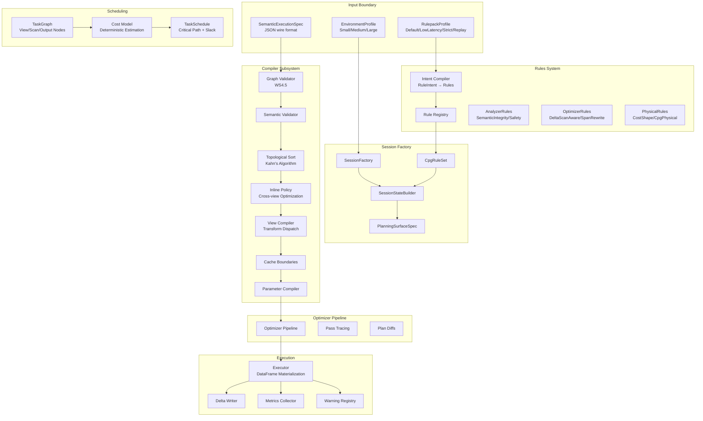

# Rust Execution Engine Architecture

## Purpose

The Rust execution engine (`rust/codeanatomy_engine/`, ~21K LOC) implements Phase 3 of the CodeAnatomy pipeline: view compilation, scheduling, and CPG output materialization. It receives a `SemanticExecutionSpec` from Python, compiles it into a single optimized DataFusion `LogicalPlan` DAG, executes the plan, and writes CPG outputs to Delta tables.

The engine enforces **determinism through immutability**: sessions are built once via `SessionStateBuilder`, rules are configured by immutable rulepack profiles, and all planning/optimization decisions are captured in reproducible hashes.

**Design invariants:**
1. **One SessionContext per run** - No session reuse or mutation
2. **One LogicalPlan DAG** - Compose at logical level only, not physical
3. **Rules-as-policy** - All DataFusion rules configured via rulepack profiles
4. **Delta-native providers** - No Arrow Dataset fallback
5. **Builder-first construction** - SessionStateBuilder before any execution
6. **Three-layer determinism** - `spec_hash` + `envelope_hash` + `rulepack_fingerprint` (see `docs/architecture/07_determinism_contract.md`)

## Architecture Overview



## Compiler Subsystem

The compiler (`compiler/` module) orchestrates graph validation, topological ordering, view compilation, and output construction.

### Entry Point: SemanticPlanCompiler

`SemanticPlanCompiler` is the primary compilation orchestrator. Created with `SemanticPlanCompiler::new(ctx, spec)`, it compiles a `SemanticExecutionSpec` into a `Vec<(OutputTarget, DataFrame)>` ready for materialization.

**Compilation pipeline:**
1. **Graph validation** (`graph_validator::validate_graph`) - Check for duplicate view names, unresolved dependencies, and invalid source references
2. **Semantic validation** (`semantic_validator::validate_semantics`) - Verify schema compatibility, join key types, aggregation invariants, and output contracts
3. **Topological sort** (`topological_sort()`) - Kahn's algorithm with deterministic tie-breaking via sorted queue
4. **Inline policy computation** (`inline_policy::compute_inline_policy`) - Determine which views to inline vs register based on fanout (reference counts)
5. **View compilation** (`compile_view()`) - Dispatch to transform-specific builders
6. **Cache boundary insertion** (`cache_boundaries::insert_cache_boundaries`) - Apply cost-aware cache policy when configured
7. **Output DataFrame construction** - Resolve source views and apply column projection
8. **Parameter application** (`param_compiler::apply_typed_parameters`) - Bind positional placeholders and typed filter expressions

**File location:** `rust/codeanatomy_engine/src/compiler/plan_compiler.rs` (446 lines)

### Graph Validation (WS4.5)

`graph_validator::validate_graph()` performs static graph analysis before compilation:

**Checks:**
- No duplicate view names
- All `view_dependencies` resolve to known views
- All transform source references resolve to views OR input relations
- All output targets reference valid source views
- No duplicate output target table names

**Delta compatibility validation:**
`validate_delta_compatibility()` checks join/union operations for:
- **Column mapping mode consistency** - Hard error if mismatched (e.g., `name` vs `id`)
- **Protocol version drift** - Non-fatal warning if reader/writer versions differ

**File location:** `rust/codeanatomy_engine/src/compiler/graph_validator.rs` (236 lines)

### Topological Sort

`topological_sort()` uses Kahn's algorithm with **deterministic tie-breaking**:

```
1. Build in-degree map for all views
2. Initialize queue with zero-degree nodes (sorted)
3. While queue is not empty:
   a. Pop node from front
   b. Add to ordered list
   c. Decrement in-degree of dependents
   d. Add zero-degree dependents to queue
   e. Re-sort queue for determinism
4. If ordered.len() != view_count, cycle detected
```

**Cycle detection:** Explicit diagnostic with unresolvable view names.

**File location:** `rust/codeanatomy_engine/src/compiler/plan_compiler.rs:163-234`

### View Compilation and Transform Builders

`compile_view()` dispatches to transform-specific builders based on `ViewTransform` variant:

| Transform | Builder | Module | Purpose |
|-----------|---------|--------|---------|
| `Normalize` | `view_builder::build_normalize` | `view_builder.rs` | Add `entity_id` (stable_id UDF), `span` (span_make UDF), and normalized text columns (utf8_normalize UDF) |
| `Relate` | `join_builder::build_join` | `join_builder.rs` | Build DataFusion join with type-checked join keys |
| `Union` | `union_builder::build_union` | `union_builder.rs` | Union multiple sources with optional discriminator column and DISTINCT |
| `Project` | `view_builder::build_project` | `view_builder.rs` | Column projection via `df.select()` |
| `Filter` | `view_builder::build_filter` | `view_builder.rs` | SQL predicate parsing via `ctx.parse_sql_expr()` |
| `Aggregate` | `view_builder::build_aggregate` | `view_builder.rs` | GROUP BY + aggregations (count, sum, avg, min, max) |
| `IncrementalCdf` | `udtf_builder::build_incremental_cdf` | `udtf_builder.rs` | Delta time-travel CDF UDTF |
| `Metadata` | `udtf_builder::build_metadata` | `udtf_builder.rs` | Delta metadata UDTF |
| `FileManifest` | `udtf_builder::build_file_manifest` | `udtf_builder.rs` | Delta file manifest UDTF |
| `CpgEmit` | `cpg_builder::build_cpg_emit` | `cpg_builder.rs` | CPG output formatting (nodes/edges/properties) |

**File location:** `rust/codeanatomy_engine/src/compiler/plan_compiler.rs:236-347`

### Inline Policy (Cross-View Optimization)

`compute_inline_policy()` determines whether to **inline** a view (keep as DataFrame) or **register** it (create named view in SessionContext):

**Decision logic:**
1. Compute reference counts (fanout) for each view
2. For each view:
   - If `ref_count == 0` → Error (unused view)
   - If `ref_count == 1` AND not an output target → **Inline**
   - Otherwise → **Register**

**Benefit:** Single-use intermediate views are inlined, reducing named view overhead and enabling tighter optimizer fusion.

**File location:** `rust/codeanatomy_engine/src/compiler/inline_policy.rs`

### Cache Boundaries

`insert_cache_boundaries()` applies cost-aware caching to materialized intermediate views:

**Default policy:** Cache views with `fanout >= 2` (multiple downstream consumers)

**Cost-aware policy:** When `CachePolicy` is present in spec:
- Estimate cost using `CostModel`
- Cache only if `cost * fanout > threshold`
- Uses `CACHE TABLE` or DataFusion's `CacheExec` physical operator

**File location:** `rust/codeanatomy_engine/src/compiler/cache_boundaries.rs`

### Parameter Compilation

`param_compiler::apply_typed_parameters()` applies typed parameter bindings to DataFrames:

**Supports:**
- **Positional placeholders** (`$1`, `$2`) in SQL expressions
- **Named parameters** (`:param_name`)
- **Typed filter expressions** - Direct Expr construction, bypassing SQL literal interpolation

**Canonical typed path:** Avoids SQL string interpolation, preventing injection risks and improving type safety.

**File location:** `rust/codeanatomy_engine/src/compiler/param_compiler.rs`

## Rules System

The rules system implements **rules-as-policy**: all DataFusion analyzer/optimizer/physical rules are configured via immutable rulepack profiles.

### Four Rule Classes

Rules are classified into four orthogonal categories:

| Rule Class | Purpose | Examples |
|------------|---------|----------|
| `SemanticIntegrity` | Enforce CPG schema contracts and semantic invariants | `SemanticIntegrityRule`, `SpanContainmentRewriteRule` |
| `DeltaScanAware` | Optimize Delta-specific scans and predicates | `DeltaScanAwareRule` (pushdown, partition pruning) |
| `CostShape` | Control parallelism and repartitioning strategy | `CostShapeRule` (target_partitions tuning) |
| `Safety` | Additional validation and safety checks | `SafetyRule`, `StrictSafetyRule` |

### Four Rulepack Profiles

| Profile | Use Case | Rule Selection |
|---------|----------|----------------|
| `Default` | Standard execution | Full rule set (excludes Safety rules) |
| `LowLatency` | Fast execution, minimal overhead | Only correctness rules (skip expensive validation) |
| `Strict` | Enhanced validation | Full rule set + Safety rules |
| `Replay` | Deterministic replay | Full rule set + deterministic tracking |

**Profile switch = new SessionState:** Profiles are immutable. Changing profile requires building a new SessionContext via `SessionFactory`.

**File location:** `rust/codeanatomy_engine/src/rules/rulepack.rs` (288 lines)

### Intent Compiler

The intent compiler (`intent_compiler`) maps declarative `RuleIntent` specs to concrete DataFusion rule instances:

**Compilation path:**
```
RuleIntent (name, class, params)
  ↓
intent_compiler::compile_intent_to_{analyzer|optimizer|physical}
  ↓
Arc<dyn {Analyzer|Optimizer|PhysicalOptimizer}Rule>
```

**Examples:**

```rust
// Semantic integrity analyzer rule
RuleIntent {
    name: "semantic_integrity",
    class: RuleClass::SemanticIntegrity,
    params: {},
}
→ SemanticIntegrityRule

// Delta scan optimizer rule
RuleIntent {
    name: "delta_scan_aware",
    class: RuleClass::DeltaScanAware,
    params: {},
}
→ DeltaScanAwareRule

// Cost shape physical rule with tuning
RuleIntent {
    name: "cost_shape",
    class: RuleClass::CostShape,
    params: { "target_partitions": 32 },
}
→ CostShapeRule { target_partitions: 32 }
```

**File location:** `rust/codeanatomy_engine/src/rules/intent_compiler.rs` (266 lines)

### Rule Registry

`CpgRuleSet` is the immutable registry of compiled rules:

```rust
pub struct CpgRuleSet {
    pub analyzer_rules: Vec<Arc<dyn AnalyzerRule + Send + Sync>>,
    pub optimizer_rules: Vec<Arc<dyn OptimizerRule + Send + Sync>>,
    pub physical_rules: Vec<Arc<dyn PhysicalOptimizerRule + Send + Sync>>,
    pub fingerprint: [u8; 32],  // BLAKE3 hash of rule names
}
```

**Fingerprint computation:** BLAKE3 hash of sorted rule names, used in `envelope_hash` for deterministic session tracking.

**File location:** `rust/codeanatomy_engine/src/rules/registry.rs`

## Session Management

The session subsystem builds deterministic DataFusion sessions via builder-first construction.

### Session Factory

`SessionFactory` is the primary interface for building `SessionContext` instances:

**Construction:**
```rust
let profile = EnvironmentProfile::from_class(EnvironmentClass::Medium);
let factory = SessionFactory::new(profile);

let ruleset = RulepackFactory::build_ruleset(
    &RulepackProfile::Default,
    &rule_intents,
    &env_profile,
);

let state = factory.build_session_state(&ruleset, spec_hash, tracing_config).await?;
// state.ctx: SessionContext
// state.memory_pool_bytes: u64
// state.planning_surface_hash: [u8; 32]
// state.build_warnings: Vec<RunWarning>
```

**File location:** `rust/codeanatomy_engine/src/session/factory.rs` (556 lines)

### Environment Profiles

`EnvironmentProfile` defines tuning parameters for Small/Medium/Large execution contexts:

| Profile | Target Partitions | Batch Size | Memory Pool |
|---------|-------------------|------------|-------------|
| Small | 4 | 4096 | 512 MB |
| Medium | 8 | 8192 | 2 GB |
| Large | 16 | 16384 | 8 GB |

**Selection criteria:**
- **Small:** < 50 files, < 10K LOC
- **Medium:** 50-500 files, 10K-100K LOC
- **Large:** > 500 files, > 100K LOC

**File location:** `rust/codeanatomy_engine/src/session/profiles.rs` (108 lines)

### Planning Surface

`PlanningSurfaceSpec` defines the planning-time extensions and configurations:

**Components:**
- **File formats:** Parquet, CSV (with format-specific options)
- **Table factories:** Delta table factory (`DeltaTableFactory`)
- **Query planner:** Optional `DeltaPlanner` for Delta-specific optimizations
- **Function factory:** Optional `SqlMacroFunctionFactory` for SQL macros
- **Expression planners:** Domain-specific expression planners
- **Function rewrites:** Domain-specific function rewrite rules

**Governance policies:**
- `Permissive` - Allow any table factory
- `WarnOnUnregistered` - Emit warning for unregistered factories
- `StrictAllowlist` - Reject unregistered factories (hard error)

**Manifest hash:** BLAKE3 hash of planning surface configuration, included in `envelope_hash`.

**File location:** `rust/codeanatomy_engine/src/session/planning_surface.rs`

### Session Envelope

`SessionEnvelope` captures immutable session metadata for deterministic replay:

**Captured fields:**
- `envelope_hash` - BLAKE3(spec_hash || ruleset_fingerprint || config_snapshot)
- `spec_hash` - Input spec content hash
- `ruleset_fingerprint` - Rule name hash
- `datafusion_version` - DataFusion version string
- `codeanatomy_version` - Engine version
- `target_partitions`, `batch_size`, `memory_pool_bytes` - Session config
- `registered_functions` - UDF name list
- `planning_surface_hash` - Planning surface configuration hash
- `provider_identities` - Delta table provider hashes

**Two-layer hashing:**
1. **spec_hash** - Input contract (what to compute)
2. **envelope_hash** - Session state (how to compute)

**File location:** `rust/codeanatomy_engine/src/session/envelope.rs`

## Scheduling and Cost Model

The scheduling subsystem performs topological ordering and cost-based prioritization.

### TaskGraph

`TaskGraph` represents view dependencies as a directed acyclic graph:

**Node types:**
- `View` - Intermediate view transformation
- `Scan` - Input relation scan
- `Output` - Output target materialization

**Graph operations:**
- `from_inferred_deps()` - Construct from dependency lists
- `topological_sort()` - Kahn's algorithm with cycle detection
- `reduce()` - Transitive reduction (remove redundant edges)
- `prune()` - Remove unused nodes based on active task set
- `upstream_closure()`, `downstream_closure()` - Dependency traversal

**File location:** `rust/codeanatomy_engine/src/compiler/scheduling.rs` (253 lines)

### Cost Model

`CostModel` provides deterministic cost estimation and scheduling heuristics:

**Cost estimation:**
```rust
pub fn derive_task_costs(
    graph: &TaskGraph,
    metrics: Option<&CollectedMetrics>,
    config: &CostModelConfig,
) -> CostModelOutcome
```

**Cost formula:**
```
cost = base_cost * rows_factor
where:
  base_cost = default_scan_cost (2.0) OR default_view_cost (1.0)
  rows_factor = max(output_rows / row_count_scale, 1.0)
```

**Statistics quality gating:**
- `Exact` - From actual execution metrics
- `Estimated` - Row-count-based estimation
- `Unknown` - Deterministic defaults only

**File location:** `rust/codeanatomy_engine/src/compiler/cost_model.rs` (255 lines)

### Task Scheduling

`schedule_tasks()` computes execution order using **bottom-level scheduling**:

**Algorithm:**
1. Compute bottom-level cost for each node (cost + max downstream cost)
2. Sort nodes by bottom-level descending (prioritize critical path)
3. Filter by dependency satisfaction (topological validity)
4. Compute critical path (longest dependency chain)
5. Compute slack (critical_path_length - bottom_level) for non-critical nodes

**Quality gating:** When `stats_quality == Unknown`, fall back to pure topological order (no cost-based reordering).

**File location:** `rust/codeanatomy_engine/src/compiler/cost_model.rs:87-198`

## Optimizer Pipeline

The optimizer pipeline orchestrates DataFusion logical/physical optimization with deterministic trace capture.

### Pipeline Phases

Three sequential phases:

1. **Analyzer** - Type resolution, semantic analysis
2. **Logical Optimizer** - Rule-based logical plan rewriting
3. **Physical Optimizer** - Physical plan optimization (repartitioning, coalescing)

### Optimizer Configuration

`OptimizerPipelineConfig` controls optimization behavior:

```rust
pub struct OptimizerPipelineConfig {
    pub max_passes: usize,               // Default: 3
    pub failure_policy: RuleFailurePolicy,  // SkipFailed or FailFast
    pub capture_pass_traces: bool,       // Enable pass-level tracing
    pub capture_plan_diffs: bool,        // Capture plan text diffs
}
```

### Pass Tracing

When `capture_pass_traces` is enabled, the optimizer captures per-pass diagnostics:

```rust
pub struct OptimizerPassTrace {
    pub pass_id: String,               // "logical:step3"
    pub phase: OptimizerPhase,         // Analyzer/LogicalOptimizer/PhysicalOptimizer
    pub rule_name: String,             // "push_down_filter"
    pub before_digest: [u8; 32],       // BLAKE3 of plan before rule
    pub after_digest: [u8; 32],        // BLAKE3 of plan after rule
    pub plan_changed: bool,            // before_digest != after_digest
    pub plan_diff: Option<String>,     // Textual diff (if capture_plan_diffs)
    pub duration_us: u64,              // Rule execution time
}
```

**Use case:** Optimizer compliance capture for deterministic replay verification.

**File location:** `rust/codeanatomy_engine/src/compiler/optimizer_pipeline.rs` (279 lines)

## Design Invariants

### Determinism Contract

**Two-layer hashing:**
1. `spec_hash` = BLAKE3(SemanticExecutionSpec JSON)
2. `envelope_hash` = BLAKE3(spec_hash || ruleset_fingerprint || config_snapshot || planning_surface_hash)

**Guarantees:**
- Same `spec_hash` + same `envelope_hash` → identical execution
- Different `envelope_hash` → session config changed (rules, versions, tuning)

### Plan Stability

**Topological sort determinism:** Kahn's algorithm with sorted queue ensures consistent ordering across runs.

**Cost model determinism:** When statistics are unavailable, fall back to deterministic defaults (no non-deterministic heuristics).

**Inline policy determinism:** Reference counts are deterministic; inline decisions are reproducible.

### Immutable Session Contract

**No post-build mutation:** After `SessionFactory::build_session_state()` returns, the only allowed mutation is `install_rewrites()` (function rewrites lack a builder API in DataFusion 51).

**Profile switch = new session:** Changing rulepack profile requires building a new SessionContext.

## Cross-References

### Related Documents

- **`04_boundary_contract.md`** - Python→Rust boundary and `SemanticExecutionSpec` JSON schema
- **`06_execution.md`** - Execution runtime, DataFrame materialization, Delta writes
- **`07_datafusion_and_udfs.md`** - DataFusion integration details, UDF catalog, Rust extensions

### External Dependencies

- **DataFusion 51.0** - Logical/physical planning, optimizer rules
- **Delta Lake (delta-rs)** - Delta table provider, time-travel UDTFs
- **BLAKE3** - Deterministic hashing for fingerprints
- **serde/serde_json** - Spec deserialization

### Key Rust Crates

- `datafusion` - Query engine
- `datafusion_common` - Common types and errors
- `datafusion_expr` - Logical expression AST
- `deltalake` - Delta table integration
- `serde` - Serialization framework
- `blake3` - Cryptographic hashing

---

**Document version:** 2026-02-12
**Engine version:** codeanatomy_engine 0.1.0
**DataFusion version:** 51.0
