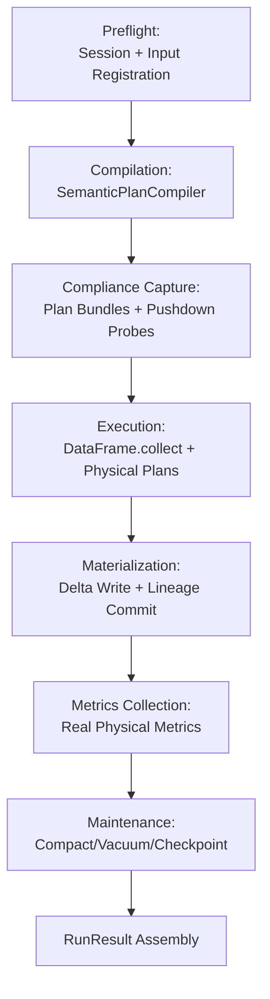

# Execution and Materialization Layer

## Purpose

The execution layer orchestrates the complete compile-materialize-metrics lifecycle for CPG builds. It transforms compiled DataFusion plans into persisted Delta tables while capturing real execution metrics, enforcing compliance contracts, and performing post-materialization maintenance. The layer operates on compiled `SemanticExecutionSpec` artifacts produced by the compiler and returns structured `RunResult` envelopes containing materialization outcomes, metrics, warnings, and compliance artifacts.

## Architecture Overview

The execution layer implements a six-stage pipeline with strict ordering contracts:



**Key design principles:**

1. **Stream-first execution** - Uses physical plans for diagnostics, but delegates actual execution to DataFusion's write path
2. **Two-layer determinism** - `spec_hash` for plan identity + `envelope_hash` for data identity
3. **Best-effort observability** - Plan bundle capture, maintenance, and compliance collection are non-blocking; failures become warnings
4. **Real metrics over synthetic** - Extracts actual row counts, spill events, and timing from executed plan trees
5. **Fail-open instrumentation** - Tracing, tuner, and compliance features degrade gracefully when disabled

## Execution Pipeline

The unified pipeline (`rust/codeanatomy_engine/src/executor/pipeline.rs`) orchestrates the core lifecycle shared by both native and Python entrypoints.

### Pipeline Orchestration

```rust
pub async fn execute_pipeline(
    ctx: &SessionContext,
    spec: &SemanticExecutionSpec,
    envelope_hash: [u8; 32],
    rulepack_fingerprint: [u8; 32],
    provider_identities: Vec<ProviderIdentity>,
    planning_surface_hash: [u8; 32],
    preflight_warnings: Vec<RunWarning>,
) -> Result<PipelineOutcome>
```

**Stage sequence:**

1. **Compile spec into output DataFrames** via `SemanticPlanCompiler`
2. **Capture plan bundles** when `compliance_capture` is enabled (best-effort)
3. **Probe pushdown contracts** via `extract_input_filter_predicates` and `verify_pushdown_contracts`
4. **Execute and materialize** to Delta tables, retaining physical plan references
5. **Collect real physical metrics** from executed plan trees
6. **Run post-materialization maintenance** when configured (compact/vacuum/checkpoint)
7. **Assemble and return complete RunResult**

**Pipeline does NOT handle:**
- Session construction (differs between native and Python paths)
- Input registration (differs between native and Python paths)
- Envelope capture (differs between native and Python paths)
- Tuner logic (Python-path-specific)
- Tracing initialization (stays in callers)

**Pipeline DOES handle:**
- Plan compilation via `SemanticPlanCompiler`
- Plan bundle capture with warning propagation
- Execution and materialization to Delta tables
- Physical metrics collection from executed plan trees
- Post-materialization maintenance
- RunResult assembly with all artifacts and warnings

### Preflight Context Preparation

Shared pre-pipeline orchestration (`rust/codeanatomy_engine/src/executor/orchestration.rs`) prepares the execution context:

```rust
pub async fn prepare_execution_context(
    session_factory: &SessionFactory,
    spec: &SemanticExecutionSpec,
    ruleset: &CpgRuleSet,
    tracing_config: Option<&TracingConfig>,
) -> Result<PreparedExecutionContext>
```

**Responsibilities:**

1. Build session state from engine profile or default configuration
2. Register extraction inputs as Delta providers (sorted by name for determinism)
3. Validate Delta compatibility and collect warnings
4. Capture session envelope AFTER input registration
5. Return prepared context with session, envelope, provider identities, and warnings

**Critical ordering contract (Scope 11):** The envelope is captured AFTER input registration so that `information_schema.tables` reflects all registered providers.

## View Execution

The runner (`rust/codeanatomy_engine/src/executor/runner.rs`) provides the low-level materialization primitives used by the pipeline.

### Execution Functions

**execute_and_materialize:**
```rust
pub async fn execute_and_materialize(
    ctx: &SessionContext,
    output_plans: Vec<(OutputTarget, DataFrame)>,
    lineage: &LineageContext,
) -> Result<Vec<MaterializationResult>>
```

**execute_and_materialize_with_plans:**
```rust
pub async fn execute_and_materialize_with_plans(
    ctx: &SessionContext,
    output_plans: Vec<(OutputTarget, DataFrame)>,
    lineage: &LineageContext,
) -> Result<(Vec<MaterializationResult>, Vec<Arc<dyn ExecutionPlan>>)>
```

**Key difference:** The `_with_plans` variant also returns physical plan references for post-execution metrics collection.

### Materialization Steps Per Output

1. **Create physical plan** via `df.create_physical_plan()`
2. **Extract partition count** from `plan.output_partitioning().partition_count()`
3. **Register or validate target table** via `ensure_output_table` or validate existing registration
4. **Choose write path:**
   - **Native Delta writer** if `delta_location` is set or table not pre-registered
   - **DataFusion write_table** if table was pre-registered without `delta_location`
5. **Execute write** via `df.collect()` + `delta_write_batches_request` or `df.write_table()`
6. **Read back outcome** via `read_write_outcome` (Delta version, files added, bytes written)
7. **Build MaterializationResult** with all metadata

### Full Pipeline Wrapper

```rust
pub async fn run_full_pipeline(
    spec: &SemanticExecutionSpec,
    rulepack_fingerprint: [u8; 32],
    prepared: PreparedExecutionContext,
) -> Result<RunResult>
```

Wraps the unified pipeline with tracing lifecycle management:

1. Initialize OTel tracing when feature is enabled
2. Create execution span with spec_hash, envelope_hash, rulepack_fingerprint
3. Delegate to `pipeline::execute_pipeline`
4. Record warning summary in span
5. Flush OTel tracing

## Delta Writer

The Delta writer (`rust/codeanatomy_engine/src/executor/delta_writer.rs`) handles table creation, schema validation, and lineage commit properties.

### Table Initialization

**ensure_output_table:**
```rust
pub async fn ensure_output_table(
    ctx: &SessionContext,
    table_name: &str,
    delta_location: &str,
    expected_schema: &SchemaRef,
) -> Result<()>
```

**Behavior:**

1. Load Delta table at `delta_location` via `DeltaTable::try_from_url`
2. If version is `None`, create new table with `map_arrow_schema` columns
3. Register Delta provider via `delta_provider_from_session_request`
4. Validate schema matches expected schema via `validate_output_schema`

### Schema Validation

**validate_output_schema:**
```rust
pub fn validate_output_schema(
    actual: &Schema,
    expected: &Schema,
) -> Result<()>
```

Checks that all expected columns exist in actual schema with compatible types. Returns error if:
- Expected column is missing from actual
- Data types don't match via `equals_datatype`

### Arrow to Delta Type Mapping

The `map_arrow_type` function converts Arrow data types to Delta Lake kernel types with full support for:

- Primitives: String, Integer, Long, Float, Double, Boolean, Binary, Date
- Timestamps: Timezone-aware → Timestamp, Timezone-naive → TimestampNtz
- Decimal128/256: Precision and scale validation
- Structs: Recursive field mapping
- Lists: All list variants (List, LargeList, ListView, FixedSizeList)
- Maps: Key-value mapping with nullable value support

### Lineage Context

```rust
pub struct LineageContext {
    pub spec_hash: [u8; 32],
    pub envelope_hash: [u8; 32],
    pub planning_surface_hash: [u8; 32],
    pub provider_identity_hash: [u8; 32],
    pub rulepack_fingerprint: [u8; 32],
    pub rulepack_profile: String,
    pub runtime_profile_name: Option<String>,
    pub run_started_at_rfc3339: String,
    pub runtime_lineage_tags: BTreeMap<String, String>,
}
```

**Commit properties built from lineage:**

- `codeanatomy.spec_hash` - Execution spec identity
- `codeanatomy.envelope_hash` - Input data identity
- `codeanatomy.planning_surface_hash` - Planning surface manifest hash
- `codeanatomy.provider_identity_hash` - Provider identities hash
- `codeanatomy.rulepack_fingerprint` - Rulepack fingerprint
- `codeanatomy.rulepack_profile` - Rulepack profile name
- `codeanatomy.runtime_profile` - Engine profile name
- `codeanatomy.run_started_at` - Run start timestamp (RFC3339)
- `codeanatomy.lineage_tag.*` - User-defined lineage tags

### Write Outcome Capture

**read_write_outcome:**
```rust
pub async fn read_write_outcome(delta_location: &str) -> WriteOutcome
```

Best-effort read-back of Delta metadata after write:

1. Load Delta table and snapshot
2. Extract `delta_version` from snapshot
3. Count files and sum bytes from `snapshot.snapshot().log_data()`
4. Return `WriteOutcome` with all `None` fields if any step fails

**Design rationale:** Metadata capture must never block the pipeline. Failures silently return empty outcome.

## RunResult Contract

The result envelope (`rust/codeanatomy_engine/src/executor/result.rs`) contains the complete execution outcome.

### RunResult Structure

```rust
pub struct RunResult {
    pub outputs: Vec<MaterializationResult>,
    pub spec_hash: [u8; 32],
    pub envelope_hash: [u8; 32],
    pub rulepack_fingerprint: [u8; 32],
    pub compliance_capture_json: Option<String>,
    pub tuner_hints: Vec<TuningHint>,
    pub plan_bundles: Vec<PlanBundleArtifact>,
    pub task_schedule: Option<TaskSchedule>,
    pub stats_quality: Option<StatsQuality>,
    pub collected_metrics: Option<CollectedMetrics>,
    pub trace_metrics_summary: Option<TraceMetricsSummary>,
    pub maintenance_reports: Vec<MaintenanceReport>,
    pub warnings: Vec<RunWarning>,
    pub started_at: DateTime<Utc>,
    pub completed_at: DateTime<Utc>,
}
```

### MaterializationResult

Per-table materialization outcome:

```rust
pub struct MaterializationResult {
    pub table_name: String,
    pub delta_location: Option<String>,
    pub rows_written: u64,
    pub partition_count: u32,
    pub delta_version: Option<i64>,
    pub files_added: Option<u64>,
    pub bytes_written: Option<u64>,
}
```

### DeterminismContract

Two-layer determinism check for replay validation:

```rust
pub struct DeterminismContract {
    pub spec_hash: [u8; 32],
    pub envelope_hash: [u8; 32],
}

impl DeterminismContract {
    pub fn is_replay_valid(&self, original: &DeterminismContract) -> bool {
        self.spec_hash == original.spec_hash
            && self.envelope_hash == original.envelope_hash
    }
}
```

A replay is valid iff BOTH `spec_hash` AND `envelope_hash` match. This ensures bit-identical plans operating on bit-identical inputs.

### RunResultBuilder

Fluent builder for incremental result construction:

```rust
let result = RunResult::builder()
    .with_spec_hash(spec_hash)
    .with_envelope_hash(envelope_hash)
    .with_rulepack_fingerprint(fingerprint)
    .started_now()
    .add_output(materialization_result)
    .with_warnings(warnings)
    .with_collected_metrics(Some(metrics))
    .build();
```

## Metrics Collection

The metrics collector (`rust/codeanatomy_engine/src/executor/metrics_collector.rs`) extracts real execution metrics from physical plan trees.

### CollectedMetrics

```rust
pub struct CollectedMetrics {
    pub output_rows: u64,
    pub spill_count: u64,
    pub spilled_bytes: u64,
    pub elapsed_compute_nanos: u64,
    pub peak_memory_bytes: u64,
    pub scan_selectivity: f64,
    pub partition_count: usize,
    pub operator_metrics: Vec<OperatorMetricSummary>,
}
```

### Collection Algorithm

**collect_plan_metrics:**
```rust
pub fn collect_plan_metrics(plan: &dyn ExecutionPlan) -> CollectedMetrics
```

**Recursive tree walk:**

1. Extract `MetricsSet` from each `ExecutionPlan` node
2. Aggregate via `metrics.aggregate_by_name()`:
   - `output_rows()` → total rows produced
   - `elapsed_compute()` → CPU time
   - `spill_count()` → spill events
   - `spilled_bytes()` → bytes spilled to disk
3. Track scan selectivity from leaf scan nodes (Parquet/Delta scans)
4. Compute selectivity as `scan_output_rows / scan_input_rows` (default to 1.0 if no scans)
5. Extract partition count from `plan.output_partitioning().partition_count()`

**Scan selectivity calculation:**
- For operators with "Scan", "Parquet", or "Delta" in name
- Input rows from `plan.partition_statistics(None).num_rows`
- Output rows from `metrics.output_rows()`
- Selectivity = output_rows / input_rows (1.0 if no scans found)

### TraceMetricsSummary

Stable summary payload for observability consumers:

```rust
pub struct TraceMetricsSummary {
    pub output_rows: u64,
    pub output_batches: u64,
    pub output_bytes: u64,
    pub elapsed_compute_nanos: u64,
    pub spill_file_count: u64,
    pub spilled_bytes: u64,
    pub spilled_rows: u64,
    pub selectivity: Option<f64>,
    pub operator_count: usize,
    pub warning_count_total: u64,
    pub warning_counts_by_code: BTreeMap<String, u64>,
}
```

Built via `summarize_collected_metrics(&collected)`.

### Metric Aggregation

The pipeline aggregates metrics across all physical plans:

```rust
fn aggregate_physical_metrics(physical_plans: &[Arc<dyn ExecutionPlan>]) -> CollectedMetrics {
    let mut aggregated = CollectedMetrics::default();
    for plan in physical_plans {
        let plan_metrics = collect_plan_metrics(plan.as_ref());
        aggregated.output_rows += plan_metrics.output_rows;
        aggregated.spill_count += plan_metrics.spill_count;
        // ... sum all counters
    }
    // Scan selectivity: weighted average across plans
    aggregated.scan_selectivity = total_scan_selectivity_sum / selectivity_samples;
    aggregated
}
```

## Warning System

The warning system (`rust/codeanatomy_engine/src/executor/warnings.rs`) provides structured non-fatal error reporting.

### WarningCode Taxonomy

```rust
pub enum WarningCode {
    PlanBundleRuntimeCaptureFailed,
    PlanBundleArtifactBuildFailed,
    OptionalSubstraitCaptureFailed,
    OptionalSqlCaptureFailed,
    OptionalDeltaCodecCaptureFailed,
    ComplianceExplainCaptureFailed,
    CompliancePushdownProbeFailed,
    CompliancePushdownProbeSkipped,
    ComplianceOptimizerLabFailed,
    ComplianceSerializationFailed,
    PushdownContractViolation,
    CostModelStatsFallback,
    SemanticValidationWarning,
    DeltaCompatibilityDrift,
    MaintenanceFailed,
    ReservedProfileKnobIgnored,
    LegacyParameterTemplatesRejected,
}
```

### WarningStage

Execution stage provenance:

```rust
pub enum WarningStage {
    Preflight,
    Compilation,
    PlanBundle,
    Compliance,
    Materialization,
    Maintenance,
    RuntimeProfile,
}
```

### RunWarning Structure

```rust
pub struct RunWarning {
    pub code: WarningCode,
    pub stage: WarningStage,
    pub message: String,
    pub context: BTreeMap<String, String>,
}

impl RunWarning {
    pub fn new(code: WarningCode, stage: WarningStage, message: impl Into<String>) -> Self
    pub fn with_context(self, key: impl Into<String>, value: impl Into<String>) -> Self
}
```

**Usage pattern:**

```rust
warnings.push(
    RunWarning::new(
        WarningCode::PlanBundleArtifactBuildFailed,
        WarningStage::PlanBundle,
        format!("Plan bundle artifact construction failed: {e}"),
    )
    .with_context("table_name", target.table_name.clone())
);
```

### Warning Aggregation

```rust
pub fn warning_counts_by_code(warnings: &[RunWarning]) -> BTreeMap<String, u64>
```

Aggregates warnings by code string for summary reporting.

## Tracing and Instrumentation

The tracing module (`rust/codeanatomy_engine/src/executor/tracing/`) provides OpenTelemetry integration with zero overhead when disabled.

### Bootstrap

**init_otel_tracing:**
```rust
pub fn init_otel_tracing(config: &TracingConfig) -> Result<()>
```

**Initialization sequence:**

1. Parse OTLP endpoint (default: `http://127.0.0.1:4318/v1/traces`)
2. Build span exporter for protocol (Grpc, HttpJson, HttpProtobuf)
3. Configure batch processor with queue size, batch size, delay
4. Build resource attributes from `otel_service_name` and `otel_resource_attributes`
5. Parse sampler (AlwaysOn, AlwaysOff, TraceIdRatioBased, ParentBased)
6. Create `SdkTracerProvider` with resource, sampler, and batch processor
7. Register global tracer and tracing subscriber

**Sampler configuration:**

- `always_on` → Sampler::AlwaysOn
- `always_off` → Sampler::AlwaysOff
- `traceidratio` → Sampler::TraceIdRatioBased(ratio)
- `parentbased_traceidratio` → Sampler::ParentBased(TraceIdRatioBased(ratio))
- Default → Sampler::ParentBased(AlwaysOn)

### Execution Instrumentation

**append_execution_instrumentation_rule:**
```rust
pub fn append_execution_instrumentation_rule(
    physical_rules: Vec<Arc<dyn PhysicalOptimizerRule + Send + Sync>>,
    config: &TracingConfig,
    trace_ctx: &TraceRuleContext,
) -> Vec<Arc<dyn PhysicalOptimizerRule + Send + Sync>>
```

**Critical ordering:** The instrumentation rule MUST be the last physical optimizer rule so all upstream rewrites run against unwrapped execution nodes.

**Custom fields injected:**

- `trace.spec_hash` - Execution spec hash
- `trace.rulepack` - Rulepack fingerprint
- `trace.profile` - Engine profile name
- `trace.rule_mode` - Rule mode (e.g., "Default", "Strict")
- `trace.custom_fields_json` - User-defined JSON fields

### Span Lifecycle

**execution_span:**
```rust
pub fn execution_span(info: &ExecutionSpanInfo, config: &TracingConfig) -> tracing::Span
```

**record_warning_summary:**
```rust
pub fn record_warning_summary(
    span: &tracing::Span,
    warning_count_total: u64,
    warning_counts_by_code: &BTreeMap<String, u64>,
)
```

**flush_otel_tracing:**
```rust
pub fn flush_otel_tracing() -> Result<()>
```

Forces batch processor to flush all pending spans before shutdown.

### Feature Gating

All tracing functions have zero-overhead no-op implementations when the `tracing` feature is disabled:

```rust
#[cfg(not(feature = "tracing"))]
pub fn init_otel_tracing(_config: &TracingConfig) -> Result<()> {
    Ok(())
}
```

## Adaptive Tuner

The adaptive tuner (`rust/codeanatomy_engine/src/tuner/adaptive.rs`) provides bounded auto-adjustment of execution parameters.

### Design Principles

1. **Explicit rollback policy** on regressions (>2x elapsed time)
2. **NEVER mutate correctness-affecting options** (optimizer rules, pushdown, etc.)
3. **Tune ONLY bounded execution knobs** (partitions, batch_size, repartition flags)
4. **Stability window** before proposing adjustments (3 observations)
5. **Bounded ranges** (±25% for partitions, 1024..65536 for batch_size)

### TunerMode

```rust
pub enum TunerMode {
    ObserveOnly,      // Never propose adjustments
    BoundedAdapt,     // Propose bounded adjustments
}
```

### TunerConfig

The ONLY knobs the tuner can adjust:

```rust
pub struct TunerConfig {
    pub target_partitions: u32,
    pub batch_size: u32,
    pub repartition_joins: bool,
    pub repartition_aggregations: bool,
}
```

**Defaults:**

- `target_partitions: 8`
- `batch_size: 8192`
- `repartition_joins: true`
- `repartition_aggregations: true`

### ExecutionMetrics

Input metrics for tuner observation:

```rust
pub struct ExecutionMetrics {
    pub elapsed_ms: u64,
    pub spill_count: u32,
    pub scan_selectivity: f64,
    pub peak_memory_bytes: u64,
    pub rows_processed: u64,
}
```

### Tuning Algorithm

**observe:**
```rust
pub fn observe(&mut self, metrics: &ExecutionMetrics) -> Option<TunerConfig>
```

**Decision sequence:**

1. **Check for regression:** If `elapsed_ms > last_metrics.elapsed_ms * 2`, rollback to stable config
2. **Wait for stability window:** Require 3 observations before tuning
3. **Adjust partitions based on spill pressure:**
   - If `spill_count > 0`, reduce partitions by 25% (floor enforced)
   - If no spills and low memory (<2GB), increase partitions by 25% (ceiling enforced)
4. **Adjust batch size based on selectivity:**
   - If `scan_selectivity < 0.1`, reduce batch size by 50% (floor enforced)
   - If `scan_selectivity > 0.8`, increase batch size by 50% (ceiling enforced)
5. **Adjust repartition flags based on row count:**
   - If `rows_processed < 1000`, disable repartitioning
   - If `rows_processed > 100_000`, enable repartitioning
6. **Update stable config** on successful adjustment

**Bounds enforcement:**

- `partitions_floor = initial * 3/4 (min 1)`
- `partitions_ceiling = initial * 5/4 (min 2)`
- `batch_size_floor = max(1024, initial / 2)`
- `batch_size_ceiling = min(65536, initial * 2)`

## Compliance Capture

The compliance module (`rust/codeanatomy_engine/src/compliance/capture.rs`) provides EXPLAIN VERBOSE capture, rule impact digests, and retention controls.

### ComplianceCapture

```rust
pub struct ComplianceCapture {
    pub explain_traces: BTreeMap<String, Vec<String>>,
    pub rule_impact: BTreeMap<String, RuleImpact>,
    pub config_snapshot: BTreeMap<String, String>,
    pub rulepack_snapshot: RulepackSnapshot,
    pub retention: RetentionPolicy,
    pub lab_traces: BTreeMap<String, Vec<RuleStep>>,
    pub pushdown_probes: BTreeMap<String, PushdownProbe>,
    pub pushdown_contract_reports: BTreeMap<String, PushdownContractReport>,
}
```

### Recording Methods

**record_explain:**
```rust
pub fn record_explain(&mut self, output_name: &str, explain_lines: Vec<String>)
```

**record_rule_impact:**
```rust
pub fn record_rule_impact(&mut self, rule_name: &str, plans_touched: u32, rewrites: u32)
```

**record_lab_steps:**
```rust
pub fn record_lab_steps(&mut self, lab_name: &str, steps: Vec<RuleStep>)
```

Stores optimizer lab step traces for compliance auditing. Multiple experiments can be recorded under different names (e.g., "baseline", "candidate").

**record_pushdown_probe:**
```rust
pub fn record_pushdown_probe(&mut self, table_name: &str, probe: PushdownProbe)
```

**record_pushdown_contract_report:**
```rust
pub fn record_pushdown_contract_report(&mut self, table_name: &str, report: PushdownContractReport)
```

### RulepackSnapshot

```rust
pub struct RulepackSnapshot {
    pub profile: String,
    pub analyzer_rules: Vec<String>,
    pub optimizer_rules: Vec<String>,
    pub physical_rules: Vec<String>,
    pub fingerprint: [u8; 32],
}
```

### RetentionPolicy

```rust
pub enum RetentionPolicy {
    Short,           // 7 days
    Long,            // 90 days
    Custom(u32),     // N days
}
```

### Feature Gating

EXPLAIN capture is feature-gated:

```rust
#[cfg(feature = "compliance")]
pub async fn capture_explain_verbose(
    df: &DataFrame,
    output_name: &str,
) -> Result<Vec<String>>

#[cfg(not(feature = "compliance"))]
pub async fn capture_explain_verbose(
    _df: &DataFrame,
    _output_name: &str,
) -> Result<Vec<String>> {
    Ok(Vec::new())
}
```

## Stability Infrastructure

The stability module (`rust/codeanatomy_engine/src/stability/`) provides targeted performance and correctness tests.

### Stability Harness

Targeted tests for complex plan combination patterns:

```rust
pub struct StabilityFixture {
    // Test fixture definition
}

pub struct StabilityReport {
    // Execution report
}
```

### Optimizer Lab

Offline optimizer lab for deterministic rulepack experiments:

```rust
pub fn run_optimizer_lab(
    plan: LogicalPlan,
    config: OptimizerConfig,
) -> LabResult

pub fn diff_lab_results(
    baseline: &LabResult,
    candidate: &LabResult,
) -> RuleDiff
```

**RuleStep:**
```rust
pub struct RuleStep {
    pub ordinal: usize,
    pub rule_name: String,
    pub plan_digest: [u8; 32],
}
```

Step traces are recordable in `ComplianceCapture` for auditing via `record_lab_steps()`.

## Table Registration and Providers

The providers module (`rust/codeanatomy_engine/src/providers/`) handles Delta table registration and pushdown contracts.

### Input Registration

**register_extraction_inputs:**
```rust
pub async fn register_extraction_inputs(
    ctx: &SessionContext,
    inputs: &[InputRelation],
) -> Result<Vec<TableRegistration>>
```

**Registration sequence:**

1. Sort inputs by `logical_name` for deterministic ordering
2. For each input:
   - Build `standard_scan_config` with lineage tracking
   - Load Delta provider via `delta_provider_from_session_request`
   - Validate scan config via `validate_scan_config`
   - Hash schema via `hash_arrow_schema`
   - Infer capabilities from scan config
   - Extract compatibility facts from snapshot
   - Compute provider identity key from (name, location, version, scan_config)
   - Register table in session context
3. Return sorted `TableRegistration` records

### TableRegistration

```rust
pub struct TableRegistration {
    pub name: String,
    pub delta_version: i64,
    pub schema_hash: [u8; 32],
    pub provider_identity: [u8; 32],
    pub capabilities: ProviderCapabilities,
    pub compatibility: DeltaCompatibilityFacts,
}
```

### DeltaCompatibilityFacts

```rust
pub struct DeltaCompatibilityFacts {
    pub min_reader_version: i32,
    pub min_writer_version: i32,
    pub reader_features: Vec<String>,
    pub writer_features: Vec<String>,
    pub column_mapping_mode: Option<String>,
    pub partition_columns: Vec<String>,
}
```

Extracted from Delta snapshot's protocol metadata.

### Provider Identity Key

```rust
fn provider_identity_key(
    logical_name: &str,
    delta_location: &str,
    delta_version: i64,
    scan_config: &DeltaScanConfig,
) -> [u8; 32]
```

**BLAKE3 hash of:**

- `logical_name`
- `delta_location`
- `delta_version`
- `enable_parquet_pushdown`
- `schema_force_view_types`
- `wrap_partition_values`
- `file_column_name` (if present)

### Pushdown Probing

**probe_provider_pushdown:**
```rust
pub async fn probe_provider_pushdown(
    ctx: &SessionContext,
    table_name: &str,
    filters: &[Expr],
) -> Result<PushdownProbe>
```

Retrieves the registered provider and invokes `supports_filters_pushdown` with the given filter expressions. Returns per-filter statuses for compliance tracking.

## Delta Maintenance

The maintenance module (`rust/codeanatomy_engine/src/executor/maintenance.rs`) orchestrates post-execution Delta operations.

### MaintenanceSchedule

```rust
pub struct MaintenanceSchedule {
    pub target_tables: Vec<String>,
    pub compact: Option<CompactPolicy>,
    pub vacuum: Option<VacuumPolicy>,
    pub checkpoint: bool,
    pub metadata_cleanup: bool,
    pub constraints: Vec<ConstraintSpec>,
    pub max_parallel_tables: usize,
    pub require_table_quiescence: bool,
}
```

### Operation Sequence

**execute_maintenance:**
```rust
pub async fn execute_maintenance(
    ctx: &SessionContext,
    schedule: &MaintenanceSchedule,
    output_locations: &[(String, String)],
) -> Result<Vec<MaintenanceReport>>
```

**Strict order per table:**

1. **Compact** - Merge small files into larger ones (target: 512 MB)
2. **Checkpoint** - Create recovery point for faster log replay
3. **Vacuum** - Remove unreferenced files (minimum 168 hours retention enforced)
4. **Metadata cleanup** - Clean up old log entries
5. **Constraints** - Add/validate check constraints

**Design rationale:** This order ensures recoverability at each step:

- Compact creates larger files before vacuum removes old ones
- Checkpoint creates a recovery point before vacuum
- Vacuum only runs after checkpoint ensures recoverability
- Constraints are validated last on the final table state

### Vacuum Safety

**safe_vacuum_retention:**
```rust
pub fn safe_vacuum_retention(requested: u64) -> u64 {
    requested.max(MIN_VACUUM_RETENTION_HOURS)  // MIN = 168 hours (7 days)
}
```

The engine enforces a non-negotiable 7-day minimum retention regardless of spec value. This prevents accidental data loss from misconfigured policies.

### MaintenanceReport

```rust
pub struct MaintenanceReport {
    pub table_name: String,
    pub operation: String,
    pub success: bool,
    pub message: Option<String>,
}
```

Best-effort operations - failures are captured as reports in `RunResult.maintenance_reports`, not propagated as errors.

## Python-Side Orchestration

The Python-side build pipeline (`src/graph/build_pipeline.py`) wraps the Rust engine execution.

### Engine Execution Phase

**_execute_engine_phase:**
```python
def _execute_engine_phase(
    semantic_input_locations: dict[str, str],
    spec: SemanticExecutionSpec,
    engine_profile: str,
) -> tuple[dict[str, object], dict[str, object]]:
```

**Steps:**

1. Import `codeanatomy_engine` Rust extension
2. Validate output targets
3. Build spec payload with input overrides
4. Encode as JSON via `msgspec.json.encode`
5. Call `engine_module.run_build(request_json)`
6. Extract `run_result` and `artifacts` from response
7. Return both payloads

### Observability Recording

**_record_observability:**
```python
def _record_observability(
    spec: SemanticExecutionSpec,
    run_result: dict[str, object],
) -> None:
```

**Emits diagnostics events:**

- `engine_spec_summary_v1` - Spec metadata (view count, join edges, rule intents)
- `engine_execution_summary_v1` - Execution summary from run result
- `engine_output_v1` - Per-table materialization outcomes
- Real metrics via `record_engine_metrics(run_result)`

## Cross-References

### Upstream Dependencies

- **05_rust_engine.md** - Compiler module that produces `SemanticExecutionSpec`
- **04_boundary_contract.md** - Spec schema definitions and validation contracts
- **09_observability_and_config.md** - Tracing configuration and diagnostics collection

### Downstream Consumers

- Python observability layer (`src/obs/`) consumes `RunResult` for metrics
- Python build pipeline (`src/graph/`) wraps engine execution
- Replay infrastructure validates determinism contract
- Tuner stores metrics for adaptive optimization

### Related Modules

- `rust/codeanatomy_engine/src/compiler/` - Plan compilation
- `rust/codeanatomy_engine/src/session/` - Session factory and envelope capture
- `rust/codeanatomy_engine/src/rules/` - Rulepack registry
- `rust/datafusion_ext/` - Delta control plane and maintenance operations

