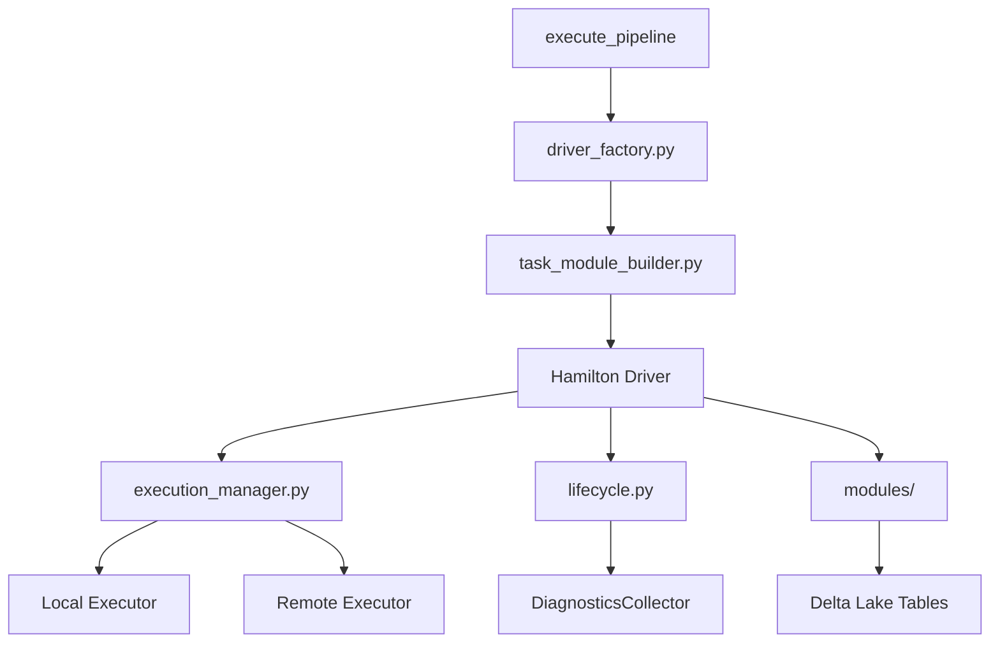

# Hamilton Orchestration

## Purpose

The Hamilton pipeline subsystem orchestrates CodeAnatomy's multi-stage CPG construction using the Hamilton DAG framework. It provides declarative dataflow orchestration with built-in caching, parallel execution, and observability integration.

## Key Concepts

- **Driver Factory** - Builds and caches Hamilton Driver instances for execution modes
- **Task Module Builder** - Synthesizes Hamilton DAG nodes dynamically from ExecutionPlan
- **Execution Manager** - Routes tasks to local vs. remote executors based on cost
- **Lifecycle Hooks** - Captures diagnostics, lineage, and telemetry
- **Module Registry** - 7 Hamilton modules spanning inputs, params, dataloaders, and outputs

---

## Architecture Overview



**Execution Flow:**

1. `execute_pipeline()` builds a `DriverBuildRequest`
2. `build_driver()` compiles ViewGraphContext → ExecutionPlan → Hamilton Driver
3. Driver executes DAG with dynamic execution hooks
4. `PlanExecutionManager` routes tasks to local/remote executors
5. Lifecycle hooks capture diagnostics and OpenTelemetry spans
6. Outputs materialize CPG artifacts to Delta Lake

---

## Driver Factory

**Module:** `driver_factory.py`

### Module Loading

Default modules are loaded via `default_modules()`:

```python
def default_modules() -> list[ModuleType]:
    return hamilton_modules.load_all_modules()
```

**7 modules in order:**

1. **inputs.py** - Runtime profile, session, diagnostics, config bundles
2. **dataloaders.py** - Repo scan, extract layers, semantic catalog outputs
3. **params.py** - Parameter bundles, param table registry
4. **execution_plan.py** - ExecutionPlan node, plan artifacts
5. **task_execution.py** - Task execution dispatcher
6. **column_features.py** - Column-level feature extraction
7. **outputs.py** - CPG materialization, run manifests

**Dynamic modules** are appended during construction:

```python
modules.append(build_execution_plan_module(resolved_plan))
modules.append(build_task_execution_module(plan, options))
```

### Configuration Fingerprinting

Cache keys incorporate plan signature for invalidation:

```python
def driver_cache_key(
    config: Mapping[str, JsonValue],
    *,
    plan_signature: str,
    execution_mode: ExecutionMode,
    executor_config: ExecutorConfig | None,
) -> str:
    payload = {
        "version": 3,
        "plan_signature": plan_signature,
        "execution_mode": execution_mode.value,
        "executor_config": _executor_config_payload(executor_config),
        "config": dict(config),
    }
    return hash_json_canonical(payload, str_keys=True)
```

---

## Task Module Builder

**Module:** `task_module_builder.py`

### Dynamic DAG Generation

Generates Hamilton function nodes for each task in ExecutionPlan:

```python
def build_task_execution_module(
    *,
    plan: ExecutionPlan,
    options: TaskExecutionModuleOptions | None = None,
) -> ModuleType:
    module = ModuleType(resolved.module_name)

    # Generate scan task nodes
    for scan_task_name in sorted(scan_units_by_task):
        task_node = _build_task_node(context)
        module.__dict__[scan_task_name] = task_node

    # Generate view task nodes
    for output_name, view_node in outputs.items():
        task_node = _build_task_node(context)
        module.__dict__[output_name] = task_node

    return module
```

### Function Synthesis

Each task node is decorated with dependencies and metadata:

```python
return tag(
    layer="execution",
    task_name=task.name,
    task_kind=task.kind,
    cache_policy=task.cache_policy,
    task_cost=str(context.task_cost),
    on_critical_path=str(context.on_critical_path),
    betweenness_centrality=str(context.betweenness_centrality),
    plan_fingerprint=context.plan_fingerprint,
    **schedule_tags,
)(node_fn)
```

**Tag payload includes:**

| Category | Tags |
|----------|------|
| Task metadata | `task_name`, `task_kind`, `task_output`, `cache_policy` |
| Schedule metadata | `generation_index`, `generation_order`, `schedule_index` |
| Graph metrics | `task_cost`, `bottom_level_cost`, `slack`, `on_critical_path` |
| Centrality metrics | `betweenness_centrality`, `immediate_dominator`, `bridge_edge_count` |
| Plan fingerprints | `plan_signature`, `plan_fingerprint`, `plan_task_signature` |

---

## Execution Manager

**Module:** `execution_manager.py`

### Task Routing

Routes tasks to local vs. remote executors based on task kind and cost:

```python
class PlanExecutionManager(executors.ExecutionManager):
    def get_executor_for_task(
        self,
        task: executors.TaskImplementation,
    ) -> executors.TaskExecutor:
        tags = _task_tags(task)
        use_remote = _task_kind(tags) == "scan" or _is_high_cost(
            tags,
            threshold=self._cost_threshold,
        )
        return self._remote_executor if use_remote else self._local_executor
```

### Execution Modes

| Mode | Description |
|------|-------------|
| `DETERMINISTIC_SERIAL` | Single-threaded, no dynamic execution |
| `PLAN_PARALLEL` | Dynamic execution with local executor |
| `PLAN_PARALLEL_REMOTE` | Dynamic execution with remote executor for scans and high-cost tasks |

---

## Pipeline Execution

**Module:** `execution.py`

### Entry Points

```python
def execute_pipeline(
    *,
    repo_root: PathLike,
    options: PipelineExecutionOptions | None = None,
) -> Mapping[str, JsonDict | None]:
    driver_instance = _resolve_driver_instance(options)

    with tracer.start_as_current_span("pipeline.execute") as span:
        if options.use_materialize:
            _, results = driver_instance.materialize(
                additional_vars=execution_outputs,
                inputs={"repo_root": str(repo_root)},
                overrides=execute_overrides,
            )
        else:
            results = driver_instance.execute(
                execution_outputs,
                inputs={"repo_root": str(repo_root)},
                overrides=execute_overrides,
            )
    return results
```

### Default Outputs

```python
FULL_PIPELINE_OUTPUTS = (
    "write_cpg_nodes_delta",
    "write_cpg_edges_delta",
    "write_cpg_props_delta",
    "write_cpg_props_map_delta",
    "write_cpg_edges_by_src_delta",
    "write_cpg_edges_by_dst_delta",
    "write_run_manifest_delta",
    "write_run_bundle_dir",
)
```

---

## Hamilton Modules

### inputs.py - Input Nodes

Provides runtime configuration and dependency injection:

```python
@tag(layer="inputs", kind="runtime")
def runtime_profile_spec(
    runtime_profile_name: str,
    determinism_override: DeterminismTier | None,
    output_config: OutputConfig,
) -> RuntimeProfileSpec:
    return resolve_runtime_profile(runtime_profile_name, determinism=determinism_override)

@cache(behavior="ignore")
@tag(layer="inputs", kind="runtime")
def engine_session(
    runtime_profile_spec: RuntimeProfileSpec,
    diagnostics_collector: DiagnosticsCollector,
) -> EngineSession:
    return build_engine_session(runtime_spec=runtime_profile_spec, ...)
```

### outputs.py - Output Materialization

Materializes CPG tables to Delta Lake:

```python
@cache(format="delta", behavior="default")
@check_output_custom(
    TableSchemaValidator(expected_columns=_NODE_OUTPUT_COLUMNS, importance="fail"),
    NonEmptyTableValidator(),
)
def cpg_nodes(cpg_nodes_final: TableLike) -> TableLike:
    return cpg_nodes_final

@datasaver_dict()
def write_cpg_delta_output(
    table: TableLike,
    output_runtime_context: OutputRuntimeContext,
    write_spec: _DeltaWriteSpec,
) -> DataSaverDict:
    return _delta_write(table, inputs=DeltaWriteInputs(...))
```

### params.py - Parameter Handling

Manages parameter bundles and param table registry:

```python
@tag(layer="params", artifact="param_bundle")
def param_bundle(
    relspec_param_values: JsonDict,
    param_table_specs: tuple[ParamTableSpec, ...],
) -> ParamBundle:
    return ParamBundle(scalar=scalar_values, lists=list_values)
```

---

## Lifecycle Hooks

**Module:** `lifecycle.py`

### Node Execution Hook

```python
@dataclass
class DiagnosticsNodeHook(lifecycle_api.NodeExecutionHook):
    collector: DiagnosticsCollector

    def run_before_node_execution(self, *, node_name: str, run_id: str, **kwargs) -> None:
        self.collector.record_events("hamilton_node_start_v1", [...])

    def run_after_node_execution(self, *, node_name: str, success: bool, **kwargs) -> None:
        self.collector.record_events("hamilton_node_finish_v1", [...])
```

### Plan Diagnostics Hook

```python
@dataclass
class PlanDiagnosticsHook(lifecycle_api.GraphExecutionHook):
    plan: ExecutionPlan
    profile: DataFusionRuntimeProfile

    def run_before_graph_execution(self, *, run_id: str, **kwargs) -> None:
        bundle = build_plan_artifact_bundle(plan=self.plan, run_id=run_id)
        record_artifact(self.profile, "plan_schedule_v1", ...)

    def run_after_graph_execution(self, *, run_id: str, **kwargs) -> None:
        _flush_plan_events(self.plan, profile=self.profile, ...)
```

---

## Cache Lineage

**Module:** `cache_lineage.py`

### Lineage Tracking

```python
def export_cache_lineage_artifacts(
    *,
    driver: hamilton_driver.Driver,
    run_id: str,
    out_dir: Path,
    plan_signature: str | None = None,
) -> CacheLineageSummary:
    logs_by_node = cache.logs(run_id=run_id, level="debug")
    log_rows = _lineage_rows_from_logs(cache, run_id, logs_by_node, plan_signature)
    metadata_rows = _lineage_rows_from_metadata_store(cache, run_id, plan_signature)
    merged_rows = _merge_lineage_rows(log_rows=log_rows, metadata_rows=metadata_rows)
    return CacheLineageSummary(path=out_dir, rows=tuple(merged_rows))
```

Cache keys incorporate:
- **Code version** - Function signature hash
- **Data version** - Input data content hash
- **Dependencies data versions** - Upstream node data versions

---

## Hamilton Tracker Integration

**Module:** `hamilton_tracker.py`

### OpenTelemetry Integration

```python
class CodeAnatomyHamiltonTracker(sdk_adapters.HamiltonTracker):
    def pre_graph_execute(self, run_id: str, graph: Any, **kwargs) -> Any:
        self.base_tags = _merge_tags(original_tags, self._run_tag_provider)
        return super().pre_graph_execute(run_id=run_id, graph=graph, **kwargs)
```

Run tags include:
- `runtime_profile_hash`, `runtime_profile_name`, `determinism_tier`
- `environment`, `repo_id`, `git_head_ref`, `git_base_ref`
- `codeanatomy.run_id`, `otel.trace_id`, `otel.span_id`

---

## Extension Points

### Custom Executors

```python
executor_config = ExecutorConfig(
    kind="ray",
    max_tasks=16,
    ray_init_config={"num_cpus": 16, "num_gpus": 1},
)
```

**Supported kinds:** `threadpool`, `multiprocessing`, `ray`, `dask`

### Custom Graph Adapters

```python
graph_adapter_config = GraphAdapterConfig(
    kind="dask",
    options={"scheduler_address": "tcp://localhost:8786"},
)
```

### Custom Lifecycle Hooks

```python
class CustomNodeHook(lifecycle_api.NodeExecutionHook):
    def run_before_node_execution(self, *, node_name: str, **kwargs) -> None:
        pass  # Custom logic

    def run_after_node_execution(self, *, node_name: str, success: bool, **kwargs) -> None:
        pass  # Custom logic
```

---

## Configuration Reference

### Driver Config Keys

| Key | Default | Description |
|-----|---------|-------------|
| `runtime_profile_name` | `"default"` | Runtime profile name |
| `cache_path` | None | Hamilton cache directory |
| `enable_hamilton_tracker` | `False` | Enable Hamilton UI tracker |
| `enable_hamilton_node_diagnostics` | `True` | Enable node diagnostics hook |
| `enable_otel_node_tracing` | `True` | Enable OpenTelemetry node tracing |
| `enable_plan_diagnostics` | `True` | Enable plan diagnostics hook |
| `enable_cache_lineage` | `True` | Enable cache lineage export |

### Execution Options Keys

| Key | Description |
|-----|-------------|
| `output_dir` | Output directory for CPG artifacts |
| `execution_mode` | `DETERMINISTIC_SERIAL`, `PLAN_PARALLEL`, `PLAN_PARALLEL_REMOTE` |
| `executor_config` | Executor configuration (kind, max_tasks) |
| `graph_adapter_config` | Graph adapter configuration |
| `outputs` | Output node names to materialize |

---

## Performance Characteristics

| Operation | Latency | Notes |
|-----------|---------|-------|
| Driver cache hit | <50ms | Avoids module loading and compilation |
| Driver cache miss | 500-2000ms | Depends on plan complexity |
| Task routing | 1-5ms per task | Negligible for tasks >100ms |
| Cache lineage export | 50-200ms | Scales with event count |
| Plan diagnostics | 100-500ms | Scales with task count |

---

## File Reference

```
src/hamilton_pipeline/
├── driver_factory.py          # Driver construction, caching
├── task_module_builder.py     # Dynamic DAG generation
├── execution.py               # execute_pipeline() entry point
├── execution_manager.py       # Task routing
├── lifecycle.py               # Diagnostics hooks
├── hamilton_tracker.py        # OpenTelemetry integration
├── cache_lineage.py           # Lineage export
├── types/                     # ExecutionMode, ExecutorConfig
└── modules/
    ├── inputs.py              # Runtime profiles, session
    ├── dataloaders.py         # Extract layers, semantic catalog
    ├── params.py              # Parameter bundles
    ├── execution_plan.py      # ExecutionPlan node
    ├── task_execution.py      # Task dispatcher
    └── outputs.py             # CPG materialization
```

---

## Cross-References

- **[01_overview.md](01_overview.md)** - System overview and public API
- **[02_pipeline_stages.md](02_pipeline_stages.md)** - Four-stage pipeline details
- **[04_datafusion_integration.md](04_datafusion_integration.md)** - DataFusion engine

**Source Files:**
- `src/hamilton_pipeline/` - Complete Hamilton orchestration
- `src/graph/product_build.py` - Public API entry point
