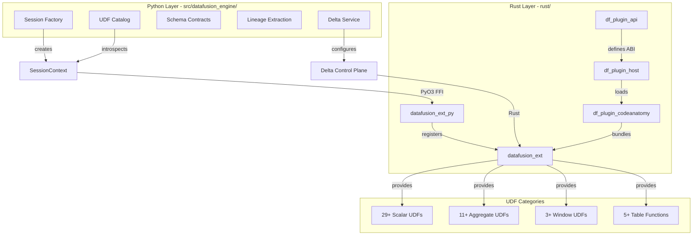
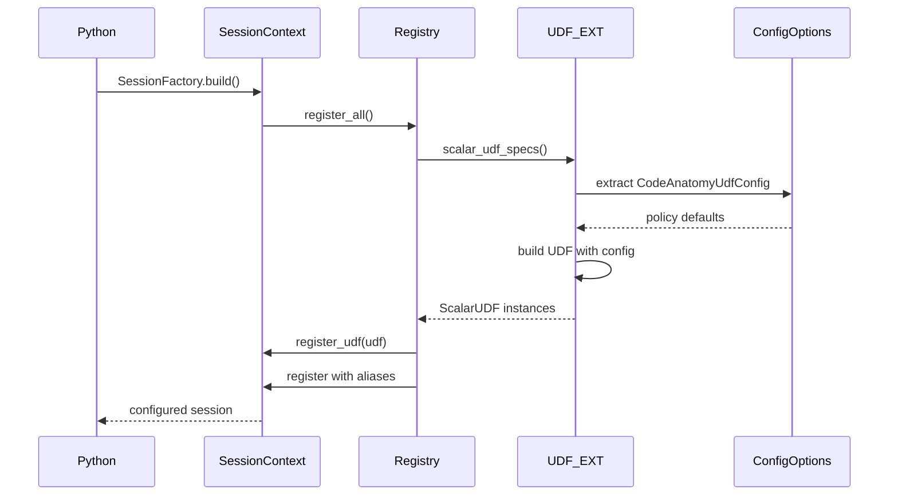

# DataFusion Integration and UDF Platform

## Purpose

DataFusion serves as the query execution engine for CodeAnatomy, playing a dual role across Python and Rust layers. On the Python side, it provides SQL-based extraction queries, schema validation, and lineage-driven dependency inference. On the Rust side, it delivers high-performance execution via a native extension crate with 40+ custom UDFs, Delta Lake integration, and an ABI-stable plugin system.

This document covers the complete DataFusion integration architecture, from Python session management through Rust UDF implementation to Delta storage control.

## Architecture Overview



## Rust Workspace Structure

The Rust workspace contains 8 crates with distinct responsibilities:

| Crate | Purpose | Language | Output |
|-------|---------|----------|--------|
| `datafusion_ext` | Core extension library with UDFs and Delta control | Rust | `libdatafusion_ext.rlib` |
| `datafusion_ext_py` | Python bindings via PyO3 | Rust | `datafusion_ext_py.so` |
| `codeanatomy_engine` | Unified query engine facade | Rust | `libcodeanatomy_engine.rlib` |
| `codeanatomy_engine_py` | Engine Python bindings | Rust | `codeanatomy_engine_py.so` |
| `datafusion_python` | Additional Python utilities | Rust | `datafusion_python.so` |
| `df_plugin_api` | ABI-stable plugin interface | Rust | `libdf_plugin_api.rlib` |
| `df_plugin_host` | Plugin loader and host runtime | Rust | `libdf_plugin_host.rlib` |
| `df_plugin_codeanatomy` | CodeAnatomy plugin implementation | Rust | `libdf_plugin_codeanatomy.{so,dylib,dll}` |

All crates target DataFusion 51.0, Arrow 57.1, and PyO3 0.26.

### Workspace Dependencies

From `rust/Cargo.toml`:

```toml
datafusion = { version = "51.0.0", default-features = false, features = ["parquet"] }
arrow = "57.1.0"
pyo3 = "0.26"
deltalake = "0.21+"  # Via workspace deps
tokio = { version = "1.49.0", features = ["rt-multi-thread"] }
```

## UDF Platform

### UDF Categories and Registration

The UDF platform provides four categories of functions, all Rust-native:

#### Scalar UDFs (29+ functions)

**Span UDFs** - Byte-span operations for canonical code location tracking:
- `span_make(bstart, bend, line_base?, col_unit?, end_exclusive?)` - Create normalized span struct
- `span_overlaps(span1, span2)` - Test interval overlap
- `span_contains(span1, span2)` - Test containment
- `span_len(span)` - Compute span length
- `span_id(span)` - Generate stable span identifier
- `interval_align_score(span1, span2)` - Alignment quality metric

**Identity UDFs** - Stable hashing for deterministic identifiers:
- `stable_hash64(value)` - Blake2b 64-bit hash
- `stable_hash128(value)` - Blake2b 128-bit hash
- `stable_id(value, ...)` - Composite stable identifier
- `stable_id_parts(...)` - Multi-part stable ID
- `prefixed_hash64(prefix, value)` - Namespaced hash
- `prefixed_hash_parts64(prefix, ...)` - Multi-part namespaced hash
- `stable_hash_any(value, form?, casefold?)` - Normalized hash with policy

**Text UDFs** - Unicode normalization and quality:
- `utf8_normalize(text, form?, casefold?, collapse_ws?)` - Unicode normalization (NFC/NFD/NFKC/NFKD)
- `utf8_null_if_blank(text)` - Null for whitespace-only strings
- `qname_normalize(qualname)` - Qualified name canonicalization

**Collection UDFs** - Map/list operations:
- `map_normalize(map, key_case?, sort_keys?)` - Map key normalization
- `map_get_default(map, key, default)` - Safe map access
- `list_compact(list)` - Remove nulls from list
- `list_unique_sorted(list)` - Deduplicate and sort list

**Metadata UDFs** - Arrow metadata access:
- `arrow_metadata(field_name, key)` - Extract Arrow field metadata
- `semantic_tag(field_name)` - Retrieve semantic type tag
- `cpg_score(field_name)` - CPG quality score

**CDF UDFs** - Delta Change Data Feed operations:
- `cdf_change_rank(change_type)` - Rank change operations
- `cdf_is_upsert(change_type)` - Test for insert/update
- `cdf_is_delete(change_type)` - Test for delete

**Position UDFs** - Column offset conversions:
- `col_to_byte(col, line_text, col_unit)` - Convert column offset to byte position

All scalar UDFs support:
- **Constant folding** via `simplify()` implementation
- **Metadata propagation** via `return_field_from_args()`
- **Config-aware defaults** via `CodeAnatomyUdfConfig`

#### Aggregate UDFs (11+ functions)

Implemented in `rust/datafusion_ext/src/udaf_builtin.rs`:

- Statistical aggregates: `mode`, `median_absolute_deviation`
- Collection aggregates: `array_union_agg`, `map_union_agg`
- Span aggregates: `span_union_agg`, `span_intersect_agg`
- Text aggregates: `utf8_join_agg`

All aggregate UDFs expose state types for streaming computation.

#### Window UDFs (3+ functions)

Implemented in `rust/datafusion_ext/src/udwf_builtin.rs`:

- `row_number_partition` - Partitioned row numbering
- `lead_partition` - Partitioned lead
- `lag_partition` - Partitioned lag

#### Table Functions (5+ functions)

Table-valued functions for scan operations:

- `delta_scan` - Delta table scan with time travel
- `delta_cdf_scan` - Change data feed scan
- `parquet_scan` - Enhanced Parquet scan
- `json_scan` - JSON scan with schema inference

Implemented in `rust/datafusion_ext/src/udtf_builtin.rs` and `rust/datafusion_ext/src/udtf_sources.rs`.

### UDF Registration Flow



Key steps:

1. **Spec enumeration** - `udf_registry::scalar_udf_specs()` returns builder specs
2. **Config extraction** - Extract `CodeAnatomyUdfConfig` from session `ConfigOptions`
3. **Policy application** - Apply UDF-specific defaults (e.g., UTF8 normalization form)
4. **Alias registration** - Register UDF with primary name and aliases
5. **Snapshot capture** - Python UDF catalog introspects via `information_schema.routines`

### UDF Config Policy

UDFs with configurable behavior use `CodeAnatomyUdfConfig` extension:

```rust
// rust/datafusion_ext/src/udf_config.rs
pub struct CodeAnatomyUdfConfig {
    // UTF8 normalization
    pub utf8_normalize_form: String,              // "NFC" | "NFD" | "NFKC" | "NFKD"
    pub utf8_normalize_casefold: bool,            // Apply case folding
    pub utf8_normalize_collapse_ws: bool,         // Collapse whitespace

    // Span defaults
    pub span_default_line_base: i32,              // Line numbering base (0 or 1)
    pub span_default_col_unit: String,            // "byte" | "utf8" | "utf16"
    pub span_default_end_exclusive: bool,         // End offset exclusive

    // Map normalization
    pub map_normalize_key_case: String,           // "preserve" | "lower" | "upper"
    pub map_normalize_sort_keys: bool,            // Sort keys deterministically
}
```

Config is stored in session `ConfigOptions.extensions` and accessed via `with_updated_config()`.

## Plugin System

### ABI-Stable Interface

The plugin API provides ABI stability via `abi_stable` crate:

```rust
// rust/df_plugin_api/src/lib.rs
#[repr(C)]
#[derive(StableAbi)]
pub struct DfPluginMod {
    pub manifest: extern "C" fn() -> DfPluginManifestV1,
    pub exports: extern "C" fn() -> DfPluginExportsV1,
    pub udf_bundle_with_options: extern "C" fn(options_json: ROption<RString>)
        -> DfResult<DfUdfBundleV1>,
    pub create_table_provider: extern "C" fn(
        name: RStr<'_>,
        options_json: ROption<RString>,
    ) -> DfResult<FFI_TableProvider>,
}

pub struct DfPluginManifestV1 {
    pub plugin_abi_major: u16,      // ABI version
    pub plugin_abi_minor: u16,
    pub df_ffi_major: u16,          // DataFusion FFI version
    pub datafusion_major: u16,       // DataFusion version
    pub arrow_major: u16,            // Arrow version
    pub plugin_name: RString,
    pub capabilities: u32,           // Capability flags
}
```

Capabilities flags:
- `TABLE_PROVIDER` - Provides table sources
- `SCALAR_UDF` - Provides scalar functions
- `AGG_UDF` - Provides aggregate functions
- `WINDOW_UDF` - Provides window functions
- `TABLE_FUNCTION` - Provides table-valued functions

### Plugin Host

The plugin host (`df_plugin_host`) loads dynamic libraries and bridges FFI types:

```rust
// rust/df_plugin_host/src/loader.rs
pub struct PluginHandle {
    library: Library,
    module: DfPluginMod_Ref,
}

pub fn load_plugin(path: &Path) -> Result<PluginHandle, String> {
    let library = Library::new(path)?;
    let module = library.get_root_module::<DfPluginMod_Ref>()?;
    validate_abi_version(&module)?;
    Ok(PluginHandle { library, module })
}
```

### CodeAnatomy Plugin

The CodeAnatomy plugin (`df_plugin_codeanatomy`) bundles all UDFs and Delta providers:

```rust
// rust/df_plugin_codeanatomy/src/lib.rs
fn exports() -> DfPluginExportsV1 {
    DfPluginExportsV1 {
        table_provider_names: vec!["delta", "delta_cdf"],
        udf_bundle: build_udf_bundle(),
        table_functions: build_table_functions(),
    }
}

fn build_udf_bundle() -> DfUdfBundleV1 {
    let specs = udf_registry::scalar_udf_specs();
    let scalar = specs.into_iter()
        .map(|spec| FFI_ScalarUDF::from((spec.builder)()))
        .collect();
    let aggregate = udf_registry::builtin_udafs()
        .into_iter()
        .map(FFI_AggregateUDF::from)
        .collect();
    DfUdfBundleV1 { scalar, aggregate, window }
}
```

Plugin usage from Python:

```python
# Load plugin via host
plugin = load_plugin("target/release/libdf_plugin_codeanatomy.so")

# Extract UDF bundle
bundle = plugin.udf_bundle_with_options(json_options)

# Register in session
for udf in bundle.scalar:
    ctx.register_udf(ForeignScalarUDF(udf))
```

## Python-Side DataFusion

### Session Management

Session factory in `src/datafusion_engine/session/factory.py`:

```python
@dataclass(frozen=True)
class SessionFactory:
    profile: DataFusionRuntimeProfile

    def build_config(self) -> SessionConfig:
        config = SessionConfig()
        config = config.with_default_catalog_and_schema(
            self.profile.catalog.default_catalog,
            self.profile.catalog.default_schema,
        )
        config = self._apply_execution_settings(config)
        config = self._apply_cache_policy(config)
        config = self._apply_feature_gates(config)
        return config

    def build(self) -> SessionContext:
        config = self.build_config()
        runtime_env = self.profile.runtime_env_builder()
        if self.profile.features.enable_delta_session_defaults:
            return self._build_delta_session(config, runtime_env)
        return SessionContext(config, runtime_env)
```

Key configuration paths:
- **Execution settings** - Target partitions, batch size, repartitioning
- **Cache policy** - Query result caching, plan caching
- **Feature gates** - Enable/disable experimental features
- **Delta defaults** - Delta-specific session initialization

### Session Pooling

Pooled contexts with deterministic cleanup:

```python
@dataclass
class DataFusionContextPool:
    profile: DataFusionRuntimeProfile
    size: int = 1

    @contextmanager
    def checkout(self) -> Iterator[SessionContext]:
        ctx = self._queue.popleft()
        try:
            yield ctx
        finally:
            self.cleanup_ephemeral_objects(ctx)
            self._queue.append(ctx)

    @staticmethod
    def cleanup_ephemeral_objects(ctx: SessionContext, *, prefix: str) -> None:
        # Deregister temporary tables with prefix
        for table_name in ctx.sql("SHOW TABLES"):
            if table_name.startswith(prefix):
                deregister_table(ctx, table_name)
```

### UDF Access

Python-side UDF catalog in `src/datafusion_engine/udf/catalog.py`:

```python
class UdfCatalog:
    def refresh_from_session(self, introspector: SchemaIntrospector) -> None:
        """Introspect builtin functions from information_schema."""
        routines = introspector.snapshot.routines
        parameters = introspector.snapshot.parameters
        catalog = FunctionCatalog.from_information_schema(
            routines=routines,
            parameters=parameters,
        )
        self._runtime_catalog = catalog

    def resolve_function(
        self,
        func_id: str,
        *,
        prefer_builtin: bool = True,
    ) -> ResolvedFunction | None:
        """Resolve function by tier preference (builtin vs custom)."""
        if prefer_builtin and self.is_builtin_from_runtime(func_id):
            return self._resolve_builtin(func_id)
        return self._resolve_custom(func_id)
```

UDF tier policy:
- **builtin** - Rust-native UDFs, always available
- Tier preference: builtin-first (default) or custom-first

### Schema Contracts

Schema validation in `src/datafusion_engine/schema/validation.py`:

```python
@dataclass(frozen=True)
class SchemaValidationReport:
    valid: bool
    validated: TableLike          # Validated rows
    errors: TableLike             # Error summary
    stats: TableLike              # Validation statistics
    invalid_rows: TableLike | None  # Failed rows (if emit_invalid_rows)

def validate_with_datafusion(
    table: TableLike,
    spec: TableSchemaSpec,
    *,
    options: ArrowValidationOptions,
    runtime_profile: DataFusionRuntimeProfile | None = None,
) -> SchemaValidationReport:
    # Align table to spec schema
    aligned = align_to_schema(table, spec, policy=options.cast_error_policy)

    # Build constraint expressions
    constraints = _build_constraint_expressions(spec)

    # Execute validation via DataFusion
    ctx = _session_context(runtime_profile)
    df = ctx.from_arrow(aligned)
    df_validated = df.filter(constraints)

    # Emit error table if requested
    if options.emit_error_table:
        df_errors = df.filter(~constraints)
        errors = df_errors.to_arrow_table()

    return SchemaValidationReport(...)
```

Constraint types:
- **Primary key** - Uniqueness constraints
- **Not null** - Nullability constraints
- **Type alignment** - Schema conformance

### Lineage Extraction

Lineage extraction in `src/datafusion_engine/lineage/datafusion.py`:

```python
def extract_lineage_from_plan(plan: LogicalPlan) -> PlanLineage:
    """Walk DataFusion logical plan to extract table dependencies."""
    dependencies = set()

    def visit(node: LogicalPlan) -> None:
        if isinstance(node, TableScan):
            dependencies.add(node.table_name)
        for input in node.inputs():
            visit(input)

    visit(plan)
    return PlanLineage(
        table_dependencies=frozenset(dependencies),
        column_dependencies=_extract_column_lineage(plan),
    )
```

Used by `src/relspec/inferred_deps.py` for automatic task graph construction.

## Delta Control Plane

### Rust Delta Control Plane

Delta scan configuration in `rust/datafusion_ext/src/delta_control_plane.rs`:

```rust
pub struct DeltaScanOverrides {
    pub file_column_name: Option<String>,
    pub enable_parquet_pushdown: Option<bool>,
    pub schema_force_view_types: Option<bool>,
    pub wrap_partition_values: Option<bool>,
    pub schema: Option<SchemaRef>,
}

pub async fn load_delta_table(
    table_uri: &str,
    storage_options: Option<HashMap<String, String>>,
    version: Option<i64>,
    timestamp: Option<String>,
    session_ctx: Option<&SessionContext>,
) -> Result<DeltaTable, DeltaTableError> {
    let builder = delta_table_builder(
        table_uri,
        storage_options,
        version,
        timestamp,
        session_ctx,
    )?;
    builder.load().await
}

pub async fn delta_provider_from_session(
    request: DeltaProviderFromSessionRequest<'_>,
) -> Result<DeltaTableProvider, DeltaTableError> {
    let table = load_delta_table(...).await?;
    let snapshot = table.snapshot()?.snapshot().clone();
    let scan_config = apply_overrides(
        DeltaScanConfig::new(),
        request.overrides,
    );
    DeltaTableProvider::try_new(snapshot, table.log_store(), scan_config)
}
```

### Delta Feature Gating

Protocol version validation:

```rust
pub struct DeltaFeatureGate {
    pub min_reader_version: Option<i32>,
    pub min_writer_version: Option<i32>,
    pub required_reader_features: Vec<String>,
    pub required_writer_features: Vec<String>,
}

pub fn protocol_gate(
    snapshot: &DeltaSnapshotInfo,
    gate: &DeltaFeatureGate,
) -> Result<(), DeltaTableError> {
    if let Some(min_reader) = gate.min_reader_version {
        if snapshot.min_reader_version < min_reader {
            return Err(DeltaTableError::Generic(
                format!("Table reader version {} < required {}",
                    snapshot.min_reader_version, min_reader)
            ));
        }
    }
    // Validate writer version and features
    Ok(())
}
```

### Python Delta Service

Delta service in `src/datafusion_engine/delta/service.py`:

```python
class DeltaService:
    def load_table(
        self,
        table_uri: str,
        *,
        version: int | None = None,
        timestamp: str | None = None,
        storage_options: dict[str, str] | None = None,
    ) -> DeltaTable:
        """Load Delta table via Rust control plane."""
        return load_delta_table_rust(
            table_uri,
            storage_options,
            version,
            timestamp,
        )

    def create_provider(
        self,
        ctx: SessionContext,
        table_uri: str,
        *,
        scan_config: DeltaScanConfig | None = None,
        gate: DeltaFeatureGate | None = None,
    ) -> DeltaTableProvider:
        """Create DataFusion table provider for Delta table."""
        return delta_provider_from_session_rust(
            ctx,
            table_uri,
            scan_config or DeltaScanConfig.default(),
            gate,
        )
```

## Schema Contracts

### Schema Validation

Schema alignment in `src/datafusion_engine/schema/alignment.py`:

```python
@dataclass(frozen=True)
class AlignmentInfo:
    spec_schema: pa.Schema
    table_schema: pa.Schema
    aligned_schema: pa.Schema
    missing_columns: tuple[str, ...]
    extra_columns: tuple[str, ...]
    type_mismatches: tuple[tuple[str, pa.DataType, pa.DataType], ...]
    cast_operations: tuple[tuple[str, pa.DataType, pa.DataType], ...]

def align_to_schema(
    table: TableLike,
    spec: TableSchemaSpec,
    *,
    policy: CastErrorPolicy = "raise",
) -> tuple[pa.Table, AlignmentInfo]:
    """Align table to spec schema with safe casting."""
    spec_schema = spec.to_arrow_schema()
    table_schema = table.schema

    # Identify missing/extra columns
    missing = set(spec_schema.names) - set(table_schema.names)
    extra = set(table_schema.names) - set(spec_schema.names)

    # Cast columns to target types
    aligned_arrays = []
    for field in spec_schema:
        if field.name in missing:
            aligned_arrays.append(_null_array_for_field(field, len(table)))
        else:
            table_col = table.column(field.name)
            aligned_arrays.append(_safe_cast(table_col, field.type, policy))

    aligned = pa.Table.from_arrays(aligned_arrays, schema=spec_schema)
    return aligned, AlignmentInfo(...)
```

Cast error policies:
- `"raise"` - Fail on cast errors
- `"null"` - Null invalid casts
- `"filter"` - Filter invalid rows

### Catalog Contracts

Table schema specs in `src/datafusion_engine/schema/catalog_contracts.py`:

```python
@dataclass(frozen=True)
class SchemaContract:
    table_name: str
    columns: Sequence[ArrowFieldSpec]
    constraints: TableConstraints | None = None

    def to_arrow_schema(self) -> pa.Schema:
        fields = [field.to_arrow_field() for field in self.columns]
        return pa.schema(fields)

    def validate_table(
        self,
        table: pa.Table,
        *,
        options: ArrowValidationOptions,
    ) -> SchemaValidationReport:
        return validate_with_datafusion(table, self, options=options)
```

## Cross-References

### Related Architecture Documents

- **05_rust_engine.md** - Rust query engine and codeanatomy_engine architecture
- **06_execution.md** - Execution runtime, sessions, and materialization
- **08_storage.md** - Delta Lake storage layer and file pruning

### Key Source Paths

**Python DataFusion integration:**
- `src/datafusion_engine/session/` - Session management and pooling
- `src/datafusion_engine/udf/` - UDF catalog and resolution
- `src/datafusion_engine/schema/` - Schema contracts and validation
- `src/datafusion_engine/delta/` - Delta service and control plane bridge
- `src/datafusion_engine/lineage/` - Plan lineage extraction

**Rust DataFusion extensions:**
- `rust/datafusion_ext/src/udf/` - Scalar UDF implementations
- `rust/datafusion_ext/src/udaf_builtin.rs` - Aggregate UDFs
- `rust/datafusion_ext/src/udwf_builtin.rs` - Window UDFs
- `rust/datafusion_ext/src/udtf_builtin.rs` - Table functions
- `rust/datafusion_ext/src/delta_control_plane.rs` - Delta scan control
- `rust/datafusion_ext/src/udf_registry.rs` - UDF registration
- `rust/datafusion_ext/src/udf_config.rs` - UDF configuration policy

**Plugin system:**
- `rust/df_plugin_api/src/lib.rs` - ABI-stable plugin interface
- `rust/df_plugin_host/src/` - Plugin loader and host
- `rust/df_plugin_codeanatomy/src/lib.rs` - CodeAnatomy plugin bundle

**Workspace:**
- `rust/Cargo.toml` - Workspace dependencies and crate manifest
