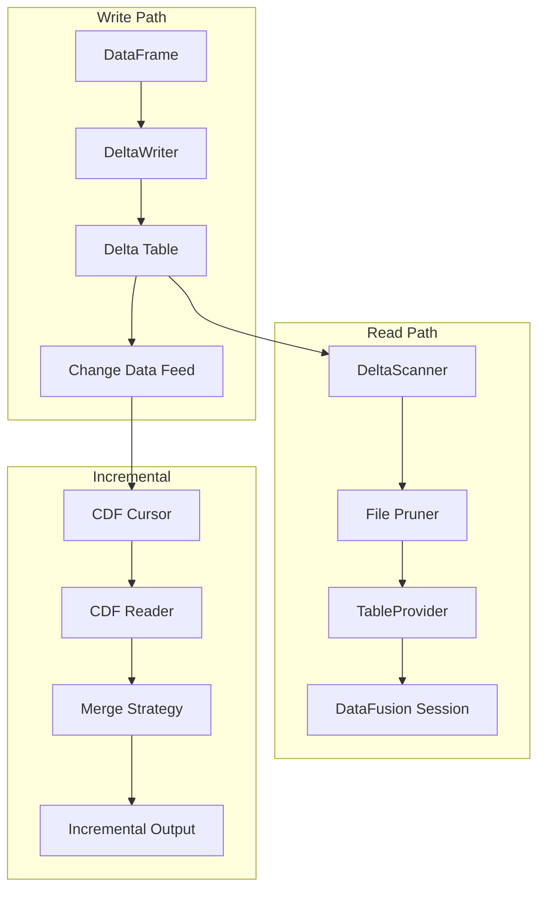
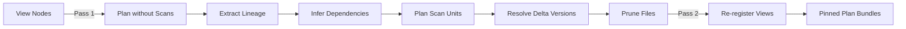
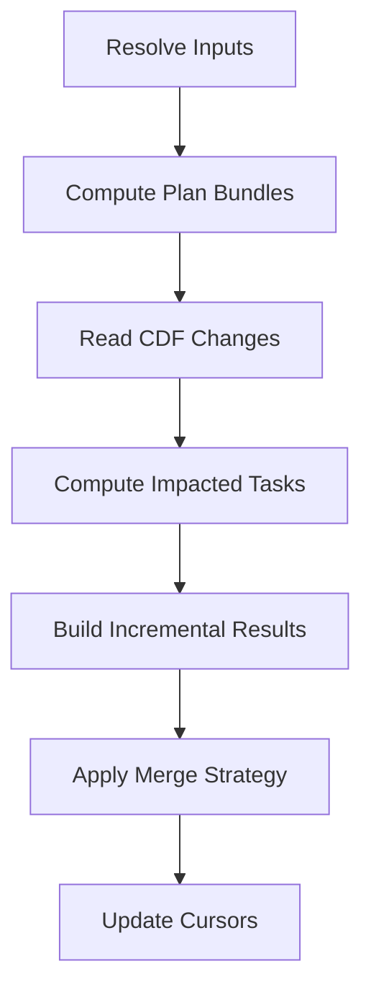
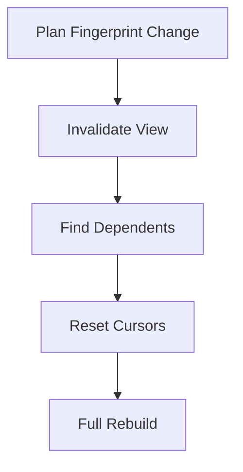

# Storage & Incremental Processing

## Purpose

The storage subsystem provides Delta Lake integration for versioned table storage with Change Data Feed (CDF) support. Combined with the incremental processing protocol, it enables efficient re-processing of only changed data across pipeline runs.

## Key Concepts

- **Delta Lake Native** - Rust-based Delta operations via `deltalake-rs` with Python bindings
- **Two-Pass Scan Planning** - Separates lineage extraction from version pinning
- **File Pruning** - Partition and statistics-based file selection
- **CDF-Based Incrementality** - Track changes via Delta Lake Change Data Feed
- **Cursor-Based Tracking** - Per-dataset version checkpoints avoid reprocessing history
- **Explicit Merge Strategies** - UPSERT, REPLACE, APPEND, DELETE_INSERT

---

## Architecture Overview



---

## Delta Lake Integration

### Module Structure

```
src/storage/deltalake/
├── delta.py               # Core read/write operations
├── protocol.py            # Version pinning and protocol handling
├── control_plane.py       # Scan configuration and providers
├── file_pruning.py        # Partition and stats-based pruning
├── store_policy.py        # Storage configuration policies
└── __init__.py            # Public API exports
```

### Core Operations

**Reading Delta Tables:**

```python
from storage.deltalake import load_delta_table, delta_scan_to_df

# Load with version pinning
table = load_delta_table(
    table_uri="path/to/delta_table",
    version=42,  # Optional: specific version
)

# Scan to DataFrame with pruning
df = delta_scan_to_df(
    ctx=session_context,
    table_uri="path/to/delta_table",
    partition_filters=[("year", "=", "2024")],
)
```

**Writing Delta Tables:**

```python
from storage.deltalake import write_delta_table

write_delta_table(
    table=arrow_table,
    table_uri="path/to/delta_table",
    mode="append",  # or "overwrite"
    partition_cols=["year", "month"],
)
```

### Scan Configuration

The `DeltaScanConfig` controls scan behavior:

| Option | Purpose |
|--------|---------|
| `table_uri` | Table location (local or cloud) |
| `storage_options` | Cloud credentials and settings |
| `version` / `timestamp` | Version pinning |
| `file_column_name` | Add `_file` column for lineage |
| `enable_parquet_pushdown` | Predicate pushdown optimization |
| `schema_ipc` | Schema overrides for stability |
| `files` | Explicit file-set restriction |

### Version Pinning

Two strategies for version resolution:

| Strategy | Use Case |
|----------|----------|
| `version=N` | Exact version number |
| `timestamp="2024-01-01T00:00:00Z"` | Time travel to timestamp |

```python
# Pin to specific version
table = load_delta_table(table_uri, version=42)

# Pin to timestamp
table = load_delta_table(table_uri, timestamp="2024-01-01T00:00:00Z")
```

---

## Two-Pass Scan Planning

The planning pipeline uses two passes to separate concerns:

### Pass 1: Baseline Planning (No Scans)

1. Register UDF platform and view graph
2. Plan view nodes without scan units
3. Extract lineage (dataset references, columns, filters)
4. Infer dependencies from view nodes

### Pass 2: Pinned Planning (With Scans)

1. Plan scan units with Delta version resolution
2. Apply file pruning via `evaluate_and_select_files()`
3. Re-register view graph with pinned scan providers
4. Re-plan with scan units in `PlanBundleOptions`



**Rationale:** This separation ensures:
- Lineage extraction doesn't require resolved scan files
- Plan fingerprints remain stable when only data changes
- File pruning happens after dependency inference

---

## File Pruning

### Pruning Policies

```python
from storage.deltalake.file_pruning import (
    FilePruningPolicy,
    PartitionFilter,
    StatsFilter,
    evaluate_and_select_files,
)

policy = FilePruningPolicy(
    partition_filters=[
        PartitionFilter(column="year", op="=", value="2024"),
        PartitionFilter(column="month", op=">=", value="06"),
    ],
    stats_filters=[
        StatsFilter(column="event_ts", op=">=", value=start_ts),
        StatsFilter(column="event_ts", op="<", value=end_ts),
    ],
)

result = evaluate_and_select_files(
    delta_index=table.file_index(),
    policy=policy,
    ctx=session_context,
)
```

### Pruning Levels

| Level | Method | Speed | Accuracy |
|-------|--------|-------|----------|
| **Partition** | Directory structure | Very fast | Exact |
| **Stats** | Min/max column stats | Fast | Conservative |
| **Row-group** | Parquet metadata | Medium | Precise |

### Integration with Scans

File pruning results flow into scan configuration:

```python
scan_config = DeltaScanConfig(
    table_uri=table_uri,
    files=pruning_result.selected_files,  # Restricted file set
    enable_parquet_pushdown=True,
)
```

---

## Incremental Processing Protocol

The incremental protocol enables efficient re-processing of only changed data.

### Goals

1. Track **what changed** using Delta Lake Change Data Feed (CDF)
2. Avoid reprocessing history with **cursor-based version tracking**
3. Merge incremental outputs using **explicit merge strategies**
4. Treat incremental behavior as first-class in the semantic pipeline

### Module Structure

```
src/semantics/incremental/
├── cdf_cursors.py         # CdfCursor and CdfCursorStore
├── cdf_reader.py          # read_cdf_changes with cursor updates
├── cdf_types.py           # CdfChangeType and CdfFilterPolicy
├── cdf_joins.py           # CDFJoinSpec, CDFMergeStrategy
├── delta_updates.py       # Partitioned/overwrite writes
├── runtime.py             # IncrementalRuntime, TempTableRegistry
├── state_store.py         # State directory layout
├── plan_fingerprints.py   # Plan fingerprint snapshots
├── invalidations.py       # Invalidation detection logic
└── config.py              # IncrementalConfig
```

### Core Workflow



1. **Resolve inputs** - Compute plan bundles for semantic tasks
2. **Read CDF** - Get changed rows via `read_cdf_changes`
3. **Compute impacted tasks** - From evidence and plan fingerprints
4. **Build incremental results** - Using semantic join builders
5. **Merge outputs** - With configured merge strategy
6. **Update cursors** - On successful CDF reads

---

## CDF Cursor Tracking

### Cursor Model

```python
@dataclass(frozen=True)
class CdfCursor:
    dataset_name: str
    last_version: int
    timestamp: datetime
    run_id: str
```

### Cursor Store

```python
from semantics.incremental import CdfCursorStore

store = CdfCursorStore(state_dir=Path("/state"))

# Get cursor for dataset
cursor = store.get("my_dataset")

# Update after successful read
store.update("my_dataset", CdfCursor(
    dataset_name="my_dataset",
    last_version=45,
    timestamp=datetime.now(),
    run_id=run_id,
))
```

### CDF Reader

```python
from semantics.incremental import read_cdf_changes, CdfFilterPolicy

changes_df = read_cdf_changes(
    ctx=session_context,
    table_uri="path/to/delta_table",
    cursor=cursor,
    filter_policy=CdfFilterPolicy.INSERTS_AND_UPDATES,
)
```

**Filter Policies:**

| Policy | Includes |
|--------|----------|
| `ALL_CHANGES` | Inserts, updates, deletes |
| `INSERTS_AND_UPDATES` | Inserts and updates only |
| `INSERTS_ONLY` | New rows only |
| `UPDATES_ONLY` | Modified rows only |
| `DELETES_ONLY` | Deleted rows only |

---

## Merge Strategies

### Strategy Types

| Strategy | Behavior | Use Case |
|----------|----------|----------|
| `UPSERT` | Merge by key columns | Most incremental updates |
| `REPLACE` | Delete partitions, then append | Partition-level rebuilds |
| `APPEND` | Add rows without deletes | Append-only datasets |
| `DELETE_INSERT` | Delete by keys, then insert | Complex key updates |

### Strategy Selection

```python
from semantics.incremental import CDFMergeStrategy

# Configure per-dataset
merge_config = {
    "cpg_nodes_v1": CDFMergeStrategy.UPSERT,
    "cpg_edges_v1": CDFMergeStrategy.UPSERT,
    "extract_errors_v1": CDFMergeStrategy.APPEND,
}
```

### Merge Execution

```python
from semantics.incremental import apply_merge_strategy

result = apply_merge_strategy(
    ctx=session_context,
    incremental_df=changes_df,
    target_uri="path/to/target_table",
    strategy=CDFMergeStrategy.UPSERT,
    key_columns=["node_id"],
)
```

---

## Incremental Configuration

### IncrementalConfig

```python
from semantics.incremental import IncrementalConfig

config = IncrementalConfig(
    enabled=True,
    state_dir=Path("/state"),
    cdf_filter_policy=CdfFilterPolicy.INSERTS_AND_UPDATES,
    default_merge_strategy=CDFMergeStrategy.UPSERT,
    impact_strategy="hybrid",
)
```

| Field | Purpose |
|-------|---------|
| `enabled` | Enable/disable incremental mode |
| `state_dir` | Cursor and state storage root |
| `cdf_filter_policy` | Default change-type selection |
| `default_merge_strategy` | Default merge strategy |
| `impact_strategy` | Closure strategy for impacted files |

### Impact Strategies

| Strategy | Behavior |
|----------|----------|
| `direct` | Only directly changed files |
| `transitive` | Include dependent files |
| `hybrid` | Smart selection based on change type |

---

## State Directory Layout

```
<state_dir>/
├── cursors/              # Per-dataset version checkpoints
│   ├── cpg_nodes_v1.json
│   ├── cpg_edges_v1.json
│   └── ...
├── delta/                # Delta table staging area
├── snapshots/            # State snapshots for recovery
└── plan_fingerprints/    # Plan hash tracking
    ├── current.json
    └── history/
```

### State Store Operations

```python
from semantics.incremental import StateStore

store = StateStore(state_dir=Path("/state"))

# Get dataset state
state = store.get_dataset_state("cpg_nodes_v1")

# Save snapshot
store.save_snapshot(run_id=run_id)

# Restore from snapshot
store.restore_snapshot(snapshot_id="abc123")
```

---

## Plan Fingerprint Invalidation

### Fingerprint Tracking

Plan fingerprints detect when query logic changes:

```python
from semantics.incremental import PlanFingerprintStore

fingerprint_store = PlanFingerprintStore(state_dir=Path("/state"))

# Check if plan changed
current_fp = compute_plan_fingerprint(plan_bundle)
previous_fp = fingerprint_store.get("my_view")

if current_fp != previous_fp:
    # Plan changed - full rebuild required
    invalidate_downstream_cursors(store, "my_view")
```

### Invalidation Cascade

When a plan fingerprint changes:

1. Mark the view as invalidated
2. Identify downstream dependent views
3. Reset cursors for affected datasets
4. Trigger full rebuild on next run



---

## Storage Options

### Local Storage

```python
storage_options = {}  # No options needed for local
```

### Cloud Storage (S3)

```python
storage_options = {
    "AWS_ACCESS_KEY_ID": "...",
    "AWS_SECRET_ACCESS_KEY": "...",
    "AWS_REGION": "us-east-1",
}
```

### Cloud Storage (Azure)

```python
storage_options = {
    "AZURE_STORAGE_ACCOUNT_NAME": "...",
    "AZURE_STORAGE_ACCOUNT_KEY": "...",
}
```

### Cloud Storage (GCS)

```python
storage_options = {
    "GOOGLE_SERVICE_ACCOUNT": "path/to/service-account.json",
}
```

---

## Performance Characteristics

| Operation | Latency | Notes |
|-----------|---------|-------|
| Delta table load | 50-200ms | Depends on log size |
| Version resolution | 10-50ms | Cached after first load |
| File pruning (partition) | 1-10ms | Very fast |
| File pruning (stats) | 10-100ms | Depends on file count |
| CDF read | 50-500ms | Depends on change volume |
| Cursor update | 5-20ms | Simple JSON write |

### Optimization Tips

1. **Use partitioning** - Enables fast partition pruning
2. **Enable CDF** - Required for incremental processing
3. **Compact regularly** - `OPTIMIZE` to reduce file count
4. **Vacuum old versions** - `VACUUM` to reclaim storage

---

## Invariants

1. **CDF cursors always updated** - After successful reads
2. **Merge keys explicit** - Validated against dataset metadata
3. **Partition columns stable** - Cannot change after table creation
4. **Version pins immutable** - Plan bundles capture exact versions
5. **Fingerprints cascade** - Plan changes invalidate downstream

---

## Cross-References

- **[04_datafusion_integration.md](04_datafusion_integration.md)** - Query engine integration
- **[06_hamilton_orchestration.md](06_hamilton_orchestration.md)** - Pipeline execution
- **[03_semantic_compiler.md](03_semantic_compiler.md)** - Semantic normalization

**Source Files:**
- `src/storage/deltalake/` - Delta Lake integration
- `src/semantics/incremental/` - Incremental processing protocol
- `rust/datafusion_ext/src/delta/` - Rust Delta operations
