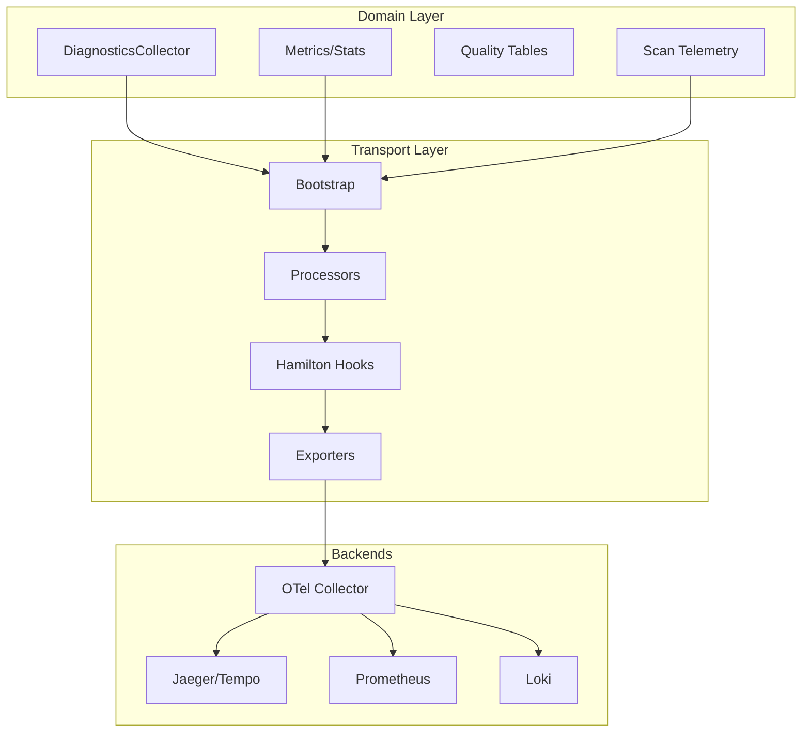

# Observability

## Purpose

The observability layer provides diagnostic collection, metrics computation, quality tracking, and OpenTelemetry integration for CodeAnatomy's inference pipeline. It captures runtime events, computes dataset statistics, tracks data quality issues, and exports telemetry via standardized protocols.

## Key Concepts

- **Two-Layer Architecture** - Domain semantics (`src/obs/`) separate from transport (`src/obs/otel/`)
- **Non-Intrusive Collection** - Callbacks and sinks don't affect pipeline execution
- **Quality-First Tracking** - Invalid entities captured in quality tables, not failures
- **OpenTelemetry Native** - Traces, metrics, and logs via OTel SDK
- **Run Correlation** - `codeanatomy.run_id` propagated across all signals

---

## Architecture Overview



---

## Domain Layer (`src/obs/`)

### DiagnosticsCollector

**File:** `src/obs/diagnostics.py`

Central sink for runtime events and artifacts:

```python
@dataclass
class DiagnosticsCollector:
    events: dict[str, list[Mapping[str, object]]]
    artifacts: dict[str, list[Mapping[str, object]]]
    metrics: list[tuple[str, float, dict[str, str]]]
```

**Recording Methods:**

| Method | Purpose |
|--------|---------|
| `record_events(name, rows)` | Append event rows under logical name |
| `record_event(name, properties)` | Append single event |
| `record_artifact(name, payload)` | Record artifact payload |
| `record_metric(name, value, tags)` | Record metric with tags |

**Specialized Recording Functions:**

```python
# View fingerprints
record_view_fingerprints(sink, view_nodes=nodes)

# UDF parity diagnostics
record_view_udf_parity(sink, snapshot=snapshot, view_nodes=nodes)

# Rust UDF snapshot
record_rust_udf_snapshot(sink, snapshot=snapshot)

# Schema violations
record_view_contract_violations(sink, table_name=name, violations=violations)

# Cache lineage
record_cache_lineage(sink, payload=payload, rows=rows)
```

### Dataset Statistics

**File:** `src/obs/metrics.py`

Computes dataset-level and column-level statistics:

```python
# Dataset-level stats
DATASET_STATS_SCHEMA = pa.schema([
    ("dataset_name", pa.string()),
    ("rows", pa.int64()),
    ("columns", pa.int32()),
    ("schema_identity_hash", pa.string()),
])

# Column-level stats
COLUMN_STATS_SCHEMA = pa.schema([
    ("dataset_name", pa.string()),
    ("column_name", pa.string()),
    ("type", pa.string()),
    ("null_count", pa.int64()),
])
```

**Statistics Functions:**

| Function | Returns |
|----------|---------|
| `dataset_stats_table(tables)` | Dataset-level stats table |
| `column_stats_table(tables)` | Column-level stats table |
| `table_summary(table)` | Compact summary for manifest |

### Quality Tables

Track invalid entities without pipeline failures:

```python
QUALITY_SCHEMA = pa.schema([
    pa.field("entity_kind", pa.string(), nullable=False),
    pa.field("entity_id", pa.string()),
    pa.field("issue", pa.string(), nullable=False),
    pa.field("source_table", pa.string()),
])
```

**Quality Detection:**

```python
from obs.metrics import quality_from_ids, concat_quality_tables

# Generate quality rows
quality_rows = quality_from_ids(
    table,
    id_col="node_id",
    entity_kind="NODE",
    issue="INVALID_ID",
    source_table="cpg_nodes",
)

# Combine quality tables
combined = concat_quality_tables([quality_table_1, quality_table_2])
```

**Quality Tables Emitted:**
- `cpg_nodes_quality` - Invalid node identifiers
- `cpg_props_quality` - Invalid property values

### Scan Telemetry

**File:** `src/obs/scan_telemetry.py`

Fragment-level metrics for performance analysis:

```python
class ScanTelemetry:
    fragment_count: int
    row_group_count: int
    count_rows: int | None
    estimated_rows: int | None
    file_hints: tuple[str, ...]
    fragment_paths: tuple[str, ...]
    partition_expressions: tuple[str, ...]
    required_columns: tuple[str, ...]
    scan_columns: tuple[str, ...]
```

**Telemetry Collection:**

```python
from obs.scan_telemetry import fragment_telemetry, ScanTelemetryOptions

telemetry = fragment_telemetry(
    dataset,
    predicate=filter_expr,
    options=ScanTelemetryOptions(
        hint_limit=10,
        required_columns=["id", "name"],
    ),
)
```

### Run Tracking

**File:** `src/obs/datafusion_runs.py`

Correlation IDs and lifecycle management:

```python
@dataclass
class DataFusionRun:
    run_id: str
    label: str
    start_time_unix_ms: int
    end_time_unix_ms: int | None = None
    status: str = "running"
    metadata: dict[str, object]
```

**Context Manager:**

```python
from obs.datafusion_runs import tracked_run

with tracked_run(label="query_execution", sink=diagnostics) as run:
    df = ctx.sql("SELECT * FROM table")
    result = df.to_arrow_table()
```

---

## Transport Layer (`src/obs/otel/`)

### Module Structure

```
src/obs/otel/
├── bootstrap.py          # Provider configuration
├── config.py             # Environment-based config
├── metrics.py            # Metric instruments
├── tracing.py            # Span helpers
├── logs.py               # Structured logging
├── hamilton.py           # Hamilton lifecycle hooks
├── processors.py         # Custom processors
├── resources.py          # Resource construction
├── resource_detectors.py # Detector integration
├── run_context.py        # Run-scoped context
├── scopes.py             # Instrumentation scopes
├── constants.py          # Canonical names
├── sampling.py           # Sampling rules
└── attributes.py         # Attribute normalization
```

### Bootstrap

**File:** `src/obs/otel/bootstrap.py`

Initialize OTel providers:

```python
from obs.otel.bootstrap import configure_otel, OtelBootstrapOptions

providers = configure_otel(
    service_name="codeanatomy",
    options=OtelBootstrapOptions(
        enable_metrics=True,
        enable_logs=True,
    ),
)
```

**Responsibilities:**
- Build Resource with service identity
- Configure TracerProvider, MeterProvider, LoggerProvider
- Add custom processors (RunIdSpanProcessor, RunIdLogRecordProcessor)
- Export via OTLP to OTel Collector

### Resource Identity

Resource attributes are process-level:

| Attribute | Source |
|-----------|--------|
| `service.name` | `OTEL_SERVICE_NAME` or `codeanatomy` |
| `service.version` | `CODEANATOMY_SERVICE_VERSION` or package |
| `service.namespace` | `CODEANATOMY_SERVICE_NAMESPACE` |
| `service.instance.id` | `OTEL_SERVICE_INSTANCE_ID` or random |
| `deployment.environment.name` | `CODEANATOMY_ENVIRONMENT` |

### Custom Processors

**File:** `src/obs/otel/processors.py`

Inject run context into all signals:

| Processor | Purpose |
|-----------|---------|
| `RunIdSpanProcessor` | Attaches `codeanatomy.run_id` to spans |
| `RunIdLogRecordProcessor` | Attaches `codeanatomy.run_id` to logs |

### Trace Topology

**Root Span:**
- Name: `graph_product.build`
- Scope: `codeanatomy.pipeline`
- Attributes: product, execution mode, outputs, run_id

**Hamilton Spans (via `OtelNodeHook` and `OtelPlanHook`):**
- Graph span: `hamilton.graph`
- Node spans: `hamilton.task`, `hamilton.stage`, `hamilton.node`
- Attributes: `run_id`, `node_name`, `task_id`, Hamilton tags

**DataFusion Spans:**
- `datafusion.plan.compile`
- `datafusion.execute`
- `datafusion.write`

### Metrics Catalog

**Histograms (seconds):**
- `codeanatomy.stage.duration`
- `codeanatomy.task.duration`
- `codeanatomy.datafusion.execute.duration`
- `codeanatomy.datafusion.write.duration`

**Counters:**
- `codeanatomy.artifact.count`
- `codeanatomy.error.count`

**Gauges:**
- `codeanatomy.dataset.rows`
- `codeanatomy.dataset.columns`
- `codeanatomy.scan.row_groups`
- `codeanatomy.scan.fragments`

### Instrumentation Scopes

**File:** `src/obs/otel/scopes.py`

| Scope | Layer |
|-------|-------|
| `codeanatomy.pipeline` | Root pipeline |
| `codeanatomy.extract` | Extraction |
| `codeanatomy.normalize` | Normalization |
| `codeanatomy.planning` | Planning |
| `codeanatomy.scheduling` | Scheduling |
| `codeanatomy.datafusion` | DataFusion |
| `codeanatomy.hamilton` | Hamilton |
| `codeanatomy.cpg` | CPG construction |
| `codeanatomy.obs` | Observability |

---

## Diagnostics Policy

### Safety Controls

**Attribute Limits:**
- `OTEL_ATTRIBUTE_COUNT_LIMIT`
- `OTEL_ATTRIBUTE_VALUE_LENGTH_LIMIT`
- `OTEL_LOGRECORD_ATTRIBUTE_COUNT_LIMIT`

**Payload Caps:**
- `CODEANATOMY_OTEL_MAX_LIST_LENGTH` (default: 50)
- `CODEANATOMY_OTEL_MAX_DICT_LENGTH` (default: 50)

**Redaction:**
- `CODEANATOMY_OTEL_REDACT_KEYS` includes `authorization`, `cookie`, `password`, `secret`, `token`, `api_key`

### Severity Taxonomy

| Severity | Meaning |
|----------|---------|
| `info` | Expected/healthy telemetry |
| `warn` | Degraded behavior or fallbacks |
| `error` | Correctness risk requiring action |

### Event Requirements

All diagnostics events must include:
- `diagnostic.severity`: `info` | `warn` | `error`
- `diagnostic.category`: stable category string

---

## Configuration Reference

### Service Identity

| Variable | Default | Description |
|----------|---------|-------------|
| `OTEL_SERVICE_NAME` | `codeanatomy` | Service name |
| `CODEANATOMY_SERVICE_VERSION` | package version | Service version |
| `CODEANATOMY_SERVICE_NAMESPACE` | - | Service namespace |
| `OTEL_SERVICE_INSTANCE_ID` | random token | Instance ID |
| `CODEANATOMY_ENVIRONMENT` | - | Deployment environment |

### OTel SDK

| Variable | Default | Description |
|----------|---------|-------------|
| `OTEL_SDK_DISABLED` | `false` | Disable OTel |
| `OTEL_TRACES_SAMPLER` | `parentbased_traceidratio` | Sampler name |
| `OTEL_TRACES_SAMPLER_ARG` | `0.1` | Sampler ratio |
| `OTEL_EXPORTER_OTLP_ENDPOINT` | - | OTLP endpoint |
| `OTEL_EXPORTER_OTLP_PROTOCOL` | `grpc` | Protocol |

### Batch Processing

| Variable | Default | Description |
|----------|---------|-------------|
| `OTEL_BSP_SCHEDULE_DELAY` | `5000` | Schedule delay (ms) |
| `OTEL_BSP_MAX_QUEUE_SIZE` | `2048` | Max queue size |
| `OTEL_BSP_MAX_EXPORT_BATCH_SIZE` | `512` | Max batch size |
| `OTEL_METRIC_EXPORT_INTERVAL` | `60000` | Metric export interval (ms) |

### Logs

| Variable | Default | Description |
|----------|---------|-------------|
| `OTEL_PYTHON_LOG_CORRELATION` | `true` | Enable log correlation |
| `OTEL_LOG_LEVEL` | `INFO` | OTel SDK log level |

### Hamilton Telemetry

| Variable | Default | Description |
|----------|---------|-------------|
| `CODEANATOMY_HAMILTON_TELEMETRY_PROFILE` | `prod` | Profile (dev, ci, prod) |
| `CODEANATOMY_HAMILTON_TRACKER_ENABLED` | `false` | Enable Hamilton UI tracker |
| `CODEANATOMY_HAMILTON_CAPTURE_DATA_STATISTICS` | `false` | Capture data statistics |

---

## Operational Profiles

### Development

```bash
export OTEL_TRACES_SAMPLER=always_on
export OTEL_METRIC_EXPORT_INTERVAL=10000
export OTEL_BSP_SCHEDULE_DELAY=1000
export CODEANATOMY_OTEL_SYSTEM_METRICS=true
```

### CI/Testing

```bash
export CODEANATOMY_OTEL_TEST_MODE=true
export OTEL_SDK_DISABLED=false
```

### Production

```bash
export OTEL_TRACES_SAMPLER=parentbased_traceidratio
export OTEL_TRACES_SAMPLER_ARG=0.01
export OTEL_METRIC_EXPORT_INTERVAL=60000
export OTEL_BSP_MAX_QUEUE_SIZE=4096
export OTEL_EXPORTER_OTLP_PROTOCOL=grpc
```

---

## Collector Configuration

Reference collector pipeline for cache telemetry:

```yaml
processors:
  attributes:
    actions:
      - key: cache.path
        action: delete
  redaction:
    blocked_values: ["/home/", "s3://"]
  tail_sampling:
    policies:
      - name: cache-errors
        type: status_code
        status_code: {status_codes: [ERROR]}

connectors:
  spanmetrics: {}

service:
  pipelines:
    traces:
      receivers: [otlp]
      processors: [attributes, redaction, tail_sampling]
      exporters: [spanmetrics, otlp]
    metrics:
      receivers: [spanmetrics]
      exporters: [otlp]
```

---

## Integration Patterns

### Hamilton Pipeline

```python
from obs.diagnostics import DiagnosticsCollector
from hamilton_pipeline.driver_factory import build_driver

diagnostics = DiagnosticsCollector()
driver = build_driver(config=config, diagnostics=diagnostics)

# After execution
events = diagnostics.events_snapshot()
artifacts = diagnostics.artifacts_snapshot()
```

### DataFusion Session

```python
from obs.diagnostics import DiagnosticsCollector, record_view_fingerprints
from datafusion_engine.views.graph import build_view_graph

diagnostics = DiagnosticsCollector()
view_nodes = build_view_graph(ctx, profile)
record_view_fingerprints(diagnostics, view_nodes=view_nodes)
```

### Quality Table Generation

```python
from obs.metrics import quality_from_ids, concat_quality_tables

quality_tables = [
    quality_from_ids(
        nodes_table,
        id_col="node_id",
        entity_kind="NODE",
        issue="INVALID_ID",
        source_table="cpg_nodes",
    ),
]
combined_quality = concat_quality_tables(quality_tables)
```

---

## Concurrency and Fork Safety

- OTel initialized inside worker processes for fork safety
- Root span context stored in ContextVar and fallback dict
- Threaded execution propagates context explicitly

---

## File Reference

### Domain Layer

| File | Purpose |
|------|---------|
| `src/obs/diagnostics.py` | DiagnosticsCollector and event recording |
| `src/obs/metrics.py` | Dataset/column stats, quality tables |
| `src/obs/scan_telemetry.py` | Fragment-level telemetry |
| `src/obs/datafusion_runs.py` | Run envelope tracking |

### Transport Layer

| File | Purpose |
|------|---------|
| `src/obs/otel/bootstrap.py` | Provider configuration |
| `src/obs/otel/config.py` | Configuration resolution |
| `src/obs/otel/metrics.py` | Metric instruments |
| `src/obs/otel/tracing.py` | Span helpers |
| `src/obs/otel/logs.py` | Structured logging |
| `src/obs/otel/hamilton.py` | Hamilton lifecycle hooks |
| `src/obs/otel/processors.py` | Custom processors |
| `src/obs/otel/scopes.py` | Instrumentation scopes |

---

## Cross-References

- **[06_hamilton_orchestration.md](06_hamilton_orchestration.md)** - Pipeline execution
- **[04_datafusion_integration.md](04_datafusion_integration.md)** - Query engine
- **[09_configuration.md](09_configuration.md)** - Configuration reference

**Source Files:**
- `src/obs/` - Domain observability layer
- `src/obs/otel/` - OpenTelemetry transport layer
