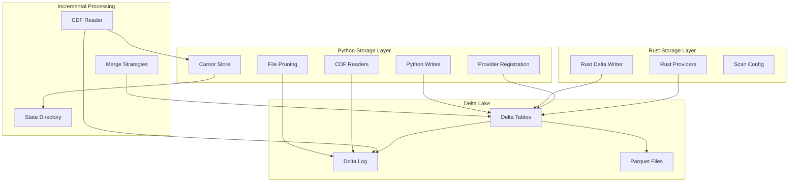
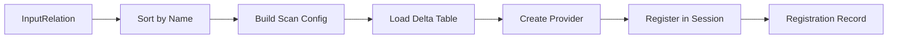
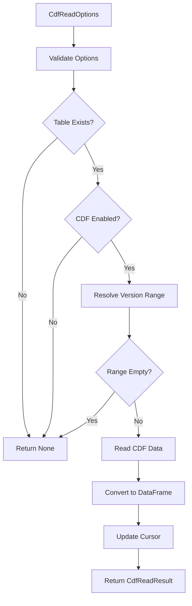

# Storage Layer Architecture

## Overview

The storage layer provides unified Delta Lake persistence for both Python extraction writes and Rust CPG materialization. Delta Lake serves as the canonical storage format throughout the pipeline, ensuring ACID guarantees, time-travel capabilities, and efficient incremental processing.

The layer spans two primary domains:

1. **Python Storage Operations** - Extraction writes, table registration, file pruning, and incremental CDF reads
2. **Rust Delta Operations** - CPG output materialization, table provider registration, and commit coordination

Both domains share storage options, locking providers, and retry policies to ensure consistent mutation safety across the boundary.

## Architecture Overview



## Python Storage Layer

### Core Operations Module

**Location:** `src/storage/deltalake/delta.py`

The core operations module provides read/write helpers for Delta tables with mutation safety, retry logic, and observability integration.

#### Snapshot Identity

Every Delta table version is uniquely identified by a `SnapshotKey`:

```python
@dataclass(frozen=True)
class SnapshotKey:
    canonical_uri: str  # Normalized table URI
    version: int        # Delta version number
```

URI canonicalization normalizes schemes (`s3a`/`s3n` → `s3`), lowercases netlocs for cloud URIs, and resolves local paths to absolute form.

#### Mutation Safety

Delta mutations enforce locking provider requirements for S3-backed tables:

- **Locking Provider Enforcement** - S3 URIs require a locking provider (`aws_s3_locking_provider`, `s3_locking_provider`, or `locking_provider` in storage options)
- **Append-Only Mode** - When enabled, rejects DELETE operations and UPDATE predicates
- **Commit Metadata Normalization** - Reserved Delta keys are prefixed with `codeanatomy_` to avoid conflicts

#### Retry Classification

The retry policy classifies exceptions into three categories:

| Classification | Examples | Behavior |
|----------------|----------|----------|
| `retryable` | `ConcurrentAppendException`, `ConcurrentTransactionException` | Retry with exponential backoff |
| `fatal` | `MetadataChangedException`, `ProtocolChangedException` | Fail immediately |
| `unknown` | Unrecognized exceptions | Fail after max attempts |

Retry delays follow exponential backoff: `delay = min(base_delay * 2^attempt, max_delay)`.

### File Pruning

**Location:** `src/storage/deltalake/file_pruning.py`

File pruning reduces scan I/O by filtering Delta add actions based on partition values and statistics metadata.

#### Pruning Policies

```python
@dataclass(frozen=True)
class FilePruningPolicy:
    partition_filters: list[PartitionFilter]  # Partition-value filters
    stats_filters: list[StatsFilter]          # Min/max statistics filters
```

**Partition Filters:**
- Operations: `=`, `!=`, `in`, `not in`
- Applied to partition values (exact string matches)

**Statistics Filters:**
- Operations: `=`, `!=`, `>`, `>=`, `<`, `<=`
- Applied to `stats_min`/`stats_max` metadata from Parquet files
- Optional type casting for numeric comparisons

#### Evaluation Modes

The pruning layer supports two evaluation modes:

1. **DataFusion Evaluation** - Converts filters to DataFusion predicates and evaluates via Arrow Acero
2. **Python Evaluation** - Lightweight Python-based filtering for simple policies

**File Index Schema:**

```
path: string
size_bytes: int64
modification_time: int64
partition_values: map<string, string>
stats_min: map<string, string>
stats_max: map<string, string>
num_records: int64
```

#### Pruning Result

```python
@dataclass(frozen=True)
class FilePruningResult:
    candidate_count: int          # Files passing filters
    total_files: int              # Total files before pruning
    pruned_count: int             # Files excluded
    candidate_paths: list[str]    # Paths to scan
```

### Dataset Sources and Providers

**Location:** `src/storage/dataset_sources.py`

Dataset normalization converts diverse input sources into PyArrow `Dataset` or `OneShotDataset` wrappers.

#### OneShotDataset

Enforces single-scan semantics for streaming sources:

```python
@dataclass
class OneShotDataset:
    dataset: ds.Dataset | None
    reader: pa.RecordBatchReader | None = None
    _scanned: bool = False  # Enforces single-use
```

Raises `ValueError` if scanned multiple times, preventing double-consumption of record batch readers.

#### Dataset Source Options

```python
@dataclass(frozen=True)
class DatasetSourceOptions:
    dataset_format: str = "delta"
    filesystem: object | None = None
    files: tuple[str, ...] | None = None
    partitioning: str | ds.Partitioning | None = "hive"
    storage_options: Mapping[str, str] | None = None
    delta_version: int | None = None
    delta_timestamp: str | None = None
```

For Delta datasets, source normalization rejects direct PyArrow Dataset construction and requires registration via DataFusion `TableProvider` for consistent version pinning and scan configuration.

### Storage Policies

**Location:** `src/storage/deltalake/config.py`

Delta write behavior is controlled by three policy contracts:

#### DeltaWritePolicy

Controls file sizing, partitioning, statistics collection, and feature enablement:

```python
class DeltaWritePolicy(StructBaseStrict, frozen=True):
    target_file_size: int | None = 96 * 1024 * 1024  # 96 MB
    partition_by: tuple[ColumnName, ...] = ()
    zorder_by: tuple[ColumnName, ...] = ()
    stats_policy: Literal["off", "explicit", "auto"] = "auto"
    stats_columns: tuple[ColumnName, ...] | None = None
    stats_max_columns: int = 32
    enable_features: tuple[...] = ()  # CDF, deletion vectors, etc.
```

**Stats Policy Resolution:**
- `off` - No statistics collection
- `explicit` - Collect stats only for `stats_columns`
- `auto` - Collect stats for partition/zorder columns (capped at `stats_max_columns`)

#### DeltaMutationPolicy

Enforces mutation safety and retry behavior:

```python
class DeltaMutationPolicy(StructBaseStrict, frozen=True):
    retry_policy: DeltaRetryPolicy
    require_locking_provider: bool = True
    locking_option_keys: tuple[str, ...] = (...)
    append_only: bool = False
```

#### DeltaSchemaPolicy

Controls schema evolution and column mapping:

```python
class DeltaSchemaPolicy(StructBaseStrict, frozen=True):
    schema_mode: Literal["merge", "overwrite"] | None = None
    column_mapping_mode: Literal["id", "name"] | None = None
```

## Rust Delta Operations

### Delta Writer

**Location:** `rust/codeanatomy_engine/src/executor/delta_writer.rs`

The Rust Delta writer materializes CPG outputs with schema validation, commit properties, and write outcome tracking.

#### Schema Mapping

Arrow-to-Delta schema conversion handles:

- **Primitive types** - String, integers, floats, boolean, binary, date, timestamp
- **Decimal types** - Maps `Decimal128`/`Decimal256` with precision/scale validation
- **Nested types** - Struct, List, Map with recursive traversal
- **View types** - String/Binary view types map to standard Delta primitives

#### Output Table Lifecycle

```rust
pub async fn ensure_output_table(
    ctx: &SessionContext,
    table_name: &str,
    delta_location: &str,
    expected_schema: &SchemaRef,
) -> Result<()>
```

**Lifecycle:**
1. Resolve table URI and load Delta table
2. If table does not exist, create with mapped schema
3. Register Delta provider in DataFusion session
4. Validate actual schema matches expected schema

#### Commit Properties

Commit metadata includes user-supplied properties plus provenance hashes:

```rust
pub struct LineageContext {
    pub spec_hash: [u8; 32],
    pub envelope_hash: [u8; 32],
    pub planning_surface_hash: [u8; 32],
    pub provider_identity_hash: [u8; 32],
    pub rulepack_fingerprint: [u8; 32],
    pub runtime_lineage_tags: BTreeMap<String, String>,
}
```

Commit properties namespace CodeAnatomy keys with `codeanatomy.` prefix to separate from user metadata.

#### Write Outcome

Post-write metadata capture is best-effort and non-blocking:

```rust
pub struct WriteOutcome {
    pub delta_version: Option<i64>,
    pub files_added: Option<u64>,
    pub bytes_written: Option<u64>,
}
```

If metadata capture fails at any stage, returns `None` fields without blocking the pipeline.

### Table Provider Registration

**Location:** `rust/codeanatomy_engine/src/providers/registration.rs`

All extraction inputs are registered as native Delta providers using `datafusion_ext::delta_control_plane`.

#### Registration Flow



#### Registration Record

```rust
pub struct TableRegistration {
    pub name: String,
    pub delta_version: i64,
    pub schema_hash: [u8; 32],
    pub provider_identity: [u8; 32],
    pub capabilities: ProviderCapabilities,
    pub compatibility: DeltaCompatibilityFacts,
}
```

**Provider Identity Key** - Blake3 hash of:
- Logical name
- Delta location
- Delta version
- Scan configuration (pushdown flags, file column, partition wrapping)

**Compatibility Facts:**
- Min reader/writer versions
- Reader/writer features
- Column mapping mode
- Partition columns

#### Deterministic Registration Order

Inputs are sorted by `logical_name` before registration to ensure deterministic provider identity hashes across runs.

### Scan Configuration

**Location:** `rust/codeanatomy_engine/src/providers/scan_config.rs`

Scan configuration controls pushdown behavior and lineage tracking.

#### Standard Scan Config

```rust
pub fn standard_scan_config(requires_lineage: bool) -> DeltaScanConfig {
    let mut config = DeltaScanConfig::default();
    if requires_lineage {
        config.file_column_name = Some("__source_file".to_string());
    }
    config
}
```

**Default Settings:**
- `enable_parquet_pushdown: true` - Predicate/projection pushdown enabled
- `wrap_partition_values: true` - Partition columns use Dict(Int32, String)
- `schema_force_view_types: false` - No view type forcing
- `file_column_name: None` - No lineage tracking (unless requested)

#### Validation Rules

Scan config validation enforces:

1. **Parquet pushdown must remain enabled** - Required for file pruning
2. **Partition values must remain wrapped** - Ensures deterministic typing
3. **Lineage column names must be non-empty** and match `[A-Za-z0-9_]`

#### Provider Capabilities

```rust
pub struct ProviderCapabilities {
    pub predicate_pushdown: bool,    // From enable_parquet_pushdown
    pub projection_pushdown: bool,   // Always true for Delta
    pub partition_pruning: bool,     // From wrap_partition_values
}
```

Capabilities are inferred from scan config and recorded in the registration record for execution planning.

## Incremental Processing

### CDF Cursors

**Location:** `src/semantics/incremental/cdf_cursors.py`

CDF cursors track the last processed Delta version for incremental semantic pipeline reads.

#### Cursor Contract

```python
class CdfCursor(msgspec.Struct, frozen=False):
    dataset_name: str
    last_version: int  # Non-negative
    last_timestamp: str | None = None  # ISO 8601
```

Cursors are immutable (attempts to mutate raise `FrozenInstanceError`) and forward-compatible (unknown fields allowed).

#### Cursor Store

```python
class CdfCursorStore(StructBaseStrict, frozen=True):
    cursors_path: Path
```

**Operations:**
- `save_cursor(cursor)` - Serialize to JSON and write to `{dataset_name}.cursor.json`
- `load_cursor(dataset_name)` - Deserialize from file (returns `None` if missing)
- `update_version(dataset_name, version)` - Create cursor with timestamp and save
- `get_start_version(dataset_name)` - Return `last_version + 1` for next read

Cursors are stored as individual JSON files in the cursor directory, enabling independent dataset tracking.

### CDF Reader

**Location:** `src/semantics/incremental/cdf_reader.py`

CDF reader provides cursor-based incremental reads with automatic version resolution.

#### Read Options

```python
@dataclass(frozen=True)
class CdfReadOptions:
    start_version: int | None = None
    end_version: int | None = None
    cursor_store: CdfCursorStore | None = None
    dataset_name: str | None = None
    columns: list[str] | None = None
    predicate: str | None = None
```

**Version Resolution Priority:**
1. Explicit `start_version` if provided
2. Cursor's `last_version + 1` if cursor exists
3. Default to version 0 (full history)

#### Read Result

```python
@dataclass(frozen=True)
class CdfReadResult:
    df: DataFrame              # CDF changes as DataFrame
    start_version: int         # Inclusive start version
    end_version: int           # Inclusive end version
    has_changes: bool          # True if DataFrame non-empty
```

**Automatic Cursor Update:**
If `cursor_store` and `dataset_name` are provided, the cursor is updated to `end_version` after successful read.

#### CDF Read Flow



### CDF Joins and Merge Strategies

**Location:** `src/semantics/incremental/cdf_joins.py`

CDF merge strategies control how incremental results are merged with existing data:

```python
class CDFMergeStrategy(Enum):
    UPSERT = "upsert"      # Merge with primary key deduplication
    APPEND = "append"      # Append without deduplication
    REPLACE = "replace"    # Replace entire dataset
```

**Typical Usage:**
- **Relationship tables** - `UPSERT` with primary key columns
- **Event streams** - `APPEND` for monotonically increasing logs
- **Full refresh** - `REPLACE` when incremental read fails

### State Directory Layout

**Location:** Controlled by `SemanticIncrementalConfig.state_dir`

```
state_dir/
├── cursors/
│   ├── extract_nodes_v1.cursor.json
│   ├── extract_edges_v1.cursor.json
│   └── ...
├── snapshots/
│   └── (reserved for future checkpoint storage)
└── plan_fingerprints/
    └── (reserved for plan change tracking)
```

Cursor files are named after their dataset: `{dataset_name}.cursor.json`.

### Incremental Configuration

**Location:** `src/semantics/incremental/config.py`

```python
@dataclass(frozen=True)
class SemanticIncrementalConfig:
    enabled: bool = False
    state_dir: Path | None = None
    cdf_filter_policy: CdfFilterPolicy = inserts_and_updates_only
    default_merge_strategy: CDFMergeStrategy = UPSERT
    impact_strategy: Literal["hybrid", "symbol_closure", "import_closure"] = "hybrid"
```

**CDF Filter Policy** - Controls which CDF change types to process:
- `include_all` - Process insert, update, delete
- `inserts_and_updates_only` - Exclude deletes (default)
- `inserts_only` - Only new rows

**Impact Strategy:**
- `hybrid` - Symbol closure + import closure (default)
- `symbol_closure` - Only symbols referenced in changed files
- `import_closure` - Only files imported by changed files

## Storage Options

### Storage Options Merging

**Location:** `src/utils/storage_options.py`

Storage options are merged from multiple sources with priority order:

1. Explicit `storage_options` parameter
2. Runtime profile storage options
3. Environment variables (e.g., `AWS_ACCESS_KEY_ID`)

**Normalization:**
- Keys are lowercased
- Duplicate keys are resolved by priority
- Empty values are treated as unset

### Local Storage

**URI:** `file:///path/to/table` or `/path/to/table`

Local tables use native filesystem operations. No locking provider required.

### S3 Storage

**URI:** `s3://bucket/path/to/table`

**Required Options:**
- `aws_s3_locking_provider` or `s3_locking_provider` - DynamoDB locking provider ARN
- `aws_access_key_id` / `aws_secret_access_key` (if not using IAM roles)

**Retry Behavior:**
S3 mutations automatically retry `ConcurrentAppendException` with exponential backoff.

### Azure Storage

**URI:** `abfss://container@account.dfs.core.windows.net/path`

**Required Options:**
- `azure_storage_account_name`
- `azure_storage_account_key` or `azure_storage_sas_token`

### GCS Storage

**URI:** `gs://bucket/path/to/table`

**Required Options:**
- `google_service_account` or `google_application_credentials`

## Performance Characteristics

### Python Write Operations

| Operation | Typical Latency | I/O Pattern |
|-----------|-----------------|-------------|
| Single file write | 10-50ms | 1 commit + 1 Parquet file |
| Partitioned write | 50-200ms | 1 commit + N Parquet files |
| CDF read (1 version) | 5-20ms | Log read + Parquet scan |
| File pruning (1000 files) | 10-30ms | Log read + filter eval |

### Rust Write Operations

| Operation | Typical Latency | I/O Pattern |
|-----------|-----------------|-------------|
| Ensure output table | 50-100ms | Load + create/validate |
| DataFrame write | 100-500ms | Optimize + write + commit |
| Metadata capture | 10-20ms | Log read (best-effort) |

### File Pruning Effectiveness

Pruning effectiveness depends on partition/statistics selectivity:

- **Highly selective** (e.g., single partition) - 95%+ reduction
- **Range filters** (e.g., `bstart > 1000`) - 50-80% reduction
- **No filters** - 0% reduction (full scan)

## Design Invariants

### Delta Lake Guarantees

1. **ACID Transactions** - All mutations are atomic, consistent, isolated, durable
2. **Time Travel** - All versions are addressable via version number or timestamp
3. **Schema Evolution** - Schema changes are tracked in the Delta log
4. **File-level Statistics** - Min/max/null count per column per file

### Version Pin Immutability

Once a Delta version is pinned for an input relation, the version remains fixed for the entire execution. This ensures:

- **Reproducible reads** - Same input version across all query executions
- **Stable provider identity** - Provider hash depends on version
- **Deterministic schema** - Schema cannot change mid-execution

### CDF Cursor Guarantees

1. **Monotonic Versions** - Cursors only advance forward (never decrease)
2. **At-least-once Semantics** - If cursor update fails, changes may be reprocessed
3. **Isolation** - Each dataset cursor is independent
4. **Durability** - Cursors are persisted to disk before processing completes

### Mutation Safety

1. **Locking Required for S3** - S3 mutations fail without locking provider
2. **Retry on Concurrent Conflicts** - `ConcurrentAppendException` triggers retry
3. **Fail Fast on Protocol Changes** - `ProtocolChangedException` fails immediately
4. **Append-Only Enforcement** - When enabled, blocks DELETE and UPDATE

### Storage Options Consistency

Storage options flow through the boundary:

1. Python `storage_options` → Rust `storage_options`
2. Python `log_storage_options` → Rust `log_storage_options`
3. Merge policy is consistent (explicit > profile > env)

## Cross-References

**Related Architecture Documents:**
- `06_execution.md` - Execution runtime and plan materialization
- `07_datafusion_and_udfs.md` - DataFusion integration and table registration
- `04_boundary_contract.md` - Output contracts and naming conventions

**Implementation References:**
- Python Storage: `src/storage/deltalake/`
- Rust Storage: `rust/codeanatomy_engine/src/executor/delta_writer.rs`
- Rust Providers: `rust/codeanatomy_engine/src/providers/`
- Incremental: `src/semantics/incremental/`

**Configuration:**
- Python Policies: `src/storage/deltalake/config.py`
- Rust Scan Config: `rust/codeanatomy_engine/src/providers/scan_config.rs`
- Incremental Config: `src/semantics/incremental/config.py`
