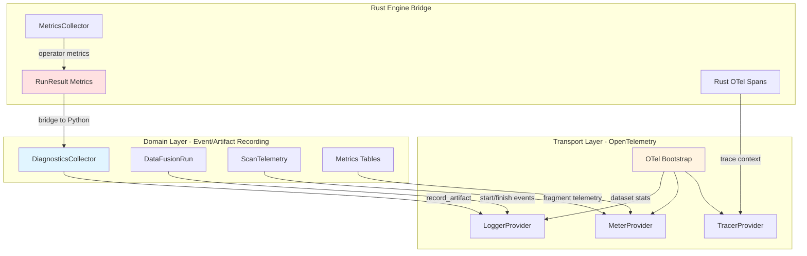
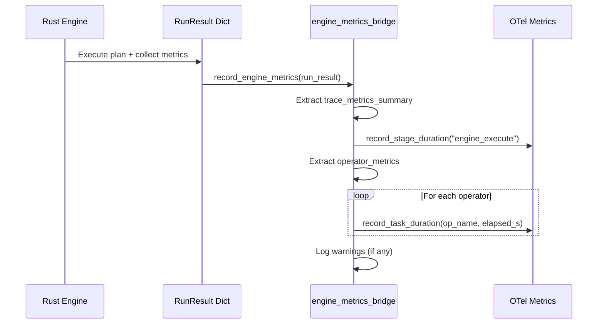

# Observability, Configuration, and Debugging

## Purpose

CodeAnatomy implements a unified observability architecture that bridges Python and Rust execution layers through OpenTelemetry. The system provides deterministic configuration profiles, comprehensive metrics collection from both language runtimes, and progressive diagnostics capture for pipeline introspection. Configuration follows a strict naming hierarchy (Policy/Settings/Config/Spec/Options) to distinguish runtime behavior control from initialization parameters.

This architecture enables production-grade telemetry with minimal performance overhead while supporting flexible debugging workflows through captured execution artifacts.

## Architecture Overview

The observability system operates in two layers:



**Key Principles:**

1. **Two-Layer Separation**: Domain logic (DiagnosticsCollector, DataFusionRun) is independent of transport (OTel providers).
2. **Bridge Not Duplication**: Rust metrics flow to Python diagnostics via `engine_metrics_bridge.py`, avoiding duplicate instrumentation.
3. **Deterministic Fingerprinting**: Runtime profiles, execution specs, and plan artifacts all produce stable hashes for reproducibility tracking.

## DiagnosticsCollector

The `DiagnosticsCollector` serves as the primary in-memory sink for pipeline events and structured artifacts.

### Core Interface

**Location**: `src/obs/diagnostics.py`

```python
@dataclass
class DiagnosticsCollector:
    events: dict[str, list[Mapping[str, object]]]
    artifacts: dict[str, list[Mapping[str, object]]]

    def record_events(self, name: str, rows: Sequence[Mapping[str, object]]) -> None
    def record_artifact(self, name: ArtifactSpec, payload: Mapping[str, object]) -> None
    def record_event(self, name: str, properties: Mapping[str, object]) -> None
```

### Event vs Artifact Recording

| Method | Use Case | Multiplicity | OTel Emission |
|--------|----------|--------------|---------------|
| `record_events()` | Batch event rows (multi-row tables) | Many per name | One log per row |
| `record_artifact()` | Singular structured payload (fingerprint, summary) | One per name | One log per artifact |
| `record_event()` | Single event with properties | One per call | One log per event |

All recording methods emit to OTel logs via `emit_diagnostics_event()` and increment `record_artifact_count()` metrics.

### Specialized Recording Functions

The `diagnostics.py` module provides domain-specific helpers that normalize payloads before recording:

```python
# View fingerprints for deterministic plan tracking
record_view_fingerprints(sink, view_nodes=nodes)

# DataFusion view artifacts with DDL/plan metadata
record_view_artifact(sink, artifact=view_artifact)

# Schema contract violations
record_view_contract_violations(sink, table_name="foo", violations=violations)

# DataFrame validation errors (pandera failure cases)
record_dataframe_validation_error(sink, name="table", error=exc, policy=policy)

# Prepared statement metadata
prepared_statement_hook(sink)(PreparedStatementSpec(...))

# Rust UDF snapshot summaries
record_rust_udf_snapshot(sink, snapshot=snapshot)

# Semantic quality artifacts
record_semantic_quality_artifact(sink, artifact=artifact)
record_semantic_quality_events(sink, name="quality", rows=rows)
```

### Session Identity

All diagnostics use a per-module session ID (`_OBS_SESSION_ID = uuid7_str()`) to correlate artifacts within a single import lifecycle.

## Engine Metrics Bridge

The `engine_metrics_bridge.py` module extracts metrics from Rust `RunResult` envelopes and records them to Python OTel instruments.

**Location**: `src/obs/engine_metrics_bridge.py`

### Metrics Flow



### Extracted Metrics

**From `run_result["trace_metrics_summary"]`:**
- `elapsed_compute_nanos` → `record_stage_duration("engine_execute", elapsed_s)`
- `warning_count_total` → Logged via Python logger
- `warning_counts_by_code` → Logged per code

**From `run_result["collected_metrics"]["operator_metrics"]`:**
- `operator_name`, `elapsed_compute_nanos` → `record_task_duration(op_name, elapsed_s)`

### Rust Metrics Collector

**Location**: `rust/codeanatomy_engine/src/executor/metrics_collector.rs`

The Rust side walks the executed `ExecutionPlan` tree to collect real DataFusion metrics:

```rust
pub struct CollectedMetrics {
    pub output_rows: u64,
    pub spill_count: u64,
    pub spilled_bytes: u64,
    pub elapsed_compute_nanos: u64,
    pub scan_selectivity: f64,
    pub operator_metrics: Vec<OperatorMetricSummary>,
}

pub struct OperatorMetricSummary {
    pub operator_name: String,
    pub output_rows: u64,
    pub elapsed_compute_nanos: u64,
    pub spill_count: u64,
    pub spilled_bytes: u64,
    pub memory_usage: u64,
}
```

`collect_plan_metrics(plan)` recursively aggregates:
- DataFusion `MetricsSet` from each `ExecutionPlan` node
- Scan selectivity from leaf scan operators (output_rows / input_rows)
- Per-operator summaries for fine-grained tracing

## OpenTelemetry Integration

### Bootstrap Architecture

**Location**: `src/obs/otel/bootstrap.py`

**Entry Point**: `configure_otel(service_name=None, options=None) -> OtelProviders`

Bootstrap sequence:
1. Resolve configuration via `resolve_otel_config()` (env vars + spec + overrides)
2. Build resource with service identity (name, version, namespace, instance ID, environment)
3. Conditionally build TracerProvider, MeterProvider, LoggerProvider based on `enable_traces/metrics/logs`
4. Activate global providers via `providers.activate_global()`
5. Install custom processors (RunIdSpanProcessor, RunIdLogRecordProcessor, LogRecordAttributeLimitProcessor)
6. Configure exporters (OTLP or InMemory for test mode)

### Resource Identity

Resource attributes resolved from environment:

| Attribute | Environment Variable | Fallback |
|-----------|---------------------|----------|
| `service.name` | `CODEANATOMY_SERVICE_NAME` | `"codeanatomy"` |
| `service.version` | `CODEANATOMY_SERVICE_VERSION` | Package version |
| `service.namespace` | `CODEANATOMY_SERVICE_NAMESPACE` | None |
| `service.instance.id` | `CODEANATOMY_SERVICE_INSTANCE_ID` | UUID7 (cached) |
| `deployment.environment.name` | `CODEANATOMY_ENVIRONMENT` or `DEPLOYMENT_ENVIRONMENT` | None |

**Resource Detectors**: `build_detected_resource()` in `resource_detectors.py` merges:
- Base resource (service identity)
- Process detector (PID, executable, runtime)
- Optional Docker/K8s/Cloud detectors (capability-gated)

### Configuration Resolution

**Location**: `src/obs/otel/config.py`

```python
@dataclass(frozen=True)
class OtelConfig:
    enable_traces: bool
    enable_metrics: bool
    enable_logs: bool
    enable_log_correlation: bool
    enable_system_metrics: bool
    sampler: Sampler
    metric_export_interval_ms: int
    metric_export_timeout_ms: int
    bsp_schedule_delay_ms: int  # BatchSpanProcessor
    bsp_export_timeout_ms: int
    bsp_max_queue_size: int
    bsp_max_export_batch_size: int
    blrp_schedule_delay_ms: int  # BatchLogRecordProcessor
    blrp_export_timeout_ms: int
    blrp_max_queue_size: int
    blrp_max_export_batch_size: int
    # ... attribute limits, exemplar filter, temporality preference
```

Resolution order:
1. Environment variables (OTEL_* standard + CODEANATOMY_* custom)
2. Optional `OtelConfigSpec` (serializable contract)
3. Optional `OtelConfigOverrides` (runtime overrides)

### Parse-First Policy (Msgspec-Only)

Configuration boundaries use a strict parse-first contract:

1. **Single boundary parse** with `msgspec` (`json.decode` / `convert`) into
   `StructBaseStrict` contracts.
2. **No duplicate runtime model layer** (no mirrored `BaseModel`/adapter classes).
3. **Cross-field checks as explicit invariants** at parse boundaries (for example,
   sampler-dependent settings), implemented as pure functions.
4. **Normalized error payloads** from `msgspec.ValidationError` via
   `validation_error_payload(...)` for stable diagnostics.

This keeps config parsing deterministic, reduces runtime overhead, and aligns with
the architecture principle: parse contracts once, then execute typed logic.

### Custom Processors

**RunIdSpanProcessor** (`obs/otel/processors.py`):
- Adds `codeanatomy.run_id` attribute to all spans from context

**RunIdLogRecordProcessor**:
- Adds `codeanatomy.run_id` attribute to all log records from context

**LogRecordAttributeLimitProcessor**:
- Enforces `log_record_attribute_count_limit` and `log_record_attribute_value_length_limit`

### Instrumentation Scopes

**Location**: `src/obs/otel/scopes.py`

Canonical scope names:

| Scope | Usage |
|-------|-------|
| `SCOPE_ROOT` | `"codeanatomy"` - Top-level pipeline |
| `SCOPE_PIPELINE` | `"codeanatomy.pipeline"` - Graph orchestration |
| `SCOPE_EXTRACT` | `"codeanatomy.extract"` - Evidence extraction |
| `SCOPE_NORMALIZE` | `"codeanatomy.normalize"` - Deprecated (use SEMANTICS) |
| `SCOPE_PLANNING` | `"codeanatomy.planning"` - Task/plan catalog |
| `SCOPE_SCHEDULING` | `"codeanatomy.scheduling"` - Execution scheduling |
| `SCOPE_DATAFUSION` | `"codeanatomy.datafusion"` - DataFusion execution |
| `SCOPE_EXECUTION` | `"codeanatomy.execution"` - Execution runtime |
| `SCOPE_STORAGE` | `"codeanatomy.storage"` - Delta Lake writes |
| `SCOPE_CPG` | `"codeanatomy.cpg"` - CPG building |
| `SCOPE_OBS` | `"codeanatomy.obs"` - Observability (metrics) |
| `SCOPE_DIAGNOSTICS` | `"codeanatomy.diagnostics"` - Diagnostics recording |
| `SCOPE_SEMANTICS` | `"codeanatomy.semantics"` - Semantic pipeline |

## Metrics Catalog

**Location**: `src/obs/otel/metrics.py`

### Histogram Metrics

| Metric | Unit | Description | Source |
|--------|------|-------------|--------|
| `codeanatomy.stage.duration` | seconds | Stage execution duration | Rust `elapsed_compute_nanos` + Python extraction spans |
| `codeanatomy.task.duration` | seconds | Task execution duration | Rust `operator_metrics.elapsed_compute_nanos` |
| `codeanatomy.datafusion.execute.duration` | seconds | DataFusion execution duration | Engine-native execution metrics |
| `codeanatomy.datafusion.write.duration` | seconds | DataFusion write duration | Engine-native write operations |
| `codeanatomy.cache.operation.duration` | seconds | Cache operation duration | DEPRECATED - pending engine cache metrics |

**Histogram Buckets**: `[0.005, 0.01, 0.025, 0.05, 0.1, 0.25, 0.5, 1.0, 2.0, 5.0, 10.0, 20.0]` seconds

### Counter Metrics

| Metric | Unit | Description |
|--------|------|-------------|
| `codeanatomy.artifact.count` | count | Artifact counts by kind |
| `codeanatomy.error.count` | count | Error counts by type and stage |
| `codeanatomy.cache.operation.count` | count | DEPRECATED - pending engine cache metrics |
| `codeanatomy.storage.operation.count` | count | Storage operation count |

### Gauge Metrics (Observable)

| Metric | Unit | Description |
|--------|------|-------------|
| `codeanatomy.dataset.rows` | count | Dataset row counts |
| `codeanatomy.dataset.columns` | count | Dataset column counts |
| `codeanatomy.scan.row_groups` | count | Row group counts during scans |
| `codeanatomy.scan.fragments` | count | Fragment counts during scans |

Gauges use `GaugeStore` to track latest values per attribute set, exposed via observable gauge callbacks.

### Metric Attributes

Common attributes (via `AttributeName` enum):

- `codeanatomy.run_id` - Correlation ID (added by RunIdSpanProcessor)
- `stage` - Pipeline stage name
- `status` - Operation status (ok, failed)
- `task_kind` - Task type
- `plan_kind` - DataFusion plan type
- `destination` - Write destination
- `artifact_kind` - Artifact type
- `error_type` - Exception class name
- `dataset` - Dataset/table name

### Metric Views

Views configure aggregation and attribute filtering:

```python
View(
    instrument_name="codeanatomy.stage.duration",
    aggregation=ExplicitBucketHistogramAggregation([...]),
    attribute_keys={"codeanatomy.run_id", "stage", "status"}
)
```

Reduces cardinality by dropping unlisted attributes.

## Rust Tracing Integration

### OTel Bootstrap (Rust)

**Location**: `rust/codeanatomy_engine/src/executor/tracing/bootstrap.rs`

```rust
pub fn init_otel_tracing(config: &TracingConfig) -> Result<()>
```

Initializes Rust-side OpenTelemetry:

1. Builds `SdkTracerProvider` with OTLP exporter (gRPC or HTTP)
2. Configures `BatchSpanProcessor` with queue size, schedule delay, export timeout
3. Builds `Resource` with `service.name` and custom attributes
4. Parses sampler (AlwaysOn, AlwaysOff, TraceIdRatioBased, ParentBased variants)
5. Sets global tracer provider via `opentelemetry::global::set_tracer_provider()`
6. Attaches `tracing_opentelemetry::layer()` to `tracing_subscriber::registry()`

**Flush**: `flush_otel_tracing()` forces span export before shutdown.

### TracingConfig Contract

**Location**: `src/planning_engine/spec_contracts.py`

```python
class TracingConfig(StructBaseCompat, frozen=True):
    enabled: bool = False
    otlp_endpoint: str | None = None
    otlp_protocol: OtlpProtocol | None = None
    otel_service_name: str | None = None
    otel_resource_attributes: dict[str, str] = {}
    export_policy: OtelExportPolicy = OtelExportPolicy()
```

`OtelExportPolicy` contains batch processor settings (BSP queue/batch sizes, delays, timeouts) and sampler configuration.

### Execution Span Instrumentation

**Location**: `rust/codeanatomy_engine/src/executor/tracing/exec_instrumentation.rs`

Key instrumentation points:
- `execute_semantic_execution_spec()` - Top-level execution span
- `execute_view_definition()` - Per-view execution span
- `apply_rule_intent()` - Per-rule execution span

All spans capture:
- Rule/view identity attributes
- Execution metrics (rows, elapsed time)
- Error context on failure

## Configuration Philosophy

### Naming Hierarchy

CodeAnatomy uses strict naming conventions to distinguish configuration types:

| Suffix | Purpose | Mutability | Examples |
|--------|---------|------------|----------|
| **Policy** | Runtime behavior control | Immutable after construction | `DeltaWritePolicy`, `ValidationPolicySpec` |
| **Settings** | Initialization parameters | Immutable after construction | `DiskCacheSettings`, `SessionSettings` |
| **Config** | Request/command parameters | Immutable per-request | `OtelConfig`, `SemanticConfig`, `CpgBuildOptions` |
| **Spec** | Declarative schema definitions | Immutable | `TableSpec`, `TaskSpec`, `OtelConfigSpec` |
| **Options** | Optional parameter bundles | Immutable | `CompileOptions`, `ResourceOptions`, `ScanTelemetryOptions` |

**Key Distinction**:
- **Policy** controls "what" behavior is allowed/required (validation rules, write modes).
- **Settings** controls "how" infrastructure is initialized (cache paths, pool sizes).
- **Config** controls "when/where" operations occur (request scope, runtime overrides).

### Configuration Contracts

All configuration types must:
1. Be immutable (`frozen=True` for msgspec, `dataclass(frozen=True)` for Python)
2. Support deterministic fingerprinting via `fingerprint()` or `fingerprint_payload()`
3. Use msgspec `StructBaseCompat` or `StructBaseStrict` for serialized contracts
4. Provide clear defaults via static factories or dataclass defaults

## Runtime Profiles

### Profile Resolution

**Location**: `src/extraction/runtime_profile.py`

```python
def resolve_runtime_profile(
    profile: str,
    determinism: DeterminismTier | None = None
) -> RuntimeProfileSpec
```

Resolution steps:
1. Load Rust `SessionFactory.from_class(profile_class)` to extract native settings (target_partitions, batch_size, memory_pool_bytes)
2. Apply named profile overrides (`dev_debug`, `prod_fast`, `memory_tight`)
3. Apply memory overrides (spill_dir, memory_limit_bytes, memory_pool)
4. Apply environment variable patches (`CODEANATOMY_DATAFUSION_POLICY`, `CODEANATOMY_CACHE_OUTPUT_ROOT`, etc.)
5. Compute profile hash from `(name, determinism_tier, telemetry_hash)`

### Named Profiles

| Profile | Target Partitions | Batch Size | Diagnostics | Policy |
|---------|------------------|------------|-------------|--------|
| `dev_debug` | min(cpu_count, 8) | 4096 | Full explain/analyze | `"dev"` |
| `prod_fast` | Default | Default | Minimal | `"prod"` |
| `memory_tight` | min(cpu_count, 4) | 4096 | Summary only | `"symtable"` |

### RuntimeProfileSpec

```python
class RuntimeProfileSpec(StructBaseStrict, frozen=True):
    name: str
    datafusion: DataFusionRuntimeProfile
    determinism_tier: DeterminismTier
    rust_profile_hash: str | None
    rust_settings_hash: str | None

    @property
    def datafusion_settings_hash(self) -> str

    @property
    def runtime_profile_hash(self) -> str
```

Provides unified access to:
- DataFusion session settings
- Determinism tier (STRICT, BEST_EFFORT)
- Profile fingerprints (for incremental invalidation)

### Environment Variable Overrides

Supported overrides:

| Environment Variable | Overrides | Type |
|---------------------|-----------|------|
| `CODEANATOMY_DATAFUSION_POLICY` | `policies.config_policy_name` | string |
| `CODEANATOMY_DATAFUSION_CATALOG_LOCATION` | `catalog.catalog_auto_load_location` | path |
| `CODEANATOMY_DATAFUSION_CATALOG_FORMAT` | `catalog.catalog_auto_load_format` | string |
| `CODEANATOMY_CACHE_OUTPUT_ROOT` | `policies.cache_output_root` | path |
| `CODEANATOMY_RUNTIME_ARTIFACT_CACHE_ROOT` | `policies.runtime_artifact_cache_root` | path |
| `CODEANATOMY_RUNTIME_ARTIFACT_CACHE_ENABLED` | `policies.runtime_artifact_cache_enabled` | bool |
| `CODEANATOMY_METADATA_CACHE_SNAPSHOT_ENABLED` | `policies.metadata_cache_snapshot_enabled` | bool |
| `CODEANATOMY_DIAGNOSTICS_SINK` | `diagnostics.diagnostics_sink` | enum (memory, otel, none) |

## Determinism Tiers

**Location**: `src/core_types.py`

```python
class DeterminismTier(StrEnum):
    STRICT = "strict"
    BEST_EFFORT = "best_effort"
```

### STRICT Tier

Requirements:
- All extraction inputs must be file-backed (no in-memory sources)
- All DataFusion operations must use deterministic plans (stable sort order, no random sampling)
- All output tables must include schema identity hashes
- All profile/plan fingerprints must be stable across runs

Use cases:
- Regression testing (golden file comparisons)
- Incremental builds (cache invalidation requires exact match)
- Reproducible research pipelines

### BEST_EFFORT Tier

Allows:
- In-memory tables (Python dict sources, mock data)
- Non-deterministic DataFusion optimizations
- Schema evolution without hash validation

Use cases:
- Development/debugging workflows
- Ad-hoc analysis pipelines
- Performance benchmarking (where output stability is not required)

## Environment Variables Reference

### Service Identity

| Variable | Default | Purpose |
|----------|---------|---------|
| `CODEANATOMY_SERVICE_NAME` | `"codeanatomy"` | OTel service.name resource attribute |
| `CODEANATOMY_SERVICE_VERSION` | Package version | OTel service.version resource attribute |
| `CODEANATOMY_SERVICE_NAMESPACE` | None | OTel service.namespace resource attribute |
| `CODEANATOMY_SERVICE_INSTANCE_ID` | UUID7 | OTel service.instance.id resource attribute |
| `CODEANATOMY_ENVIRONMENT` | None | OTel deployment.environment.name attribute |

### OTel SDK Configuration

| Variable | Default | Purpose |
|----------|---------|---------|
| `OTEL_SDK_DISABLED` | `false` | Disable all OTel instrumentation |
| `OTEL_TRACES_EXPORTER` | (detect) | Enable traces when set to non-"none" |
| `OTEL_METRICS_EXPORTER` | (detect) | Enable metrics when set to non-"none" |
| `OTEL_LOGS_EXPORTER` | (detect) | Enable logs when set to non-"none" |
| `OTEL_EXPORTER_OTLP_ENDPOINT` | None | OTLP endpoint for all signals |
| `OTEL_EXPORTER_OTLP_PROTOCOL` | `"grpc"` | OTLP protocol (grpc, http/json, http/protobuf) |
| `OTEL_TRACES_SAMPLER` | `"parentbased_traceidratio"` | Sampler strategy |
| `OTEL_TRACES_SAMPLER_ARG` | `0.1` | Sampler argument (ratio for traceidratio) |
| `OTEL_PYTHON_LOG_CORRELATION` | `true` | Enable log-trace correlation |
| `OTEL_LOG_LEVEL` | None | OTel SDK log level (DEBUG, INFO, WARNING, ERROR) |

### Batch Processor Configuration

| Variable | Default | Purpose |
|----------|---------|---------|
| `OTEL_BSP_SCHEDULE_DELAY` | `5000` ms | BatchSpanProcessor schedule delay |
| `OTEL_BSP_EXPORT_TIMEOUT` | `30000` ms | BatchSpanProcessor export timeout |
| `OTEL_BSP_MAX_QUEUE_SIZE` | `2048` | BatchSpanProcessor max queue size |
| `OTEL_BSP_MAX_EXPORT_BATCH_SIZE` | `512` | BatchSpanProcessor max batch size |
| `OTEL_BLRP_SCHEDULE_DELAY` | `5000` ms | BatchLogRecordProcessor schedule delay |
| `OTEL_BLRP_EXPORT_TIMEOUT` | `30000` ms | BatchLogRecordProcessor export timeout |
| `OTEL_BLRP_MAX_QUEUE_SIZE` | `2048` | BatchLogRecordProcessor max queue size |
| `OTEL_BLRP_MAX_EXPORT_BATCH_SIZE` | `512` | BatchLogRecordProcessor max batch size |

### CodeAnatomy-Specific Configuration

| Variable | Default | Purpose |
|----------|---------|---------|
| `CODEANATOMY_OTEL_TEST_MODE` | `false` | Use InMemory exporters for testing |
| `CODEANATOMY_OTEL_AUTO_INSTRUMENTATION` | `false` | Enable auto-instrumentation for HTTP/DB |
| `CODEANATOMY_OTEL_SYSTEM_METRICS` | `false` | Enable system metrics (CPU, memory, disk) |
| `CODEANATOMY_OTEL_SAMPLING_RULE` | `"codeanatomy.default"` | Custom sampling rule name |

## Debugging Workflows

### Plan Inspection

When execution fails or produces unexpected results, inspect captured plan artifacts:

```python
from obs.diagnostics import DiagnosticsCollector
from datafusion_engine.views.graph import build_view_graph

diagnostics = DiagnosticsCollector()
view_graph = build_view_graph(view_nodes, diagnostics=diagnostics)

# Inspect artifacts
artifacts = diagnostics.artifacts_snapshot()

# Check view fingerprints
view_fingerprints = artifacts.get("view_fingerprints_v1", [])
for fp in view_fingerprints:
    print(fp["view_name"], fp["policy_hash"], fp["ddl_fingerprint"])

# Check contract violations
violations = artifacts.get("view_contract_violations_v1", [])
for violation in violations:
    print(violation["view"], violation["violations"])
```

### Fingerprint Debugging

When incremental builds produce unexpected cache misses, compare fingerprints:

```python
from extraction.runtime_profile import runtime_profile_snapshot

profile = resolve_runtime_profile("dev_debug", determinism=DeterminismTier.STRICT)
snapshot = profile.runtime_profile_snapshot()

print("Runtime profile hash:", snapshot.profile_hash)
print("DataFusion settings hash:", snapshot.datafusion_settings_hash)
print("Determinism tier:", snapshot.determinism_tier)

# Inspect telemetry payload for changes
telemetry = snapshot.telemetry_payload
print("Target partitions:", telemetry.get("target_partitions"))
print("Batch size:", telemetry.get("batch_size"))
print("Memory pool:", telemetry.get("memory_pool"))
```

### Data Flow Tracing

To trace data flow through the engine:

```python
from obs.datafusion_runs import tracked_run

with tracked_run(label="debug_pipeline", sink=diagnostics) as run:
    # Execute plan
    result = executor.execute_semantic_spec(spec, run=run)

    # Check run metadata
    print("Run ID:", run.run_id)
    print("Duration:", run.end_time_unix_ms - run.start_time_unix_ms, "ms")

# Extract execution summary
execution_summary = diagnostics.artifacts.get("engine_execution_summary_v1", [])
for summary in execution_summary:
    print("Total rows:", summary["total_rows"])
    print("Total compute time:", summary["total_compute_nanos"], "ns")
    print("Operators:", len(summary.get("operator_metrics", [])))
```

### Metrics Inspection

For production debugging, query OTel metrics backend or use in-process snapshot:

```python
from obs.otel.metrics import metrics_snapshot

snapshot = metrics_snapshot()
print("Dataset rows:", snapshot["dataset_rows"])
print("Dataset columns:", snapshot["dataset_columns"])
print("Scan row groups:", snapshot["scan_row_groups"])
print("Scan fragments:", snapshot["scan_fragments"])
```

### Rust Engine Telemetry

When Rust execution fails, inspect warnings and trace summary:

```python
run_result = executor.execute_semantic_spec(spec)

# Check warnings
warnings = run_result.get("warnings", [])
for warning in warnings:
    print(f"[{warning['code']}] {warning['message']} (stage: {warning['stage']})")

# Check trace summary
trace_summary = run_result.get("trace_metrics_summary", {})
print("Output rows:", trace_summary.get("output_rows"))
print("Elapsed compute:", trace_summary.get("elapsed_compute_nanos"), "ns")
print("Spilled bytes:", trace_summary.get("spilled_bytes"))
print("Selectivity:", trace_summary.get("selectivity"))
```

### DiagnosticsCollector Export

For offline analysis, export diagnostics to disk:

```python
import msgspec

diagnostics = DiagnosticsCollector()
# ... run pipeline ...

# Export all events and artifacts
snapshot = {
    "events": diagnostics.events_snapshot(),
    "artifacts": diagnostics.artifacts_snapshot(),
}

with open("diagnostics.msgpack", "wb") as f:
    f.write(msgspec.msgpack.encode(snapshot))
```

## Cross-References

### Related Architecture Documents

- **[04_boundary_contract.md](./04_boundary_contract.md)**: RuntimeConfig and TracingConfig contracts for engine execution
- **[06_execution.md](./06_execution.md)**: SemanticExecutionSpec and run execution flow
- **[07_datafusion_and_udfs.md](./07_datafusion_and_udfs.md)**: DataFusion session management and UDF registration

### Key Modules

**Python Observability:**
- `src/obs/diagnostics.py` - DiagnosticsCollector and specialized recording functions
- `src/obs/engine_metrics_bridge.py` - Rust→Python metrics bridge
- `src/obs/metrics.py` - Dataset/column stats tables
- `src/obs/scan_telemetry.py` - Fragment scan telemetry
- `src/obs/datafusion_runs.py` - Run envelope tracking with correlation IDs
- `src/obs/otel/bootstrap.py` - OTel provider configuration
- `src/obs/otel/config.py` - Configuration resolution
- `src/obs/otel/metrics.py` - Metric instruments and views
- `src/obs/otel/scopes.py` - Instrumentation scope constants

**Rust Observability:**
- `rust/codeanatomy_engine/src/executor/tracing/bootstrap.rs` - Rust OTel bootstrap
- `rust/codeanatomy_engine/src/executor/metrics_collector.rs` - Physical plan metrics collection

**Configuration:**
- `src/extraction/runtime_profile.py` - Runtime profile resolution
- `src/planning_engine/spec_contracts.py` - RuntimeConfig/TracingConfig contracts
- `src/core_types.py` - DeterminismTier enum

**Execution Bridge:**
- `src/graph/build_pipeline.py` - `_record_observability()` function (lines 355-399)
