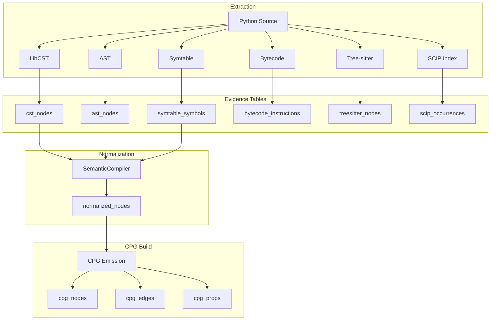

# Debugging & Troubleshooting

## Purpose

This guide provides practical debugging workflows for CodeAnatomy's inference-driven CPG pipeline. It covers plan inspection, fingerprint debugging, data flow tracing, common issues, and end-to-end walkthroughs from Python source to CPG output.

## Key Concepts

- **Plan Bundle Inspection** - Examine compiled DataFusion plans, fingerprints, and lineage
- **Data Flow Tracing** - Follow evidence from extraction through normalization to CPG emission
- **Fingerprint Debugging** - Understand cache invalidation and determinism issues
- **Hamilton Execution** - Trace DAG execution, node dependencies, and caching behavior
- **Schema Contract Validation** - Diagnose schema mismatches and evolution issues

---

## Quick Diagnostic Checklist

When debugging pipeline issues, check these in order:

| Step | Check | Tool/Command |
|------|-------|--------------|
| 1 | Plan bundle fingerprints match | `plan_bundle.fingerprint` comparison |
| 2 | Delta table versions pinned | `delta_table.version()` |
| 3 | UDF platform installed | `ctx.udfs()` output |
| 4 | Schema contracts pass | `validate_output_schema()` |
| 5 | Hamilton cache valid | `driver.cache.logs(run_id)` |
| 6 | Determinism tier correct | `CODEANATOMY_DETERMINISM_TIER` |

---

## Plan Bundle Inspection

### Accessing Plan Bundles

```python
from datafusion_engine.plans import compile_plan_bundle, PlanBundleOptions

# Compile a view to plan bundle
bundle = compile_plan_bundle(
    ctx=session_context,
    view_name="cpg_nodes_normalized",
    options=PlanBundleOptions(
        capture_substrait=True,
        capture_lineage=True,
    ),
)

# Inspect bundle contents
print(f"Fingerprint: {bundle.fingerprint}")
print(f"DDL Hash: {bundle.ddl_fingerprint}")
print(f"Policy Hash: {bundle.policy_hash}")
print(f"Substrait bytes: {len(bundle.substrait_bytes)}")
```

### Plan Bundle Components

| Component | Purpose | Debugging Use |
|-----------|---------|---------------|
| `fingerprint` | Overall plan identity | Cache key validation |
| `ddl_fingerprint` | Schema + DDL hash | Schema change detection |
| `policy_hash` | Runtime policy hash | Policy change detection |
| `substrait_bytes` | Serialized plan | Plan reconstruction |
| `lineage` | Dataset/column dependencies | Dependency tracing |
| `required_udfs` | UDF dependencies | UDF availability check |

### Comparing Plan Bundles

```python
def compare_bundles(old: PlanBundle, new: PlanBundle) -> dict:
    """Compare two plan bundles to identify differences."""
    return {
        "fingerprint_changed": old.fingerprint != new.fingerprint,
        "ddl_changed": old.ddl_fingerprint != new.ddl_fingerprint,
        "policy_changed": old.policy_hash != new.policy_hash,
        "lineage_changed": old.lineage != new.lineage,
        "udf_changed": set(old.required_udfs) != set(new.required_udfs),
    }
```

---

## Fingerprint Debugging

### Understanding Fingerprint Composition

Fingerprints are built from stable sub-components:

```python
from utils.hashing import hash_msgpack_canonical

# Plan fingerprint composition
plan_hash = hash_msgpack_canonical({
    "version": 3,
    "substrait": substrait_bytes,
    "env_hash": environment_hash,
    "udfs": tuple(sorted(required_udfs)),
    "policy_hash": policy_hash,
})
```

### Common Fingerprint Issues

| Symptom | Likely Cause | Resolution |
|---------|--------------|------------|
| Fingerprint changes every run | Non-deterministic UDF | Check UDF volatility |
| Fingerprint stable but cache miss | Cache key version mismatch | Check `version` field |
| Fingerprint differs across machines | Environment difference | Check `CODEANATOMY_*` vars |
| Fingerprint differs after restart | Timestamp in payload | Remove timestamps from hash |

### Debugging Non-Determinism

```python
from datafusion_engine.plans import extract_plan_components

# Extract and compare components
components_1 = extract_plan_components(bundle_1)
components_2 = extract_plan_components(bundle_2)

for key in components_1:
    if components_1[key] != components_2[key]:
        print(f"Difference in {key}:")
        print(f"  Run 1: {components_1[key][:100]}...")
        print(f"  Run 2: {components_2[key][:100]}...")
```

### Determinism Tier Verification

```python
from core_types import DeterminismTier, resolve_determinism_tier

# Check current tier
tier = resolve_determinism_tier()
print(f"Current tier: {tier}")

# Force CANONICAL for debugging
import os
os.environ["CODEANATOMY_FORCE_TIER2"] = "true"
```

---

## Data Flow Walkthrough

### End-to-End Pipeline Flow



### Extraction Evidence Tables

**LibCST Evidence:**

```python
# Sample LibCST extraction output
cst_nodes = pa.table({
    "node_id": ["cst_001", "cst_002"],
    "node_type": ["FunctionDef", "Name"],
    "bstart": [0, 45],
    "bend": [120, 55],
    "parent_id": [None, "cst_001"],
    "text": ["def foo(x):\n    return x + 1", "foo"],
    "qualified_name": ["module.foo", "module.foo"],
})
```

**AST Evidence:**

```python
# Sample AST extraction output
ast_nodes = pa.table({
    "node_id": ["ast_001", "ast_002"],
    "node_type": ["FunctionDef", "arg"],
    "lineno": [1, 1],
    "col_offset": [0, 8],
    "end_lineno": [2, 1],
    "end_col_offset": [16, 9],
    "name": ["foo", "x"],
})
```

**Symtable Evidence:**

```python
# Sample symtable extraction output
symtable_symbols = pa.table({
    "symbol_id": ["sym_001", "sym_002"],
    "name": ["foo", "x"],
    "scope_type": ["function", "local"],
    "is_local": [False, True],
    "is_global": [False, False],
    "is_parameter": [False, True],
    "is_referenced": [True, True],
})
```

**Bytecode Evidence:**

```python
# Sample bytecode extraction output
bytecode_instructions = pa.table({
    "instruction_id": ["bc_001", "bc_002", "bc_003"],
    "opname": ["LOAD_FAST", "LOAD_CONST", "BINARY_ADD"],
    "opcode": [124, 100, 23],
    "arg": [0, 1, None],
    "argval": ["x", 1, None],
    "offset": [0, 2, 4],
    "starts_line": [2, 2, 2],
})
```

### Tracing Evidence Through Normalization

```python
from semantics.compiler import SemanticCompiler
from semantics.input_registry import InputRegistry

# Create compiler with debug output
compiler = SemanticCompiler(debug=True)

# Register extraction inputs
registry = InputRegistry()
registry.register("cst_nodes", cst_nodes)
registry.register("ast_nodes", ast_nodes)
registry.register("symtable_symbols", symtable_symbols)

# Compile with tracing
result = compiler.compile(
    inputs=registry,
    trace_lineage=True,
)

# Inspect intermediate results
for stage, table in result.intermediates.items():
    print(f"{stage}: {table.num_rows} rows")
```

### Byte Span Canonicalization

All evidence is normalized to byte spans for joining:

```python
# Byte span is the canonical anchor
normalized = pa.table({
    "node_id": ["n_001"],
    "bstart": [0],      # Byte offset start
    "bend": [120],      # Byte offset end
    "source_layer": ["cst"],
    "original_id": ["cst_001"],
})
```

**Debugging Span Misalignment:**

```python
def check_span_alignment(table: pa.Table) -> list[dict]:
    """Find rows with invalid byte spans."""
    issues = []
    bstart = table["bstart"].to_pylist()
    bend = table["bend"].to_pylist()

    for i, (start, end) in enumerate(zip(bstart, bend)):
        if start is None or end is None:
            issues.append({"row": i, "issue": "null span"})
        elif start > end:
            issues.append({"row": i, "issue": f"inverted: {start} > {end}"})
        elif start < 0:
            issues.append({"row": i, "issue": f"negative start: {start}"})

    return issues
```

---

## Hamilton Execution Debugging

### Tracing DAG Execution

```python
from hamilton_pipeline.driver_factory import build_driver
from hamilton_pipeline.lifecycle import DiagnosticsNodeHook

# Build driver with diagnostics
diagnostics = DiagnosticsCollector()
driver = build_driver(
    config=config,
    lifecycle_hooks=[DiagnosticsNodeHook(diagnostics)],
)

# Execute and collect events
result = driver.execute(outputs)

# Inspect execution events
for event in diagnostics.events.get("hamilton_node_finish_v1", []):
    print(f"{event['node_name']}: {event['duration_ms']}ms, success={event['success']}")
```

### Cache Debugging

```python
# Check cache status for a run
cache = driver.cache
logs = cache.logs(run_id=run_id, level="debug")

for node_name, entries in logs.items():
    for entry in entries:
        print(f"{node_name}: {entry['action']} - {entry['reason']}")
```

**Cache Action Types:**

| Action | Meaning |
|--------|---------|
| `hit` | Cache entry found and valid |
| `miss` | No cache entry exists |
| `invalidated` | Entry exists but invalidated |
| `skip` | Caching disabled for node |

### Node Dependency Tracing

```python
from hamilton_pipeline.task_module_builder import get_node_dependencies

# Get dependencies for a node
deps = get_node_dependencies(driver, "cpg_nodes")
print(f"Direct dependencies: {deps.direct}")
print(f"Transitive dependencies: {deps.transitive}")
```

---

## Delta Lake Debugging

### Version Pinning Issues

```python
from storage.deltalake import load_delta_table

# Load with explicit version
table = load_delta_table(
    table_uri="path/to/delta_table",
    version=42,
)

print(f"Loaded version: {table.version()}")
print(f"Files: {len(table.file_uris())}")

# Check version history
for version in table.history():
    print(f"v{version['version']}: {version['timestamp']} - {version['operation']}")
```

### CDF Debugging

```python
from semantics.incremental import read_cdf_changes, CdfFilterPolicy

# Read CDF changes
changes = read_cdf_changes(
    ctx=session_context,
    table_uri="path/to/delta_table",
    cursor=cursor,
    filter_policy=CdfFilterPolicy.ALL_CHANGES,
)

# Inspect change types
change_types = changes.group_by("_change_type").count()
print(change_types.to_pandas())
```

### File Pruning Verification

```python
from storage.deltalake.file_pruning import evaluate_and_select_files

result = evaluate_and_select_files(
    delta_index=table.file_index(),
    policy=pruning_policy,
    ctx=session_context,
)

print(f"Total files: {result.total_files}")
print(f"Selected files: {len(result.selected_files)}")
print(f"Pruned by partition: {result.pruned_by_partition}")
print(f"Pruned by stats: {result.pruned_by_stats}")
```

---

## UDF Debugging

### Checking UDF Availability

```python
# List registered UDFs
for udf in ctx.udfs():
    print(f"{udf.name()}: {udf.signature()}")

# Check specific UDF
if "stable_hash64" not in [u.name() for u in ctx.udfs()]:
    print("ERROR: stable_hash64 not registered!")
```

### UDF Execution Errors

```python
# Test UDF in isolation
try:
    result = ctx.sql("SELECT stable_hash64('test') as hash").collect()
    print(f"UDF works: {result}")
except Exception as e:
    print(f"UDF error: {e}")

    # Check if Rust extension loaded
    import datafusion_ext
    print(f"Extension version: {datafusion_ext.__version__}")
```

### Rebuilding Rust Extensions

```bash
# Full rebuild
bash scripts/rebuild_rust_artifacts.sh

# Quick rebuild (development)
cd rust && cargo build --release
cp target/release/*.so ../src/datafusion_engine/
```

---

## Schema Contract Debugging

### Validating Output Schemas

```python
from cpg.contracts import validate_cpg_nodes_schema

# Validate a table against schema contract
violations = validate_cpg_nodes_schema(table)

if violations:
    for v in violations:
        print(f"Column {v.column}: {v.issue}")
        print(f"  Expected: {v.expected}")
        print(f"  Actual: {v.actual}")
```

### Common Schema Issues

| Issue | Symptom | Resolution |
|-------|---------|------------|
| Missing column | `KeyError` on access | Check extraction output |
| Wrong type | Cast error | Check normalization logic |
| Null in non-nullable | Constraint violation | Add null handling |
| Schema evolution | Version mismatch | Update schema version |

### Schema Comparison

```python
def compare_schemas(expected: pa.Schema, actual: pa.Schema) -> list[str]:
    """Compare schemas and report differences."""
    issues = []

    expected_names = set(f.name for f in expected)
    actual_names = set(f.name for f in actual)

    for missing in expected_names - actual_names:
        issues.append(f"Missing column: {missing}")

    for extra in actual_names - expected_names:
        issues.append(f"Extra column: {extra}")

    for name in expected_names & actual_names:
        exp_field = expected.field(name)
        act_field = actual.field(name)
        if exp_field.type != act_field.type:
            issues.append(f"Type mismatch for {name}: expected {exp_field.type}, got {act_field.type}")

    return issues
```

---

## Observability Integration

### Accessing Diagnostics

```python
from obs.diagnostics import DiagnosticsCollector

diagnostics = DiagnosticsCollector()

# After pipeline execution
events = diagnostics.events_snapshot()
artifacts = diagnostics.artifacts_snapshot()
metrics = diagnostics.metrics

# Export to file
diagnostics.export_json(Path("debug_output/diagnostics.json"))
```

### OpenTelemetry Tracing

```python
# Enable verbose tracing
import os
os.environ["OTEL_TRACES_SAMPLER"] = "always_on"
os.environ["OTEL_LOG_LEVEL"] = "DEBUG"

# Run pipeline
result = build_graph_product(request)

# Traces exported to configured collector
```

### Metrics Analysis

```python
# Get metrics from diagnostics
for name, value, tags in diagnostics.metrics:
    print(f"{name}: {value} {tags}")
```

---

## Common Issues and Solutions

### Issue: Pipeline Hangs

**Symptoms:** Pipeline stops making progress, no errors

**Diagnosis:**
```python
# Check for blocking operations
import threading
for thread in threading.enumerate():
    print(f"{thread.name}: {thread.is_alive()}")

# Enable Hamilton progress logging
driver = build_driver(config, progress_bar=True)
```

**Solutions:**
1. Check for deadlocks in parallel execution
2. Verify Delta table locks released
3. Check memory limits (`CODEANATOMY_MEMORY_LIMIT`)

### Issue: Inconsistent Results

**Symptoms:** Different outputs across runs

**Diagnosis:**
```python
# Compare fingerprints
print(f"Plan fingerprint: {bundle.fingerprint}")
print(f"Determinism tier: {resolve_determinism_tier()}")

# Check for non-deterministic operations
for udf in ctx.udfs():
    if udf.volatility() != "immutable":
        print(f"WARNING: {udf.name()} is not immutable")
```

**Solutions:**
1. Set `CODEANATOMY_DETERMINISM_TIER=canonical`
2. Check for timestamp-dependent logic
3. Verify all UDFs are deterministic

### Issue: Memory Exhaustion

**Symptoms:** OOM errors, slow execution

**Diagnosis:**
```python
import psutil
process = psutil.Process()
print(f"Memory: {process.memory_info().rss / 1024**3:.2f} GB")
```

**Solutions:**
1. Increase memory limit: `CODEANATOMY_MEMORY_LIMIT_BYTES`
2. Enable spilling: Set `spill_dir` in runtime profile
3. Reduce batch size: `DATAFUSION_BATCH_SIZE`
4. Use streaming execution for large datasets

### Issue: Cache Not Working

**Symptoms:** Full recomputation every run

**Diagnosis:**
```python
# Check cache configuration
print(f"Cache enabled: {profile.cache_enabled}")
print(f"Cache path: {os.environ.get('CODEANATOMY_HAMILTON_CACHE_PATH')}")

# Verify cache directory
cache_dir = Path(os.environ.get("CODEANATOMY_DISKCACHE_DIR", "~/.cache/codeanatomy"))
print(f"Cache exists: {cache_dir.exists()}")
print(f"Cache size: {sum(f.stat().st_size for f in cache_dir.rglob('*'))}")
```

**Solutions:**
1. Verify `CODEANATOMY_DISKCACHE_DIR` is writable
2. Check cache TTL settings
3. Verify fingerprints are stable

### Issue: Delta Table Corruption

**Symptoms:** Read errors, inconsistent versions

**Diagnosis:**
```python
from deltalake import DeltaTable

table = DeltaTable("path/to/table")
print(f"Version: {table.version()}")
print(f"Protocol: {table.protocol()}")

# Check for orphan files
files_in_log = set(table.file_uris())
files_on_disk = set(Path("path/to/table").glob("*.parquet"))
orphans = files_on_disk - files_in_log
print(f"Orphan files: {len(orphans)}")
```

**Solutions:**
1. Run `VACUUM` to clean orphan files
2. Restore to known good version: `table.restore(version=N)`
3. Rebuild from checkpoint

---

## Debugging Workflows

### Workflow 1: Debugging Extraction Issues

```python
# 1. Run extraction in isolation
from extract.repo_scan import scan_repository

scan_result = scan_repository(
    repo_root=Path("."),
    include_patterns=["**/*.py"],
    debug=True,
)

# 2. Check file discovery
print(f"Files found: {len(scan_result.files)}")
for f in scan_result.files[:10]:
    print(f"  {f.path}: {f.size} bytes")

# 3. Run single-file extraction
from extract.libcst import extract_cst_nodes

cst_result = extract_cst_nodes(
    source_code=source,
    file_path="test.py",
)
print(f"CST nodes: {cst_result.num_rows}")
```

### Workflow 2: Debugging Normalization Issues

```python
# 1. Load extraction outputs
from semantics.input_registry import load_extraction_outputs

inputs = load_extraction_outputs(extraction_dir)

# 2. Run normalization step-by-step
from semantics.compiler import SemanticCompiler

compiler = SemanticCompiler(debug=True)

# Run individual rules
for rule in compiler.rules:
    print(f"Running {rule.name}...")
    result = rule.apply(inputs)
    print(f"  Output rows: {result.num_rows if result else 'None'}")
```

### Workflow 3: Debugging CPG Output Issues

```python
# 1. Load CPG tables
cpg_nodes = pa.parquet.read_table("output/cpg_nodes.parquet")
cpg_edges = pa.parquet.read_table("output/cpg_edges.parquet")

# 2. Validate relationships
node_ids = set(cpg_nodes["node_id"].to_pylist())
edge_sources = set(cpg_edges["src_id"].to_pylist())
edge_targets = set(cpg_edges["dst_id"].to_pylist())

orphan_sources = edge_sources - node_ids
orphan_targets = edge_targets - node_ids

print(f"Orphan source edges: {len(orphan_sources)}")
print(f"Orphan target edges: {len(orphan_targets)}")

# 3. Check node type distribution
type_counts = cpg_nodes.group_by("node_type").count()
print(type_counts.to_pandas())
```

---

## Environment Variables Reference

### Debugging-Related Variables

| Variable | Purpose | Debug Value |
|----------|---------|-------------|
| `CODEANATOMY_DETERMINISM_TIER` | Force determinism level | `canonical` |
| `CODEANATOMY_FORCE_TIER2` | Force canonical tier | `true` |
| `OTEL_TRACES_SAMPLER` | Trace sampling | `always_on` |
| `OTEL_LOG_LEVEL` | OTel verbosity | `DEBUG` |
| `DATAFUSION_BATCH_SIZE` | Reduce for debugging | `1024` |
| `RUST_BACKTRACE` | Rust stack traces | `1` |

### Logging Configuration

```python
import logging

# Enable debug logging for specific modules
logging.getLogger("codeanatomy.semantics").setLevel(logging.DEBUG)
logging.getLogger("codeanatomy.datafusion").setLevel(logging.DEBUG)
logging.getLogger("hamilton").setLevel(logging.DEBUG)
```

---

## Cross-References

- **[04_datafusion_integration.md](04_datafusion_integration.md)** - Plan bundles and lineage
- **[06_hamilton_orchestration.md](06_hamilton_orchestration.md)** - DAG execution
- **[07_storage_and_incremental.md](07_storage_and_incremental.md)** - Delta Lake operations
- **[08_observability.md](08_observability.md)** - Diagnostics and telemetry

**Source Files:**
- `src/datafusion_engine/plans/` - Plan bundle compilation
- `src/semantics/compiler.py` - Semantic compilation
- `src/hamilton_pipeline/lifecycle.py` - Execution hooks
- `src/obs/diagnostics.py` - Diagnostics collection
