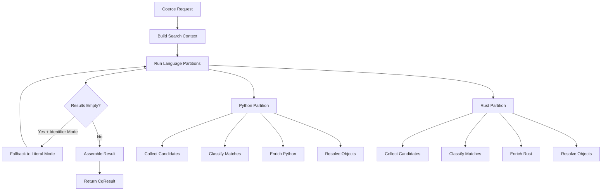
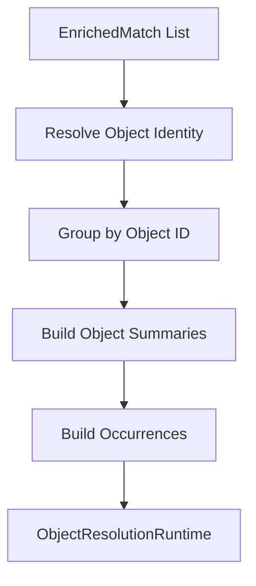

# 02 — Search Pipeline

**Version:** 0.4.0
**Last Updated:** 2026-02-15
**Status:** Phase 2 Complete

## Scope

This document covers the CQ search pipeline (`tools/cq/search/`), which transforms text matches from ripgrep into semantically-enriched, object-resolved findings. The search subsystem is the foundation of CQ's `cq search` command and provides candidate collection for entity queries.

**What's covered:**
- Pipeline orchestration and flow
- Candidate collection via ripgrep
- Three-tier classification system
- Five-stage Python enrichment
- Rust enrichment
- Object resolution and aggregation
- Cross-source agreement validation
- Result assembly

**Cross-references:**
- Tree-sitter details → **doc 07** (07_tree_sitter_engine.md)
- LSP integration → **doc 06** (06_cross_cutting_contracts.md)
- FrontDoor Insight contracts → **doc 06**
- Caching infrastructure → **doc 10** (10_runtime_services.md)
- Advanced evidence planes → **doc 06**

---

## Module Map

The search subsystem is organized into subdirectories by functional concern.

### Directory Structure

```
tools/cq/search/
├── pipeline/        # Core search orchestration (~5,923 LOC)
├── python/          # Python-specific enrichment (~3,678 LOC)
├── rg/              # Ripgrep integration (~1,053 LOC)
├── objects/         # Object resolution system (~1,109 LOC)
├── semantic/        # Semantic integration (~1,399 LOC)
├── rust/            # Rust enrichment (~900 LOC)
├── enrichment/      # Shared enrichment utilities (~200 LOC)
├── _shared/         # Common contracts and utilities (~300 LOC)
├── generated/       # Generated node type schemas (~1,500 LOC)
└── queries/         # Language-specific query definitions
```

**Total:** ~15,500 LOC (excluding tree-sitter subdirectory, which is documented in doc 07)

### Key Modules by Directory

#### `pipeline/` — Search Orchestration

| Module | LOC | Purpose |
|--------|-----|---------|
| `smart_search.py` | 3,769 | Main entry point, partition execution, result assembly |
| `classifier.py` | 659 | Three-tier classification (heuristic → AST → record) |
| `partition_pipeline.py` | 550 | Per-language partition execution |
| `classifier_runtime.py` | 431 | Classification runtime (caches, node lookup, records) |
| `context_window.py` | 118 | Context snippet extraction with window computation |
| `candidate_normalizer.py` | 101 | Definition candidate selection |
| `models.py` | 75 | SearchConfig, SearchRequest, SmartSearchContext |
| `profiles.py` | 65 | SearchLimits presets with constraint annotations (DEFAULT, INTERACTIVE, AUDIT) |
| `__init__.py` | 41 | Package facade with lazy module loading |

**Lazy Loading:** The `__init__.py` uses `__getattr__` to defer imports until first access, reducing startup overhead and preventing import cycles. Exports include `SearchContext`, `SearchPipeline`, `SearchResultAssembly`, `assemble_result`, and `run_smart_search_pipeline`.

#### `python/` — Python Enrichment

| Module | LOC | Purpose |
|--------|-----|---------|
| `extractors.py` | 2,236 | Five-stage Python enrichment pipeline |
| `resolution_support.py` | 625 | Python resolution helpers |
| `analysis_session.py` | 320 | Per-file analysis session cache |
| `resolution_index.py` | 255 | Resolution index construction |
| `semantic_signal.py` | 59 | Semantic signal evaluation |
| `agreement.py` | 55 | Cross-source agreement validation |

#### `rg/` — Ripgrep Integration

| Module | LOC | Purpose |
|--------|-----|---------|
| `adapter.py` | 243 | Ripgrep command construction |
| `runner.py` | 235 | Ripgrep process execution |
| `codec.py` | 219 | Ripgrep JSON event parsing |
| `collector.py` | 210 | RgCollector for streaming event collection |
| `contracts.py` | 63 | Request/response contracts |

#### `objects/` — Object Resolution

| Module | LOC | Purpose |
|--------|-----|---------|
| `resolve.py` | 693 | Object identity resolution and aggregation |
| `render.py` | 392 | Section builders for object-resolved output |

#### `semantic/` — Semantic Integration

| Module | LOC | Purpose |
|--------|-----|---------|
| `front_door.py` | 521 | Phased semantic enrichment pipeline with caching |
| `models.py` | 516 | Semantic contracts and provider abstraction |
| `diagnostics.py` | 335 | Cross-language diagnostics and capabilities |

#### `rust/` — Rust Enrichment

| Module | LOC | Purpose |
|--------|-----|---------|
| `enrichment.py` | 725 | Two-stage Rust enrichment (tree-sitter → syntax) |
| `evidence.py` | 145 | Rust evidence extraction |

---

## Entry Point: smart_search()

**Location:** `pipeline/smart_search.py`

**Signature:**
```python
def smart_search(
    root: Path,
    query: str,
    **kwargs: object,
) -> CqResult:
    """Execute Smart Search pipeline.

    Parameters
    ----------
    root
        Repository root path.
    query
        Search query string.
    kwargs
        Optional overrides: mode, include_globs, exclude_globs,
        include_strings, limits, lang, tc, argv.

    Returns
    -------
    CqResult
        Complete search results with findings, sections, and metadata.
    """
```

### Pipeline Flow



### Pipeline Stages

**Stage 1: Request Coercion**
- Function: `_coerce_search_request()`
- Converts kwargs → `SearchRequest`
- Validates and normalizes parameters

**Stage 2: Context Construction**
- Function: `_build_search_context()`
- Resolves query mode (auto-detection via `detect_query_mode()`)
- Applies search limits (defaults to INTERACTIVE profile)
- Determines language scope (default: "auto" → Python + Rust)
- Constrains include/exclude globs by language

**Stage 3: Partition Execution**
- Function: `_run_language_partitions()`
- Executes per-language search in parallel
- Each partition runs independently with language-specific configuration
- Returns `SearchPartitionResult` per language

**Stage 4: Literal Mode Fallback**
- Triggered when identifier mode yields zero results
- Re-runs search in literal mode (exact string match)
- Replaces results if fallback finds matches

**Stage 5: Result Assembly**
- Function: `_assemble_smart_search_result()`
- Merges language partition results
- Builds multi-language summary
- Constructs final `CqResult` with findings, sections, telemetry

---

## Candidate Collection

**Purpose:** Execute native ripgrep search and collect raw matches.

**Function:** `collect_candidates()` in `pipeline/smart_search.py`

**Signature:**
```python
def collect_candidates(
    request: CandidateCollectionRequest,
) -> tuple[list[RawMatch], SearchStats]:
    """Execute native rg search and collect raw matches.

    Parameters
    ----------
    request
        CandidateCollectionRequest with root, query, mode, limits,
        lang, globs.

    Returns
    -------
    tuple[list[RawMatch], SearchStats]
        Raw matches and collection statistics.
    """
```

### Implementation Flow

```python
# 1. Build and execute ripgrep command
proc = run_rg_json(
    RgRunRequest(
        root=request.root,
        pattern=request.pattern,
        mode=request.mode,
        lang_types=(ripgrep_type_for_language(request.lang),),
        include_globs=request.include_globs or [],
        exclude_globs=request.exclude_globs or [],
        limits=request.limits,
    )
)

# 2. Parse streaming JSON events into RawMatch objects
collector = RgCollector(limits=request.limits, match_factory=RawMatch)
for event in proc.events:
    collector.handle_event(event)
collector.finalize()

# 3. Filter by language scope (extension-authoritative)
scope_filtered = [
    match for match in collector.matches
    if is_path_in_lang_scope(match.file, request.lang)
]

# 4. Build statistics
stats = _build_search_stats(collector, timed_out=proc.timed_out)
stats = msgspec.structs.replace(
    stats,
    matched_files=len({match.file for match in scope_filtered}),
    total_matches=len(scope_filtered),
    dropped_by_scope=dropped_by_scope,
)
```

### RgCollector Event Handling

**Location:** `rg/collector.py`

The `RgCollector` parses ripgrep's streaming JSON output:

**Event types:**
- `begin` — Start of file scan
- `match` — Match event with line/column/text
- `end` — End of file scan with stats
- `summary` — Final summary stats

**Features:**
- Streaming parser (no memory accumulation)
- Respects `SearchLimits` caps (max_files, max_matches_per_file, max_total_matches)
- Tracks scanned/matched file counts
- Timeout detection via process exit code

### Search Statistics

**Struct:** `SearchStats`

```python
class SearchStats:
    scanned_files: int      # Total files scanned
    matched_files: int      # Files with ≥1 match
    total_matches: int      # Total match count
    truncated: bool         # Result set truncated
    timed_out: bool         # Search timed out
    caps_hit: str           # "none" | "files" | "matches_per_file" | "total_matches"
    dropped_by_scope: int   # Matches excluded by language scope
```

---

## Three-Tier Classification

**Location:** `pipeline/classifier.py`

The classification pipeline progressively refines match categorization through three tiers of increasing cost and accuracy.

### Tier Overview

| Tier | Complexity | Strategy | Confidence | Skip Deeper |
|------|------------|----------|------------|-------------|
| 1. Heuristic | O(1) | Line pattern matching | 0.60-0.95 | True for comments/imports |
| 2. AST Node | O(log n) | ast-grep node lookup | 0.60-0.95 | — |
| 3. Record-Based | O(log n) | ast-grep record filtering | 0.85-0.95 | — |

### Tier 1: Heuristic Classification

**Function:** `classify_heuristic()`

**Purpose:** Fast O(1) line-based pattern matching for common cases.

**Algorithm:**
1. Check if match is in comment (position after `#`)
2. Check definition patterns (`def `, `async def `, `class `)
3. Check import patterns (`import `, `from ... import `)
4. Check call pattern (name followed by `(`)
5. Check docstring context (triple quotes)

**Detected categories:**
- `definition` — Function/class definitions (0.90 confidence)
- `import` / `from_import` — Import statements (0.95 confidence)
- `callsite` — Function calls (0.70 confidence, needs AST)
- `comment_match` — In comment (0.95 confidence, skip AST)
- `docstring_match` — In docstring (0.60 confidence)

**Skip-deeper flag:** Set to `True` for comments and imports where AST cannot provide additional information.

### Tier 2: AST Node Classification

**Function:** `classify_from_node()`

**Purpose:** Use cached ast-grep node lookup for higher accuracy.

**Strategy:**
1. Find AST node at match position via `_find_node_at_position()`
2. Map node kind to (category, confidence) via `NODE_KIND_MAP`
3. If node kind not directly mappable, walk up to 5 parent levels
4. Apply 0.9x confidence degradation per parent level
5. Extract containing scope (enclosing function/class)

**Node kind mapping:** `NODE_KIND_MAP` maps tree-sitter node kinds to categories:

```python
NODE_KIND_MAP: dict[str, tuple[MatchCategory, float]] = {
    # High-confidence definitions
    "function_definition": ("definition", 0.95),
    "class_definition": ("definition", 0.95),

    # High-confidence callsites
    "call": ("callsite", 0.95),
    "call_expression": ("callsite", 0.95),

    # Import statements
    "import_statement": ("import", 0.95),
    "import_from_statement": ("from_import", 0.95),

    # Assignments
    "assignment": ("assignment", 0.85),

    # References
    "identifier": ("reference", 0.60),
    "attribute": ("reference", 0.70),

    # Annotations
    "type_annotation": ("annotation", 0.80),
}
```

### Tier 3: Record-Based Classification

**Function:** `classify_from_records()`

**Purpose:** Use pre-scanned ast-grep records for fallback classification.

**Strategy:**
1. Load cached `RecordContext` for file (def/call/import/assign records)
2. Build interval indexes for fast line/column filtering
3. Query indexes for candidates at match position
4. Filter by node span containment
5. Return best match with containing scope

**Record types:**
- `def` — Function/class definitions
- `call` — Function/method calls
- `import` — Import statements
- `assign_ctor` — Assignment constructors

### Classification Result

**Struct:** `EnrichedMatch`

```python
class EnrichedMatch:
    file: str
    line: int
    col: int
    text: str
    category: MatchCategory
    confidence: float
    node_kind: str | None
    containing_scope: str | None
    context: str              # Context snippet
    symtable: SymtableEnrichment | None
    byte_start: int | None
    byte_end: int | None
    payload: dict[str, object]  # Enrichment payload
```

---

## Five-Stage Python Enrichment

**Location:** `python/extractors.py`

The Python enrichment pipeline runs sequentially per-match, accumulating state across five stages. Each stage has independent error handling (fail-open).

### Pipeline State

**Struct:** `_PythonEnrichmentState`

```python
@dataclass(slots=True)
class _PythonEnrichmentState:
    payload: dict[str, object]                     # Accumulated fields
    stage_status: dict[str, str]                   # Stage execution status
    stage_timings_ms: dict[str, float]             # Stage timing metrics
    degrade_reasons: list[str]                     # Degradation reasons
    ast_fields: dict[str, object]                  # Stage 1 (ast-grep)
    python_resolution_fields: dict[str, object]    # Stage 4 (resolution)
    tree_sitter_fields: dict[str, object]          # Stage 5 (tree-sitter)
```

### Stage 1: ast-grep

**Function:** `_run_ast_grep_stage()`

**Purpose:** Extract structured context from ast-grep node (zero incremental cost via cached SgRoot).

**Extracted fields:**
- `signature` — Function/class signature
- `decorators` — Decorator list
- `item_role` — "source" / "test" / "doc"
- `class_context` — Containing class name
- `call_target` — Call target name
- `scope_chain` — Nested scope chain
- `structural_context` — Parent node kinds

**Cost:** O(1) — reuses cached SgRoot from classification.

### Stage 2: Python AST

**Function:** `_run_python_ast_stage()`

**Purpose:** Extract behavior summary using Python `ast` module.

**Conditional:** Only runs for function nodes.

**Extracted fields:**
- `is_generator` — Generator detection (yield/yield from)
- `is_async` — Async function flag
- `awaits` — Async await count
- `yields` — Yield count
- `returns_value` — Has non-None return

**Cost:** O(parse) for first file access, O(1) for cached AST trees.

### Stage 3: Import Detail

**Function:** `_run_import_stage()`

**Purpose:** Extract import normalization details.

**Conditional:** Only runs for import/import_from nodes.

**Extracted fields:**
- `import_module` — Module name
- `import_alias` — Alias name
- `import_names` — Imported names list
- `import_level` — Relative import level
- `is_type_import` — TYPE_CHECKING context flag

**Cost:** O(1) — node text parsing only.

### Stage 4: python_resolution

**Function:** `_run_python_resolution_stage()`

**Purpose:** Extract resolution information using native Python analysis.

**Conditional:** Only runs when byte range is available.

**Extracted fields:**
- `qualified_names` — Fully-qualified name candidates
- `binding_candidates` — Binding scope candidates
- `import_alias_chain` — Import alias resolution chain
- `call_target` — Call target resolution
- `call_receiver` — Call receiver resolution
- `call_method` — Call method name

**Strategy:** Gap-fill merge — only adds fields not already populated by ast-grep.

**Cost:** O(parse) for first file access, O(1) for cached analysis artifacts.

**Integration:** Reuses `PythonAnalysisSession` AST/symtable/tree-sitter caches and resolution index.

### Stage 5: Tree-Sitter

**Function:** `_run_tree_sitter_stage()`

**Purpose:** Final gap-fill fallback using tree-sitter.

**Conditional:** Only runs when byte range is available.

**Extracted fields:**
- All gaps NOT filled by prior stages
- `parse_quality` — Tree-sitter parse quality metrics

**Strategy:** `_merge_gap_fill_fields()` — only adds missing fields.

**Cost:** O(parse) for first file access, O(1) for cached tree-sitter trees.

**Cross-reference:** See **doc 07** for tree-sitter implementation details.

### Pipeline Finalization

**Function:** `_finalize_python_enrichment_payload()`

**Operations:**
1. Build agreement section (compare ast-grep, python_resolution, tree-sitter)
2. Crosscheck validation (if `CQ_PY_ENRICHMENT_CROSSCHECK=1` and conflicts detected)
3. Status marking (set `enrichment_status` to "degraded" if issues found)
4. Stage metadata (add `stage_status` and `stage_timings_ms`)
5. Truncation tracking (add `truncated_fields` if truncated)
6. Payload budget enforcement (enforce 4096-byte limit)
7. Size hint (add `payload_size_hint` for monitoring)

---

## Python Analysis Session

**Location:** `python/analysis_session.py`

**Purpose:** Per-file Python analysis session cache to avoid duplicate parse work when multiple matches occur in the same file.

### Session Structure

**Class:** `PythonAnalysisSession`

```python
@dataclass(slots=True)
class PythonAnalysisSession:
    file_path: Path
    source: str
    source_bytes: bytes
    content_hash: str

    # Cached artifacts
    sg_root: SgRoot | None
    node_index: Any | None
    ast_tree: ast.Module | None
    symtable_table: symtable.SymbolTable | None
    tree_sitter_tree: Any | None
    resolution_index: dict[str, object] | None
    ast_span_index: tuple[AstSpanEntry, ...] | None

    # Telemetry
    stage_timings_ms: dict[str, float]
    stage_errors: dict[str, str]
```

### Session Lifecycle

1. **Keyed by:** `(file_path, content_hash)` — content-addressable
2. **Cache size:** Max 64 entries, LRU eviction
3. **Lazy initialization:** Artifacts populated on first access
4. **Shared across stages:** All enrichment stages reuse same session

### AST Span Index

**Purpose:** Precomputed byte-span index for fast AST node lookup by byte position.

**Structure:** `AstSpanEntry`

```python
@dataclass(frozen=True, slots=True)
class AstSpanEntry:
    node: ast.AST
    parents: tuple[ast.AST, ...]
    byte_start: int
    byte_end: int
    priority: int  # 0=Name, 1=Attribute, 2=alias, 3=Call, 4=Def, 10=other
```

**Indexing strategy:**
1. Walk full AST tree with parent tracking
2. Compute byte spans for all nodes
3. Assign priority based on node type
4. Sort by (byte_start, -priority) for binary search

---

## Rust Enrichment

**Location:** `rust/enrichment.py`

**Purpose:** Two-stage Rust enrichment pipeline using tree-sitter and syntax analysis.

### Enrichment Function

**Function:** `enrich_rust_context_by_byte_range()`

**Signature:**
```python
def enrich_rust_context_by_byte_range(
    file_path: Path,
    byte_start: int,
    byte_end: int,
    *,
    source: str | None = None,
) -> dict[str, object]:
    """Enrich Rust code context by byte range.

    Returns:
        dict[str, object]: Enrichment payload with Rust-specific fields.
    """
```

### Stage 1: Tree-Sitter Extraction

**Function:** `_extract_tree_sitter_rust_context()`

**Extracted fields:**
- `signature` — Function/impl signature
- `visibility` — `pub`, `pub(crate)`, etc.
- `item_kind` — `function`, `struct`, `enum`, `impl`, `trait`
- `trait_impl` — Trait implementation info
- `generic_params` — Generic parameter list
- `return_type` — Return type annotation
- `is_async` — Async function flag
- `is_unsafe` — Unsafe block flag

### Stage 2: Syntax Analysis

**Function:** `_extract_rust_syntax_patterns()`

**Extracted fields:**
- `macro_calls` — Macro invocation count
- `lifetime_params` — Lifetime parameter count
- `where_clause` — Where clause presence
- `match_arms` — Match arm count (for match expressions)

---

## Object Resolution System

**Location:** `objects/resolve.py`, `objects/render.py`

**Purpose:** Aggregate enriched matches by resolved object identity, enabling object-centric reporting and deduplication.

### Resolution Flow



### Object Identity Resolution

**Function:** `_resolve_object_ref()` in `objects/resolve.py`

**Strategy:**
1. Extract payload views (semantic, python, resolution, structural, agreement)
2. Build identity seed from definition target, qualified name, symbol, kind
3. Generate stable object ID via `stable_digest24()`
4. Determine resolution quality (strong, moderate, weak)
5. Track evidence planes (semantic, python_resolution, tree_sitter)
6. Record agreement status (full, partial, conflict)

**Identity seed fields:**
- `definition_target` — Definition location (file, line, col)
- `qualified_name` — Fully-qualified name (e.g., `module.Class.method`)
- `symbol` — Symbol name (e.g., `method`)
- `kind` — Symbol kind (e.g., `function`, `class`, `method`)

### Object Summaries

**Struct:** `SearchObjectSummaryV1`

```python
class SearchObjectSummaryV1:
    object_ref: ResolvedObjectRef      # Canonical identity
    occurrence_count: int              # Total occurrences
    files: list[str]                   # Files containing occurrences
    representative_category: str       # Most common category
    code_facts: dict[str, object]      # Shared code facts
    module_graph: dict[str, object]    # Module graph info
    coverage_level: str                # "structural_only" | "semantic" | "full"
    applicability: dict[str, str]      # Applicability per fact
    coverage_reasons: tuple[str, ...]  # Coverage explanation
```

### Occurrences

**Struct:** `SearchOccurrenceV1`

```python
class SearchOccurrenceV1:
    occurrence_id: str        # Stable occurrence ID
    object_id: str            # Parent object ID
    file: str
    line: int
    col: int | None
    block_start_line: int | None
    block_end_line: int | None
    byte_start: int | None
    byte_end: int | None
    category: str             # Match category
    node_kind: str | None     # AST node kind
    containing_scope: str | None
    confidence: float | None
    evidence_kind: str | None
```

### Representative Match Selection

**Function:** `_representative_match()` in `objects/resolve.py`

**Priority:**
1. Prefer definition over usage
2. Prefer higher confidence
3. Prefer more complete payload
4. Stable tie-breaking by file/line

---

## Cross-Source Agreement

**Location:** `python/agreement.py`

**Purpose:** Validate consistency across ast-grep, python_resolution, and tree-sitter extractions.

**Function:** `build_agreement_summary()`

**Algorithm:**
```python
def build_agreement_summary(
    *,
    ast_grep_fields: Mapping[str, object] | None = None,
    native_fields: Mapping[str, object] | None = None,
    tree_sitter_fields: Mapping[str, object] | None = None,
) -> dict[str, object]:
    # 1. Collect all compared keys
    compared_keys = sorted(set(ast_rows) | set(native_rows) | set(tree_rows))

    # 2. Compare values for each key
    matched: list[str] = []
    conflicts: list[str] = []

    for key in compared_keys:
        present_values = [
            value for value in (
                ast_rows.get(key),
                native_rows.get(key),
                tree_rows.get(key),
            ) if value is not None
        ]
        if all(value == present_values[0] for value in present_values[1:]):
            matched.append(key)
        else:
            conflicts.append(key)

    # 3. Determine status
    if conflicts == []:
        status = "full"
    elif matched and conflicts:
        status = "partial"
    else:
        status = "conflict"

    return {
        "status": status,
        "matched_keys": matched,
        "conflicting_keys": conflicts,
        "compared_keys": compared_keys,
    }
```

**Agreement status values:**
- `"full"` — All sources agree, no conflicts
- `"partial"` — Some fields match, some conflict
- `"conflict"` — Disagreement with no matches

**Crosscheck enforcement:** When `CQ_PY_ENRICHMENT_CROSSCHECK=1` environment variable is set, conflicts trigger degradation and are added to `crosscheck_mismatches` field.

---

## Semantic Front-Door Integration

**Location:** `semantic/front_door.py`

**Purpose:** Phased execution pipeline for language-aware static semantic enrichment with caching and single-flight coordination.

**Cross-reference:** See **doc 06 § FrontDoor Insight V1** for full contract details.

### Pipeline Phases

**Phase 1: Cache Probe**
- Check persistent cache for cached semantic outcome
- Cache key includes file content hash + language + scope hash
- TTL: 900 seconds (15 minutes) by default

**Phase 2: Single-Flight Coordination**
- Use tree-sitter lane guard to limit concurrent parses
- Lane limit: 4 concurrent tree-sitter operations per language
- Lock-free semaphore coordination via Redis/DiskCache

**Phase 3: Static Enrichment**
- Execute language-specific semantic enrichment
- Python → `enrich_python_context_by_byte_range()`
- Rust → `enrich_rust_context_by_byte_range()`

**Phase 4: Cache Writeback**
- Store outcome in persistent cache
- Tag with cache tag for invalidation
- Record cache metrics (hits, misses, decode failures)

### FrontDoor Insight Assembly

The search pipeline builds `FrontDoorInsightV1` cards that include:

**Target identity:**
- Resolved symbol name
- Qualified name
- Definition location
- Symbol kind

**Neighborhood preview:**
- Caller count
- Callee count
- Reference count
- Related symbols

**Risk assessment:**
- Confidence score
- Agreement status
- Coverage level

**Cross-reference:** Full FrontDoor Insight contract is in **doc 06**.

---

## Search Profiles and Limits

**Location:** `pipeline/profiles.py`

**Purpose:** Predefined search limit profiles for different use cases.

### SearchLimits Structure

**Class:** `SearchLimits`

```python
class SearchLimits(CqSettingsStruct, frozen=True):
    max_files: PositiveInt = 5000
    max_matches_per_file: PositiveInt = 1000
    max_total_matches: PositiveInt = 10000
    timeout_seconds: PositiveFloat = 30.0
    max_depth: PositiveInt = 25
    max_file_size_bytes: PositiveInt = 2 * 1024 * 1024
```

**Constraint Annotations:** All numeric fields use `PositiveInt` and `PositiveFloat` constraint types from `tools/cq/core/contracts_constraints.py` (see **doc 06 § Contract Constraints**). These constraints provide compile-time and runtime validation that values are positive.

### Profiles

**DEFAULT** (for programmatic use):
```python
DEFAULT = SearchLimits(
    max_files=5000,
    max_matches_per_file=1000,
    max_total_matches=10000,
    max_file_size_bytes=2 * 1024 * 1024,  # 2MB
    timeout_seconds=30.0,
    max_depth=25,
)
```

**INTERACTIVE** (default for `cq search`):
```python
INTERACTIVE = SearchLimits(
    max_files=1000,
    max_matches_per_file=1000,
    max_total_matches=10000,
    max_file_size_bytes=1 * 1024 * 1024,  # 1MB
    timeout_seconds=10.0,
    max_depth=20,
)
```

**AUDIT** (for exhaustive search):
```python
AUDIT = SearchLimits(
    max_files=50000,
    max_matches_per_file=1000,
    max_total_matches=100000,
    max_file_size_bytes=10 * 1024 * 1024,  # 10MB
    timeout_seconds=300.0,
    max_depth=50,
)
```

**LITERAL** (for simple string searches):
```python
LITERAL = SearchLimits(
    max_files=2000,
    max_matches_per_file=500,
    max_total_matches=10000,
    max_file_size_bytes=2 * 1024 * 1024,  # 2MB
    timeout_seconds=30.0,
    max_depth=25,
)
```

### Smart Search Limits

**SMART_SEARCH_LIMITS** is derived from INTERACTIVE with adjusted caps:
```python
SMART_SEARCH_LIMITS = msgspec.structs.replace(
    INTERACTIVE,
    max_files=200,
    max_matches_per_file=50,
    max_total_matches=500,
)
```

---

## Result Assembly

**Function:** `_assemble_smart_search_result()` in `pipeline/smart_search.py`

**Purpose:** Merge language partition results into final `CqResult`.

### Assembly Flow

```python
def _assemble_smart_search_result(
    ctx: SmartSearchContext,
    partition_results: list[SearchPartitionResult],
) -> CqResult:
    # 1. Merge findings from all partitions
    all_findings = merge_partitioned_items(
        [r.findings for r in partition_results]
    )

    # 2. Build multi-language summary
    summary = build_multilang_summary(
        SummaryBuildRequest(
            query=ctx.query,
            mode=ctx.mode,
            partition_summaries=[r.summary for r in partition_results],
        )
    )

    # 3. Merge sections from all partitions
    sections = merge_sections(partition_results)

    # 4. Build metadata
    metadata = build_metadata(ctx, partition_results)

    # 5. Assign finding IDs
    result = CqResult(
        findings=all_findings,
        sections=sections,
        summary=summary,
        metadata=metadata,
    )
    return assign_result_finding_ids(result)
```

### Section Types

**Top-level sections:**
1. **Insight Card** — FrontDoorInsightV1 (rendered first)
2. **Code Overview** — Query-focused summary
3. **Target Candidates** — Top definition matches
4. **Neighborhood Preview** — Caller/callee/reference totals
5. **Top Contexts** — Matches grouped by containing function
6. **Definitions** — Function/class definitions
7. **Imports** — Import statements
8. **Callsites** — Function calls
9. **Uses by Kind** — Category breakdown
10. **Non-Code Matches** — Strings/comments/docstrings (collapsed)
11. **Hot Files** — Files with most matches
12. **Suggested Follow-ups** — Next commands
13. **Code Facts** — Per-finding enrichment clusters
14. **Enrichment Telemetry** — Pipeline performance
15. **Scope Diagnostics** — Dropped match counts

---

## Parallel Execution

**Location:** `pipeline/smart_search.py`

### ProcessPool Classification

**Function:** `_run_classification_phase()`

**Purpose:** Parallelize classification across multiple files using ProcessPoolExecutor.

**Strategy:**
1. Partition raw matches by file
2. Determine worker count: `min(file_count, MAX_SEARCH_CLASSIFY_WORKERS)`
   - `MAX_SEARCH_CLASSIFY_WORKERS = 4`
3. Fallback to sequential if worker count < 2 or file count < 2
4. Build classification tasks (one per file)
5. Execute in ProcessPool with `spawn` context (not `fork`)
6. Sort results by original index to preserve order
7. Fail-open to sequential classification on any exception

**Spawn context:** Uses `multiprocessing.get_context("spawn")` for clean process state and no GIL inheritance.

**Fail-open semantics:** Catches all exceptions and falls back to sequential classification to prevent pipeline failures.

---

## Consolidation Notes

The search subsystem is planned for file consolidation to reduce module count and improve cohesion.

### Planned Consolidation

**Target structure:**
```
tools/cq/search/
├── core.py          # Main entry point + orchestration
├── candidates.py    # Ripgrep integration + collection
├── classify.py      # Three-tier classification
├── enrich.py        # Five-stage enrichment
├── resolve.py       # Object resolution
├── contracts.py     # Shared contracts
└── utils.py         # Shared utilities
```

**Benefits:**
- Reduced import complexity
- Clearer module boundaries
- Easier navigation
- Consolidated caching logic

**Timeline:** TBD — consolidation is not currently scheduled.

---

## Summary

The search subsystem provides the foundation for CQ's semantic code search capabilities. It transforms text matches into object-resolved, semantically-enriched findings through a multi-stage pipeline that balances accuracy, performance, and error resilience.

**Key design principles:**
- **Fail-open:** Degraded results are better than pipeline failures
- **Cached aggressively:** Parse work is minimized via session-scoped caches
- **Layered enrichment:** Each stage adds detail without blocking subsequent stages
- **Cross-source validation:** Agreement tracking reveals extraction conflicts
- **Object-centric:** Deduplication and aggregation by resolved identity

**Integration points:**
- **Query subsystem** (doc 03) — Provides entity queries that use search as candidate source
- **Tree-sitter engine** (doc 07) — Stage 5 enrichment and structural analysis
- **LSP integration** (doc 06) — Semantic overlays and diagnostics
- **Caching layer** (doc 10) — Persistent cache coordination and single-flight
