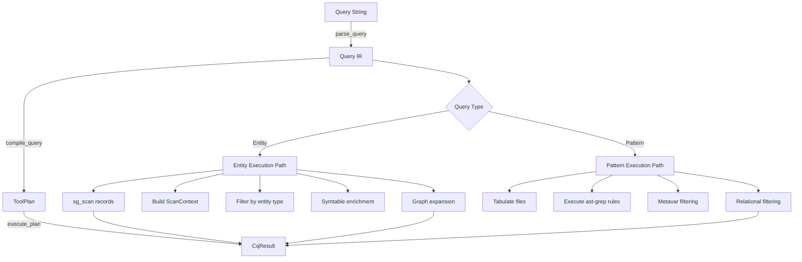

# Query Subsystem Architecture

**Version:** 0.5.0
**Document Status:** Phase 2 (Active)
**Last Updated:** 2026-02-16

## Overview

The CQ query subsystem (`tools/cq/query/`) implements a declarative code query system for Python and Rust codebases. It provides a token-based DSL for expressing semantic code queries that compile to executable plans using ast-grep-py for structural pattern matching.

The subsystem follows a classic compiler architecture with three distinct phases: **parse** (DSL to IR), **compile** (IR to execution plan), and **execute** (plan to results). The system supports two primary query modes: **entity queries** (search by semantic entity type) and **pattern queries** (search by AST structure).

**Key principle:** Dual execution modes with unified IR, multi-language support (Python/Rust), and semantic enrichment via symtable/bytecode analysis.

## Module Map

| Module | Responsibility | Lines | Key Types |
|--------|---------------|-------|-----------|
| `ir.py` | Query intermediate representation type definitions | 765 | `Query`, `PatternSpec`, `RelationalConstraint`, `CompositeRule`, `Scope`, `Expander`, `MetaVarCapture`, `MetaVarFilter`, `NthChildSpec`, `ScopeFilter`, `DecoratorFilter`, `JoinConstraint` |
| `parser.py` | Query DSL tokenization and parsing to IR | 992 | `parse_query()`, `_tokenize()`, `_EntityQueryState`, `_PatternQueryState` |
| `planner.py` | IR compilation to executable ToolPlan | 660 | `compile_query()`, `ToolPlan`, `AstGrepRule` |
| `executor.py` | Plan execution and result generation | 3,446 | `execute_plan()`, `ScanContext`, `EntityCandidates`, entity/pattern handlers |
| `entity_front_door.py` | Entity front-door insight assembly | 467 | `attach_entity_front_door_insight()`, `EntitySemanticTelemetry`, `CandidateNeighborhood` |
| `enrichment.py` | Symtable/bytecode enrichment | 629 | `SymtableEnricher`, `BytecodeInfo`, `SymtableInfo` |
| `language.py` | Multi-language scope resolution and path mapping | 310 | `QueryLanguage`, `QueryLanguageScope`, extension mappings, glob constraining |
| `batch.py` | Batch query execution with shared scans | 142 | `BatchEntityQuerySession`, `build_batch_session()` |
| `batch_spans.py` | Batch relational span collection | 122 | `collect_span_filters()` |
| `merge.py` | Multi-language result merging (auto-scope) | 205 | `merge_auto_scope_query_results()`, capability diagnostics |
| `metavar.py` | Metavariable parsing and filtering | 162 | `parse_metavariables()`, `apply_metavar_filters()`, `validate_pattern_metavars()` |
| `symbol_resolver.py` | Symbol resolution and import tracking | 484 | `SymbolTable`, `SymbolKey`, `ImportBinding` |
| `sg_parser.py` | ast-grep parser and file inventory | 409 | `sg_scan()`, `list_scan_files()`, `FileInventoryCacheV1` |
| `execution_requests.py` | Request payloads for shared execution | 67 | `EntityQueryRequest`, `PatternQueryRequest`, `DefQueryContext` |
| `execution_context.py` | Bundled execution context | 27 | `QueryExecutionContext` |

**Total LOC:** ~9,024 lines (16 modules)

## CLI Entry Point

Location: `/Users/paulheyse/CodeAnatomy/tools/cq/cli_app/commands/query.py`

The `q()` function handles query execution with smart fallback: plain identifier queries (no `key=value` tokens) fall back to smart_search, while tokenized queries use the parse-compile-execute pipeline. Token detection pattern: `([\w.]+|\$+\w+)=(?:'([^']+)'|"([^"]+)"|([^\s]+))`

## Architecture Overview

The query subsystem implements a three-stage compiler pipeline:



## Query DSL Grammar

The query language supports two primary modes: **entity queries** (search by semantic entity type) and **pattern queries** (search by AST structure).

### Token Categories

All queries use `key=value` token pairs. Values may be quoted for strings with spaces.

#### Core Tokens

| Token | Purpose | Example |
|-------|---------|---------|
| `entity=<type>` | Entity type filter | `entity=function`, `entity=class` |
| `name=<pattern>` | Name filter (prefix `~` for regex) | `name=foo`, `name=~^build.*` |
| `pattern='<ast-pattern>'` | Structural pattern match | `pattern='def $F($$$)'` |
| `in=<dir>` | Directory scope | `in=src/` |
| `exclude=<glob>` | Exclusion pattern | `exclude=tests/**` |
| `expand=<kind>(depth=N)` | Graph expansion | `expand=callers(depth=2)` |
| `fields=<f1>,<f2>` | Output fields | `fields=def,callers,imports` |
| `limit=<N>` | Result limit | `limit=10` |
| `explain` | Show plan explanation | `explain=true` |
| `lang=<scope>` | Language scope | `lang=auto`, `lang=python`, `lang=rust` |

#### Entity Types

| Type | Python Mapping | Rust Mapping |
|------|---------------|--------------|
| `function` | `function_definition` | `function_item` |
| `class` | `class_definition` | `struct_item`, `enum_item`, `trait_item` |
| `method` | `function_definition` inside class | `function_item` inside `impl` |
| `module` | `module` | `mod_item` |
| `callsite` | `call` | `call_expression`, `macro_invocation` |
| `import` | `import_statement`, `import_from_statement` | `use_declaration` |
| `decorator` | `decorator` | (not yet supported) |

#### Expander Kinds

| Kind | Records Required | Purpose |
|------|-----------------|---------|
| `callers` | `def`, `call` | Find all call sites to target definitions |
| `callees` | `def`, `call` | Find all calls within target definitions |
| `imports` | `import` | Show imports in files containing targets |
| `raises` | `raise`, `except` | Extract raise/except patterns |
| `scope` | `def` | Analyze closure capture and scope |
| `bytecode_surface` | (none) | Extract bytecode patterns (Python only) |

#### Relational Constraint Tokens

| Token | Semantics | Example |
|-------|-----------|---------|
| `inside='<pattern>'` | Match inside ancestor matching pattern | `inside='class Config'` |
| `has='<pattern>'` | Match containing descendant matching pattern | `has='await $X'` |
| `precedes='<pattern>'` | Match preceding sibling matching pattern | `precedes='return $X'` |
| `follows='<pattern>'` | Match following sibling matching pattern | `follows='if $COND:'` |

**Modifiers**:
- `<op>.stopBy=<mode>` - When to stop search: `neighbor` (default), `end`, or custom pattern
- `<op>.field=<name>` - Constrain search to specific AST field (only `inside`/`has`)

#### Composite Logic Tokens

| Token | Logic | Example |
|-------|-------|---------|
| `all='<p1>,<p2>'` | AND - all patterns must match | `all='await $X,return $Y'` |
| `any='<p1>,<p2>'` | OR - at least one pattern must match | `any='logger.$M,print'` |
| `not='<pattern>'` | NOT - pattern must not match (single pattern only) | `not='pass'` |

#### Scope Filter Tokens

| Token | Purpose | Example |
|-------|---------|---------|
| `scope=<type>` | Scope type filter | `scope=closure` |
| `captures=<var>` | Filter by captured variables | `captures=x` |
| `has_cells=<bool>` | Filter by cell variable presence | `has_cells=true` |

#### Decorator Filter Tokens

| Token | Purpose | Example |
|-------|---------|---------|
| `decorated_by=<name>` | Filter by decorator presence | `decorated_by=property` |
| `decorator_count_min=<N>` | Minimum decorator count | `decorator_count_min=2` |
| `decorator_count_max=<N>` | Maximum decorator count | `decorator_count_max=5` |

#### Metavariable Filter Tokens

Post-filter pattern matches by captured metavariable content.

Syntax: `$<NAME>=~<regex>` or `$<NAME>!=~<regex>`

Examples:
- `$$OP=~'^[<>=]'` - Binary comparison operators only
- `$X!=~debug` - Exclude matches where `$X` captures "debug"

#### Pattern Disambiguation Tokens

For ambiguous patterns that cannot parse standalone.

| Token | Purpose | Example |
|-------|---------|---------|
| `pattern.context='...'` | Surrounding code for parsing | `pattern.context='{ "$K": $V }'` |
| `pattern.selector=<kind>` | Node kind to extract | `pattern.selector=pair` |
| `pattern.strictness=<mode>` | Matching strictness | `pattern.strictness=relaxed` |

**Strictness modes**:
- `cst` - Match all nodes including whitespace
- `smart` - Match all nodes except trivial source nodes (default)
- `ast` - Match only named AST nodes
- `relaxed` - Match AST nodes, ignore comments
- `signature` - Match structure without comparing text

#### Positional Matching Tokens

| Token | Purpose | Example |
|-------|---------|---------|
| `nthChild=<N>` | Exact position (1-indexed) | `nthChild=2` |
| `nthChild='<formula>'` | Formula (e.g., '2n+1' for odd) | `nthChild='2n'` |
| `nthChild.reverse=<bool>` | Count from end | `nthChild.reverse=true` |
| `nthChild.ofRule='<rule>'` | Filter which siblings count | `nthChild.ofRule='kind=identifier'` |

## Query IR (Intermediate Representation)

Location: `/Users/paulheyse/CodeAnatomy/tools/cq/query/ir.py` (765 lines)

The IR layer provides frozen, immutable structs representing parsed queries. All types use `msgspec.Struct` for serialization compatibility and performance.

### Core Types

```python
EntityType = Literal["function", "class", "method", "module", "callsite", "import", "decorator"]
ExpanderKind = Literal["callers", "callees", "imports", "raises", "scope", "bytecode_surface"]
FieldType = Literal["def", "loc", "callers", "callees", "evidence", "imports", "decorators", "decorated_functions"]
StrictnessMode = Literal["cst", "smart", "ast", "relaxed", "signature"]
RelationalOp = Literal["inside", "has", "precedes", "follows"]
CompositeOp = Literal["all", "any", "not"]
MetaVarKind = Literal["single", "multi", "unnamed"]
```

### Key Structs

**Query** - Top-level parsed query (Line 100-180)
- Must specify either `entity` OR `pattern_spec` (mutually exclusive, validated in `__post_init__`)
- Fields: entity, name, expand, scope, fields, limit, explain, pattern_spec, relational, scope_filter, decorator_filter, joins, metavar_filters, composite, nth_child, lang_scope
- Methods:
  - `is_pattern_query` (property) - Returns True if pattern_spec present
  - `primary_language` (property) - Resolves concrete language from lang_scope

**PatternSpec** - Pattern specification with disambiguation (Line 245-290)
- Fields: pattern, context (for ambiguous patterns), selector (node kind to extract), strictness
- Methods:
  - `requires_yaml_rule()` - Returns True if context, selector, or non-smart strictness present
  - `to_yaml_dict()` - Converts to ast-grep YAML format

**RelationalConstraint** - Structural relationship (Line 295-340)
- Fields: operator (inside/has/precedes/follows), pattern, stop_by (neighbor/end/custom), field_name (only valid for inside/has)
- Methods:
  - `to_ast_grep_dict()` - Converts to ast-grep rule format
  - Validates field_name only for inside/has operators

**CompositeRule** - Boolean composition (Line 345-390)
- Fields: operator (all/any/not), patterns (tuple), metavar_order (optional)
- Methods:
  - `to_ast_grep_dict()` - Converts to ast-grep rule format
  - Validates 'not' has single pattern

**Expander** - Graph expansion operator (Line 50-65)
- Fields: kind (ExpanderKind), depth (≥1, enforced by msgspec.Meta)

**Scope** - File scope constraints (Line 70-85)
- Fields: in_dir, exclude (tuple), globs (tuple)

**MetaVarCapture** - Captured metavariable (Line 400-430)
- Fields: name, kind (single/multi/unnamed), text, nodes (list for multi captures)

**MetaVarFilter** - Metavariable post-filter (Line 435-465)
- Fields: name, pattern (regex), negate (bool)
- Methods:
  - `matches(capture)` - Applies regex filter to capture text with optional negation

**ScopeFilter** - Symtable-based scope filtering (Line 470-495)
- Fields: scope_type (closure/toplevel), captures (tuple), has_cells (bool)

**DecoratorFilter** - Decorator-based filtering (Line 500-525)
- Fields: decorated_by (name pattern), decorator_count_min, decorator_count_max

**JoinConstraint** - Cross-entity joins (Line 530-560)
- Fields: target (JoinTarget), entity_name, entity_type
- Target types: `used_by`, `defines`, `raises`, `exports`

**NthChildSpec** - Positional matching (Line 565-595)
- Fields: position (int or formula), reverse (bool), of_rule (optional filter)

## Query Parser

Location: `/Users/paulheyse/CodeAnatomy/tools/cq/query/parser.py` (992 lines)

The parser converts query strings to Query IR using a stateful token handler pattern.

### Parsing Pipeline

```python
def parse_query(query_string: str) -> Query:
    """Parse query string to Query IR.

    Dispatch based on query type (pattern vs entity vs composite).
    """
    tokens = _tokenize(query_string)

    # Composite rule handling
    if "all" in tokens or "any" in tokens or "not" in tokens:
        if "pattern" in tokens or "pattern.context" in tokens:
            return _parse_pattern_query(tokens)
        # Top-level composite desugars to pattern envelope
        return _parse_composite_as_pattern(tokens)

    # Pattern vs entity dispatch
    if "pattern" in tokens or "pattern.context" in tokens:
        return _parse_pattern_query(tokens)
    return _parse_entity_query(tokens)
```

### Tokenization

The `_tokenize()` function uses regex to extract key-value pairs (Line 50-85):

```python
pattern = r"([\w.]+|\$+\w+)=(?:'([^']+)'|\"([^\"]+)\"|([^\s]+))"
```

This pattern handles:
- Dot-notation keys: `pattern.context`, `inside.stopBy`
- Metavar filter keys: `$NAME`, `$$NAME`, `$$$NAME`
- Single-quoted strings: `'value with spaces'`
- Double-quoted strings: `"another value"`
- Unquoted values: `value`

### State-Based Parsing

Entity queries use `_EntityQueryState` (Line 120-160) and pattern queries use `_PatternQueryState` (Line 165-200) to accumulate parsed components.

Token handlers process tokens in defined order:
```python
_ENTITY_HANDLER_ORDER = ("name", "expand", "scope", "fields", "limit", "explain", "lang")
```

Each handler mutates the state object. After all handlers run, the state builds the final `Query` object.

### Expander Parsing

Handles complex expander syntax like `callers(depth=2),callees` (Line 300-350):
1. Split by comma, respecting nested parentheses
2. Parse each part: `kind(depth=N)` or just `kind`
3. Validate expander kind and extract depth parameter (default=1)
4. Build Expander tuple

### Relational Constraint Parsing

Supports both dot notation and global fallbacks (Line 400-480):
- Try `{op}.stopBy` first (e.g., `inside.stopBy`)
- Fall back to `{op}_stop_by` (legacy underscore notation)
- Fall back to global `stopBy` token
- Same pattern for `field` modifiers

### Metavariable Filter Parsing

Extracts metavar filter tokens (Line 550-620):
1. Identify tokens matching `$NAME=~pattern` or `$NAME!=~pattern`
2. Extract metavar name (strip `$` prefix)
3. Extract regex pattern
4. Build MetaVarFilter with negate flag
5. Validate against pattern metavars if pattern_spec present

### Composite Rule Parsing

Handles `all`/`any`/`not` operators (Line 650-720):
1. Extract operator from tokens
2. Parse comma-separated pattern list
3. Build CompositeRule with operator and patterns
4. For top-level composites without pattern, desugar to pattern envelope with `$X` placeholder

## Query Planner

Location: `/Users/paulheyse/CodeAnatomy/tools/cq/query/planner.py` (660 lines)

The planner compiles Query IR into an executable ToolPlan that specifies which tools to run and how.

### ToolPlan Structure

```python
class ToolPlan(msgspec.Struct, frozen=True):
    """Executable query plan compiled from Query IR.

    Specifies record types, tool requirements, expansion operations,
    and ast-grep rules for execution.
    """
    scope: Scope
    sg_record_types: frozenset[str]  # e.g., {"def", "call", "import"}
    need_symtable: bool  # For scope/callers/callees analysis
    need_bytecode: bool  # For bytecode_surface expander
    expand_ops: tuple[Expander, ...]
    explain: bool
    sg_rules: tuple[AstGrepRule, ...]
    is_pattern_query: bool
    lang: QueryLanguage  # Concrete language ("python" or "rust")
    lang_scope: QueryLanguageScope  # User scope ("auto", "python", "rust")
```

### AstGrepRule Structure

```python
class AstGrepRule(msgspec.Struct, frozen=True):
    """ast-grep rule specification.

    Combines pattern matching with relational constraints and
    disambiguation options.
    """
    pattern: str
    kind: str | None  # AST node kind constraint
    context: str | None  # Surrounding code for parsing
    selector: str | None  # Node kind to extract
    strictness: StrictnessMode
    inside: str | None  # Relational: inside ancestor
    has: str | None  # Relational: contains descendant
    precedes: str | None  # Relational: precedes sibling
    follows: str | None  # Relational: follows sibling
    inside_stop_by: str | None
    has_stop_by: str | None
    inside_field: str | None
    has_field: str | None
    composite: CompositeRule | None
    nth_child: NthChildSpec | None

    def requires_inline_rule(self) -> bool:
        """Return True if features beyond simple pattern present."""
        # True if context, selector, strictness != smart, or relational constraints

    def to_yaml_dict(self) -> dict[str, object]:
        """Convert to ast-grep YAML format."""
```

### Compilation Strategy

```python
def compile_query(query: Query) -> ToolPlan:
    """Compile Query IR to executable ToolPlan.

    Dispatch:
    - Pattern queries → _compile_pattern_query
    - Entity queries → _compile_entity_query
    """
    if query.is_pattern_query:
        return _compile_pattern_query(query)
    return _compile_entity_query(query)
```

**Entity Query Compilation** (Line 150-250):
1. Determine required record types via `_determine_record_types()` - union of:
   - Entity type records (e.g., function → `{"def"}`)
   - Expander records (e.g., callers → `{"def", "call"}`)
   - Field records (e.g., imports → `{"import"}`)
2. Check if symtable needed - True for scope expander, callers/callees expanders, or scope_filter present
3. Check if bytecode needed - True for bytecode_surface expander or evidence field
4. Generate ast-grep rules from relational constraints (if present)
5. Resolve concrete language from lang_scope

**Pattern Query Compilation** (Line 260-320):
1. Build AstGrepRule from PatternSpec
2. Apply relational constraints via `_apply_relational_constraints()`
3. Set empty sg_record_types (not using standard record scanning)
4. Mark `is_pattern_query=True`
5. Resolve concrete language from lang_scope

### Record Type Inference

```python
_ENTITY_RECORDS: dict[str, set[str]] = {
    "function": {"def"},
    "class": {"def"},
    "method": {"def"},
    "module": {"def"},
    "callsite": {"call"},
    "import": {"import"},
    "decorator": {"def"},
}

_EXPANDER_RECORDS: dict[str, set[str]] = {
    "callers": {"def", "call"},
    "callees": {"def", "call"},
    "imports": {"import"},
    "raises": {"raise", "except"},
    "scope": {"def"},
}
```

### Multi-Language Rule Generation

For Rust queries, `_rust_entity_to_ast_grep_rules()` generates language-specific rules (Line 380-480):

```python
if entity == "class":
    # Rust types map to struct/enum/trait
    type_kinds = ("struct_item", "enum_item", "trait_item")
    return tuple(
        _apply_relational_constraints(AstGrepRule(pattern="$TYPE", kind=kind), query.relational)
        for kind in type_kinds
    )

if entity == "method":
    # Rust methods are function_item nodes inside impl blocks
    base = AstGrepRule(pattern="$METHOD", kind="function_item", inside="impl $TYPE { $$$ }")
    return (_apply_relational_constraints(base, query.relational),)

if entity == "callsite":
    # Rust callsites: function calls and macro invocations
    call_kinds = ("call_expression", "macro_invocation")
    return tuple(
        _apply_relational_constraints(AstGrepRule(pattern="$CALL", kind=kind), query.relational)
        for kind in call_kinds
    )
```

For Python queries, `_python_entity_to_ast_grep_rules()` generates Python-specific rules (Line 350-375):

```python
if entity in ("function", "class", "method", "module"):
    return (_apply_relational_constraints(
        AstGrepRule(pattern="$DEF", kind=None), query.relational
    ),)

if entity == "callsite":
    return (_apply_relational_constraints(
        AstGrepRule(pattern="$CALL", kind="call"), query.relational
    ),)

if entity == "import":
    return (_apply_relational_constraints(
        AstGrepRule(pattern="$IMPORT", kind=None), query.relational
    ),)
```

### Relational Constraint Compilation

Merges relational constraints into AstGrepRule (Line 500-580):
1. Build `_RelationalState` with current rule constraints
2. Apply each constraint via `_apply_relational_constraint()`:
   - Extract operator, pattern, stop_by, field
   - Update state with constraint
   - Apply stop_by heuristic (class/function patterns use `stop_by="end"`)
3. Merge state back into rule via `_merge_relational_state()`

**Heuristic:** For class/function `inside` constraints, use `stop_by="end"` to search to root rather than stopping at nearest neighbor.

## Query Executor

Location: `/Users/paulheyse/CodeAnatomy/tools/cq/query/executor.py` (3,446 lines)

The executor implements the runtime that executes ToolPlans and produces CqResult objects. It handles two execution paths: entity queries and pattern queries.

### Execution Entry Point

```python
def execute_plan(
    plan: ToolPlan,
    query: Query,
    tc: Toolchain,
    root: Path,
    argv: list[str] | None = None,
    query_text: str | None = None,
) -> CqResult:
    """Execute compiled ToolPlan and return CqResult.

    Multi-language queries (lang_scope="auto") execute both Python
    and Rust paths, then merge results.
    """
    if query.lang_scope == "auto":
        # Multi-language execution with result merging
        return _execute_auto_scope_plan(query, tc=tc, root=root, argv=argv or [], query_text=query_text)

    # Single-language execution
    ctx = QueryExecutionContext(
        plan=plan, query=query, tc=tc, root=root,
        argv=argv or [], started_ms=ms(), query_text=query_text
    )
    return _execute_single_context(ctx)
```

### Entity Query Execution Flow

**Preparation Phase** (`_prepare_entity_state()`, Line 450-580):
1. Validate ast-grep availability via toolchain
2. Resolve paths from scope constraints via `scope_to_paths()`
3. Scan records via `sg_scan()` - runs ast-grep for required record types
4. Build scan context via `_build_scan_context()` - creates interval index, assigns calls to defs
5. Build entity candidates via `_build_entity_candidates()` - partitions by record type
6. Apply rule spans via `_apply_rule_spans()` - filters candidates using relational constraint matches

**Execution Phase** (`_execute_entity_query()`, Line 600-720):
1. Build result structure with RunMeta
2. Apply entity-specific handlers via `_apply_entity_handlers()`
3. Add file scan statistics
4. Add explain metadata if requested
5. Finalize multi-language summary if needed
6. Attach front-door insight for entity queries

### ScanContext Structure

```python
@dataclass
class ScanContext:
    """Shared scan context for entity query execution.

    Provides spatial indices for efficient containment queries
    and pre-computed call-to-def mappings.
    """
    def_records: list[SgRecord]  # All definition records
    call_records: list[SgRecord]  # All call records
    interval_index: IntervalIndex[SgRecord]  # Spatial index for containment queries
    file_index: FileIntervalIndex  # Per-file interval indices
    calls_by_def: dict[SgRecord, list[SgRecord]]  # Call assignment
    all_records: list[SgRecord]  # All records
```

The interval indices enable O(log n) containment queries for finding which definition contains a given call or other record.

### EntityCandidates Structure

```python
@dataclass
class EntityCandidates:
    """Partitioned entity candidates by record type.

    Pre-filtered by record type for efficient entity-specific handling.
    """
    def_records: list[SgRecord]  # Function/class/method definitions
    import_records: list[SgRecord]  # Import statements
    call_records: list[SgRecord]  # Call sites
```

### Entity Handler Dispatch

```python
if query.entity == "import":
    _process_import_query(candidates.import_records, query, result, root, symtable=symtable)
elif query.entity == "decorator":
    _process_decorator_query(state.scan, query, result, root, candidates.def_records)
elif query.entity == "callsite":
    _process_call_query(state.scan, query, result, root)
else:
    # function, class, method, module
    _process_def_query(def_ctx, query, candidates.def_records)
```

### Definition Query Processing

The `_process_def_query()` function implements the core definition handler (Line 900-1150):

1. Filter candidates by name pattern via `_filter_to_matching()`
2. Convert records to findings via `_def_to_finding()`
3. Apply scope filter if present (closure detection via symtable)
4. Build sections for requested fields:
   - `callers` section: Find all calls to these definitions
   - `callees` section: Extract calls within these definitions
   - `imports` section: Show imports in files containing these definitions
5. Append expander sections (raises, scope, bytecode_surface)

### Pattern Query Execution Flow

**Preparation Phase** (`_prepare_pattern_state()`, Line 1200-1280):
1. Validate ast-grep availability
2. Resolve paths from scope
3. Tabulate files via `_tabulate_scope_files()` - applies extension filtering and glob rules
4. Return error if no files match

**Execution Phase** (`_execute_pattern_query()`, Line 1300-1420):
1. Execute ast-grep rules via `_execute_ast_grep_rules()`
2. Build result with findings
3. Apply scope filter if present (symtable enrichment)
4. Apply metavar filters if present
5. Apply limit if specified
6. Add file scan statistics and explain metadata

### AST-Grep Rule Execution

The `_execute_ast_grep_rules()` function uses ast-grep-py directly (Line 1450-1680):

1. Create execution context with rules, paths, root, query, language
2. For each file path:
   - Read source text
   - Parse with SgRoot
   - For each rule:
     - Iterate matches via `_iter_rule_matches()`
     - Build match data with rule_id and relative path
     - Apply filters (scope, metavar)
     - Convert to finding and record
     - Apply metavar details
     - Append to results
3. Return findings, records, raw matches

**Match iteration** (`_iter_rule_matches()`, Line 1700-1820):
- Handle simple patterns vs YAML rules (requires_inline_rule)
- For YAML rules, write temporary rule file and use `node.find()`
- For simple patterns, use `node.find()` directly
- Extract metavariable captures from match environment

### Multi-Language Execution

The `_execute_auto_scope_plan()` function orchestrates parallel language execution (Line 1850-1950):

1. Execute by language scope via `execute_by_language_scope()`:
   - Compile Python-scoped query
   - Execute Python plan
   - Compile Rust-scoped query
   - Execute Rust plan
2. Each language runs independently with scoped queries
3. Results merged via `merge_auto_scope_query_results()` with cross-language diagnostics

### Relational Span Collection

For entity queries with relational constraints, `_collect_match_spans()` pre-computes spans (Line 2000-2100):

1. Tabulate files for language scope
2. Collect ast-grep match spans via `_collect_ast_grep_match_spans()`:
   - Parse each file with SgRoot
   - Execute rules and extract match byte ranges
   - Build AstGrepMatchSpan for each match
3. Filter by metavariable constraints if present
4. Group by file

The `_filter_records_by_spans()` function then filters entity candidates to those overlapping matched spans (Line 2120-2180).

### Caller/Callee Analysis

**Callers** (`_build_callers_section()`, Line 2200-2450):
1. Build target context via `_build_call_target_context()`:
   - Extract target names from definitions
   - Classify as function vs method (based on enclosing class)
   - Build class-to-method mapping for qualified lookup
2. Collect call contexts via `_collect_call_contexts()`:
   - Iterate all call records
   - Extract call target and receiver
   - Check if call matches target (handles `self.method()` vs `func()` disambiguation)
3. Build evidence map via `_build_def_evidence_map()`:
   - Enrich containing definitions with symtable/bytecode info
4. Build caller findings with evidence attachment

**Callees** (`_build_callees_section()`, Line 2480-2580):
1. Iterate target definitions
2. Extract calls within each definition (from `calls_by_def` mapping)
3. Build callee findings with evidence

### Scope Enrichment

The `_build_scope_section()` function provides closure analysis using SymtableEnricher (Line 2600-2720):
- Enrich each function finding with scope info
- Extract free_vars, cell_vars from symtable analysis
- Label as "closure" or "toplevel" based on `is_closure` flag
- Attach scope details to findings

### Bytecode Surface Analysis

The `_build_bytecode_surface_section()` function extracts bytecode patterns (Line 2740-2840):
- Enrich target definitions with bytecode info via `enrich_records()`
- Extract load_globals, load_attrs, call_functions from BytecodeInfo
- Build findings with bytecode details attached

## Entity Front-Door Insight Assembly

Location: `/Users/paulheyse/CodeAnatomy/tools/cq/query/entity_front_door.py` (467 lines)

The entity front-door module builds and attaches `FrontDoorInsightV1` cards to entity query results, providing target identity, neighborhood preview, risk assessment, and confidence scoring.

### Purpose

Entity queries need a structured summary that captures:
- **Target Identity** - What was found (definitions, primary candidate)
- **Neighborhood Context** - Immediate relationships (callers, callees, scope)
- **Risk Indicators** - Complexity signals (relationship counts, closure captures)
- **Confidence Metrics** - Evidence quality and completeness
- **Degradation Signals** - LSP/semantic availability, budget constraints, language gaps

The front-door insight provides this in a canonical `FrontDoorInsightV1` contract that downstream tooling (formatters, UIs) can consume without re-parsing entity-specific fields.

### Integration Point

The executor calls `attach_entity_front_door_insight()` after entity query execution completes (Line 80-140):

```python
# In executor.py, after building entity result
if not query.is_pattern_query:
    attach_entity_front_door_insight(
        result,
        relationship_detail_max_matches=RELATIONSHIP_DETAIL_MAX_MATCHES,
    )
```

### Integration Flow

1. Extract definition findings from `result.key_findings`
2. Build candidate neighborhood from top 3 definitions via `_build_candidate_neighborhood()`
3. Compute risk from neighborhood counters (callers, callees, scope) via `risk_from_counters()`
4. Build degradation status from result summary via `_build_degradation()`
5. Build base insight via `build_entity_insight()`
6. Execute language-aware semantic enrichment for candidates (budget-gated)
7. Derive semantic contract state from telemetry
8. Mark partial slices for missing languages
9. Attach insight to `result.summary["front_door_insight"]`

### Supporting Structs

**EntitySemanticTelemetry** (Line 180-210):
```python
@dataclass(slots=True)
class EntitySemanticTelemetry:
    """Telemetry for semantic enrichment operations."""
    semantic_attempted: int = 0
    semantic_applied: int = 0
    semantic_failed: int = 0
    semantic_timed_out: int = 0
    semantic_provider: SemanticProvider = "none"
    py_attempted: int = 0
    py_applied: int = 0
    py_failed: int = 0
    py_timed_out: int = 0
    rust_attempted: int = 0
    rust_applied: int = 0
    rust_failed: int = 0
    rust_timed_out: int = 0
    reasons: list[str] = dataclass_field(default_factory=list)
```

**CandidateNeighborhood** (Line 220-240):
```python
@dataclass(slots=True)
class CandidateNeighborhood:
    """Neighborhood data for entity candidates."""
    primary_target: Finding | None
    candidates: list[Finding]
    neighborhood: InsightNeighborhoodV1
    confidence: InsightConfidenceV1
```

### Neighborhood Building

Aggregates heuristic data from definition findings (Line 260-340):

**Callers slice**:
- Sum `caller_count` from all candidates
- Build preview nodes for candidates with callers

**Callees slice**:
- Sum `callee_count` from all candidates
- Build preview nodes for candidates with callees

**Hierarchy/scope slice**:
- Extract unique `enclosing_scope` values from candidates
- Filter out empty and `<module>` scopes
- Build preview nodes sorted by scope name

**Result**: `InsightNeighborhoodV1` with four canonical slices (callers, callees, references, hierarchy_or_scope).

### Semantic Enrichment Integration

**Language-aware routing** (Line 350-420):
1. For each candidate finding:
   - Resolve target context (file, language)
   - Skip if context unresolved
   - Enrich via language-specific adapter (Python → pyrefly, Rust → rust-analyzer)
   - Augment insight with semantic data (preview_per_slice=5)

**Provider mapping**:
- Python files (`.py`, `.pyi`) → `python_static` provider (pyrefly)
- Rust files (`.rs`) → `rust_static` provider (rust-analyzer)

**Budget controls**:
- Semantic enrichment skipped when `match_count > relationship_detail_max_matches`
- Semantic enrichment skipped when `semantic_runtime_enabled()` returns False
- Per-candidate semantic requests use `budget_for_mode("entity")` timeouts

### Semantic Contract State Derivation

Canonical semantic status embedded in insight degradation (Line 430-467):

```python
semantic_state = derive_semantic_contract_state(
    SemanticContractStateInputV1(
        provider=telemetry.semantic_provider,
        available=telemetry.semantic_provider != "none",
        attempted=telemetry.semantic_attempted,
        applied=telemetry.semantic_applied,
        failed=max(
            telemetry.semantic_failed,
            telemetry.semantic_attempted - telemetry.semantic_applied
        ),
        timed_out=telemetry.semantic_timed_out,
        reasons=tuple(dict.fromkeys(telemetry.reasons)),
    )
)

insight = msgspec.structs.replace(
    insight,
    degradation=msgspec.structs.replace(
        insight.degradation,
        semantic=semantic_state.status,
        notes=tuple(dict.fromkeys([*insight.degradation.notes, *semantic_state.reasons])),
    ),
)
```

**Output**: Canonical `SemanticStatus` embedded in `insight.degradation.semantic` field.

### Confidence Scoring

Confidence derived from finding score metadata (Line 145-175):

```python
def _confidence_from_candidates(candidates: list[Finding]) -> InsightConfidenceV1:
    confidence = InsightConfidenceV1(evidence_kind="resolved_ast", score=0.8, bucket="high")
    for finding in candidates:
        score = finding.details.score
        if score is None:
            continue
        return InsightConfidenceV1(
            evidence_kind=score.evidence_kind or confidence.evidence_kind,
            score=float(score.confidence_score) if score.confidence_score is not None else 0.8,
            bucket=score.confidence_bucket or confidence.confidence_bucket,
        )
    return confidence
```

### Degradation Status Building

Captures scan issues, scope filtering, and budget constraints (Line 245-285):

```python
def _build_degradation(summary: dict[str, object]) -> InsightDegradationV1:
    dropped = summary.get("dropped_by_scope")
    scope_filter_status = "dropped" if isinstance(dropped, dict) and dropped else "none"
    notes: list[str] = []
    if isinstance(dropped, dict) and dropped:
        notes.append(f"dropped_by_scope={dropped}")
    return InsightDegradationV1(
        semantic="skipped",  # Updated later by semantic contract state
        scan=(
            "timed_out"
            if bool(summary.get("timed_out"))
            else "truncated"
            if bool(summary.get("truncated"))
            else "ok"
        ),
        scope_filter=scope_filter_status,
        notes=tuple(notes),
    )
```

### Cross-Reference

**FrontDoor Insight V1 Contract**: See [06_output_schema.md § FrontDoor Insight V1](06_output_schema.md#frontdoor-insight-v1) for the complete schema specification.

**Bootstrap integration**: Entity queries invoke `resolve_runtime_services()` to obtain `EntityService` for entity scan caching via `QueryEntityScanCacheV1`.

**See also**: [10_runtime_services.md](10_runtime_services.md) for runtime services documentation.

## Batch Query Execution

Location: `/Users/paulheyse/CodeAnatomy/tools/cq/query/batch.py` (142 lines)

For multi-query workflows (e.g., `cq run`), batch execution amortizes parse and scan costs by sharing ast-grep scans across multiple queries.

### BatchEntityQuerySession Structure

```python
@dataclass(frozen=True)
class BatchEntityQuerySession:
    """Shared scan session for multiple entity queries.

    Provides pre-scanned records and scan context that can be
    reused across multiple queries with different filters.
    """
    root: Path
    tc: Toolchain
    files: list[Path]
    files_by_rel: dict[str, Path]
    records: list[SgRecord]
    scan: ScanContext
    candidates: EntityCandidates
    symtable: SymtableEnricher
```

### Session Building

The `build_batch_session()` function creates a shared scan session (Line 40-120):

1. Tabulate files via `list_scan_files()`
2. Index files by relative path
3. Scan records:
   - Normalize record types
   - Get rules for types
   - Scan files with rules
   - Filter by record types
4. Build scan context via `_build_scan_context()`
5. Build entity candidates via `_build_entity_candidates()`
6. Return session with shared symtable enricher

### Scope Filtering

The `filter_files_for_scope()` function filters pre-scanned files by scope constraints (Line 125-142):

1. Resolve scope paths via `scope_to_paths()`
2. Return empty set if no paths
3. Extract globs via `scope_to_globs()`
4. For each file:
   - Check if within scope paths
   - Check if matches globs (if present)
   - Add relative path to allowed set
5. Return allowed paths

## Multi-Language Result Merging

Location: `/Users/paulheyse/CodeAnatomy/tools/cq/query/merge.py` (205 lines)

The merge module implements canonical auto-scope result merging for multi-language queries.

### Merge Strategy

The `merge_auto_scope_query_results()` function merges per-language results (Line 50-180):

1. Build cross-language diagnostics via `build_cross_language_diagnostics()`:
   - Count Python and Rust matches
   - Detect if query is Python-oriented
   - Generate diagnostic messages
2. Add capability diagnostics via `build_capability_diagnostics()`:
   - Extract features from query
   - Check feature support per language
   - Generate capability warnings
3. Merge results via `merge_language_cq_results()`:
   - Combine findings from all languages
   - Merge run metadata
   - Attach diagnostics and payloads
4. Attach front-door insight for entity queries:
   - Check if insight already present (from individual language)
   - If not, resolve runtime services and attach fresh insight
   - Mark partial slices for missing languages

### Semantic Telemetry Merging

The `_merge_semantic_contract_inputs()` function aggregates per-language telemetry (Line 185-205):

```python
py_attempted, py_applied, py_failed, py_timed_out = _coerce_semantic_telemetry(
    summary.get("python_semantic_telemetry")
)
rust_attempted, rust_applied, rust_failed, rust_timed_out = _coerce_semantic_telemetry(
    summary.get("rust_semantic_telemetry")
)

provider = "none"
if rust_attempted > 0 and py_attempted <= 0:
    provider = "rust_static"
elif py_attempted > 0:
    provider = "python_static"

attempted = py_attempted + rust_attempted
applied = py_applied + rust_applied
failed = py_failed + rust_failed
timed_out = py_timed_out + rust_timed_out
```

This creates a unified semantic contract input for cross-language insights.

## Symbol Resolution

Location: `/Users/paulheyse/CodeAnatomy/tools/cq/query/symbol_resolver.py` (484 lines)

The symbol resolver builds symbol tables and resolves references across files for advanced query features.

### SymbolTable Structure

```python
@dataclass
class SymbolTable:
    """Symbol table for a codebase.

    Provides resolution of names to definitions and tracking of imports.
    """
    # Mapping from symbol key to definition record
    definitions: dict[str, SgRecord] = field(default_factory=dict)

    # Mapping from (file, local_name) to import binding
    imports: dict[tuple[str, str], ImportBinding] = field(default_factory=dict)

    # Unresolved references with reasons
    unresolved: list[tuple[str, str]] = field(default_factory=list)
```

### Symbol Key Format

```python
@dataclass
class SymbolKey:
    """Unique identifier for a symbol.

    Format: module_path:qualname
    Example: src/cli/app:meta_launcher
    """
    module_path: str
    qualname: str

    def __str__(self) -> str:
        return f"{self.module_path}:{self.qualname}"
```

### Import Tracking

```python
@dataclass
class ImportBinding:
    """Represents an import binding.

    Tracks what name is bound and where it comes from.
    """
    local_name: str  # Name as used in this module
    source_module: str  # Module imported from
    source_name: str | None  # Original name if different (for 'as' imports)
    is_from_import: bool  # True for 'from x import y'
```

### Resolution Algorithm

The `resolve()` method implements name resolution (Line 120-180):

```python
def resolve(self, file: str, name: str) -> SgRecord | None:
    """Resolve a name reference to its definition.

    Resolution order:
    1. Check import bindings
    2. Check local definitions in same module
    3. Track as unresolved
    """
    # Check if it's an imported name
    binding = self.imports.get((file, name))
    if binding:
        return self._resolve_import(binding)

    # Try local definitions in same module
    module_path = _file_to_module_path(file)
    key = f"{module_path}:{name}"
    if key in self.definitions:
        return self.definitions[key]

    # Track as unresolved
    self.unresolved.append((file, name))
    return None
```

## AST-Grep Parser and File Inventory

Location: `/Users/paulheyse/CodeAnatomy/tools/cq/query/sg_parser.py` (409 lines)

The sg_parser module provides ast-grep-py integration with cache-backed file inventory.

### sg_scan Function

```python
def sg_scan(
    paths: list[Path],
    record_types: Iterable[str] | Iterable[RecordType] | None = None,
    root: Path | None = None,
    globs: list[str] | None = None,
    lang: QueryLanguage = DEFAULT_QUERY_LANGUAGE,
) -> list[SgRecord]:
    """Run ast-grep-py scan and return parsed records.

    Pipeline:
    1. Tabulate files (with caching)
    2. Build ast-grep rules
    3. Scan files
    4. Filter by record types
    """
    # 1. Tabulate files (with caching)
    files = _tabulate_scan_files(paths, root, globs, lang=lang)

    # 2. Build ast-grep rules
    normalized_record_types = normalize_record_types(record_types)
    rules = get_rules_for_types(normalized_record_types, lang=lang)

    # 3. Scan files
    records = scan_files(files, rules, root, lang=lang)

    # 4. Filter by record types
    return filter_records_by_type(records, normalized_record_types)
```

### File Inventory Caching

The `_tabulate_scan_files()` function implements cache-backed file inventory (Line 180-320):

1. Resolve scope via `resolve_scope()`:
   - List files via `_list_files_for_inventory()`
   - Generate inventory token via `_inventory_token_for_root()`
2. Build cache key via `build_cache_key()`:
   - Namespace: "file_inventory"
   - Version: "v1"
   - Workspace: scope.root
   - Language: scope.language
   - Target: scope.scope_hash or scope.language
   - Extras: scope_globs, inventory_token
3. Read from cache if enabled:
   - Deserialize FileInventoryCacheV1 payload
   - Validate inventory token (file count stability)
   - Return cached files if valid
4. Tabulate files from resolved scope
5. Write to cache if enabled:
   - Serialize FileInventoryCacheV1 payload
   - Store with cache key

**Cache payload**:
```python
class FileInventoryCacheV1(CqStruct, frozen=True):
    """Cached file inventory payload for ast-grep scans."""
    files: list[str]
    snapshot_digest: str = ""
    inventory_token: dict[str, int] = msgspec.field(default_factory=dict)
```

## Batch Span Collection

Location: `/Users/paulheyse/CodeAnatomy/tools/cq/query/batch_spans.py` (122 lines)

For multi-query workflows (e.g., `cq run`), batch span collection amortizes parse costs by reusing parsed AST trees across queries.

### Collection Strategy

The `collect_span_filters()` function implements shared parsing (Line 30-90):

```python
per_query: list[list[AstGrepMatchSpan]] = [[] for _ in queries]
rule_sets = [plan.sg_rules if plan.sg_rules else () for plan in plans]
query_langs: list[QueryLanguage] = [query.primary_language for query in queries]

for file_path in files:
    _collect_file_matches(
        file_path=file_path,
        root=root,
        rule_sets=rule_sets,
        query_langs=query_langs,
        per_query=per_query,
    )

return _build_spans_by_query(per_query=per_query, queries=queries)
```

### Per-File Matching

The `_collect_file_matches()` function caches SgRoot by language (Line 95-122):

```python
roots_by_lang: dict[QueryLanguage, SgNode] = {}

for idx, rules in enumerate(rule_sets):
    if not rules:
        continue
    lang = query_langs[idx]
    if file_path.suffix not in file_extensions_for_language(lang):
        continue

    # Cache parsed tree per language
    if lang not in roots_by_lang:
        roots_by_lang[lang] = SgRoot(src, lang).root()
    node = roots_by_lang[lang]

    for rule in rules:
        for match in _iter_rule_matches_for_spans(node, rule):
            per_query[idx].append(AstGrepMatchSpan(...))
```

This ensures a file with Python and Rust queries is parsed once per language, not once per query.

## Enrichment Subsystem

Location: `/Users/paulheyse/CodeAnatomy/tools/cq/query/enrichment.py` (629 lines)

The enrichment module provides symtable and bytecode analysis for query results. It's lazy-loaded only when needed (scope filters, evidence fields, scope expanders).

### SymtableInfo

```python
@dataclass(frozen=True)
class SymtableInfo:
    """Symtable information for a function/class scope."""
    locals: tuple[str, ...]
    globals_used: tuple[str, ...]
    free_vars: tuple[str, ...]  # Closure variables
    nested_scopes: int
```

Extracted via `analyze_symtable()` which uses Python's `symtable` module (Line 120-220):
1. Parse source with `symtable.symtable()`
2. Walk symbol table tree
3. For each function/class scope:
   - Extract local symbols (is_local())
   - Extract global symbols (is_global())
   - Extract free variables (is_free())
   - Count nested scopes (get_children())
4. Build SymtableInfo mapping

### BytecodeInfo

```python
@dataclass(frozen=True)
class BytecodeInfo:
    """Bytecode information for a function/class."""
    load_globals: tuple[str, ...]
    load_attrs: tuple[str, ...]
    call_functions: tuple[str, ...]
```

Extracted via `analyze_bytecode()` which uses Python's `dis` module (Line 240-340):
1. Disassemble code object with `dis.get_instructions()`
2. Iterate instructions:
   - LOAD_GLOBAL, LOAD_NAME → add to load_globals
   - LOAD_ATTR → add to load_attrs
   - CALL, CALL_FUNCTION, CALL_METHOD → extract previous instruction's target, add to call_functions
3. Build BytecodeInfo

### SymtableEnricher

The `SymtableEnricher` class provides stateful enrichment with file-level caching (Line 360-520):

```python
class SymtableEnricher:
    """Stateful symtable enricher with file-level caching.

    Caches parsed symtables per file to avoid re-parsing.
    """
    def __init__(self, root: Path):
        self._root = root
        self._cache: dict[str, dict[str, SymtableInfo]] = {}

    def enrich_function_finding(self, finding: Finding, record: SgRecord) -> dict[str, object] | None:
        """Enrich function finding with symtable info.

        Returns scope info: locals, globals, free_vars, cell_vars, is_closure.
        """
        # Extract function name, read source, analyze symtable
        # Build scope info dict with closure detection
```

Scope filtering via `filter_by_scope()` (Line 540-629):
1. Iterate findings with records
2. Enrich each finding with symtable info
3. Apply scope filter:
   - `scope=closure` → filter to closures (free_vars > 0)
   - `captures=var` → filter to functions capturing specific variable
   - `has_cells=true` → filter to functions with cell variables
4. Return filtered findings

## Execution Requests

Location: `/Users/paulheyse/CodeAnatomy/tools/cq/query/execution_requests.py` (67 lines)

Request payload wrappers for shared execution context.

### EntityQueryRequest

```python
@dataclass(frozen=True)
class EntityQueryRequest:
    """Request payload for entity query execution.

    Used by batch execution and runtime services.
    """
    query: Query
    plan: ToolPlan
    root: Path
    tc: Toolchain
    argv: list[str]
    query_text: str | None = None
```

### PatternQueryRequest

```python
@dataclass(frozen=True)
class PatternQueryRequest:
    """Request payload for pattern query execution.

    Used by batch execution and runtime services.
    """
    query: Query
    plan: ToolPlan
    root: Path
    tc: Toolchain
    argv: list[str]
    query_text: str | None = None
```

### DefQueryContext

```python
@dataclass(frozen=True)
class DefQueryContext:
    """Context bundle for definition query execution.

    Packages scan context, symtable, result, and query metadata.
    """
    scan: ScanContext
    symtable: SymtableEnricher
    result: CqResult
    query: Query
    root: Path
```

## Execution Context

Location: `/Users/paulheyse/CodeAnatomy/tools/cq/query/execution_context.py` (27 lines)

Bundled execution context for query execution.

### QueryExecutionContext

```python
@dataclass(frozen=True)
class QueryExecutionContext:
    """Bundled execution context for query execution.

    Packages plan, query, toolchain, root, argv, and timing.
    """
    plan: ToolPlan
    query: Query
    tc: Toolchain
    root: Path
    argv: list[str]
    started_ms: int
    query_text: str | None = None
```

## Multi-Language Support

Location: `/Users/paulheyse/CodeAnatomy/tools/cq/query/language.py` (310 lines)

The language module provides multi-language scope resolution and path/extension mapping.

### Language Types

```python
QueryLanguage = Literal["python", "rust"]
QueryLanguageScope = Literal["auto", "python", "rust"]
```

**QueryLanguage**: Concrete language for execution (Python or Rust)
**QueryLanguageScope**: User-facing scope (auto, python, rust)

### Path/Extension Mapping

```python
def file_extensions_for_language(lang: QueryLanguage) -> tuple[str, ...]:
    """Return file extensions for language.

    Python: .py, .pyi
    Rust: .rs
    """
    if lang == "python":
        return (".py", ".pyi")
    return (".rs",)

def language_for_path(path: Path) -> QueryLanguage | None:
    """Resolve language from file extension.

    Extension-authoritative mapping.
    """
    if path.suffix in (".py", ".pyi"):
        return "python"
    if path.suffix == ".rs":
        return "rust"
    return None
```

### Scope Resolution

```python
def resolve_language_scope(
    lang_scope: QueryLanguageScope,
    file_path: Path | None = None,
) -> tuple[QueryLanguage, ...]:
    """Resolve QueryLanguageScope to concrete languages.

    auto → (python, rust)
    python → (python,)
    rust → (rust,)
    """
    if lang_scope == "auto":
        return ("python", "rust")
    return (lang_scope,)
```

### Glob Constraining

```python
def constrain_globs_for_language(
    globs: tuple[str, ...],
    lang: QueryLanguage,
) -> tuple[str, ...]:
    """Constrain globs to language-specific extensions.

    Prevents malformed path**/*.ext patterns.
    """
    extensions = file_extensions_for_language(lang)
    constrained: list[str] = []
    for glob in globs:
        if any(glob.endswith(ext) for ext in extensions):
            constrained.append(glob)
        else:
            # Add extension suffix
            for ext in extensions:
                constrained.append(f"{glob}/**/*{ext}")
    return tuple(constrained)
```

## Metavariable System

Location: `/Users/paulheyse/CodeAnatomy/tools/cq/query/metavar.py` (162 lines)

The metavar module provides metavariable parsing, filtering, and validation.

### Metavariable Parsing

```python
def parse_metavariables(env: dict[str, str]) -> dict[str, MetaVarCapture]:
    """Parse metavariables from ast-grep match environment.

    Handles:
    - Single captures: $VAR
    - Multi captures: $$VAR (list of nodes)
    - Unnamed captures: $$$
    """
    captures: dict[str, MetaVarCapture] = {}
    for key, value in env.items():
        if key.startswith("$$$"):
            kind = "unnamed"
            name = key
        elif key.startswith("$$"):
            kind = "multi"
            name = key[2:]
        elif key.startswith("$"):
            kind = "single"
            name = key[1:]
        else:
            continue

        captures[name] = MetaVarCapture(
            name=name,
            kind=kind,
            text=value,
            nodes=[],  # Populated separately
        )
    return captures
```

### Metavariable Filtering

```python
def apply_metavar_filters(
    matches: list[SgRecord],
    filters: tuple[MetaVarFilter, ...],
) -> list[SgRecord]:
    """Apply metavar filters to records.

    Filters are AND-ed: all must pass for record to be included.
    """
    if not filters:
        return matches

    filtered: list[SgRecord] = []
    for record in matches:
        if _record_passes_filters(record, filters):
            filtered.append(record)
    return filtered

def _record_passes_filters(record: SgRecord, filters: tuple[MetaVarFilter, ...]) -> bool:
    """Check if record passes all metavar filters."""
    env = record.env or {}
    captures = parse_metavariables(env)

    for filter in filters:
        capture = captures.get(filter.name)
        if capture is None:
            return False
        if not filter.matches(capture):
            return False
    return True
```

### Pattern Metavar Validation

```python
def validate_pattern_metavars(
    pattern: str,
    filters: tuple[MetaVarFilter, ...],
) -> list[str]:
    """Validate that metavar filters reference variables in pattern.

    Returns list of errors (empty if valid).
    """
    pattern_metavars = extract_pattern_metavars(pattern)
    errors: list[str] = []

    for filter in filters:
        if filter.name not in pattern_metavars:
            errors.append(
                f"Metavar filter ${filter.name} does not match any metavar in pattern"
            )
    return errors
```

## Architectural Observations

### Query Compilation Pipeline

The query subsystem implements a three-stage compiler:

1. **Parse** (DSL → IR) - Token-based parsing with validation
2. **Compile** (IR → ToolPlan) - Requirement inference and rule generation
3. **Execute** (ToolPlan → CqResult) - Runtime execution with enrichment

This separation enables:
- **Cacheable compilation** - ToolPlans can be serialized and reused
- **Plan inspection** - explain mode shows compiled plan before execution
- **Multi-language dispatch** - Same IR compiles to language-specific plans
- **Batch optimization** - Multiple queries share compilation insights

### Entity vs Pattern Execution Paths

**Entity queries** use record-based scanning:
- Scan for specific record types (def, call, import)
- Build spatial indices for containment queries
- Filter by entity type and name
- Enrich with symtable/bytecode
- Expand via graph operations (callers, callees)

**Pattern queries** use direct ast-grep matching:
- Tabulate files by scope
- Execute ast-grep rules directly
- Apply metavar filters
- Apply relational filters
- No symtable/bytecode enrichment (unless explicitly requested)

**Rationale**: Entity queries need relationship analysis (callers/callees), so they build rich scan context. Pattern queries prioritize structural matching precision without relationship overhead.

### Multi-Language Architecture

**Language resolution** is deterministic and extension-authoritative:
- `.py`, `.pyi` → Python
- `.rs` → Rust
- No heuristics or mixed-language files

**Auto-scope execution** runs both languages independently:
- Python and Rust queries execute in sequence
- Results merged with cross-language diagnostics
- Front-door insight marks partial slices for missing languages

**Entity mapping** abstracts language differences:
- `entity=function` → Python `function_definition`, Rust `function_item`
- `entity=class` → Python `class_definition`, Rust `struct_item|enum_item|trait_item`
- `entity=callsite` → Python `call`, Rust `call_expression|macro_invocation`

### Caching Strategy

**Fragment-based caching** for entity scans:
- Records partitioned by file and record type
- Cache key includes record types, scope, language
- TTL and tag-based eviction
- Metavar filters prevent cache hits (post-filter changes)

**File inventory caching** for file tabulation:
- Inventory token validates file count stability
- Cache key includes scope, globs, language
- Invalidation on file count change

**Batch span caching** for relational constraints:
- SgRoot cached per language per file
- Shared across multiple queries with same file
- Prevents re-parsing for each query

### Enrichment Lazy-Loading

Symtable and bytecode analysis are **expensive**. The executor lazy-loads enrichment only when:
- Scope filters present (closure detection)
- Scope expander requested
- Callers/callees expanders requested
- Evidence field requested
- Bytecode_surface expander requested

This avoids symtable parsing for simple entity queries (e.g., `entity=function name=foo`).

### Front-Door Insight Composition

Entity queries produce **two result layers**:
1. **Core result** - Findings, sections, run metadata
2. **Front-door insight** - Canonical neighborhood summary

The insight is **attached post-execution** and can be:
- Enriched with semantic data (LSP-based)
- Merged across languages
- Marked with degradation signals

This separation enables downstream tools to consume structured insights without parsing entity-specific fields.

### Relational Constraint Compilation

Relational constraints (inside/has/precedes/follows) compile to **ast-grep rule format**:
- `inside='class Config'` → `inside: { pattern: "class Config" }`
- `has='await $X'` → `has: { pattern: "await $X" }`
- `precedes='return $Y'` → `precedes: { pattern: "return $Y" }`

**Stop-by heuristic**: Class/function patterns use `stop_by="end"` to search to root instead of stopping at nearest neighbor. This avoids missing nested classes/functions.

### Composite Rule Desugaring

Top-level composite rules (without pattern) **desugar to pattern envelope**:
- `all='await $X,return $Y'` → `pattern='$X' composite={all: ['await $X', 'return $Y']}`
- Envelope pattern `$X` matches any node
- Composite rules filter matched nodes

This enables composite logic without requiring explicit pattern specification.

### Metavariable Filter Application

Metavar filters are **post-filters**:
1. Execute ast-grep rules to get matches
2. Parse metavariable captures from match environment
3. Apply regex filters to captures
4. Keep only matches passing all filters

**Rationale**: ast-grep doesn't support regex constraints on metavar content, so we filter after matching.

### Symbol Resolution Foundation

The `symbol_resolver` module provides **foundation-only** symbol resolution:
- Build symbol table from definition records
- Track import bindings
- Resolve names to definitions

**Not yet integrated**: Full cross-module resolution in executor. Symbol resolution is used by runtime services but not yet by core query execution.

## Cross-References

### Internal References

- **Output Schema**: [06_output_schema.md](06_output_schema.md) - CqResult contract, FrontDoorInsightV1
- **Runtime Services**: [10_runtime_services.md](10_runtime_services.md) - EntityService, semantic enrichment
- **Search Subsystem**: [02_search_subsystem.md](02_search_subsystem.md) - Smart search integration

### External References

- **ast-grep-py**: [https://github.com/ast-grep/ast-grep](https://github.com/ast-grep/ast-grep) - Pattern matching engine
- **Tree-sitter**: [https://tree-sitter.github.io/tree-sitter/](https://tree-sitter.github.io/tree-sitter/) - Parser infrastructure

## Version History

**v0.5.0** (2026-02-16)
- Updated module map with current line counts (9,024 total)
- Expanded entity/pattern execution flow documentation
- Added multi-language architecture details
- Added metavariable system documentation
- Updated architectural observations with current patterns
- Added language.py module documentation
- Documented composite rule desugaring
- Documented relational constraint compilation details
- Updated all file paths to absolute references

**v0.4.0** (2026-02-15)
- Added entity front-door insight assembly documentation
- Added semantic enrichment integration
- Added batch execution documentation
- Added multi-language result merging
- Updated module map

**v0.3.0** (2026-02-10)
- Initial comprehensive documentation
- Core IR, parser, planner, executor coverage
- Enrichment subsystem documentation
