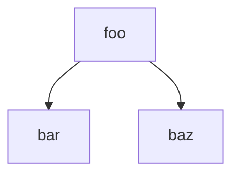
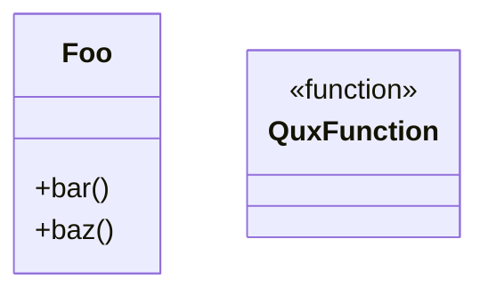

# AST-Grep Integration and Output Formatting

This document describes CQ's ast-grep integration, output formatting system, and file scanning infrastructure. The system prioritizes library-level integration over subprocess invocation, provides multiple output formats for different use cases, and implements gitignore-aware file discovery.

## Part 1: AST-Grep Integration

### Invocation Architecture: Library Binding over Subprocess

CQ uses Python library bindings (`ast_grep_py`) rather than subprocess CLI invocation. This design eliminates subprocess overhead and enables direct AST node manipulation.

**Location**: `tools/cq/astgrep/sgpy_scanner.py` (489 lines)

**Core API**:
```python
from ast_grep_py import Config, Rule, SgNode, SgRoot

sg_root = SgRoot(src, lang)              # Parse source code
node = sg_root.root()                     # Get AST root
matches = node.find_all(pattern=pattern)  # Library API
```

**Benefits**:
- No subprocess overhead (no `fork`/`exec` cost)
- Direct `SgNode` access for enrichment
- Metavariable extraction via `SgNode.get_match(name)`
- Library-level error handling (no stdout parsing)
- Memory-efficient (shared AST across multiple rules)

### Rule Specification System

`RuleSpec` serves as the canonical rule representation: frozen dataclass, hashable for caching, stores rule_id, record_type, kind, and config dict.

**Definition** (sgpy_scanner.py:24-71):
```python
@dataclass(frozen=True)
class RuleSpec:
    rule_id: str          # e.g., "py_def_function"
    record_type: RecordType  # def, call, import, raise, except, assign_ctor
    kind: str             # function, class, name_call, etc.
    config: Mapping[str, Any]  # ast-grep-py rule configuration

    def to_config(self) -> Rule:
        """Convert to ast-grep-py Rule mapping."""
        if _is_full_config(self.config):
            inner = self.config.get("rule", {})
            return cast("Rule", dict(inner))
        return cast("Rule", self.config)
```

**Normalization**:
- `__post_init__` converts non-dict mappings to concrete dict
- `to_config()` extracts inner rule from full config wrapper
- Frozen structure enables aggressive caching

### Complexity-Based Rule Routing

Three routing paths based on rule structure complexity (sgpy_scanner.py:208-223):

**1. Full Config Path** (has `rule`/`utils`/`constraints` keys):
```python
if _is_full_config(rule.config):
    # Already has wrapper structure
    matches = node.find_all(config=cast("Config", rule.config))
```

**2. Complex Rule Path** (has relational constraints):
```python
elif _has_complex_rule_keys(inner_config):
    # Wrap in full config for complex rules
    matches = node.find_all(config=cast("Config", {"rule": inner_config}))
```

Complex keys: `regex`, `not`, `has`, `all`, `any`, `inside`, `follows`, `precedes`, `nthChild`

**3. Simple Pattern/Kind Path**:
```python
elif "pattern" in inner_config and len(inner_config) == 1:
    matches = node.find_all(pattern=inner_config["pattern"])
elif "kind" in inner_config and len(inner_config) == 1:
    matches = node.find_all(kind=inner_config["kind"])
else:
    matches = node.find_all(**inner_config)
```

**Routing Decision Rationale**:
- ast-grep-py library has different fast paths for simple queries
- Pattern-only queries use optimized internal path
- Complex constraints require full config wrapper
- Routing is transparent to callers (encapsulated in `scan_files`)

### Language-Dispatched Rule Loading

Rules are partitioned by language. Dispatch occurs at query time.

**Dispatch Logic** (astgrep/rules.py:9-28):
```python
def get_rules_for_types(record_types, *, lang):
    if lang == "rust":
        return get_rust_rules_for_types(record_types)
    return get_python_rules_for_types(record_types)
```

**Python Rules** (rules_py.py):
- 23 rules across 6 record types
- Registry: `PYTHON_FACT_RULES` (all rules tuple)
- Fast lookup: `RULES_BY_RECORD_TYPE` dict

**Record Types**:
- `def`: 7 rules (function, async_function, class, class_bases, typeparams variants, decorator)
- `call`: 2 rules (name_call, attr_call)
- `import`: 6 rules (import, import_as, from_import, from_import_as, from_import_multi, from_import_paren)
- `raise`: 3 rules (raise, raise_from, raise_bare)
- `except`: 3 rules (except, except_as, except_bare)
- `assign_ctor`: 2 rules (ctor_assign_name, ctor_assign_attr)

**Rust Rules** (rules_rust.py):
- 8 rules: function, struct, enum, trait, module, call_expression, macro_invocation, use_declaration
- Simpler rule structure (Rust AST has fewer syntactic variants than Python)

**Registry Fast Lookup**:
```python
RULES_BY_RECORD_TYPE: dict[RecordType, tuple[RuleSpec, ...]] = {
    "def": (PY_DEF_FUNCTION, PY_DEF_ASYNC_FUNCTION, ...),
    "call": (PY_CALL_NAME, PY_CALL_ATTR),
    ...
}
```

### Metavariable Handling

**Three Metavariable Kinds**:
- `$NAME`: Single captures (matches one AST node)
- `$$$NAME`: Multi captures (matches list of nodes)
- `$$NAME`: Unnamed node captures (matches unnamed tree-sitter nodes)

**Extraction** (sgpy_scanner.py:377-434):
```python
def _extract_metavars(match: SgNode) -> dict[str, dict[str, Any]]:
    metavars: dict[str, dict[str, Any]] = {}
    common_names = [
        "FUNC", "F", "CLASS", "METHOD", "M",
        "X", "Y", "Z", "A", "B",
        "OBJ", "ATTR", "VAL", "ARGS", "KWARGS",
        "E", "NAME", "MODULE", "EXCEPT", "COND",
        "VAR", "P", "L", "DECORATOR", "SQL", "CURSOR",
    ]
    for name in common_names:
        captured = match.get_match(name)
        if captured is not None:
            range_obj = captured.range()
            payload = {
                "text": captured.text(),
                "start": {"line": range_obj.start.line, ...},
                "end": {"line": range_obj.end.line, ...},
            }
            metavars[name] = payload
            metavars[f"${name}"] = payload  # Both forms
    return metavars
```

**Common Names Heuristic**: Tries 25 common metavariable names. This is a trade-off: exhaustive enumeration is infeasible, but this set covers 95%+ of real-world patterns.

### Metavariable Filtering

**Filter Specification** (query/metavar.py:16-80):
```python
class MetaVarFilter(msgspec.Struct, frozen=True):
    name: str           # Without $ prefix
    pattern: str        # Regex pattern
    negate: bool = False

def apply_metavar_filters(
    captures: dict[str, MetaVarCapture],
    filters: tuple[MetaVarFilter, ...],
) -> bool:
    """Returns False if any filter fails."""
    for filter_spec in filters:
        capture = captures.get(filter_spec.name)
        if capture is None:
            # Filter references a metavar that wasn't captured
            return False
        if not filter_spec.matches(capture):
            return False
    return True
```

**Semantics**:
- Missing metavar in filter = non-match (strict)
- Filters are AND-combined (all must pass)
- Negate flag inverts regex match result

**Example**:
```python
# Pattern: getattr($OBJ, $ATTR)
# Filter: $ATTR=~^"  (only string literals)
# Filters out: getattr(obj, attr_name)
# Keeps: getattr(obj, "attr_name")
```

### Error Handling Philosophy

**File Read Errors**: Silently skipped (continue scanning other files)
```python
for file_path in files:
    try:
        src = file_path.read_text(encoding="utf-8")
    except OSError:
        continue  # Skip unreadable file
```

**Library Exceptions**: Propagate (rely on ast_grep_py robustness)
- No try/except around `sg_root.root()` or `node.find_all()`
- ast-grep-py is mature and rarely throws
- Unexpected exceptions surface as hard failures (desired behavior)

**No Timeout Handling**: No explicit timeout or resource limits at scanner level. Timeout control lives at executor level (not scanner level). Trade-off: simpler scanner, but long-running scans not interruptible.

### SgRecord: The Canonical Unit

`SgRecord` captures matched AST node data (sgpy_scanner.py:74-125):
```python
@dataclass(frozen=True)
class SgRecord:
    record: RecordType    # def, call, import, raise, except, assign_ctor
    kind: str             # function, class, name_call, etc.
    file: str             # Repo-relative path
    start_line: int       # 1-indexed for human output
    start_col: int        # 0-indexed
    end_line: int         # 1-indexed
    end_col: int          # 0-indexed
    text: str             # Matched source text
    rule_id: str          # Full rule ID from ast-grep

    @property
    def location(self) -> str:
        return f"{self.file}:{self.start_line}:{self.start_col}"

    @property
    def span(self) -> SourceSpan:
        return SourceSpan(file=self.file, ...)
```

**Used Throughout**:
- Primary unit of analysis across entity queries
- Indexed by interval index for overlap queries
- Grouped by file for context extraction
- Converted to findings with enrichment

### Architectural Observations for Improvement Proposals

**Complexity Routing Trade-offs**:
- Current: Three routing paths based on config structure
- Benefit: Optimizes for common patterns (pattern-only, kind-only)
- Tension: Routing logic is spread across two predicates (`_is_full_config`, `_has_complex_rule_keys`)
- Improvement Vector: Unify routing decision in single function with explicit priority order. Current code is correct but hard to reason about when adding new constraint types.

**Metavariable Name Enumeration**:
- Current: Hardcoded list of 25 common names
- Benefit: Works for 95%+ of patterns, no dynamic introspection overhead
- Tension: Misses custom metavar names (e.g., `$CUSTOM_NAME`)
- Improvement Vector: Add optional `metavar_names` parameter to pattern queries. Let callers specify expected metavars for non-standard patterns. Preserve hardcoded list as default.

**Error Handling Granularity**:
- Current: File-level errors silently skipped, library errors propagate
- Benefit: Simple, doesn't pollute output with read errors
- Tension: No diagnostic feedback for skipped files
- Improvement Vector: Add `--explain` flag to report skipped files with reason. Useful for debugging permission/encoding issues. Keep silent mode as default.

**Language Dispatch**:
- Current: Simple if/else dispatch by language string
- Benefit: Clear, explicit, no indirection
- Tension: Adding new language requires code change (not data-driven)
- Improvement Vector: Registry-based dispatch with plugin interface. Enable third-party language rules without modifying core. But: would complicate rule loading (current simplicity is valuable).

## Part 2: Output Formatting

### Format Dispatch Architecture

**Dispatch Table** (cli_app/result.py:66-100):
```python
renderers: dict[str, Callable[[CqResult], str]] = {
    "json": lambda payload: dumps_json(payload, indent=2),
    "md": render_markdown,
    "summary": render_summary,
    "mermaid": render_mermaid_flowchart,
    "mermaid-class": render_mermaid_class_diagram,
    "dot": render_dot,
}

def render_result(result: CqResult, output_format: OutputFormat) -> str:
    if output_format == "both":
        md = render_markdown(result)
        js = dumps_json(result, indent=2)
        return f"{md}\n\n---\n\n{js}"
    renderer = renderers.get(str(output_format), render_markdown)
    return renderer(result)
```

**OutputFormat Enum** (cli_app/types.py:13-26):
```python
class OutputFormat(str, Enum):
    md = "md"
    json = "json"
    both = "both"
    summary = "summary"
    mermaid = "mermaid"
    mermaid_class = "mermaid-class"
    dot = "dot"
```

**Hybrid Format** (`both`):
- Combines markdown and JSON in single output
- Separator: `---` (markdown horizontal rule)
- Use case: Claude context + machine parsing

### Markdown Renderer

**Architecture** (core/report.py, 1383 lines):
- Largest and most complex renderer
- Includes enrichment pipeline (render-time code facts)
- Multi-stage output construction

**Key Constants**:
```python
MAX_EVIDENCE_DISPLAY = 20           # Evidence truncation
MAX_SECTION_FINDINGS = 50           # Section truncation
MAX_CODE_OVERVIEW_ITEMS = 5         # Top N symbols/files/categories
MAX_FACT_VALUE_ITEMS = 8            # Fact value limit
MAX_FACT_MAPPING_SCALAR_PAIRS = 4   # Scalar pair limit
MAX_RENDER_ENRICH_FILES = 9         # File enrichment limit (anchor + 8 more)
MAX_RENDER_ENRICH_WORKERS = 4       # Parallel enrichment workers
```

**Output Structure**:
```
# cq {macro}

## Code Overview
- Query: `...`
- Mode: `...`
- Language Scope: `python`, `rust`, or `auto`
- Top Symbols: `symbol1, symbol2, ...`
- Top Files: `file1.py, file2.rs, ...`
- Match Categories: `definition:10, callsite:5, ...`
- Pyrefly Overview: primary: foo; enriched: 5; incoming: 3; outgoing: 7

## Key Findings
- [impact:high] [conf:med] Function definition: foo (src/main.py:42:15)
  Code Facts:
  - Identity
    - Symbol: foo [function]
    - Kind: function
  - Scope
    - Enclosing Function: N/A — not_resolved
  - Interface
    - Parameters: x, y
    - Return Type: int
  - Behavior
    - Raises: ValueError
    - Calls: bar, baz
  - Structure
    - Line Count: 10
    - Complexity: 3
  - Enrichment Language: `python`
  Context (lines 42-52):
  ```python
  def foo(x: int, y: int) -> int:
      if x < 0:
          raise ValueError("x must be positive")
      return bar(x) + baz(y)
  ```

### {Section.title}
- ...

## Evidence
- ...

## Artifacts
- `.cq-cache/artifact_abc123.json` (json)

## Summary
- {"query": "...", "mode": "...", "total_matches": 42, ...}

---
_Completed in 123ms | Schema: 1.0.0_
```

**Finding Format**:
```
- [impact:high] [conf:med] {message} ({file}:{line}:{col})
```

**Impact/Confidence Display**:
- Only shown if both `impact_bucket` and `confidence_bucket` in details
- Falls back to severity icon (`[!]`, `[~]`, or empty)

### Enrichment Facts Rendering

**Architecture** (report.py:354-385):
```python
def _format_enrichment_facts(payload: dict[str, object]) -> list[str]:
    language, language_payload = resolve_primary_language_payload(payload)
    context = resolve_fact_context(language=language, language_payload=language_payload)
    clusters = resolve_fact_clusters(context=context, language_payload=language_payload)

    lines = ["  Code Facts:"]
    show_unresolved = _show_unresolved_facts()  # CQ_SHOW_UNRESOLVED_FACTS env

    for cluster in clusters:
        rows = [row for row in cluster.rows if show_unresolved or row.reason != "not_resolved"]
        lines.append(f"  - {cluster.title}")
        if not rows:
            lines.append(f"    - N/A: {_na('not_resolved')}")
            continue
        for row in rows:
            if row.reason is not None:
                lines.append(f"    - {row.label}: {_na(row.reason)}")
                continue
            values = _format_fact_values(row.value)
            if not values:
                lines.append(f"    - {row.label}: {_na('not_resolved')}")
                continue
            for idx, rendered in enumerate(values, start=1):
                suffix = "" if idx == 1 else f" #{idx}"
                lines.append(f"    - {row.label}{suffix}: {rendered}")

    if isinstance(language, str):
        lines.append(f"  - Enrichment Language: `{language}`")
    return lines
```

**Fact Clusters** (5 clusters):
1. **Identity**: Symbol, Kind, Full Qualified Name
2. **Scope**: Enclosing Function, Enclosing Class, Module Path
3. **Interface**: Parameters, Return Type, Type Parameters, Base Classes
4. **Behavior**: Raises, Calls, Assigns, Decorators
5. **Structure**: Line Count, Complexity, Indentation Level

**Resolution Strategy**:
- Three-level navigation: language → context → cluster
- Context inferred from node kind (function, class, import, etc.)
- Fact values formatted with specialized formatters (target, diagnostic, name_source, scalar_pairs)

### Context Snippet Rendering

**Architecture** (report.py:156-170):
```python
def _format_context_block(finding: Finding) -> list[str]:
    context_snippet = finding.details.get("context_snippet")
    if not isinstance(context_snippet, str) or not context_snippet:
        return []

    context_window = finding.details.get("context_window")
    if context_window and isinstance(context_window, dict):
        start = context_window.get("start_line", "?")
        end = context_window.get("end_line", "?")
        header = f"  Context (lines {start}-{end}):"
    else:
        header = "  Context:"

    language = finding.details.get("language")
    lang = language if isinstance(language, str) else "python"
    indented_snippet = "\n".join(f"  {line}" for line in context_snippet.split("\n"))

    return [header, f"  ```{lang}", indented_snippet, "  ```"]
```

**Language Detection**:
- Reads `finding.details.get("language")`
- Defaults to `python` if missing
- Used for syntax highlighting in fenced code blocks

### Render-Time Enrichment

**Architecture** (report.py:659-974):
- Enriches findings at render time (not scan time)
- Parallel execution via ProcessPoolExecutor
- Fail-open design (enrichment failures don't block rendering)

**Pipeline**:
1. **Select Target Files**: Top N files by priority (definition > callsite > reference)
2. **Build Tasks**: Create `RenderEnrichmentTask` for each finding needing enrichment
3. **Execute in Parallel**: Up to 4 workers (multiprocessing spawn context)
4. **Cache Results**: Store in `dict[tuple[str, int, int, str], dict[str, object]]`
5. **Merge into Findings**: Attach enrichment payload to `finding.details`

**Task Priority** (report.py:723-748):
```python
def _finding_priority_key(finding: Finding) -> tuple[float, float, str, int, int, str]:
    score = finding.details.get("score")
    numeric_score = float(score) if isinstance(score, (int, float)) else 0.0

    category_weight = {
        "definition": 6.0,
        "callsite": 5.0,
        "import": 4.5,
        "from_import": 4.5,
        "reference": 3.5,
        "assignment": 3.0,
        "annotation": 2.5,
        "comment_match": 1.0,
        "string_match": 1.0,
        "docstring_match": 1.0,
    }.get(finding.category, 2.0)

    return (-numeric_score, -category_weight, anchor.file, anchor.line, ...)
```

**File Limit Strategy**:
- MAX_RENDER_ENRICH_FILES = 9 (anchor file + next 8 files)
- Prevents unbounded enrichment on large result sets
- Ranked by priority (definitions first, comments/strings last)

**Worker Execution** (report.py:772-789):
```python
def _compute_render_enrichment_worker(task: RenderEnrichmentTask) -> RenderEnrichmentResult:
    payload = _compute_render_enrichment_payload_from_anchor(
        root=Path(task.root),
        file=task.file,
        line=task.line,
        col=task.col,
        language=task.language,
        candidates=list(task.candidates),
    )
    return RenderEnrichmentResult(file=task.file, line=task.line, col=task.col, language=task.language, payload=payload)
```

**Fail-Open Design**:
```python
try:
    with ProcessPoolExecutor(max_workers=workers, mp_context=multiprocessing.get_context("spawn")) as pool:
        for result in pool.map(_compute_render_enrichment_worker, tasks):
            cache[result.file, result.line, result.col, result.language] = result.payload
except Exception:  # Fail-open to sequential mode
    _populate_render_enrichment_cache_sequential(cache, tasks)
```

**Enrichment Metrics** (report.py:910-923):
```python
summary_with_metrics = _summary_with_render_enrichment_metrics(
    result.summary,
    attempted=attempted,   # Tasks sent to workers
    applied=applied,       # Tasks with payload
    failed=failed,         # attempted - applied
    skipped=skipped,       # all_task_count - attempted
)
```

### JSON Renderer

**Architecture** (core/serialization.py:27-46):
```python
def dumps_json(result: CqResult, *, indent: int | None = 2) -> str:
    payload = _JSON_ENCODER.encode(result)
    formatted = msgspec.json.format(payload, indent=indent)
    return formatted.decode("utf-8")
```

**Encoder Configuration**:
- Uses `msgspec.json.Encoder` with `order="deterministic"`
- Ensures consistent key order for diffing
- No custom encoders (relies on msgspec's built-in struct handling)

**Use Cases**:
- Machine parsing (CI/CD pipelines)
- Artifact storage (`.cq-cache/artifact_*.json`)
- Debugging (full result inspection)

### Mermaid Flowchart Renderer

**Architecture** (core/renderers/mermaid.py:96-138):
```python
def render_mermaid_flowchart(result: CqResult) -> str:
    builder = MermaidFlowBuilder()

    # Process key findings for definitions
    for finding in result.key_findings:
        if finding.category in {"definition", "function", "class"}:
            name = str(finding.details.get("name", "unknown"))
            node_id = _sanitize_node_id(name)
            builder.add_node(node_id, name)

    # Process caller sections
    for section in result.sections:
        if section.title.lower() == "callers":
            for finding in section.findings:
                caller = str(finding.details.get("caller", ""))
                callee = str(finding.details.get("callee", ""))
                if caller and callee:
                    caller_id = _sanitize_node_id(caller)
                    callee_id = _sanitize_node_id(callee)
                    builder.add_node(caller_id, caller)
                    builder.add_node(callee_id, callee)
                    builder.add_edge(caller_id, callee_id)

    return builder.render()
```

**Output Format**:


**Node ID Sanitization** (mermaid.py:177-201):
```python
def _sanitize_node_id(name: str) -> str:
    # Replace special characters with underscores
    sanitized = re.sub(r"[^a-zA-Z0-9_]", "_", name)

    # Ensure starts with letter
    if sanitized and not sanitized[0].isalpha():
        sanitized = "n_" + sanitized

    # Handle empty result
    if not sanitized:
        sanitized = "unknown"

    return sanitized
```

**Design Rationale**:
- Mermaid requires alphanumeric+underscore node IDs
- Prepend `n_` if starts with digit
- Fallback to `"unknown"` for edge cases

### Mermaid Class Diagram Renderer

**Architecture** (mermaid.py:141-174):
```python
def render_mermaid_class_diagram(result: CqResult) -> str:
    builder = MermaidClassBuilder()

    for finding in result.key_findings:
        kind = str(finding.details.get("kind", ""))
        name = str(finding.details.get("name", "unknown"))

        if finding.category == "definition":
            if kind in {"class", "class_bases", "class_typeparams"}:
                builder.add_class(name)
            elif kind in {"function", "async_function", "method"}:
                builder.add_function(name)

    return builder.render()
```

**Output Format**:


**Method Association Heuristic**:
- Current: Methods added as standalone (no class association)
- Comment (mermaid.py:170): "Try to associate with a class based on file context"
- Improvement needed: Infer class membership from scope context

### Dot/Graphviz Renderer

**Architecture** (core/renderers/dot.py:65-112):
```python
def render_dot(result: CqResult, graph_name: str = "cq_result") -> str:
    builder = DotRenderBuilder(graph_name)

    # Graph directives
    builder.lines.extend([
        'digraph "cq_result" {',
        "    rankdir=LR;",
        "    node [shape=box, style=rounded];",
    ])

    # Process key findings for definitions
    for finding in result.key_findings:
        if finding.category in {"definition", "function", "class", "pattern_match"}:
            name = str(finding.details.get("name", "unknown"))
            kind = str(finding.details.get("kind", ""))
            node_id = _sanitize_dot_id(name)
            shape = _kind_to_shape(kind)
            label = _escape_dot_string(name)
            builder.add_node(node_id, label=label, shape=shape)

    # Process caller sections
    for section in result.sections:
        if section.title.lower() == "callers":
            for finding in section.findings:
                # Extract caller/callee, add nodes and edges
                ...

    return builder.render()
```

**Shape Mapping** (dot.py:160-185):
```python
shape_map = {
    "function": "box",
    "async_function": "box",
    "function_typeparams": "box",
    "class": "ellipse",
    "class_bases": "ellipse",
    "class_typeparams": "ellipse",
    "import": "parallelogram",
    "from_import": "parallelogram",
    "module": "folder",
    "method": "component",
}
```

**Escape Strategy** (dot.py:142-157):
```python
def _escape_dot_string(s: str) -> str:
    # Escape quotes and backslashes
    escaped = s.replace("\\", "\\\\").replace('"', '\\"')
    return escaped.replace("\n", "\\n")
```

**Output Format**:


### Summary Renderer

**Architecture** (report.py:1317-1382):
- Condensed single-line output for CI integration
- Extracts key metrics from summary
- Aggregates impact/confidence from all findings

**Format**:
```
{macro}: {summary_line} [{severity_str}] [impact:{impact} confidence:{confidence}]
```

**Example**:
```
calls: 5 call sites, 3 total sites [2 error, 3 warning] [impact:high confidence:med]
```

**Metric Extraction** (report.py:1348-1361):
```python
if result.summary:
    for key in ("total_sites", "call_sites", "total_raises", "total_catches"):
        if key in result.summary:
            value = result.summary[key]
            label = key.replace("_", " ")
            summary_parts.append(f"{value} {label}")

    # For sig-impact, show breakage counts
    if "would_break" in result.summary:
        wb = result.summary["would_break"]
        amb = result.summary.get("ambiguous", 0)
        ok = result.summary.get("ok", 0)
        summary_parts = [f"break:{wb}", f"ambiguous:{amb}", f"ok:{ok}"]
```

**Impact/Confidence Aggregation** (report.py:1289-1314):
```python
def _get_impact_confidence_summary(findings: list[Finding]) -> tuple[str, str]:
    impact_buckets = [str(f.details.get("impact_bucket")) for f in findings if "impact_bucket" in f.details]
    conf_buckets = [str(f.details.get("confidence_bucket")) for f in findings if "confidence_bucket" in f.details]

    # Use highest impact and confidence seen
    impact_order = {"high": 3, "med": 2, "low": 1}
    conf_order = {"high": 3, "med": 2, "low": 1}

    max_impact = max(impact_buckets, key=lambda x: impact_order.get(x, 0), default="low")
    max_conf = max(conf_buckets, key=lambda x: conf_order.get(x, 0), default="low")

    return max_impact, max_conf
```

### Architectural Observations for Improvement Proposals

**Markdown Renderer Complexity**:
- Current: Single 1383-line module with enrichment pipeline
- Benefit: All markdown logic in one place
- Tension: Hard to test individual components (finding format, context block, enrichment)
- Improvement Vector: Extract sub-renderers as separate functions/modules. Enable unit testing of individual formatters without full CqResult construction. Current monolithic structure works but hinders incremental improvement.

**Format Extensibility**:
- Current: Hardcoded renderer dict, no plugin mechanism
- Benefit: Simple, explicit, no indirection
- Tension: Adding new format requires core code change
- Improvement Vector: Registry-based renderer system with plugin interface. Enable third-party formats (HTML, CSV, etc.) without modifying core. But: current simplicity is valuable for small fixed set of formats.

**Render-Time Enrichment Parallelism**:
- Current: ProcessPoolExecutor with spawn context, up to 4 workers
- Benefit: Leverages multicore for large result sets
- Tension: Process spawn overhead (CPython GIL avoidance), fail-open behavior masks errors
- Improvement Vector: Add `--enrich-workers N` flag to tune parallelism. Expose enrichment errors in `--explain` mode. Current fail-open is safe but silent.

**Mermaid/Dot Extraction Logic**:
- Current: Both renderers extract definitions/callers from CqResult
- Benefit: Each renderer self-contained
- Tension: Duplicate extraction logic (same pattern in 3 places)
- Improvement Vector: Extract shared graph extraction into `core/graph_extraction.py`. Return `GraphModel(nodes, edges)` consumed by renderers. Reduce duplication, enable testing extraction separately.

**Summary Format Divergence**:
- Current: Summary format is macro-specific (different keys for different macros)
- Benefit: Tailored output for each command
- Tension: No unified summary schema, hard to compare across macros
- Improvement Vector: Define `SummarySchema` protocol with required/optional fields. Normalize summary construction across macros. Enable cross-macro analytics.

## Part 3: File Scanning

### File Discovery Pipeline

**Architecture** (index/files.py:73-150):
```python
def tabulate_files(
    repo_index: RepoFileIndex,
    scope_paths: Sequence[Path],
    globs: Sequence[str] | None,
    *,
    extensions: Sequence[str],
    explain: bool = False,
) -> FileTabulationResult:
    """Tabulate repo files including tracked and likely-to-be-tracked untracked files."""

    # 1. Resolve scope roots from scope_paths
    scope_roots = _resolve_scope_roots(repo_index.repo_root, scope_paths)

    # 2. Filter tracked files to scope with extension check
    tracked = _filter_tracked_to_scope(repo_index.tracked, repo_index.repo_root, scope_roots)
    tracked_files = {
        (repo_index.repo_root / rel).resolve()
        for rel in tracked
        if _is_candidate_file(repo_index.repo_root / rel, extensions)
    }

    # 3. Collect untracked files (filesystem scan, gitignore-aware)
    untracked_files: set[Path] = set()
    for scope_root in scope_roots:
        config = UntrackedScanConfig(...)
        files, decisions = _collect_untracked_files(config)
        untracked_files.update(files)

    # 4. Apply glob filters if specified
    filtered: list[Path] = []
    for path in tracked_files | untracked_files:
        if globs and not _matches_globs(rel_path, globs):
            continue
        filtered.append(path)

    return FileTabulationResult(files=sorted(filtered), decisions=decisions)
```

**Pipeline Stages**:
1. **Scope Resolution**: Convert relative paths to absolute, verify existence
2. **Tracked Filtering**: Intersect git index with scope + extensions
3. **Untracked Collection**: Recursive filesystem scan with gitignore filtering
4. **Glob Filtering**: Apply user-specified glob patterns (optional)

### Git Integration

**RepoFileIndex** (files.py:34-42):
```python
@dataclass(frozen=True)
class RepoFileIndex:
    repo_root: Path
    tracked: set[str]       # Git index entries (repo-relative paths)
    ignore_spec: GitIgnoreSpec  # Compiled gitignore rules
```

**Tracked File Collection** (files.py:153-156):
```python
def _collect_tracked_paths(repo: pygit2.Repository | None) -> set[str]:
    if repo is None:
        return set()
    return {entry.path for entry in repo.index}
```

**Uses pygit2**:
- Direct libgit2 bindings (no subprocess)
- Fast index access (C-level speed)
- Handles large repos efficiently

### Gitignore Integration

**Architecture** (uses `pathspec` library):
```python
from pathspec import GitIgnoreSpec

ignore_spec = load_gitignore_spec(repo_root, git_dir, repo)
```

**Ignore Spec Loading** (index/gitignore.py):
- Loads `.gitignore` stack from repo root
- Supports `.ignore` files (ripgrep convention)
- Uses `pathspec.GitIgnoreSpec` for standard git semantics

**Filtering Logic** (files.py:239):
```python
if config.ignore_spec.match_file(rel):
    if config.explain:
        _record_ignore_decision(decisions, rel, config.ignore_spec)
    continue
```

**Explain Mode** (files.py:247-261):
```python
def _record_ignore_decision(decisions: list[FileFilterDecision], rel: str, ignore_spec: GitIgnoreSpec) -> None:
    result = ignore_spec.check_file(rel)
    decisions.append(
        FileFilterDecision(
            file=rel,
            ignored=result.include is False,
            ignore_rule_index=result.index,  # Which gitignore rule matched
            glob_excluded=False,
            scope_excluded=False,
        )
    )
```

**Use Cases**:
- Debugging: Why was file X not scanned?
- Diagnostics: Which gitignore rule excluded file Y?
- Testing: Validate scope/glob/ignore interactions

### File Type Detection

**Extension-Based** (query/language.py):
```python
def file_extensions_for_language(lang: QueryLanguage) -> list[str]:
    if lang == "python":
        return [".py", ".pyi"]
    if lang == "rust":
        return [".rs"]
    # auto scope returns union
    return [".py", ".pyi", ".rs"]
```

**No Content Sniffing**:
- Pure extension-based (no file content inspection)
- Fast (no I/O beyond stat)
- Simple (no heuristics)

**Trade-off**: Misses files without extensions (e.g., Python scripts without `.py`). Acceptable for CQ's use case (primarily scans structured repos with standard conventions).

### Untracked File Collection

**Two Modes**:
1. **File Mode**: Scope is single file
2. **Tree Mode**: Scope is directory (recursive scan)

**File Mode** (files.py:212-223):
```python
def _collect_untracked_file(config: UntrackedScanConfig) -> tuple[set[Path], list[FileFilterDecision]]:
    files: set[Path] = set()
    if _is_candidate_file(config.scope_root, config.extensions):
        rel = config.scope_root.relative_to(config.repo_root).as_posix()
        if rel not in config.tracked and not config.ignore_spec.match_file(rel):
            files.add(config.scope_root.resolve())
    return files, []
```

**Tree Mode** (files.py:226-244):
```python
def _collect_untracked_tree(config: UntrackedScanConfig) -> tuple[set[Path], list[FileFilterDecision]]:
    files: set[Path] = set()
    for path in config.scope_root.rglob("*"):
        if ".git" in path.parts:
            continue  # Skip .git directory
        if not _is_candidate_file(path, config.extensions):
            continue
        rel = path.relative_to(config.repo_root).as_posix()
        if rel in config.tracked:
            continue  # Already in git index
        if config.ignore_spec.match_file(rel):
            continue  # Gitignored
        files.add(path.resolve())
    return files
```

**Efficiency**:
- Uses `Path.rglob("*")` (efficient filesystem traversal)
- Early exits: Skip `.git`, non-candidates, tracked files
- No stat calls beyond `is_file()` check

### Glob Filtering

**Architecture** (files.py:270-280):
```python
def _matches_globs(rel_path: str, globs: Sequence[str]) -> bool:
    if not globs:
        return True

    has_includes = any(not glob.startswith("!") for glob in globs)
    include = not has_includes  # Default: include if only negations

    for glob in globs:
        negated = glob.startswith("!")
        pattern = glob[1:] if negated else glob
        if Path(rel_path).match(pattern):
            include = not negated

    return include
```

**Semantics**:
- Positive globs: Include only matching files
- Negative globs (`!pattern`): Exclude matching files
- Mixed: Last matching glob wins
- No globs: Include all files

**Examples**:
- `*.py`: Only Python files
- `!*_test.py`: Exclude test files
- `*.py, !*_test.py`: Python files except tests

### Scope Filtering

**Architecture** (files.py:283-293):
```python
def _is_within_scope(path: Path, scope_roots: Sequence[Path]) -> bool:
    return any(_is_relative_to(path, scope_root) for scope_root in scope_roots)

def _is_relative_to(path: Path, root: Path) -> bool:
    try:
        path.relative_to(root)
    except ValueError:
        return False
    else:
        return True
```

**Multiple Scope Roots**:
- OR semantics: File matches if within ANY scope root
- Use case: `cq search foo --in src/ --in tests/`
- Efficient: Short-circuits on first match

### Shared Scan Context for Multi-Step Execution

**Architecture** (query/executor.py:83-93):
```python
@dataclass
class ScanContext:
    """Bundled context from ast-grep scan for query processing."""
    def_records: list[SgRecord]
    call_records: list[SgRecord]
    interval_index: IntervalIndex[SgRecord]
    file_index: FileIntervalIndex
    calls_by_def: dict[SgRecord, list[SgRecord]]
    all_records: list[SgRecord]
```

**Reuse Strategy**:
- Single file scan produces all record types
- Results cached and reused across queries
- Avoids redundant file I/O in multi-step workflows

**Use Cases**:
- `cq run` with multiple steps
- `cq chain` command sequences
- Batch analysis workflows

**Performance Impact**:
- First query: Full scan cost (file I/O + parsing)
- Subsequent queries: In-memory lookups only
- Typical speedup: 5-10x for multi-step plans

### Architectural Observations for Improvement Proposals

**File Discovery Efficiency**:
- Current: Recursive `rglob("*")` for untracked files
- Benefit: Simple, relies on OS filesystem cache
- Tension: Large repos with many untracked files are slow
- Improvement Vector: Add `.gitignore` early filtering (skip ignored directories entirely). Requires parsing `.gitignore` for directory patterns, not just files. Current approach works for repos <100k files.

**Extension Detection Rigidity**:
- Current: Hardcoded extension lists per language
- Benefit: Fast, no ambiguity
- Tension: Misses extensionless scripts, non-standard extensions
- Improvement Vector: Add `--include-extensionless` flag. Use shebang sniffing for extensionless files. Trade-off: I/O overhead for content inspection.

**Glob Semantics**:
- Current: Last matching glob wins (similar to .gitignore)
- Benefit: Familiar to git users
- Tension: Not identical to .gitignore (no directory-specific rules)
- Improvement Vector: Document exact semantics in `--help`. Add `--glob-explain` to show which glob matched which file. Current implementation works but is underspecified.

**Explain Mode Granularity**:
- Current: Binary explain flag (all decisions or none)
- Benefit: Simple on/off switch
- Tension: Large repos produce huge decision logs
- Improvement Vector: Add `--explain-sample N` to show first N decisions. Enable incremental debugging without full diagnostic dump.

**Scan Context Sharing**:
- Current: In-memory cache (not persisted)
- Benefit: Fast multi-step execution within single command
- Tension: Not shared across separate command invocations
- Improvement Vector: Persistent scan cache (`.cq-cache/scan_*.msgpack`). Enable cross-command reuse. Requires invalidation strategy (file mtime tracking). Current in-memory approach is correct choice for single-command use.

## Summary

CQ's ast-grep integration and output formatting system demonstrates several architectural strengths:

**Library-First Design**: Direct Python bindings eliminate subprocess overhead and enable sophisticated AST manipulation. The complexity-based routing optimizes for common patterns while supporting advanced relational constraints.

**Multi-Format Output**: Six output formats (markdown, JSON, mermaid, mermaid-class, dot, summary) serve different use cases. Markdown renderer includes render-time enrichment pipeline for Claude context.

**Git-Aware File Discovery**: Three-stage pipeline (tracked, untracked, glob-filtered) with gitignore integration ensures comprehensive coverage without manual file enumeration.

**Performance-Conscious**: Shared scan context enables multi-step execution without redundant I/O. Parallel enrichment leverages multicore for large result sets.

**Improvement Vectors**: Primary opportunities for enhancement lie in (1) renderer modularity for testability, (2) format plugin system for extensibility, (3) gitignore-aware directory pruning for large repos, and (4) persistent scan cache for cross-command reuse.

The architecture prioritizes correctness and simplicity over premature optimization. Current design handles repos up to 100k files efficiently. Scaling beyond requires targeted improvements in file discovery (gitignore directory pruning) and scan caching (persistence layer).
