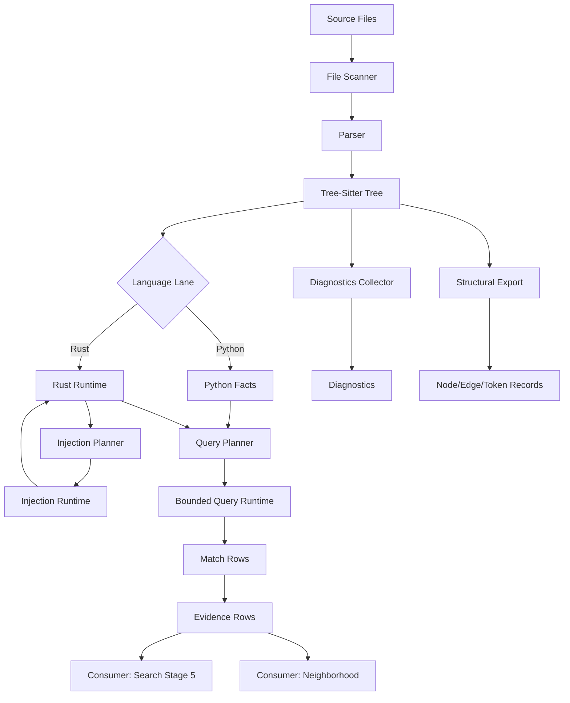

# 07 — Tree-Sitter & Structural Parsing Engine

**Version**: 0.4.0
**Status**: Foundation Documentation
**Scope**: Tree-sitter subsystem architecture, language lanes, AST-grep integration, and file scanning infrastructure

This document describes CQ's tree-sitter-based structural parsing engine, a cross-cutting subsystem (~7,600 LOC across 12 subdirectories) that provides AST-level code analysis for Python and Rust. The engine supports bounded query execution, language-specific enrichment lanes, diagnostic collection, and structural exports. It serves as the foundation for search enrichment (stage 5) and neighborhood analysis.

**Cross-References**:
- Doc 02: Search enrichment pipeline (consumes tree-sitter stage 5)
- Doc 08: Neighborhood assembly (consumes tree-sitter collector/query engine)
- Doc 10: Cache stores (tree-sitter blob store, cache contracts)

---

## Module Map

The tree-sitter subsystem lives in `tools/cq/search/tree_sitter/` with the following structure:

| Subdirectory | Purpose | Key Files | Approx LOC |
|--------------|---------|-----------|------------|
| `core/` | Runtime execution, budgeting, windowing, autotune | `runtime.py`, `parse.py`, `adaptive_runtime.py`, `autotune.py`, `windowing.py`, `budgeting.py`, `work_queue.py` | ~1,800 |
| `contracts/` | Shared data models for tree-sitter subsystem | `core_models.py`, `query_models.py` | ~350 |
| `python_lane/` | Python-specific enrichment | `facts.py`, `runtime.py`, `fallback_support.py` | ~850 |
| `rust_lane/` | Rust-specific enrichment, injection runtime | `runtime.py`, `injections.py`, `injection_runtime.py`, `injection_settings.py`, `injection_profiles.py`, `bundle.py` | ~1,400 |
| `query/` | Query planning, registry, predicates, specialization | `planner.py`, `registry.py`, `predicates.py`, `specialization.py`, `grammar_drift.py`, `pack_metadata.py`, `lint.py` | ~900 |
| `schema/` | Node schema, code generation, generated types | `node_schema.py`, `node_codegen.py`, `generated.py`, `runtime.py` | ~600 |
| `structural/` | Structural export, token export, match rows | `export.py`, `token_export.py`, `match_rows.py` | ~450 |
| `diagnostics/` | Diagnostic collection, recovery hints | `collector.py`, `recovery_hints.py` | ~300 |
| `tags/` | Tagging runtime for Rust | `runtime.py`, `contracts.py` | ~250 |

**Total**: ~7,600 LOC

**Related Infrastructure**:
- `tools/cq/astgrep/` — AST-grep integration (~1,180 LOC)
- `tools/cq/index/` — File scanning infrastructure (~900 LOC)
- `tools/cq/search/queries/` — Query files (.scm) for Python/Rust

---

## Core Runtime

### TreeSitterRuntime: Main Execution Engine

**Location**: `tools/cq/search/tree_sitter/core/runtime.py` (~520 LOC)

The core runtime provides bounded query execution with budget management, windowing, and telemetry collection. All queries execute within configurable resource limits.

**Primary Entry Point**:
```python
def run_bounded_query_matches(
    query: Query,
    root: Node,
    *,
    windows: Iterable[QueryWindowV1] | None = None,
    point_windows: Iterable[QueryPointWindowV1] | None = None,
    settings: QueryExecutionSettingsV1 | None = None,
    callbacks: QueryExecutionCallbacksV1 | None = None,
    runtime_label: str = "default",
) -> tuple[list[tuple[int, dict[str, list[Node]]]], QueryExecutionTelemetryV1]:
    """Run bounded tree-sitter query with resource limits."""
```

**Execution Settings** (from `contracts/core_models.py`):
- `match_limit` — Max matches per window (default: 4096)
- `max_start_depth` — Tree depth limit
- `budget_ms` — Time budget
- `timeout_micros` — Microsecond timeout
- `require_containment` — Strict window containment
- `window_mode` — Window application mode (intersection, containment_preferred, containment_required)

**Execution Telemetry** provides: windows_total, windows_executed, capture_count, match_count, exceeded_match_limit, cancelled flags.

### Window-Based Query Execution

**Byte Windows** and **Point Windows** (from `contracts/core_models.py`):
- `QueryWindowV1` — Inclusive-exclusive byte window
- `QueryPointWindowV1` — Inclusive-exclusive point window (row/col anchored)

**Window Application** (`core/windowing.py`):

Three modes for applying windows to query cursors:
1. **Intersection Mode** (default): Uses `set_byte_range()` or `set_point_range()` for overlap-based filtering
2. **Containment Preferred**: Tries `set_containing_byte_range()`, falls back to intersection
3. **Containment Required**: Requires `set_containing_byte_range()`, fails if unavailable

Window planning aligns byte windows with point windows when both are provided (see `core/runtime.py:161-177`).

### Adaptive Runtime & Auto-Tuning

**Adaptive Runtime** (`core/adaptive_runtime.py`):

Tracks query execution latency per language lane and recommends budget adjustments via `AdaptiveRuntimeSnapshotV1`:
- `language`, `average_latency_ms`, `sample_count`, `recommended_budget_ms`

**Auto-Tune Planning** (`core/autotune.py`):

Converts adaptive snapshots into execution plans (`QueryAutotunePlanV1`):
- Derives budget_ms from average latency (50-2000ms range)
- Adjusts match_limit based on latency (512-16384 range)
- Sets window_split_target (1-4 splits)

The runtime automatically applies auto-tuning when settings don't override defaults (see `core/runtime.py:102-128`).

### Parsing Infrastructure

**Parse Sessions** (`core/parse.py`):

Provides session-based caching for parsed trees with stats tracking (`ParseSessionStatsV1`):
- `entries`, `cache_hits`, `cache_misses`, `parse_count`, `reparse_count`, `edit_failures`

Session API: `get_parse_session()`, `clear_parse_session()`

**Incremental Parsing** supports tree-sitter's incremental parsing with edit application via `TreeSitterInputEditV1` payload.

### Budgeting and Work Queue Management

**Budgeting** (`core/budgeting.py`):

Budget management for query execution with deadline tracking. Combines user callbacks with budget deadlines to enforce time limits.

**Work Queue** (`core/work_queue.py`):

Changed-range window queueing for incremental parsing workflows via `TreeSitterWorkItemV1`.

### Language Registry

**Location**: `core/language_registry.py`

Centralized registry for tree-sitter language objects with LRU caching (maxsize=4). Supports Python and Rust languages.

---

## Contracts Layer

### Core Models

**Location**: `tools/cq/search/tree_sitter/contracts/core_models.py` (~200 LOC)

Provides shared msgspec-based data models for the tree-sitter subsystem. All contracts inherit from `CqStruct` or `CqCacheStruct` for serialization.

**Key Contract Groups**:
- **Runtime Execution**: `QueryWindowV1`, `QueryPointWindowV1`, `QueryExecutionSettingsV1`, `QueryExecutionTelemetryV1`, `AdaptiveRuntimeSnapshotV1`
- **Diagnostics**: `TreeSitterDiagnosticV1` — Syntax diagnostic row (ERROR/MISSING nodes)
- **Structural Export**: `TreeSitterStructuralNodeV1`, `TreeSitterStructuralEdgeV1`, `TreeSitterCstTokenV1`, `TreeSitterStructuralExportV1`
- **Evidence**: `ObjectEvidenceRowV1` — Metadata-backed object evidence row
- **Injection**: `InjectionRuntimeResultV1` — Result of parsing injected ranges
- **Work Queue**: `TreeSitterWorkItemV1` — Queued changed-range work item

### Query Models

**Location**: `tools/cq/search/tree_sitter/contracts/query_models.py`

Contracts for query planning, packs, and metadata:
- `QueryPatternPlanV1` — Per-pattern planning metadata (pattern_idx, rooted, non_local, guaranteed_step0, assertions, capture_quantifiers, score)
- `QueryPackPlanV1` — Pack-level planning metadata (pack_name, query_hash, plans, score)
- `QueryPackRulesV1` — Query pack validation rules (require_rooted, forbid_non_local)

---

## Python Lane

The Python lane provides Python-specific structural fact extraction and enrichment. It's the primary consumer of tree-sitter for Python code analysis.

### Python Facts Extraction

**Location**: `tools/cq/search/tree_sitter/python_lane/facts.py` (~550 LOC)

**Primary Entry Point**:
```python
def collect_python_facts(
    *,
    source: str | bytes,
    file_key: str = "",
    changed_ranges: Iterable[tuple[int, int]] | None = None,
    pack_names: Iterable[str] | None = None,
) -> tuple[tuple[ObjectEvidenceRowV1, ...], dict[str, object]]:
    """Collect Python facts from source using tree-sitter queries."""
```

Facts are extracted via query packs loaded from `.scm` files with validation (rooted pattern checks, non-local pattern checks).

**Key Operations**:
- **Anchor Lifting**: Lifts match anchors to containing syntactic structures (call, attribute, assignment, import, function_definition, class_definition)
- **Scope Chain Construction**: Builds hierarchical scope chain from anchor to module root (see `_scope_chain()`)

### Python Runtime

**Location**: `tools/cq/search/tree_sitter/python_lane/runtime.py` (~300 LOC)

Provides Python-specific parsing, incremental parsing, and runtime helpers. Includes availability check (`is_tree_sitter_python_available()`), incremental parsing (`parse_python_tree_with_ranges()`), and changed range window integration.

### Python Fallback Support

**Location**: `tools/cq/search/tree_sitter/python_lane/fallback_support.py`

Provides graceful degradation when tree-sitter bindings are unavailable. All Python lane functions fail-open with empty results when tree-sitter is missing.

---

## Rust Lane

The Rust lane provides Rust-specific enrichment with injection support for embedded languages (e.g., proc macros, doc comments).

### Rust Runtime

**Location**: `tools/cq/search/tree_sitter/rust_lane/runtime.py` (~650 LOC)

**Enrichment Contract**:
All fields produced by the Rust lane are strictly additive. They never affect confidence scores, match counts, category classification, or relevance ranking. They may affect `containing_scope` display (used only for grouping in output).

**Primary Entry Point**:
```python
def enrich_rust_match(
    *,
    root: Path,
    file: str,
    anchor_line: int,
    anchor_col: int,
    candidates: Sequence[str],
) -> dict[str, object]:
    """Enrich one Rust match location with tree-sitter structural facts."""
```

**Field Groups**:
1. **Core**: `node_kind`, `scope_chain`, `scope_kind`, `scope_name`, `language`, `enrichment_status`, `enrichment_sources`, `degrade_reason`
2. **Signature**: `params`, `return_type`, `generics`, `signature`, `is_async`, `is_unsafe`
3. **Visibility**: `visibility`
4. **Attributes**: `attributes`
5. **Impl Context**: `impl_type`, `impl_trait`, `impl_kind`, `impl_generics`
6. **Call Target**: `call_target`, `call_receiver`
7. **Struct/Enum**: `fields`, `variants`

**Scope Kinds**: function_item, struct_item, enum_item, trait_item, impl_item, mod_item, macro_invocation

Integrates with `diagnostics/collector.py` for diagnostics collection.

### Rust Injections

**Location**: `tools/cq/search/tree_sitter/rust_lane/injections.py` (~250 LOC)

Injection planning identifies embedded language regions (e.g., SQL in string literals, proc macro bodies) via `InjectionPlanV1`:
- `language`, `start_byte`, `end_byte`, `start_row`, `start_col`, `end_row`, `end_col`
- `profile_name`, `combined`, `include_children`, `use_self_language`, `use_parent_language`

Language resolution waterfall:
1. Explicit `settings.language` from query metadata
2. Language capture from match (`@language`)
3. `use_self_language` or `use_parent_language` flags
4. Profile language from injection profile
5. Default language from context

### Rust Injection Runtime

**Location**: `tools/cq/search/tree_sitter/rust_lane/injection_runtime.py` (~350 LOC)

Executes injection plans by parsing embedded language regions with tree-sitter.

**Primary Entry Point**:
```python
def parse_injected_ranges(
    *,
    language: str,
    source_bytes: bytes,
    injection_plans: Iterable[InjectionPlanV1],
) -> InjectionRuntimeResultV1:
    """Parse injected language ranges and return result with metadata."""
```

Tree-sitter supports parsing non-contiguous byte ranges via `set_included_ranges()` for multi-region parsing.

### Rust Injection Settings

**Location**: `tools/cq/search/tree_sitter/rust_lane/injection_settings.py` (~100 LOC)

Provides pattern-level injection settings derived from query metadata (`InjectionSettingsV1`). Metadata keys:
- `injection.language`, `injection.combined`, `injection.include-children`, `injection.self`, `injection.parent`

### Rust Injection Profiles

**Location**: `tools/cq/search/tree_sitter/rust_lane/injection_profiles.py`

Profiles define language resolution heuristics for common Rust patterns: sql, json, toml, markdown, regex.

### Rust Bundle

**Location**: `tools/cq/search/tree_sitter/rust_lane/bundle.py`

Bundles Rust grammar and query sources for runtime loading.

---

## Query Planning

Query planning prioritizes patterns based on structural properties and builds execution plans with cost estimates.

### Query Planner

**Location**: `tools/cq/search/tree_sitter/query/planner.py` (~140 LOC)

Builds deterministic per-pattern planning rows with scoring.

**Pattern Scoring**:
- Rooted patterns: +2.0 (fast)
- Guaranteed at step 0: +1.2 (optimized)
- Has assertions: +1.0 (reduces match set)
- Has captures: +0.5 (needed for evidence)
- Non-local patterns: -2.5 (slow)

**Functions**:
- `build_pattern_plan()` — Build per-pattern planning rows from compiled query
- `build_pack_plan()` — Build pack summary for scheduling and cache keys
- `sort_pack_plans()` — Sort query packs from highest to lowest score

### Query Registry

**Location**: `tools/cq/search/tree_sitter/query/registry.py`

Loads query packs from `.scm` files and manages pack metadata. Packs loaded from `tools/cq/search/queries/{language}/*.scm`.

### Query Predicates

**Location**: `tools/cq/search/tree_sitter/query/predicates.py`

Custom predicate support for advanced query constraints. Provides predicate callbacks and custom predicate detection.

### Query Specialization

**Location**: `tools/cq/search/tree_sitter/query/specialization.py`

Applies runtime optimizations to compiled queries based on request surface.

### Grammar Drift Detection

**Location**: `tools/cq/search/tree_sitter/query/grammar_drift.py`

Detects when query files reference node types not present in the current grammar version.

---

## Schema & Code Generation

### Node Schema

**Location**: `tools/cq/search/tree_sitter/schema/node_schema.py` (~250 LOC)

Loads static node-type schemas from tree-sitter language objects for query validation.

**Contracts**:
- `GrammarNodeTypeV1` — One node-type row from `node-types.json` (type, named, fields)
- `GrammarSchemaV1` — Simplified grammar schema for lint-time checks (language, node_types)
- `GrammarSchemaIndex` — Runtime indexes for fast lint lookups (named_node_kinds, all_node_kinds, field_names)

Node types loaded from generated modules (`tools.cq.search.generated.{python,rust}_node_types_v1`) or runtime language objects.

### Node Code Generation

**Location**: `tools/cq/search/tree_sitter/schema/node_codegen.py`

Generates Python type stubs from tree-sitter node schemas for IDE support. Generated output in `schema/generated.py`.

---

## Structural Exports

Structural exports provide deterministic CST/AST representations for graph building and external analysis.

### Structural Export

**Location**: `tools/cq/search/tree_sitter/structural/export.py`

Exports tree-sitter trees as node/edge/token tuples:

```python
def export_tree_structure(
    root: Node,
    *,
    include_tokens: bool = True,
) -> TreeSitterStructuralExportV1:
    """Export tree structure as deterministic node/edge/token records."""
```

Export contracts include `TreeSitterStructuralNodeV1`, `TreeSitterStructuralEdgeV1`, `TreeSitterCstTokenV1` (see `contracts/core_models.py` for full schemas).

### Token Export

**Location**: `tools/cq/search/tree_sitter/structural/token_export.py`

Specialized token-only export for leaf nodes.

### Match Rows

**Location**: `tools/cq/search/tree_sitter/structural/match_rows.py` (~79 LOC)

Builds metadata-driven evidence rows from query matches (`ObjectEvidenceRowV1`):
- `emit` — Evidence type (definition, reference, call, etc.)
- `kind` — Evidence kind (function, class, variable, etc.)
- `anchor_start_byte`, `anchor_end_byte`, `pattern_index`, `captures`

Metadata keys: `cq.emit`, `cq.kind`, `cq.anchor` (capture name to use as anchor node).

---

## Diagnostics

### Diagnostic Collector

**Location**: `tools/cq/search/tree_sitter/diagnostics/collector.py` (~150 LOC)

Collects tree-sitter syntax diagnostics (ERROR/MISSING nodes) with recovery hints.

**Diagnostic Contract** (from `contracts/core_models.py`):
- `kind`, `start_byte`, `end_byte`, `start_line`, `start_col`, `end_line`, `end_col`, `message`, `metadata`

Diagnostics collected via `.scm` files (`queries/{python,rust}/95_diagnostics.scm`) with patterns like:
```scheme
(ERROR) @error
(MISSING) @missing
```

### Recovery Hints

**Location**: `tools/cq/search/tree_sitter/diagnostics/recovery_hints.py`

Provides contextual recovery hints for common syntax errors: missing closing delimiters, unexpected tokens, invalid operators, malformed string literals, language-specific common mistakes.

---

## AST-Grep Integration

CQ integrates ast-grep via Python library bindings (`ast_grep_py`) for pattern-based structural search. This complements tree-sitter's query system with a simpler pattern syntax.

### AST-Grep Architecture

**Location**: `tools/cq/astgrep/` (~1,180 LOC)

**Key Files**:
- `sgpy_scanner.py` (489 LOC) — Python library scanner
- `rules_py.py` — Python rule definitions (23 rules)
- `rules_rust.py` — Rust rule definitions (8 rules)
- `rules.py` — Language dispatch

### Library Binding over Subprocess

CQ uses `ast_grep_py` library bindings instead of subprocess CLI invocation:

```python
from ast_grep_py import Config, Rule, SgNode, SgRoot

sg_root = SgRoot(src, lang)              # Parse source code
node = sg_root.root()                     # Get AST root
matches = node.find_all(pattern=pattern)  # Library API
```

**Benefits**: No subprocess overhead, direct `SgNode` access for enrichment, metavariable extraction, library-level error handling, memory-efficient shared AST.

### Rule Specification

**RuleSpec** (`astgrep/sgpy_scanner.py`):
- `rule_id` — e.g., "py_def_function"
- `record_type` — def, call, import, raise, except, assign_ctor
- `kind` — function, class, name_call, etc.
- `config` — ast-grep-py rule configuration

### Complexity-Based Rule Routing

Three routing paths based on rule structure complexity:

1. **Full Config Path** (has `rule`/`utils`/`constraints` keys): Uses full config API
2. **Complex Rule Path** (has relational constraints): Uses rule wrapper. Complex keys: `regex`, `not`, `has`, `all`, `any`, `inside`, `follows`, `precedes`, `nthChild`
3. **Simple Pattern/Kind Path**: Uses direct pattern or kind API

### Language-Dispatched Rule Loading

**Python Rules** (`rules_py.py`):
- 23 rules across 6 record types
- Record types: `def` (7 rules), `call` (2 rules), `import` (6 rules), `raise` (3 rules), `except` (3 rules), `assign_ctor` (2 rules)

**Rust Rules** (`rules_rust.py`):
- 8 rules: function, struct, enum, trait, module, call_expression, macro_invocation, use_declaration

### SgRecord: The Canonical Unit

**SgRecord** (`astgrep/sgpy_scanner.py`):
- `record`, `kind`, `file`, `start_line`, `start_col`, `end_line`, `end_col`, `text`, `rule_id`
- Properties: `location`, `span`
- Used throughout: Primary unit of analysis, indexed by interval index, grouped by file, converted to findings with enrichment

---

## File Scanning / Code Indexing

### File Discovery Pipeline

**Location**: `tools/cq/index/files.py` (~900 LOC)

Provides gitignore-aware file enumeration for repo scanning.

**Pipeline Stages**:
1. **Scope Resolution**: Convert relative paths to absolute, verify existence
2. **Tracked Filtering**: Intersect git index with scope + extensions
3. **Untracked Collection**: Recursive filesystem scan with gitignore filtering
4. **Glob Filtering**: Apply user-specified glob patterns (optional)

### Git Integration

**RepoFileIndex**:
- `repo_root`, `tracked` (git index entries), `ignore_spec` (compiled gitignore rules)

Uses `pygit2` for direct libgit2 bindings (no subprocess, fast index access, efficient for large repos).

### Gitignore Integration

Uses `pathspec` library for standard git semantics. Explain mode available for debugging filter decisions.

### File Type Detection

**Extension-Based** (no content sniffing):
- Python: `.py`, `.pyi`
- Rust: `.rs`
- Auto scope: union of all extensions

Trade-off: Misses files without extensions (e.g., Python scripts without `.py`). Acceptable for CQ's use case (primarily scans structured repos with standard conventions).

### Untracked File Collection

**Two Modes**:
1. **File Mode**: Scope is single file
2. **Tree Mode**: Scope is directory (recursive scan with early exits)

Tree mode uses `Path.rglob("*")` with efficient filtering (skip `.git`, non-candidates, tracked files, gitignored files).

### Glob Filtering

**Semantics**:
- Positive globs: Include only matching files
- Negative globs (`!pattern`): Exclude matching files
- Mixed: Last matching glob wins
- No globs: Include all files

---

## Consumer Interfaces

### Search Enrichment (Stage 5)

**Location**: `tools/cq/search/enrichment.py`

The search pipeline consumes tree-sitter in enrichment stage 5 as the final enrichment layer.

**Enrichment Pipeline**:
1. **ast-grep** — Pattern-based structural search
2. **python_ast** — Built-in AST analysis
3. **import_detail** — Import resolution
4. **libcst** — CST-based analysis
5. **tree_sitter** — Tree-sitter facts (final stage)

**Stage 5 Responsibilities**: Scope chain construction, signature extraction, call graph edges, diagnostic collection, structural export (optional).

### Neighborhood Assembly

**Location**: `tools/cq/neighborhood/tree_sitter_neighborhood_query_engine.py` (~200 LOC)

The neighborhood system consumes tree-sitter for semantic slicing:

```python
def collect_callers_callees(
    *,
    language: str,
    tree_root: Node,
    anchor: Node,
    source_bytes: bytes,
    anchor_name: str,
) -> tuple[list[Node], list[Node]]:
    """Collect caller and callee nodes using neighborhood query packs."""
```

Uses neighborhood query packs (`queries/{python,rust}/10_calls.scm`) with bounded query execution. Executes global window query for callers and subtree window query for callees.

---

## Caching

### Tree-Sitter Blob Store

**Location**: Cross-referenced in doc 10 (Runtime Services)

Tree-sitter parsed trees are cached in blob store for reuse across queries.

**Cache Key Structure**: `tree_sitter:{language}:{file_hash}:{content_hash}`

**Cache Store Contract**: `TreeSitterBlobCacheV1` (language, file_path, content_hash, tree_bytes, parse_duration_ms, node_count, max_depth)

**Serialization**: Tree-sitter trees are not directly serializable. The cache stores structural exports (node/edge/token tuples) and query results (match rows).

**Invalidation**: Content hash change (file modified), grammar version change (tree-sitter upgrade).

### Query Result Caching

**Cache Key Structure**: `query_result:{language}:{query_hash}:{file_hash}:{window_hash}`

**Cache Entry**: `QueryResultCacheV1` (query_hash, file_path, window_hash, matches, telemetry)

---

## Architecture Summary

### Data Flow



### Execution Flow

**Query Execution Lifecycle**:

1. **Load Query Pack** — Read `.scm` file, compile to `Query` object
2. **Plan Patterns** — Score patterns, sort by priority
3. **Apply Auto-Tune** — Adjust budget/match_limit from runtime snapshot
4. **Build Windows** — Align byte windows with point windows
5. **Execute Per Window** — Run bounded query with cursor
6. **Collect Matches** — Extract pattern_idx + capture_map tuples
7. **Build Evidence** — Convert matches to `ObjectEvidenceRowV1`
8. **Record Telemetry** — Update adaptive runtime snapshot
9. **Cache Results** — Store evidence rows in blob store

### Key Invariants

**Bounded Execution**:
- All queries execute within configurable resource limits
- Budget enforcement via progress callbacks and deadlines
- Match limits prevent unbounded result sets

**Fail-Open Design**:
- Tree-sitter unavailable → degrade to empty results
- Parse failure → continue with error diagnostics
- Query timeout → return partial results + telemetry

**Determinism**:
- Pattern scoring is deterministic
- Match order is deterministic within pattern
- Evidence rows are ordered by anchor byte position

**Language Separation**:
- Python lane and Rust lane share no mutable state
- Each lane has independent parser session cache
- Injection runtime is Rust-specific (Python has no injections)

**Additive Enrichment**:
- Tree-sitter never modifies existing finding data
- All enrichment fields are optional
- Enrichment failure never blocks core analysis

### Performance Characteristics

**Parser Performance**:
- Cold parse: ~1-5ms per file (Python), ~2-10ms (Rust)
- Cached parse: <0.1ms (session cache hit)
- Incremental parse: ~50% of cold parse (depends on edit size)

**Query Performance**:
- Rooted pattern: ~0.5-2ms per file
- Non-local pattern: ~5-50ms per file (depends on tree size)
- Auto-tuned budget: 50-2000ms (adapts to runtime latency)

**Memory Usage**:
- Parsed tree: ~10-50KB per file
- Query result: ~1-10KB per file (depends on match count)
- Session cache: Unbounded (cleared per command invocation)

**Scaling**:
- Linear with file count (each file parsed independently)
- Linear with tree size (query execution proportional to node count)
- Parallel-friendly (no shared mutable state across files)

### Improvement Vectors

**Query Planning**:
- Current: Pattern scoring based on static properties
- Improvement: Runtime cost estimation from execution telemetry
- Impact: Better pack prioritization, earlier termination

**Caching**:
- Current: Session-scoped (in-memory, cleared per command)
- Improvement: Persistent cache with file mtime tracking
- Impact: Cross-command reuse, faster multi-step workflows

**Injection Runtime**:
- Current: Rust-only, limited to proc macros and doc comments
- Improvement: Python injection support (SQL in strings, etc.)
- Impact: Broader enrichment coverage

**Diagnostics**:
- Current: Binary ERROR/MISSING detection
- Improvement: Recovery hint ranking, fix suggestions
- Impact: Better error messages, potential auto-fix integration

**Parallel Execution**:
- Current: Sequential per file
- Improvement: Parallel query execution across files
- Impact: Faster large-repo scans (requires shared-nothing refactor)

---

## Related Documentation

- **Doc 02: Search Pipeline** — How search enrichment consumes tree-sitter stage 5
- **Doc 08: Neighborhood Assembly** — How neighborhood uses tree-sitter for semantic slicing
- **Doc 10: Runtime Services** — Cache store contracts, blob serialization
- **Tree-Sitter Queries**: `tools/cq/search/queries/{python,rust}/*.scm`
- **AST-Grep Rules**: `tools/cq/astgrep/rules_{py,rust}.py`

---

**Version History**:
- 0.4.0 (2026-02-15): Complete rewrite focusing on tree-sitter engine architecture
- 0.3.0 (prior): Mixed AST-grep and formatting doc (deprecated)
