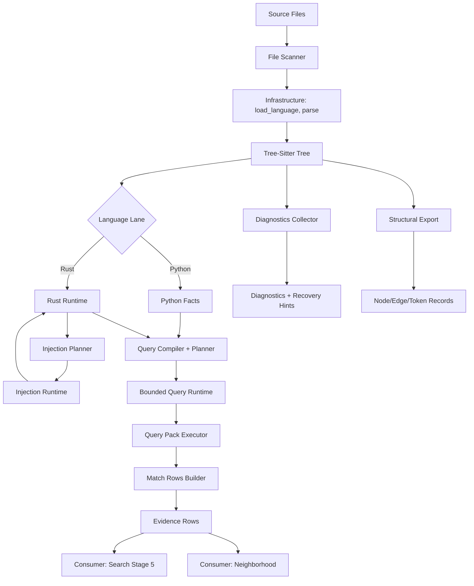

# 07 — Tree-Sitter & Structural Parsing Engine

**Version**: 0.6.0
**Status**: Current State Documentation
**Scope**: Tree-sitter subsystem architecture, language lanes, AST-grep integration, and file scanning infrastructure

This document describes CQ's tree-sitter-based structural parsing engine, a cross-cutting subsystem (~10,300 LOC across 8 subdirectories) that provides AST-level code analysis for Python and Rust. The engine supports bounded query execution, language-specific enrichment lanes, diagnostic collection, and structural exports. It serves as the foundation for search enrichment (stage 5) and neighborhood analysis.

**Cross-References**:
- Doc 02: Search enrichment pipeline (consumes tree-sitter stage 5)
- Doc 08: Neighborhood assembly (consumes tree-sitter collector/query engine)
- Doc 10: Cache stores (tree-sitter blob store, cache contracts)

---

## Module Map

The tree-sitter subsystem lives in `tools/cq/search/tree_sitter/` with the following structure:

| Subdirectory | Purpose | Key Files | Approx LOC |
|--------------|---------|-----------|------------|
| `core/` | Runtime execution, infrastructure, language registry, parsing, adaptive runtime, query pack execution, windowing, highlights | `runtime.py` (604), `infrastructure.py` (289), `parse.py` (302), `language_registry.py` (273), `adaptive_runtime.py` (177), `runtime_support.py` (165), `query_pack_executor.py` (148), `change_windows.py` (132), `highlights_runner.py` (127), `node_utils.py` (121), `work_queue.py` (114) | ~2,453 |
| `contracts/` | Shared data models for tree-sitter subsystem, lane payload contracts, query models | `query_models.py` (283), `core_models.py` (278), `__init__.py` (89), `lane_payloads.py` (66) | ~716 |
| `python_lane/` | Python-specific enrichment | `runtime.py` (687), `facts.py` (630), `fallback_support.py` (353), `locals_index.py` (130) | ~1,801 |
| `rust_lane/` | Rust-specific enrichment, injection runtime | `runtime.py` (1,976), `bundle.py` (221), `injections.py` (226), `injection_runtime.py` (212), `injection_config.py` (93) | ~2,729 |
| `query/` | Query planning, registry, compiler, predicates, specialization, lint, drift detection, contract snapshots | `registry.py` (253), `predicates.py` (217), `lint.py` (187), `planner.py` (186), `drift.py` (161), `specialization.py` (131), `contract_snapshot.py` (123), `support.py` (98), `compiler.py` (67) | ~1,424 |
| `schema/` | Node schema loading, grammar introspection | `node_schema.py` (384) | ~385 |
| `structural/` | Structural export, token export, match rows | `export.py` (268), `exports.py` (166), `match_rows.py` (92) | ~527 |
| Root modules | Diagnostics collection, tags runtime | `diagnostics.py` (194), `tags.py` (94), `__init__.py` (5) | ~293 |

**Total**: ~10,328 LOC

**Related Infrastructure**:
- `tools/cq/astgrep/` — AST-grep integration (~756 LOC)
- `tools/cq/index/` — File scanning infrastructure (~2,294 LOC)
- `tools/cq/search/queries/` — Query files (.scm) for Python/Rust

---

## Core Runtime

### Infrastructure Module

**Location**: `tools/cq/search/tree_sitter/core/infrastructure.py` (~289 LOC)

Central infrastructure utilities consolidating parallel execution, streaming source parsing, parser controls, and language runtime helpers for tree-sitter workloads.

**Key Components**:

#### Parallel Execution

```python
def run_file_lanes_parallel[T, R](
    jobs: Iterable[T],
    *,
    worker: Callable[[T], R],
    max_workers: int,
) -> list[R]:
    """Execute independent file jobs in parallel and return deterministic results."""
```

Uses `ProcessPoolExecutor` with deterministic result ordering. Falls back to sequential execution when `max_workers <= 1`.

#### Streaming Source Parsing

```python
def build_stream_reader(
    source_bytes: bytes,
    *,
    chunk_size: int = 64 * 1024,
) -> Callable[[int, tuple[int, int]], bytes]:
    """Build a callback-based reader compatible with tree-sitter parser.parse."""

def parse_streaming_source(
    parser: object,
    source_bytes: bytes,
    *,
    old_tree: Tree | None = None,
    chunk_size: int = 64 * 1024,
) -> Tree | None:
    """Parse via streaming callback with fail-open fallback to bytes parsing."""
```

**Features**:
- Callback-based streaming for large sources (64KB chunks by default)
- Fail-open fallback: streaming → bytes-only parsing
- Incremental parsing support via `old_tree` parameter

#### Parser Controls

```python
class ParserControlSettingsV1(CqStruct, frozen=True):
    """Parser control-plane settings."""
    reset_before_parse: bool = False
    enable_logger: bool = False
    dot_graph_dir: str | None = None

def parser_controls_from_env() -> ParserControlSettingsV1:
    """Load parser control settings from environment flags."""

def apply_parser_controls(parser: object, settings: ParserControlSettingsV1) -> None:
    """Apply parser controls in a fail-open manner."""
```

**Environment Variables**:
- `CQ_TREE_SITTER_PARSER_RESET=1` — Reset parser before each parse
- `CQ_TREE_SITTER_PARSER_LOGGER=1` — Enable parser logging
- `CQ_TREE_SITTER_DOT_GRAPH_DIR=<path>` — Write DOT graphs for debugging

#### Language Runtime Helpers

```python
def load_language(language: str) -> Language:
    """Load one tree-sitter language."""

def cached_field_ids(language: str) -> dict[str, int]:
    """Return cached field-id map for one language."""

def cached_node_ids(language: str) -> dict[str, int]:
    """Return cached node-kind id map for one language."""

def child_by_field(
    node: Any,
    field_name: str,
    field_ids: dict[str, int],
) -> Any | None:
    """Resolve child by cached field id, falling back to name lookup."""
```

**Features**:
- Centralized language loading with error handling
- LRU-cached field and node ID maps (maxsize=4)
- Optimized child-by-field access using cached field IDs
- Schema-driven field name extraction from grammar metadata

### Language Registry

**Location**: `tools/cq/search/tree_sitter/core/language_registry.py` (~273 LOC)

Provides language introspection registry for tree-sitter schema metadata and runtime capabilities.

**Contracts**:

```python
class TreeSitterLanguageRegistryV1(CqStruct, frozen=True):
    """Normalized grammar metadata for one language lane."""
    language: str
    node_kinds: tuple[str, ...] = ()
    named_node_kinds: tuple[str, ...] = ()
    field_names: tuple[str, ...] = ()
    supertypes: tuple[str, ...] = ()
    grammar_name: str | None = None
    semantic_version: tuple[int, int, int] | None = None
    abi_version: int | None = None

class TreeSitterRuntimeCapabilitiesV1(CqStruct, frozen=True):
    """Capability snapshot for runtime tree-sitter lane integration."""
    language: str
    has_cursor_copy: bool = False
    has_cursor_reset: bool = False
    has_cursor_reset_to: bool = False
    has_goto_first_child_for_byte: bool = False
    has_query_cursor_containing_byte_range: bool = False
    has_query_cursor_containing_point_range: bool = False
```

**Primary Functions**:

```python
@lru_cache(maxsize=4)
def load_tree_sitter_language(language: str) -> Language | None:
    """Load tree-sitter language with LRU cache."""

def build_registry_row(language: str) -> TreeSitterLanguageRegistryV1:
    """Build normalized grammar metadata registry row for one language."""

def build_capabilities_row(language: str) -> TreeSitterRuntimeCapabilitiesV1:
    """Build runtime capability snapshot for one language."""
```

**Features**:
- LRU-cached language loading (maxsize=4 for Python, Rust, and up to 2 injected languages)
- ABI compatibility checks: Validates grammar ABI is within runtime-compatible range
- Semantic version extraction from language objects
- Capability detection for cursor APIs (copy, reset, goto_first_child_for_byte, containing_byte_range, etc.)
- Supertype extraction from grammar metadata

### Core Runtime Execution

**Location**: `tools/cq/search/tree_sitter/core/runtime.py` (~604 LOC)

The core runtime provides bounded query execution with budget management, windowing, and telemetry collection. All queries execute within configurable resource limits.

**Primary Entry Points**:

```python
def run_bounded_query_captures(
    query: Query,
    root: Node,
    *,
    windows: Iterable[QueryWindowV1] | None = None,
    point_windows: Iterable[QueryPointWindowV1] | None = None,
    settings: QueryExecutionSettingsV1 | None = None,
    callbacks: QueryExecutionCallbacksV1 | None = None,
    runtime_label: str = "default",
) -> tuple[list[tuple[int, dict[str, list[Node]]]], QueryExecutionTelemetryV1]:
    """Run bounded tree-sitter query capturing only named captures."""

def run_bounded_query_matches(
    query: Query,
    root: Node,
    *,
    windows: Iterable[QueryWindowV1] | None = None,
    point_windows: Iterable[QueryPointWindowV1] | None = None,
    settings: QueryExecutionSettingsV1 | None = None,
    callbacks: QueryExecutionCallbacksV1 | None = None,
    runtime_label: str = "default",
) -> tuple[list[tuple[int, dict[str, list[Node]]]], QueryExecutionTelemetryV1]:
    """Run bounded tree-sitter query with full match extraction."""
```

**Execution Settings** (from `contracts/core_models.py`):

```python
class QueryExecutionSettingsV1(CqStruct, frozen=True):
    """Execution bounds for one query run."""
    match_limit: int = 4096
    max_start_depth: int | None = None
    budget_ms: int | None = None
    timeout_micros: int | None = None
    require_containment: bool = False
    has_change_context: bool = False
    window_mode: Literal["intersection", "containment_preferred", "containment_required"] = "intersection"
```

**Execution Telemetry**:

```python
class QueryExecutionTelemetryV1(CqStruct, frozen=True):
    """Telemetry emitted by bounded query runners."""
    windows_total: int = 0
    windows_executed: int = 0
    capture_count: int = 0
    match_count: int = 0
    exceeded_match_limit: bool = False
    cancelled: bool = False
    window_split_count: int = 0
    degrade_reason: str | None = None
```

### Runtime Support Utilities

**Location**: `tools/cq/search/tree_sitter/core/runtime_support.py` (~165 LOC)

Consolidates query autotuning, windowing constraint helpers, and budget/deadline management for tree-sitter-based search lanes.

**Query Autotuning**:

```python
class QueryAutotunePlanV1(CqStruct, frozen=True):
    """Derived runtime tuning plan for one query execution lane."""
    budget_ms: int
    match_limit: int
    window_split_target: int

def build_autotune_plan(
    *,
    snapshot: AdaptiveRuntimeSnapshotV1,
    default_budget_ms: int,
    default_match_limit: int,
) -> QueryAutotunePlanV1:
    """Build an execution tuning plan from runtime snapshot telemetry."""
```

**Tuning Logic**:
- Budget: Derives budget_ms from average latency × 4.0, clamped to 50-2000ms range
- Match Limit: Halves default when latency >= 120ms, clamped to 512-16384 range
- Window Split: Sets to 1 for light loads (<100ms), 4 for heavy loads

**Window Application Helpers**:

```python
def apply_point_window(
    *,
    cursor: Any,
    window: QueryPointWindowV1,
    mode: str,
) -> bool:
    """Apply a point window to a query cursor."""

def apply_byte_window(
    *,
    cursor: Any,
    window: QueryWindowV1,
    mode: str,
) -> bool:
    """Apply a byte window to a query cursor."""
```

**Window Modes**:
1. **Intersection** (default): Uses `set_byte_range()` or `set_point_range()` for overlap-based filtering
2. **Containment Preferred**: Tries `set_containing_byte_range()`, falls back to intersection
3. **Containment Required**: Requires `set_containing_byte_range()`, fails if unavailable

### Window-Based Query Execution

**Byte Windows** and **Point Windows** (from `contracts/core_models.py`):

```python
class QueryWindowV1(CqStruct, frozen=True):
    """Inclusive-exclusive byte window for query execution."""
    start_byte: int
    end_byte: int

class QueryPointWindowV1(CqStruct, frozen=True):
    """Inclusive-exclusive point window for row/column anchored execution."""
    start_row: int
    start_col: int
    end_row: int
    end_col: int
```

Window planning aligns byte windows with point windows when both are provided (see `core/runtime.py:_normalized_windows()`, `_normalized_point_windows()`).

### Adaptive Runtime & Auto-Tuning

**Adaptive Runtime** (`core/adaptive_runtime.py`, ~177 LOC):

Tracks query execution latency per language lane and recommends budget adjustments.

```python
class AdaptiveRuntimeSnapshotV1(CqStruct, frozen=True):
    """Adaptive runtime snapshot for one language lane."""
    language: str
    average_latency_ms: float = 0.0
    sample_count: int = 0
    recommended_budget_ms: int = 0

def record_runtime_sample(
    *,
    language: str,
    latency_ms: float,
    runtime_label: str = "default",
) -> None:
    """Record one query execution latency sample."""

def runtime_snapshot(
    *,
    language: str,
    runtime_label: str = "default",
) -> AdaptiveRuntimeSnapshotV1:
    """Return current adaptive runtime snapshot for one language lane."""
```

The runtime automatically applies auto-tuning when settings don't override defaults (see `core/runtime.py:_maybe_autotune()`).

### Parsing Infrastructure

**Parse Sessions** (`core/parse.py`, ~302 LOC):

Provides session-based caching for parsed trees with stats tracking.

```python
class ParseSessionStatsV1(CqStruct, frozen=True):
    """Parse-session counters for observability."""
    entries: int = 0
    cache_hits: int = 0
    cache_misses: int = 0
    parse_count: int = 0
    reparse_count: int = 0
    edit_failures: int = 0

def get_parse_session() -> dict[str, Tree]:
    """Return thread-local parse session cache."""

def clear_parse_session() -> None:
    """Clear thread-local parse session cache."""
```

**Incremental Parsing** supports tree-sitter's incremental parsing with edit application:

```python
@dataclass(frozen=True, slots=True)
class TreeSitterInputEditV1:
    """One ``Tree.edit`` payload for incremental parsing."""
    start_byte: int
    old_end_byte: int
    new_end_byte: int
    start_point: tuple[int, int]
    old_end_point: tuple[int, int]
    new_end_point: tuple[int, int]
```

### Query Pack Executor

**Location**: `tools/cq/search/tree_sitter/core/query_pack_executor.py` (~148 LOC)

Shared delegation wrappers for executing query packs with bounded captures and matches. Eliminates duplicate match-row building logic across Python and Rust lanes.

**Primary Functions**:

```python
def execute_pack_rows(
    *,
    query: Query,
    query_name: str,
    root: Node,
    source_bytes: bytes,
    windows: tuple[QueryWindowV1, ...],
    settings: QueryExecutionSettingsV1,
    callbacks: QueryExecutionCallbacksV1 | None = None,
) -> tuple[
    dict[str, list[Node]],
    tuple[ObjectEvidenceRowV1, ...],
    tuple[TreeSitterQueryHitV1, ...],
    QueryExecutionTelemetryV1,
    QueryExecutionTelemetryV1,
]:
    """Execute captures + matches and project row/hit payloads for one query pack."""

def execute_pack_rows_with_matches(
    *,
    query: Query,
    query_name: str,
    root: Node,
    source_bytes: bytes,
    windows: tuple[QueryWindowV1, ...],
    settings: QueryExecutionSettingsV1,
    callbacks: QueryExecutionCallbacksV1 | None = None,
) -> tuple[
    dict[str, list[Node]],
    list[tuple[int, dict[str, list[Node]]]],
    tuple[ObjectEvidenceRowV1, ...],
    tuple[TreeSitterQueryHitV1, ...],
    QueryExecutionTelemetryV1,
    QueryExecutionTelemetryV1,
]:
    """Execute captures + matches and include raw match tuples."""
```

**Features**:
- Delegating wrappers to `run_bounded_query_captures()` and `run_bounded_query_matches()` from core runtime
- Automatic match settings adjustment (containment_preferred mode for matches)
- Single-call captures + matches + evidence row projection via `build_match_rows_with_query_hits()`
- Returns separate telemetry for captures and matches phases

### Node Utilities

**Location**: `tools/cq/search/tree_sitter/core/node_utils.py` (~121 LOC)

Shared UTF-8 text extraction and byte span normalization helpers for tree-sitter node operations.

**Primary Functions**:

```python
def node_text(
    node: object,
    source_bytes: bytes,
    *,
    strip: bool = True,
    max_len: int | None = None,
) -> str:
    """Extract UTF-8 text for a tree-sitter node byte span."""

def node_byte_span(node: object) -> tuple[int, int]:
    """Extract (start_byte, end_byte) tuple from node."""
```

**Features**:
- UTF-8 decoding with error replacement (`errors="replace"`)
- Optional whitespace stripping (default: enabled)
- Optional truncation with `...` suffix
- Handles empty/invalid spans gracefully

### Change Windows

**Location**: `tools/cq/search/tree_sitter/core/change_windows.py` (~132 LOC)

Changed-range window queueing for incremental parsing workflows.

```python
class TreeSitterWorkItemV1(CqStruct, frozen=True):
    """Queued changed-range work item."""
    start_byte: int
    end_byte: int
    priority: int = 0
```

### Work Queue

**Location**: `tools/cq/search/tree_sitter/core/work_queue.py` (~114 LOC)

Work queue management for changed-range parsing and query execution.

### Highlights Runner

**Location**: `tools/cq/search/tree_sitter/core/highlights_runner.py` (~127 LOC)

Syntax highlighting support using tree-sitter highlight queries.

---

## Contracts Layer

### Core Models

**Location**: `tools/cq/search/tree_sitter/contracts/core_models.py` (~278 LOC)

Provides shared msgspec-based data models for the tree-sitter subsystem. All contracts inherit from `CqStruct` or `CqCacheStruct` for serialization.

**Key Contract Groups**:

- **Runtime Execution**: `QueryWindowV1`, `QueryPointWindowV1`, `QueryExecutionSettingsV1`, `QueryExecutionTelemetryV1`, `AdaptiveRuntimeSnapshotV1`, `QueryAutotunePlanV1`
- **Diagnostics**: `TreeSitterDiagnosticV1` — Syntax diagnostic row (ERROR/MISSING nodes)
- **Structural Export**: `TreeSitterStructuralNodeV1`, `TreeSitterStructuralEdgeV1`, `TreeSitterCstTokenV1`, `TreeSitterStructuralExportV1`
- **Evidence**: `ObjectEvidenceRowV1` — Metadata-backed object evidence row
- **Injection**: `InjectionRuntimeResultV1` — Result of parsing injected ranges
- **Work Queue**: `TreeSitterWorkItemV1` — Queued changed-range work item
- **Query Hits**: `TreeSitterQueryHitV1` — Query match hit metadata
- **Parsing**: `TreeSitterInputEditV1`, `ParseSessionStatsV1`, `QueryWindowSourceV1`, `QueryWindowSetV1`

### Query Models

**Location**: `tools/cq/search/tree_sitter/contracts/query_models.py` (~283 LOC)

Contracts for query planning, packs, and metadata. This module now uses typed boundary integration for YAML contract loading.

**Key Contracts**:

```python
class QueryPatternPlanV1(CqStruct, frozen=True):
    """Per-pattern planning metadata."""
    pattern_idx: int
    rooted: bool
    non_local: bool
    guaranteed_step0: bool
    assertions: int
    capture_quantifiers: dict[str, str]
    score: float

class QueryPackPlanV1(CqStruct, frozen=True):
    """Pack-level planning metadata."""
    pack_name: str
    query_hash: str
    plans: tuple[QueryPatternPlanV1, ...]
    score: float

class QueryPackRulesV1(CqStruct, frozen=True):
    """Query pack validation rules."""
    require_rooted: bool = False
    forbid_non_local: bool = False

class QueryPackContractsFileV1(CqStruct, frozen=True):
    """Top-level contracts file payload with language, version, and rules."""
    language: str
    version: str
    rules: QueryPackRulesV1 = msgspec.field(default_factory=QueryPackRulesV1)
```

**Typed Boundary Integration**:

```python
def load_pack_rules(language: str) -> QueryPackRulesV1:
    """Load query-pack rules from contracts.yaml, falling back to defaults."""
    path = query_contracts_path(language)
    if not path.exists():
        return QueryPackRulesV1()
    try:
        from tools.cq.core.typed_boundary import decode_yaml_strict
        payload = decode_yaml_strict(path.read_bytes(), type_=QueryPackContractsFileV1)
        return payload.rules
    except (OSError, BoundaryDecodeError):
        return QueryPackRulesV1()
```

This replaces ~100 LOC of inline YAML parsing with strict type-safe decoding via `decode_yaml_strict()` from `tools.cq.core.typed_boundary`.

### Lane Payload Contracts

**Location**: `tools/cq/search/tree_sitter/contracts/lane_payloads.py` (~66 LOC)

Typed contracts and canonicalization helpers for lane-specific payload keys. Handles legacy key migration (`tree_sitter_diagnostics` → `cst_diagnostics`).

**Key Contracts**:

```python
class PythonTreeSitterPayloadV1(CqOutputStruct, frozen=True):
    """Canonical Python lane payload contract subset."""
    language: str = "python"
    enrichment_status: str = "applied"
    cst_diagnostics: list[dict[str, Any]] = msgspec.field(default_factory=list)
    cst_query_hits: list[dict[str, Any]] = msgspec.field(default_factory=list)
    query_runtime: dict[str, Any] = msgspec.field(default_factory=dict)

class RustTreeSitterPayloadV1(CqOutputStruct, frozen=True):
    """Canonical Rust lane payload contract subset."""
    language: str = "rust"
    enrichment_status: str = "applied"
    cst_diagnostics: list[dict[str, Any]] = msgspec.field(default_factory=list)
    cst_query_hits: list[dict[str, Any]] = msgspec.field(default_factory=list)
    query_runtime: dict[str, Any] = msgspec.field(default_factory=dict)
```

**Canonicalization Functions**:

```python
def canonicalize_python_lane_payload(payload: dict[str, Any]) -> dict[str, Any]:
    """Canonicalize Python lane payload diagnostics/query-hit keys."""

def canonicalize_rust_lane_payload(payload: dict[str, Any]) -> dict[str, Any]:
    """Canonicalize Rust lane payload diagnostics/query-hit keys."""
```

**Features**:
- Legacy key migration without breaking existing callers
- Type-safe conversion via `msgspec.convert()` with `strict=False`
- Mapping-row coercion for list-of-dict fields
- Shared pattern for both Python and Rust lanes

---

## Python Lane

The Python lane provides Python-specific structural fact extraction and enrichment. It's the primary consumer of tree-sitter for Python code analysis.

### Python Facts Extraction

**Location**: `tools/cq/search/tree_sitter/python_lane/facts.py` (~630 LOC)

**Primary Entry Point**:

```python
def build_python_tree_sitter_facts(
    source: str,
    *,
    byte_start: int,
    byte_end: int,
    cache_key: str | None = None,
    match_limit: int = 4096,
    query_budget_ms: int | None = None,
) -> dict[str, object] | None:
    """Build tree-sitter-first structural facts for one byte range."""
```

Facts are extracted via query packs loaded from `.scm` files with validation (rooted pattern checks, non-local pattern checks).

**Key Operations**:
- **Anchor Lifting**: Lifts match anchors to containing syntactic structures (call, attribute, assignment, import, function_definition, class_definition)
- **Scope Chain Construction**: Builds hierarchical scope chain from anchor to module root (see `_scope_chain()`)

**Uses**:
- `execute_pack_rows()` from `query_pack_executor.py` to eliminate duplicate match-row building
- `node_text()` helper from `node_utils.py` for consistent text extraction
- Returns canonicalized payload via `canonicalize_python_lane_payload()`

### Python Runtime

**Location**: `tools/cq/search/tree_sitter/python_lane/runtime.py` (~687 LOC)

Provides Python-specific parsing, incremental parsing, and runtime helpers.

**Primary Functions**:

```python
def is_tree_sitter_python_available() -> bool:
    """Check if tree-sitter-python bindings are available."""

def parse_python_tree_with_ranges(
    source: str,
    *,
    old_tree: Tree | None = None,
) -> tuple[Tree | None, tuple[QueryWindowV1, ...]]:
    """Parse Python tree and extract changed-range windows."""
```

**Features**:
- Availability check (`is_tree_sitter_python_available()`)
- Incremental parsing (`parse_python_tree_with_ranges()`)
- Changed range window integration
- Uses `node_text()` helper from `node_utils.py` for text extraction
- Returns canonicalized payloads via `canonicalize_python_lane_payload()`

### Python Locals Index

**Location**: `tools/cq/search/tree_sitter/python_lane/locals_index.py` (~130 LOC)

Builds locals/globals scope index for Python files using tree-sitter queries.

### Python Fallback Support

**Location**: `tools/cq/search/tree_sitter/python_lane/fallback_support.py` (~353 LOC)

Provides graceful degradation when tree-sitter bindings are unavailable. All Python lane functions fail-open with empty results when tree-sitter is missing.

---

## Rust Lane

The Rust lane provides Rust-specific enrichment with injection support for embedded languages (e.g., proc macros, doc comments).

### Rust Runtime

**Location**: `tools/cq/search/tree_sitter/rust_lane/runtime.py` (~1,976 LOC)

**Enrichment Contract**:
All fields produced by the Rust lane are strictly additive. They never affect confidence scores, match counts, category classification, or relevance ranking. They may affect `containing_scope` display (used only for grouping in output).

**Primary Entry Point**:

```python
def enrich_rust_match(
    *,
    root: Path,
    file: str,
    anchor_line: int,
    anchor_col: int,
    candidates: Sequence[str],
) -> dict[str, object]:
    """Enrich one Rust match location with tree-sitter structural facts."""
```

**Field Groups**:
1. **Core**: `node_kind`, `scope_chain`, `scope_kind`, `scope_name`, `language`, `enrichment_status`, `enrichment_sources`, `degrade_reason`
2. **Signature**: `params`, `return_type`, `generics`, `signature`, `is_async`, `is_unsafe`
3. **Visibility**: `visibility`
4. **Attributes**: `attributes`
5. **Impl Context**: `impl_type`, `impl_trait`, `impl_kind`, `impl_generics`
6. **Call Target**: `call_target`, `call_receiver`
7. **Struct/Enum**: `fields`, `variants`

**Scope Kinds**: `function_item`, `struct_item`, `enum_item`, `trait_item`, `impl_item`, `mod_item`, `macro_invocation`

**Uses**:
- `execute_pack_rows_with_matches()` from `query_pack_executor.py` for captures + matches + rows + hits
- `node_text()` helper from `node_utils.py` for consistent text extraction
- Returns canonicalized payloads via `canonicalize_rust_lane_payload()`

Integrates with `diagnostics.py` for diagnostics collection.

### Rust Injections

**Location**: `tools/cq/search/tree_sitter/rust_lane/injections.py` (~226 LOC)

Injection planning identifies embedded language regions (e.g., SQL in string literals, proc macro bodies).

```python
class InjectionPlanV1(CqStruct, frozen=True):
    """One injection plan row for embedded language parsing."""
    language: str
    start_byte: int
    end_byte: int
    start_row: int
    start_col: int
    end_row: int
    end_col: int
    profile_name: str | None = None
    combined: bool = False
    include_children: bool = False
    use_self_language: bool = False
    use_parent_language: bool = False
```

**Language Resolution Waterfall**:
1. Explicit `settings.language` from query metadata
2. Language capture from match (`@language`)
3. `use_self_language` or `use_parent_language` flags
4. Profile language from injection profile
5. Default language from context

### Rust Injection Runtime

**Location**: `tools/cq/search/tree_sitter/rust_lane/injection_runtime.py` (~212 LOC)

Executes injection plans by parsing embedded language regions with tree-sitter.

**Primary Entry Point**:

```python
def parse_injected_ranges(
    *,
    language: str,
    source_bytes: bytes,
    injection_plans: Iterable[InjectionPlanV1],
) -> InjectionRuntimeResultV1:
    """Parse injected language ranges and return result with metadata."""
```

Tree-sitter supports parsing non-contiguous byte ranges via `set_included_ranges()` for multi-region parsing.

### Rust Injection Config

**Location**: `tools/cq/search/tree_sitter/rust_lane/injection_config.py` (~93 LOC)

Provides pattern-level injection settings derived from query metadata.

```python
class InjectionSettingsV1(CqStruct, frozen=True):
    """Pattern-level injection settings."""
    language: str | None = None
    combined: bool = False
    include_children: bool = False
    use_self_language: bool = False
    use_parent_language: bool = False
```

**Metadata Keys**:
- `injection.language`, `injection.combined`, `injection.include-children`, `injection.self`, `injection.parent`

### Rust Bundle

**Location**: `tools/cq/search/tree_sitter/rust_lane/bundle.py` (~221 LOC)

Bundles Rust grammar and query sources for runtime loading.

**Uses**:
- `RustTreeSitterPayloadV1` contract for type-safe payload validation
- Consistent with Python lane contract usage

---

## Query Planning

Query planning prioritizes patterns based on structural properties and builds execution plans with cost estimates.

### Query Compiler

**Location**: `tools/cq/search/tree_sitter/query/compiler.py` (~67 LOC)

Shared tree-sitter query compilation helper with rooted/non-local validation.

**Primary Function**:

```python
@lru_cache(maxsize=256)
def compile_query(
    *,
    language: str,
    pack_name: str,
    source: str,
    request_surface: str = "artifact",
    validate_rules: bool = True,
) -> Query:
    """Compile and specialize a query with shared rooted/non-local validation."""
```

**Features**:
- LRU-cached compilation (maxsize=256)
- Request surface specialization (artifact, diagnostic, terminal)
- Rule validation enforcement (rooted/non-local checks)

### Query Registry

**Location**: `tools/cq/search/tree_sitter/query/registry.py` (~253 LOC)

Loads query packs from `.scm` files and manages pack metadata. Packs loaded from `tools/cq/search/queries/{language}/*.scm`.

**Uses**:
- `query_registry_cache()` from `support.py` for stampede guards
- `query_pack_dir()` from `support.py` for canonical path construction

### Query Planner

**Location**: `tools/cq/search/tree_sitter/query/planner.py` (~186 LOC)

Builds deterministic per-pattern planning rows with scoring.

**Pattern Scoring**:
- Rooted patterns: +2.0 (fast)
- Guaranteed at step 0: +1.2 (optimized)
- Has assertions: +1.0 (reduces match set)
- Has captures: +0.5 (needed for evidence)
- Non-local patterns: -2.5 (slow)

**Functions**:

```python
def build_pattern_plan(query: Query, pattern_idx: int) -> QueryPatternPlanV1:
    """Build per-pattern planning rows from compiled query."""

def build_pack_plan(
    *,
    query: Query,
    pack_name: str,
) -> QueryPackPlanV1:
    """Build pack summary for scheduling and cache keys."""

def sort_pack_plans(plans: Sequence[QueryPackPlanV1]) -> tuple[QueryPackPlanV1, ...]:
    """Sort query packs from highest to lowest score."""
```

### Query Support Utilities

**Location**: `tools/cq/search/tree_sitter/query/support.py` (~98 LOC)

Merged query utility helpers: resource paths, pack metadata, cache adapter.

**Resource Paths**:

```python
def query_pack_dir(language: str) -> Path:
    """Return the query pack directory for one language lane."""

def query_pack_path(language: str, pack_name: str) -> Path:
    """Return the absolute path for one query pack source file."""

def query_contracts_path(language: str) -> Path:
    """Return the absolute path for one query contracts YAML file."""

def diagnostics_query_path(language: str) -> Path:
    """Return the absolute path for one diagnostics query pack file."""
```

All paths are computed relative to `_QUERY_ROOT = Path(__file__).resolve().parents[2] / "queries"`.

**Pack Metadata**:

```python
def pattern_settings(query: object, pattern_idx: int) -> dict[str, str]:
    """Return normalized string-only metadata for one pattern index."""

def first_capture(capture_map: Mapping[str, Sequence[object]], capture_name: str) -> object | None:
    """Return first node for capture name when available."""
```

**Cache Adapter**:

```python
def query_registry_cache(*, root: Path | None = None) -> FanoutCache | None:
    """Return a cache object for query registry stampede guards."""
```

**Features**:
- Lazy import to avoid import-time cycles between query modules and cache bootstrap modules
- Returns `None` when cache backend is unavailable
- Validates cache object has required `get` and `set` methods

### Query Predicates

**Location**: `tools/cq/search/tree_sitter/query/predicates.py` (~217 LOC)

Custom predicate support for advanced query constraints. Provides predicate callbacks and custom predicate detection.

### Query Specialization

**Location**: `tools/cq/search/tree_sitter/query/specialization.py` (~131 LOC)

Applies runtime optimizations to compiled queries based on request surface.

### Query Lint

**Location**: `tools/cq/search/tree_sitter/query/lint.py` (~187 LOC)

Lint-time validation for query packs: node kind checks, field name checks, duplicate pattern detection.

### Grammar Drift Detection

**Location**: `tools/cq/search/tree_sitter/query/drift.py` (~161 LOC)

Detects when query files reference node types not present in the current grammar version.

### Contract Snapshot

**Location**: `tools/cq/search/tree_sitter/query/contract_snapshot.py` (~123 LOC)

Snapshot utility for extracting contract metadata from query packs.

---

## Schema & Code Generation

### Node Schema

**Location**: `tools/cq/search/tree_sitter/schema/node_schema.py` (~384 LOC)

Loads static node-type schemas from tree-sitter language objects for query validation.

**Contracts**:

```python
class GrammarNodeTypeV1(CqStruct, frozen=True):
    """One node-type row from node-types.json."""
    type: str
    named: bool
    fields: dict[str, object] = msgspec.field(default_factory=dict)

class GrammarSchemaV1(CqStruct, frozen=True):
    """Simplified grammar schema for lint-time checks."""
    language: str
    node_types: tuple[GrammarNodeTypeV1, ...]

class GrammarSchemaIndex(CqStruct, frozen=True):
    """Runtime indexes for fast lint lookups."""
    named_node_kinds: frozenset[str]
    all_node_kinds: frozenset[str]
    field_names: frozenset[str]
```

**Primary Functions**:

```python
def load_grammar_schema(language: str) -> GrammarSchemaV1 | None:
    """Load grammar schema for one language."""

def build_runtime_ids(language_obj: object) -> dict[str, int]:
    """Build node-kind id map from language object."""

def build_runtime_field_ids(
    language_obj: object,
    *,
    field_names: tuple[str, ...],
) -> dict[str, int]:
    """Build field-id map from language object."""
```

Node types loaded from generated modules (`tools.cq.search.generated.{python,rust}_node_types_v1`) or runtime language objects.

---

## Structural Exports

Structural exports provide deterministic CST/AST representations for graph building and external analysis.

### Structural Export

**Location**: `tools/cq/search/tree_sitter/structural/export.py` (~268 LOC)

Exports tree-sitter trees as node/edge/token tuples.

```python
def export_tree_structure(
    root: Node,
    *,
    include_tokens: bool = True,
) -> TreeSitterStructuralExportV1:
    """Export tree structure as deterministic node/edge/token records."""
```

**Export Contracts**:

```python
class TreeSitterStructuralNodeV1(CqStruct, frozen=True):
    """One structural node row."""
    node_id: int
    node_kind: str
    is_named: bool
    start_byte: int
    end_byte: int
    start_row: int
    start_col: int
    end_row: int
    end_col: int

class TreeSitterStructuralEdgeV1(CqStruct, frozen=True):
    """One structural edge row (parent → child)."""
    parent_id: int
    child_id: int
    edge_index: int
    field_name: str | None = None

class TreeSitterCstTokenV1(CqStruct, frozen=True):
    """One CST token row."""
    node_id: int
    text: str
    start_byte: int
    end_byte: int

class TreeSitterStructuralExportV1(CqStruct, frozen=True):
    """Complete structural export payload."""
    nodes: tuple[TreeSitterStructuralNodeV1, ...]
    edges: tuple[TreeSitterStructuralEdgeV1, ...]
    tokens: tuple[TreeSitterCstTokenV1, ...]
```

### Structural Exports (Alternative Module)

**Location**: `tools/cq/search/tree_sitter/structural/exports.py` (~166 LOC)

Alternative structural export implementation (possibly for different export formats or legacy compatibility).

### Match Rows

**Location**: `tools/cq/search/tree_sitter/structural/match_rows.py` (~92 LOC)

Builds metadata-driven evidence rows from query matches.

```python
class ObjectEvidenceRowV1(CqStruct, frozen=True):
    """Metadata-backed object evidence row."""
    emit: str
    kind: str
    anchor_start_byte: int
    anchor_end_byte: int
    pattern_index: int
    captures: dict[str, object] = msgspec.field(default_factory=dict)
```

**Metadata Keys**: `cq.emit`, `cq.kind`, `cq.anchor` (capture name to use as anchor node)

---

## Diagnostics

### Diagnostic Collection

**Location**: `tools/cq/search/tree_sitter/diagnostics.py` (~194 LOC)

Collects tree-sitter syntax diagnostics (ERROR/MISSING nodes) with recovery hints.

**Diagnostic Contract**:

```python
class TreeSitterDiagnosticV1(CqStruct, frozen=True):
    """One tree-sitter syntax diagnostic."""
    kind: str
    start_byte: int
    end_byte: int
    start_line: int
    start_col: int
    end_line: int
    end_col: int
    message: str
    metadata: dict[str, object] = msgspec.field(default_factory=dict)
```

Diagnostics collected via `.scm` files (`queries/{python,rust}/95_diagnostics.scm`) with patterns like:

```scheme
(ERROR) @error
(MISSING) @missing
```

**Primary Functions**:

```python
def recovery_hints_for_node(
    *,
    language: object,
    node: object,
    max_expected: int = 12,
) -> tuple[str, ...]:
    """Return expected node kinds near parse failure boundaries."""

def collect_diagnostics(
    *,
    language: str,
    root: Node,
    source_bytes: bytes,
) -> tuple[TreeSitterDiagnosticV1, ...]:
    """Collect syntax diagnostics for one parsed tree."""
```

**Uses**:
- `load_language()` from `infrastructure.py` for language loading
- `diagnostics_query_path()` from `support.py` for query file paths

**Recovery Hints**:
Provides contextual recovery hints for common syntax errors: missing closing delimiters, unexpected tokens, invalid operators, malformed string literals, language-specific common mistakes.

---

## Tags Runtime

### Tags Extraction

**Location**: `tools/cq/search/tree_sitter/tags.py` (~94 LOC)

Flattened tags: contracts and runtime helpers for tags extraction.

**Contracts**:

```python
class RustTagEventV1(CqStruct, frozen=True):
    """One Rust tag event row derived from tags query captures."""
    role: str
    kind: str
    name: str
    start_byte: int
    end_byte: int
    metadata: dict[str, object] = msgspec.field(default_factory=dict)
```

**Primary Function**:

```python
def build_tag_events_from_captures(
    captures: Mapping[str, Sequence[object]],
    *,
    source_bytes: bytes,
) -> tuple[RustTagEventV1, ...]:
    """Build tag event rows from capture map."""
```

**Features**:
- Role normalization (definition, reference)
- Kind extraction from capture metadata
- Name extraction via `node_text()` helper

---

## AST-Grep Integration

CQ integrates ast-grep via Python library bindings (`ast_grep_py`) for pattern-based structural search. This complements tree-sitter's query system with a simpler pattern syntax.

### AST-Grep Architecture

**Location**: `tools/cq/astgrep/` (~756 LOC)

**Key Files**:
- Scanner and rule execution logic (~756 LOC total)
- `rules_py.py` — Python rule definitions (23 rules)
- `rules_rust.py` — Rust rule definitions (8 rules)
- Language dispatch infrastructure

### Library Binding over Subprocess

CQ uses `ast_grep_py` library bindings instead of subprocess CLI invocation:

```python
from ast_grep_py import Config, Rule, SgNode, SgRoot

sg_root = SgRoot(src, lang)              # Parse source code
node = sg_root.root()                     # Get AST root
matches = node.find_all(pattern=pattern)  # Library API
```

**Benefits**: No subprocess overhead, direct `SgNode` access for enrichment, metavariable extraction, library-level error handling, memory-efficient shared AST.

### Rule Specification

**RuleSpec** (from ast-grep scanner):
- `rule_id` — e.g., "py_def_function"
- `record_type` — def, call, import, raise, except, assign_ctor
- `kind` — function, class, name_call, etc.
- `config` — ast-grep-py rule configuration

### Complexity-Based Rule Routing

Three routing paths based on rule structure complexity:

1. **Full Config Path** (has `rule`/`utils`/`constraints` keys): Uses full config API
2. **Complex Rule Path** (has relational constraints): Uses rule wrapper. Complex keys: `regex`, `not`, `has`, `all`, `any`, `inside`, `follows`, `precedes`, `nthChild`
3. **Simple Pattern/Kind Path**: Uses direct pattern or kind API

### Language-Dispatched Rule Loading

**Python Rules** (`rules_py.py`):
- 23 rules across 6 record types
- Record types: `def` (7 rules), `call` (2 rules), `import` (6 rules), `raise` (3 rules), `except` (3 rules), `assign_ctor` (2 rules)

**Rust Rules** (`rules_rust.py`):
- 8 rules: function, struct, enum, trait, module, call_expression, macro_invocation, use_declaration

---

## File Scanning / Code Indexing

### File Discovery Pipeline

**Location**: `tools/cq/index/files.py` (~2,294 LOC total for index module)

Provides gitignore-aware file enumeration for repo scanning.

**Pipeline Stages**:
1. **Scope Resolution**: Convert relative paths to absolute, verify existence
2. **Tracked Filtering**: Intersect git index with scope + extensions
3. **Untracked Collection**: Recursive filesystem scan with gitignore filtering
4. **Glob Filtering**: Apply user-specified glob patterns (optional)

### Git Integration

**RepoFileIndex**:
- `repo_root`, `tracked` (git index entries), `ignore_spec` (compiled gitignore rules)

Uses `pygit2` for direct libgit2 bindings (no subprocess, fast index access, efficient for large repos).

### Gitignore Integration

Uses `pathspec` library for standard git semantics. Explain mode available for debugging filter decisions.

### File Type Detection

**Extension-Based** (no content sniffing):
- Python: `.py`, `.pyi`
- Rust: `.rs`
- Auto scope: union of all extensions

Trade-off: Misses files without extensions (e.g., Python scripts without `.py`). Acceptable for CQ's use case (primarily scans structured repos with standard conventions).

### Untracked File Collection

**Two Modes**:
1. **File Mode**: Scope is single file
2. **Tree Mode**: Scope is directory (recursive scan with early exits)

Tree mode uses `Path.rglob("*")` with efficient filtering (skip `.git`, non-candidates, tracked files, gitignored files).

### Glob Filtering

**Semantics**:
- Positive globs: Include only matching files
- Negative globs (`!pattern`): Exclude matching files
- Mixed: Last matching glob wins
- No globs: Include all files

---

## Consumer Interfaces

### Search Enrichment (Stage 5)

**Location**: `tools/cq/search/enrichment.py`

The search pipeline consumes tree-sitter in enrichment stage 5 as the final enrichment layer.

**Enrichment Pipeline**:
1. **ast-grep** — Pattern-based structural search
2. **python_ast** — Built-in AST analysis
3. **import_detail** — Import resolution
4. **libcst** — CST-based analysis
5. **tree_sitter** — Tree-sitter facts (final stage)

**Stage 5 Responsibilities**: Scope chain construction, signature extraction, call graph edges, diagnostic collection, structural export (optional).

### Neighborhood Assembly

**Location**: `tools/cq/neighborhood/tree_sitter_neighborhood_query_engine.py` (~200 LOC estimated)

The neighborhood system consumes tree-sitter for semantic slicing:

```python
def collect_callers_callees(
    *,
    language: str,
    tree_root: Node,
    anchor: Node,
    source_bytes: bytes,
    anchor_name: str,
) -> tuple[list[Node], list[Node]]:
    """Collect caller and callee nodes using neighborhood query packs."""
```

Uses neighborhood query packs (`queries/{python,rust}/10_calls.scm`) with bounded query execution. Executes global window query for callers and subtree window query for callees.

---

## Caching

### Tree-Sitter Blob Store

**Location**: Cross-referenced in doc 10 (Runtime Services)

Tree-sitter parsed trees are cached in blob store for reuse across queries.

**Cache Key Structure**: `tree_sitter:{language}:{file_hash}:{content_hash}`

**Cache Store Contract**:

```python
class TreeSitterBlobCacheV1(CqCacheStruct, frozen=True):
    """Tree-sitter blob cache entry."""
    language: str
    file_path: str
    content_hash: str
    tree_bytes: bytes
    parse_duration_ms: float
    node_count: int
    max_depth: int
```

**Serialization**: Tree-sitter trees are not directly serializable. The cache stores structural exports (node/edge/token tuples) and query results (match rows).

**Invalidation**: Content hash change (file modified), grammar version change (tree-sitter upgrade).

### Query Result Caching

**Cache Key Structure**: `query_result:{language}:{query_hash}:{file_hash}:{window_hash}`

**Cache Entry**:

```python
class QueryResultCacheV1(CqCacheStruct, frozen=True):
    """Query result cache entry."""
    query_hash: str
    file_path: str
    window_hash: str
    matches: tuple[object, ...]
    telemetry: QueryExecutionTelemetryV1
```

---

## Architecture Summary

### Data Flow



### Execution Flow

**Query Execution Lifecycle**:

1. **Load Language** — `load_language()` from infrastructure with ABI checks
2. **Compile Query Pack** — `compile_query()` with rule validation
3. **Plan Patterns** — Score patterns, sort by priority
4. **Apply Auto-Tune** — `build_autotune_plan()` from runtime snapshot
5. **Build Windows** — Normalize byte windows + point windows
6. **Execute Per Window** — `run_bounded_query_captures()` or `run_bounded_query_matches()`
7. **Collect Matches** — Via `execute_pack_rows()` or `execute_pack_rows_with_matches()`
8. **Build Evidence** — Convert matches to `ObjectEvidenceRowV1` via `build_match_rows_with_query_hits()`
9. **Record Telemetry** — Update adaptive runtime snapshot via `record_runtime_sample()`
10. **Cache Results** — Store evidence rows in blob store
11. **Canonicalize Output** — Apply lane-specific payload canonicalization

### Key Invariants

**Bounded Execution**:
- All queries execute within configurable resource limits
- Budget enforcement via progress callbacks and deadlines
- Match limits prevent unbounded result sets
- Window modes support intersection and containment-based filtering

**Fail-Open Design**:
- Tree-sitter unavailable → degrade to empty results
- Parse failure → continue with error diagnostics
- Query timeout → return partial results + telemetry
- ABI incompatibility → raise `RuntimeError` at load time

**Determinism**:
- Pattern scoring is deterministic
- Match order is deterministic within pattern
- Evidence rows are ordered by anchor byte position
- Parallel file lanes return results in input order

**Language Separation**:
- Python lane and Rust lane share no mutable state
- Each lane has independent parser session cache
- Injection runtime is Rust-specific (Python has no injections)
- Language registry provides isolated LRU cache per language (maxsize=4)

**Additive Enrichment**:
- Tree-sitter never modifies existing finding data
- All enrichment fields are optional
- Enrichment failure never blocks core analysis
- Legacy key migration preserves backward compatibility

### Performance Characteristics

**Parser Performance**:
- Cold parse: ~1-5ms per file (Python), ~2-10ms (Rust)
- Cached parse: <0.1ms (session cache hit)
- Incremental parse: ~50% of cold parse (depends on edit size)
- Streaming parse: Same latency, lower memory for large files

**Query Performance**:
- Rooted pattern: ~0.5-2ms per file
- Non-local pattern: ~5-50ms per file (depends on tree size)
- Auto-tuned budget: 50-2000ms (adapts to runtime latency)
- Window split: 1-4 splits based on latency thresholds

**Memory Usage**:
- Parsed tree: ~10-50KB per file
- Query result: ~1-10KB per file (depends on match count)
- Session cache: Unbounded (cleared per command invocation)
- Language cache: LRU maxsize=4 (Python, Rust, + 2 injected)

**Scaling**:
- Linear with file count (each file parsed independently)
- Linear with tree size (query execution proportional to node count)
- Parallel-friendly (no shared mutable state across files via `run_file_lanes_parallel()`)

### Improvement Vectors

**Query Planning**:
- Current: Pattern scoring based on static properties
- Improvement: Runtime cost estimation from execution telemetry
- Impact: Better pack prioritization, earlier termination

**Caching**:
- Current: Session-scoped (in-memory, cleared per command)
- Improvement: Persistent cache with file mtime tracking
- Impact: Cross-command reuse, faster multi-step workflows

**Injection Runtime**:
- Current: Rust-only, limited to proc macros and doc comments
- Improvement: Python injection support (SQL in strings, etc.)
- Impact: Broader enrichment coverage

**Diagnostics**:
- Current: Binary ERROR/MISSING detection with recovery hints
- Improvement: Recovery hint ranking, fix suggestions
- Impact: Better error messages, potential auto-fix integration

**Parallel Execution**:
- Current: File-level parallelism via `run_file_lanes_parallel()`
- Improvement: Query-level parallelism within files
- Impact: Faster large-file analysis (requires shared-nothing refactor)

---

## Related Documentation

- **Doc 02: Search Pipeline** — How search enrichment consumes tree-sitter stage 5
- **Doc 08: Neighborhood Assembly** — How neighborhood uses tree-sitter for semantic slicing
- **Doc 10: Runtime Services** — Cache store contracts, blob serialization
- **Tree-Sitter Queries**: `tools/cq/search/queries/{python,rust}/*.scm`
- **AST-Grep Rules**: `tools/cq/astgrep/rules_{py,rust}.py`

---

## Refactoring Summary (v0.6.0)

The current architecture reflects consolidation and infrastructure improvements:

### Consolidated Infrastructure

1. **Infrastructure Module** (`core/infrastructure.py`, ~289 LOC): Consolidates parallel execution (`run_file_lanes_parallel()`), streaming source parsing (`build_stream_reader()`, `parse_streaming_source()`), parser controls (`parser_controls_from_env()`, `apply_parser_controls()`), and language runtime helpers (`load_language()`, `cached_field_ids()`, `cached_node_ids()`, `child_by_field()`).

2. **Runtime Support** (`core/runtime_support.py`, ~165 LOC): Consolidates query autotuning (`build_autotune_plan()`), windowing constraint helpers (`apply_point_window()`, `apply_byte_window()`), and budget/deadline management.

3. **Query Support** (`query/support.py`, ~98 LOC): Merges resource paths (`query_pack_dir()`, `query_pack_path()`, `query_contracts_path()`, `diagnostics_query_path()`), pack metadata (`pattern_settings()`, `first_capture()`), and cache adapter (`query_registry_cache()`).

### Flattened Modules

1. **Diagnostics** (`diagnostics.py`, ~194 LOC): Flattened from `diagnostics/collector.py` + `diagnostics/recovery_hints.py` into single root module.

2. **Tags** (`tags.py`, ~94 LOC): Flattened from `tags/runtime.py` + `tags/contracts.py` into single root module.

### Key Architectural Patterns

1. **Centralized Language Loading**: `load_language()` in `infrastructure.py` is the sole language loading entry point, backed by `load_tree_sitter_language()` from language registry with LRU cache.

2. **ABI Compatibility Checks**: Language registry validates grammar ABI versions against runtime-compatible ranges at load time.

3. **Capability Detection**: Runtime capabilities snapshot (`TreeSitterRuntimeCapabilitiesV1`) detects cursor API availability (copy, reset, goto_first_child_for_byte, containing_byte_range, etc.).

4. **Fail-Open Query Execution**: All query APIs return partial results + telemetry on timeout, budget exhaustion, or match limit exceedance.

5. **Deterministic Parallel Execution**: `run_file_lanes_parallel()` uses `ProcessPoolExecutor` with indexed result tracking to preserve input order.

6. **Streaming Parse Fallback**: `parse_streaming_source()` attempts streaming API, falls back to bytes-only parsing on `TypeError`.

7. **Parser Control Plane**: Environment-driven parser controls (`CQ_TREE_SITTER_PARSER_RESET`, `CQ_TREE_SITTER_PARSER_LOGGER`, `CQ_TREE_SITTER_DOT_GRAPH_DIR`) applied in fail-open manner.

8. **Cached Field/Node ID Resolution**: LRU-cached maps (maxsize=4) for field IDs and node-kind IDs enable optimized child-by-field access.

9. **Legacy Key Migration**: Lane payload canonicalization functions migrate `tree_sitter_diagnostics` → `cst_diagnostics` without breaking callers.

10. **Typed Boundary YAML Loading**: Query contracts use `decode_yaml_strict()` from `tools.cq.core.typed_boundary` for type-safe YAML deserialization.

### Contract Exports

**Updated** (`contracts/__init__.py`, ~89 LOC): Now exports all lane payload contracts, core models, and query models in centralized module.

### Key Benefits

- **Reduced Duplication**: Infrastructure helpers centralize language loading, parsing, field/node ID caching
- **Type Safety**: YAML boundary loading uses strict typed contracts
- **Legacy Compatibility**: Canonicalization functions handle old key migration
- **Consistency**: Python and Rust lanes use parallel payload structures and validation
- **Maintainability**: Smaller, focused modules with clear responsibilities (infrastructure, runtime support, query support)
- **Performance**: LRU-cached field/node IDs reduce repeated lookups
- **Observability**: Parser control plane enables debugging via environment flags

---

**Version History**:
- 0.6.0 (2026-02-15): Current state documentation: infrastructure consolidation, flattened diagnostics/tags, runtime support utilities, capability detection, ABI checks, streaming parse fallback, parser controls, cached field/node IDs
- 0.5.0 (2026-02-15): Refactoring: language runtime, query pack executor, text utils, resource paths, cache adapter, lane payloads, typed YAML boundaries
- 0.4.0 (2026-02-15): Complete rewrite focusing on tree-sitter engine architecture
- 0.3.0 (prior): Mixed AST-grep and formatting doc (deprecated)
