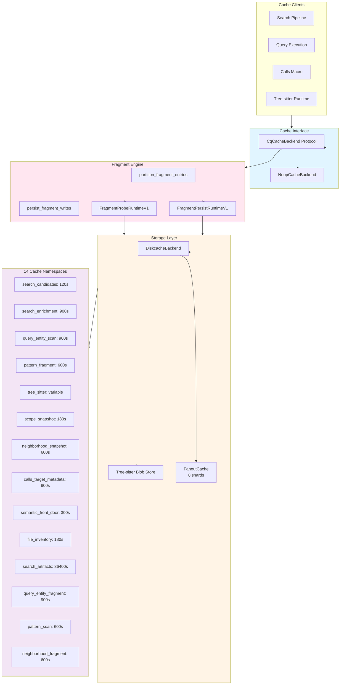

# Runtime Services Architecture

**Version:** 0.5.0
**Phase:** 1 (Foundation)
**Audience:** Advanced LLM programmers proposing architectural improvements to CQ runtime infrastructure.

---

## Overview

The CQ runtime services tier provides process-global infrastructure for execution policy management, persistent caching with fragment-oriented orchestration, worker scheduling, and hexagonal service composition. This layer sits between the CLI/command layer and domain-specific subsystems (search, query, calls, neighborhood), providing reusable concurrency primitives, cache backends with blob storage, LSP runtime infrastructure, and service-oriented interfaces.

**Key Responsibilities:**
- Runtime execution policy with environment variable overrides
- Dual-pool worker scheduling (CPU process-based, I/O thread-based)
- Persistent disk-backed caching with fail-open semantics and fragment engine
- Tree-sitter payload caching with blob storage for large payloads
- Hexagonal service layer for search, entity, and calls
- LSP runtime infrastructure (sessions, budgets, capabilities)
- Diagnostic artifact collection and telemetry
- Cache namespace management with 13 specialized namespaces

**Design Principles:**
- **Fail-open** - All caching and LSP operations degrade gracefully
- **Singleton management** - Workspace-keyed singletons with thread-safe initialization
- **Composition root** - Central `CqRuntimeServices` bundle wires dependencies
- **Contract-first** - All payloads use msgspec structs
- **Environment overrides** - All policies support `CQ_RUNTIME_*` variables
- **Fragment orientation** - Cache operations partition entries into hits/misses for batch processing

---

## Architecture Topology

```mermaid
flowchart TB
    subgraph CLI["CLI Layer"]
        Search[search command]
        Query[query command]
        Calls[calls command]
        Run[run command]
    end

    subgraph Bootstrap["Composition Root"]
        Bootstrap[bootstrap.py]
        Services[CqRuntimeServices]
        SettingsFactory[SettingsFactory]
    end

    subgraph ServiceLayer["Service Layer"]
        SearchSvc[SearchService]
        EntitySvc[EntityService]
        CallsSvc[CallsService]
    end

    subgraph Runtime["Runtime Infrastructure"]
        Policy[RuntimeExecutionPolicy]
        Scheduler[WorkerScheduler]
        Cache[CqCacheBackend]
    end

    subgraph CacheEngine["Cache Infrastructure"]
        FragmentEngine[Fragment Engine]
        BlobStore[Tree-sitter Blob Store]
        Namespaces[14 Cache Namespaces]
        DiskCache[DiskCache Backend]
    end

    subgraph Workers["Worker Pools"]
        CPUPool[ProcessPoolExecutor<br/>spawn context]
        IOPool[ThreadPoolExecutor]
    end

    subgraph LSP["LSP Runtime"]
        LspAdapter[lsp_front_door_adapter]
        LspBudget[lsp_request_budget]
        LspSession[lsp/session_manager]
        LspQueue[lsp/request_queue]
    end

    CLI --> Bootstrap
    Bootstrap --> Services
    Bootstrap --> SettingsFactory
    Services --> ServiceLayer
    Services --> Runtime
    Runtime --> Scheduler
    Runtime --> Cache
    Cache --> CacheEngine
    CacheEngine --> DiskCache
    Scheduler --> Workers
    ServiceLayer --> LSP
    LSP --> Workers

    style Bootstrap fill:#e1f5ff
    style Runtime fill:#fff4e6
    style CacheEngine fill:#ffe6f0
    style Workers fill:#f3e5f5
    style LSP fill:#e8f5e9
```

---

## Module Organization

### Core Runtime (576 LOC total)

Location: `tools/cq/core/runtime/`

| File | LOC | Purpose |
|------|-----|---------|
| `execution_policy.py` | 352 | Three-level policy hierarchy (Parallelism, Semantic, Cache) |
| `worker_scheduler.py` | 218 | Dual-pool worker scheduling with bounded collection |
| `env_namespace.py` | ~150 | Namespace pattern parsing for environment overrides |

### Cache Infrastructure (3,979 LOC total, 24 files)

Location: `tools/cq/core/cache/`

| File | LOC | Purpose |
|------|-----|---------|
| `diskcache_backend.py` | 487 | Fail-open DiskCache adapter with workspace singleton |
| `search_artifact_store.py` | 369 | Search result artifact persistence |
| `interface.py` | 341 | `CqCacheBackend` protocol and `NoopCacheBackend` |
| `snapshot_fingerprint.py` | 309 | Scope snapshot fingerprinting for cache keys |
| `policy.py` | 268 | Cache policy contracts and factory |
| `tree_sitter_blob_store.py` | 256 | File-backed blob storage for large tree-sitter payloads |
| `key_builder.py` | 221 | Deterministic cache key construction |
| `telemetry.py` | 190 | Cache hit/miss/decode telemetry |
| `contracts.py` | 159 | Cache payload structs (SgRecordCacheV1, etc.) |
| `tree_sitter_cache_store.py` | 143 | Msgpack storage for tree-sitter enrichment with blob threshold |
| `fragment_engine.py` | 131 | Hit/miss partitioning and batch persistence |
| `scope_services.py` | 116 | Scope-aware cache coordination |
| `coordination.py` | 98 | Cross-namespace cache coordination |
| `namespaces.py` | 79 | 13 cache namespaces with TTL resolution |
| `fragment_contracts.py` | 70 | Fragment-oriented cache contracts |
| `fragment_codecs.py` | ~60 | Fragment payload encoding/decoding |
| `run_lifecycle.py` | ~55 | Run-scoped cache tag management |
| `typed_codecs.py` | ~50 | Typed msgpack codec helpers |
| `content_hash.py` | ~45 | Content fingerprinting |
| `cache_runtime_tuning.py` | ~40 | Runtime cache tuning derivation |
| `maintenance.py` | ~35 | Cache maintenance operations |
| `diagnostics.py` | ~30 | Cache diagnostic helpers |
| `base_contracts.py` | ~25 | Base cache struct types |

### Service Layer (173 LOC total)

Location: `tools/cq/core/`

| File | LOC | Purpose |
|------|-----|---------|
| `services.py` | ~115 | SearchService, EntityService, CallsService |
| `toolchain.py` | 173 | Toolchain detection (rg, ast-grep-py, msgspec, diskcache) |
| `settings_factory.py` | 84 | Canonical factory for environment-derived settings |
| `bootstrap.py` | 77 | CqRuntimeServices composition root |

---

## Runtime Policy Contracts

Location: `tools/cq/core/runtime/execution_policy.py` (352 LOC)

### Three-Level Policy Hierarchy

```python
class RuntimeExecutionPolicy(CqSettingsStruct, frozen=True):
    """Top-level runtime policy envelope."""
    parallelism: ParallelismPolicy
    semantic: SemanticRuntimePolicy = SemanticRuntimePolicy()
    cache: CacheRuntimePolicy = CacheRuntimePolicy()
```

**Policy Levels:**
1. **ParallelismPolicy** - Worker pool sizing for CPU/I/O/semantic tasks
2. **SemanticRuntimePolicy** - LSP timeout budgets and target limits
3. **CacheRuntimePolicy** - Disk cache behavior, TTL, and namespace overrides

### ParallelismPolicy

Worker pool configuration:

```python
class ParallelismPolicy(CqSettingsStruct, frozen=True):
    cpu_workers: PositiveInt                        # ProcessPool workers
    io_workers: PositiveInt                         # ThreadPool workers
    semantic_request_workers: PositiveInt           # LSP/semantic concurrency
    query_partition_workers: PositiveInt = 2
    calls_file_workers: PositiveInt = 4
    run_step_workers: PositiveInt = 4
    enable_process_pool: bool = True                # Enable ProcessPool (else ThreadPool fallback)
```

**Defaults:**
- `cpu_workers` = `max(1, cpu_count - 1)`
- `io_workers` = `max(8, cpu_count)`
- `semantic_request_workers` = 4

### SemanticRuntimePolicy

LSP timing and budgeting:

```python
class SemanticRuntimePolicy(CqSettingsStruct, frozen=True):
    timeout_ms: PositiveInt = 2000                  # Request timeout
    startup_timeout_ms: PositiveInt = 2000          # Server startup timeout
    max_targets_search: PositiveInt = 1             # Max targets for search
    max_targets_calls: PositiveInt = 1              # Max targets for calls
    max_targets_entity: PositiveInt = 3             # Max targets for entity
```

### CacheRuntimePolicy

Cache configuration with namespace overrides:

```python
class CacheRuntimePolicy(CqSettingsStruct, frozen=True):
    enabled: bool = True
    ttl_seconds: PositiveInt = 900                  # Default 15 minutes
    shards: PositiveInt = 8                         # FanoutCache shards
    timeout_seconds: PositiveFloat = 0.05           # Cache op timeout
    evict_run_tag_on_exit: bool = False
    namespace_ttl_seconds: dict[str, int] = {}      # Per-namespace TTL overrides
    namespace_enabled: dict[str, bool] = {}         # Per-namespace enable/disable
    namespace_ephemeral: dict[str, bool] = {}       # Run-ephemeral marking
    size_limit_bytes: PositiveInt = 2_147_483_648   # 2GB default
    cull_limit: NonNegativeInt = 16                 # Eviction batch size
    eviction_policy: str = "least-recently-stored"
    statistics_enabled: bool = False
```

### Environment Variable Overrides

All policy fields support `CQ_RUNTIME_*` environment variable overrides:

| Variable | Type | Default | Description |
|----------|------|---------|-------------|
| `CQ_RUNTIME_CPU_WORKERS` | int | `cpu_count - 1` | ProcessPool workers |
| `CQ_RUNTIME_IO_WORKERS` | int | `max(8, cpu_count)` | ThreadPool workers |
| `CQ_RUNTIME_SEMANTIC_REQUEST_WORKERS` | int | `4` | LSP request concurrency |
| `CQ_RUNTIME_QUERY_PARTITION_WORKERS` | int | `2` | Query partition workers |
| `CQ_RUNTIME_CALLS_FILE_WORKERS` | int | `4` | Calls file workers |
| `CQ_RUNTIME_RUN_STEP_WORKERS` | int | `4` | Run step workers |
| `CQ_RUNTIME_ENABLE_PROCESS_POOL` | bool | `true` | Enable ProcessPool |
| `CQ_RUNTIME_SEMANTIC_TIMEOUT_MS` | int | `2000` | LSP request timeout (ms) |
| `CQ_RUNTIME_SEMANTIC_STARTUP_TIMEOUT_MS` | int | `2000` | LSP startup timeout (ms) |
| `CQ_RUNTIME_SEMANTIC_TARGETS_SEARCH` | int | `1` | Max LSP targets (search) |
| `CQ_RUNTIME_SEMANTIC_TARGETS_CALLS` | int | `1` | Max LSP targets (calls) |
| `CQ_RUNTIME_SEMANTIC_TARGETS_ENTITY` | int | `3` | Max LSP targets (entity) |
| `CQ_RUNTIME_CACHE_ENABLED` | bool | `true` | Enable disk cache |
| `CQ_RUNTIME_CACHE_TTL_SECONDS` | int | `900` | Cache TTL (15 minutes) |
| `CQ_RUNTIME_CACHE_SHARDS` | int | `8` | FanoutCache shards |
| `CQ_RUNTIME_CACHE_TIMEOUT_SECONDS` | float | `0.05` | Cache operation timeout |
| `CQ_RUNTIME_CACHE_EVICT_RUN_TAG_ON_EXIT` | bool | `false` | Evict run-scoped tags on exit |
| `CQ_RUNTIME_CACHE_SIZE_LIMIT_BYTES` | int | `2147483648` | Cache size limit (2GB) |
| `CQ_RUNTIME_CACHE_CULL_LIMIT` | int | `16` | Eviction batch size |
| `CQ_RUNTIME_CACHE_STATISTICS_ENABLED` | bool | `false` | Enable cache statistics |

**Namespace-Specific Overrides:**

```bash
# Pattern 1: CQ_RUNTIME_CACHE_NAMESPACE_{NAME}_{SUFFIX}
CQ_RUNTIME_CACHE_NAMESPACE_SEARCH_CANDIDATES_TTL_SECONDS=300
CQ_RUNTIME_CACHE_NAMESPACE_PATTERN_FRAGMENT_ENABLED=false

# Pattern 2: CQ_RUNTIME_CACHE_TTL_{NAME}_SECONDS
CQ_RUNTIME_CACHE_TTL_SEARCH_ENRICHMENT_SECONDS=600

# Pattern 3: CQ_RUNTIME_CACHE_ENABLE_{NAME}
CQ_RUNTIME_CACHE_ENABLE_SCOPE_SNAPSHOT=true
```

**Parsing Helpers:**

```python
def _env_int(name: str, default: int, *, minimum: int = 1) -> int:
    """Parse int from CQ_RUNTIME_{name} with fallback."""
    raw = os.getenv(f"CQ_RUNTIME_{name}")
    if raw is None:
        return default
    try:
        value = int(raw)
    except ValueError:
        return default
    return max(minimum, value)

def _env_bool(name: str, *, default: bool) -> bool:
    """Parse bool from CQ_RUNTIME_{name} with fallback."""
    raw = os.getenv(f"CQ_RUNTIME_{name}")
    if raw is None:
        return default
    value = raw.strip().lower()
    if value in {"1", "true", "yes", "on"}:
        return True
    if value in {"0", "false", "no", "off"}:
        return False
    return default
```

All helpers apply safe parsing with fallback to defaults on parse failure.

---

## Worker Scheduler

Location: `tools/cq/core/runtime/worker_scheduler.py` (218 LOC)

### Dual-Pool Architecture

```python
class WorkerScheduler:
    """Lazily-initialized shared worker pools with bounded collection helpers."""

    def __init__(self, policy: ParallelismPolicy) -> None:
        self._policy = policy
        self._lock = threading.Lock()
        self._cpu_pool: ProcessPoolExecutor | None = None
        self._io_pool: ThreadPoolExecutor | None = None

    def cpu_pool(self) -> ProcessPoolExecutor:
        """Return shared CPU pool configured with spawn context."""
        with self._lock:
            if self._cpu_pool is None:
                ctx = multiprocessing.get_context("spawn")
                self._cpu_pool = ProcessPoolExecutor(
                    max_workers=self._policy.cpu_workers,
                    mp_context=ctx,
                )
            return self._cpu_pool

    def io_pool(self) -> ThreadPoolExecutor:
        """Return shared IO pool."""
        with self._lock:
            if self._io_pool is None:
                self._io_pool = ThreadPoolExecutor(
                    max_workers=self._policy.io_workers
                )
            return self._io_pool
```

**Why `spawn` Context:**
- Avoids fork-related issues on macOS (LSP client state)
- Prevents accidental state sharing between workers
- Safer for complex runtime state (LSP sessions, cache handles)

**CPU Pool Conditional Usage:** If `enable_process_pool=False`, CPU tasks fall back to I/O ThreadPool.

### Task Submission API

```python
def submit_io(self, fn: Callable[P, R], /, *args: P.args, **kwargs: P.kwargs) -> Future[R]:
    """Submit an I/O task."""
    callable_fn = cast("Callable[..., R]", fn)
    return self.io_pool().submit(callable_fn, *args, **kwargs)

def submit_cpu(self, fn: Callable[P, R], /, *args: P.args, **kwargs: P.kwargs) -> Future[R]:
    """Submit a CPU task (ProcessPool or fallback to ThreadPool)."""
    callable_fn = cast("Callable[..., R]", fn)
    if self._policy.enable_process_pool:
        return self.cpu_pool().submit(callable_fn, *args, **kwargs)
    return self.io_pool().submit(callable_fn, *args, **kwargs)
```

**Usage Patterns:**
- LSP requests → `submit_io()`
- AST classification tasks → `submit_cpu()` (when enabled)
- Search partition enrichment → `submit_cpu()`

### Bounded Collection with Deterministic Timeouts

```python
@staticmethod
def collect_bounded(
    futures: Iterable[Future[T]],
    *,
    timeout_seconds: float,
) -> WorkerBatchResult[T]:
    """Collect futures up to timeout, preserving deterministic completion order."""
    future_list = list(futures)
    if not future_list:
        return WorkerBatchResult(done=[], timed_out=0)
    done, pending = wait(future_list, timeout=timeout_seconds)
    values: list[T] = [
        future.result() for future in future_list if future in done
    ]
    for future in pending:
        future.cancel()
    return WorkerBatchResult(done=values, timed_out=len(pending))
```

**WorkerBatchResult Contract:**

```python
@dataclass(slots=True)
class WorkerBatchResult[T]:
    """Result bundle for bounded worker collection."""
    done: list[T]
    timed_out: int
```

**Key Properties:**
- Cancels pending futures on timeout
- Preserves submission order for `done` results
- Returns timed-out count for telemetry

### Process-Global Singleton

```python
class _SchedulerState:
    """Mutable holder for process-global scheduler singleton."""
    def __init__(self) -> None:
        self.scheduler: WorkerScheduler | None = None

_SCHEDULER_STATE = _SchedulerState()
_SCHEDULER_LOCK = threading.Lock()

def get_worker_scheduler() -> WorkerScheduler:
    """Return process-global CQ worker scheduler."""
    with _SCHEDULER_LOCK:
        if _SCHEDULER_STATE.scheduler is None:
            policy = default_runtime_execution_policy().parallelism
            _SCHEDULER_STATE.scheduler = WorkerScheduler(policy)
        return _SCHEDULER_STATE.scheduler

def close_worker_scheduler() -> None:
    """Close and clear process-global worker scheduler."""
    with _SCHEDULER_LOCK:
        scheduler = _SCHEDULER_STATE.scheduler
        _SCHEDULER_STATE.scheduler = None
    if scheduler is not None:
        scheduler.close()

atexit.register(close_worker_scheduler)
```

**Lifecycle:**
1. First call to `get_worker_scheduler()` builds policy and scheduler
2. Pools are lazily initialized on first task submission
3. `atexit.register()` ensures cleanup on process exit
4. `close()` shuts down pools with `cancel_futures=True`

---

## Cache Infrastructure

### Cache Architecture Overview



### CqCacheBackend Protocol

Location: `tools/cq/core/cache/interface.py` (341 LOC)

```python
class CqCacheBackend(Protocol):
    """Cache adapter contract used by CQ runtime services."""

    def get(self, key: str) -> object | None:
        """Fetch cached value for key. Returns None when absent."""

    def set(
        self,
        key: str,
        value: object,
        *,
        expire: int | None = None,
        tag: str | None = None,
    ) -> None:
        """Store value for key."""

    def delete(self, key: str) -> None:
        """Delete cached key."""

    def evict_tag(self, tag: str) -> None:
        """Evict entries associated with tag when supported."""

    def close(self) -> None:
        """Close backend resources."""
```

**NoopCacheBackend:** Used when caching is disabled via `CQ_CACHE_ENABLED=false`.

### DiskcacheBackend Implementation

Location: `tools/cq/core/cache/diskcache_backend.py` (487 LOC)

```python
class DiskcacheBackend:
    """Fail-open diskcache backend for CQ runtime."""

    def __init__(self, cache: FanoutCache, *, default_ttl_seconds: int) -> None:
        self._cache = cache
        self._default_ttl_seconds = default_ttl_seconds

    def get(self, key: str) -> object | None:
        """Fetch key from cache."""
        try:
            return self._cache.get(key, default=None)
        except (OSError, RuntimeError, ValueError, TypeError):
            return None

    def set(
        self,
        key: str,
        value: object,
        *,
        expire: int | None = None,
        tag: str | None = None,
    ) -> None:
        """Write value to cache."""
        ttl = expire if expire is not None else self._default_ttl_seconds
        try:
            self._cache.set(key, value, expire=ttl, tag=tag, retry=True)
        except (OSError, RuntimeError, ValueError, TypeError):
            return

    def delete(self, key: str) -> None:
        """Delete key from cache."""
        try:
            self._cache.delete(key, retry=True)
        except (OSError, RuntimeError, ValueError, TypeError):
            return

    def evict_tag(self, tag: str) -> None:
        """Evict tagged items."""
        try:
            self._cache.evict(tag, retry=True)
        except (OSError, RuntimeError, ValueError, TypeError):
            return

    def close(self) -> None:
        """Close cache resources."""
        self._cache.close()
```

**Fail-Open Semantics:** All methods catch common exceptions and fail gracefully:
- `OSError` - Disk I/O failures
- `RuntimeError` - Internal cache state errors
- `ValueError` - Malformed cache data
- `TypeError` - Type contract violations

### Fragment Engine

Location: `tools/cq/core/cache/fragment_engine.py` (131 LOC)

The fragment engine provides batch-oriented cache orchestration by partitioning entries into hits and misses, then persisting writes in a single transaction.

**Fragment Probe Runtime:**

```python
@dataclass(frozen=True, slots=True)
class FragmentProbeRuntimeV1:
    """Runtime function bundle for fragment cache probe operations."""
    cache_get: CacheGetFn
    decode: DecodeFn
    cache_enabled: bool
    record_get: RecordGetFn
    record_decode_failure: RecordDecodeFailureFn
```

**Fragment Persist Runtime:**

```python
@dataclass(frozen=True, slots=True)
class FragmentPersistRuntimeV1:
    """Runtime function bundle for fragment cache persistence operations."""
    cache_set: CacheSetFn
    encode: EncodeFn
    cache_enabled: bool
    transact: TransactFactoryFn
    record_set: RecordSetFn
    cache_set_many: CacheSetManyFn | None = None
```

**Partition Function:**

```python
def partition_fragment_entries(
    request: FragmentRequestV1,
    entries: list[FragmentEntryV1],
    runtime: FragmentProbeRuntimeV1,
) -> FragmentPartitionV1:
    """Partition fragment entries into cache hits and misses."""
    hits: list[FragmentHitV1] = []
    misses: list[FragmentMissV1] = []
    for entry in entries:
        if not (runtime.cache_enabled and entry.content_hash):
            misses.append(FragmentMissV1(entry=entry))
            continue
        cached = runtime.cache_get(entry.cache_key)
        is_payload = is_fragment_cache_payload(cached)
        runtime.record_get(
            namespace=request.namespace,
            hit=is_payload,
            key=entry.cache_key,
        )
        if not is_payload:
            misses.append(FragmentMissV1(entry=entry))
            continue
        decoded = runtime.decode(cached)
        if decoded is None:
            runtime.record_decode_failure(namespace=request.namespace)
            misses.append(FragmentMissV1(entry=entry))
            continue
        hits.append(FragmentHitV1(entry=entry, payload=decoded))
    return FragmentPartitionV1(hits=tuple(hits), misses=tuple(misses))
```

**Persist Function:**

```python
def persist_fragment_writes(
    request: FragmentRequestV1,
    writes: list[FragmentWriteV1],
    runtime: FragmentPersistRuntimeV1,
) -> None:
    """Persist fragment payload writes using one backend transaction."""
    if not (runtime.cache_enabled and writes):
        return
    if callable(runtime.cache_set_many):
        encoded_rows = {
            write.entry.cache_key: runtime.encode(write.payload)
            for write in writes
        }
        written = runtime.cache_set_many(
            encoded_rows,
            expire=request.ttl_seconds,
            tag=request.tag,
        )
        for write in writes:
            runtime.record_set(
                namespace=request.namespace,
                hit=write.entry.cache_key in encoded_rows[:written],
                key=write.entry.cache_key,
            )
    else:
        with runtime.transact():
            for write in writes:
                encoded = runtime.encode(write.payload)
                success = runtime.cache_set(
                    write.entry.cache_key,
                    encoded,
                    expire=request.ttl_seconds,
                    tag=request.tag,
                )
                runtime.record_set(
                    namespace=request.namespace,
                    hit=success,
                    key=write.entry.cache_key,
                )
```

**Design:** Fragment engine enables batch-oriented cache operations where multiple files can be probed and written in a single transaction, improving cache throughput for multi-file operations.

### Tree-sitter Cache Stores

#### Tree-sitter Blob Store

Location: `tools/cq/core/cache/tree_sitter_blob_store.py` (256 LOC)

Provides file-backed blob storage for large tree-sitter payloads exceeding 64KB threshold.

```python
_BLOB_DIR = "tree_sitter_blobs"
_BLOB_NAMESPACE = "tree_sitter"
_BLOB_TAG = "ns:tree_sitter|kind:blob"

def write_blob(*, root: Path, payload: bytes) -> TreeSitterBlobRefV1 | None:
    """Write payload bytes to blob file storage and return reference.

    Returns:
        TreeSitterBlobRefV1: Blob reference with ID and size, or None on failure.
    """
    blob_id = blake2b(payload, digest_size=24).hexdigest()
    blob_path = _blob_path(root, blob_id)
    try:
        blob_path.parent.mkdir(parents=True, exist_ok=True)
        with NamedTemporaryFile(delete=False, dir=blob_path.parent) as tmp:
            tmp.write(payload)
            tmp_path = Path(tmp.name)
        tmp_path.replace(blob_path)
        return TreeSitterBlobRefV1(blob_id=blob_id, size_bytes=len(payload))
    except (OSError, ValueError, TypeError):
        return None

def read_blob(*, root: Path, blob_ref: TreeSitterBlobRefV1) -> bytes | None:
    """Read blob payload from file storage."""
    blob_path = _blob_path(root, blob_ref.blob_id)
    try:
        return blob_path.read_bytes()
    except (OSError, FileNotFoundError):
        return None
```

**Design:** Blob storage keeps large tree-sitter payloads (>64KB) out of the SQLite-backed DiskCache, preventing performance degradation from large row sizes.

#### Tree-sitter Cache Store

Location: `tools/cq/core/cache/tree_sitter_cache_store.py` (143 LOC)

Deterministic msgpack storage for tree-sitter enrichment payloads with automatic blob threshold handling.

```python
_NAMESPACE: Final[str] = "tree_sitter"
_VERSION: Final[str] = "v3"
_BLOB_THRESHOLD_BYTES: Final[int] = 64 * 1024  # 64KB

def persist_tree_sitter_payload(
    *,
    root: Path,
    cache_key: str,
    envelope: TreeSitterCacheEnvelopeV1,
    tag: str | None = None,
) -> bool:
    """Persist tree-sitter payload envelope as msgpack bytes.

    Payloads exceeding 64KB are written to blob storage and replaced
    with a blob reference in the cache entry.
    """
    backend = get_cq_cache_backend(root=root)
    policy = default_cache_policy(root=root)
    ttl_seconds = resolve_namespace_ttl_seconds(policy=policy, namespace=_NAMESPACE)
    encoded = _ENCODER.encode(envelope)
    payload: object
    if len(encoded) > _BLOB_THRESHOLD_BYTES:
        blob_ref = write_blob(root=root, payload=encoded)
        if blob_ref is None:
            return False
        payload = encode_blob_pointer(blob_ref)
    else:
        payload = encoded
    backend.set(cache_key, payload, expire=ttl_seconds, tag=tag)
    record_cache_set(namespace=_NAMESPACE, hit=True, key=cache_key)
    return True
```

**Design:** The 64KB threshold ensures small payloads stay in DiskCache for fast retrieval while large payloads use blob storage to avoid SQLite row size performance issues.

### Cache Namespaces

Location: `tools/cq/core/cache/namespaces.py` (79 LOC)

CQ uses 14 specialized cache namespaces with distinct TTL defaults:

```python
_DEFAULT_NAMESPACE_TTLS_SECONDS: dict[str, int] = {
    "search_candidates": 120,           # Search candidate matches (2 min)
    "search_enrichment": 900,           # Search enrichment payloads (15 min)
    "query_entity_scan": 900,           # Entity scan results (15 min)
    "query_entity_fragment": 900,       # Entity fragment cache (15 min)
    "pattern_scan": 600,                # Pattern scan results (10 min)
    "pattern_fragment": 600,            # Pattern fragment cache (10 min)
    "calls_target_metadata": 900,       # Calls target resolution (15 min)
    "semantic_front_door": 300,         # Semantic enrichment (5 min)
    "neighborhood_snapshot": 600,       # Neighborhood snapshots (10 min)
    "neighborhood_fragment": 600,       # Neighborhood fragments (10 min)
    "file_inventory": 180,              # File inventory cache (3 min)
    "scope_snapshot": 180,              # Scope snapshots (3 min)
    "search_artifacts": 86_400,         # Search artifacts (24 hours)
}
```

**Namespace Resolution:**

```python
def resolve_namespace_ttl_seconds(*, policy: CqCachePolicyV1, namespace: str) -> int:
    """Resolve namespace TTL from policy overrides and defaults."""
    override = policy.namespace_ttl_seconds.get(namespace)
    if isinstance(override, int) and override > 0:
        return override
    default = _DEFAULT_NAMESPACE_TTLS_SECONDS.get(namespace)
    if isinstance(default, int) and default > 0:
        return default
    return int(policy.ttl_seconds)
```

**Namespace Gating:**

```python
def is_namespace_cache_enabled(*, policy: CqCachePolicyV1, namespace: str) -> bool:
    """Return whether caching is enabled for a namespace."""
    override = policy.namespace_enabled.get(namespace)
    if override is None:
        return True
    return bool(override)

def is_namespace_ephemeral(*, policy: CqCachePolicyV1, namespace: str) -> bool:
    """Return whether namespace cache entries should be tagged as run-ephemeral."""
    override = policy.namespace_ephemeral.get(namespace)
    return bool(override)
```

### Cache Key Builder

Location: `tools/cq/core/cache/key_builder.py` (221 LOC)

```python
def build_cache_key(
    namespace: str,
    *,
    version: str,
    workspace: str,
    language: str,
    target: str,
    extras: dict[str, object] | None = None,
) -> str:
    """Build a deterministic cache key string for CQ runtime data."""
    payload = {
        "namespace": namespace,
        "version": version,
        "workspace": workspace,
        "language": language,
        "target": target,
        "extras": extras or {},
    }
    digest = hashlib.sha256(msgspec.json.encode(payload)).hexdigest()
    return f"cq:{namespace}:{version}:{digest}"
```

**Key Structure:** `cq:<namespace>:<version>:<sha256_digest>`

**Cache Tag Builders:**

```python
def build_cache_tag(*, workspace: str, language: str) -> str:
    """Build tag used for bulk invalidation."""
    return "|".join((f"ws:{_digest_text(workspace)}", f"lang:{language}"))

def build_run_cache_tag(*, workspace: str, language: str, run_id: str) -> str:
    """Build run-scoped cache invalidation tag."""
    return "|".join((
        f"ws:{_digest_text(workspace)}",
        f"lang:{language}",
        f"run:{_digest_text(run_id, size=24)}",
    ))

def build_namespace_cache_tag(
    *,
    workspace: str,
    language: str,
    namespace: str,
    scope_hash: str | None = None,
    snapshot: str | None = None,
    run_id: str | None = None,
) -> str:
    """Build namespace-oriented cache invalidation tag."""
    parts = [
        f"ws:{_digest_text(workspace)}",
        f"lang:{language}",
        f"ns:{namespace}",
    ]
    if scope_hash:
        parts.append(f"scope:{scope_hash}")
    if snapshot:
        parts.append(f"snap:{_digest_text(snapshot, size=24)}")
    if run_id:
        parts.append(f"run:{_digest_text(run_id, size=24)}")
    return "|".join(parts)
```

### Cache Policy

Location: `tools/cq/core/cache/policy.py` (268 LOC)

```python
class CqCachePolicyV1(CqSettingsStruct, frozen=True):
    """Policy controlling disk-backed CQ cache behavior."""
    enabled: bool = True
    directory: str = ".cq_cache"
    shards: PositiveInt = 8
    timeout_seconds: PositiveFloat = 0.05
    ttl_seconds: PositiveInt = 900
    evict_run_tag_on_exit: bool = False
    namespace_ttl_seconds: dict[str, int] = msgspec.field(default_factory=dict)
    namespace_enabled: dict[str, bool] = msgspec.field(default_factory=dict)
    namespace_ephemeral: dict[str, bool] = msgspec.field(default_factory=dict)
    size_limit_bytes: PositiveInt = 2_147_483_648
    cull_limit: NonNegativeInt = 16
    eviction_policy: str = "least-recently-stored"
    statistics_enabled: bool = False

def default_cache_policy(*, root: Path) -> CqCachePolicyV1:
    """Build cache policy from runtime defaults and optional env overrides."""
    runtime = default_runtime_execution_policy().cache
    raw_enabled = os.getenv("CQ_CACHE_ENABLED")
    enabled = runtime.enabled
    if raw_enabled is not None:
        enabled = raw_enabled.strip().lower() not in {"0", "false", "no", "off"}
    raw_dir = os.getenv("CQ_CACHE_DIR")
    directory = raw_dir.strip() if raw_dir else str(root / ".cq_cache")
    return CqCachePolicyV1(
        enabled=enabled,
        directory=directory,
        shards=runtime.shards,
        timeout_seconds=runtime.timeout_seconds,
        ttl_seconds=runtime.ttl_seconds,
        evict_run_tag_on_exit=runtime.evict_run_tag_on_exit,
        namespace_ttl_seconds=runtime.namespace_ttl_seconds,
        namespace_enabled=runtime.namespace_enabled,
        namespace_ephemeral=runtime.namespace_ephemeral,
        size_limit_bytes=runtime.size_limit_bytes,
        cull_limit=runtime.cull_limit,
        eviction_policy=runtime.eviction_policy,
        statistics_enabled=runtime.statistics_enabled,
    )
```

**Environment Variables:**
- `CQ_CACHE_ENABLED` - Enable/disable caching
- `CQ_CACHE_DIR` - Override default `.cq_cache` directory

### Workspace-Keyed Singleton

```python
class _BackendState:
    """Mutable holder for process-global cache backend singleton."""
    def __init__(self) -> None:
        self.backends: dict[str, CqCacheBackend] = {}

_BACKEND_STATE = _BackendState()
_BACKEND_LOCK = threading.Lock()

def get_cq_cache_backend(*, root: Path) -> CqCacheBackend:
    """Return workspace-keyed CQ cache backend."""
    workspace = str(root.resolve())
    with _BACKEND_LOCK:
        existing = _BACKEND_STATE.backends.get(workspace)
        if existing is not None:
            return existing
        policy = default_cache_policy(root=root)
        if not policy.enabled:
            backend: CqCacheBackend = NoopCacheBackend()
        else:
            backend = _build_diskcache_backend(policy)
        _BACKEND_STATE.backends[workspace] = backend
        return backend

def close_cq_cache_backend(*, root: Path | None = None) -> None:
    """Close and clear workspace-backed cache backend(s)."""
    backends: list[CqCacheBackend]
    with _BACKEND_LOCK:
        if root is None:
            backends = list(_BACKEND_STATE.backends.values())
            _BACKEND_STATE.backends.clear()
        else:
            workspace = str(root.resolve())
            backend = _BACKEND_STATE.backends.pop(workspace, None)
            backends = [backend] if backend is not None else []
    for backend in backends:
        backend.close()

atexit.register(close_cq_cache_backend)
```

**Backend Construction:**

```python
def _build_diskcache_backend(policy: CqCachePolicyV1) -> CqCacheBackend:
    cache = FanoutCache(
        directory=str(Path(policy.directory).expanduser()),
        shards=max(1, int(policy.shards)),
        timeout=float(policy.timeout_seconds),
        tag_index=True,
        size_limit=policy.size_limit_bytes,
        cull_limit=policy.cull_limit,
        eviction_policy=policy.eviction_policy,
        statistics=1 if policy.statistics_enabled else 0,
    )
    return DiskcacheBackend(cache, default_ttl_seconds=policy.ttl_seconds)
```

**FanoutCache Configuration:**
- `directory` - Expanded cache directory path
- `shards` - Number of SQLite database shards (8 by default)
- `timeout` - SQLite lock timeout (0.05s default)
- `tag_index=True` - Enables tag-based eviction
- `size_limit` - Maximum cache size in bytes (2GB default)
- `cull_limit` - Number of entries to evict when size limit exceeded
- `eviction_policy` - LRU or least-recently-stored (default)
- `statistics` - Enable hit/miss statistics collection

### Cache Payload Contracts

Location: `tools/cq/core/cache/contracts.py` (159 LOC)

**SgRecordCacheV1** — Cached ast-grep record:

```python
class SgRecordCacheV1(CqCacheStruct, frozen=True):
    record: RecordType = "def"                      # "def" | "call" | "import"
    kind: str = ""
    file: str = ""
    start_line: NonNegativeInt = 0
    start_col: NonNegativeInt = 0
    end_line: NonNegativeInt = 0
    end_col: NonNegativeInt = 0
    text: str = ""
    rule_id: str = ""
```

**SearchCandidatesCacheV1** — Cached search candidates:

```python
class SearchCandidatesCacheV1(CqCacheStruct, frozen=True):
    pattern: str
    raw_matches: list[dict[str, object]]
    stats: dict[str, object]
```

**SearchEnrichmentAnchorCacheV1** — Cached enrichment payload:

```python
class SearchEnrichmentAnchorCacheV1(CqCacheStruct, frozen=True):
    file: str
    line: NonNegativeInt
    col: NonNegativeInt
    match_text: str
    file_content_hash: str
    language: str
    enriched_match: dict[str, object]
```

**QueryEntityScanCacheV1** — Cached entity scan:

```python
class QueryEntityScanCacheV1(CqCacheStruct, frozen=True):
    records: list[SgRecordCacheV1]
```

**PatternFragmentCacheV1** — Cached pattern fragment:

```python
class PatternFragmentCacheV1(CqCacheStruct, frozen=True):
    findings: list[dict[str, object]] = msgspec.field(default_factory=list)
    records: list[SgRecordCacheV1] = msgspec.field(default_factory=list)
    raw_matches: list[dict[str, object]] = msgspec.field(default_factory=list)
```

**ScopeSnapshotCacheV1** — Cached scope snapshot:

```python
class ScopeSnapshotCacheV1(CqCacheStruct, frozen=True):
    language: str
    scope_globs: tuple[str, ...] = ()
    scope_roots: tuple[str, ...] = ()
    inventory_token: dict[str, object] = msgspec.field(default_factory=dict)
    files: list[ScopeFileStatCacheV1] = msgspec.field(default_factory=list)
    digest: str = ""
```

**CallsTargetCacheV1** — Cached calls-target metadata:

```python
class CallsTargetCacheV1(CqCacheStruct, frozen=True):
    target_location: tuple[str, int] | None = None
    target_callees: dict[str, int] = msgspec.field(default_factory=dict)
```

---

## Service Layer

### Hexagonal Services

Location: `tools/cq/core/services.py` (~115 LOC)

```python
class SearchService:
    """Application-layer service for CQ search."""

    @staticmethod
    def execute(request: SearchServiceRequest) -> CqResult:
        """Execute CQ smart search."""
        from tools.cq.search.pipeline.smart_search import smart_search
        return smart_search(
            root=request.root,
            query=request.query,
            mode=request.mode,
            lang_scope=request.lang_scope,
            include_globs=request.include_globs,
            exclude_globs=request.exclude_globs,
            include_strings=request.include_strings,
            with_neighborhood=request.with_neighborhood,
            limits=request.limits,
            tc=request.tc,
            argv=request.argv,
        )

class EntityService:
    """Application-layer service for CQ entity flow."""

    @staticmethod
    def attach_front_door(request: EntityFrontDoorRequest) -> None:
        """Attach entity front-door insight to a CQ result."""
        from tools.cq.query.entity_front_door import attach_entity_front_door_insight
        attach_entity_front_door_insight(
            request.result,
            relationship_detail_max_matches=request.relationship_detail_max_matches,
        )

class CallsService:
    """Application-layer service for CQ calls macro."""

    @staticmethod
    def execute(request: CallsServiceRequest) -> CqResult:
        """Execute CQ calls macro."""
        from tools.cq.macros.calls import cmd_calls
        return cmd_calls(
            tc=request.tc,
            root=request.root,
            argv=request.argv,
            function_name=request.function_name,
        )
```

**Service Request Contracts:**

```python
class SearchServiceRequest(CqStruct, frozen=True):
    """Typed request contract for smart-search service execution."""
    root: Path
    query: str
    mode: QueryMode | None = None
    lang_scope: QueryLanguageScope = "auto"
    include_globs: list[str] | None = None
    exclude_globs: list[str] | None = None
    include_strings: bool = False
    with_neighborhood: bool = False
    limits: SearchLimits | None = None
    tc: Toolchain | None = None
    argv: list[str] | None = None
    run_id: str | None = None

class EntityFrontDoorRequest(CqStruct, frozen=True):
    """Typed request contract for entity front-door attachment."""
    result: CqResult
    relationship_detail_max_matches: int = 50

class CallsServiceRequest(CqStruct, frozen=True):
    """Typed request contract for calls macro service execution."""
    root: Path
    function_name: str
    tc: Toolchain
    argv: list[str]
```

---

## Composition Root

### CqRuntimeServices Bundle

Location: `tools/cq/core/bootstrap.py` (77 LOC)

```python
@dataclass(frozen=True)
class CqRuntimeServices:
    """Runtime service bundle."""
    search: SearchService
    entity: EntityService
    calls: CallsService
    cache: CqCacheBackend
    policy: RuntimeExecutionPolicy

def build_runtime_services(*, root: Path) -> CqRuntimeServices:
    """Construct CQ runtime service bundle for a workspace."""
    return CqRuntimeServices(
        search=SearchService(),
        entity=EntityService(),
        calls=CallsService(),
        cache=get_cq_cache_backend(root=root),
        policy=SettingsFactory.runtime_policy(),
    )
```

### Workspace-Scoped Singleton

```python
_RUNTIME_SERVICES_LOCK = threading.Lock()
_RUNTIME_SERVICES: dict[str, CqRuntimeServices] = {}

def resolve_runtime_services(root: Path) -> CqRuntimeServices:
    """Resolve workspace-scoped CQ runtime services."""
    workspace = str(root.resolve())
    with _RUNTIME_SERVICES_LOCK:
        services = _RUNTIME_SERVICES.get(workspace)
        if services is not None:
            return services
        services = build_runtime_services(root=root)
        _RUNTIME_SERVICES[workspace] = services
        return services

def clear_runtime_services() -> None:
    """Clear cached runtime service bundles."""
    with _RUNTIME_SERVICES_LOCK:
        _RUNTIME_SERVICES.clear()
    close_cq_cache_backend()

atexit.register(clear_runtime_services)
```

**Lifecycle:**
1. `resolve_runtime_services(root)` called by CLI commands
2. First call builds bundle and caches by resolved workspace path
3. Subsequent calls for same workspace return cached bundle
4. `atexit.register()` ensures cleanup on process exit

### Settings Factory

Location: `tools/cq/core/settings_factory.py` (84 LOC)

Canonical factory for environment-derived settings construction:

```python
class SettingsFactory:
    """Canonical factory for environment-derived settings construction."""

    @staticmethod
    def runtime_policy() -> RuntimeExecutionPolicy:
        """Construct runtime execution policy from environment."""
        return default_runtime_execution_policy()

    @staticmethod
    def cache_policy(*, root: Path) -> CqCachePolicyV1:
        """Construct cache policy from environment."""
        return default_cache_policy(root=root)

    @staticmethod
    def parser_controls() -> ParserControlSettingsV1:
        """Construct parser control settings from environment."""
        return parser_controls_from_env()

    @staticmethod
    def cache_runtime_tuning(policy: CqCachePolicyV1) -> CacheRuntimeTuningV1:
        """Construct cache runtime tuning from policy and environment."""
        from tools.cq.core.cache.cache_runtime_tuning import resolve_cache_runtime_tuning
        return resolve_cache_runtime_tuning(policy)
```

**Design:** Consolidates settings construction logic that was previously scattered across multiple modules, providing a single point of access for settings construction.

---

## LSP Runtime Infrastructure

### LSP Contract State

Defined in `tools/cq/search/lsp_contract_state.py`:

```python
LspProvider = Literal["pyrefly", "rust_analyzer", "none"]
LspStatus = Literal["unavailable", "skipped", "failed", "partial", "ok"]

class LspContractStateV1(CqStruct, frozen=True):
    """Deterministic LSP state for front-door degradation semantics."""
    provider: LspProvider = "none"
    available: bool = False
    attempted: int = 0
    applied: int = 0
    failed: int = 0
    timed_out: int = 0
    status: LspStatus = "unavailable"
    reasons: tuple[str, ...] = ()
```

**Status Derivation:**
1. `unavailable` - LSP provider not available
2. `skipped` - LSP available but not attempted
3. `failed` - LSP attempted but no successful applications
4. `partial` - LSP applied to some targets but some failed
5. `ok` - LSP applied to all targets successfully

### LSP Front Door Adapter

Defined in `tools/cq/search/lsp_front_door_adapter.py`:

```python
class LanguageLspEnrichmentRequest(CqStruct, frozen=True):
    """Request envelope for language-aware front-door LSP enrichment."""
    language: QueryLanguage
    mode: str
    root: Path
    file_path: Path
    line: int                                       # 1-indexed
    col: int                                        # 0-indexed
    symbol_hint: str | None = None

def enrich_with_language_lsp(
    request: LanguageLspEnrichmentRequest,
) -> tuple[dict[str, object] | None, bool]:
    """Return language-appropriate LSP payload and timeout marker."""
    if not lsp_runtime_enabled():
        return None, False
    budget = budget_for_mode(request.mode)
    cache = get_cq_cache_backend(root=request.root)
    cache_key = _cache_key_for_request(request)
    cached = cache.get(cache_key)
    if isinstance(cached, dict):
        return dict(cached), False

    if request.language == "python":
        py_request = PyreflyLspRequest(...)
        payload, timed_out = call_with_retry(
            lambda: enrich_with_pyrefly_lsp(py_request),
            max_attempts=budget.max_attempts,
            retry_backoff_ms=budget.retry_backoff_ms,
        )
        if isinstance(payload, dict):
            cache.set(cache_key, payload, expire=..., tag=...)
            return payload, timed_out
        return None, timed_out

    # Rust LSP path follows similar pattern
```

### LSP Request Budget

Defined in `tools/cq/search/lsp_request_budget.py`:

```python
class LspRequestBudgetV1(CqStruct, frozen=True):
    """Timeout and retry budget for one LSP request envelope."""
    startup_timeout_seconds: float = 3.0
    probe_timeout_seconds: float = 1.0
    max_attempts: int = 2
    retry_backoff_ms: int = 100

def budget_for_mode(mode: str) -> LspRequestBudgetV1:
    """Return standard budget profile by CQ command mode."""
    if mode == "calls":
        return LspRequestBudgetV1(
            startup_timeout_seconds=2.5,
            probe_timeout_seconds=1.25,
            max_attempts=2,
            retry_backoff_ms=120,
        )
    if mode == "entity":
        return LspRequestBudgetV1(
            startup_timeout_seconds=3.0,
            probe_timeout_seconds=1.25,
            max_attempts=2,
            retry_backoff_ms=120,
        )
    return LspRequestBudgetV1(
        startup_timeout_seconds=3.0,
        probe_timeout_seconds=1.0,
        max_attempts=2,
        retry_backoff_ms=100,
    )
```

**Mode-Specific Budgets:**

| Mode | Startup Timeout | Probe Timeout | Max Attempts | Retry Backoff |
|------|----------------|---------------|--------------|---------------|
| `search` | 3.0s | 1.0s | 2 | 100ms |
| `calls` | 2.5s | 1.25s | 2 | 120ms |
| `entity` | 3.0s | 1.25s | 2 | 120ms |

### LSP Session Manager

Defined in `tools/cq/search/lsp/session_manager.py`:

```python
class LspSessionManager[SessionT]:
    """Thread-safe root-keyed session cache with restart-on-failure helper."""

    def __init__(
        self,
        *,
        make_session: Callable[[Path], SessionT],
        close_session: Callable[[SessionT], None],
        ensure_started: Callable[[SessionT, float], None],
    ) -> None:
        self._make_session = make_session
        self._close_session = close_session
        self._ensure_started = ensure_started
        self._lock = threading.Lock()
        self._sessions: dict[str, SessionT] = {}

    def for_root(self, root: Path, *, startup_timeout_seconds: float) -> SessionT:
        """Get or start session for workspace root."""
        root_key = str(root.resolve())
        with self._lock:
            session = self._sessions.get(root_key)
            if session is None:
                session = self._make_session(root)
                self._sessions[root_key] = session
            try:
                self._ensure_started(session, startup_timeout_seconds)
            except (OSError, RuntimeError, TimeoutError, ValueError, TypeError):
                self._close_session(session)
                session = self._make_session(root)
                self._sessions[root_key] = session
                self._ensure_started(session, startup_timeout_seconds)
            return session
```

**Restart-on-Failure Logic:**
1. Attempt to ensure session started
2. On exception, close failed session
3. Create fresh session and retry `ensure_started()`
4. Second failure propagates to caller

### LSP Request Queue

Defined in `tools/cq/search/lsp/request_queue.py`:

```python
def run_lsp_requests(
    callables: Iterable[Callable[[], object]],
    *,
    timeout_seconds: float,
) -> tuple[list[object], int]:
    """Execute request callables in shared IO pool with bounded timeout."""
    scheduler = get_worker_scheduler()
    futures: list[Future[object]] = [
        scheduler.submit_io(callable_item) for callable_item in callables
    ]
    batch = scheduler.collect_bounded(futures, timeout_seconds=timeout_seconds)
    return batch.done, batch.timed_out
```

---

## Integration Examples

### Search Pipeline

```python
# tools/cq/search/smart_search.py
cache = get_cq_cache_backend(root=root)
scheduler = get_worker_scheduler()

# Submit classification tasks to CPU pool
futures = [
    scheduler.submit_cpu(classify_match, match)
    for match in raw_matches
]

# Collect with timeout
batch = scheduler.collect_bounded(futures, timeout_seconds=classification_timeout)

# LSP enrichment via front-door adapter
for target in top_targets:
    lsp_request = LanguageLspEnrichmentRequest(
        language="python",
        mode="search",
        root=root,
        file_path=target.file_path,
        line=target.line,
        col=target.col,
    )
    payload, timed_out = enrich_with_language_lsp(lsp_request)
    # ... merge LSP data into result
```

### Fragment-Oriented Query Execution

```python
# tools/cq/query/execution.py
request = FragmentRequestV1(
    namespace="query_entity_fragment",
    workspace=str(root),
    language="python",
    ttl_seconds=900,
    tag=build_namespace_cache_tag(
        workspace=str(root),
        language="python",
        namespace="query_entity_fragment",
    ),
)

# Build fragment entries for all files
entries = [
    FragmentEntryV1(
        file=file_path,
        cache_key=build_cache_key(...),
        content_hash=file_hash,
    )
    for file_path, file_hash in file_inventory
]

# Partition into hits and misses
partition = partition_fragment_entries(request, entries, probe_runtime)

# Process misses and collect writes
writes = []
for miss in partition.misses:
    payload = scan_file_for_entities(miss.entry.file)
    writes.append(FragmentWriteV1(entry=miss.entry, payload=payload))

# Persist all writes in single transaction
persist_fragment_writes(request, writes, persist_runtime)
```

### Calls Macro Integration

```python
# tools/cq/macros/calls.py
cache = get_cq_cache_backend(root=root)

# Cache target resolution
target_cache_key = build_cache_key(
    "calls_target_metadata",
    version="v1",
    workspace=str(root),
    language="python",
    target=function_name,
)
cached_target = cache.get(target_cache_key)
if isinstance(cached_target, CallsTargetCacheV1):
    target_location = cached_target.target_location
    target_callees = cached_target.target_callees
else:
    # ... resolve target
    cache.set(
        target_cache_key,
        CallsTargetCacheV1(
            target_location=target_location,
            target_callees=target_callees,
        ),
        expire=900,
    )
```

---

## Design Tensions and Improvement Vectors

### 1. Cache Invalidation Granularity

**Issue:** Tag-based eviction is coarse-grained (workspace + language level).

**Current State:**
```python
tag = build_cache_tag(workspace=str(root), language="python")
cache.evict_tag(tag)  # Evicts ALL Python cache entries for workspace
```

**Improvement Vectors:**
- Add file-level tags: `{workspace}:{language}:{file_hash}`
- Add function-level tags: `{workspace}:{language}:{function_signature_hash}`
- Implement cache versioning with automatic migration

### 2. Fragment Engine Adoption

**Issue:** Fragment engine exists but not universally adopted across all cache-heavy operations.

**Improvement Vectors:**
- Migrate remaining cache-heavy operations to fragment-oriented orchestration
- Add batch `set_many` support to DiskCache backend for better write performance
- Add fragment hit rate telemetry

### 3. LSP Session Lifecycle

**Issue:** LSP sessions persist for process lifetime, even when idle.

**Current State:**
- Sessions created on first use
- Kept alive until `atexit` cleanup
- No idle timeout or health monitoring

**Improvement Vectors:**
- Add idle timeout (e.g., 5 minutes of no requests)
- Add periodic health checks with automatic restart
- Add session pool size limits per workspace

### 4. Worker Pool Sizing Strategy

**Issue:** Static pool sizes based on CPU count don't adapt to workload.

**Current State:**
```python
cpu_workers = max(1, cpu_count - 1)
io_workers = max(8, cpu_count)
```

**Improvement Vectors:**
- Add adaptive pool sizing based on queue depth
- Add per-command pool size profiles
- Add pool saturation metrics for tuning

### 5. Cache Hit Rate Observability

**Issue:** Limited visibility into cache effectiveness across namespaces.

**Improvement Vectors:**
- Add per-namespace hit/miss/decode-failure metrics
- Expose metrics via `--verbose` or diagnostic artifacts
- Add cache size monitoring per namespace

### 6. Blob Store Management

**Issue:** Tree-sitter blob store has no automatic cleanup or size limits.

**Improvement Vectors:**
- Add blob reference counting for safe garbage collection
- Add blob size limits with LRU eviction
- Add blob compression for large payloads

---

## Summary

The CQ runtime services tier provides unified infrastructure for execution policy management, persistent caching with fragment-oriented orchestration, worker scheduling, and service composition.

**Key Design Principles:**
1. **Fail-Open Semantics** - All caching and LSP operations degrade gracefully
2. **Workspace-Keyed Singletons** - Cache backends, service bundles, and LSP sessions keyed by resolved workspace path
3. **Environment Override System** - All policies support `CQ_RUNTIME_*` environment variables with namespace-specific overrides
4. **Dual-Pool Worker Architecture** - Separate CPU (ProcessPool/spawn) and I/O (ThreadPool) pools with bounded collection
5. **Contract-First Design** - All requests, responses, and cache payloads use msgspec structs
6. **Fragment-Oriented Caching** - Batch-oriented cache orchestration with hit/miss partitioning
7. **Tree-sitter Blob Storage** - Large payloads (>64KB) stored in file-backed blob store
8. **14 Cache Namespaces** - Specialized namespaces with distinct TTL defaults and override support
9. **LSP Runtime Infrastructure** - Comprehensive LSP lifecycle management with contract state, budgets, sessions, and capabilities
10. **Composition Root Pattern** - Central `CqRuntimeServices` bundle wires all dependencies via `SettingsFactory`

**File Locations:**

| Component | Location | LOC | Key Classes |
|-----------|----------|-----|-------------|
| Runtime policy | `tools/cq/core/runtime/execution_policy.py` | 352 | RuntimeExecutionPolicy, ParallelismPolicy, SemanticRuntimePolicy, CacheRuntimePolicy |
| Worker scheduler | `tools/cq/core/runtime/worker_scheduler.py` | 218 | WorkerScheduler, WorkerBatchResult |
| Cache backend | `tools/cq/core/cache/diskcache_backend.py` | 487 | DiskcacheBackend, get_cq_cache_backend |
| Fragment engine | `tools/cq/core/cache/fragment_engine.py` | 131 | partition_fragment_entries, persist_fragment_writes |
| Blob store | `tools/cq/core/cache/tree_sitter_blob_store.py` | 256 | write_blob, read_blob |
| Tree-sitter cache | `tools/cq/core/cache/tree_sitter_cache_store.py` | 143 | persist_tree_sitter_payload |
| Cache namespaces | `tools/cq/core/cache/namespaces.py` | 79 | resolve_namespace_ttl_seconds |
| Service layer | `tools/cq/core/services.py` | ~115 | SearchService, EntityService, CallsService |
| Composition root | `tools/cq/core/bootstrap.py` | 77 | CqRuntimeServices, resolve_runtime_services |
| Settings factory | `tools/cq/core/settings_factory.py` | 84 | SettingsFactory |

**Total Cache Infrastructure:** 3,979 LOC across 24 files

This layer enables CQ commands to focus on domain logic while delegating concurrency, caching, and LSP lifecycle management to reusable infrastructure with fail-open semantics and environment-driven configuration.

**Cross-References:**
- Doc 02 (search) - Uses cache backend, fragment engine, and LSP adapter
- Doc 07 (tree-sitter) - Uses blob store and tree-sitter cache store
- Doc 06 (data models) - Defines cache/runtime/service contracts
