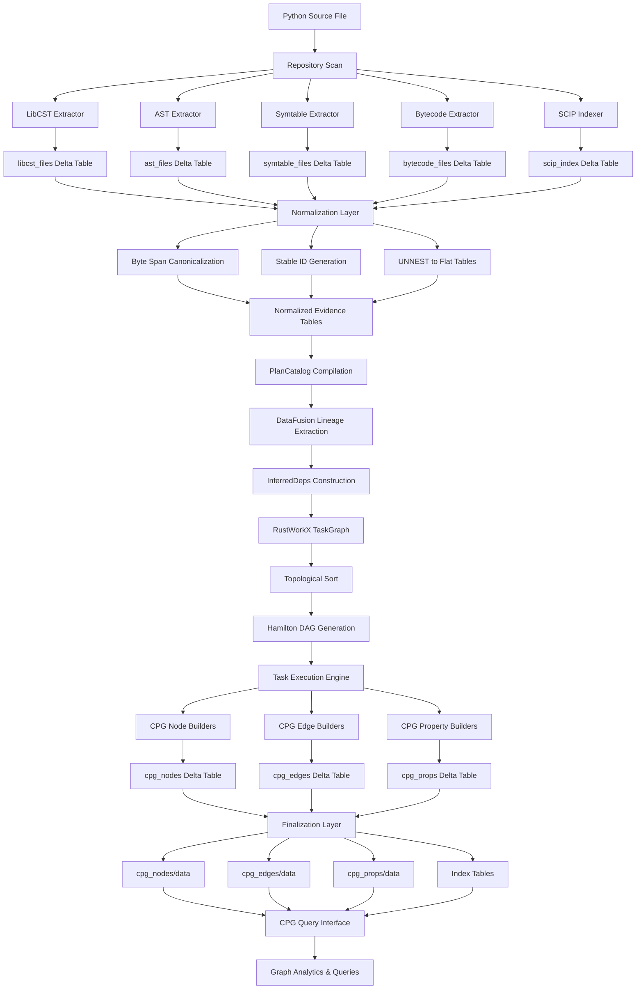

# CodeAnatomy End-to-End Data Flow Walkthrough

## Overview

This document traces the complete journey of a Python source file through CodeAnatomy's extraction, normalization, task graph construction, and CPG emission pipeline. Each section provides concrete examples with actual data structures and schemas.

The pipeline operates in four primary stages:

1. **Extraction** - Multi-source evidence collection (LibCST, AST, symtable, bytecode, SCIP, tree-sitter)
2. **Normalization** - Canonical byte span alignment and stable ID generation
3. **Task Graph Construction** - Dependency inference and scheduling using DataFusion lineage
4. **CPG Emission** - Node/edge/property table generation and Delta Lake persistence

## Complete Walkthrough: Python File to CPG Node

### Input: Example Python File

```python
# src/example.py
"""Example module for data flow walkthrough."""

from typing import Optional

def calculate_sum(a: int, b: int) -> int:
    """Calculate the sum of two integers."""
    return a + b

class DataProcessor:
    """Process data items."""

    def __init__(self, config: Optional[dict] = None):
        self.config = config or {}

    def process(self, item: str) -> str:
        """Process a single item."""
        result = calculate_sum(len(item), 10)
        return f"Processed: {item} (score={result})"
```

### Stage 1: Extraction

The pipeline invokes multiple extractors in parallel, each producing evidence tables.

#### Entry Point

```python
# From src/graph/product_build.py
result = build_graph_product(
    GraphProductBuildRequest(
        repo_root="/home/user/project",
        product="cpg",
        execution_mode=ExecutionMode.PLAN_PARALLEL
    )
)
```

#### Evidence Collection Phase

The extraction phase begins with `execute_pipeline()` which orchestrates:

1. Repository scan to build `repo_files` table
2. Parallel extractor invocation with FileContext objects
3. Evidence table materialization

**FileContext Structure:**

```python
@dataclass
class FileContext:
    file_id: str           # "file:5f4dcc3b5aa765d61d8327deb882cf99"
    path: str              # "src/example.py"
    abs_path: str | None   # "/home/user/project/src/example.py"
    file_sha256: str       # "2c26b46b68ffc68ff99b453c1d30413413422d706483bfa0f98a5e886266e7ae"
    data: bytes | None     # Raw file bytes
    text: str | None       # Decoded source text
    encoding: str | None   # "utf-8"
```

## Extraction Evidence Table Examples

### LibCST Extraction Output

**Invocation:**
```python
# From src/extract/cst_extract.py
result = extract_cst(
    repo_files=repo_files_table,
    options=CstExtractOptions(
        include_refs=True,
        include_imports=True,
        include_callsites=True,
        include_defs=True,
        compute_scope=True
    )
)
```

**Evidence Table: `libcst_files_v1`**

The LibCST extractor produces a nested schema with per-file records containing:

```python
{
    "repo": "example_project",
    "path": "src/example.py",
    "file_id": "file:5f4dcc3b5aa765d61d8327deb882cf99",
    "file_sha256": "2c26b46b68ffc68ff99b453c1d30413413422d706483bfa0f98a5e886266e7ae",

    # Nested parse manifest
    "parse_manifest": [{
        "encoding": "utf-8",
        "module_name": "example",
        "package_name": "src",
        "libcst_version": "1.1.0",
        "parser_backend": "native"
    }],

    # Nested definition records
    "defs": [
        {
            "file_id": "file:5f4dcc3b5aa765d61d8327deb882cf99",
            "path": "src/example.py",
            "kind": "function",
            "name": "calculate_sum",
            "def_bstart": 65,
            "def_bend": 145,
            "name_bstart": 69,
            "name_bend": 82,
            "qnames": [
                {"name": "calculate_sum", "source": "BUILTIN"}
            ],
            "def_fqns": ["src.example.calculate_sum"],
            "docstring": "Calculate the sum of two integers.",
            "decorator_count": 0,
            "attrs": {}
        },
        {
            "file_id": "file:5f4dcc3b5aa765d61d8327deb882cf99",
            "path": "src/example.py",
            "kind": "class",
            "name": "DataProcessor",
            "def_bstart": 147,
            "def_bend": 450,
            "name_bstart": 153,
            "name_bend": 166,
            "qnames": [
                {"name": "DataProcessor", "source": "BUILTIN"}
            ],
            "def_fqns": ["src.example.DataProcessor"],
            "docstring": "Process data items.",
            "decorator_count": 0,
            "attrs": {}
        }
    ],

    # Nested import records
    "imports": [
        {
            "file_id": "file:5f4dcc3b5aa765d61d8327deb882cf99",
            "path": "src/example.py",
            "kind": "importfrom",
            "module": "typing",
            "relative_level": 0,
            "name": "Optional",
            "asname": null,
            "is_star": false,
            "stmt_bstart": 48,
            "stmt_bend": 73,
            "alias_bstart": 61,
            "alias_bend": 69,
            "attrs": {}
        }
    ],

    # Nested callsite records
    "callsites": [
        {
            "file_id": "file:5f4dcc3b5aa765d61d8327deb882cf99",
            "path": "src/example.py",
            "call_bstart": 380,
            "call_bend": 405,
            "callee_bstart": 380,
            "callee_bend": 393,
            "callee_shape": "NAME",
            "callee_text": "calculate_sum",
            "arg_count": 2,
            "callee_dotted": "calculate_sum",
            "callee_qnames": [
                {"name": "calculate_sum", "source": "BUILTIN"}
            ],
            "callee_fqns": ["src.example.calculate_sum"],
            "attrs": {}
        }
    ],

    # Nested reference records (names and attributes)
    "refs": [
        {
            "file_id": "file:5f4dcc3b5aa765d61d8327deb882cf99",
            "path": "src/example.py",
            "ref_kind": "name",
            "ref_text": "Optional",
            "expr_ctx": "Load",
            "scope_type": "GlobalScope",
            "scope_name": null,
            "scope_role": null,
            "bstart": 61,
            "bend": 69,
            "attrs": {}
        }
    ],

    # CST tree structure
    "nodes": [
        {
            "cst_id": 0,
            "kind": "libcst.Module",
            "span": {"bstart": 0, "bend": 450, "start_line0": 0, "end_line0": 15},
            "span_ws": {"bstart": 0, "bend": 450, "start_line0": 0, "end_line0": 15},
            "attrs": {}
        },
        {
            "cst_id": 1,
            "kind": "libcst.SimpleStatementLine",
            "span": {"bstart": 0, "bend": 47, "start_line0": 0, "end_line0": 0},
            "span_ws": {"bstart": 0, "bend": 47, "start_line0": 0, "end_line0": 0},
            "attrs": {}
        }
    ],

    "edges": [
        {
            "src": 0,
            "dst": 1,
            "kind": "CHILD",
            "slot": "body",
            "idx": 0,
            "attrs": {}
        }
    ],

    "attrs": {}
}
```

**Key LibCST Extraction Features:**

- **Byte Spans**: All positions use `bstart`/`bend` (byte offsets, 0-indexed, exclusive end)
- **Line Base**: Lines use 0-index (`line0`)
- **Column Unit**: UTF-32 code points
- **Nested Structure**: Single row per file with nested lists for defs, imports, calls, refs
- **Qualified Names**: Both qualified names (QNames) and fully qualified names (FQNs) captured
- **Scope Information**: Lexical scope metadata from LibCST's ScopeProvider

### AST Extraction Output

**Evidence Table: `ast_files_v1`**

```python
{
    "repo": "example_project",
    "path": "src/example.py",
    "file_id": "file:5f4dcc3b5aa765d61d8327deb882cf99",
    "file_sha256": "2c26b46b68ffc68ff99b453c1d30413413422d706483bfa0f98a5e886266e7ae",

    # Nested AST node records
    "nodes": [
        {
            "ast_id": 0,
            "parent_ast_id": null,
            "kind": "Module",
            "name": null,
            "value": null,
            "span": {
                "start_line0": 0,
                "start_col": 0,
                "end_line0": 15,
                "end_col": 47,
                "end_exclusive": true,
                "col_unit": "byte"
            },
            "attrs": {
                "field_name": null,
                "field_pos": null
            }
        },
        {
            "ast_id": 1,
            "parent_ast_id": 0,
            "kind": "ImportFrom",
            "name": null,
            "value": null,
            "span": {
                "start_line0": 2,
                "start_col": 0,
                "end_line0": 2,
                "end_col": 25,
                "end_exclusive": true,
                "col_unit": "byte"
            },
            "attrs": {
                "field_name": "body",
                "field_pos": 0,
                "module": "typing",
                "level": "0"
            }
        }
    ],

    # Nested AST edge records
    "edges": [
        {
            "src": 0,
            "dst": 1,
            "kind": "CHILD",
            "slot": "body",
            "idx": 0,
            "attrs": {}
        }
    ],

    # Nested definition records
    "defs": [
        {
            "ast_id": 5,
            "parent_ast_id": 0,
            "kind": "FunctionDef",
            "name": "calculate_sum",
            "span": {
                "start_line0": 4,
                "start_col": 0,
                "end_line0": 6,
                "end_col": 16,
                "end_exclusive": true,
                "col_unit": "byte"
            },
            "attrs": {
                "decorator_count": 0,
                "arg_count": 2,
                "posonly_count": 0,
                "kwonly_count": 0,
                "is_async": false,
                "annotation_sources": "[\"int\", \"int\", \"int\"]"
            }
        }
    ],

    # Nested import records
    "imports": [
        {
            "ast_id": 1,
            "parent_ast_id": 0,
            "kind": "ImportFrom",
            "module": "typing",
            "name": "Optional",
            "asname": null,
            "alias_index": 0,
            "level": 0,
            "span": {
                "start_line0": 2,
                "start_col": 0,
                "end_line0": 2,
                "end_col": 25
            },
            "attrs": {}
        }
    ],

    # Nested call records
    "calls": [
        {
            "ast_id": 32,
            "parent_ast_id": 28,
            "func_kind": "Name",
            "func_name": "calculate_sum",
            "span": {
                "start_line0": 12,
                "start_col": 17,
                "end_line0": 12,
                "end_col": 42
            },
            "attrs": {
                "arg_count": 2,
                "keyword_count": 0,
                "starred_count": 0,
                "kw_star_count": 0
            }
        }
    ],

    # Nested docstring records
    "docstrings": [
        {
            "owner_ast_id": 0,
            "owner_kind": "Module",
            "owner_name": null,
            "docstring": "Example module for data flow walkthrough.",
            "span": {
                "start_line0": 0,
                "start_col": 0,
                "end_line0": 0,
                "end_col": 47
            },
            "source": "\"\"\"Example module for data flow walkthrough.\"\"\"",
            "attrs": {}
        }
    ],

    # Parse configuration
    "parse_manifest": [{
        "parse_mode": "exec",
        "feature_version": "3.13",
        "optimize": -1,
        "type_comments": true,
        "allow_top_level_await": false,
        "dont_inherit": true
    }],

    "errors": [],
    "type_ignores": [],
    "attrs": {}
}
```

**Key AST Extraction Features:**

- **Line Base**: 1-indexed in Python AST, converted to 0-indexed
- **Column Unit**: Byte offsets (different from LibCST's UTF-32)
- **Tree Structure**: Parent-child relationships via `ast_id`/`parent_ast_id`
- **Scalar Attributes**: Node attributes flattened into JSON-serializable `attrs` dict
- **Type Annotations**: Source segments for all type expressions captured

### Symtable Extraction Output

**Evidence Table: `symtable_files_v1`**

```python
{
    "repo": "example_project",
    "path": "src/example.py",
    "file_id": "file:5f4dcc3b5aa765d61d8327deb882cf99",
    "file_sha256": "2c26b46b68ffc68ff99b453c1d30413413422d706483bfa0f98a5e886266e7ae",

    # Nested scope blocks
    "blocks": [
        {
            "block_id": 1,
            "parent_block_id": null,
            "block_type": "MODULE",
            "is_meta_scope": false,
            "name": "top",
            "lineno1": 0,
            "span_hint": {"start_line0": -1, "col_unit": "utf32"},
            "scope_id": "file:5f4dcc3b5aa765d61d8327deb882cf99:SCOPE:top:0:MODULE:0",
            "scope_local_id": 1,
            "scope_type_value": 1,
            "qualpath": "top",
            "function_partitions": null,
            "class_methods": null,

            # Symbol table for this scope
            "symbols": [
                {
                    "name": "calculate_sum",
                    "sym_symbol_id": null,
                    "flags": {
                        "is_referenced": true,
                        "is_imported": false,
                        "is_parameter": false,
                        "is_type_parameter": false,
                        "is_global": true,
                        "is_nonlocal": false,
                        "is_declared_global": false,
                        "is_local": false,
                        "is_annotated": false,
                        "is_free": false,
                        "is_assigned": true,
                        "is_namespace": true
                    },
                    "namespace_count": 1,
                    "namespace_block_ids": [2],
                    "attrs": {}
                },
                {
                    "name": "DataProcessor",
                    "sym_symbol_id": null,
                    "flags": {
                        "is_referenced": false,
                        "is_imported": false,
                        "is_parameter": false,
                        "is_type_parameter": false,
                        "is_global": true,
                        "is_nonlocal": false,
                        "is_declared_global": false,
                        "is_local": false,
                        "is_annotated": false,
                        "is_free": false,
                        "is_assigned": true,
                        "is_namespace": true
                    },
                    "namespace_count": 1,
                    "namespace_block_ids": [3],
                    "attrs": {}
                }
            ],

            "attrs": {
                "compile_type": "exec",
                "scope_role": "runtime",
                "is_nested": false,
                "is_optimized": true,
                "has_children": true
            }
        },
        {
            "block_id": 2,
            "parent_block_id": 1,
            "block_type": "FUNCTION",
            "is_meta_scope": false,
            "name": "calculate_sum",
            "lineno1": 5,
            "span_hint": {"start_line0": 4, "col_unit": "utf32"},
            "scope_id": "file:5f4dcc3b5aa765d61d8327deb882cf99:SCOPE:top::calculate_sum#0:5:FUNCTION:0",
            "qualpath": "top::calculate_sum#0",
            "function_partitions": {
                "parameters": ["a", "b"],
                "locals": ["a", "b"],
                "globals": [],
                "nonlocals": [],
                "frees": []
            },
            "symbols": [
                {
                    "name": "a",
                    "flags": {
                        "is_parameter": true,
                        "is_local": true,
                        "is_referenced": true,
                        "is_assigned": true
                    },
                    "namespace_count": 0,
                    "namespace_block_ids": []
                },
                {
                    "name": "b",
                    "flags": {
                        "is_parameter": true,
                        "is_local": true,
                        "is_referenced": true,
                        "is_assigned": true
                    },
                    "namespace_count": 0,
                    "namespace_block_ids": []
                }
            ],
            "attrs": {
                "compile_type": "exec",
                "scope_role": "runtime",
                "is_nested": false,
                "is_optimized": true
            }
        }
    ],

    "attrs": {
        "compile_type": "exec"
    }
}
```

**Key Symtable Extraction Features:**

- **Scope Hierarchy**: Nested block structure with parent-child relationships
- **Symbol Flags**: Rich boolean flags for each symbol (local, global, parameter, etc.)
- **Function Metadata**: Parameter/local/global/free variable partitions
- **Stable IDs**: `scope_id` constructed from file_id + qualpath + ordinal
- **Qualpath**: Hierarchical scope path (e.g., `top::calculate_sum#0::process#0`)

### Bytecode Extraction Output

**Evidence Table: `bytecode_files_v1`**

```python
{
    "repo": "example_project",
    "path": "src/example.py",
    "file_id": "file:5f4dcc3b5aa765d61d8327deb882cf99",
    "file_sha256": "2c26b46b68ffc68ff99b453c1d30413413422d706483bfa0f98a5e886266e7ae",

    # Nested code object records
    "code_objects": [
        {
            "code_id": null,
            "qualname": "<module>",
            "co_qualname": null,
            "co_filename": "src/example.py",
            "name": "<module>",
            "firstlineno1": 1,
            "argcount": 0,
            "posonlyargcount": 0,
            "kwonlyargcount": 0,
            "nlocals": 0,
            "flags": 64,
            "flags_detail": {
                "is_optimized": false,
                "is_newlocals": true,
                "has_varargs": false,
                "has_varkeywords": false,
                "is_nested": false,
                "is_generator": false,
                "is_nofree": false,
                "is_coroutine": false,
                "is_iterable_coroutine": false,
                "is_async_generator": false
            },
            "stacksize": 4,
            "code_len": 156,
            "varnames": [],
            "freevars": [],
            "cellvars": [],
            "names": ["Optional", "calculate_sum", "DataProcessor"],

            # Constant values
            "consts": [
                {"const_index": 0, "const_repr": "0"},
                {"const_index": 1, "const_repr": "'Example module for data flow walkthrough.'"},
                {"const_index": 2, "const_repr": "'typing'"}
            ],

            # Line number table
            "line_table": [
                {"offset": 0, "line1": 1, "line0": 0, "attrs": {}},
                {"offset": 10, "line1": 3, "line0": 2, "attrs": {}},
                {"offset": 26, "line1": 5, "line0": 4, "attrs": {}}
            ],

            # Instruction sequence
            "instructions": [
                {
                    "instr_index": 0,
                    "offset": 0,
                    "start_offset": 0,
                    "end_offset": 2,
                    "opname": "RESUME",
                    "baseopname": "RESUME",
                    "opcode": 151,
                    "baseopcode": 151,
                    "arg": 0,
                    "oparg": 0,
                    "argval_kind": null,
                    "argval_int": 0,
                    "argval_str": null,
                    "argrepr": "0",
                    "line_number": 1,
                    "starts_line": 1,
                    "label": null,
                    "is_jump_target": false,
                    "jump_target": null,
                    "cache_info": [],
                    "span": {
                        "start_line0": 0,
                        "start_col": 0,
                        "end_line0": 0,
                        "end_col": 0
                    },
                    "attrs": {
                        "stack_depth_before": 0,
                        "stack_depth_after": 0
                    }
                },
                {
                    "instr_index": 1,
                    "offset": 2,
                    "opname": "LOAD_CONST",
                    "opcode": 100,
                    "arg": 0,
                    "argval_kind": "const",
                    "argval_int": 0,
                    "argrepr": "0",
                    "line_number": 1,
                    "is_jump_target": false,
                    "attrs": {
                        "stack_depth_before": 0,
                        "stack_depth_after": 1
                    }
                }
            ],

            # Exception handling table
            "exception_table": [],

            # Control flow graph blocks
            "blocks": [
                {
                    "start_offset": 0,
                    "end_offset": 156,
                    "kind": "entry",
                    "attrs": {}
                }
            ],

            # CFG edges
            "cfg_edges": [],

            # Data flow edges (stack-based)
            "dfg_edges": [
                {
                    "src_instr_index": 1,
                    "dst_instr_index": 10,
                    "kind": "USE_STACK",
                    "attrs": {}
                }
            ],

            "attrs": {
                "parent_qualpath": null,
                "parent_co_name": null,
                "parent_firstlineno": null
            }
        },
        {
            "qualname": "<module>.calculate_sum@5",
            "name": "calculate_sum",
            "firstlineno1": 5,
            "argcount": 2,
            "varnames": ["a", "b"],
            "instructions": [
                {
                    "instr_index": 0,
                    "opname": "RESUME",
                    "line_number": 5
                },
                {
                    "instr_index": 1,
                    "opname": "LOAD_FAST",
                    "arg": 0,
                    "argval_kind": "local",
                    "argval_str": "a",
                    "line_number": 7
                },
                {
                    "instr_index": 2,
                    "opname": "LOAD_FAST",
                    "arg": 1,
                    "argval_str": "b"
                },
                {
                    "instr_index": 3,
                    "opname": "BINARY_OP",
                    "arg": 0,
                    "argrepr": "+"
                },
                {
                    "instr_index": 4,
                    "opname": "RETURN_VALUE"
                }
            ],
            "blocks": [
                {"start_offset": 0, "end_offset": 10, "kind": "entry"}
            ],
            "dfg_edges": [
                {"src_instr_index": 1, "dst_instr_index": 3, "kind": "USE_STACK"},
                {"src_instr_index": 2, "dst_instr_index": 3, "kind": "USE_STACK"}
            ]
        }
    ],

    "errors": [],

    "attrs": {
        "python_version": "3.13.11",
        "python_magic": "a0d0df61",
        "optimize": 0,
        "dont_inherit": true,
        "adaptive": false,
        "include_cfg": true
    }
}
```

**Key Bytecode Extraction Features:**

- **Code Object Hierarchy**: Qualpath-based nesting (module -> function -> nested function)
- **Instruction Details**: Full `dis` module output with stack effect tracking
- **CFG Derivation**: Basic blocks and control flow edges computed from jump targets
- **DFG Scaffolding**: Stack-based data flow edges between instructions
- **Line Mapping**: `co_lnotab` table decoded to line number associations
- **Python Version**: Captures Python magic number and version for compatibility

### SCIP Extraction Output

**Evidence Table: `scip_index_v1`**

```python
{
    "index_id": null,
    "index_path": "/home/user/project/build/scip/index.scip",

    # Index metadata
    "metadata": {
        "protocol_version": 1,
        "tool_name": "scip-python",
        "tool_version": "0.3.0",
        "tool_arguments": ["index", ".", "--project-name", "example"],
        "project_root": "file:///home/user/project/",
        "text_document_encoding": 0,
        "project_name": "example",
        "project_version": "0.1.0",
        "project_namespace": null
    },

    # Index statistics
    "index_stats": {
        "document_count": 1,
        "occurrence_count": 24,
        "diagnostic_count": 0,
        "symbol_count": 6,
        "external_symbol_count": 2,
        "missing_position_encoding_count": 0,
        "document_text_count": 0,
        "document_text_bytes": 0
    },

    # Document records
    "documents": [
        {
            "document_id": null,
            "path": "src/example.py",
            "language": "python",
            "position_encoding": 0,  # UTF-8
            "text": null,

            # Document symbols (when include_document_symbols=True)
            "symbols": [
                {
                    "symbol": "src.example.calculate_sum().",
                    "display_name": "calculate_sum",
                    "kind": 6,  # Method
                    "kind_name": "Method",
                    "enclosing_symbol": "src.example.",
                    "documentation": ["Calculate the sum of two integers."],
                    "signature_text": "def calculate_sum(a: int, b: int) -> int:",
                    "signature_language": "python"
                }
            ],

            # Occurrence records
            "occurrences": [
                {
                    "symbol": "src.example.calculate_sum().",
                    "symbol_roles": 1,  # Definition
                    "syntax_kind": 197,
                    "syntax_kind_name": "IdentifierFunctionDefinition",
                    "override_documentation": [],
                    "range_raw": [4, 4, 17],  # [line, start_col, end_col]
                    "start_line": 4,
                    "start_char": 4,
                    "end_line": 4,
                    "end_char": 17,
                    "range_len": 3,
                    "enclosing_range_raw": [4, 0, 6, 16],
                    "enc_start_line": 4,
                    "enc_start_char": 0,
                    "enc_end_line": 6,
                    "enc_end_char": 16,
                    "enc_range_len": 4,
                    "line_base": 0,
                    "col_unit": "utf8",
                    "end_exclusive": true,
                    "is_definition": true,
                    "is_import": false,
                    "is_write": false,
                    "is_read": false,
                    "is_generated": false,
                    "is_test": false,
                    "is_forward_definition": false
                },
                {
                    "symbol": "src.example.calculate_sum().",
                    "symbol_roles": 8,  # Read access
                    "syntax_kind": 198,
                    "syntax_kind_name": "IdentifierFunctionCall",
                    "range_raw": [12, 17, 30],
                    "start_line": 12,
                    "start_char": 17,
                    "end_line": 12,
                    "end_char": 30,
                    "is_definition": false,
                    "is_read": true
                }
            ],

            "diagnostics": []
        }
    ],

    # Global symbol information
    "symbol_information": [
        {
            "symbol": "src.example.calculate_sum().",
            "display_name": "calculate_sum",
            "kind": 6,
            "kind_name": "Method",
            "enclosing_symbol": "src.example.",
            "documentation": ["Calculate the sum of two integers."],
            "signature_text": "def calculate_sum(a: int, b: int) -> int:",
            "signature_language": "python"
        },
        {
            "symbol": "src.example.DataProcessor#",
            "display_name": "DataProcessor",
            "kind": 5,  # Class
            "kind_name": "Class",
            "enclosing_symbol": "src.example.",
            "documentation": ["Process data items."],
            "signature_text": "class DataProcessor:",
            "signature_language": "python"
        }
    ],

    # External symbol references
    "external_symbol_information": [
        {
            "symbol": "python-stdlib 3.13 typing/Optional#",
            "display_name": "Optional",
            "kind": 5,
            "kind_name": "Class",
            "enclosing_symbol": "python-stdlib 3.13 typing/",
            "documentation": [],
            "signature_text": null,
            "signature_language": null
        }
    ],

    # Symbol relationships
    "symbol_relationships": [],

    # Signature occurrences (for hover/completion)
    "signature_occurrences": [
        {
            "parent_symbol": "src.example.calculate_sum().",
            "symbol": "src.example.calculate_sum().(a)",
            "symbol_roles": 1,
            "syntax_kind": 197,
            "syntax_kind_name": "IdentifierParameter",
            "range_raw": [0, 18, 19],  # Within signature text
            "start_line": 0,
            "start_char": 18,
            "end_line": 0,
            "end_char": 19,
            "range_len": 3,
            "line_base": 0,
            "col_unit": "utf32",
            "end_exclusive": true,
            "is_definition": true
        }
    ]
}
```

**Key SCIP Extraction Features:**

- **Unified Symbol Format**: SCIP symbols use a canonical format (e.g., `src.example.calculate_sum().`)
- **Position Encoding**: Per-document encoding (UTF-8, UTF-16, UTF-32)
- **Symbol Roles**: Bitflags for definition/import/read/write access
- **Enclosing Ranges**: Both exact occurrence range and enclosing definition range
- **External Symbols**: References to stdlib and third-party symbols
- **Signature Occurrences**: Detailed symbol locations within type signatures

## Normalization Transformation Examples

### Byte Span Canonicalization Example

Evidence tables arrive with different conventions:
- **LibCST**: 0-indexed lines, UTF-32 columns, exclusive end
- **AST**: 1-indexed lines, byte columns, exclusive end
- **Symtable**: 1-indexed lines, no column data
- **Bytecode**: 1-indexed lines, no column data
- **SCIP**: 0-indexed lines, encoding-specific columns, exclusive end

**Canonicalization Process:**

```python
# From src/datafusion_engine/span_utils.py
@dataclass(frozen=True)
class SpanSpec:
    start_line0: int | None      # Always 0-indexed
    start_col: int | None         # Column offset (unit-dependent)
    end_line0: int | None         # Always 0-indexed
    end_col: int | None           # Column offset (unit-dependent)
    end_exclusive: bool | None    # True if end is exclusive
    col_unit: str | None          # "byte", "utf8", "utf16", "utf32"
    byte_start: int | None        # Byte offset (if available)
    byte_len: int | None          # Byte length (if available)
```

**Normalization UDF (Rust):**

```sql
-- From DataFusion view builders
SELECT
    normalize_span(
        start_line0 := refs.bstart / file_line_lengths.bytes_per_line,
        start_col := refs.bstart % file_line_lengths.bytes_per_line,
        end_line0 := refs.bend / file_line_lengths.bytes_per_line,
        end_col := refs.bend % file_line_lengths.bytes_per_line,
        end_exclusive := true,
        col_unit := 'byte'
    ) AS canonical_span
FROM libcst_files.refs
```

**Output Schema (After Normalization):**

```python
{
    "bstart": 380,           # Canonical byte start (0-indexed, absolute)
    "bend": 405,             # Canonical byte end (0-indexed, exclusive)
    "start_line0": 12,       # 0-indexed line
    "start_col": 17,         # Byte column within line
    "end_line0": 12,         # 0-indexed line
    "end_col": 42,           # Byte column within line
    "col_unit": "byte",      # Column unit
    "end_exclusive": true    # End exclusivity flag
}
```

### Stable ID Generation Walkthrough

**Node ID Construction:**

Node IDs follow the pattern: `<file_id>:<entity_type>:<path_components>:<byte_span>`

**Example Transformations:**

```sql
-- LibCST function definition -> CPG node
SELECT
    gen_node_id(
        file_id := 'file:5f4dcc3b5aa765d61d8327deb882cf99',
        kind := 'function_def',
        bstart := 65,
        bend := 145,
        qualpath := 'calculate_sum',
        ordinal := 0
    ) AS node_id
-- Result: "file:5f4dcc3b5aa765d61d8327deb882cf99:FUNC_DEF:calculate_sum:65:145:0"

-- AST FunctionDef -> CPG node (same function, different source)
SELECT
    gen_node_id(
        file_id := 'file:5f4dcc3b5aa765d61d8327deb882cf99',
        kind := 'ast_function_def',
        ast_id := 5,
        name := 'calculate_sum'
    ) AS node_id
-- Result: "file:5f4dcc3b5aa765d61d8327deb882cf99:AST_FUNC_DEF:calculate_sum:ast_id=5"

-- Symtable scope -> CPG node
SELECT
    scope_id  -- Pre-constructed during extraction
FROM symtable_files.blocks
WHERE name = 'calculate_sum'
-- Result: "file:5f4dcc3b5aa765d61d8327deb882cf99:SCOPE:top::calculate_sum#0:5:FUNCTION:0"
```

**Hash-Based IDs for Edges:**

```sql
-- Call edge from process() to calculate_sum()
SELECT
    hash_edge_id(
        src_node_id := 'file:...:FUNC_DEF:process:320:450:0',
        dst_node_id := 'file:...:FUNC_DEF:calculate_sum:65:145:0',
        edge_kind := 'CALLS',
        origin := 'cst_callsite'
    ) AS edge_id
-- Result: "edge:sha256:a8f3d7c2e91b5..."
```

### Join-Ready Shape Transformation

**Input: Nested LibCST Record**

```python
{
    "file_id": "file:...",
    "defs": [
        {"name": "calculate_sum", "def_bstart": 65, "def_bend": 145},
        {"name": "DataProcessor", "def_bstart": 147, "def_bend": 450}
    ]
}
```

**Transformation: UNNEST to Flattened Rows**

```sql
-- DataFusion view (pseudo-SQL)
CREATE OR REPLACE VIEW cst_defs_flat AS
SELECT
    f.file_id,
    f.path,
    d.name,
    d.def_bstart AS bstart,
    d.def_bend AS bend,
    d.kind,
    d.qnames,
    d.def_fqns AS fqns
FROM libcst_files f
CROSS JOIN UNNEST(f.defs) AS d
```

**Output: Flattened Table**

| file_id | path | name | bstart | bend | kind | qnames | fqns |
|---------|------|------|--------|------|------|--------|------|
| file:... | src/example.py | calculate_sum | 65 | 145 | function | [...] | [src.example.calculate_sum] |
| file:... | src/example.py | DataProcessor | 147 | 450 | class | [...] | [src.example.DataProcessor] |

**Join-Ready Benefits:**

```sql
-- Now can join with other evidence tables
SELECT
    cst_defs.name,
    symtable_blocks.scope_type,
    bytecode_code_objects.argcount
FROM cst_defs_flat AS cst_defs
JOIN symtable_files_flat.blocks AS symtable_blocks
    ON cst_defs.file_id = symtable_blocks.file_id
    AND cst_defs.name = symtable_blocks.name
JOIN bytecode_files_flat.code_objects AS bytecode_code_objects
    ON cst_defs.file_id = bytecode_code_objects.file_id
    AND cst_defs.name = bytecode_code_objects.name
```

## Task Graph Construction Walkthrough

### TaskSpec Creation from Evidence Tables

**Conceptual Flow:**

```
Evidence Tables (libcst_files, ast_files, symtable_files, ...)
    ↓
PlanCatalog: Compile DataFusion View Builders
    ↓
Extract Lineage from Optimized Logical Plans
    ↓
InferredDeps: Table-level and column-level dependencies
    ↓
RustWorkX Graph: TaskNode with inferred edges
    ↓
Topological Sort: Execution schedule
    ↓
Hamilton DAG Generation
```

### PlanCatalog Compilation

**View Builder Registration:**

```python
# From src/cpg/view_builders_df.py
def cst_function_defs_view(ctx: ViewBuilderContext) -> ViewExpr:
    """Extract function definitions from LibCST evidence."""
    return ViewExpr(
        sql="""
        SELECT
            f.file_id,
            f.path,
            d.name,
            d.def_bstart AS bstart,
            d.def_bend AS bend,
            d.kind,
            UNNEST(d.def_fqns) AS fqn,
            d.docstring
        FROM libcst_files f
        CROSS JOIN UNNEST(f.defs) AS d
        WHERE d.kind IN ('function', 'async_function')
        """,
        output_name="cst_function_defs"
    )
```

**PlanCatalog Construction:**

```python
# From src/relspec/plan_catalog.py
from datafusion_engine.view_registry import compile_view_to_plan

plan_bundle = compile_view_to_plan(
    view_name="cst_function_defs",
    sql=cst_function_defs_view(ctx).sql,
    session=session
)

# plan_bundle contains:
# - optimized_logical_plan: DataFusion LogicalPlan
# - plan_fingerprint: Stable hash for caching
# - required_udfs: UDF names referenced in plan
# - artifacts: Metadata including UDF snapshot
```

### Dependency Inference from DataFusion Lineage

**Lineage Extraction:**

```python
# From src/datafusion_engine/lineage_datafusion.py
from datafusion_python import extract_lineage

lineage = extract_lineage(
    plan_bundle.optimized_logical_plan,
    udf_snapshot=plan_bundle.artifacts.udf_snapshot
)

# Lineage structure:
@dataclass
class PlanLineage:
    referenced_tables: tuple[str, ...]  # ["libcst_files"]
    required_columns_by_dataset: dict[str, tuple[str, ...]]
    # {
    #     "libcst_files": ("file_id", "path", "defs")
    # }
    required_udfs: tuple[str, ...]  # ["UNNEST"]
    required_rewrite_tags: tuple[str, ...]
    scans: tuple[ScanLineage, ...]  # Detailed scan metadata
```

**Inferred Dependencies:**

```python
# From src/relspec/inferred_deps.py
inferred = infer_deps_from_plan_bundle(
    InferredDepsInputs(
        task_name="cst_function_defs",
        output="cst_function_defs",
        plan_bundle=plan_bundle
    )
)

# Result:
InferredDeps(
    task_name="cst_function_defs",
    output="cst_function_defs",
    inputs=("libcst_files",),  # Inferred from plan
    required_columns={
        "libcst_files": ("file_id", "path", "defs")
    },
    required_types={
        "libcst_files": (
            ("file_id", "Utf8"),
            ("path", "Utf8"),
            ("defs", "List<Struct>")
        )
    },
    plan_fingerprint="sha256:f4a3b81c...",
    required_udfs=("UNNEST",),
    scans=(
        ScanLineage(
            table_name="libcst_files",
            projection=["file_id", "path", "defs"],
            filters=[]
        ),
    )
)
```

### RustWorkX Graph Construction

**TaskNode Creation:**

```python
# From src/relspec/rustworkx_graph.py
import rustworkx as rx

graph = rx.PyDiGraph()

# Add nodes for each task
task_nodes: dict[str, int] = {}
for task_name, inferred_deps in inferred_deps_map.items():
    node_index = graph.add_node({
        "task_name": task_name,
        "output": inferred_deps.output,
        "plan_fingerprint": inferred_deps.plan_fingerprint
    })
    task_nodes[task_name] = node_index

# Add edges based on inferred dependencies
for task_name, inferred_deps in inferred_deps_map.items():
    dst_index = task_nodes[task_name]
    for input_table in inferred_deps.inputs:
        if input_table in task_nodes:
            src_index = task_nodes[input_table]
            graph.add_edge(
                src_index,
                dst_index,
                {
                    "kind": "table_dependency",
                    "required_columns": inferred_deps.required_columns.get(input_table, ())
                }
            )
```

**Example Graph Structure:**

```
repo_scan
  ↓
libcst_files
  ↓
cst_function_defs  →  cpg_function_nodes
  ↓                       ↓
cst_callsites      →  cpg_call_edges
  ↓                       ↓
                    cpg_nodes_final
```

**Topological Sort:**

```python
# From src/relspec/rustworkx_schedule.py
import rustworkx as rx

# Compute topological order
try:
    schedule = rx.topological_sort(graph)
except rx.DAGHasCycle:
    # Handle cycles with detailed error reporting
    cycles = rx.digraph_find_cycle(graph)
    raise CyclicDependencyError(cycles)

# Schedule result: [0, 1, 2, 3, 4, 5]
# Maps to: [repo_scan, libcst_files, cst_function_defs, ...]
```

## CPG Emission Flow

### Node Emission from Normalized Evidence

**CPG Node View Builder:**

```sql
-- From src/cpg/view_builders_df.py
CREATE OR REPLACE VIEW cpg_function_def_nodes AS
SELECT
    gen_node_id(
        file_id := cst_defs.file_id,
        kind := 'FUNCTION_DEF',
        bstart := cst_defs.bstart,
        bend := cst_defs.bend,
        name := cst_defs.name
    ) AS node_id,
    'FUNCTION_DEF' AS node_kind,
    cst_defs.path,
    cst_defs.bstart,
    cst_defs.bend,
    cst_defs.file_id,
    'cpg_function_def_nodes' AS task_name,
    100 AS task_priority
FROM cst_function_defs AS cst_defs
```

**CPG Node Output Schema:**

```python
# From src/cpg/schemas.py
CPG_NODES_SCHEMA = pa.schema([
    pa.field("node_id", pa.string(), nullable=False),
    pa.field("node_kind", pa.string(), nullable=False),
    pa.field("path", pa.string()),
    pa.field("bstart", pa.int64()),
    pa.field("bend", pa.int64()),
    pa.field("file_id", pa.string()),
    pa.field("task_name", pa.string()),
    pa.field("task_priority", pa.int32())
])
```

**Example CPG Nodes:**

```python
[
    {
        "node_id": "file:5f4dcc...:FUNC_DEF:calculate_sum:65:145",
        "node_kind": "FUNCTION_DEF",
        "path": "src/example.py",
        "bstart": 65,
        "bend": 145,
        "file_id": "file:5f4dcc...",
        "task_name": "cpg_function_def_nodes",
        "task_priority": 100
    },
    {
        "node_id": "file:5f4dcc...:CLASS_DEF:DataProcessor:147:450",
        "node_kind": "CLASS_DEF",
        "path": "src/example.py",
        "bstart": 147,
        "bend": 450,
        "file_id": "file:5f4dcc...",
        "task_name": "cpg_class_def_nodes",
        "task_priority": 100
    }
]
```

### Edge Emission Patterns

**Call Edge Builder:**

```sql
-- From src/cpg/view_builders_df.py
CREATE OR REPLACE VIEW cpg_call_edges AS
SELECT
    hash_edge_id(
        src_node_id := caller_nodes.node_id,
        dst_node_id := callee_nodes.node_id,
        edge_kind := 'CALLS'
    ) AS edge_id,
    'CALLS' AS edge_kind,
    caller_nodes.node_id AS src_node_id,
    callee_nodes.node_id AS dst_node_id,
    cst_calls.path,
    cst_calls.call_bstart AS bstart,
    cst_calls.call_bend AS bend,
    'cst_callsite' AS origin,
    'qualified_name_match' AS resolution_method,
    0.85 AS confidence,
    NULL AS score,
    NULL AS symbol_roles,
    'BUILTIN' AS qname_source,
    NULL AS ambiguity_group_id,
    'cpg_call_edges' AS task_name,
    200 AS task_priority
FROM cst_callsites AS cst_calls
JOIN cpg_function_def_nodes AS caller_nodes
    ON cst_calls.file_id = caller_nodes.file_id
    AND cst_calls.call_bstart >= caller_nodes.bstart
    AND cst_calls.call_bend <= caller_nodes.bend
LEFT JOIN cpg_function_def_nodes AS callee_nodes
    ON cst_calls.callee_fqn = callee_nodes.fqn
```

**CPG Edge Output Schema:**

```python
# From src/cpg/schemas.py
CPG_EDGES_SCHEMA = pa.schema([
    pa.field("edge_id", pa.string(), nullable=False),
    pa.field("edge_kind", pa.string(), nullable=False),
    pa.field("src_node_id", pa.string(), nullable=False),
    pa.field("dst_node_id", pa.string(), nullable=False),
    pa.field("path", pa.string()),
    pa.field("bstart", pa.int64()),
    pa.field("bend", pa.int64()),
    pa.field("origin", pa.string()),
    pa.field("resolution_method", pa.string()),
    pa.field("confidence", pa.float64()),
    pa.field("score", pa.float64()),
    pa.field("symbol_roles", pa.int32()),
    pa.field("qname_source", pa.string()),
    pa.field("ambiguity_group_id", pa.string()),
    pa.field("task_name", pa.string()),
    pa.field("task_priority", pa.int32())
])
```

**Example CPG Edges:**

```python
[
    {
        "edge_id": "edge:sha256:a8f3d7c2e91b...",
        "edge_kind": "CALLS",
        "src_node_id": "file:5f4dcc...:FUNC_DEF:process:320:450",
        "dst_node_id": "file:5f4dcc...:FUNC_DEF:calculate_sum:65:145",
        "path": "src/example.py",
        "bstart": 380,
        "bend": 405,
        "origin": "cst_callsite",
        "resolution_method": "qualified_name_match",
        "confidence": 0.85,
        "score": null,
        "symbol_roles": null,
        "qname_source": "BUILTIN",
        "ambiguity_group_id": null,
        "task_name": "cpg_call_edges",
        "task_priority": 200
    },
    {
        "edge_id": "edge:sha256:7c2a9f1d...",
        "edge_kind": "CONTAINS",
        "src_node_id": "file:5f4dcc...:CLASS_DEF:DataProcessor:147:450",
        "dst_node_id": "file:5f4dcc...:FUNC_DEF:process:320:450",
        "path": "src/example.py",
        "bstart": 320,
        "bend": 450,
        "origin": "ast_hierarchy",
        "resolution_method": "lexical_containment",
        "confidence": 1.0,
        "task_name": "cpg_contains_edges",
        "task_priority": 150
    }
]
```

### Property Attachment

**Property Builder:**

```sql
-- From src/cpg/view_builders_df.py
CREATE OR REPLACE VIEW cpg_function_properties AS
SELECT
    'node' AS entity_kind,
    func_nodes.node_id AS entity_id,
    'FUNCTION_DEF' AS node_kind,
    'docstring' AS prop_key,
    'string' AS value_type,
    cst_defs.docstring AS value_string,
    NULL AS value_int,
    NULL AS value_float,
    NULL AS value_bool,
    NULL AS value_json,
    'cpg_function_properties' AS task_name,
    100 AS task_priority
FROM cpg_function_def_nodes AS func_nodes
JOIN cst_function_defs AS cst_defs
    ON func_nodes.file_id = cst_defs.file_id
    AND func_nodes.bstart = cst_defs.bstart
    AND func_nodes.bend = cst_defs.bend
WHERE cst_defs.docstring IS NOT NULL

UNION ALL

SELECT
    'node' AS entity_kind,
    func_nodes.node_id AS entity_id,
    'FUNCTION_DEF' AS node_kind,
    'param_count' AS prop_key,
    'int' AS value_type,
    NULL AS value_string,
    bytecode_co.argcount AS value_int,
    NULL AS value_float,
    NULL AS value_bool,
    NULL AS value_json,
    'cpg_function_properties' AS task_name,
    100 AS task_priority
FROM cpg_function_def_nodes AS func_nodes
JOIN bytecode_code_objects AS bytecode_co
    ON func_nodes.file_id = bytecode_co.file_id
    AND func_nodes.name = bytecode_co.name
```

**CPG Property Output Schema:**

```python
# From src/cpg/schemas.py
CPG_PROPS_SCHEMA = pa.schema([
    pa.field("entity_kind", pa.string(), nullable=False),  # "node" | "edge"
    pa.field("entity_id", pa.string(), nullable=False),
    pa.field("node_kind", pa.string()),
    pa.field("prop_key", pa.string(), nullable=False),
    pa.field("value_type", pa.string(), nullable=False),
    pa.field("value_string", pa.string()),
    pa.field("value_int", pa.int64()),
    pa.field("value_float", pa.float64()),
    pa.field("value_bool", pa.bool_()),
    pa.field("value_json", pa.string()),
    pa.field("task_name", pa.string()),
    pa.field("task_priority", pa.int32())
])
```

**Example CPG Properties:**

```python
[
    {
        "entity_kind": "node",
        "entity_id": "file:5f4dcc...:FUNC_DEF:calculate_sum:65:145",
        "node_kind": "FUNCTION_DEF",
        "prop_key": "docstring",
        "value_type": "string",
        "value_string": "Calculate the sum of two integers.",
        "value_int": null,
        "value_float": null,
        "value_bool": null,
        "value_json": null,
        "task_name": "cpg_function_properties",
        "task_priority": 100
    },
    {
        "entity_kind": "node",
        "entity_id": "file:5f4dcc...:FUNC_DEF:calculate_sum:65:145",
        "node_kind": "FUNCTION_DEF",
        "prop_key": "param_count",
        "value_type": "int",
        "value_string": null,
        "value_int": 2,
        "value_float": null,
        "value_bool": null,
        "value_json": null,
        "task_name": "cpg_function_properties",
        "task_priority": 100
    },
    {
        "entity_kind": "node",
        "entity_id": "file:5f4dcc...:FUNC_DEF:calculate_sum:65:145",
        "node_kind": "FUNCTION_DEF",
        "prop_key": "qualified_names",
        "value_type": "json",
        "value_string": null,
        "value_int": null,
        "value_float": null,
        "value_bool": null,
        "value_json": "[\"src.example.calculate_sum\"]",
        "task_name": "cpg_function_properties",
        "task_priority": 100
    }
]
```

### Final CPG Table Structures

**Table Finalization:**

```python
# From src/engine/materialize_pipeline.py
# After all tasks complete, merge and deduplicate

cpg_nodes_final = UNION ALL(
    cpg_function_def_nodes,
    cpg_class_def_nodes,
    cpg_import_nodes,
    cpg_callsite_nodes,
    ...
) |> DISTINCT ON (node_id)

cpg_edges_final = UNION ALL(
    cpg_call_edges,
    cpg_contains_edges,
    cpg_ref_edges,
    cpg_dataflow_edges,
    ...
) |> DISTINCT ON (edge_id)

cpg_props_final = UNION ALL(
    cpg_function_properties,
    cpg_class_properties,
    cpg_type_properties,
    ...
) |> DISTINCT ON (entity_id, prop_key)
```

**Materialized Table Sizes (Example):**

| Table | Rows | Columns | Description |
|-------|------|---------|-------------|
| `cpg_nodes` | 156 | 8 | All CPG nodes (functions, classes, imports, etc.) |
| `cpg_edges` | 342 | 15 | All CPG edges (calls, contains, refs, dataflow) |
| `cpg_props` | 428 | 11 | All node/edge properties |
| `cpg_props_map` | 428 | 3 | Property lookup index (entity_id → [prop_keys]) |
| `cpg_edges_by_src` | 342 | 3 | Edge index by source node |
| `cpg_edges_by_dst` | 342 | 3 | Edge index by destination node |

## Delta Lake Write and Read Patterns

### Write Path: Extraction → Staging → Finalize

**Phase 1: Evidence Extraction to Staging**

```python
# From src/storage/deltalake/write.py
from deltalake import write_deltalake

# Write evidence table to staging Delta table
write_deltalake(
    table_or_uri="/home/user/project/build/delta/libcst_files",
    data=libcst_evidence_table,
    mode="overwrite",
    schema_mode="merge",
    storage_options={"allow_unsafe_rename": "true"}
)

# Staging table structure:
# /home/user/project/build/delta/libcst_files/
#   _delta_log/
#     00000000000000000000.json  # Initial commit
#   part-00000-<uuid>.parquet
```

**Phase 2: CPG Emission to Data/Errors Split**

```python
# From src/datafusion_engine/finalize.py
from src.datafusion_engine.finalize import finalize_cpg_table

result = finalize_cpg_table(
    table=cpg_nodes_unfinalized,
    output_dir=Path("/home/user/project/build/delta/cpg_nodes"),
    schema_contract=CPG_NODES_CONTRACT,
    write_policy=DeltaWritePolicy(
        partition_by=None,
        max_rows_per_group=1_000_000,
        compression="zstd"
    )
)

# Output structure:
# /home/user/project/build/delta/cpg_nodes/
#   data/
#     _delta_log/
#       00000000000000000000.json
#     part-00000-<uuid>.parquet
#   errors/
#     _delta_log/
#       00000000000000000000.json
#     part-00000-<uuid>.parquet  # Schema validation errors
#   stats/
#     _delta_log/
#       00000000000000000000.json
#     part-00000-<uuid>.parquet  # Write statistics
#   alignment/
#     _delta_log/
#       00000000000000000000.json
#     part-00000-<uuid>.parquet  # Alignment diagnostics
```

**Finalize Report:**

```python
@dataclass
class FinalizeDeltaReport:
    paths: FinalizeDeltaPaths  # data, errors, stats, alignment
    rows: int                  # 156 (successful nodes)
    error_rows: int            # 2 (schema violations)
```

### Read Path: Version Pinning → Scan → Filtering

**Phase 1: Version Resolution**

```python
# From src/storage/deltalake/read.py
from deltalake import DeltaTable

# Open Delta table
dt = DeltaTable("/home/user/project/build/delta/cpg_nodes/data")

# Read at specific version
dt.load_version(version=5)

# Or read at timestamp
dt.load_with_datetime(datetime(2024, 1, 15, 10, 30, 0))

# Get current version
current_version = dt.version()  # 12
```

**Phase 2: Scan with Predicate Pushdown**

```python
# From src/datafusion_engine/scan_planner.py
import pyarrow.dataset as ds

# Create dataset with file pruning
dataset = ds.dataset(
    "/home/user/project/build/delta/cpg_nodes/data",
    format="delta",
    partitioning=ds.partitioning(
        schema=pa.schema([
            pa.field("task_name", pa.string())
        ]),
        flavor="hive"
    )
)

# Scan with filter pushdown
scanner = dataset.scanner(
    columns=["node_id", "node_kind", "path", "bstart", "bend"],
    filter=(ds.field("node_kind") == "FUNCTION_DEF")
)

# Execute scan
table = scanner.to_table()
```

**Phase 3: DataFusion Query**

```python
# From src/datafusion_engine/execution_facade.py
from datafusion import SessionContext

ctx = SessionContext()

# Register Delta table as DataFusion table
ctx.register_dataset(
    "cpg_nodes",
    dataset
)

# Query with filter
result = ctx.sql("""
    SELECT node_id, path, bstart, bend
    FROM cpg_nodes
    WHERE node_kind = 'FUNCTION_DEF'
      AND path LIKE 'src/%'
    ORDER BY path, bstart
""").collect()
```

### Incremental Update Patterns with CDF

**Phase 1: Change Data Feed (CDF) Cursor**

```python
# From src/incremental/cdf_runtime.py
from deltalake import DeltaTable

dt = DeltaTable("/home/user/project/build/delta/cpg_nodes/data")

# Enable CDF on Delta table
dt.alter.add_constraint({
    "change_data_feed": {
        "enabled": True
    }
})

# Read changes since version 10
cdf_df = dt.load_cdf(
    starting_version=10,
    ending_version=12
)

# CDF schema includes:
# - All original columns
# - _change_type: "insert", "update_preimage", "update_postimage", "delete"
# - _commit_version: Version number
# - _commit_timestamp: Commit timestamp
```

**Phase 2: Impact Analysis**

```python
# From src/incremental/impact.py
from src.incremental.impact import compute_downstream_impact

# Analyze which tasks need recomputation
impact_report = compute_downstream_impact(
    changed_tables={"libcst_files"},
    changed_files={"src/example.py"},
    task_graph=task_graph,
    version_map={
        "libcst_files": 12,
        "cpg_nodes": 10  # Out of date
    }
)

# Result:
ImpactReport(
    invalidated_tasks=[
        "cst_function_defs",
        "cpg_function_def_nodes",
        "cpg_call_edges"
    ],
    affected_outputs=[
        "cpg_nodes/data",
        "cpg_edges/data"
    ],
    recompute_count=3
)
```

**Phase 3: Incremental Recomputation**

```python
# From src/incremental/runtime.py
from src.incremental.runtime import execute_incremental_pipeline

# Recompute only affected tasks
result = execute_incremental_pipeline(
    impact_report=impact_report,
    task_graph=task_graph,
    write_policy=DeltaWritePolicy(mode="append")
)

# Incremental write uses Delta MERGE:
# MERGE INTO cpg_nodes.data AS target
# USING new_cpg_nodes AS source
# ON target.node_id = source.node_id
# WHEN MATCHED THEN UPDATE SET *
# WHEN NOT MATCHED THEN INSERT *
```

## Data Flow Diagram



## Pipeline Execution Summary

**Total Pipeline Stages:**

1. **Repository Scan** (1-5s) - Discover Python files, compute file hashes
2. **Evidence Extraction** (10-60s) - Parallel extractor invocation
3. **Normalization** (5-20s) - Byte span alignment, ID generation
4. **Task Graph Construction** (2-10s) - Dependency inference, scheduling
5. **CPG Emission** (15-90s) - Node/edge/property builders
6. **Delta Finalization** (5-15s) - Schema validation, write to storage

**Total Duration (Example Project):**
- **Small (1-10 files):** 30-60 seconds
- **Medium (100-500 files):** 2-5 minutes
- **Large (1000+ files):** 10-30 minutes

**Key Performance Optimizations:**

- **Parallel Extraction**: Extractors run concurrently
- **Batch Processing**: Evidence tables processed in configurable batches
- **Incremental Computation**: Only recompute affected tasks on file changes
- **Delta Lake Optimization**: Transaction log for efficient version queries
- **DataFusion Acceleration**: Columnar processing, predicate pushdown, parallel scans

## Conclusion

This walkthrough demonstrates how CodeAnatomy transforms raw Python source code into a queryable, versioned Code Property Graph through four coordinated pipeline stages. The system maintains mechanistic rigor through:

1. **Multi-Source Evidence** - Comprehensive extraction from 5+ Python introspection tools
2. **Canonical Normalization** - Byte-span alignment and stable ID generation
3. **Inference-Driven Scheduling** - Automatic dependency resolution via DataFusion lineage
4. **Versioned Storage** - Delta Lake for time-travel queries and incremental updates

Every transformation is traceable, deterministic, and contract-validated, ensuring the CPG accurately represents the source code structure at byte-level precision.
