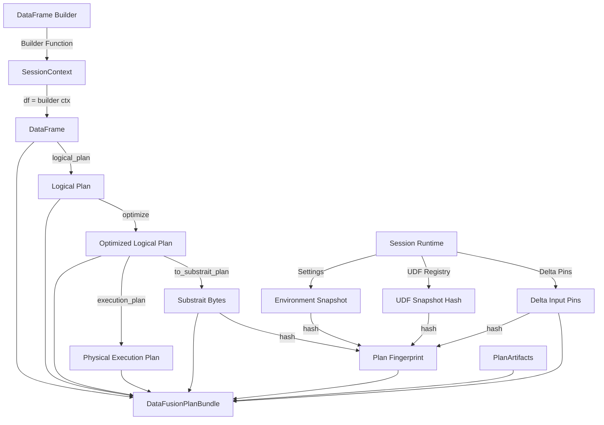
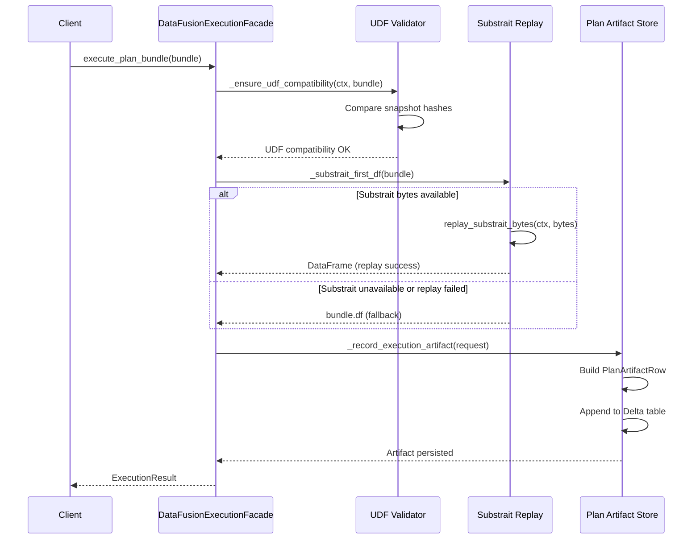
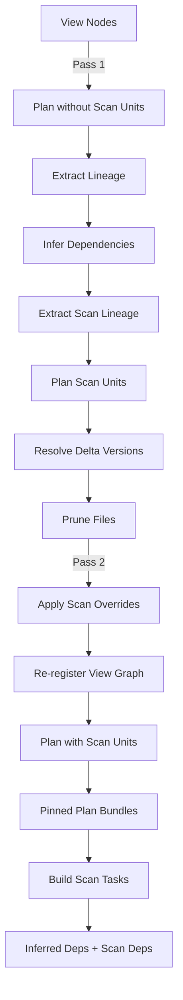

# Part III: DataFusion Engine - Core Planning and Execution

## Overview

The DataFusion Engine provides the primary query planning and execution infrastructure for CodeAnatomy's inference pipeline. Built on Apache Arrow DataFusion (v50.1+), it serves as the bridge between high-level relational specifications and efficient, deterministic query execution over Arrow-native data.

**Why DataFusion?** DataFusion is an Apache Arrow-native SQL query engine written in Rust that provides Volcano-style query planning, rule-based optimization, and vectorized execution over Arrow record batches. CodeAnatomy leverages DataFusion for several critical capabilities:

1. **Plan Stability**: DataFusion's logical/optimized/physical plan separation enables deterministic fingerprinting via Substrait serialization
2. **Extension Points**: Rust UDF registration, custom ExprPlanners, and FunctionFactory hooks enable domain-specific query transformations
3. **Schema Evolution**: Native support for schema drift through TableProvider adapters eliminates downstream projection complexity
4. **Delta Lake Integration**: First-class support for versioned Delta tables with CDF (Change Data Feed) and time-travel capabilities

**Integration Architecture**: The DataFusion engine sits at Layer 3 of the four-stage pipeline (Extraction → Normalization → Task Catalog → CPG Build). Task specifications from `src/relspec/` compile to DataFusion DataFrames via builder functions. The engine captures plan bundles containing logical, optimized, and physical plans plus Substrait bytes for reproducibility. These bundles feed into Hamilton DAG orchestration and drive downstream CPG materialization.

> **Module Consolidation Note:** The DataFusion engine consolidates functionality that was previously spread across separate modules. Lineage extraction, SQL analysis, and expression building are now DataFusion-native operations. The engine provides unified query planning, UDF registration, schema validation, and plan fingerprinting through a single cohesive interface.

## Core Architecture Components

### Plan Bundle - The Central Artifact

**File**: `/home/paul/CodeAnatomy/src/datafusion_engine/plan_bundle.py` (lines 1-1906)

The `DataFusionPlanBundle` dataclass (lines 134-218) is the canonical plan artifact that all scheduling and execution paths consume. It encapsulates the complete planning lifecycle:

```python
@dataclass(frozen=True)
class DataFusionPlanBundle:
    df: DataFrame                           # DataFusion DataFrame
    logical_plan: object                    # Unoptimized logical plan
    optimized_logical_plan: object          # Post-optimization logical plan
    execution_plan: object | None           # Physical execution plan
    substrait_bytes: bytes | None           # Substrait serialization
    plan_fingerprint: str                   # SHA-256 digest for caching
    artifacts: PlanArtifacts                # Serializable metadata
    delta_inputs: tuple[DeltaInputPin, ...] # Pinned Delta versions
    required_udfs: tuple[str, ...]          # UDF dependencies
    required_rewrite_tags: tuple[str, ...]  # Rewrite rule tags
    plan_details: Mapping[str, object]      # Diagnostics payload
```

**Design Invariant**: The `plan_fingerprint` (line 164) is a stable hash computed from:
- Substrait bytes (serialized optimized plan)
- Session configuration settings
- Planning environment hash (DataFusion version, optimizer rules)
- UDF snapshot hash (registered functions and their signatures)
- Required UDFs and rewrite tags
- Delta input pins (dataset versions)
- Delta store policy hash

This fingerprint enables deterministic caching and cross-run comparison. The computation happens in `_hash_plan()` (lines 1264-1319), which validates Substrait bytes availability before hashing.

**Key Mechanism - Plan Fingerprinting**:

1. **Substrait Serialization** (lines 1084-1110): The optimized logical plan is converted to Substrait bytes via `SubstraitProducer.to_substrait_plan()`. Substrait is a cross-platform IR (intermediate representation) that provides stable serialization independent of DataFusion's internal plan node representation.

2. **Environment Capture** (lines 488-521): The planning environment includes DataFusion version, session config, SQL policies, execution settings (target partitions, batch size), async UDF configuration, and Delta protocol support. This snapshot ensures the fingerprint reflects all factors that influence plan generation.

3. **Delta Input Pinning** (lines 78-93, 220-280): The `DeltaInputPin` dataclass captures dataset version, timestamp, feature gates, protocol compatibility, and storage options. This enables time-travel queries and reproducible scans across Delta table versions.

4. **UDF Dependency Tracking** (lines 1883-1896): The `_required_udf_artifacts()` function extracts UDF references from the optimized plan via lineage analysis. It validates that required UDFs exist in the snapshot and captures rewrite tags for schema transformation rules.

**Plan Artifacts** (lines 47-76): The `PlanArtifacts` dataclass contains all serializable metadata for reproducibility:
- Explain outputs (tree, verbose, analyze)
- Environment snapshots (settings, planning env, rulepack, information_schema)
- Substrait validation results
- Proto-serialized plans (logical, optimized, execution)
- UDF snapshots and function registry
- Rewrite tags and domain planner names

This separation enables artifact persistence to Delta tables (see Plan Artifact Store below) independent of the ephemeral DataFrame/plan objects.

### Session Runtime

**File**: `/home/paul/CodeAnatomy/src/datafusion_engine/runtime.py` (not shown in extracts, but referenced throughout)

The `SessionRuntime` class manages the lifecycle of a DataFusion `SessionContext` with profile-driven configuration. It encapsulates:

- **DataFusion SessionContext**: The core query engine instance
- **Runtime Profile**: Configuration object containing dataset locations, optimizer settings, UDF policies, Delta protocol support
- **UDF Snapshot**: Cached registry of Rust UDFs with signatures and metadata
- **Settings Hash**: Stable digest of session configuration for fingerprinting
- **Rewrite Tags**: Metadata tags for schema transformation rules

**Configuration Options** (referenced in `plan_bundle.py:544-611`):
- `target_partitions`: Parallelism for execution
- `batch_size`: Arrow record batch size
- `repartition_aggregations/windows/file_scans`: Repartitioning policies
- `enable_async_udfs`: Async UDF support with timeout and batch size
- `delta_protocol_mode`: Delta protocol compatibility level
- `explain_verbose/analyze`: Explain capture settings

The runtime profile is initialized during facade construction and remains immutable throughout the session lifecycle.

### Execution Facade

**File**: `/home/paul/CodeAnatomy/src/datafusion_engine/execution_facade.py` (lines 1-768)

The `DataFusionExecutionFacade` (lines 268-760) provides the unified API for compilation, execution, registration, and writes. It coordinates all DataFusion operations through a consistent interface.

**Key Methods**:

1. **`compile_to_bundle()`** (lines 379-425): Compiles a DataFrame builder function to a `DataFusionPlanBundle`. This is the canonical compilation path:
   - Invokes builder with SessionContext to generate DataFrame
   - Calls `build_plan_bundle()` with session runtime and scan units
   - Returns plan bundle ready for execution or scheduling

2. **`execute_plan_bundle()`** (lines 427-492): Executes a plan bundle with Substrait-first replay:
   - Validates UDF compatibility between planning and execution contexts
   - Attempts Substrait replay via `replay_substrait_bytes()`
   - Falls back to original DataFrame on replay failure
   - Records execution artifacts (duration, status, errors)
   - Returns `ExecutionResult` wrapper

3. **`register_dataset()`** (lines 660-699): Registers a dataset location via the registry bridge:
   - Validates runtime profile availability
   - Delegates to `register_dataset_df()` from `registry_bridge.py`
   - Returns DataFusion DataFrame representing the registered dataset

4. **`write()` / `write_view()`** (lines 591-633): Delegates to `WritePipeline` for write operations:
   - Constructs pipeline with session context and SQL options
   - Executes write request (table, view, streaming)
   - Returns `ExecutionResult` wrapping write metadata

**Error Handling Pattern** (lines 454-492): The facade captures exceptions during execution and records them as artifacts via `_record_execution_artifact()`. This enables post-mortem analysis of planning vs execution failures.

**Substrait-First Execution** (lines 532-553): The `_substrait_first_df()` method prioritizes Substrait replay for determinism:
```python
if bundle.substrait_bytes is None:
    return bundle.df, True  # Fallback to original DataFrame
try:
    df = replay_substrait_bytes(self.ctx, bundle.substrait_bytes)
except (RuntimeError, TypeError, ValueError):
    return bundle.df, True  # Fallback on replay error
else:
    return df, False  # Successful Substrait replay
```

This pattern ensures that plans are executed from their serialized Substrait representation rather than the ephemeral DataFrame object, eliminating in-memory plan drift.

### Planning Pipeline - Delta Pin Two-Pass Planner

**File**: `/home/paul/CodeAnatomy/src/datafusion_engine/planning_pipeline.py` (lines 1-285)

The `plan_with_delta_pins()` function (lines 55-126) implements a two-pass planning strategy that pins Delta input versions before final plan compilation:

**Pass 1 - Baseline Planning** (lines 78-87):
1. Register UDF platform and view graph
2. Plan view nodes without scan units to extract lineage
3. Infer dependencies from view nodes via `infer_deps_from_view_nodes()`
4. Extract scan lineage (dataset references, projected columns, filters)

**Pass 2 - Pinned Planning** (lines 88-111):
1. Plan scan units with Delta version resolution via `plan_scan_units()`
2. Apply scan unit overrides (Delta version pins, file pruning)
3. Re-register view graph with pinned scan providers
4. Re-plan view nodes with scan units included in `PlanBundleOptions`

**Why Two Passes?** Delta scan planning requires lineage information (which tables, which columns) to determine file pruning and version selection. The first pass extracts this lineage from unresolved plans. The second pass re-plans with Delta providers that enforce version pins and file-level pruning, ensuring deterministic scan inputs.

**Scan Planning** (lines 129-162): The `_scan_planning()` function:
- Groups scans by task name from inferred dependencies
- Calls `plan_scan_units()` to resolve Delta versions and prune files
- Builds scan task name mappings (stable digest-based names)
- Creates scan task units for scheduling (scan units become schedulable tasks)

**Lineage Extraction** (lines 269-281): After pinned planning, `_lineage_by_view()` extracts column-level lineage from optimized logical plans via `extract_lineage()`. This feeds into scheduling edge validation.

### Lineage Extraction

**File**: `/home/paul/CodeAnatomy/src/datafusion_engine/lineage_datafusion.py` (lines 1-300)

The `extract_lineage()` function (lines 111-152) walks the DataFusion logical plan tree and extracts structured lineage information:

**LineageReport Components** (lines 80-109):
- **scans**: `ScanLineage` entries with dataset name, projected columns, pushed filters
- **joins**: `JoinLineage` entries with join type, left/right keys
- **exprs**: `ExprInfo` entries with expression kind, referenced columns, referenced UDFs
- **required_udfs**: Tuple of UDF names referenced in the plan
- **required_rewrite_tags**: Tuple of rewrite rule tags required for execution
- **required_columns_by_dataset**: Mapping of dataset → columns for dependency analysis
- **filters/aggregations/window_functions**: Extracted from expression metadata

**Extraction Mechanism** (lines 127-132):
```python
for node in walk_logical_complete(plan):
    variant = _plan_variant(node)
    tag = _variant_name(node=node, variant=variant)
    scans.extend(_extract_scan_lineage(tag=tag, variant=variant))
    joins.extend(_extract_join_lineage(tag=tag, variant=variant))
    exprs.extend(_extract_expr_infos(tag=tag, variant=variant, udf_name_map=udf_name_map))
```

The plan walk (via `walk_logical_complete()` from `plan_walk.py`) visits every node in the logical plan tree. Each node is converted to its variant (e.g., `TableScan`, `Join`, `Projection`) for pattern matching.

**Scan Lineage** (lines 233-248): For `TableScan` variants:
- Extract `table_name` or `fqn` (fully qualified name)
- Extract `projection` as column names
- Extract `filters` as pushed-down predicates
- Return `ScanLineage(dataset_name, projected_columns, pushed_filters)`

**Join Lineage** (lines 251-267): For `Join` variants:
- Extract `join_type` (inner, left, right, full, cross)
- Extract `on` pairs as (left_expr, right_expr) tuples
- Extract qualified column names from expressions
- Return `JoinLineage(join_type, left_keys, right_keys)`

**Expression Info** (lines 278-292): For plan nodes with expression attributes:
- Extract expressions from node attributes (e.g., `Projection.projections`, `Filter.predicate`)
- Recursively walk expression trees to find column references and UDF calls
- Return `ExprInfo(kind, referenced_columns, referenced_udfs, text)`

**UDF Dependency Resolution** (lines 134-135): The lineage report includes `required_udfs` extracted from expression UDF references, and `required_rewrite_tags` resolved from the UDF snapshot's rewrite tag index. This enables scheduling to validate UDF availability before execution.

### Schema Contracts

**File**: `/home/paul/CodeAnatomy/src/datafusion_engine/schema_contracts.py` (lines 1-615)

Schema contracts provide declarative schema validation and evolution policies. They enable compile-time detection of schema drift and DDL generation.

**SchemaContract** (lines 167-398): Core contract abstraction:
```python
@dataclass(frozen=True)
class SchemaContract:
    table_name: str
    columns: tuple[ColumnContract, ...]
    partition_cols: tuple[str, ...]
    ordering: tuple[str, ...]
    evolution_policy: EvolutionPolicy
    schema_metadata: dict[bytes, bytes]
    enforce_columns: bool
```

**Evolution Policies** (lines 99-104):
- `STRICT`: No schema changes allowed (fails on missing/extra columns)
- `ADDITIVE`: New columns allowed, removals fail
- `RELAXED`: Any compatible change allowed

**Validation Mechanism** (lines 250-334): The `validate_against_introspection()` method:
1. Checks table existence in introspection snapshot
2. Retrieves actual column definitions from catalog
3. Compares expected vs actual for each column:
   - Missing columns → `MISSING_COLUMN` violation
   - Type mismatches → `TYPE_MISMATCH` violation (via `_types_compatible()`)
   - Nullability mismatches → `NULLABILITY_MISMATCH` violation
4. Under `STRICT` policy, extra columns → `EXTRA_COLUMN` violation

**Arrow Schema Interop** (lines 198-248):
- `from_arrow_schema()`: Creates contract from PyArrow schema, stamping ABI fingerprint in metadata
- `to_arrow_schema()`: Converts contract to PyArrow schema with preserved metadata
- `schema_from_catalog()`: Retrieves Arrow schema from DataFusion catalog for comparison

**Schema ABI Fingerprinting** (lines 23, 225-228): The `SCHEMA_ABI_FINGERPRINT_META` metadata key stores a stable digest of the schema structure via `schema_fingerprint()`. This enables change detection across schema versions and validates that execution-time schemas match planning-time expectations.

### UDF System

**File**: `/home/paul/CodeAnatomy/src/datafusion_engine/udf_catalog.py` (lines 1-300+)

The UDF catalog manages Rust UDF registration and metadata extraction via the `datafusion_ext` Rust extension module.

**DataFusionUdfSpec** (lines 40-70): Specification for UDF registration:
```python
@dataclass(frozen=True)
class DataFusionUdfSpec:
    func_id: str                    # Unique function identifier
    engine_name: str                # DataFusion registration name
    kind: Literal["scalar", "aggregate", "window", "table"]
    input_types: tuple[pa.DataType, ...]
    return_type: pa.DataType
    state_type: pa.DataType | None  # For aggregate functions
    volatility: str                 # immutable/stable/volatile
    arg_names: tuple[str, ...] | None
    rewrite_tags: tuple[str, ...]   # Schema transformation tags
```

**Function Catalog** (lines 212-276): Runtime function catalog built from `information_schema`:
- `from_information_schema()`: Constructs catalog from routines/parameters snapshots
- `function_names`: Frozenset of all registered function names
- `functions_by_category`: Mapping of category → function names
- `function_signatures`: Mapping of name → `FunctionSignature` with input/return types

**File**: `/home/paul/CodeAnatomy/src/datafusion_engine/udf_runtime.py` (lines 1-300+)

UDF runtime manages snapshot caching and validation.

**Snapshot Structure** (lines 24-33): Required snapshot keys:
```python
_REQUIRED_SNAPSHOT_KEYS = (
    "scalar", "aggregate", "window", "table",  # UDF categories
    "aliases", "parameter_names",               # Metadata
    "signature_inputs", "return_types",         # Type info
)
```

**Snapshot Validation** (lines 132-158): The `validate_rust_udf_snapshot()` function:
1. Checks for required keys in snapshot mapping
2. Validates sequence fields (scalar, aggregate, window, table)
3. Validates mapping fields (aliases, parameter_names, signature_inputs, return_types)
4. Ensures signature metadata exists for all registered UDFs

**Required UDF Validation** (lines 161-196): The `validate_required_udfs()` function:
1. Extracts UDF names from snapshot via `_snapshot_names()`
2. Checks that all required UDFs exist in the snapshot
3. Resolves aliases to canonical names via `_alias_to_canonical()`
4. Validates signature metadata presence for required UDFs
5. Validates return type metadata presence for required UDFs

**Snapshot Hash** (lines 297+): The `rust_udf_snapshot_hash()` function computes a stable SHA-256 digest of the normalized snapshot. This hash is used in plan fingerprinting to detect UDF registry changes.

**Caching Strategy** (lines 15-22, 223-253): The runtime maintains weak references to SessionContext instances and caches snapshots per context:
```python
_RUST_UDF_CONTEXTS: WeakSet[SessionContext] = WeakSet()
_RUST_UDF_SNAPSHOTS: WeakKeyDictionary[SessionContext, Mapping[str, object]] = WeakKeyDictionary()
_RUST_UDF_VALIDATED: WeakSet[SessionContext] = WeakSet()
```

This ensures validation runs once per context and snapshots persist for the session lifecycle without preventing garbage collection.

### Rust UDF Platform

**File**: `/home/paul/CodeAnatomy/src/datafusion_engine/udf_platform.py`

The Rust UDF Platform provides a unified installation mechanism for planning-critical extensions. Planner extensions (Rust UDFs, ExprPlanners, FunctionFactory, and RelationPlanners) are installed before any plan-bundle construction to ensure deterministic query planning.

**RustUdfPlatformOptions** (lines 79-93):
```python
@dataclass(frozen=True)
class RustUdfPlatformOptions:
    """Configuration for installing the Rust UDF platform."""

    enable_udfs: bool = True
    enable_async_udfs: bool = False
    async_udf_timeout_ms: int | None = None
    async_udf_batch_size: int | None = None
    enable_function_factory: bool = True
    enable_expr_planners: bool = True
    function_factory_policy: FunctionFactoryPolicy | None = None
    function_factory_hook: Callable[[SessionContext], None] | None = None
    expr_planner_hook: Callable[[SessionContext], None] | None = None
    expr_planner_names: Sequence[str] = ()
    strict: bool = True
```

**Platform Installation Pattern**:
```python
from datafusion_engine.runtime import DataFusionRuntimeProfile
from datafusion_engine.udf_platform import (
    RustUdfPlatformOptions,
    install_rust_udf_platform,
)

ctx = DataFusionRuntimeProfile().session_context()
options = RustUdfPlatformOptions(
    enable_udfs=True,
    enable_function_factory=True,
    enable_expr_planners=True,
    expr_planner_names=("codeanatomy_domain",),
    strict=True,
)
install_rust_udf_platform(ctx, options=options)
```

**Platform Components**:
- **Rust UDFs**: Scalar, aggregate, window, and table functions implemented in `datafusion_ext`
- **FunctionFactory**: Dynamic function resolution for unknown function calls during planning
- **ExprPlanners**: Custom expression rewrite rules (e.g., domain-specific transformations)
- **TableProviderCapsule**: PyCapsule-based integration for custom table providers

**RustUdfPlatform Snapshot** (lines 64-76):
```python
@dataclass(frozen=True)
class RustUdfPlatform:
    """Snapshot of a Rust UDF platform installation."""

    snapshot: Mapping[str, object] | None
    snapshot_hash: str | None
    rewrite_tags: tuple[str, ...]
    domain_planner_names: tuple[str, ...]
    docs: Mapping[str, object] | None
    function_factory: ExtensionInstallStatus | None
    expr_planners: ExtensionInstallStatus | None
    function_factory_policy: Mapping[str, object] | None
    expr_planner_policy: Mapping[str, object] | None
```

All DataFusion execution facades automatically install the platform in `__post_init__` to ensure extensions are available before plan operations. The platform snapshot is captured in plan bundles for reproducibility.

## Key Data Flow Patterns

### Plan Bundle Lifecycle



**Explanation**:
1. A DataFrame builder function receives a SessionContext
2. Builder generates a DataFrame by registering tables and composing operations
3. DataFusion extracts logical plan, optimizes it, and optionally generates physical plan
4. Optimized plan is serialized to Substrait bytes for portable fingerprinting
5. Environment snapshot, UDF snapshot hash, and Delta pins contribute to fingerprint
6. Plan bundle assembles all components for execution and scheduling

### Execution Flow



**Explanation**:
1. Client invokes `execute_plan_bundle()` with a compiled plan bundle
2. Facade validates UDF compatibility between planning and execution contexts
3. Facade attempts Substrait replay for deterministic execution
4. On replay failure, facade falls back to original DataFrame
5. Facade records execution artifact (duration, status, error) to Delta store
6. Facade returns `ExecutionResult` wrapper with DataFrame

### Two-Pass Delta Pin Planning



**Explanation**:
1. Pass 1 plans views without scan units to extract lineage (dataset references)
2. Lineage drives scan unit planning with Delta version resolution and file pruning
3. Scan units become scan task specifications for scheduling
4. Pass 2 re-plans views with scan units included in bundle options
5. Final plan bundles have pinned Delta versions in `delta_inputs` field
6. Scan tasks are added to inferred dependency graph for scheduling

## Design Patterns

### Determinism Contract Enforcement

Every plan bundle must satisfy the determinism contract:
- **Substrait bytes required**: Fingerprinting fails if Substrait serialization unavailable
- **Environment snapshot captured**: All optimizer rules, settings, and UDF metadata recorded
- **Delta inputs pinned**: Dataset versions locked to specific snapshots
- **UDF snapshot hash validated**: Execution context must match planning context

The `build_plan_bundle()` function (lines 314-372 in `plan_bundle.py`) enforces these requirements:
```python
if not resolved.compute_substrait:
    msg = "Substrait bytes are required for plan bundle construction."
    raise ValueError(msg)
if resolved.session_runtime is None:
    msg = "SessionRuntime is required for plan bundle construction."
    raise ValueError(msg)
```

### Graceful Degradation for Missing Inputs

When optional inputs are unavailable, the system produces correct-schema empty outputs rather than exceptions:
- No scans → empty `scan_units` tuple
- No UDFs referenced → empty `required_udfs` tuple
- Substrait replay failure → fallback to original DataFrame with diagnostics

This pattern prevents cascading failures in the pipeline and enables partial execution.

### Weak Reference Caching

UDF snapshots and session metadata are cached using weak references:
```python
_RUST_UDF_SNAPSHOTS: WeakKeyDictionary[SessionContext, Mapping[str, object]]
```

This prevents memory leaks while maintaining per-session caching. When the SessionContext is garbage collected, the snapshot cache entry is automatically removed.

### Immutable Data Structures

All plan bundle components use frozen dataclasses:
```python
@dataclass(frozen=True)
class DataFusionPlanBundle: ...

@dataclass(frozen=True)
class PlanArtifacts: ...

@dataclass(frozen=True)
class DeltaInputPin: ...
```

This prevents accidental mutation and enables safe sharing across threads and processes.

## Critical Files Reference

### Plan Bundle System
- **`plan_bundle.py`** (1906 lines): Core plan artifact with fingerprinting logic
  - `build_plan_bundle()` (lines 314-372): Main entrypoint for plan compilation
  - `_hash_plan()` (lines 1264-1319): Fingerprint computation from Substrait + environment
  - `_plan_artifacts_from_components()` (lines 836-886): Assembles serializable artifacts
  - `_delta_inputs_from_scan_units()` (lines 220-280): Derives Delta pins from scan lineage

### Execution Infrastructure
- **`execution_facade.py`** (768 lines): Unified API for compilation and execution
  - `compile_to_bundle()` (lines 379-425): DataFrame builder → plan bundle
  - `execute_plan_bundle()` (lines 427-492): Substrait-first execution with fallback
  - `_ensure_udf_compatibility()` (lines 59-84): Pre-execution UDF validation

- **`runtime.py`** (referenced but not shown): Session lifecycle management
  - `DataFusionRuntimeProfile`: Configuration container
  - `SessionRuntime`: Session + profile + cached snapshots

### Planning Pipeline
- **`planning_pipeline.py`** (285 lines): Two-pass Delta pin planning
  - `plan_with_delta_pins()` (lines 55-126): Main orchestration function
  - `_scan_planning()` (lines 129-162): Scan unit resolution and task generation
  - `_plan_view_nodes()` (lines 165-191): View-level planning with scan units

### Lineage and Dependency Analysis
- **`lineage_datafusion.py`** (300+ lines): Plan tree lineage extraction
  - `extract_lineage()` (lines 111-152): Main extraction function
  - `_extract_scan_lineage()` (lines 233-248): Table scan → dataset references
  - `_extract_join_lineage()` (lines 251-267): Join → key pairs
  - `_required_columns_by_dataset()` (referenced): Column-level dependency map

### Schema and Contracts
- **`schema_contracts.py`** (615 lines): Declarative schema validation
  - `SchemaContract` (lines 167-398): Contract with evolution policies
  - `validate_against_introspection()` (lines 250-334): Snapshot validation
  - `schema_contract_from_dataset_spec()` (lines 527-566): Spec → contract bridge

### UDF Platform
- **`udf_catalog.py`** (300+ lines): UDF metadata and builtin resolution
  - `DataFusionUdfSpec` (lines 40-70): UDF registration spec
  - `FunctionCatalog` (lines 212-276): Runtime function catalog

- **`udf_runtime.py`** (300+ lines): Snapshot caching and validation
  - `rust_udf_snapshot()` (lines 223-253): Cached snapshot retrieval
  - `validate_rust_udf_snapshot()` (lines 132-158): Structural validation
  - `validate_required_udfs()` (lines 161-196): Dependency validation
  - `rust_udf_snapshot_hash()` (referenced): Stable digest computation

### Scan Planning and Delta Integration
- **`scan_planner.py`** (200+ lines shown): Delta-aware scan planning
  - `plan_scan_unit()` (lines 148-200): Single scan unit resolution
  - `_scan_unit_key()` (lines 72-92): Stable key generation with version pins
  - Delta version resolution and file pruning (referenced but not shown)

### Registry and Dataset Management
- **`registry_bridge.py`** (200+ lines shown): Dataset registration bridge
  - Dataset registration utilities (register_listing_table, register_object_store, DDL)
  - Schema discovery and validation via DataFusion catalog
  - Write routing to `WritePipeline`

### Plan Artifact Persistence
- **`plan_artifact_store.py`** (200+ lines shown): Delta-backed artifact store
  - `PlanArtifactRow` (lines 51-150): Serializable artifact row
  - Event-time partitioned Delta tables for artifact persistence
  - Determinism validation via artifact replay

## Extension Points

The DataFusion engine exposes several extension mechanisms:

1. **Custom UDFs**: Register Rust UDFs via `datafusion_ext` module with signature metadata
2. **ExprPlanners**: Custom expression rewrite rules via `expr_planner_hook` in runtime profile
3. **FunctionFactory**: Dynamic function resolution via `function_factory_hook`
4. **Domain Planners**: Domain-specific query transformations with rewrite tags
5. **TableProviders**: Custom scan implementations via `TableProviderCapsule`
6. **Schema Adapters**: Schema evolution adapters attached at registration time

These extension points enable domain-specific optimizations without modifying core DataFusion logic.

## Performance Characteristics

**Plan Compilation**: O(N) in plan node count for logical → optimized → physical transformation. Substrait serialization adds ~10-50ms overhead depending on plan complexity.

**Fingerprint Computation**: O(1) for hash computation given Substrait bytes. Environment snapshot hashing is amortized O(1) via caching.

**Lineage Extraction**: O(N) in plan node count for tree walk. Expression recursion depth is bounded by query complexity.

**Substrait Replay**: O(N) in plan node count for deserialization. Replay overhead is ~5-20ms compared to native DataFrame execution.

**Artifact Persistence**: O(M) in artifact size for Delta write. Batch writes minimize overhead. Partitioned by event time for efficient pruning.

**Bottlenecks**:
- Large plan trees (>1000 nodes) can slow Substrait serialization
- Deep expression nesting (>50 levels) can impact lineage extraction
- High UDF counts (>100) can increase snapshot hash computation time

## Future Enhancements

The DataFusion engine architecture enables several planned improvements:

1. **Incremental View Maintenance**: Leverage Delta CDF for efficient view updates
2. **Plan Caching**: Store Substrait bytes in artifact store for cross-session reuse
3. **Adaptive Execution**: Use explain analyze metrics to guide runtime re-optimization
4. **Schema Versioning**: Extend contracts with migration rules for automated schema evolution
5. **UDF Versioning**: Track UDF implementation versions via snapshot metadata
6. **Cross-Engine Replay**: Use Substrait for execution on alternative Arrow engines (e.g., Velox, Acero)
