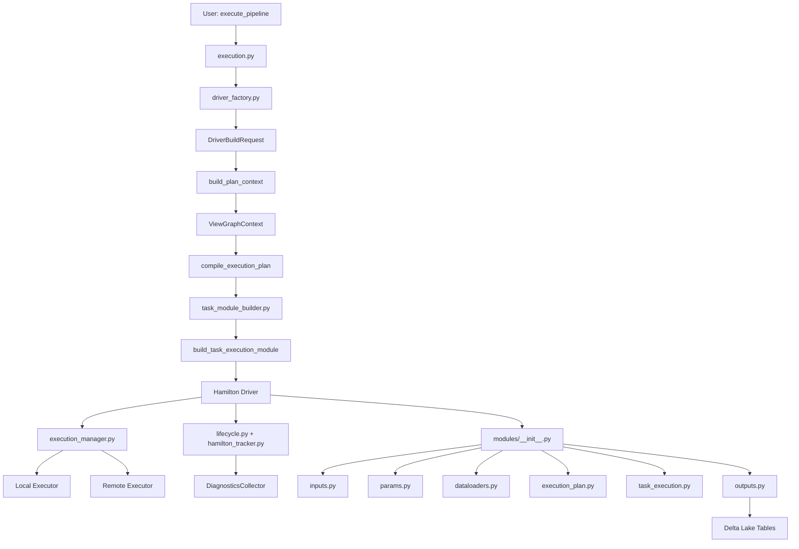
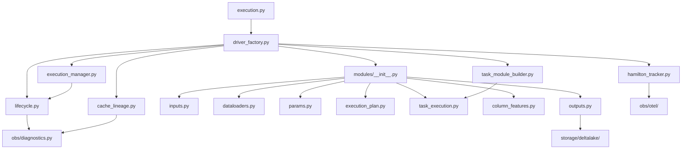
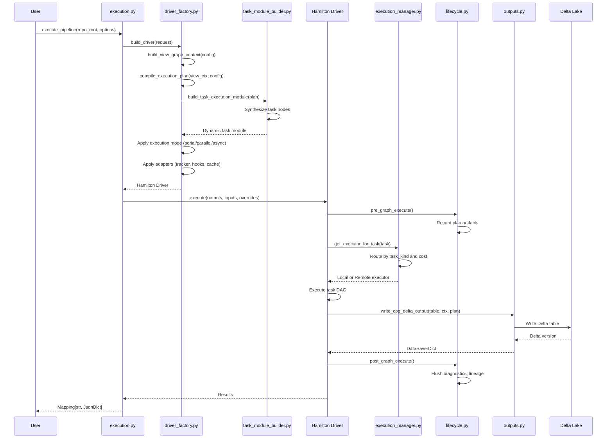

# Hamilton Pipeline Architecture

## Overview

The Hamilton pipeline subsystem (`src/hamilton_pipeline/`) orchestrates CodeAnatomy's multi-stage CPG construction workflow using the Hamilton DAG framework. Hamilton provides declarative dataflow orchestration with built-in caching, parallel execution, and observability. CodeAnatomy extends Hamilton with plan-aware dynamic execution, inference-driven dependency resolution, and deep integration with DataFusion query planning.

**Key responsibilities:**

- **Driver Factory** - Builds and caches Hamilton Driver instances configured for execution modes (serial, parallel, async)
- **Task Module Builder** - Synthesizes Hamilton DAG nodes dynamically from ExecutionPlan task graphs
- **Execution Manager** - Routes tasks to local vs. remote executors based on cost thresholds and task kind
- **Lifecycle Hooks** - Captures diagnostics, lineage, and telemetry throughout graph execution
- **Module Registry** - Provides 7 Hamilton modules spanning inputs, params, dataloaders, execution_plan, task_execution, column_features, and outputs

The pipeline compiles a TaskGraph (from `relspec/`) into a Hamilton DAG, executes tasks in dependency order, materializes CPG artifacts to Delta Lake, and generates run manifests for lineage tracking.

---

## Architecture Summary



**Execution Flow:**

1. `execute_pipeline()` resolves configuration and builds a `DriverBuildRequest`
2. `build_driver()` compiles a ViewGraphContext → ExecutionPlan → task modules → Hamilton Driver
3. Driver executes Hamilton DAG with dynamic execution hooks
4. `PlanExecutionManager` routes tasks to local/remote executors based on task kind and cost
5. Lifecycle hooks capture diagnostics, lineage, and OpenTelemetry spans
6. Outputs materialize CPG artifacts to Delta Lake and generate run manifests

---

## Driver Factory

**Module:** `driver_factory.py`

### Purpose

Constructs Hamilton Driver instances with plan-aware caching, execution mode routing, and observability integration. Drivers are built from:

- **ViewGraphContext** - DataFusion runtime profile, session context, view nodes
- **ExecutionPlan** - Active tasks, dependency graph, schedule metadata
- **ExecutionMode** - `DETERMINISTIC_SERIAL`, `PLAN_PARALLEL`, `PLAN_PARALLEL_REMOTE`
- **ExecutorConfig** - Threadpool/multiprocessing/Ray/Dask executor settings
- **GraphAdapterConfig** - Optional Hamilton graph adapters (FutureAdapter, RayGraphAdapter, DaskGraphAdapter)

### Module Loading Strategies

Default modules are loaded via `default_modules()`:

```python
def default_modules() -> list[ModuleType]:
    return hamilton_modules.load_all_modules()
```

Loads 7 modules in order:

1. **inputs.py** - Runtime profile, session, diagnostics collector, config bundles
2. **dataloaders.py** - Repo scan, extract layers, normalize outputs
3. **params.py** - Parameter bundles, param table registry, Delta materialization
4. **execution_plan.py** - ExecutionPlan node, plan artifacts, validation reports
5. **task_execution.py** - Task execution dispatcher
6. **column_features.py** - Column-level feature extraction
7. **outputs.py** - CPG output materialization, run manifests

**Dynamic modules** are appended during driver construction:

```python
modules.append(build_execution_plan_module(resolved_plan))
modules.append(build_task_execution_module(plan, options))
```

### Driver Configuration

Configuration fingerprinting ensures cache invalidation when config changes:

```python
def driver_config_fingerprint(config: Mapping[str, JsonValue]) -> str:
    payload = {"version": 1, "config": dict(config)}
    return hash_config_fingerprint(payload)
```

Plan-aware cache keys incorporate plan signature:

```python
def driver_cache_key(
    config: Mapping[str, JsonValue],
    *,
    plan_signature: str,
    execution_mode: ExecutionMode,
    executor_config: ExecutorConfig | None,
    graph_adapter_config: GraphAdapterConfig | None,
) -> str:
    payload = {
        "version": 3,
        "plan_signature": plan_signature,
        "execution_mode": execution_mode.value,
        "executor_config": _executor_config_payload(executor_config),
        "graph_adapter_config": _graph_adapter_config_payload(adapter_config),
        "config": dict(config),
    }
    return hash_json_canonical(payload, str_keys=True)
```

### Extension Points

**Tracker Adapters** - Hamilton UI integration:

```python
def _maybe_build_tracker_adapter(
    config: Mapping[str, JsonValue],
    *,
    profile_spec: RuntimeProfileSpec,
) -> lifecycle_base.LifecycleAdapter | None:
    if not bool(config.get("enable_hamilton_tracker", False)):
        return None
    tracker = CodeAnatomyHamiltonTracker(
        project_id=project_id,
        username=username,
        dag_name=dag_name,
        tags=tags,
        run_tag_provider=_run_tag_provider(config, profile_spec=profile_spec),
    )
    return tracker
```

**Cache Configuration**:

```python
def _apply_cache(
    builder: driver.Builder,
    *,
    config: Mapping[str, JsonValue],
) -> driver.Builder:
    cache_path = _cache_path_from_config(config)
    if cache_path is None:
        return builder
    metadata_store = SQLiteMetadataStore(path=str(base_path / "meta.sqlite"))
    result_store = FileResultStore(path=str(results_path))
    profile = _cache_policy_profile(config)
    return builder.with_cache(
        path=str(base_path),
        metadata_store=metadata_store,
        result_store=result_store,
        default_behavior=profile.default_behavior,
        default_loader_behavior=profile.default_loader_behavior,
        default_saver_behavior=profile.default_saver_behavior,
        log_to_file=profile.log_to_file,
    )
```

**Graph Adapters** - Ray/Dask/Threadpool parallelism:

```python
def _apply_graph_adapter(
    builder: driver.Builder,
    *,
    config: Mapping[str, JsonValue],
    executor_config: ExecutorConfig | None,
    adapter_config: GraphAdapterConfig | None,
) -> driver.Builder:
    resolved = adapter_config or _graph_adapter_config_from_config(config)
    if resolved is None:
        return builder
    adapter = _graph_adapter_from_config(resolved, executor_config=executor_config)
    return builder.with_adapter(adapter)
```

---

## Task Module Builder

**Module:** `task_module_builder.py`

### Dynamic DAG Generation from TaskGraph

Generates Hamilton function nodes for each task in the ExecutionPlan:

```python
def build_task_execution_module(
    *,
    plan: ExecutionPlan,
    options: TaskExecutionModuleOptions | None = None,
) -> ModuleType:
    resolved = options or TaskExecutionModuleOptions()
    module = ModuleType(resolved.module_name)
    sys.modules[resolved.module_name] = module
    all_names: list[str] = []
    module.__dict__["__all__"] = all_names
    plan_context = _PlanTaskContext.from_plan(plan)
    outputs = {node.name: node for node in plan.view_nodes}
    scan_units_by_task = dict(plan.scan_task_units_by_name)

    # Generate scan task nodes
    for scan_task_name in sorted(scan_units_by_task):
        scan_unit = scan_units_by_task[scan_task_name]
        task_spec = TaskNodeSpec(
            name=scan_task_name,
            output=scan_task_name,
            kind="scan",
            priority=priority_for_task(scan_task_name),
            cache_policy="none",
        )
        task_node = _build_task_node(
            plan_context.build_context(
                task=task_spec,
                output_name=scan_task_name,
                dependency_key=scan_task_name,
                scan_unit_key=scan_unit.key,
            )
        )
        task_node.__module__ = resolved.module_name
        module.__dict__[scan_task_name] = task_node
        all_names.append(scan_task_name)

    # Generate view task nodes
    for output_name, view_node in outputs.items():
        spec = _task_spec_from_view_node(view_node)
        task_node = _build_task_node(
            plan_context.build_context(
                task=spec,
                output_name=output_name,
                dependency_key=output_name,
                scan_unit_key=None,
            )
        )
        task_node.__module__ = resolved.module_name
        module.__dict__[output_name] = task_node
        all_names.append(output_name)

    return module
```

### Function Synthesis Patterns

Each task node is a synthesized Hamilton function:

```python
def _build_task_node(context: TaskNodeContext) -> Callable[..., TableLike]:
    output_name = context.output_name

    def _execute_task(
        task_execution_inputs: task_execution.TaskExecutionInputs,
        dependencies: list[TableLike],
        plan_signature: str,
        task_spec: task_execution.TaskExecutionSpec,
    ) -> TableLike:
        return task_execution.execute_task_from_catalog(
            inputs=task_execution_inputs,
            dependencies=dependencies,
            plan_signature=plan_signature,
            spec=task_spec,
        )

    _execute_task.__name__ = output_name
    _execute_task.__qualname__ = output_name
    return _decorate_task_node(
        node_fn=_execute_task,
        context=context,
    )
```

### Type Annotation Generation

Decorators inject dependencies and tags:

```python
def _decorate_task_node(
    *,
    node_fn: Callable[..., TableLike],
    context: TaskNodeContext,
) -> Callable[..., TableLike]:
    task = context.task
    if task.cache_policy in {"session", "persistent"}:
        node_fn = cache(format="delta", behavior="default")(node_fn)

    dependency_sources = tuple(source(dep) for dep in sorted(set(context.dependencies)))
    task_spec = task_execution.TaskExecutionSpec(
        task_name=task.name,
        task_output=context.output_name,
        plan_fingerprint=context.plan_fingerprint,
        plan_task_signature=context.plan_task_signature,
        task_kind=task.kind,
        scan_unit_key=context.scan_unit_key,
    )

    if dependency_sources:
        inject_kwargs = {
            "dependencies": group(*dependency_sources),
            "plan_signature": source("plan_signature"),
            "task_spec": value(task_spec),
        }
        node_fn = inject(**inject_kwargs)(node_fn)
    else:
        inject_kwargs = {
            "dependencies": value(()),
            "plan_signature": source("plan_signature"),
            "task_spec": value(task_spec),
        }
        node_fn = inject(**inject_kwargs)(node_fn)

    # Attach rich metadata tags
    schedule_tags = {
        "schedule_index": str(context.schedule_metadata.schedule_index),
        "generation_index": str(context.schedule_metadata.generation_index),
        "generation_order": str(context.schedule_metadata.generation_order),
        "generation_size": str(context.schedule_metadata.generation_size),
    } if context.schedule_metadata is not None else {}

    return tag(
        layer="execution",
        artifact=context.output_name,
        kind="task",
        task_name=task.name,
        output=context.output_name,
        task_kind=task.kind,
        cache_policy=task.cache_policy,
        priority=str(task.priority),
        task_cost=str(context.task_cost),
        bottom_level_cost=str(context.bottom_level_cost),
        slack=str(context.slack),
        on_critical_path=str(context.on_critical_path),
        betweenness_centrality=str(context.betweenness_centrality),
        immediate_dominator=str(context.immediate_dominator or ""),
        bridge_edge_count=str(context.bridge_edge_count),
        is_bridge_task=str(context.bridge_edge_count > 0),
        is_articulation_task=str(context.is_articulation_task),
        plan_signature=context.plan_signature,
        plan_fingerprint=context.plan_fingerprint,
        plan_task_signature=context.plan_task_signature,
        **schedule_tags,
    )(node_fn)
```

**Tag payload includes:**

- **Task metadata** - `task_name`, `task_kind`, `task_output`, `cache_policy`
- **Schedule metadata** - `generation_index`, `generation_order`, `schedule_index`
- **Graph metrics** - `task_cost`, `bottom_level_cost`, `slack`, `on_critical_path`
- **Centrality metrics** - `betweenness_centrality`, `immediate_dominator`, `bridge_edge_count`
- **Plan fingerprints** - `plan_signature`, `plan_fingerprint`, `plan_task_signature`

---

## Execution Manager

**Module:** `execution_manager.py`

### Task Routing and Execution

Routes tasks to local vs. remote executors based on task kind and cost:

```python
class PlanExecutionManager(executors.ExecutionManager):
    """Route scan tasks to remote execution and keep view tasks local."""

    def __init__(
        self,
        *,
        local_executor: executors.TaskExecutor,
        remote_executor: executors.TaskExecutor,
        cost_threshold: float | None = None,
        diagnostics: DiagnosticsCollector | None = None,
    ) -> None:
        super().__init__([local_executor, remote_executor])
        self._local_executor = local_executor
        self._remote_executor = remote_executor
        self._cost_threshold = cost_threshold
        self._diagnostics = diagnostics

    def get_executor_for_task(
        self,
        task: executors.TaskImplementation,
    ) -> executors.TaskExecutor:
        tags = _task_tags(task)
        use_remote = _task_kind(tags) == "scan" or _is_high_cost(
            tags,
            threshold=self._cost_threshold,
        )
        executor = self._remote_executor if use_remote else self._local_executor
        if self._diagnostics is not None:
            payload = {
                "run_id": getattr(task, "run_id", None),
                "task_id": getattr(task, "task_id", None),
                "task_name": tags.get("task_name"),
                "task_kind": _task_kind(tags),
                "task_cost": _task_cost(tags),
                "cost_threshold": self._cost_threshold,
                "executor": "remote" if use_remote else "local",
                "event_time_unix_ms": int(time.time() * 1000),
            }
            self._diagnostics.record_events("hamilton_task_routing_v1", [payload])
        return executor
```

### Parallel Execution Handling

Dynamic execution is enabled via `_apply_dynamic_execution()`:

```python
def _apply_dynamic_execution(
    builder: driver.Builder,
    *,
    options: DynamicExecutionOptions,
) -> driver.Builder:
    if options.execution_mode == ExecutionMode.DETERMINISTIC_SERIAL:
        return builder

    resolved_config = options.executor_config or ExecutorConfig()
    local_executor = executors.SynchronousLocalTaskExecutor()
    remote_kind = resolved_config.remote_kind or resolved_config.kind
    remote_max_tasks = resolved_config.remote_max_tasks or resolved_config.max_tasks
    remote_executor = _executor_from_kind(
        remote_kind,
        max_tasks=remote_max_tasks,
        executor_config=resolved_config,
    )
    cost_threshold = (
        resolved_config.cost_threshold
        if options.execution_mode == ExecutionMode.PLAN_PARALLEL_REMOTE
        else None
    )
    execution_manager = PlanExecutionManager(
        local_executor=local_executor,
        remote_executor=remote_executor,
        cost_threshold=cost_threshold,
        diagnostics=options.diagnostics,
    )

    dynamic_builder = (
        builder.enable_dynamic_execution(allow_experimental_mode=True)
        .with_execution_manager(execution_manager)
        .with_grouping_strategy(plan_grouping_strategy(options.plan))
    )
    if enable_submission_hook:
        dynamic_builder = dynamic_builder.with_adapters(
            plan_task_submission_hook(options.plan, options.diagnostics)
        )
    if enable_grouping_hook:
        dynamic_builder = dynamic_builder.with_adapters(
            plan_task_grouping_hook(options.plan, options.diagnostics)
        )
    return dynamic_builder
```

### Error Propagation

Execution errors are captured via lifecycle hooks and diagnostics:

```python
try:
    results = driver_instance.execute(
        execution_outputs,
        inputs={"repo_root": str(repo_root_path)},
        overrides=execute_overrides,
    )
except Exception as exc:
    record_exception(span, exc)
    raise
```

---

## Execution Module

**Module:** `execution.py`

### Entry Points

Primary entry point for synchronous execution:

```python
def execute_pipeline(
    *,
    repo_root: PathLike,
    options: PipelineExecutionOptions | None = None,
) -> Mapping[str, JsonDict | None]:
    repo_root_path = ensure_path(repo_root).resolve()
    options = options or PipelineExecutionOptions()
    execute_overrides = _build_execute_overrides(
        repo_root_path=repo_root_path,
        options=options,
    )
    run_id = _resolve_run_id(execute_overrides)
    driver_instance = _resolve_driver_instance(options)
    (
        output_names,
        execution_outputs,
        materializer_ids,
        materialized_outputs,
    ) = _resolve_execution_outputs(options)
    execute_overrides.setdefault("materialized_outputs", materialized_outputs)

    tracer = get_tracer(SCOPE_PIPELINE)
    run_token = set_run_id(run_id)
    try:
        with tracer.start_as_current_span("pipeline.execute") as span:
            try:
                if options.use_materialize:
                    _materialized, results = driver_instance.materialize(
                        additional_vars=execution_outputs,
                        inputs={"repo_root": str(repo_root_path)},
                        overrides=execute_overrides,
                    )
                else:
                    results = driver_instance.execute(
                        execution_outputs,
                        inputs={"repo_root": str(repo_root_path)},
                        overrides=execute_overrides,
                    )
            except Exception as exc:
                record_exception(span, exc)
                raise
            set_span_attributes(span, {"codeanatomy.repo_root": str(repo_root_path)})
            results_map = cast("Mapping[str, JsonDict | None]", results)
            return {name: results_map.get(name) for name in output_names}
    finally:
        reset_run_id(run_token)
```

Async entry point:

```python
async def execute_pipeline_async(
    *,
    repo_root: PathLike,
    options: PipelineExecutionOptions | None = None,
) -> Mapping[str, JsonDict | None]:
    repo_root_path = ensure_path(repo_root).resolve()
    options = options or PipelineExecutionOptions()
    if options.use_materialize:
        msg = "Async driver does not support materialize(); use execute() instead."
        raise ValueError(msg)
    state = await _prepare_async_execution(repo_root_path, options)
    tracer = get_tracer(SCOPE_PIPELINE)
    run_id = _resolve_run_id(state.execute_overrides)
    run_token = set_run_id(run_id)
    try:
        with tracer.start_as_current_span("pipeline.execute") as span:
            try:
                current_context = otel_context.get_current()
                token = otel_context.attach(current_context)
                try:
                    async_output_names = _execution_output_names(
                        state.output_names,
                        state.materializer_ids,
                    )
                    result = await state.driver_instance.execute(
                        async_output_names,
                        inputs={"repo_root": str(state.repo_root_path)},
                        overrides=state.execute_overrides,
                    )
                finally:
                    otel_context.detach(token)
            except Exception as exc:
                record_exception(span, exc)
                raise
            set_span_attributes(span, {"codeanatomy.repo_root": str(state.repo_root_path)})
            results_map = cast("Mapping[str, JsonDict | None]", result)
            return {name: results_map.get(name) for name in state.output_names}
    finally:
        reset_run_id(run_token)
```

### Pipeline Orchestration

Default outputs:

```python
FULL_PIPELINE_OUTPUTS: tuple[str, ...] = (
    "write_cpg_nodes_delta",
    "write_cpg_nodes_quality_delta",
    "write_cpg_edges_delta",
    "write_cpg_props_delta",
    "write_cpg_props_map_delta",
    "write_cpg_edges_by_src_delta",
    "write_cpg_edges_by_dst_delta",
    "write_cpg_props_quality_delta",
    "write_normalize_outputs_delta",
    "write_extract_error_artifacts_delta",
    "write_run_manifest_delta",
    "write_run_bundle_dir",
)
```

---

## Hamilton Modules

**Module:** `modules/__init__.py`

### Module Inventory

```python
_MODULE_NAMES: tuple[str, ...] = (
    "inputs",         # Runtime profiles, diagnostics, session
    "dataloaders",    # Repo scan, extract layers, normalize
    "params",         # Parameter bundles, param tables
    "execution_plan", # ExecutionPlan node, plan artifacts
    "task_execution", # Task dispatcher
    "column_features",# Column-level features
    "outputs",        # CPG materialization, run manifests
)
```

### inputs.py - Input Nodes

Provides runtime configuration and dependency injection:

**Runtime Profile:**

```python
@tag(layer="inputs", kind="runtime")
def runtime_profile_name(runtime_profile_name_override: str | None = None) -> str:
    if isinstance(runtime_profile_name_override, str) and runtime_profile_name_override.strip():
        return runtime_profile_name_override.strip()
    return env_value("CODEANATOMY_RUNTIME_PROFILE") or "default"

@cache(behavior="ignore")
@tag(layer="inputs", kind="runtime")
def runtime_profile_spec(
    runtime_profile_name: str,
    determinism_override: DeterminismTier | None,
    output_config: OutputConfig,
) -> RuntimeProfileSpec:
    resolved = resolve_runtime_profile(runtime_profile_name, determinism=determinism_override)
    normalize_root = _normalize_output_root(output_config)
    if normalize_root is None:
        return resolved
    updated_profile = replace(resolved.datafusion, normalize_output_root=normalize_root)
    return replace(resolved, datafusion=updated_profile)
```

**Engine Session:**

```python
@cache(behavior="ignore")
@tag(layer="inputs", kind="runtime")
def engine_session(
    runtime_profile_spec: RuntimeProfileSpec,
    diagnostics_collector: DiagnosticsCollector,
    execution_surface_policy: ExecutionSurfacePolicy,
    pipeline_policy: PipelinePolicy,
) -> EngineSession:
    return build_engine_session(
        runtime_spec=runtime_profile_spec,
        diagnostics=diagnostics_collector,
        surface_policy=execution_surface_policy,
        diagnostics_policy=pipeline_policy.diagnostics,
    )
```

**Incremental Config:**

```python
@tag(layer="inputs", kind="object")
def incremental_config(
    repo_root: str,
    **kwargs: Unpack[IncrementalConfigKwargs],
) -> IncrementalConfig:
    enabled = bool(kwargs.get("incremental_enabled")) or _incremental_pipeline_enabled()
    state_dir = kwargs.get("incremental_state_dir") or env_value("CODEANATOMY_STATE_DIR")
    repo_id = kwargs.get("incremental_repo_id") or env_value("CODEANATOMY_REPO_ID")
    impact_strategy = (
        kwargs.get("incremental_impact_strategy")
        or env_value("CODEANATOMY_INCREMENTAL_IMPACT_STRATEGY")
        or "hybrid"
    )
    # ... validation and normalization
    return IncrementalConfig(
        enabled=enabled,
        state_dir=resolved_state_dir,
        repo_id=repo_id,
        impact_strategy=impact_strategy_value,
        git_base_ref=git_base_ref,
        git_head_ref=git_head_ref,
        git_changed_only=git_changed_only,
    )
```

### dataloaders.py - Data Loading

Provides extract and normalize stage outputs (not included in reading scope, but referenced in module registry).

### outputs.py - Output Materialization

Materializes CPG tables to Delta Lake:

**CPG Nodes:**

```python
@pipe_input(
    step(_stage_identity),
    step(_stage_ready),
    on_input="cpg_nodes_final",
    namespace="cpg_nodes",
)
@cache(format="delta", behavior="default")
@check_output_custom(
    TableSchemaValidator(expected_columns=_NODE_OUTPUT_COLUMNS, importance="fail"),
    NonEmptyTableValidator(),
)
@_semantic_tag(
    artifact="cpg_nodes",
    spec=SemanticTagSpec(
        semantic_id="cpg.nodes.v1",
        entity="node",
        grain="per_node",
        schema_ref="semantic.cpg_nodes_v1",
        entity_keys=("repo", "commit", "node_id"),
    ),
)
def cpg_nodes(cpg_nodes_final: TableLike) -> TableLike:
    return cpg_nodes_final
```

**Delta Writers:**

```python
@parameterize(**_CPG_DELTA_WRITE_PARAMS)
@tag_outputs(**_CPG_DELTA_WRITE_TAGS)
@datasaver_dict()
def write_cpg_delta_output(
    table: TableLike,
    output_runtime_context: OutputRuntimeContext,
    output_plan_context: OutputPlanContext,
    write_spec: _DeltaWriteSpec,
) -> DataSaverDict:
    write_override = (
        write_spec.write_policy_override
        if output_runtime_context.output_config.delta_write_policy is None
        else None
    )
    return _delta_write(
        table,
        inputs=DeltaWriteInputs(
            runtime=output_runtime_context,
            plan=output_plan_context,
            dataset_name=write_spec.dataset_name,
            plan_dataset_name=write_spec.plan_dataset_name,
            write_policy_override=write_override,
        ),
    )
```

**Run Manifest:**

```python
@datasaver_dict()
@tag(layer="outputs", artifact="write_run_manifest_delta", kind="delta")
def write_run_manifest_delta(
    output_runtime_context: OutputRuntimeContext,
    output_plan_context: OutputPlanContext,
    primary_outputs: PrimaryOutputs,
    adjacency_outputs: AdjacencyOutputs,
) -> DataSaverDict:
    base_dir = _manifest_base_dir(output_runtime_context.output_config)
    manifest_dir = base_dir / "run_manifest"
    manifest_dir.mkdir(parents=True, exist_ok=True)
    manifest_payload = _run_manifest_payload(
        output_runtime_context=output_runtime_context,
        output_plan_context=output_plan_context,
        primary_outputs=primary_outputs,
        adjacency_outputs=adjacency_outputs,
        output_dir=str(base_dir),
    )
    envelope = RunManifestEnvelope(payload=manifest_payload)
    validated = convert(
        to_builtins(envelope, str_keys=True),
        target_type=RunManifestEnvelope,
        strict=True,
    )
    manifest_payload_map = to_builtins(validated, str_keys=True)
    record_artifact(
        output_runtime_context.runtime_profile_spec.datafusion,
        "run_manifest_v2",
        cast("Mapping[str, object]", manifest_payload_map),
    )
    result = _write_run_manifest_table(
        output_runtime_context=output_runtime_context,
        manifest_payload=manifest_payload,
        run_id=output_plan_context.run_id,
        plan_fingerprint=output_plan_context.plan_signature,
        delta_inputs=_delta_input_tokens(
            _delta_inputs_payload(output_plan_context.plan_bundles_by_task)
        ),
    )
    result["manifest"] = cast("JsonValue", manifest_payload_map)
    return result
```

### params.py - Parameter Handling

Manages parameter bundles and param table registry:

**Param Bundle:**

```python
@tag(layer="params", artifact="param_bundle", kind="object")
def param_bundle(
    relspec_param_values: JsonDict,
    param_table_specs: tuple[ParamTableSpec, ...],
) -> ParamBundle:
    list_names = {spec.logical_name for spec in param_table_specs}
    scalar_values: dict[str, object] = {}
    list_values: dict[str, tuple[object, ...]] = {}
    for key, value in relspec_param_values.items():
        if key in list_names:
            list_values[key] = _coerce_list_values(key, value)
        else:
            scalar_values[key] = value
    for name in list_names:
        list_values.setdefault(name, ())
    return ParamBundle(scalar=scalar_values, lists=list_values)
```

**Param Table Registry:**

```python
@tag(layer="params", artifact="param_table_registry", kind="object")
def param_table_registry(
    param_bundle: ParamBundle,
    param_table_specs: tuple[ParamTableSpec, ...],
    param_table_policy: ParamTablePolicy,
    param_table_inputs: ParamTableInputs | None = None,
) -> ParamTableRegistry:
    specs = {spec.logical_name: spec for spec in param_table_specs}
    inputs = param_table_inputs or ParamTableInputs()
    registry = ParamTableRegistry(
        specs=specs,
        policy=param_table_policy,
        scope_key=inputs.scope_key,
    )
    paths = inputs.delta_paths
    active = inputs.active_set if inputs.active_set is not None else frozenset(specs.keys())
    for spec in param_table_specs:
        if spec.logical_name not in active:
            continue
        if spec.logical_name in paths:
            artifact = _artifact_from_delta(spec, paths[spec.logical_name])
            registry.artifacts[spec.logical_name] = artifact
            continue
        values = param_bundle.list_values(spec.logical_name)
        registry.register_values(spec.logical_name, values)
    return registry
```

### Other Specialized Modules

- **execution_plan.py** - Builds `ExecutionPlan` node from ViewGraphContext
- **task_execution.py** - Dispatches task execution via `execute_task_from_catalog()`
- **column_features.py** - Extracts column-level features for quality metrics

---

## Cache Lineage

**Module:** `cache_lineage.py`

### Lineage Tracking

Exports cache lineage artifacts after graph execution:

```python
def export_cache_lineage_artifacts(
    *,
    driver: hamilton_driver.Driver,
    run_id: str,
    out_dir: Path,
    plan_signature: str | None = None,
) -> CacheLineageSummary:
    out_dir.mkdir(parents=True, exist_ok=True)
    cache = driver.cache
    logs_by_node = cache.logs(run_id=run_id, level="debug")
    log_rows, log_errors = _lineage_rows_from_logs(
        cache=cache,
        run_id=run_id,
        logs_by_node=logs_by_node,
        plan_signature=plan_signature,
    )
    metadata_rows, metadata_errors = _lineage_rows_from_metadata_store(
        cache=cache,
        run_id=run_id,
        plan_signature=plan_signature,
    )
    merged_rows = _merge_lineage_rows(log_rows=log_rows, metadata_rows=metadata_rows)
    record_count = len(merged_rows)
    error_count = log_errors + metadata_errors
    return CacheLineageSummary(
        path=out_dir,
        run_id=run_id,
        record_count=record_count,
        error_count=error_count,
        log_count=len(log_rows),
        metadata_count=len(metadata_rows),
        rows=tuple(merged_rows),
    )
```

### Cache Invalidation

Cache keys incorporate dependencies' data versions:

```python
def _cache_key_dependencies(cache_key: str | None) -> dict[str, str]:
    if cache_key is None:
        return {}
    decoded = decode_key(cache_key)
    dependencies_value = decoded.get("dependencies_data_versions")
    if not isinstance(dependencies_value, Mapping):
        return {}
    dependencies: dict[str, str] = {}
    for key, value in dependencies_value.items():
        if not isinstance(key, str):
            continue
        if isinstance(value, str):
            dependencies[key] = value
            continue
        dependencies[key] = str(value)
    return dependencies
```

Lineage hook:

```python
@dataclass
class CacheLineageHook(lifecycle_api.GraphExecutionHook):
    """Graph execution hook that exports cache lineage after a run."""

    profile: DataFusionRuntimeProfile
    config: Mapping[str, JsonValue]
    plan_signature: str
    _driver: hamilton_driver.Driver | None = None

    def bind_driver(self, driver: hamilton_driver.Driver) -> None:
        self._driver = driver

    def run_after_graph_execution(
        self,
        *,
        graph: object,
        success: bool,
        error: Exception | None,
        results: dict[str, object] | None,
        run_id: str,
        **future_kwargs: object,
    ) -> None:
        driver = self._driver
        if driver is None:
            return
        if not bool(self.config.get("enable_cache_lineage", True)):
            return
        out_path = _lineage_path(self.config, run_id=run_id)
        summary = export_cache_lineage_artifacts(
            driver=driver,
            run_id=run_id,
            out_dir=out_path,
            plan_signature=self.plan_signature,
        )
        from datafusion_engine.diagnostics import record_cache_lineage
        record_cache_lineage(
            self.profile,
            summary={
                "run_id": run_id,
                "plan_signature": self.plan_signature,
                "path": str(summary.path),
                "record_count": summary.record_count,
                "error_count": summary.error_count,
                "log_count": summary.log_count,
                "metadata_count": summary.metadata_count,
            },
            rows=summary.rows,
        )
```

---

## Hamilton Tracker Integration

**Module:** `hamilton_tracker.py`

### OpenTelemetry Integration

Wraps Hamilton SDK trackers with run-scoped tags:

```python
class CodeAnatomyHamiltonTracker(sdk_adapters.HamiltonTracker):
    """Hamilton tracker that injects run-scoped tags."""

    def __init__(
        self,
        *args: Any,
        run_tag_provider: Callable[[], dict[str, str]] | None = None,
        **kwargs: Any,
    ) -> None:
        super().__init__(*args, **kwargs)
        self._run_tag_provider = run_tag_provider

    def pre_graph_execute(
        self,
        run_id: str,
        graph: Any,
        final_vars: list[str],
        inputs: dict[str, Any],
        overrides: dict[str, Any],
    ) -> Any:
        original_tags = self.base_tags
        self.base_tags = _merge_tags(original_tags, self._run_tag_provider)
        try:
            return super().pre_graph_execute(
                run_id=run_id,
                graph=graph,
                final_vars=final_vars,
                inputs=inputs,
                overrides=overrides,
            )
        finally:
            self.base_tags = original_tags

    def post_graph_execute(
        self,
        run_id: str,
        graph: Any,
        *args: object,
        **kwargs: object,
    ) -> None:
        success, error, results = _coerce_post_args(list(args), kwargs)
        try:
            super().post_graph_execute(
                run_id=run_id,
                graph=graph,
                success=success,
                error=error,
                results=results,
            )
        finally:
            self.stop()
```

### Execution Tracing

Run tag provider injects OpenTelemetry context:

```python
def _run_tag_provider(
    config: Mapping[str, JsonValue],
    *,
    profile_spec: RuntimeProfileSpec,
) -> Callable[[], dict[str, str]]:
    runtime_profile_hash = profile_spec.runtime_profile_hash
    runtime_profile_name = profile_spec.name
    determinism_tier = profile_spec.determinism_tier.value
    telemetry_profile = (
        profile_spec.hamilton_telemetry.name
        if profile_spec.hamilton_telemetry is not None
        else None
    )
    repo_id = env_value("CODEANATOMY_REPO_ID")
    git_head_ref = env_value("CODEANATOMY_GIT_HEAD_REF")
    git_base_ref = env_value("CODEANATOMY_GIT_BASE_REF")
    runtime_env = _string_override(config, "runtime_environment") or env_value("CODEANATOMY_ENV")

    def provider() -> dict[str, str]:
        tags: dict[str, str] = {
            "runtime_profile_hash": runtime_profile_hash,
            "runtime_profile_name": runtime_profile_name,
            "determinism_tier": determinism_tier,
        }
        if telemetry_profile is not None:
            tags["telemetry_profile"] = telemetry_profile
        if runtime_env:
            tags["environment"] = runtime_env
        if repo_id:
            tags["repo_id"] = repo_id
        if git_head_ref:
            tags["git_head_ref"] = git_head_ref
        if git_base_ref:
            tags["git_base_ref"] = git_base_ref
        run_id = get_run_id()
        if run_id:
            tags["codeanatomy.run_id"] = run_id
        span = otel_trace.get_current_span()
        span_context = span.get_span_context()
        if span_context.is_valid:
            tags["otel.trace_id"] = f"{span_context.trace_id:032x}"
            tags["otel.span_id"] = f"{span_context.span_id:016x}"
        return tags

    return provider
```

---

## Lifecycle Hooks

**Module:** `lifecycle.py`

### Hook Registration

Node execution hook:

```python
@dataclass
class DiagnosticsNodeHook(lifecycle_api.NodeExecutionHook):
    """Record Hamilton node execution events in a DiagnosticsCollector."""

    collector: DiagnosticsCollector
    _starts: dict[tuple[str, str, str | None], float] = field(default_factory=dict)

    def run_before_node_execution(
        self,
        *,
        node_name: str,
        node_tags: Mapping[str, Any],
        run_id: str,
        task_id: str | None,
        **kwargs: Any,
    ) -> None:
        key = (run_id, node_name, task_id)
        self._starts[key] = time.monotonic()
        node_input_types = kwargs.get("node_input_types", {})
        node_return_type = kwargs.get("node_return_type", object)
        input_types_payload = {key: str(value) for key, value in node_input_types.items()}
        self.collector.record_events(
            "hamilton_node_start_v1",
            [
                {
                    "run_id": run_id,
                    "task_id": task_id,
                    "node_name": node_name,
                    "node_tags": dict(node_tags),
                    "node_input_types": input_types_payload,
                    "node_return_type": str(node_return_type),
                }
            ],
        )

    def run_after_node_execution(
        self,
        *,
        node_name: str,
        node_tags: Mapping[str, Any],
        run_id: str,
        task_id: str | None,
        success: bool,
        **kwargs: Any,
    ) -> None:
        key = (run_id, node_name, task_id)
        start = self._starts.pop(key, None)
        duration_ms = None if start is None else int((time.monotonic() - start) * 1000)
        error = kwargs.get("error")
        payload = {
            "run_id": run_id,
            "task_id": task_id,
            "node_name": node_name,
            "node_tags": dict(node_tags),
            "success": bool(success),
            "duration_ms": duration_ms,
            "error": str(error) if error is not None else None,
        }
        self.collector.record_events("hamilton_node_finish_v1", [payload])
```

Plan diagnostics hook:

```python
@dataclass
class PlanDiagnosticsHook(lifecycle_api.GraphExecutionHook):
    """Record plan diagnostics at graph execution time."""

    plan: ExecutionPlan
    profile: DataFusionRuntimeProfile
    collector: DiagnosticsCollector | None = None
    plan_artifact_bundle: PlanArtifactBundle | None = None

    def run_before_graph_execution(
        self,
        *,
        run_id: str,
        **kwargs: object,
    ) -> None:
        from datafusion_engine.diagnostics import record_artifact
        from hamilton_pipeline.plan_artifacts import build_plan_artifact_bundle
        from serde_msgspec import to_builtins

        bundle = build_plan_artifact_bundle(plan=self.plan, run_id=run_id)
        self.plan_artifact_bundle = bundle
        record_artifact(
            self.profile,
            "plan_schedule_v1",
            _artifact_payload(to_builtins(bundle.schedule_envelope, str_keys=True)),
        )
        record_artifact(
            self.profile,
            "plan_validation_v1",
            _artifact_payload(to_builtins(bundle.validation_envelope, str_keys=True)),
        )

    def run_after_graph_execution(
        self,
        *,
        run_id: str,
        **kwargs: object,
    ) -> None:
        _flush_plan_events(
            self.plan,
            profile=self.profile,
            collector=self.collector,
            run_id=run_id,
            plan_artifact_bundle=self.plan_artifact_bundle,
        )
```

### Semantic Registry Patterns

Hooks are registered via `_apply_adapters()`:

```python
def _apply_adapters(
    builder: driver.Builder,
    *,
    config: Mapping[str, JsonValue],
    context: _AdapterContext,
) -> driver.Builder:
    tracker = _maybe_build_tracker_adapter(config, profile_spec=context.profile_spec)
    if tracker is not None:
        builder = builder.with_adapters(tracker)
    if bool(config.get("enable_hamilton_type_checker", True)):
        builder = builder.with_adapters(FunctionInputOutputTypeChecker())
    if bool(config.get("enable_hamilton_node_diagnostics", True)):
        builder = builder.with_adapters(DiagnosticsNodeHook(context.diagnostics))
    if bool(config.get("enable_otel_node_tracing", True)):
        builder = builder.with_adapters(OtelNodeHook())
    if bool(config.get("enable_plan_diagnostics", True)):
        builder = builder.with_adapters(
            PlanDiagnosticsHook(
                plan=context.plan,
                profile=context.profile,
                collector=context.diagnostics,
            )
        )
    if bool(config.get("enable_otel_plan_tracing", True)):
        builder = builder.with_adapters(OtelPlanHook())
    return builder
```

---

## Materializers and Validators

### Output Materialization Strategies

Delta materializers are built via `build_hamilton_materializers()`:

```python
def build_hamilton_materializers() -> list[MaterializerFactory]:
    return build_hamilton_materializers()
```

Applied to driver:

```python
def _apply_materializers(
    builder: driver.Builder,
    *,
    config: Mapping[str, JsonValue],
) -> driver.Builder:
    materializers = _build_materializers(config)
    if not materializers:
        return builder
    return builder.with_materializers(*materializers)
```

### Validation Hooks

Output validators ensure schema compliance:

```python
@check_output_custom(
    TableSchemaValidator(expected_columns=_NODE_OUTPUT_COLUMNS, importance="fail"),
    NonEmptyTableValidator(),
)
def cpg_nodes(cpg_nodes_final: TableLike) -> TableLike:
    return cpg_nodes_final
```

Validators:

```python
class TableSchemaValidator:
    def __init__(
        self,
        expected_columns: tuple[str, ...],
        importance: Literal["warn", "fail"],
    ):
        self.expected_columns = expected_columns
        self.importance = importance

    def __call__(self, table: TableLike) -> bool:
        schema = getattr(table, "schema", None)
        if schema is None:
            return True
        actual_columns = set(schema.names)
        expected_set = set(self.expected_columns)
        missing = expected_set - actual_columns
        if missing:
            msg = f"Table missing columns: {sorted(missing)}"
            if self.importance == "fail":
                raise ValueError(msg)
            # log warning
        return True

class NonEmptyTableValidator:
    def __call__(self, table: TableLike) -> bool:
        rows = getattr(table, "num_rows", 0)
        if isinstance(rows, int) and rows == 0:
            msg = "Table is empty."
            raise ValueError(msg)
        return True
```

---

## Module Dependency Graph



---

## Execution Flow Diagram



---

## File Reference

```
src/hamilton_pipeline/
├── __init__.py                    # Package exports: DriverFactory, build_driver, execute_pipeline
├── driver_factory.py              # Driver construction, caching, plan compilation
├── task_module_builder.py         # Dynamic DAG generation from ExecutionPlan
├── execution.py                   # execute_pipeline() / execute_pipeline_async()
├── execution_manager.py           # Task routing (local vs. remote executors)
├── lifecycle.py                   # DiagnosticsNodeHook, PlanDiagnosticsHook
├── hamilton_tracker.py            # CodeAnatomyHamiltonTracker with run tags
├── cache_lineage.py               # CacheLineageHook, lineage export
├── materializers.py               # Delta materializer factories
├── validators.py                  # TableSchemaValidator, NonEmptyTableValidator
├── pipeline_types.py              # ExecutionMode, ExecutorConfig, OutputConfig
├── semantic_registry.py           # SemanticRegistryHook for view registration
├── scheduling_hooks.py            # plan_task_submission_hook, plan_grouping_strategy
├── plan_artifacts.py              # build_plan_artifact_bundle
└── modules/
    ├── __init__.py                # Module registry: load_all_modules()
    ├── inputs.py                  # Runtime profiles, session, diagnostics, config bundles
    ├── dataloaders.py             # Repo scan, extract layers, normalize outputs
    ├── params.py                  # Parameter bundles, param table registry
    ├── execution_plan.py          # ExecutionPlan node, plan artifacts
    ├── task_execution.py          # execute_task_from_catalog()
    ├── column_features.py         # Column-level feature extraction
    └── outputs.py                 # CPG materialization, run manifests
```

---

## Key Mechanisms

### Dynamic DAG Generation Flow

1. `compile_execution_plan()` produces an `ExecutionPlan` with active tasks and dependencies
2. `build_task_execution_module()` synthesizes Hamilton function nodes for each task
3. Each task node is decorated with `@inject`, `@tag`, and optional `@cache`
4. Dependencies are encoded via `source()` and `group()` modifiers
5. Task metadata (cost, centrality, schedule) is attached as tags
6. Generated module is registered in `sys.modules` and returned to driver builder

### Execution Mode Routing

- **DETERMINISTIC_SERIAL** - Single-threaded, no dynamic execution
- **PLAN_PARALLEL** - Dynamic execution with local executor for all tasks
- **PLAN_PARALLEL_REMOTE** - Dynamic execution with remote executor for scan tasks and high-cost tasks (cost >= threshold)

Routing logic:

```python
use_remote = _task_kind(tags) == "scan" or _is_high_cost(tags, threshold=cost_threshold)
executor = remote_executor if use_remote else local_executor
```

### Cache Lineage Tracking

Cache keys incorporate:

- **Code version** - Function signature hash
- **Data version** - Input data content hash
- **Dependencies data versions** - Mapping of upstream node names to data versions

Lineage rows merge:

- **Log events** - Cache hit/miss/write events from Hamilton logs
- **Metadata store** - Authoritative cache metadata from SQLite store

Lineage export happens after graph execution via `CacheLineageHook.run_after_graph_execution()`.

### Plan Diagnostics Persistence

Plan diagnostics are persisted via `persist_hamilton_events()`:

1. Collect events: `hamilton_task_submission_v1`, `hamilton_task_routing_v1`, `hamilton_plan_drift_v1`
2. Serialize plan artifacts: `plan_schedule_v1`, `plan_validation_v1`
3. Write to DataFusion-managed Delta tables via `HamiltonEventsRequest`
4. Record event counts and drift metrics as artifacts

---

## Extension Points

### Custom Executors

Register custom executors via `ExecutorConfig`:

```python
executor_config = ExecutorConfig(
    kind="ray",
    max_tasks=16,
    ray_init_config={"num_cpus": 16, "num_gpus": 1},
)
```

Supported kinds: `threadpool`, `multiprocessing`, `ray`, `dask`

### Custom Graph Adapters

Register custom graph adapters via `GraphAdapterConfig`:

```python
graph_adapter_config = GraphAdapterConfig(
    kind="dask",
    options={
        "scheduler_address": "tcp://localhost:8786",
        "use_delayed": True,
        "compute_at_end": True,
    },
)
```

Supported kinds: `threadpool`, `ray`, `dask`

### Custom Lifecycle Hooks

Implement `lifecycle_api.NodeExecutionHook` or `lifecycle_api.GraphExecutionHook`:

```python
class CustomNodeHook(lifecycle_api.NodeExecutionHook):
    def run_before_node_execution(self, *, node_name: str, **kwargs: Any) -> None:
        # Custom logic
        pass

    def run_after_node_execution(self, *, node_name: str, success: bool, **kwargs: Any) -> None:
        # Custom logic
        pass
```

Register via `builder.with_adapters(CustomNodeHook())`.

### Custom Materializers

Implement `MaterializerFactory`:

```python
class CustomMaterializer(MaterializerFactory):
    def applies_to(self, type_: type, name: str) -> bool:
        return name.startswith("custom_")

    def materialize(self, value: Any) -> dict[str, Any]:
        # Custom materialization logic
        return {"path": "...", "metadata": {...}}
```

Register via `builder.with_materializers(CustomMaterializer())`.

---

## Configuration Reference

### Driver Config Keys

- `runtime_profile_name` - Runtime profile name (default: "default")
- `determinism_override` - Determinism tier override ("strict", "canonical", "loose")
- `cache_path` - Hamilton cache directory path
- `cache_opt_in` - If True, default cache behavior is "disable" (default: True)
- `cache_policy_profile` - Cache policy profile name ("strict_causal", "aggressive")
- `enable_hamilton_tracker` - Enable Hamilton UI tracker (default: False)
- `hamilton_project_id` - Hamilton UI project ID
- `hamilton_username` - Hamilton UI username
- `hamilton_dag_name` - DAG name for tracker (default: "codeintel::semantic_v1")
- `hamilton_tags` - Custom tags for tracker runs
- `enable_hamilton_type_checker` - Enable function type checking (default: True)
- `enable_hamilton_node_diagnostics` - Enable node diagnostics hook (default: True)
- `enable_otel_node_tracing` - Enable OpenTelemetry node tracing (default: True)
- `enable_plan_diagnostics` - Enable plan diagnostics hook (default: True)
- `enable_otel_plan_tracing` - Enable OpenTelemetry plan tracing (default: True)
- `enable_semantic_registry` - Enable semantic registry hook (default: True)
- `enable_cache_lineage` - Enable cache lineage export (default: True)

### Execution Options Keys

- `output_dir` - Output directory for CPG artifacts
- `work_dir` - Working directory for intermediates
- `scip_index_config` - SCIP indexing configuration
- `scip_identity_overrides` - SCIP project identity overrides
- `incremental_config` - Incremental processing configuration
- `incremental_impact_strategy` - Impact strategy ("hybrid", "symbol_closure", "import_closure")
- `execution_mode` - Execution mode ("DETERMINISTIC_SERIAL", "PLAN_PARALLEL", "PLAN_PARALLEL_REMOTE")
- `executor_config` - Executor configuration (kind, max_tasks, etc.)
- `graph_adapter_config` - Graph adapter configuration (kind, options)
- `outputs` - Output node names to materialize (default: FULL_PIPELINE_OUTPUTS)
- `use_materialize` - Use Hamilton's materialize() API (default: True)

---

## Performance Characteristics

### Driver Caching

Drivers are cached by plan signature + execution mode + config fingerprint. Cache hits avoid:

- Module loading (7 modules + 2 dynamic modules)
- ViewGraphContext compilation
- ExecutionPlan compilation
- Driver construction (adapters, hooks, cache, materializers)

Typical cache hit latency: <50ms
Typical cache miss latency: 500-2000ms (depending on plan complexity)

### Task Routing Overhead

Task routing adds ~1-5ms per task submission. Overhead is negligible for task durations >100ms.

### Cache Lineage Export

Lineage export adds ~50-200ms per run (scales with cache event count). Export is async after graph execution.

### Plan Diagnostics Persistence

Plan diagnostics persistence adds ~100-500ms per run (scales with task count and event count). Persistence is async after graph execution.

---

## Appendix: Default Hamilton Modules

### Module Load Order

1. **inputs.py** - 43 nodes (runtime profiles, session, diagnostics, config bundles)
2. **dataloaders.py** - ~20 nodes (repo scan, extract layers, normalize outputs)
3. **params.py** - 11 nodes (parameter bundles, param table registry, Delta write)
4. **execution_plan.py** - 5 nodes (ExecutionPlan node, plan artifacts, validation)
5. **task_execution.py** - 3 nodes (TaskExecutionInputs, execute_task_from_catalog)
6. **column_features.py** - ~10 nodes (column-level feature extraction)
7. **outputs.py** - 15 nodes (CPG materialization, run manifests)
8. **generated_tasks** (dynamic) - N nodes (one per active task in ExecutionPlan)

Total static nodes: ~107
Total dynamic nodes: N (scales with ExecutionPlan.active_tasks)

### Node Dependency Example

```python
# inputs.py
runtime_profile_name -> runtime_profile_spec
runtime_profile_spec -> engine_session
engine_session -> param_table_registry

# params.py
relspec_param_values + param_table_specs -> param_bundle
param_bundle + param_table_specs + param_table_policy -> param_table_registry
param_table_registry -> param_tables_datafusion

# outputs.py
cpg_nodes_final -> cpg_nodes
cpg_nodes + output_runtime_context + output_plan_context -> write_cpg_nodes_delta
write_cpg_nodes_delta + ... -> write_run_manifest_delta
```
