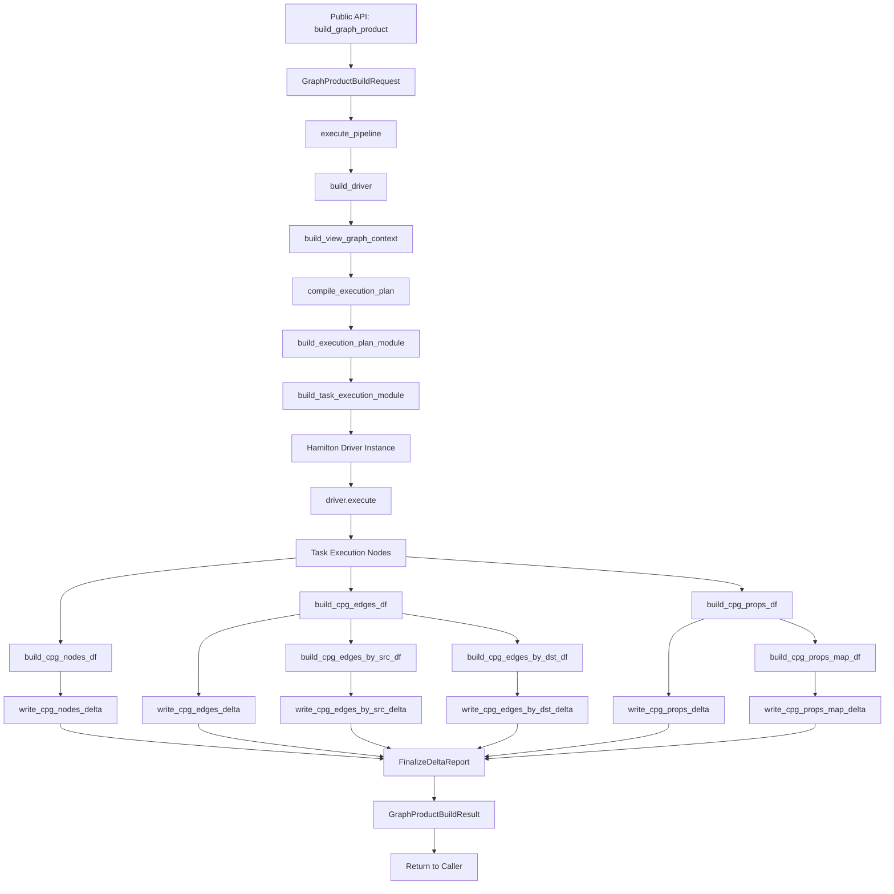

# Part VI: CPG Build and Orchestration

## Overview

The CPG Build and Orchestration subsystem represents the final stage of CodeAnatomy's inference pipeline—transforming normalized evidence tables into a queryable Code Property Graph with nodes, edges, and properties, then materializing these outputs as Delta Lake tables. This phase integrates three architectural layers: (1) the CPG schema catalog defining node/edge kinds and property specifications, (2) the Hamilton orchestration framework coordinating task execution across modules, and (3) the public API providing typed entry points for graph construction.

The design separates **specification** (what nodes/edges exist, what properties they carry) from **emission** (how to build DataFrames from source tables) and **orchestration** (how to schedule and execute tasks). The CPG schema serves as a contract between the inference pipeline and downstream consumers—all node kinds, edge kinds, and property types are registered in catalogs (`src/cpg/kind_catalog.py`, `src/cpg/prop_catalog.py`) with validation enforced at build time. The emission pipeline (`src/cpg/view_builders_df.py`) consumes normalized views from the DataFusion session context and produces standardized DataFrames with stable schemas. Hamilton (`src/hamilton_pipeline/`) orchestrates the full DAG, managing dependencies, caching, incremental execution, and diagnostics collection.

The public API (`src/graph/product_build.py`) provides the sole entry point for external callers: `build_graph_product(GraphProductBuildRequest) -> GraphProductBuildResult`. This function hides all Hamilton-specific details and returns typed outputs (`cpg_nodes`, `cpg_edges`, `cpg_props`) with metadata (schema version, engine versions, run identifiers, Delta paths). The result structure ensures API stability—internal refactorings to Hamilton modules or DataFusion views do not break downstream consumers.

---

## Execution Modes and Plan-Aware Orchestration

Hamilton orchestration is explicitly configured via the public execution surface through `GraphProductBuildRequest`. Callers select an `ExecutionMode` and optional `ExecutorConfig` which are threaded into `hamilton_pipeline` driver construction. Parallel plan execution is the default for production builds, with deterministic serial execution reserved for reproducibility audits and debugging.

**Execution Modes (File: `src/hamilton_pipeline/types/execution.py`, Lines 21-26)**

```python
class ExecutionMode(StrEnum):
    """Execution mode for Hamilton orchestration."""

    DETERMINISTIC_SERIAL = "deterministic_serial"
    PLAN_PARALLEL = "plan_parallel"
    PLAN_PARALLEL_REMOTE = "plan_parallel_remote"
```

- `DETERMINISTIC_SERIAL`: No dynamic execution; single executor for fully deterministic runs
- `PLAN_PARALLEL`: Dynamic execution enabled; scan-unit parallelism via Hamilton `Parallelizable/Collect`
- `PLAN_PARALLEL_REMOTE`: Dynamic execution plus remote executor routing for scan/high-cost tasks

**Executor Configuration (File: `src/hamilton_pipeline/types/execution.py`)**

```python
@dataclass(frozen=True)
class ExecutorConfig:
    """Configuration for Hamilton task executors."""

    kind: ExecutorKind = ExecutorKind.MULTIPROCESSING
    max_tasks: int = 4
    remote_kind: ExecutorKind | None = None
    remote_max_tasks: int | None = None
    cost_threshold: float | None = None
    ray_init_config: Mapping[str, object] | None = None
    dask_scheduler: str | None = None
    dask_client_kwargs: Mapping[str, object] | None = None
```

Execution routing uses plan-aware tags (task cost, slack, critical-path membership) to steer high-cost or scan workloads to remote executors (`src/hamilton_pipeline/execution_manager.py`). Dynamic scan units are enabled when the execution mode is parallel, and the scan-unit result mapping is ordered deterministically for stable downstream behavior.

**Graph Adapter Backends + Async Execution**

- `GraphAdapterConfig` enables non-dynamic backends (threadpool, Dask, Ray) for CPU-bound workloads (`src/hamilton_pipeline/driver_factory.py`)
- `execute_pipeline_async(...)` uses Hamilton's async driver for IO-bound workloads; dynamic execution and materializers are intentionally disabled in this mode (`src/hamilton_pipeline/execution.py`)

**Schedule Intelligence**

- rustworkx analytics (dominators, betweenness centrality, bridges, articulations) are computed during plan compilation and persisted in plan artifacts
- Task tags include these analytics so the Hamilton UI and diagnostics can surface single-point-of-failure nodes and centrality hotspots (`src/hamilton_pipeline/task_module_builder.py`)

### Plan Schedule + Validation Artifacts

Scheduling and edge validation diagnostics are emitted as msgspec envelopes and persisted to the Hamilton events v2 table (msgspec bytes). The run manifest stays lean and links to these artifacts by ID.

- **PlanScheduleArtifact** + **PlanValidationArtifact**: `src/serde_artifacts.py`
- **Artifact emission**: `src/hamilton_pipeline/lifecycle.py`
- **Hamilton events v2 storage**: `src/datafusion_engine/plan_artifact_store.py`
- **Artifact links in manifest**: `src/hamilton_pipeline/modules/outputs.py`

Run manifests now include cache and materialization metadata (cache path/log glob + materialized output list) to make cache logs traceable to a specific run and output set.

---

## Telemetry, Cache Governance, and Tagging

Hamilton UI tracking is configured through the runtime profile (or environment variables) and emits plan-aware tags for run provenance. Tracker endpoints (API/UI URLs) and identity metadata are configured per runtime profile, and tags include plan signatures, execution environment, determinism tier, and schedule analytics. Avoid embedding PII in tags; they are intended for filtering and diagnostics in the Hamilton UI.

Cache governance is explicit. The cache path controls metadata/result stores and JSONL cache logs (`cache_log_glob`), while cache policy defaults enforce conservative reuse. The default profile disables saver behavior and recomputes loaders unless explicitly overridden. Use `cache_policy_profile`, `cache_default_behavior`, and `cache_default_*_behavior` to opt into reuse for safe nodes, and invalidate by changing the cache path or running with recompute/disable overrides. Run manifests link to cache log locations for auditability.

Tag schema is enforced at the module builder. Every node is tagged with `layer`, `kind`, and `artifact` at minimum. Execution tasks also include `task_name`, `task_kind`, `cache_policy`, schedule indices, cost/slack metrics, plan signatures, and graph analytics (`betweenness_centrality`, `immediate_dominator`, `bridge_edge_count`, `is_bridge_task`, `is_articulation_task`). These tags drive UI catalog filtering and schedule diagnostics.

## Backend Tradeoffs and Serialization

Threadpool and multiprocessing adapters are local defaults. Dask and Ray enable distributed execution but require that inputs/outputs are serializable and that worker environments mirror local dependencies. Async execution is reserved for IO-bound paths; it disables dynamic scan units and materializers to keep ordering deterministic. Use Ray/Dask only for coarse-grained tasks with picklable payloads and stable worker environments.

---

## CPG Schema Catalog

### Node and Edge Kind Definitions

The CPG schema defines a fixed vocabulary of node and edge kinds that represent entities and relationships in the analyzed codebase. These kinds are defined as strongly-typed string enums to prevent typos and enable validation.

**File:** `src/cpg/kind_catalog.py`

**Node Kinds (Lines 25-48):**

```python
NODE_KIND_PY_FILE = NodeKindId("PY_FILE")
NODE_KIND_CST_REF = NodeKindId("CST_REF")
NODE_KIND_CST_IMPORT_ALIAS = NodeKindId("CST_IMPORT_ALIAS")
NODE_KIND_CST_CALLSITE = NodeKindId("CST_CALLSITE")
NODE_KIND_CST_DEF = NodeKindId("CST_DEF")
NODE_KIND_SYM_SCOPE = NodeKindId("SYM_SCOPE")
NODE_KIND_SYM_SYMBOL = NodeKindId("SYM_SYMBOL")
NODE_KIND_PY_SCOPE = NodeKindId("PY_SCOPE")
NODE_KIND_PY_BINDING = NodeKindId("PY_BINDING")
NODE_KIND_PY_DEF_SITE = NodeKindId("PY_DEF_SITE")
NODE_KIND_PY_USE_SITE = NodeKindId("PY_USE_SITE")
NODE_KIND_TYPE_PARAM = NodeKindId("TYPE_PARAM")
NODE_KIND_PY_QUALIFIED_NAME = NodeKindId("PY_QUALIFIED_NAME")
NODE_KIND_SCIP_SYMBOL = NodeKindId("SCIP_SYMBOL")
NODE_KIND_TS_NODE = NodeKindId("TS_NODE")
NODE_KIND_TS_ERROR = NodeKindId("TS_ERROR")
NODE_KIND_TS_MISSING = NodeKindId("TS_MISSING")
NODE_KIND_TYPE_EXPR = NodeKindId("TYPE_EXPR")
NODE_KIND_TYPE = NodeKindId("TYPE")
NODE_KIND_DIAG = NodeKindId("DIAG")
NODE_KIND_RT_OBJECT = NodeKindId("RT_OBJECT")
NODE_KIND_RT_SIGNATURE = NodeKindId("RT_SIGNATURE")
NODE_KIND_RT_SIGNATURE_PARAM = NodeKindId("RT_SIGNATURE_PARAM")
NODE_KIND_RT_MEMBER = NodeKindId("RT_MEMBER")
```

Node kinds span multiple evidence layers: `CST_*` (LibCST), `SYM_*` (symtable), `PY_*` (inference-driven bindings and scopes), `SCIP_*` (SCIP indexing), `TS_*` (tree-sitter), `TYPE_*` (type expressions), `RT_*` (runtime introspection), and `DIAG` (diagnostics).

**Edge Kinds (Lines 51-73):**

```python
EDGE_KIND_PY_CALLS_QNAME = EdgeKindId("PY_CALLS_QNAME")
EDGE_KIND_SCOPE_PARENT = EdgeKindId("SCOPE_PARENT")
EDGE_KIND_SCOPE_BINDS = EdgeKindId("SCOPE_BINDS")
EDGE_KIND_BINDING_RESOLVES_TO = EdgeKindId("BINDING_RESOLVES_TO")
EDGE_KIND_DEF_SITE_OF = EdgeKindId("DEF_SITE_OF")
EDGE_KIND_USE_SITE_OF = EdgeKindId("USE_SITE_OF")
EDGE_KIND_TYPE_PARAM_OF = EdgeKindId("TYPE_PARAM_OF")
EDGE_KIND_PY_DEFINES_SYMBOL = EdgeKindId("PY_DEFINES_SYMBOL")
EDGE_KIND_PY_REFERENCES_SYMBOL = EdgeKindId("PY_REFERENCES_SYMBOL")
EDGE_KIND_PY_READS_SYMBOL = EdgeKindId("PY_READS_SYMBOL")
EDGE_KIND_PY_WRITES_SYMBOL = EdgeKindId("PY_WRITES_SYMBOL")
EDGE_KIND_SCIP_SYMBOL_REFERENCE = EdgeKindId("SCIP_SYMBOL_REFERENCE")
EDGE_KIND_SCIP_SYMBOL_IMPLEMENTATION = EdgeKindId("SCIP_SYMBOL_IMPLEMENTATION")
EDGE_KIND_SCIP_SYMBOL_TYPE_DEFINITION = EdgeKindId("SCIP_SYMBOL_TYPE_DEFINITION")
EDGE_KIND_SCIP_SYMBOL_DEFINITION = EdgeKindId("SCIP_SYMBOL_DEFINITION")
EDGE_KIND_PY_IMPORTS_SYMBOL = EdgeKindId("PY_IMPORTS_SYMBOL")
EDGE_KIND_PY_CALLS_SYMBOL = EdgeKindId("PY_CALLS_SYMBOL")
EDGE_KIND_HAS_DIAGNOSTIC = EdgeKindId("HAS_DIAGNOSTIC")
EDGE_KIND_HAS_ANNOTATION = EdgeKindId("HAS_ANNOTATION")
EDGE_KIND_INFERRED_TYPE = EdgeKindId("INFERRED_TYPE")
EDGE_KIND_RT_HAS_SIGNATURE = EdgeKindId("RT_HAS_SIGNATURE")
EDGE_KIND_RT_HAS_PARAM = EdgeKindId("RT_HAS_PARAM")
EDGE_KIND_RT_HAS_MEMBER = EdgeKindId("RT_HAS_MEMBER")
```

Edge kinds represent structural relationships (SCOPE_PARENT, SCOPE_BINDS), symbol resolution (BINDING_RESOLVES_TO, PY_DEFINES_SYMBOL), cross-references (SCIP_SYMBOL_REFERENCE), and auxiliary data (HAS_DIAGNOSTIC, HAS_ANNOTATION).

### Edge Kind Requirements

Each edge kind declares required property columns that must be present in the relation output view. This contract ensures that downstream CPG builders have access to necessary metadata for edge construction.

**EdgeKindSpec Definition (Lines 76-83):**

```python
@dataclass(frozen=True)
class EdgeKindSpec:
    """Define required relation-output props for an edge kind."""

    kind: EdgeKindId
    required_props: tuple[str, ...] = ()
    description: str = ""
```

**Example Edge Requirements (Lines 85-160):**

```python
EDGE_KIND_SPECS: tuple[EdgeKindSpec, ...] = (
    EdgeKindSpec(
        kind=EDGE_KIND_PY_DEFINES_SYMBOL,
        required_props=("symbol_roles", "origin", "resolution_method"),
    ),
    EdgeKindSpec(
        kind=EDGE_KIND_PY_CALLS_SYMBOL,
        required_props=("origin", "resolution_method", "score"),
    ),
    EdgeKindSpec(
        kind=EDGE_KIND_BINDING_RESOLVES_TO,
        required_props=("kind",),
    ),
    # ... additional specs
)
```

**Validation Mechanism (Lines 174-196):**

The `validate_edge_kind_requirements(schema)` function enforces these contracts at build time:

```python
def validate_edge_kind_requirements(schema: SchemaLike) -> None:
    """Validate edge-kind requirements against relation output schema."""
    available = _schema_names(schema)
    errors: list[str] = []
    for spec in EDGE_KIND_SPECS:
        missing = sorted(prop for prop in spec.required_props if prop not in available)
        if missing:
            errors.append(f"{spec.kind}: missing required props {missing}")
    if errors:
        msg = "Edge kind requirements not satisfied:\n- " + "\n- ".join(errors)
        raise ValueError(msg)
```

This validation runs during driver construction (`src/hamilton_pipeline/driver_factory.py`), ensuring that the `relation_output` view schema satisfies all edge kind contracts before execution begins.

---

## Property Catalog and Specifications

### Property Type System

The property catalog defines all CPG property keys with their value types, descriptions, and optional enum constraints. Properties are primitive-typed (string, int, float, bool, json) to ensure consistent serialization to Delta Lake.

**File:** `src/cpg/prop_catalog.py`

**Property Primitive Types (Line 12):**

```python
PropPrimitive = Literal["string", "int", "float", "bool", "json"]
```

**PropSpec Definition (Lines 15-35):**

```python
@dataclass(frozen=True)
class PropSpec:
    """Define a property specification with value typing."""

    type: PropPrimitive
    description: str = ""
    enum_values: tuple[str, ...] | None = None
```

**Property Catalog Excerpt:**

The `PROP_SPECS` dictionary registers all known property keys. Examples:

```python
PROP_SPECS: dict[str, PropSpec] = {
    "ast_type": p_str("ast.AST type name (e.g., Call, Name, FunctionDef)"),
    "binding_kind": p_str("", enum=PROP_ENUMS["binding_kind"]),
    "callee_shape": p_str("", enum=PROP_ENUMS["callee_shape"]),
    "def_kind": p_str("", enum=PROP_ENUMS["def_kind"]),
    "docstring": p_str("Docstring text"),
    "file_sha256": p_str("SHA-256 hash (hex)"),
    "line_start": p_int(""),
    "symbol_roles": p_int("SCIP symbol_roles bitmask"),
    "score": p_float(""),
    # ... 200+ property specs
}
```

**Enum Constraints:**

Many properties declare enum constraints to validate values at build time:

```python
PROP_ENUMS: dict[str, tuple[str, ...]] = {
    "binding_kind": (
        "local", "param", "import", "global_ref", "nonlocal_ref",
        "free_ref", "namespace", "annot_only", "unknown",
    ),
    "def_kind": ("function", "class", "lambda"),
    "severity": ("INFO", "WARNING", "ERROR"),
    "use_kind": ("read", "write", "del", "call", "import", "other"),
    # ... additional enums
}
```

### Property Transform Specifications

Some properties require transformations during emission—for example, converting integer flags to boolean values or mapping expression context codes to canonical strings.

**File:** `src/cpg/specs.py`

**Transform Registry:**

```python
TRANSFORM_EXPR_CONTEXT = "expr_context"
TRANSFORM_FLAG_TO_BOOL = "flag_to_bool"

@dataclass(frozen=True)
class PropTransformSpec:
    """Bundle of value/expr transforms for property emission."""

    value_fn: PropTransformFn
    expr_fn: PropTransformExprFn

PROP_TRANSFORMS: dict[str, PropTransformSpec] = {
    TRANSFORM_EXPR_CONTEXT: PropTransformSpec(
        value_fn=expr_context_value,
        expr_fn=expr_context_expr,
    ),
    TRANSFORM_FLAG_TO_BOOL: PropTransformSpec(
        value_fn=flag_to_bool,
        expr_fn=flag_to_bool_expr,
    ),
}
```

**PropFieldSpec with Transform:**

```python
@dataclass(frozen=True)
class PropFieldSpec:
    """Spec for emitting a property from a source column."""

    prop_key: str
    source_col: str | None = None
    literal: object | None = None
    transform_id: str | None = None
    include_if_id: str | None = None
    skip_if_none: bool = False
    value_type: PropValueType | None = None

    def value_from(self, row: Mapping[str, object]) -> object | None:
        """Return the value to emit for this field."""
        if self.literal is not None:
            value = self.literal
        elif self.source_col is not None:
            value = row.get(self.source_col)
        else:
            value = None
        transform = resolve_prop_transform(self.transform_id)
        if transform is None:
            return value
        return transform.value_fn(value)
```

The `value_from()` method resolves literal values or source columns, applies optional transforms, and returns the final property value for emission.

---

## CPG Emission Pipeline

### Node Family Architecture

The emission pipeline uses a **node family** abstraction to group node types with shared field patterns. This DRY approach eliminates repetition in schema definitions.

**File:** `src/cpg/node_families.py`

**Node Family Enumeration (Lines 21-37):**

```python
class NodeFamily(StrEnum):
    """Define node family categories for CPG nodes."""

    FILE = "file"
    CST = "cst"
    SYMTABLE = "symtable"
    SCIP = "scip"
    TREESITTER = "treesitter"
    TYPE = "type"
    DIAGNOSTIC = "diagnostic"
    RUNTIME = "runtime"
    BYTECODE = "bytecode"
```

**Node Family Defaults (Lines 300-378):**

Each family defines default field bundles and span column names:

```python
NODE_FAMILY_DEFAULTS: dict[NodeFamily, NodeFamilyDefaults] = {
    NodeFamily.FILE: NodeFamilyDefaults(
        family=NodeFamily.FILE,
        fields=_file_family_fields(),
        path_cols=("path",),
        bstart_cols=("bstart",),
        bend_cols=("bend",),
        file_id_cols=("file_id",),
    ),
    NodeFamily.CST: NodeFamilyDefaults(
        family=NodeFamily.CST,
        fields=_cst_family_fields(),
        path_cols=("path",),
        bstart_cols=("bstart",),
        bend_cols=("bend",),
        file_id_cols=("file_id",),
    ),
    # ... additional families
}
```

### Entity Family Specifications

The emission pipeline is driven by **entity family specifications**—bundles that declare how to emit nodes and properties for a given entity type (e.g., "file", "ref", "callsite").

**File:** `src/cpg/spec_registry.py`

**EntityFamilySpec Definition (Lines 29-159):**

```python
@dataclass(frozen=True)
class EntityFamilySpec:
    """Spec for a node/prop family with shared identity columns.

    The ``node_family`` field provides sensible defaults for column names
    (path_cols, bstart_cols, bend_cols, file_id_cols). Explicit values
    override the family defaults.
    """

    name: str
    node_kind: NodeKindId
    id_cols: tuple[str, ...]
    node_table: str | None
    prop_source_map: Mapping[str, PropFieldInput] = field(default_factory=dict)
    prop_table: str | None = None
    node_name: str | None = None
    prop_name: str | None = None
    node_family: NodeFamily | None = None
    path_cols: tuple[str, ...] | None = None
    bstart_cols: tuple[str, ...] | None = None
    bend_cols: tuple[str, ...] | None = None
    file_id_cols: tuple[str, ...] | None = None
    prop_include_if_id: str | None = None

    def to_node_plan(self) -> NodePlanSpec | None:
        """Return a NodePlanSpec for this family when configured."""
        if self.node_table is None:
            return None
        return NodePlanSpec(
            name=self.node_name or self.name,
            table_ref=self.node_table,
            emit=NodeEmitSpec(
                node_kind=self.node_kind,
                id_cols=self.id_cols,
                path_cols=self.resolved_path_cols,
                bstart_cols=self.resolved_bstart_cols,
                bend_cols=self.resolved_bend_cols,
                file_id_cols=self.resolved_file_id_cols,
            ),
        )

    def to_prop_table(
        self,
        *,
        source_columns: Sequence[str] | None = None
    ) -> PropTableSpec | None:
        """Return a PropTableSpec for this family when configured."""
        table = self.prop_table or self.node_table
        if table is None:
            return None
        prop_fields = prop_fields_from_catalog(
            source_map=self.prop_source_map,
            source_columns=source_columns,
        )
        return PropTableSpec(
            name=self.prop_name or self.name,
            table_ref=table,
            entity_kind=EntityKind.NODE,
            id_cols=self.id_cols,
            node_kind=self.node_kind,
            fields=prop_fields,
            include_if_id=self.prop_include_if_id,
        )
```

**Example Family Specification (Lines 170-186):**

```python
ENTITY_FAMILY_SPECS: tuple[EntityFamilySpec, ...] = (
    EntityFamilySpec(
        name="file",
        node_kind=kind_catalog.NODE_KIND_PY_FILE,
        id_cols=("file_id",),
        node_table="repo_files_nodes",
        node_family=NodeFamily.FILE,
        prop_source_map=_prop_source_map(
            kind_catalog.NODE_KIND_PY_FILE,
            {
                "path": "path",
                "size_bytes": "size_bytes",
                "file_sha256": "file_sha256",
                "encoding": "encoding",
            },
        ),
        prop_table="repo_files",
    ),
    # ... additional families
)
```

This specification declares that:
- Nodes of kind `PY_FILE` are identified by `file_id` column
- Node rows are emitted from the `repo_files_nodes` table
- Properties (`path`, `size_bytes`, `file_sha256`, `encoding`) are emitted from the `repo_files` table
- Anchor columns inherit from the FILE family defaults: `("path",)`, `("bstart",)`, `("bend",)`, `("file_id",)`

### DataFusion-Native View Builders

The emission pipeline uses **DataFusion native view builders** to construct CPG output DataFrames from registered views.

**File:** `src/cpg/view_builders_df.py`

**Node Emission (Lines 242-306):**

```python
def build_cpg_nodes_df(
    session_runtime: SessionRuntime,
    *,
    task_identity: TaskIdentity | None = None
) -> DataFrame:
    """Build CPG nodes DataFrame from view specs using DataFusion."""
    with stage_span(
        "cpg.nodes",
        stage="cpg",
        scope_name=SCOPE_CPG,
        attributes={"codeanatomy.view_name": "cpg_nodes_v1"},
    ):
        ctx = session_runtime.ctx
        specs = node_plan_specs()
        task_name = task_identity.name if task_identity is not None else None
        task_priority = task_identity.priority if task_identity is not None else None

        frames: list[DataFrame] = []
        for spec in specs:
            try:
                source_df = ctx.table(spec.table_ref)
            except KeyError as exc:
                msg = f"Missing required source table {spec.table_ref!r} for CPG nodes."
                raise ValueError(msg) from exc

            node_df = _emit_nodes_df(
                source_df,
                spec=spec.emit,
                task_name=task_name,
                task_priority=task_priority,
            )
            frames.append(node_df)

        if not frames:
            msg = "CPG node builder did not produce any plans."
            raise ValueError(msg)

        combined = frames[0]
        for frame in frames[1:]:
            combined = combined.union(frame)

        result = combined.select(*_NODE_OUTPUT_COLUMNS)
        _require_semantic_types(
            result,
            view_name="cpg_nodes_v1",
            expected={"node_id": "NodeId"},
            runtime_profile=session_runtime.profile,
        )
        return result
```

**Node Emission Helper (Lines 309-354):**

```python
def _emit_nodes_df(
    df: DataFrame,
    *,
    spec: NodeEmitSpec,
    task_name: str | None = None,
    task_priority: int | None = None,
) -> DataFrame:
    """Emit CPG nodes from a DataFrame using DataFusion expressions."""
    id_cols, _ = _prepare_id_columns_df(df, spec.id_cols)
    node_id_parts = [
        col(c) if c in df.schema().names else _null_expr("Utf8")
        for c in id_cols
    ]
    node_id_parts.append(lit(str(spec.node_kind)))

    node_id = semantic_tag("NodeId", _stable_id_from_parts("node", node_id_parts))
    node_kind = lit(str(spec.node_kind))
    path = _coalesce_cols(df, spec.path_cols, pa.string())
    bstart = _coalesce_cols(df, spec.bstart_cols, pa.int64())
    bend = _coalesce_cols(df, spec.bend_cols, pa.int64())
    file_id = _coalesce_cols(df, spec.file_id_cols, pa.string())

    return df.select(
        node_id.alias("node_id"),
        node_kind.alias("node_kind"),
        path.alias("path"),
        bstart.alias("bstart"),
        bend.alias("bend"),
        file_id.alias("file_id"),
        _literal_or_null(task_name, pa.string()).alias("task_name"),
        _literal_or_null(task_priority, pa.int32()).alias("task_priority"),
    )
```

**Key Design Decisions:**

1. **Stable ID Generation (Line 338):** Node IDs are built from identity columns plus node kind using a deterministic hash function (`stable_id_parts`), ensuring consistent identifiers across runs. IDs are tagged with semantic type "NodeId" for validation.

2. **Graceful Column Coalescing (Lines 193-206):** The `_coalesce_cols()` function searches for columns in the provided list and returns the first available, falling back to typed null literals when all are missing. This implements the **graceful degradation** invariant.

3. **Union Aggregation (Lines 295-297):** Multiple entity families produce independent DataFrames that are combined via union operations, allowing heterogeneous node types to coexist in a single output.

4. **Semantic Type Validation (Lines 300-305):** CPG outputs validate semantic type metadata on critical columns (node_id, edge_id, src_node_id, dst_node_id) to ensure UDF contract compliance.

### Relationship DataFrame Builders

The codebase has introduced a **declarative relationship specification DSL** (`src/cpg/relationship_specs.py`) with generic builders (`src/cpg/relationship_builder.py`) to eliminate code duplication.

**File:** `src/cpg/relationship_specs.py`

**Relationship Specification (Lines 122-181):**

```python
@dataclass(frozen=True, slots=True)
class RelationshipSpec:
    """Declarative specification for a relationship DataFrame builder."""

    name: str
    edge_kind: EdgeKindId
    origin: RelationshipOrigin
    src_table: str
    entity_id_col: ColumnSpec
    symbol_col: ColumnSpec
    resolution_method: str
    output_view_name: str
    bstart_col: ColumnSpec = field(default_factory=lambda: col_ref("bstart"))
    bend_col: ColumnSpec = field(default_factory=lambda: col_ref("bend"))
    path_col: str = "path"
    edge_owner_file_id_col: str = "edge_owner_file_id"
    edge_owner_file_id_fallback: str = "file_id"
    symbol_roles_col: str | None = "symbol_roles"
    confidence: float = 0.5
    score: float = 0.5
```

**Example Specifications (Lines 271-344):**

```python
REL_NAME_SYMBOL_SPEC = RelationshipSpec(
    name="name_symbol",
    edge_kind=EDGE_KIND_PY_REFERENCES_SYMBOL,
    origin=RelationshipOrigin.CST,
    src_table="cst_refs",
    entity_id_col=col_ref("ref_id"),
    symbol_col=col_ref("ref_text"),
    resolution_method="cst_ref_text",
    output_view_name="rel_name_symbol_v1",
    # ... additional parameters
)

REL_IMPORT_SYMBOL_SPEC = RelationshipSpec(
    name="import_symbol",
    edge_kind=EDGE_KIND_PY_IMPORTS_SYMBOL,
    origin=RelationshipOrigin.CST,
    src_table="cst_imports",
    entity_id_col=coalesce_ref("import_alias_id", "import_id"),
    symbol_col=coalesce_ref("name", "module"),
    resolution_method="cst_import_name",
    output_view_name="rel_import_symbol_v1",
    # ... additional parameters
)
```

**Generic Builder (File: `src/cpg/relationship_builder.py`, Lines 49-115):**

```python
def build_symbol_relation_df(
    ctx: SessionContext,
    spec: RelationshipSpec,
    *,
    task_name: str,
    task_priority: int,
) -> DataFrame:
    """Build a DataFusion DataFrame for a symbol relationship from spec."""
    source = ctx.table(spec.src_table)

    entity_id = _column_expr(spec.entity_id_col)
    symbol = _column_expr(spec.symbol_col)
    bstart = _column_expr(spec.bstart_col)
    bend = _column_expr(spec.bend_col)

    edge_owner = f.coalesce(
        col(spec.edge_owner_file_id_col),
        col(spec.edge_owner_file_id_fallback),
    )

    select_exprs = [
        entity_id.alias(spec.entity_id_alias),
        symbol.alias("symbol"),
    ]

    if spec.symbol_roles_col is not None:
        select_exprs.append(col(spec.symbol_roles_col).alias("symbol_roles"))

    select_exprs.extend([
        col(spec.path_col).alias("path"),
        edge_owner.alias("edge_owner_file_id"),
        bstart.alias("bstart"),
        bend.alias("bend"),
        lit(spec.resolution_method).alias("resolution_method"),
        lit(str(spec.edge_kind)).alias("kind"),
        lit(str(spec.origin)).alias("origin"),
        lit(spec.confidence).alias("confidence"),
        lit(spec.score).alias("score"),
        lit(task_name).alias("task_name"),
        lit(task_priority).alias("task_priority"),
    ])

    return source.select(*select_exprs)
```

This approach replaces the previous hand-written builders for each relationship type with a single generic implementation driven by declarative specs.

### CPG Output Schema

The emission pipeline produces three standardized output schemas:

**File:** `src/cpg/emit_specs.py`

**Node Output Columns (Lines 7-16):**

```python
_NODE_OUTPUT_COLUMNS: tuple[str, ...] = (
    "node_id",
    "node_kind",
    "path",
    "bstart",
    "bend",
    "file_id",
    "task_name",
    "task_priority",
)
```

**Edge Output Columns (Lines 18-35):**

```python
_EDGE_OUTPUT_COLUMNS: tuple[str, ...] = (
    "edge_id",
    "edge_kind",
    "src_node_id",
    "dst_node_id",
    "path",
    "bstart",
    "bend",
    "origin",
    "resolution_method",
    "confidence",
    "score",
    "symbol_roles",
    "qname_source",
    "ambiguity_group_id",
    "task_name",
    "task_priority",
)
```

**Property Output Columns (Lines 37-50):**

```python
_PROP_OUTPUT_COLUMNS: tuple[str, ...] = (
    "entity_kind",
    "entity_id",
    "node_kind",
    "prop_key",
    "value_type",
    "value_string",
    "value_int",
    "value_float",
    "value_bool",
    "value_json",
    "task_name",
    "task_priority",
)
```

All three schemas include `task_name` and `task_priority` metadata columns for tracing outputs back to their originating tasks in the execution plan.

---

## Hamilton Orchestration Layer

### Pipeline Execution Architecture

Hamilton orchestrates the full CPG build pipeline as a directed acyclic graph (DAG) of function nodes. The orchestration layer handles module loading, driver construction, task scheduling, incremental execution, caching, and diagnostics collection.

**File:** `src/hamilton_pipeline/execution.py`

**Execution Entry Point:**

```python
def execute_pipeline(
    *,
    repo_root: PathLike,
    options: PipelineExecutionOptions | None = None,
) -> Mapping[str, JsonDict | None]:
    """Execute the full Hamilton pipeline for a repository."""
    repo_root_path = ensure_path(repo_root).resolve()
    options = options or PipelineExecutionOptions()
    execute_overrides = _build_execute_overrides(
        repo_root_path=repo_root_path,
        options=options,
    )

    driver_instance = (
        options.pipeline_driver
        if options.pipeline_driver is not None
        else build_driver(
            config=options.config,
            execution_mode=options.execution_mode,
            executor_config=options.executor_config,
            graph_adapter_config=options.graph_adapter_config,
        )
    )
    output_nodes = cast(
        "list[PipelineFinalVar]",
        list(options.outputs or FULL_PIPELINE_OUTPUTS),
    )
    results = driver_instance.execute(
        output_nodes,
        inputs={"repo_root": str(repo_root_path)},
        overrides=execute_overrides,
    )
    return cast("Mapping[str, JsonDict | None]", results)
```

**PipelineExecutionOptions:**

```python
@dataclass(frozen=True)
class PipelineExecutionOptions:
    """Execution options for the full Hamilton pipeline."""

    output_dir: PathLike | None = None
    work_dir: PathLike | None = None
    scip_index_config: ScipIndexConfig | None = None
    scip_identity_overrides: ScipIdentityOverrides | None = None
    incremental_config: IncrementalConfig | None = None
    incremental_impact_strategy: ImpactStrategy | None = None
    execution_mode: ExecutionMode = ExecutionMode.PLAN_PARALLEL
    executor_config: ExecutorConfig | None = None
    graph_adapter_config: GraphAdapterConfig | None = None
    outputs: Sequence[str] | None = None
    config: Mapping[str, JsonValue] = field(default_factory=dict)
    pipeline_driver: hamilton_driver.Driver | None = None
    overrides: Mapping[str, object] | None = None
    use_materialize: bool = True
```

The options dataclass provides fine-grained control over:
- Output and working directories
- SCIP indexing configuration
- Incremental execution settings
- Execution mode and executor configuration
- Requested output nodes
- Hamilton config overrides
- Pre-built driver instances (for testing or custom configurations)

### Driver Factory and Module Loading

The driver factory builds Hamilton drivers with plan-aware compilation—the execution plan is computed before driver construction, allowing task-specific modules to be generated dynamically.

**File:** `src/hamilton_pipeline/driver_factory.py`

**View Graph Context (Lines 175-185):**

```python
@dataclass(frozen=True)
class ViewGraphContext:
    """Runtime context needed to compile the execution plan."""

    profile: DataFusionRuntimeProfile
    session_runtime: SessionRuntime
    determinism_tier: DeterminismTier
    snapshot: Mapping[str, object]
    view_nodes: tuple[ViewNode, ...]
    runtime_profile_spec: RuntimeProfileSpec
```

**Driver Build Process:**

```python
def build_driver(
    *,
    config: Mapping[str, JsonValue],
    modules: Sequence[ModuleType] | None = None,
    view_ctx: ViewGraphContext | None = None,
    plan: ExecutionPlan | None = None,
    execution_mode: ExecutionMode = ExecutionMode.PLAN_PARALLEL,
    executor_config: ExecutorConfig | None = None,
    graph_adapter_config: GraphAdapterConfig | None = None,
) -> driver.Driver:
    """Build a Hamilton Driver for the pipeline."""
    modules = list(modules) if modules is not None else default_modules()
    resolved_view_ctx = view_ctx or build_view_graph_context(config)
    resolved_plan = plan or _compile_plan(resolved_view_ctx, config)
    if plan is None:
        resolved_plan = _plan_with_incremental_pruning(
            view_ctx=resolved_view_ctx,
            plan=resolved_plan,
            config=config,
        )
    modules.append(build_execution_plan_module(resolved_plan))
    modules.append(
        build_task_execution_module(
            plan=resolved_plan,
            options=TaskExecutionModuleOptions(),
        )
    )

    config_payload = _with_graph_tags(config, plan=resolved_plan)
    # ... configuration setup

    diagnostics = DiagnosticsCollector()
    set_hamilton_diagnostics_collector(diagnostics)

    builder = DriverBuilder()
    builder = builder.with_modules(*modules).with_config(config_payload)
    builder = _apply_dynamic_execution(
        builder,
        config=config_payload,
        plan=resolved_plan,
        diagnostics=diagnostics,
        execution_mode=execution_mode,
        executor_config=executor_config,
    )
    builder = _apply_cache(builder, config=config_payload)
    builder = _apply_materializers(builder, config=config_payload)
    builder = _apply_adapters(
        builder,
        config=config_payload,
        diagnostics=diagnostics,
        plan=resolved_plan,
        profile=resolved_view_ctx.profile,
        graph_adapter_config=graph_adapter_config,
    )
    # ... additional hooks
    driver_instance = builder.build()
    return driver_instance
```

**Key Stages:**

1. **View Graph Context Construction:** Initializes DataFusion session runtime, registers views, validates edge kind requirements via `validate_edge_kind_requirements()`, and extracts view nodes for planning

2. **Execution Plan Compilation:** Compiles the execution plan from view dependencies, requested tasks, and incremental impact analysis

3. **Dynamic Module Generation:** Generates two synthetic modules:
   - `execution_plan` module exposing plan metadata
   - `generated_tasks` module containing per-task execution nodes

4. **Driver Configuration:** Applies execution mode, executor config, caching, materializers, lifecycle adapters, and semantic registry hooks

### Task Module Builder

The task module builder generates a Hamilton module with one function node per task in the execution plan. Each task node is decorated with Hamilton modifiers to specify dependencies, caching policies, and metadata tags.

**File:** `src/hamilton_pipeline/task_module_builder.py`

**Module Generation (Lines 104-150):**

```python
def build_task_execution_module(
    *,
    plan: ExecutionPlan,
    options: TaskExecutionModuleOptions | None = None,
) -> ModuleType:
    """Build a Hamilton module with per-task execution nodes."""
    resolved = options or TaskExecutionModuleOptions()
    module = ModuleType(resolved.module_name)
    sys.modules[resolved.module_name] = module
    all_names: list[str] = []
    module.__dict__["__all__"] = all_names
    plan_context = _PlanTaskContext.from_plan(plan)
    outputs = {node.name: node for node in plan.view_nodes}
    scan_units_by_task = dict(plan.scan_task_units_by_name)

    for scan_task_name in sorted(scan_units_by_task):
        scan_unit = scan_units_by_task[scan_task_name]
        task_spec = TaskNodeSpec(
            name=scan_task_name,
            output=scan_task_name,
            kind="scan",
            priority=priority_for_task(scan_task_name),
            cache_policy="none",
        )
        task_node = _build_task_node(
            plan_context.build_context(
                task=task_spec,
                output_name=scan_task_name,
                dependency_key=scan_task_name,
                scan_unit_key=scan_unit.key,
            )
        )
        task_node.__module__ = resolved.module_name
        module.__dict__[scan_task_name] = task_node
        all_names.append(scan_task_name)

    for output_name, view_node in outputs.items():
        spec = _task_spec_from_view_node(view_node)
        task_node = _build_task_node(
            plan_context.build_context(
                task=spec,
                output_name=output_name,
                dependency_key=output_name,
                scan_unit_key=None,
            )
        )
        task_node.__module__ = resolved.module_name
        module.__dict__[output_name] = task_node
        all_names.append(output_name)

    return module
```

**Task Node Decoration:**

```python
def _decorate_task_node(
    *,
    node_fn: Callable[..., TableLike],
    context: TaskNodeContext,
) -> Callable[..., TableLike]:
    task = context.task
    if task.cache_policy in {"session", "persistent"}:
        node_fn = cache(format="delta", behavior="default")(node_fn)
    dependency_sources = tuple(source(dep) for dep in sorted(set(context.dependencies)))
    task_spec = task_execution.TaskExecutionSpec(
        task_name=task.name,
        task_output=context.output_name,
        plan_fingerprint=context.plan_fingerprint,
        plan_task_signature=context.plan_task_signature,
        task_kind=task.kind,
        scan_unit_key=context.scan_unit_key,
    )
    if dependency_sources:
        inject_kwargs: dict[str, ParametrizedDependency] = {
            "dependencies": group(*dependency_sources),
            "plan_signature": source("plan_signature"),
            "task_spec": value(task_spec),
        }
        node_fn = inject(**inject_kwargs)(node_fn)
    else:
        inject_kwargs: dict[str, ParametrizedDependency] = {
            "dependencies": value(()),
            "plan_signature": source("plan_signature"),
            "task_spec": value(task_spec),
        }
        node_fn = inject(**inject_kwargs)(node_fn)

    # Tag application for schedule metadata
    schedule_tags: dict[str, str] = {}
    schedule_metadata = context.schedule_metadata
    if schedule_metadata is not None:
        schedule_tags = {
            "schedule_index": str(schedule_metadata.schedule_index),
            "generation_index": str(schedule_metadata.generation_index),
            "generation_order": str(schedule_metadata.generation_order),
            "generation_size": str(schedule_metadata.generation_size),
        }
    # ... tag application
```

**Hamilton Modifiers:**

- `@cache(format="delta", behavior="default")` enables on-disk caching for persistent tasks
- `@source(dep)` declares dependencies on other tasks
- `@group(*sources)` collects multiple dependencies into a list
- `@value(task_spec)` injects constant task metadata
- `@tag(**schedule_tags)` attaches scheduling metadata for diagnostics

### Execution Manager for Task Routing

The execution manager routes tasks to appropriate executors based on task kind—scan tasks run on a remote multiprocessing executor while view tasks run locally.

**File:** `src/hamilton_pipeline/execution_manager.py`

**PlanExecutionManager (Lines 52-98):**

```python
class PlanExecutionManager(executors.ExecutionManager):
    """Route scan tasks to remote execution and keep view tasks local."""

    def __init__(
        self,
        *,
        local_executor: executors.TaskExecutor,
        remote_executor: executors.TaskExecutor,
        cost_threshold: float | None = None,
        diagnostics: DiagnosticsCollector | None = None,
    ) -> None:
        super().__init__([local_executor, remote_executor])
        self._local_executor = local_executor
        self._remote_executor = remote_executor
        self._cost_threshold = cost_threshold
        self._diagnostics = diagnostics

    def get_executor_for_task(
        self,
        task: executors.TaskImplementation,
    ) -> executors.TaskExecutor:
        """Return the executor for a task based on its tagged kind."""
        tags = _task_tags(task)
        use_remote = _task_kind(tags) == _SCAN_TASK_KIND or _is_high_cost(
            tags,
            threshold=self._cost_threshold,
        )
        executor = self._remote_executor if use_remote else self._local_executor
        if self._diagnostics is not None:
            payload = {
                "run_id": getattr(task, "run_id", None),
                "task_id": getattr(task, "task_id", None),
                "task_name": tags.get("task_name"),
                "task_kind": _task_kind(tags),
                "task_cost": _task_cost(tags),
                "cost_threshold": self._cost_threshold,
                "executor": "remote" if use_remote else "local",
                "event_time_unix_ms": int(time.time() * 1000),
            }
            self._diagnostics.record_events("hamilton_task_routing_v1", [payload])
        return executor
```

**Task Routing Logic (Lines 26-43):**

```python
def _task_kind(tags: Mapping[str, object]) -> str | None:
    kind = tags.get("task_kind")
    return kind if isinstance(kind, str) else None

def _task_cost(tags: Mapping[str, object]) -> float | None:
    value = tags.get("task_cost")
    if isinstance(value, bool):
        return None
    if isinstance(value, (int, float)):
        return float(value)
    if isinstance(value, str):
        try:
            return float(value)
        except ValueError:
            return None
    return None
```

Scan tasks—which read large file sets from disk—benefit from parallelism, while view tasks—which perform DataFusion transformations—are lightweight and execute efficiently in the local process. High-cost tasks (exceeding `cost_threshold`) are also routed to remote executors regardless of kind.

---

## Engine Runtime and Session Management

### EngineSession Bundle

The engine session bundles core execution surfaces into a single object for consistent dependency injection throughout the pipeline.

**File:** `src/engine/session.py`

**EngineSession Definition:**

```python
@dataclass(frozen=True)
class EngineSession:
    """Bundle core execution surfaces into a single session object."""

    engine_runtime: EngineRuntime
    datasets: DatasetCatalog
    diagnostics: DiagnosticsCollector | None = None
    surface_policy: MaterializationPolicy = field(default_factory=MaterializationPolicy)
    settings_hash: str | None = None
    runtime_profile_hash: str | None = None

    @property
    def datafusion_profile(self) -> DataFusionRuntimeProfile:
        """Return the DataFusion runtime profile when configured."""
        return self.engine_runtime.datafusion_profile

    def df_ctx(self) -> SessionContext:
        """Return the DataFusion SessionContext when configured."""
        return self.engine_runtime.datafusion_profile.session_runtime().ctx

    def df_runtime(self) -> SessionRuntime:
        """Return the DataFusion SessionRuntime when configured."""
        return self.engine_runtime.datafusion_profile.session_runtime()

    def datafusion_facade(self) -> DataFusionExecutionFacade:
        """Return a DataFusion execution facade when configured."""
        session_runtime = self.engine_runtime.datafusion_profile.session_runtime()
        return DataFusionExecutionFacade(
            ctx=session_runtime.ctx,
            runtime_profile=self.engine_runtime.datafusion_profile,
        )
```

**Session Factory (File: `src/engine/session_factory.py`):**

```python
def build_engine_session(
    *,
    runtime_spec: RuntimeProfileSpec,
    diagnostics: DiagnosticsCollector | None = None,
    surface_policy: MaterializationPolicy | None = None,
    diagnostics_policy: DiagnosticsPolicy | None = None,
) -> EngineSession:
    """Build an EngineSession bound to the provided runtime spec."""
    engine_runtime = build_engine_runtime(
        runtime_profile=runtime_spec.datafusion,
        diagnostics=diagnostics,
        diagnostics_policy=diagnostics_policy,
    )
    df_profile = engine_runtime.datafusion_profile
    profile_name = runtime_spec.name
    if diagnostics is not None:
        snapshot = feature_state_snapshot(
            profile_name=profile_name,
            determinism_tier=runtime_spec.determinism_tier,
            runtime_profile=df_profile,
        )
        diagnostics.record_events("feature_state_v1", [snapshot.to_row()])
    datasets = DatasetCatalog()
    input_plugin_names: list[str] = []
    if df_profile is not None:
        plugin = dataset_input_plugin(datasets, runtime_profile=df_profile)
        df_profile = replace(
            df_profile,
            input_plugins=(*df_profile.input_plugins, plugin),
        )
        engine_runtime = engine_runtime.with_datafusion_profile(df_profile)
        input_plugin_names = [plugin.__name__]
    settings_hash = df_profile.settings_hash()
    runtime_snapshot = runtime_profile_snapshot(
        df_profile,
        name=profile_name,
        determinism_tier=runtime_spec.determinism_tier,
    )
    if diagnostics is not None:
        # ... diagnostics recording
    return EngineSession(
        engine_runtime=engine_runtime,
        datasets=datasets,
        diagnostics=diagnostics,
        surface_policy=surface_policy or MaterializationPolicy(),
        settings_hash=settings_hash,
        runtime_profile_hash=runtime_snapshot.profile_hash,
    )
```

The factory performs several critical initialization steps:

1. Builds the `EngineRuntime` with DataFusion profile and diagnostics policy
2. Records feature state snapshots for reproducibility
3. Initializes the `DatasetCatalog` for dataset location resolution
4. Registers DataFusion input plugins for dataset access
5. Computes settings and profile hashes for caching keys

### Materialization Pipeline

The materialization pipeline executes registered views and produces `PlanProduct` wrappers with optional streaming or table outputs.

**File:** `src/engine/materialize_pipeline.py`

**View Product Builder:**

```python
def build_view_product(
    view_name: str,
    *,
    session_runtime: SessionRuntime,
    policy: MaterializationPolicy,
    view_id: str | None = None,
) -> PlanProduct:
    """Execute a registered view and return a PlanProduct wrapper."""
    profile = session_runtime.profile
    session = session_runtime.ctx
    if not session.table_exist(view_name):
        msg = f"View {view_name!r} is not registered for materialization."
        raise ValueError(msg)
    from datafusion_engine.schema_registry import validate_nested_types

    validate_nested_types(session, view_name)
    bundle = _plan_view_bundle(
        view_name,
        session_runtime=session_runtime,
        runtime_profile=profile,
    )
    scan_units, scan_keys = _plan_view_scan_units(bundle, runtime_profile=profile)
    if scan_units:
        from datafusion_engine.dataset_resolution import apply_scan_unit_overrides

        apply_scan_unit_overrides(
            session,
            scan_units=scan_units,
            runtime_profile=profile,
        )
    prefer_reader = _resolve_prefer_reader(policy=policy)
    stream: RecordBatchReaderLike | None = None
    table: TableLike | None = None
    facade = DataFusionExecutionFacade(ctx=session, runtime_profile=profile)
    df = facade.execute_plan_bundle(
        bundle,
        view_name=view_name,
        scan_units=scan_units,
        scan_keys=scan_keys,
    ).require_dataframe()
    if prefer_reader:
        stream = cast("RecordBatchReaderLike", StreamingExecutionResult(df).to_arrow_stream())
        schema = stream.schema
        result = ExecutionResult.from_reader(stream)
    else:
        table = cast("TableLike", df.to_arrow_table())
        schema = table.schema
        result = ExecutionResult.from_table(table)
    _record_plan_execution(
        profile,
        plan_id=view_id or view_name,
        result=result,
        view_artifact=view_artifact,
    )
    return PlanProduct(
        plan_id=view_id or view_name,
        schema=schema,
        determinism_tier=policy.determinism_tier,
        writer_strategy=policy.writer_strategy,
        view_artifact=view_artifact,
        stream=stream,
        table=table,
        execution_result=result,
    )
```

**PlanProduct Abstraction (File: `src/engine/plan_product.py`):**

```python
@dataclass(frozen=True)
class PlanProduct:
    """Plan output bundle with metadata for materialization decisions."""

    plan_id: str
    schema: pa.Schema
    determinism_tier: DeterminismTier
    writer_strategy: WriterStrategy
    view_artifact: DataFusionViewArtifact | None = None
    stream: RecordBatchReaderLike | None = None
    table: TableLike | None = None
    execution_result: ExecutionResult | None = None

    def value(self) -> TableLike | RecordBatchReaderLike:
        """Return the underlying table or stream value."""
        if self.stream is not None:
            return self.stream
        if self.table is not None:
            return self.table
        msg = "PlanProduct contains neither a stream nor a table."
        raise ValueError(msg)

    def materialize_table(self) -> TableLike:
        """Return a table, materializing from the stream when needed."""
        if self.table is not None:
            return self.table
        if self.stream is None:
            msg = "PlanProduct contains neither a stream nor a table."
            raise ValueError(msg)
        return self.stream.read_all()
```

The `PlanProduct` abstraction allows downstream consumers to choose between streaming (for memory-constrained environments) or table (for fast random access) representations.

---

## Public API: Graph Product Build

### GraphProductBuildRequest

The request dataclass specifies all inputs and options for a CPG build.

**File:** `src/graph/product_build.py`

**Request Definition (Lines 91-123):**

```python
@dataclass(frozen=True)
class GraphProductBuildRequest:
    """Specify inputs and options for a graph product build."""

    repo_root: PathLike
    product: GraphProduct = "cpg"
    execution_mode: ExecutionMode = ExecutionMode.PLAN_PARALLEL
    executor_config: ExecutorConfig | None = None
    graph_adapter_config: GraphAdapterConfig | None = None

    output_dir: PathLike | None = None
    work_dir: PathLike | None = None

    runtime_profile_name: str | None = None
    determinism_override: DeterminismTier | None = None

    scip_index_config: ScipIndexConfig | None = None
    scip_identity_overrides: ScipIdentityOverrides | None = None

    writer_strategy: WriterStrategy | None = None

    incremental_config: IncrementalConfig | None = None
    incremental_impact_strategy: ImpactStrategy | None = None

    include_quality: bool = True
    include_extract_errors: bool = True
    include_manifest: bool = True
    include_run_bundle: bool = True

    config: Mapping[str, JsonValue] = field(default_factory=dict)
    overrides: Mapping[str, object] | None = None
    use_materialize: bool = True
```

**Key Parameters:**

- **repo_root**: Absolute path to the repository being analyzed (REQUIRED)
- **product**: Graph product type (currently only "cpg" is supported)
- **execution_mode**: Hamilton execution mode (DETERMINISTIC_SERIAL, PLAN_PARALLEL, PLAN_PARALLEL_REMOTE)
- **executor_config**: Executor configuration for task routing and parallelism
- **graph_adapter_config**: Graph adapter configuration for non-dynamic backends
- **output_dir**: Delta Lake output directory (defaults to `{repo_root}/build`)
- **work_dir**: Temporary working directory for intermediate artifacts
- **runtime_profile_name**: Runtime profile name for engine configuration
- **determinism_override**: Override determinism tier (CANONICAL, STABLE_SET, BEST_EFFORT)
- **scip_index_config**: SCIP indexing configuration for cross-repo symbols
- **writer_strategy**: Delta Lake write strategy (arrow, polars, datafusion)
- **incremental_config**: Incremental execution settings
- **include_quality**: Whether to emit quality metrics tables
- **include_extract_errors**: Whether to emit extraction error artifacts
- **include_manifest**: Whether to emit run manifest
- **include_run_bundle**: Whether to emit run bundle directory with diagnostics
- **config**: Arbitrary config overrides for Hamilton pipeline
- **overrides**: Arbitrary override values for Hamilton execution
- **use_materialize**: Whether to use Hamilton materializers

### GraphProductBuildResult

The result dataclass provides typed access to CPG outputs and metadata.

**File:** `src/graph/product_build.py`

**Result Definition (Lines 63-88):**

```python
@dataclass(frozen=True)
class GraphProductBuildResult:
    """Stable result for a graph product build."""

    product: GraphProduct
    product_version: str
    engine_versions: Mapping[str, str]
    run_id: str | None
    repo_root: Path
    output_dir: Path

    cpg_nodes: FinalizeDeltaReport
    cpg_edges: FinalizeDeltaReport
    cpg_props: FinalizeDeltaReport
    cpg_props_map: TableDeltaReport
    cpg_edges_by_src: TableDeltaReport
    cpg_edges_by_dst: TableDeltaReport

    cpg_nodes_quality: TableDeltaReport | None = None
    cpg_props_quality: TableDeltaReport | None = None

    extract_error_artifacts: JsonDict | None = None
    manifest_path: Path | None = None
    run_bundle_dir: Path | None = None

    pipeline_outputs: Mapping[str, JsonDict | None] = field(default_factory=dict)
```

**FinalizeDeltaReport (Lines 46-52):**

```python
@dataclass(frozen=True)
class FinalizeDeltaReport:
    """Finalize Delta output plus row counts."""

    paths: FinalizeDeltaPaths
    rows: int
    error_rows: int
```

**FinalizeDeltaPaths (Lines 36-43):**

```python
@dataclass(frozen=True)
class FinalizeDeltaPaths:
    """Paths returned by the finalize Delta write helper."""

    data: Path
    errors: Path
    stats: Path
    alignment: Path
```

Each CPG output (`cpg_nodes`, `cpg_edges`, `cpg_props`) reports:

- **paths.data**: Delta Lake table path for valid rows
- **paths.errors**: Delta Lake table path for validation errors
- **paths.stats**: JSON statistics file
- **paths.alignment**: Alignment metadata file
- **rows**: Valid row count
- **error_rows**: Validation error row count

Adjacency/accelerator outputs (`cpg_props_map`, `cpg_edges_by_src`, `cpg_edges_by_dst`) report:

- **path**: Delta Lake table path for the accelerator table
- **rows**: Row count

### Build Graph Product Entry Point

The `build_graph_product()` function orchestrates the full CPG build pipeline.

**File:** `src/graph/product_build.py`

**Entry Point (Lines 125-198):**

```python
def build_graph_product(request: GraphProductBuildRequest) -> GraphProductBuildResult:
    """Build the requested graph product and return typed outputs."""
    repo_root_path = ensure_path(request.repo_root).resolve()
    _resolve_output_dir(repo_root_path, request.output_dir)

    overrides: dict[str, object] = dict(request.overrides or {})
    if request.runtime_profile_name is not None:
        overrides["runtime_profile_name"] = request.runtime_profile_name
    if request.determinism_override is not None:
        overrides["determinism_override"] = request.determinism_override
    if request.writer_strategy is not None:
        overrides["writer_strategy"] = request.writer_strategy
    run_id = overrides.get("run_id")
    if not isinstance(run_id, str) or not run_id:
        run_id = uuid7_str()
        overrides["run_id"] = run_id

    outputs = _outputs_for_request(request)
    options = PipelineExecutionOptions(
        output_dir=request.output_dir,
        work_dir=request.work_dir,
        scip_index_config=request.scip_index_config,
        scip_identity_overrides=request.scip_identity_overrides,
        incremental_config=request.incremental_config,
        incremental_impact_strategy=request.incremental_impact_strategy,
        execution_mode=request.execution_mode,
        executor_config=request.executor_config,
        graph_adapter_config=request.graph_adapter_config,
        outputs=outputs,
        config=request.config,
        overrides=overrides or None,
        use_materialize=request.use_materialize,
    )

    configure_otel(
        service_name="codeanatomy",
        options=OtelBootstrapOptions(
            resource_overrides=_otel_resource_overrides(repo_root_path)
        ),
    )
    run_token = set_run_id(run_id)
    try:
        with root_span(
            "graph_product.build",
            attributes={
                "codeanatomy.product": request.product,
                "codeanatomy.execution_mode": request.execution_mode.value,
                "codeanatomy.outputs": list(outputs),
            },
        ) as span:
            try:
                raw = execute_pipeline(repo_root=repo_root_path, options=options)
            except Exception as exc:
                record_exception(span, exc)
                raise
            result = _parse_result(
                request=request,
                repo_root=repo_root_path,
                pipeline_outputs=raw,
            )
            set_span_attributes(
                span,
                {
                    "codeanatomy.product_version": result.product_version,
                    "codeanatomy.output_dir": str(result.output_dir),
                },
            )
            return result
    finally:
        reset_run_id(run_token)
```

**Execution Flow:**

1. **Input Validation (Line 133):** Resolves `repo_root` to an absolute path
2. **Override Assembly (Lines 136-146):** Merges runtime profile, determinism, writer strategy, and run_id overrides
3. **Output Node Selection (Line 148):** Determines which Hamilton output nodes to request based on `include_*` flags
4. **Pipeline Execution (Line 165):** Invokes `execute_pipeline()` with resolved options
5. **Result Parsing (Lines 184-188):** Parses Hamilton's raw output dictionary into typed `GraphProductBuildResult`
6. **OpenTelemetry Integration (Lines 165-196):** Wraps execution in root span with proper context management

**Output Node Mapping (Lines 201-223):**

```python
def _outputs_for_request(request: GraphProductBuildRequest) -> Sequence[str]:
    outputs: list[str] = [
        "write_cpg_nodes_delta",
        "write_cpg_edges_delta",
        "write_cpg_props_delta",
        "write_cpg_props_map_delta",
        "write_cpg_edges_by_src_delta",
        "write_cpg_edges_by_dst_delta",
    ]
    if request.include_quality:
        outputs.extend([
            "write_cpg_nodes_quality_delta",
            "write_cpg_props_quality_delta",
        ])
    if request.include_extract_errors:
        outputs.append("write_extract_error_artifacts_delta")
    if request.include_manifest:
        outputs.append("write_run_manifest_delta")
    if request.include_run_bundle:
        outputs.append("write_run_bundle_dir")
    return outputs
```

The parser extracts typed metadata from Hamilton's JSON output dictionary, ensuring that downstream consumers receive structured data with compile-time type safety.

---

## Build Pipeline Diagram



**Build Flow:**

1. **Public API Layer:** `build_graph_product()` receives a typed request with execution mode and executor config
2. **Pipeline Execution:** `execute_pipeline()` builds or reuses a Hamilton driver
3. **Driver Construction:** `build_driver()` compiles the execution plan and generates task modules with plan-aware tags
4. **View Graph Context:** Initializes DataFusion session, registers views, validates schemas via `validate_edge_kind_requirements()`
5. **Execution Plan Compilation:** Infers dependencies from DataFusion lineage, computes task schedule, prunes for incremental execution
6. **Dynamic Module Generation:** Creates `execution_plan` and `generated_tasks` modules with schedule analytics tags
7. **Hamilton Execution:** Driver executes requested output nodes (CPG writes) with task routing based on kind and cost
8. **CPG Emission:** Task nodes invoke DataFusion view builders to produce node/edge/prop DataFrames with semantic type validation
9. **Delta Lake Writes:** DataFrames are written to Delta Lake via write pipeline
10. **Result Assembly:** Parses Hamilton outputs into typed `GraphProductBuildResult`
11. **Return to Caller:** Public API returns structured result with paths and metadata

---

## Key Architectural Invariants

### Graceful Degradation

**Invariant:** Missing optional inputs produce correct-schema empty outputs, not exceptions.

**Implementation:**

1. **Column Coalescing (`src/cpg/view_builders_df.py:193-206`):** The `_coalesce_cols()` function returns typed null literals when all candidate columns are missing, ensuring that emission DataFrames always have valid schemas even when source tables lack expected columns.

2. **Optional Input Handling:** All CPG builders check for table existence before reading, gracefully producing empty DataFrames when optional sources are unavailable.

3. **Validation-Free Emission:** CPG emission does not validate property values—invalid values are written to the errors table during finalization, allowing the pipeline to complete successfully.

### Schema Version Stability

**Invariant:** CPG output schemas are versioned and stable across releases.

**Implementation:**

- **SCHEMA_VERSION Constant (`src/cpg/schemas.py`):** A single integer version tracks schema changes
- **Product Versioning (`src/graph/product_build.py`):** The `_product_version()` function embeds the schema version into the product version string (e.g., `cpg_ultimate_v1`)
- **Column Order Enforcement (`src/cpg/emit_specs.py`):** Output column tuples define the exact column order for nodes, edges, and properties
- **Validation at Build Time:** Edge kind requirements are validated via `validate_edge_kind_requirements()` before execution begins, ensuring that the relation output view satisfies all edge contracts

### Determinism Contracts

**Invariant:** All CPG outputs are reproducible given the same inputs and determinism tier.

**Implementation:**

1. **Stable ID Generation:** Node and edge IDs are computed via deterministic hash functions (`stable_id_parts`) that combine identity columns in a fixed order

2. **Determinism Tiers:**
   - **CANONICAL (Tier 2):** Fully reproducible outputs with sorted frames and stable iteration order
   - **STABLE_SET (Tier 1):** Set-stable outputs (same rows, potentially different order)
   - **BEST_EFFORT (Tier 0):** Non-deterministic outputs allowed for performance

3. **Profile Hashing (`src/engine/session_factory.py`):** Runtime profiles compute settings hashes that include determinism tier, ensuring cache invalidation when determinism requirements change

4. **Semantic Type Tagging:** Critical ID columns (node_id, edge_id, src_node_id, dst_node_id) are tagged with semantic types to enforce UDF contract compliance

---

## Critical Files and Modules

### 1. `src/graph/product_build.py` (~350 lines)

**Purpose:** Public API entry point for CPG construction.

**Key Exports:**

- `GraphProductBuildRequest`: Request dataclass with execution mode and executor config
- `GraphProductBuildResult`: Result dataclass
- `build_graph_product()`: Main entry point

**Design Pattern:** Facade pattern—hides Hamilton orchestration complexity behind a clean typed interface.

**Critical Sections:**

- Lines 91-123: Request specification with execution mode, executor config, and all options
- Lines 63-88: Result specification with typed outputs
- Lines 125-198: Build orchestration with OpenTelemetry integration and result parsing

### 2. `src/cpg/kind_catalog.py` (276 lines)

**Purpose:** Node and edge kind registry with validation contracts.

**Key Exports:**

- `NodeKindId`, `EdgeKindId`: Type-safe kind identifiers
- `EDGE_KIND_SPECS`: Edge requirement specifications
- `validate_edge_kind_requirements()`: Schema validation

**Design Pattern:** Registry pattern—centralized catalog of all CPG entity types.

**Critical Sections:**

- Lines 25-48: Node kind definitions
- Lines 51-73: Edge kind definitions
- Lines 85-160: Edge requirement specifications
- Lines 174-196: Validation logic via `validate_edge_kind_requirements()`

### 3. `src/cpg/prop_catalog.py` (427 lines)

**Purpose:** Property specification catalog with type and enum constraints.

**Key Exports:**

- `PropSpec`: Property specification with type and description
- `PROP_SPECS`: Complete property catalog (200+ properties)
- `PROP_ENUMS`: Enum constraints for categorical properties

**Design Pattern:** Specification pattern—declarative property definitions with validation.

### 4. `src/cpg/node_families.py` (499 lines)

**Purpose:** Node family abstractions for DRY schema definitions.

**Key Exports:**

- `NodeFamily`: Enumeration of family categories
- `NodeFamilyDefaults`: Default field bundles and span columns
- `node_family_bundle()`: FieldBundle factory
- `node_spec_with_family()`: TableSchemaSpec builder

**Design Pattern:** Template pattern—families provide reusable field patterns.

### 5. `src/cpg/spec_registry.py` (748 lines)

**Purpose:** Entity family specifications driving CPG emission.

**Key Exports:**

- `EntityFamilySpec`: Node/prop family specification with node family defaults
- `ENTITY_FAMILY_SPECS`: Complete registry of ~30 families
- `node_plan_specs()`: Extract node plan specs
- `prop_table_specs()`: Extract property table specs

**Design Pattern:** Registry pattern with delegation to node families.

### 6. `src/cpg/relationship_specs.py` (434 lines)

**Purpose:** Declarative relationship specifications with column specs.

**Key Exports:**

- `RelationshipSpec`: Symbol relationship specification
- `QNameRelationshipSpec`: QName relationship specification
- `ColumnSpec`: ColumnRef or CoalesceRef union type
- `SYMBOL_RELATIONSHIP_SPECS`: Tuple of symbol relationship specs
- `QNAME_RELATIONSHIP_SPECS`: Tuple of qname relationship specs

**Design Pattern:** Specification pattern with builder delegation.

### 7. `src/cpg/relationship_builder.py` (~200 lines)

**Purpose:** Generic DataFusion builders driven by relationship specs.

**Key Exports:**

- `build_symbol_relation_df()`: Generic symbol relationship builder
- `build_qname_relation_df()`: Generic qname relationship builder

**Design Pattern:** Builder pattern with specification-driven construction.

### 8. `src/cpg/view_builders_df.py` (971 lines)

**Purpose:** DataFusion-native CPG emission builders.

**Key Exports:**

- `build_cpg_nodes_df()`: Node DataFrame builder with semantic validation
- `build_cpg_edges_df()`: Edge DataFrame builder with semantic validation
- `build_cpg_props_df()`: Property DataFrame builder
- `build_cpg_props_map_df()`: Property map aggregation builder
- `build_cpg_edges_by_src_df()`: Source adjacency builder
- `build_cpg_edges_by_dst_df()`: Destination adjacency builder

**Design Pattern:** Builder pattern—procedural DataFrame construction from view specs.

**Critical Sections:**

- Lines 242-306: Node emission orchestration with semantic validation
- Lines 309-354: Node emission helper with stable ID generation and semantic tagging
- Lines 193-206: Column coalescing with graceful degradation
- Lines 99-191: Semantic type validation infrastructure

### 9. `src/hamilton_pipeline/driver_factory.py` (~900 lines)

**Purpose:** Hamilton driver construction with plan-aware compilation.

**Key Exports:**

- `build_driver()`: Main driver factory with execution mode and executor config
- `build_view_graph_context()`: View graph compilation context
- `ViewGraphContext`: Context dataclass

**Design Pattern:** Factory pattern with caching—expensive driver builds are cached by plan signature.

**Critical Sections:**

- Lines 175-185: ViewGraphContext definition
- Lines 187-200: Context construction with edge kind validation
- Driver build orchestration with execution mode and executor config application
- Dynamic module generation for plan-aware task nodes

### 10. `src/hamilton_pipeline/task_module_builder.py` (~250 lines)

**Purpose:** Dynamic Hamilton module generation for task execution nodes.

**Key Exports:**

- `build_task_execution_module()`: Module builder
- `TaskNodeSpec`: Task metadata specification
- `_PlanTaskContext`: Plan context with schedule analytics

**Design Pattern:** Code generation pattern—synthesizes Python modules at runtime.

**Critical Sections:**

- Lines 47-64: Plan context construction from execution plan
- Lines 104-150: Module generation loop with task node decoration
- Task node decoration with Hamilton modifiers and schedule analytics tags

### 11. `src/hamilton_pipeline/execution_manager.py` (102 lines)

**Purpose:** Plan-aware execution manager routing tasks to executors.

**Key Exports:**

- `PlanExecutionManager`: Execution manager with cost-based routing

**Design Pattern:** Strategy pattern—selects executor based on task kind and cost.

**Critical Sections:**

- Lines 52-98: Execution manager with cost threshold and diagnostics
- Lines 26-43: Task kind and cost extraction from tags

### 12. `src/engine/materialize_pipeline.py` (~550 lines)

**Purpose:** View materialization with streaming and table outputs.

**Key Exports:**

- `build_view_product()`: View execution wrapper
- `resolve_cache_policy()`: Cache decision logic
- `write_extract_outputs()`: Delta Lake write helper

**Design Pattern:** Strategy pattern—selects streaming or table outputs based on policy.

---

## Usage Example

```python
from graph import GraphProductBuildRequest, build_graph_product
from hamilton_pipeline.types import ExecutionMode, ExecutorConfig, ExecutorKind

# Build CPG for a repository with parallel execution
request = GraphProductBuildRequest(
    repo_root="/path/to/repository",
    output_dir="/path/to/output",  # Optional, defaults to {repo_root}/build
    runtime_profile_name="default",  # Optional, controls engine configuration
    execution_mode=ExecutionMode.PLAN_PARALLEL,  # Parallel plan execution
    executor_config=ExecutorConfig(
        kind=ExecutorKind.MULTIPROCESSING,
        max_tasks=4,
        remote_kind=ExecutorKind.MULTIPROCESSING,
        remote_max_tasks=8,
        cost_threshold=100.0,  # Route high-cost tasks to remote executor
    ),
    include_quality=True,  # Emit quality metrics tables
    include_manifest=True,  # Emit run manifest
    include_run_bundle=True,  # Emit diagnostics bundle
)

result = build_graph_product(request)

# Access CPG outputs
print(f"CPG Nodes: {result.cpg_nodes.paths.data} ({result.cpg_nodes.rows} rows)")
print(f"CPG Edges: {result.cpg_edges.paths.data} ({result.cpg_edges.rows} rows)")
print(f"CPG Props: {result.cpg_props.paths.data} ({result.cpg_props.rows} rows)")
print(f"Schema Version: {result.product_version}")
print(f"Run ID: {result.run_id}")
print(f"Run Bundle: {result.run_bundle_dir}")

# Query CPG with DuckDB
import duckdb

con = duckdb.connect()
nodes = con.execute(f"SELECT * FROM delta_scan('{result.cpg_nodes.paths.data}')").df()
edges = con.execute(f"SELECT * FROM delta_scan('{result.cpg_edges.paths.data}')").df()
props = con.execute(f"SELECT * FROM delta_scan('{result.cpg_props.paths.data}')").df()

# Find all function definitions
function_defs = nodes[nodes["node_kind"] == "CST_DEF"]
print(f"Function definitions: {len(function_defs)}")

# Find all call edges
call_edges = edges[edges["edge_kind"] == "PY_CALLS_SYMBOL"]
print(f"Call edges: {len(call_edges)}")
```

---

## Design Patterns and Principles

### Facade Pattern

The public API (`build_graph_product`) serves as a facade that hides Hamilton orchestration, DataFusion session management, and emission pipeline complexity. Callers interact with typed dataclasses and receive structured results without knowledge of the underlying execution framework.

### Registry Pattern

Node kinds, edge kinds, property specifications, entity families, and relationship specs are maintained in centralized registries. This enables:

- Compile-time validation of spec consistency
- Centralized documentation of all CPG entity types
- Easy extension with new node/edge/property types
- DRY field definitions via node families

### Builder Pattern

CPG emission uses builder functions (`build_cpg_nodes_df`, `build_cpg_edges_df`, `build_cpg_props_df`) that construct DataFrames from view specs. Each builder:

- Accepts a `SessionRuntime` with registered views
- Iterates over entity family specifications
- Emits standardized DataFrames with stable schemas
- Handles missing columns gracefully via coalescing
- Validates semantic types on critical ID columns

Relationship builders use generic implementations (`build_symbol_relation_df`, `build_qname_relation_df`) driven by declarative specs.

### Factory Pattern with Caching

The driver factory (`build_driver`, `DriverFactory`) caches built Hamilton drivers by plan signature. This amortizes expensive driver construction costs across multiple executions with the same plan topology.

### Strategy Pattern

The materialization pipeline uses strategy selection to choose between streaming (for memory efficiency) and table (for random access) outputs based on the `MaterializationPolicy`. The execution manager uses strategy selection to route tasks to executors based on task kind and cost.

### Template Pattern

Node families provide reusable field templates that are inherited by specific node types, eliminating schema definition duplication across ~30 entity families.

---

## Summary

The CPG Build and Orchestration subsystem completes CodeAnatomy's inference pipeline by transforming normalized evidence tables into a queryable Code Property Graph. The architecture separates schema specification (kinds, properties, transforms, families) from emission logic (DataFusion view builders with semantic validation) and orchestration (Hamilton DAG execution with plan-aware routing). The public API provides a clean entry point with typed inputs/outputs and explicit execution mode configuration, ensuring API stability across internal refactorings.

Key architectural innovations include:

- **Node Family Abstraction**: DRY schema definitions via reusable field bundles
- **Declarative Relationship Specs**: Generic builders eliminate code duplication
- **Semantic Type Validation**: UDF contract enforcement on critical ID columns
- **Plan-Aware Orchestration**: Execution mode, executor config, and cost-based task routing exposed via public API
- **Graceful Degradation**: Missing columns produce typed nulls, not exceptions
- **Schema Version Stability**: Edge kind requirements validated at build time
- **Determinism Contracts**: Stable IDs, semantic tagging, and reproducible outputs across tiers

The design ensures that CPG outputs are reliable, reproducible, and suitable for downstream analysis tasks while maintaining flexibility for performance optimization through parallel execution modes and distributed executors.
