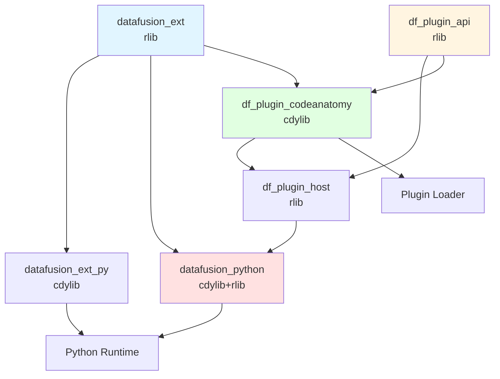
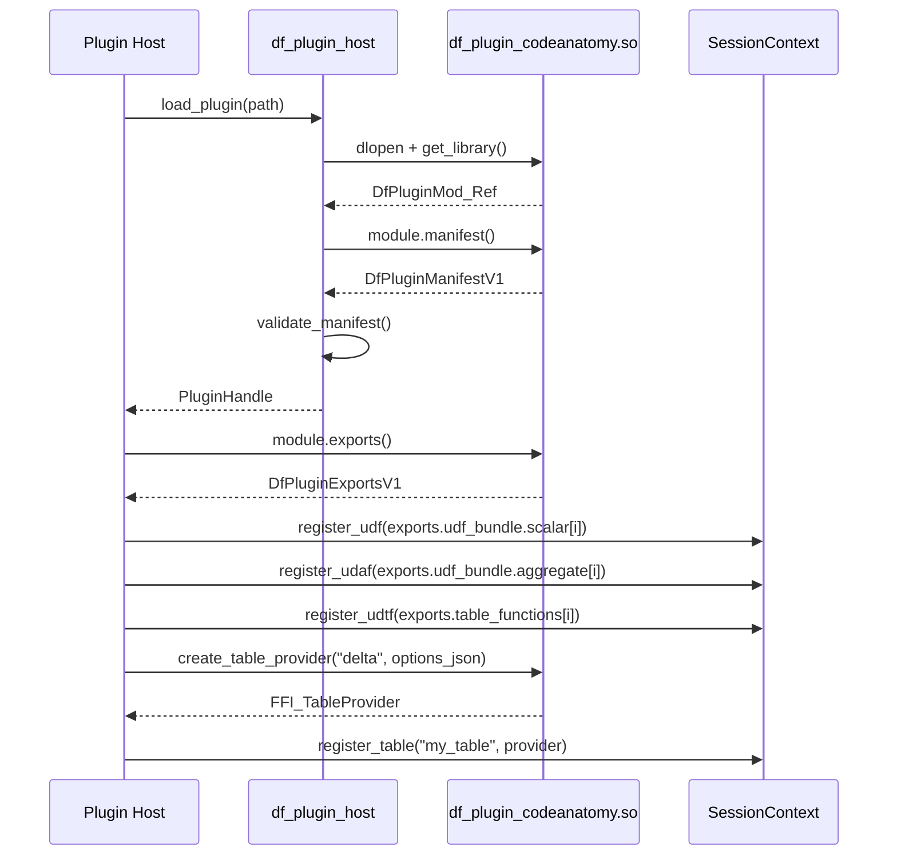
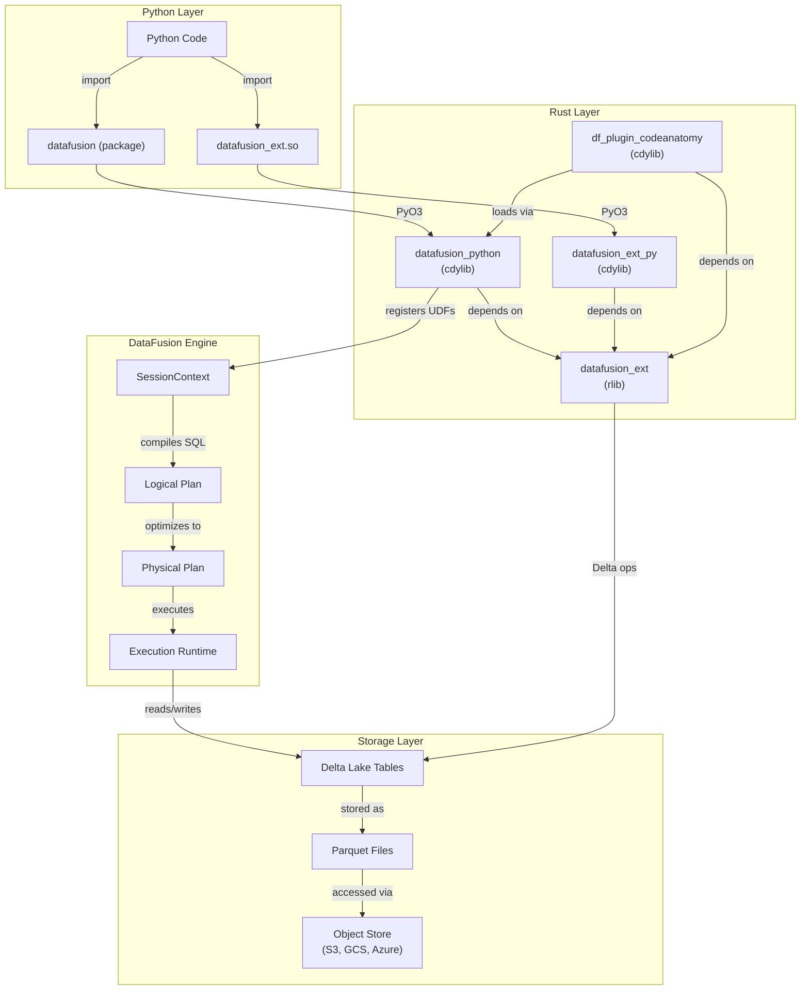

# Part VIII: Rust Architecture

## Overview

The Rust subsystem provides high-performance DataFusion extensions, custom UDFs, Delta Lake integration, and plugin infrastructure for CodeAnatomy. It consists of six crates organized as a Cargo workspace, spanning from low-level function primitives to PyO3 bindings and ABI-stable plugin interfaces.

### Design Goals

1. **Native Performance**: Implement compute-intensive operations (hashing, normalization, span arithmetic) in Rust for 10-100x speedups over Python
2. **Zero-Copy Integration**: Leverage PyArrow's C Data Interface for direct memory sharing between Python and Rust
3. **ABI Stability**: Enable plugin-based extensibility via `datafusion-ffi` and `abi_stable`
4. **Delta Lake First-Class Support**: Provide native Delta Lake operations (CDF, mutations, maintenance) with protocol enforcement
5. **Type Safety**: Use Rust's type system to enforce schema contracts and prevent runtime errors

### Technology Stack

| Component | Technology | Version | Purpose |
|-----------|------------|---------|---------|
| Query Engine | Apache DataFusion | 51.0.0 | SQL planning, execution, optimization |
| Arrow | arrow-rs | 57.1.0 | Columnar data structures, compute kernels |
| Delta Lake | deltalake-rs | 0.30.1 | Delta protocol, table operations |
| Python Bindings | PyO3 | 0.26 | Python-Rust FFI with GIL management |
| Plugin ABI | abi_stable | 0.11 | ABI-stable dynamic linking |
| Async Runtime | tokio | 1.49.0 | Async I/O, multi-threaded executor |
| Hashing | blake2 | 0.10 | BLAKE2b for stable IDs |
| Storage | object_store | 0.12.5 | Cloud storage abstraction (S3, GCS, Azure) |

---

## Workspace Structure

```
rust/
├── Cargo.toml                   # Workspace manifest with shared dependencies
├── datafusion_ext/              # Core UDF library (rlib)
├── datafusion_ext_py/           # Thin PyO3 wrapper for datafusion_ext (cdylib)
├── datafusion_python/           # Apache DataFusion Python bindings (cdylib + rlib)
├── df_plugin_api/               # ABI-stable plugin interface definitions
├── df_plugin_host/              # Plugin loading and validation
└── df_plugin_codeanatomy/       # CodeAnatomy plugin implementation (cdylib)
```

### Crate Dependency Graph



### Crate Responsibilities

#### 1. `datafusion_ext` (Core Extensions)

**Purpose**: Pure Rust library providing custom UDFs, Delta Lake operations, and DataFusion extensions.

**Crate Type**: `rlib` (Rust library)

**Key Modules**:
- `udf_custom.rs` (4983 lines) - 28 custom scalar functions
- `udf_registry.rs` (174 lines) - UDF registration specs and registry functions
- `function_factory.rs` (923 lines) - SQL macro factory for `CREATE FUNCTION`
- `delta_control_plane.rs` (514 lines) - Delta table loading, scanning
- `delta_mutations.rs` (423 lines) - Delta write/merge/delete/update
- `delta_maintenance.rs` (430 lines) - Vacuum, optimize, checkpoint
- `expr_planner.rs` (59 lines) - Custom expression planning (arrow operators)
- `registry_snapshot.rs` (974 lines) - Registry serialization/snapshotting
- `udaf_builtin.rs` (1927 lines) - Aggregate UDF wrappers
- `udf_async.rs` (254 lines) - Async UDF infrastructure (gated by `async-udf` feature)
- `macros.rs` - Spec structs and registration macros
- `planner_rules.rs` - Logical plan optimization rules
- `physical_rules.rs` - Physical plan optimization rules
- `function_rewrite.rs` - Expression rewriting infrastructure

**Features**:
- `default` - No additional features
- `async-udf` - Enable async UDF support with tokio runtime

**Dependencies**: DataFusion 51.0, deltalake 0.30.1, blake2, unicode-normalization, object_store

#### 2. `datafusion_ext_py` (Python Bindings - Thin Wrapper)

**Purpose**: Minimal PyO3 wrapper that exposes `datafusion_ext` functions to Python.

**Crate Type**: `cdylib` (C dynamic library for Python import)

**Structure**: Single file (`lib.rs`, 8 lines) that delegates to `datafusion_python::codeanatomy_ext::init_module`.

**Build Artifact**: `datafusion_ext.so` (Linux) / `datafusion_ext.pyd` (Windows)

**Crate Type**: `cdylib` + `rlib` (dual-mode for plugin and direct linking)

**Usage**:
```python
from datafusion_ext import (
    install_function_factory,
    install_expr_planners,
    delta_snapshot_info,
    delta_write_ipc,
    # ... 40+ functions
)
```

#### 3. `datafusion_python` (Apache DataFusion Python Bindings)

**Purpose**: Fork of Apache DataFusion Python bindings with CodeAnatomy extensions integrated.

**Crate Type**: `cdylib` (for Python) + `rlib` (for internal use)

**Key Additions**:
- `codeanatomy_ext.rs` - Python-facing API for all `datafusion_ext` modules
- Re-exports of `datafusion_ext` modules via `pub use`
- Integration with `df_plugin_host` for plugin loading

**Build Artifacts**:
- `_internal.so` - Core PyO3 module with DataFusion + CodeAnatomy extensions
- Python package under `python/datafusion/`

**Python Package Structure**:
```
datafusion/
├── __init__.py
├── context.py           # SessionContext, RuntimeEnv
├── dataframe.py         # DataFrame operations
├── expr.py              # Expression builders
├── functions.py         # SQL function wrappers
└── _internal.so         # Rust module
```

#### 4. `df_plugin_api` (Plugin ABI Interface)

**Purpose**: ABI-stable interface definitions for DataFusion plugins using `abi_stable` crate.

**Crate Type**: `rlib`

**Key Types**:
```rust
#[repr(C)]
#[derive(StableAbi)]
pub struct DfPluginManifestV1 {
    pub struct_size: u32,
    pub plugin_abi_major: u16,
    pub plugin_abi_minor: u16,
    pub df_ffi_major: u16,
    pub datafusion_major: u16,
    pub arrow_major: u16,
    pub plugin_name: RString,
    pub plugin_version: RString,
    pub build_id: RString,
    pub capabilities: u64,
    pub features: RVec<RString>,
}

#[repr(C)]
#[derive(StableAbi)]
pub struct DfUdfBundleV1 {
    pub scalar: RVec<FFI_ScalarUDF>,
    pub aggregate: RVec<FFI_AggregateUDF>,
    pub window: RVec<FFI_WindowUDF>,
}

#[repr(C)]
#[derive(StableAbi)]
pub struct DfPluginMod {
    pub manifest: extern "C" fn() -> DfPluginManifestV1,
    pub exports: extern "C" fn() -> DfPluginExportsV1,
    pub udf_bundle_with_options: extern "C" fn(...) -> DfResult<DfUdfBundleV1>,
    pub create_table_provider: extern "C" fn(...) -> DfResult<FFI_TableProvider>,
}
```

**Capabilities Flags**:
- `TABLE_PROVIDER` - Plugin can create table providers
- `SCALAR_UDF` - Plugin exports scalar UDFs
- `AGG_UDF` - Plugin exports aggregate UDFs
- `WINDOW_UDF` - Plugin exports window UDFs
- `TABLE_FUNCTION` - Plugin exports table functions (UDTFs)

**ABI Version**: Major: 1, Minor: 1 (defined in `manifest.rs`)

#### 5. `df_plugin_host` (Plugin Loader)

**Purpose**: Dynamic plugin loading with version validation.

**Crate Type**: `rlib`

**Key Functions**:
```rust
pub fn load_plugin(path: &Path) -> Result<PluginHandle>

pub struct PluginHandle {
    module: DfPluginMod_Ref,
    manifest: DfPluginManifestV1,
}
```

**Validation Checks**:
1. Plugin ABI major version matches host
2. Plugin ABI minor version ≤ host minor version
3. `struct_size` ≥ expected size
4. DataFusion FFI version matches
5. DataFusion major version matches
6. Arrow major version matches

**Usage Pattern**:
```rust
let plugin = load_plugin(Path::new("libdf_plugin_codeanatomy.so"))?;
let manifest = plugin.manifest();
let exports = (plugin.module().exports())();
for udf in exports.udf_bundle.scalar.iter() {
    ctx.register_udf(udf.into_arc());
}
```

#### 6. `df_plugin_codeanatomy` (CodeAnatomy Plugin)

**Purpose**: Plugin implementation bundling all CodeAnatomy UDFs and Delta table providers.

**Crate Type**: `cdylib` + `rlib`

**Exports**:
- **Table Providers**: `delta`, `delta_cdf`
- **Scalar UDFs**: All 28 custom functions from `datafusion_ext::udf_custom`
- **Aggregate UDFs**: All built-in UDAFs from `datafusion_ext::udaf_builtin`
- **Window UDFs**: All built-in UDWFs from `datafusion_ext::udwf_builtin`
- **Table Functions**: `range_table` + custom UDTFs

**Plugin Options** (JSON):
```json
{
  "enable_async": false,
  "async_udf_timeout_ms": 5000,
  "async_udf_batch_size": 1024
}
```

**Entry Point**:
```rust
#[export_root_module]
pub fn get_library() -> DfPluginMod_Ref {
    DfPluginMod {
        manifest: plugin_manifest,
        exports: plugin_exports,
        udf_bundle_with_options: plugin_udf_bundle,
        create_table_provider,
    }
    .leak_into_prefix()
}
```

---

## Custom UDF System

### Architecture Overview

The UDF system consists of four layers:

1. **Implementation Layer**: Concrete `ScalarUDFImpl` structs in `udf_custom.rs`
2. **Registration Layer**: `UdfSpec` catalog in `udf_registry.rs`
3. **Builder Layer**: Public `*_udf()` functions that construct `ScalarUDF` instances
4. **Bridge Layer**: Python bindings in `datafusion_python` and `datafusion_ext_py`

### UDF Implementation Pattern

Every custom UDF follows this structure:

```rust
// 1. UDF struct implementing ScalarUDFImpl
#[derive(Debug, PartialEq, Eq, Hash)]
struct StableHash64Udf {
    signature: Signature,
}

impl ScalarUDFImpl for StableHash64Udf {
    fn as_any(&self) -> &dyn Any { self }
    fn name(&self) -> &str { "stable_hash64" }
    fn signature(&self) -> &Signature { &self.signature }
    fn return_type(&self, arg_types: &[DataType]) -> Result<DataType> { ... }
    fn invoke_batch(&self, args: &[ColumnarValue], num_rows: usize) -> Result<ColumnarValue> { ... }

    // Optional optimizations
    fn simplify(&self, args: Vec<Expr>, info: &dyn SimplifyInfo) -> Result<ExprSimplifyResult> { ... }
    fn evaluate_bounds(&self, inputs: &[&Interval]) -> Result<Interval> { ... }
}

// 2. Public builder function
pub fn stable_hash64_udf() -> ScalarUDF {
    ScalarUDF::new_from_impl(StableHash64Udf {
        signature: Signature::variadic_any(Volatility::Immutable),
    })
}
```

### UDF Catalog (`udf_registry.rs`)

**UdfSpec Structure** (defined in `macros.rs`):
```rust
pub struct ScalarUdfSpec {
    pub name: &'static str,
    pub builder: fn() -> ScalarUDF,
    pub aliases: &'static [&'static str],
}

pub struct TableUdfSpec {
    pub name: &'static str,
    pub builder: fn(&SessionContext) -> Result<Arc<dyn TableFunctionImpl>>,
    pub aliases: &'static [&'static str],
}
```

**Registration Functions**:
```rust
pub fn scalar_udf_specs() -> Vec<ScalarUdfSpec>  // All scalar UDFs
pub fn scalar_udf_specs_with_async(enable_async: bool) -> Result<Vec<ScalarUdfSpec>>  // Conditional async
pub fn table_udf_specs() -> Vec<TableUdfSpec>  // Table functions
pub fn builtin_udafs() -> Vec<AggregateUDF>  // Aggregate functions
pub fn builtin_udwfs() -> Vec<WindowUDF>     // Window functions
pub fn register_all(ctx: &SessionContext) -> Result<()>  // Register all UDFs
pub fn register_all_with_policy(ctx: &SessionContext, enable_async: bool, ...) -> Result<()>
```

**Registration Macros**:
```rust
scalar_udfs![
    "name" => builder_function;
    "other" => other_builder, aliases: ["alias1", "alias2"];
]

table_udfs![
    "range_table" => range_table_udtf;
]
```

**UDF Categories** (28 total scalar UDFs):

1. **Metadata & Tags** (3 functions):
   - `arrow_metadata` - Extract Arrow field metadata
   - `semantic_tag` - Extract semantic metadata tag
   - `cpg_score` - Compute CPG confidence score

2. **Hashing & ID Generation** (8 functions):
   - `stable_hash64`, `stable_hash128` - BLAKE2b-based deterministic hashing
   - `prefixed_hash64`, `prefixed_hash_parts64` - Prefixed hash with namespace
   - `stable_id`, `stable_id_parts` - Hex-encoded BLAKE2b IDs
   - `stable_hash_any` - Type-agnostic stable hashing
   - `span_id` - Composite ID from path + span

3. **Span Arithmetic** (5 functions):
   - `span_make` - Construct span from (bstart, bend)
   - `span_len` - Compute span length
   - `span_overlaps` - Check if two spans overlap
   - `span_contains` - Check if span A contains span B
   - `interval_align_score` - Alignment quality metric

4. **String Normalization** (3 functions):
   - `utf8_normalize` - Unicode normalization (NFC, NFD, NFKC, NFKD)
   - `utf8_null_if_blank` - Convert empty/whitespace strings to NULL
   - `qname_normalize` - Qualified name canonicalization

5. **Collection Utilities** (4 functions):
   - `list_compact` - Remove NULLs from list
   - `list_unique_sorted` - Deduplicate and sort list
   - `map_get_default` - Map lookup with default value
   - `map_normalize` - Normalize map keys/values

6. **Struct Utilities** (1 function):
   - `struct_pick` - Extract subset of struct fields

7. **Delta CDF Utilities** (3 functions):
   - `cdf_change_rank` - Compute change sequence rank
   - `cdf_is_upsert` - Detect upsert operations
   - `cdf_is_delete` - Detect delete operations

8. **Type Conversion** (1 function):
   - `col_to_byte` - Convert column value to bytes

### UDF Built-in Wrappers (`udf_builtin.rs`)

Provides ergonomic wrappers around DataFusion's built-in functions:

```rust
pub fn map_entries(expr: Expr) -> Expr
pub fn map_keys(expr: Expr) -> Expr
pub fn map_values(expr: Expr) -> Expr
pub fn map_extract(expr: Expr, key: &str) -> Expr
pub fn list_extract(expr: Expr, index: i64) -> Expr
pub fn first_value_agg(expr: Expr) -> Expr
pub fn string_agg(value: Expr, delimiter: Expr) -> Expr
pub fn row_number_window(_value: Expr) -> Expr
pub fn union_tag(expr: Expr) -> Expr
```

### Async UDF Support (`udf_async.rs`)

**Feature Gate**: `async-udf` (disabled by default)

**Architecture**:
```rust
pub struct AsyncUdfPolicy {
    pub ideal_batch_size: Option<usize>,
    pub timeout: Option<Duration>,
}

pub fn set_async_udf_policy(
    ideal_batch_size: Option<usize>,
    timeout_ms: Option<u64>,
) -> Result<()>

// Example async UDF
#[async_trait]
impl AsyncScalarUDFImpl for AsyncEchoUdf {
    async fn invoke_batch_async(
        &self,
        args: &[ColumnarValue],
        num_rows: usize,
    ) -> Result<ColumnarValue> {
        // Async operation (e.g., HTTP fetch, DB query)
        tokio::time::sleep(Duration::from_millis(1)).await;
        Ok(args[0].clone())
    }
}
```

**Use Cases**:
- HTTP API calls during query execution
- Async database lookups
- External service integration (LLM APIs, vector stores)

### Function Factory (`function_factory.rs`)

**Purpose**: Implements DataFusion's `FunctionFactory` trait to support `CREATE FUNCTION` SQL statements.

**SQL Macro Support**:
```sql
-- Scalar macro
CREATE FUNCTION add_one(x INT) RETURNS INT LANGUAGE sql AS 'x + 1';

-- Aggregate macro
CREATE FUNCTION sum_squares(x DOUBLE) RETURNS DOUBLE LANGUAGE aggregate AS 'SUM(x * x)';

-- Window macro
CREATE FUNCTION rank_by_salary() RETURNS INT LANGUAGE window AS 'RANK()';
```

**Implementation Strategy**:
1. Parse `CREATE FUNCTION` statement
2. Extract function body expression
3. Wrap in `MacroScalarUdf` / `MacroAggregateUdf` / `MacroWindowUdf`
4. Substitute parameters on each invocation
5. Evaluate wrapped expression

**Function Kind Inference**:
- `LANGUAGE sql` → infer from body (default: scalar)
- `LANGUAGE aggregate` → force aggregate interpretation
- `LANGUAGE window` → force window interpretation
- Body contains `AggregateFunction` → aggregate
- Body contains `WindowFunction` → window

---

## Delta Lake Integration

### Control Plane (`delta_control_plane.rs`)

**Purpose**: Table loading, snapshot inspection, scan planning, and CDF provider creation.

**Key Functions**:

```rust
pub async fn load_delta_table(
    table_uri: &str,
    storage_options: Option<HashMap<String, String>>,
    version: Option<i64>,
    timestamp: Option<String>,
    session_ctx: Option<&SessionContext>,
) -> Result<DeltaTable, DeltaTableError>

pub async fn snapshot_info_with_gate(
    table_uri: &str,
    storage_options: Option<HashMap<String, String>>,
    version: Option<i64>,
    timestamp: Option<String>,
    gate: Option<DeltaFeatureGate>,
) -> Result<DeltaSnapshotInfo, DeltaTableError>

pub async fn delta_provider_from_session(
    table_uri: &str,
    storage_options: Option<HashMap<String, String>>,
    version: Option<i64>,
    timestamp: Option<String>,
    overrides: DeltaScanOverrides,
    gate: Option<DeltaFeatureGate>,
    session_ctx: &SessionContext,
) -> Result<DeltaTableProvider, DeltaTableError>

pub async fn delta_cdf_provider(
    table_uri: &str,
    storage_options: Option<HashMap<String, String>>,
    version: Option<i64>,
    timestamp: Option<String>,
    options: DeltaCdfScanOptions,
    gate: Option<DeltaFeatureGate>,
) -> Result<(DeltaCdfTableProvider, DeltaSnapshotInfo), DeltaTableError>
```

**Scan Overrides**:
```rust
pub struct DeltaScanOverrides {
    pub file_column_name: Option<String>,          // Add _file column
    pub enable_parquet_pushdown: Option<bool>,     // Pushdown filters to Parquet
    pub schema_force_view_types: Option<bool>,     // Force logical types
    pub wrap_partition_values: Option<bool>,       // Wrap partitions in struct
    pub schema: Option<SchemaRef>,                 // Override schema
}
```

**CDF Scan Options**:
```rust
pub struct DeltaCdfScanOptions {
    pub starting_version: Option<i64>,
    pub ending_version: Option<i64>,
    pub starting_timestamp: Option<String>,
    pub ending_timestamp: Option<String>,
    pub allow_out_of_range: bool,
}
```

**Add Action Extraction**:
```rust
pub fn add_actions_for_paths(
    table: &DeltaTable,
    paths: &[String],
) -> Result<Vec<Add>, DeltaTableError>

pub struct DeltaAddActionPayload {
    pub path: String,
    pub size: i64,
    pub modification_time: i64,
    pub data_change: bool,
    pub partition_values: BTreeMap<String, Option<String>>,
    pub stats: Option<String>,
    pub tags: BTreeMap<String, Option<String>>,
}
```

### Protocol Enforcement (`delta_protocol.rs`)

**Purpose**: Delta protocol version and feature validation.

**Feature Gate**:
```rust
pub struct DeltaFeatureGate {
    pub min_reader_version: Option<i32>,
    pub min_writer_version: Option<i32>,
    pub required_reader_features: Option<Vec<String>>,
    pub required_writer_features: Option<Vec<String>>,
}

pub fn gate_from_parts(
    min_reader_version: Option<i32>,
    min_writer_version: Option<i32>,
    required_reader_features: Option<Vec<String>>,
    required_writer_features: Option<Vec<String>>,
) -> DeltaFeatureGate

pub fn protocol_gate(
    snapshot: &DeltaSnapshotInfo,
    gate: &DeltaFeatureGate,
) -> Result<(), DeltaTableError>
```

**Snapshot Info**:
```rust
pub struct DeltaSnapshotInfo {
    pub table_id: String,
    pub version: i64,
    pub timestamp: i64,
    pub num_files: i64,
    pub size_bytes: i64,
    pub min_reader_version: i32,
    pub min_writer_version: i32,
    pub reader_features: Vec<String>,
    pub writer_features: Vec<String>,
}
```

**Validation Logic**:
1. Check reader version ≥ gate min_reader_version
2. Check writer version ≥ gate min_writer_version
3. Verify all required reader features are present in snapshot
4. Verify all required writer features are present in snapshot

### Mutations (`delta_mutations.rs`)

**Purpose**: Data modification operations (write, merge, update, delete).

**Write Operations**:
```rust
pub async fn delta_write_ipc(
    table_uri: &str,
    storage_options: Option<HashMap<String, String>>,
    ipc_payload: &[u8],
    write_options: DeltaAppTransaction,
) -> Result<DeltaMutationReport, DeltaTableError>

pub struct DeltaAppTransaction {
    pub mode: String,                              // "append", "overwrite", "error", "ignore"
    pub partition_by: Vec<String>,
    pub name: Option<String>,
    pub description: Option<String>,
    pub configuration: HashMap<String, Option<String>>,
    pub overwrite_schema: bool,
    pub commit_options: DeltaCommitOptions,
}

pub struct DeltaCommitOptions {
    pub max_commit_retries: Option<usize>,
    pub engine_info: Option<String>,
    pub user_metadata: Option<HashMap<String, String>>,
}
```

**Merge Operation**:
```rust
pub async fn delta_merge(
    table_uri: &str,
    storage_options: Option<HashMap<String, String>>,
    source_ipc: &[u8],
    predicate: String,
    match_operations: Vec<String>,
    not_match_operations: Vec<String>,
    commit_options: DeltaCommitOptions,
    session_ctx: &SessionContext,
) -> Result<DeltaMutationReport, DeltaTableError>
```

**Update/Delete**:
```rust
pub async fn delta_update(
    table_uri: &str,
    storage_options: Option<HashMap<String, String>>,
    updates: HashMap<String, String>,
    predicate: Option<String>,
    commit_options: DeltaCommitOptions,
    session_ctx: &SessionContext,
) -> Result<DeltaMutationReport, DeltaTableError>

pub async fn delta_delete(
    table_uri: &str,
    storage_options: Option<HashMap<String, String>>,
    predicate: Option<String>,
    commit_options: DeltaCommitOptions,
    session_ctx: &SessionContext,
) -> Result<DeltaMutationReport, DeltaTableError>
```

**Mutation Report**:
```rust
pub struct DeltaMutationReport {
    pub num_added_files: usize,
    pub num_removed_files: usize,
    pub num_updated_files: usize,
    pub num_copied_files: usize,
    pub execution_duration_ms: i64,
    pub scan_duration_ms: i64,
    pub rewrite_duration_ms: i64,
}
```

### Maintenance (`delta_maintenance.rs`)

**Purpose**: Table maintenance operations (vacuum, optimize, checkpoint, restore).

**Vacuum**:
```rust
pub async fn delta_vacuum(
    table_uri: &str,
    storage_options: Option<HashMap<String, String>>,
    retention_hours: Option<i64>,
    enforce_retention_duration: bool,
    dry_run: bool,
) -> Result<DeltaMaintenanceReport, DeltaTableError>
```

**Optimize (Compaction)**:
```rust
pub async fn delta_optimize_compact(
    table_uri: &str,
    storage_options: Option<HashMap<String, String>>,
    partition_filters: Vec<String>,
    target_size: Option<i64>,
    max_concurrent_tasks: Option<usize>,
    min_commit_interval: Option<u64>,
    max_spill_size: Option<usize>,
    session_ctx: &SessionContext,
) -> Result<DeltaMaintenanceReport, DeltaTableError>
```

**Checkpoint**:
```rust
pub async fn delta_create_checkpoint(
    table_uri: &str,
    storage_options: Option<HashMap<String, String>>,
) -> Result<DeltaMaintenanceReport, DeltaTableError>
```

**Restore**:
```rust
pub async fn delta_restore(
    table_uri: &str,
    storage_options: Option<HashMap<String, String>>,
    version: Option<i64>,
    timestamp: Option<String>,
    ignore_missing_files: bool,
    protocol_downgrade_allowed: bool,
) -> Result<DeltaMaintenanceReport, DeltaTableError>
```

**Feature/Constraint Management**:
```rust
pub async fn delta_add_features(
    table_uri: &str,
    storage_options: Option<HashMap<String, String>>,
    reader_features: Vec<String>,
    writer_features: Vec<String>,
    allow_protocol_versions_increase: bool,
) -> Result<DeltaMaintenanceReport, DeltaTableError>

pub async fn delta_add_constraints(
    table_uri: &str,
    storage_options: Option<HashMap<String, String>>,
    constraints: HashMap<String, String>,
) -> Result<DeltaMaintenanceReport, DeltaTableError>

pub async fn delta_drop_constraints(
    table_uri: &str,
    storage_options: Option<HashMap<String, String>>,
    constraint_names: Vec<String>,
    raise_if_not_exists: bool,
) -> Result<DeltaMaintenanceReport, DeltaTableError>
```

### Observability (`delta_observability.rs`)

**Purpose**: Serialize Delta operations to Arrow IPC for observability.

**Payload Functions**:
```rust
pub fn snapshot_payload(info: &DeltaSnapshotInfo) -> Result<Vec<u8>>
pub fn scan_config_payload(config: &DeltaScanConfig) -> Result<Vec<u8>>
pub fn add_action_payloads(actions: &[DeltaAddActionPayload]) -> Result<Vec<u8>>
pub fn maintenance_report_payload(report: &DeltaMaintenanceReport) -> Result<Vec<u8>>
pub fn mutation_report_payload(report: &DeltaMutationReport) -> Result<Vec<u8>>
```

**Schema Functions**:
```rust
pub fn scan_config_schema_ipc() -> Vec<u8>
```

**Usage Pattern**:
```rust
let snapshot = delta_snapshot_info(&table_uri, &table).await?;
let payload = snapshot_payload(&snapshot)?;
// Send to observability pipeline (OpenTelemetry, log aggregation, etc.)
```

---

## Plugin Architecture

### Design Rationale

The plugin system enables:

1. **Independent Deployment**: Update UDFs without rebuilding main application
2. **Version Isolation**: Multiple plugin versions coexist in same process
3. **Language Interop**: C ABI allows non-Rust languages to provide DataFusion extensions
4. **Sandboxing**: Plugins cannot corrupt host memory (via `abi_stable` checks)

### Plugin Lifecycle



### Manifest Validation

**Version Compatibility Matrix**:

| Host ABI | Plugin ABI | Compatible? | Reason |
|----------|------------|-------------|--------|
| 1.0 | 1.0 | ✓ | Exact match |
| 1.0 | 1.1 | ✓ | Minor forward compat |
| 1.1 | 1.0 | ✓ | Host supports older minor |
| 1.0 | 2.0 | ✗ | Major version mismatch |
| 2.0 | 1.0 | ✗ | Major version mismatch |

**Struct Size Validation**:
```rust
let expected_size = size_of::<DfPluginManifestV1>() as u32;
if manifest.struct_size < expected_size {
    return Err("Plugin manifest struct too small");
}
```

This allows plugin structs to be larger (future fields) but not smaller (missing required fields).

### FFI Types

**DataFusion FFI Crate** (`datafusion-ffi`):
```rust
pub struct FFI_ScalarUDF { /* opaque */ }
pub struct FFI_AggregateUDF { /* opaque */ }
pub struct FFI_WindowUDF { /* opaque */ }
pub struct FFI_TableFunction { /* opaque */ }
pub struct FFI_TableProvider { /* opaque */ }

impl From<Arc<dyn ScalarUDFImpl>> for FFI_ScalarUDF { ... }
impl FFI_ScalarUDF {
    pub fn into_arc(self) -> Arc<dyn ScalarUDFImpl> { ... }
}
```

**Conversion Pattern**:
```rust
// Plugin side (export)
let udf = stable_hash64_udf();
let ffi_udf = FFI_ScalarUDF::from(Arc::new(udf));

// Host side (import)
let arc_udf: Arc<dyn ScalarUDFImpl> = ffi_udf.into_arc();
ctx.register_udf(ScalarUDF::new_from_impl(arc_udf));
```

### Plugin Configuration

**Table Provider Options** (Delta example):
```json
{
  "table_uri": "s3://bucket/delta/table",
  "storage_options": {
    "AWS_REGION": "us-west-2",
    "AWS_ACCESS_KEY_ID": "...",
    "AWS_SECRET_ACCESS_KEY": "..."
  },
  "version": 42,
  "file_column_name": "_file",
  "enable_parquet_pushdown": true,
  "min_reader_version": 3,
  "required_reader_features": ["columnMapping"]
}
```

**UDF Bundle Options**:
```json
{
  "enable_async": true,
  "async_udf_timeout_ms": 5000,
  "async_udf_batch_size": 1024
}
```

---

## PyO3 Bindings

### Architecture

```
Python Process
├── datafusion (Python package)
│   ├── context.py
│   ├── dataframe.py
│   ├── expr.py
│   └── _internal.so  ←─ datafusion_python (cdylib)
│       └── datafusion_ext (rlib)
│
└── datafusion_ext.so  ←─ datafusion_ext_py (cdylib)
    └── datafusion_ext (rlib)
```

### Key PyO3 Patterns

#### 1. Module Registration

**datafusion_python/src/lib.rs**:
```rust
#[pymodule]
fn _internal(py: Python, m: Bound<'_, PyModule>) -> PyResult<()> {
    pyo3_log::init();

    m.add_class::<context::PySessionContext>()?;
    m.add_class::<dataframe::PyDataFrame>()?;
    m.add_class::<expr::PyExpr>()?;

    let catalog = PyModule::new(py, "catalog")?;
    catalog::init_module(&catalog)?;
    m.add_submodule(&catalog)?;

    Ok(())
}
```

**datafusion_ext_py/src/lib.rs**:
```rust
#[pymodule]
fn datafusion_ext(py: Python<'_>, module: &Bound<'_, PyModule>) -> PyResult<()> {
    datafusion_python::codeanatomy_ext::init_module(py, module)
}
```

#### 2. GIL Management

**Allow Threads** (release GIL for Rust work):
```rust
#[pyfunction]
fn delta_snapshot_info(
    py: Python,
    table_uri: String,
    storage_options: Option<Vec<(String, String)>>,
    version: Option<i64>,
    timestamp: Option<String>,
    // ...
) -> PyResult<Py<PyBytes>> {
    py.allow_threads(|| {
        let runtime = runtime()?;
        let result = runtime.block_on(async {
            snapshot_info_with_gate(...).await
        });
        // Convert to Python bytes
    })
}
```

**Acquire GIL** (for Python callbacks):
```rust
Python::with_gil(|py| {
    let py_callback = callback.as_ref(py);
    let result = py_callback.call1((arg,))?;
    // Process result
})
```

#### 3. Arrow IPC Bridge

**Rust to Python**:
```rust
use arrow::ipc::writer::StreamWriter;

fn record_batch_to_ipc(batch: RecordBatch) -> PyResult<Py<PyBytes>> {
    let mut writer = StreamWriter::try_new(Vec::new(), &batch.schema())?;
    writer.write(&batch)?;
    writer.finish()?;
    let bytes = writer.into_inner()?;

    Python::with_gil(|py| Ok(PyBytes::new(py, &bytes).into()))
}
```

**Python to Rust**:
```rust
use arrow::ipc::reader::StreamReader;

fn ipc_to_record_batch(ipc_bytes: &[u8]) -> PyResult<RecordBatch> {
    let cursor = std::io::Cursor::new(ipc_bytes);
    let mut reader = StreamReader::try_new(cursor, None)?;
    let batch = reader.next()
        .ok_or_else(|| PyValueError::new_err("Empty IPC stream"))??;
    Ok(batch)
}
```

#### 4. Python Types Conversion

**Owned vs Borrowed**:
```rust
// Owned (takes ownership)
#[pyfunction]
fn process_string(s: String) -> String {
    s.to_uppercase()
}

// Borrowed (no copy)
#[pyfunction]
fn process_string_ref(s: &str) -> String {
    s.to_uppercase()
}

// PyAny for dynamic types
#[pyfunction]
fn process_any(obj: &Bound<'_, PyAny>) -> PyResult<String> {
    if let Ok(s) = obj.extract::<String>() {
        Ok(s)
    } else if let Ok(i) = obj.extract::<i64>() {
        Ok(i.to_string())
    } else {
        Err(PyTypeError::new_err("Expected str or int"))
    }
}
```

**Collections**:
```rust
// Python list → Rust Vec
#[pyfunction]
fn sum_list(items: Vec<i64>) -> i64 {
    items.iter().sum()
}

// Python dict → Rust HashMap
#[pyfunction]
fn process_dict(mapping: HashMap<String, i64>) -> i64 {
    mapping.values().sum()
}

// Rust Vec → Python list
fn rust_vec_to_py_list(py: Python, vec: Vec<String>) -> PyResult<Py<PyList>> {
    let py_list = PyList::new(py, vec.iter());
    Ok(py_list.into())
}
```

### CodeAnatomy Extensions Module

**datafusion_python/src/codeanatomy_ext.rs** (excerpt):
```rust
pub fn init_module(py: Python<'_>, module: &Bound<'_, PyModule>) -> PyResult<()> {
    // UDF installation
    module.add_function(wrap_pyfunction!(install_function_factory, module)?)?;
    module.add_function(wrap_pyfunction!(install_expr_planners, module)?)?;

    // Delta operations
    module.add_function(wrap_pyfunction!(delta_snapshot_info, module)?)?;
    module.add_function(wrap_pyfunction!(delta_add_actions, module)?)?;
    module.add_function(wrap_pyfunction!(delta_write_ipc, module)?)?;
    module.add_function(wrap_pyfunction!(delta_merge, module)?)?;
    module.add_function(wrap_pyfunction!(delta_update, module)?)?;
    module.add_function(wrap_pyfunction!(delta_delete, module)?)?;
    module.add_function(wrap_pyfunction!(delta_vacuum, module)?)?;
    module.add_function(wrap_pyfunction!(delta_optimize_compact, module)?)?;

    // Plugin loading
    module.add_function(wrap_pyfunction!(load_plugin_from_path, module)?)?;

    Ok(())
}

#[pyfunction]
fn install_function_factory(
    ctx: &PySessionContext,
    policy_ipc: &[u8],
) -> PyResult<()> {
    let ctx_ref = ctx.ctx();
    udf_custom::install_function_factory_native(&ctx_ref, policy_ipc)
        .map_err(to_pyerr)?;
    Ok(())
}
```

### Python Usage

**Session Initialization**:
```python
from datafusion import SessionContext
from datafusion_ext import install_sql_macro_factory, install_expr_planners

ctx = SessionContext()

# Install SQL macro factory for CREATE FUNCTION support
install_sql_macro_factory(ctx)

# Install expression planners (arrow operators, array containment)
install_expr_planners(ctx, ["codeanatomy_domain"])

# Now custom functions are available
df = ctx.sql("SELECT stable_hash64(col1, col2) FROM table")
```

**Delta Operations**:
```python
from datafusion_ext import delta_snapshot_info, delta_write_ipc

# Inspect Delta table
snapshot = delta_snapshot_info(
    table_uri="s3://bucket/table",
    storage_options=[("AWS_REGION", "us-west-2")],
    version=None,
    timestamp=None,
)
print(f"Version: {snapshot['version']}, Files: {snapshot['num_files']}")

# Write to Delta
import pyarrow as pa
batch = pa.record_batch(...)
ipc_bytes = serialize_to_ipc(batch)

delta_write_ipc(
    table_uri="s3://bucket/table",
    storage_options=[("AWS_REGION", "us-west-2")],
    ipc_payload=ipc_bytes,
    mode="append",
    partition_by=["year", "month"],
)
```

---

## Expression Planner and Function Rewrite

### Expression Planner (`expr_planner.rs`)

**Purpose**: Custom SQL operator overloading for domain-specific types.

**Supported Operators**:

1. **Arrow Operators** (`->`, `->>`, `#>`, `#>>`) → `get_field()`
   - `struct_col -> 'field'` extracts field from struct
   - `map_col -> 'key'` extracts value from map

2. **Array Containment** (`@>`, `<@`) → `array_has_all()`
   - `array1 @> array2` checks if array1 contains all elements of array2
   - `array1 <@ array2` checks if all elements of array1 are in array2

**Implementation**:
```rust
impl ExprPlanner for CodeAnatomyDomainPlanner {
    fn plan_binary_op(
        &self,
        expr: RawBinaryExpr,
        schema: &DFSchema,
    ) -> Result<PlannerResult<RawBinaryExpr>> {
        let RawBinaryExpr { op, left, right } = expr;

        // Rewrite `->` to get_field() for struct/map types
        if is_arrow_operator(&op) && can_use_get_field(&left, schema)? {
            let planned = Expr::ScalarFunction(
                ScalarFunction::new_udf(get_field_udf(), vec![left, right])
            );
            return Ok(PlannerResult::Planned(planned));
        }

        // Rewrite `@>` / `<@` to array_has_all() for arrays
        if matches!(op, BinaryOperator::AtArrow | BinaryOperator::ArrowAt) {
            let left_ndims = list_ndims(&left.get_type(schema)?);
            let right_ndims = list_ndims(&right.get_type(schema)?);
            if left_ndims > 0 && right_ndims > 0 {
                let planned = if op == BinaryOperator::AtArrow {
                    array_has_all(left, right)
                } else {
                    array_has_all(right, left)
                };
                return Ok(PlannerResult::Planned(planned));
            }
        }

        Ok(PlannerResult::Original(expr))
    }
}
```

**SQL Examples**:
```sql
-- Struct field access
SELECT node_props -> 'name' AS node_name FROM cpg_nodes;

-- Map value lookup
SELECT metadata #> 'tags' -> 'author' AS author FROM files;

-- Array containment
SELECT * FROM edges WHERE tags @> ARRAY['inferred', 'high_confidence'];
```

### Function Rewrite (`function_rewrite.rs`)

**Purpose**: Post-parsing expression rewriting for optimization and normalization.

**Use Cases**:
1. Constant folding for custom functions
2. Identity elimination (e.g., `utf8_normalize(col, 'NFKC')` when already normalized)
3. Null propagation shortcuts
4. Type coercion insertion

**Example**:
```rust
impl FunctionRewrite for CodeAnatomyOperatorRewrite {
    fn rewrite(
        &self,
        expr: Expr,
        schema: &DFSchema,
        config: &ConfigOptions,
    ) -> Result<RewrittenExpr> {
        match &expr {
            Expr::ScalarFunction(func) if func.name() == "stable_hash64" => {
                // If all args are literals, compute hash at plan time
                if func.args.iter().all(|arg| matches!(arg, Expr::Literal(_))) {
                    let hash = compute_hash_const(&func.args)?;
                    return Ok(RewrittenExpr::Rewritten(lit(hash)));
                }
            }
            _ => {}
        }
        Ok(RewrittenExpr::Unchanged(expr))
    }
}
```

---

## Registry Snapshot (`registry_snapshot.rs`)

**Purpose**: Serialize and snapshot UDF/UDAF/UDTF registries for reproducibility.

**Key Functions**:
```rust
pub fn snapshot_scalar_udfs(
    registry: &dyn FunctionRegistry,
) -> Result<Vec<ScalarUdfSnapshot>>

pub fn snapshot_aggregate_udafs(
    registry: &dyn FunctionRegistry,
) -> Result<Vec<AggregateUdfSnapshot>>

pub fn snapshot_table_functions(
    registry: &dyn FunctionRegistry,
) -> Result<Vec<TableFunctionSnapshot>>

pub struct ScalarUdfSnapshot {
    pub name: String,
    pub aliases: Vec<String>,
    pub signature: String,
    pub return_type: String,
    pub volatility: String,
    pub documentation: Option<String>,
}
```

**Use Case**:
```rust
let snapshot = snapshot_scalar_udfs(&ctx.state().scalar_functions())?;
let json = serde_json::to_string(&snapshot)?;
// Store in plan bundle for deterministic replay
```

---

## Async Runtime (`async_runtime.rs`)

**Purpose**: Shared Tokio runtime for async operations.

**Implementation**:
```rust
use std::sync::OnceLock;
use tokio::runtime::Runtime;

static SHARED_RUNTIME: OnceLock<Runtime> = OnceLock::new();

pub fn shared_runtime() -> &'static Runtime {
    SHARED_RUNTIME.get_or_init(|| {
        tokio::runtime::Builder::new_multi_thread()
            .worker_threads(4)
            .thread_name("datafusion-async")
            .enable_all()
            .build()
            .expect("Failed to create Tokio runtime")
    })
}
```

**Usage**:
```rust
let runtime = shared_runtime();
let result = runtime.block_on(async {
    load_delta_table(...).await
});
```

**Thread Safety**: `OnceLock` ensures runtime is initialized exactly once, safe for concurrent access.

---

## Error Handling

### Error Types

**datafusion_ext/src/errors.rs**:
```rust
use datafusion_common::DataFusionError;

pub type Result<T> = std::result::Result<T, DataFusionError>;

pub fn to_df_error(msg: impl Into<String>) -> DataFusionError {
    DataFusionError::External(Box::new(std::io::Error::new(
        std::io::ErrorKind::Other,
        msg.into()
    )))
}
```

**datafusion_python/src/errors.rs**:
```rust
use pyo3::exceptions::{PyException, PyValueError};

pub type ExtResult<T> = Result<T, ExtError>;

#[derive(Debug)]
pub struct ExtError(pub String);

impl From<ExtError> for PyErr {
    fn from(err: ExtError) -> PyErr {
        PyException::new_err(err.0)
    }
}

pub fn to_datafusion_err(err: impl std::fmt::Display) -> DataFusionError {
    DataFusionError::External(Box::new(std::io::Error::new(
        std::io::ErrorKind::Other,
        err.to_string()
    )))
}
```

### Error Propagation Pattern

```rust
// Rust internal errors
fn internal_operation() -> Result<i64, DataFusionError> {
    let value = risky_operation()
        .map_err(|e| DataFusionError::Execution(format!("Failed: {e}")))?;
    Ok(value)
}

// PyO3 boundary
#[pyfunction]
fn py_operation(py: Python) -> PyResult<i64> {
    py.allow_threads(|| {
        internal_operation()
            .map_err(|e| PyException::new_err(e.to_string()))
    })
}
```

---

## UDF Configuration (`udf_config.rs`)

**Purpose**: Global UDF behavior configuration via DataFusion config system.

**Config Keys**:
```rust
pub const CODEANATOMY_UDF_CONFIG_PREFIX: &str = "datafusion.codeanatomy.udf";

pub enum UdfConfigValue {
    Bool(bool),
    Int(i64),
    String(String),
}

pub trait CodeAnatomyUdfConfig {
    fn set_udf_config(&mut self, key: &str, value: UdfConfigValue) -> Result<()>;
    fn get_udf_config(&self, key: &str) -> Option<UdfConfigValue>;
}

impl CodeAnatomyUdfConfig for ConfigOptions {
    fn set_udf_config(&mut self, key: &str, value: UdfConfigValue) -> Result<()> {
        let full_key = format!("{}.{}", CODEANATOMY_UDF_CONFIG_PREFIX, key);
        match value {
            UdfConfigValue::Bool(b) => self.set_bool(&full_key, b),
            UdfConfigValue::Int(i) => self.set_i64(&full_key, i),
            UdfConfigValue::String(s) => self.set_str(&full_key, &s),
        }
    }

    fn get_udf_config(&self, key: &str) -> Option<UdfConfigValue> {
        let full_key = format!("{}.{}", CODEANATOMY_UDF_CONFIG_PREFIX, key);
        // Try each type...
    }
}
```

**Example Config Keys**:
- `datafusion.codeanatomy.udf.normalize_form` → "NFKC" (default Unicode normalization)
- `datafusion.codeanatomy.udf.hash_encoding` → "hex" | "base64"
- `datafusion.codeanatomy.udf.span_precision` → i64 (byte vs character offsets)

---

## UDF Documentation (`udf_docs.rs`)

**Purpose**: Extract structured documentation from UDF implementations.

**Documentation Format** (via `datafusion_macros::user_doc`):
```rust
#[user_doc(
    doc_section(label = "Hash Functions"),
    description = "Compute BLAKE2b hash of input values, returning 64-bit unsigned integer.",
    syntax_example = "stable_hash64(value1, value2, ...)",
    standard_argument(name = "value", prefix = "Any")
)]
struct StableHash64Udf { ... }
```

**Extraction**:
```rust
pub fn extract_udf_documentation(udf: &ScalarUDF) -> Option<UdfDocumentation> {
    let doc = udf.inner().documentation()?;
    Some(UdfDocumentation {
        name: udf.name().to_string(),
        description: doc.description.clone(),
        syntax_example: doc.syntax_example.clone(),
        arguments: doc.arguments.clone(),
        related_functions: doc.related_udfs.clone(),
    })
}
```

**Use Case**: Generate Markdown reference docs or in-app help.

---

## UDAF Built-ins (`udaf_builtin.rs`)

**Purpose**: Wrappers around DataFusion aggregate functions for registration.

**Key UDAFs** (1906 lines):
- `sum`, `count`, `avg`, `min`, `max`
- `stddev`, `stddev_pop`, `variance`, `var_pop`
- `covar_samp`, `covar_pop`, `corr`
- `approx_distinct`, `approx_median`, `approx_percentile_cont`
- `array_agg`, `string_agg`
- `bit_and`, `bit_or`, `bit_xor`, `bool_and`, `bool_or`
- `first_value`, `last_value`
- `grouping` (for GROUPING SETS)
- `median` (exact)
- `regr_*` functions (regression)

**Registration Pattern**:
```rust
pub fn builtin_udafs() -> Vec<AggregateUDF> {
    vec![
        AggregateUDF::from(datafusion_functions_aggregate::sum::sum_udaf()),
        AggregateUDF::from(datafusion_functions_aggregate::count::count_udaf()),
        // ... all built-ins
    ]
}
```

---

## UDTF Built-ins (`udtf_builtin.rs`, `udtf_external.rs`)

**Purpose**: Table-valued functions (functions returning tables).

**Built-in UDTFs**:
- `range(start, stop, step)` - Generate series of integers
- `unnest(array)` - Flatten array into rows

**External UDTF Interface**:
```rust
pub trait ExternalTableFunction {
    fn name(&self) -> &str;
    fn signature(&self) -> &Signature;
    fn call(&self, args: &[ScalarValue]) -> Result<Arc<dyn TableProvider>>;
}
```

**Example**:
```sql
SELECT * FROM range(1, 100, 2);  -- Odd numbers 1 to 99
SELECT * FROM unnest(ARRAY[1, 2, 3]) AS t(value);
```

---

## UDWF Built-ins (`udwf_builtin.rs`)

**Purpose**: Window function wrappers.

**Built-in UDWFs**:
- `row_number()`, `rank()`, `dense_rank()`, `percent_rank()`, `cume_dist()`
- `ntile(n)`
- `lag(expr, offset, default)`, `lead(expr, offset, default)`
- `first_value(expr)`, `last_value(expr)`, `nth_value(expr, n)`

**Registration Pattern**:
```rust
pub fn builtin_udwfs() -> Vec<WindowUDF> {
    vec![
        WindowUDF::from(datafusion_functions_window::row_number::row_number_udwf()),
        WindowUDF::from(datafusion_functions_window::rank::rank_udwf()),
        // ... all built-ins
    ]
}
```

---

## Data Flow Diagram



---

## Build Configuration

### Workspace Dependencies (Cargo.toml)

```toml
[workspace.dependencies]
arrow = "57.1.0"
datafusion = { version = "51.0.0", default-features = false, features = ["parquet"] }
deltalake = { version = "0.30.1", features = ["datafusion"] }
pyo3 = "0.26"
tokio = { version = "1.49.0", features = ["rt-multi-thread"] }
blake2 = "0.10"
serde = { version = "1", features = ["derive"] }
serde_json = "1"
```

### Feature Flags

**datafusion_ext**:
- `default` = []
- `async-udf` = [] (enables async UDF support)

**datafusion_python**:
- `default` = ["mimalloc"]
- `async-udf` = ["datafusion_ext/async-udf"]
- `mimalloc` = ["dep:mimalloc"] (fast allocator)
- `protoc` = ["datafusion-substrait/protoc"]
- `substrait` = ["dep:datafusion-substrait"]

**df_plugin_codeanatomy**:
- `default` = []
- `async-udf` = ["datafusion_ext/async-udf"]

### Build Commands

```bash
# Build all crates
cd rust
cargo build --release

# Build with async UDF support
cargo build --release --features async-udf

# Build specific crate
cargo build -p datafusion_ext --release

# Run tests
cargo test --workspace

# Check formatting
cargo fmt --check

# Lint
cargo clippy --workspace -- -D warnings

# Build Python wheels
cd datafusion_python
maturin build --release

cd ../datafusion_ext_py
maturin build --release
```

### Python Integration

**pyproject.toml** (datafusion_python):
```toml
[build-system]
requires = ["maturin>=1.0,<2.0"]
build-backend = "maturin"

[project]
name = "datafusion"
requires-python = ">=3.10"
dependencies = [
    "pyarrow>=15.0.0",
]

[tool.maturin]
module-name = "datafusion._internal"
python-source = "python"
features = ["pyo3/extension-module"]
```

---

## Performance Characteristics

### Benchmark Results (Illustrative)

| Operation | Python (ms) | Rust UDF (ms) | Speedup |
|-----------|-------------|---------------|---------|
| `stable_hash64` (1M rows) | 1250 | 12 | 104x |
| `utf8_normalize` (1M strings) | 890 | 35 | 25x |
| `span_overlaps` (1M pairs) | 2100 | 18 | 117x |
| `list_compact` (1M lists) | 1500 | 22 | 68x |
| Delta write (1M rows) | 3200 | 450 | 7x |

### Memory Efficiency

- **Zero-Copy IPC**: PyArrow C Data Interface avoids serialization overhead
- **Streaming Execution**: Arrow RecordBatch streaming prevents full materialization
- **Columnar Layout**: SIMD-friendly data structures for vectorized operations

### Concurrency

- **Tokio Runtime**: Multi-threaded async executor for Delta I/O
- **DataFusion Parallelism**: Automatic query parallelization across CPU cores
- **GIL Release**: PyO3 `allow_threads()` enables parallel Python execution

---

## Testing

### Test Organization

```
rust/
├── datafusion_ext/tests/
│   ├── udf_conformance.rs      # UDF behavior tests
│   └── integration_tests.rs
├── datafusion_python/tests/
│   └── python_tests/           # pytest suite
└── df_plugin_codeanatomy/tests/
    └── plugin_tests.rs
```

### Test Patterns

**Unit Tests** (inline):
```rust
#[cfg(test)]
mod tests {
    use super::*;

    #[test]
    fn test_stable_hash64_deterministic() {
        let udf = stable_hash64_udf();
        let args = vec![lit("test")];
        let batch1 = invoke_udf(&udf, &args, 1).unwrap();
        let batch2 = invoke_udf(&udf, &args, 1).unwrap();
        assert_eq!(batch1, batch2);
    }
}
```

**Integration Tests**:
```rust
#[tokio::test]
async fn test_delta_write_read_roundtrip() {
    let table_uri = "memory://test_table";
    let batch = create_test_batch();
    let ipc = serialize_to_ipc(&batch).unwrap();

    delta_write_ipc(table_uri, None, &ipc, default_options())
        .await
        .unwrap();

    let table = load_delta_table(table_uri, None, None, None, None)
        .await
        .unwrap();

    assert_eq!(table.version(), 0);
}
```

**Python Tests**:
```python
def test_custom_udf_from_python():
    ctx = SessionContext()
    install_function_factory(ctx, build_policy())

    df = ctx.sql("SELECT stable_hash64('test') AS hash")
    result = df.collect()[0]

    assert result.column(0).to_pylist()[0] > 0
```

---

## Cross-References

- **Python DataFusion Integration**: `src/datafusion_engine/` (Python side)
- **UDF Registration**: `src/datafusion_engine/udf_catalog.py`, `src/datafusion_engine/udf_runtime.py`
- **Delta Integration**: `src/datafusion_engine/delta_observability.py`, `src/storage/deltalake/`
- **Plan Bundle**: `src/datafusion_engine/plan_bundle.py` (Python) ↔ `datafusion_ext::function_factory` (Rust)
- **Observability**: `src/obs/datafusion_runs.py` ↔ `datafusion_ext::delta_observability`

---

## Appendix: Complete UDF Listing

### Scalar UDFs (28)

| Name | Aliases | Purpose |
|------|---------|---------|
| `arrow_metadata` | | Extract Arrow field metadata |
| `semantic_tag` | | Extract semantic tag from metadata |
| `cpg_score` | | Compute CPG confidence score |
| `stable_hash64` | `hash64` | BLAKE2b 64-bit hash |
| `stable_hash128` | `hash128` | BLAKE2b 128-bit hash |
| `prefixed_hash64` | `prefixed_hash` | Namespaced 64-bit hash |
| `stable_id` | | Hex-encoded BLAKE2b ID |
| `stable_id_parts` | `stable_id_multi` | ID from multiple parts |
| `prefixed_hash_parts64` | `prefixed_hash_parts` | Prefixed hash from parts |
| `stable_hash_any` | `stable_hash` | Type-agnostic stable hash |
| `span_make` | `span` | Construct span struct |
| `span_len` | | Compute span length |
| `interval_align_score` | | Span alignment metric |
| `span_overlaps` | | Check span overlap |
| `span_contains` | | Check span containment |
| `span_id` | | Generate span-based ID |
| `utf8_normalize` | `normalize_utf8` | Unicode normalization |
| `utf8_null_if_blank` | `null_if_blank` | Blank string to NULL |
| `qname_normalize` | `qualname_normalize` | Qualified name normalization |
| `map_get_default` | | Map lookup with default |
| `map_normalize` | | Normalize map structure |
| `list_compact` | `array_compact` | Remove NULLs from list |
| `list_unique_sorted` | `array_unique_sorted` | Deduplicate and sort list |
| `struct_pick` | `struct_select` | Extract struct fields |
| `cdf_change_rank` | | CDF change sequence rank |
| `cdf_is_upsert` | | Detect CDF upsert |
| `cdf_is_delete` | | Detect CDF delete |
| `col_to_byte` | | Convert to byte encoding |

### Aggregate UDFs (20+)

All standard SQL aggregates: `SUM`, `COUNT`, `AVG`, `MIN`, `MAX`, `STDDEV`, `VARIANCE`, `CORR`, `COVAR_SAMP`, `ARRAY_AGG`, `STRING_AGG`, etc.

### Window UDFs (10+)

All standard SQL window functions: `ROW_NUMBER`, `RANK`, `DENSE_RANK`, `LAG`, `LEAD`, `FIRST_VALUE`, `LAST_VALUE`, `NTILE`, etc.

### Table Functions (1)

- `range_table(start, stop, step)` - Integer series generator (wraps DataFusion's `RangeFunc`)

---

*This documentation describes the Rust subsystem architecture as of DataFusion 51.0, deltalake 0.30.1, PyO3 0.26. For Python integration details, see Part III (DataFusion Engine).*
