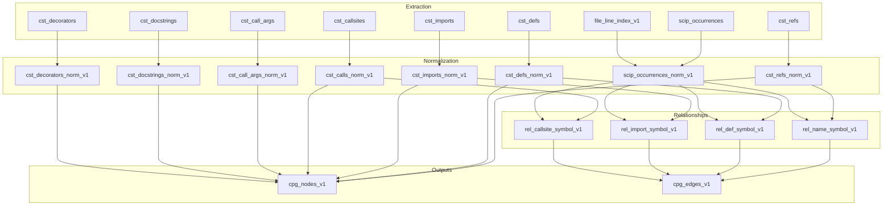

# Semantic Pipeline Documentation

## Overview

The semantic pipeline transforms extraction outputs into CPG nodes and edges.
It uses a declarative specification-driven approach where relationships are
defined in the spec registry and automatically compiled into DataFusion views.

## Extraction Inputs

The pipeline consumes these extraction tables:

| Table | Description |
|-------|-------------|
| `cst_refs` | Name references extracted from CST |
| `cst_defs` | Definitions (functions, classes, etc.) from CST |
| `cst_imports` | Import statements from CST |
| `cst_callsites` | Function/method call sites from CST |
| `cst_call_args` | Call argument spans from CST |
| `cst_docstrings` | Docstring spans from CST |
| `cst_decorators` | Decorator spans from CST |
| `scip_occurrences` | Symbol occurrences from SCIP index |
| `file_line_index_v1` | Line-to-byte offset mapping for SCIP normalization |

## Table Specifications

Table specifications define how extraction tables are normalized with byte-span anchoring and stable ID generation.

### cst_refs

- **Primary span**: `bstart` to `bend`
- **Entity ID**: `ref_id` (namespace: `cst_ref`)
- **Text columns**: `ref_text`

### cst_defs

- **Primary span**: `def_bstart` to `def_bend`
- **Entity ID**: `def_id` (namespace: `cst_def`)
- **Foreign keys**: `container_def_id`

### cst_imports

- **Primary span**: `alias_bstart` to `alias_bend`
- **Entity ID**: `import_id` (namespace: `cst_import`)

### cst_callsites

- **Primary span**: `call_bstart` to `call_bend`
- **Entity ID**: `call_id` (namespace: `cst_call`)

### cst_call_args

- **Primary span**: `bstart` to `bend`
- **Entity ID**: `call_arg_id` (namespace: `cst_call_arg`)
- **Foreign keys**: `call_id`
- **Text columns**: `arg_text`

### cst_docstrings

- **Primary span**: `bstart` to `bend`
- **Entity ID**: `docstring_id` (namespace: `cst_docstring`)
- **Foreign keys**: `owner_def_id`
- **Text columns**: `docstring`

### cst_decorators

- **Primary span**: `bstart` to `bend`
- **Entity ID**: `decorator_id` (namespace: `cst_decorator`)
- **Foreign keys**: `owner_def_id`
- **Text columns**: `decorator_text`

## Relationship Specifications

Relationship specifications define how normalized tables are joined to build CPG edges. New relationships can be added to the registry without modifying pipeline code.

### rel_name_symbol_v1

- **Left table**: `cst_refs_norm_v1`
- **Right table**: `scip_occurrences_norm_v1`
- **Join hint**: `overlap`
- **Origin**: `cst_ref_text`
- **Filter**: `is_read = true`

### rel_def_symbol_v1

- **Left table**: `cst_defs_norm_v1`
- **Right table**: `scip_occurrences_norm_v1`
- **Join hint**: `contains`
- **Origin**: `cst_def_name`
- **Filter**: `is_definition = true`

### rel_import_symbol_v1

- **Left table**: `cst_imports_norm_v1`
- **Right table**: `scip_occurrences_norm_v1`
- **Join hint**: `overlap`
- **Origin**: `cst_import_name`
- **Filter**: `is_import = true`

### rel_callsite_symbol_v1

- **Left table**: `cst_calls_norm_v1`
- **Right table**: `scip_occurrences_norm_v1`
- **Join hint**: `overlap`
- **Origin**: `cst_callsite`

## Output Views

All semantic outputs use versioned canonical names:

| Internal Name | Output Name |
|---------------|-------------|
| `scip_occurrences_norm` | `scip_occurrences_norm_v1` |
| `cst_refs_norm` | `cst_refs_norm_v1` |
| `cst_defs_norm` | `cst_defs_norm_v1` |
| `cst_imports_norm` | `cst_imports_norm_v1` |
| `cst_calls_norm` | `cst_calls_norm_v1` |
| `cst_call_args_norm` | `cst_call_args_norm_v1` |
| `cst_docstrings_norm` | `cst_docstrings_norm_v1` |
| `cst_decorators_norm` | `cst_decorators_norm_v1` |
| `rel_name_symbol` | `rel_name_symbol_v1` |
| `rel_def_symbol` | `rel_def_symbol_v1` |
| `rel_import_symbol` | `rel_import_symbol_v1` |
| `rel_callsite_symbol` | `rel_callsite_symbol_v1` |
| `cpg_nodes` | `cpg_nodes_v1` |
| `cpg_edges` | `cpg_edges_v1` |

## Final CPG Outputs

| Output | Description |
|--------|-------------|
| `cpg_nodes_v1` | Union of all normalized entity tables |
| `cpg_edges_v1` | Union of all relationship views |

## Data Flow Diagram

