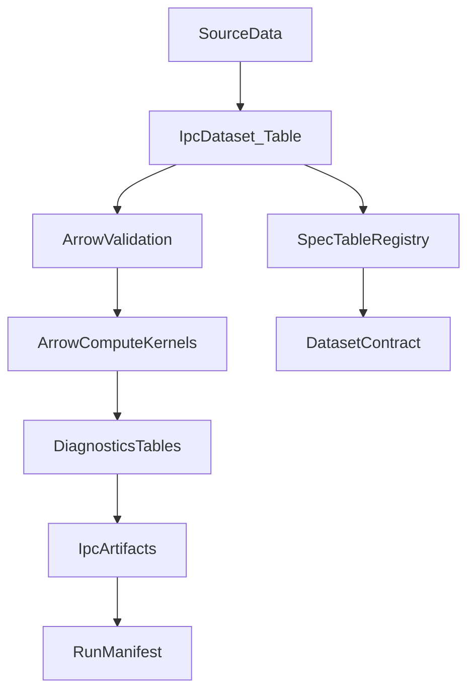

# Arrow IPC Blank-Page Redesign

## Purpose
Redesign the handling and utilization of newly converted Arrow IPC datasets as
if the system were Arrow-native from the start. Remove JSON-era helper
functions, avoid opaque metadata byte blobs, and use PyArrow tables, schemas,
and compute kernels directly.

## Design Principles
- **IPC-first interfaces**: internal payloads are `pa.Table` / `RecordBatchReader`
  plus explicit schemas.
- **No JSON-era glue**: remove custom JSON/“stable repr” utilities; replace with
  Arrow-native structures and compute kernels.
- **Metadata stays small**: schema metadata only for tiny, static annotations.
  Rich metadata becomes Arrow tables or structured columns.
- **Deterministic hashing**: hashes are derived from IPC bytes of a schema-typed
  single-row table.
- **Compute-first validation**: use `table.validate(full=True)` and
  `pyarrow.compute` masks instead of Python-level checks.

## Inventory: IPC datasets and current consumers
The following IPC-native payloads (and their consumers) are the primary targets
for redesign. These entries reflect real IPC usage today and the JSON-era
interfaces layered on top of them.

### Registry and metadata payloads
- **Registry metadata IPC bytes** (map/list/scalar payloads)
  - Producer: `registry_common/metadata.py`
  - Consumers: `arrowdsl/schema/metadata.py`, `relspec/policies.py`
  - Issue: metadata bytes are treated as opaque blobs; decode helpers simulate
    JSON-era accessors.
- **Extractor defaults stored in schema metadata**
  - Producer: `arrowdsl/schema/metadata.py::extractor_option_defaults_spec`
  - Consumers: `extract/registry_specs.py`, `extract/spec_helpers.py`
  - Issue: a rich payload is stored as schema metadata bytes even though
    all consumers are Arrow-native.

### Runtime and engine fingerprints
- **Runtime profile hash** (`engine/runtime_profile.py`)
  - Producer: runtime snapshot assembled into an Arrow schema and hashed via
    IPC bytes.
  - Issue: nested payloads still include “stable repr” patterns inherited from
    JSON-era usage, creating unnecessary custom formatting.
- **Function registry fingerprint** (`engine/function_registry.py`)
  - IPC hash already used, but snapshot payloads are still built from Python
    dicts with JSON-era normalization patterns.
- **DataFusion runtime payloads** (`datafusion_engine/runtime.py`,
  `datafusion_engine/function_factory.py`, `datafusion_engine/expr_planner.py`)
  - IPC hashing is used, but serialized payloads still include JSON-like string
    representations for nested content.

### Diagnostics, manifests, repro artifacts
- **Diagnostics tables** (`obs/diagnostics_tables.py`)
  - Arrow tables are produced, but downstream artifacts are still exported as
    JSON in `obs/repro.py` and mixed with JSON metadata in
    `hamilton_pipeline/modules/outputs.py`.

### Spec tables and IR
- **Expr IR** (`arrowdsl/spec/expr_ir.py`)
  - IPC bytes are base64-wrapped and exposed as “JSON text,” leading to string
    conversions instead of direct IPC usage.
- **Spec codecs** (`arrowdsl/spec/codec.py`)
  - IPC payloads are labeled “JSON,” leading to confusing APIs and extra
    encode/decode layers.

### Policy/caches and relational rules
- **Rule signatures** (`relspec/rules/cache.py`)
  - IPC hash used, but payloads include stable repr and JSON-era normalization.
- **Plan hashes** (`relspec/engine.py`, `relspec/compiler.py`)
  - IPC hash already used; entries should be structured and schema-typed to
    eliminate stable repr usage.

## Target Architecture



### Core abstractions (blank-page)
**IpcDatasetSpec**
- `name: str`
- `version: int`
- `schema: pa.Schema`
- `fingerprint_schema: pa.Schema`
- `validators: tuple[Callable[[pa.Table], None], ...]`

**IpcDataset**
- `spec: IpcDatasetSpec`
- `table: pa.Table | RecordBatchReader`
- `fingerprint() -> str` (IPC bytes of 1-row payload table)
- `validate() -> None` (`table.validate(full=True)` + compute masks)

**IpcArtifactRef**
- `path: str`
- `format: str` (e.g., `ipc_file`, `delta_table`)
- `schema_fingerprint: str`

**SpecTableRegistry**
- returns Arrow **tables** for specs and policies rather than JSON blobs or
  schema metadata bytes.

## Redesign by functional area

### 1) Metadata: move rich metadata into tables
**Problem**: `extractor_option_defaults_spec` stores a rich payload in schema
metadata bytes, forcing custom decode helpers.

**Redesign**: model extractor defaults as a **table** instead of schema metadata.
- `extractor_option_defaults_v1` table:
  - `template_name: string`
  - `key: string`
  - `value_kind: string`
  - `value_bool: bool`
  - `value_int: int64`
  - `value_float: float64`
  - `value_string: string`
  - `value_strings: list<string>`
- Consumers filter/aggregate using `pyarrow.compute` to build the defaults map.

**Consequence**: remove `extractor_option_defaults_spec` and
`extractor_option_defaults_from_metadata` in favor of a registry table.

### 2) Ordering & evidence metadata
**Problem**: ordering keys encoded as comma-separated strings in schema metadata.

**Redesign**:
- Represent ordering as `list<struct<col, order>>` columns in dataset spec table.
- Evidence requirements stored as `list<string>` and `map<string,string>` columns
  in spec tables, not schema metadata bytes.

### 3) Runtime profile and engine snapshots
**Problem**: nested payloads still use stable repr or JSON-like normalization.

**Redesign**:
- All runtime snapshots are IPC-typed `struct` columns with explicit schemas.
- Hashing uses `payload_hash(payload, schema)` only; no stringification.

### 4) Diagnostics & repro outputs
**Problem**: diagnostics tables are Arrow-native, but artifacts are exported as
JSON files with JSON metadata.

**Redesign**:
- Use `write_table_ipc_file` for all diagnostics artifacts.
- Only export JSON at explicit external boundaries (CLI report generation).
- Artifact references are `IpcArtifactRef` rows with schema fingerprints.

### 5) Expr IR and spec codecs
**Problem**: IPC payloads are labeled “JSON” and base64-encoded into strings.

**Redesign**:
- Replace `to_json`/`from_json` with `to_ipc_bytes`/`from_ipc_bytes`.
- Spec tables store IPC bytes in `pa.binary()` columns.
- Consumers decode IPC bytes directly into tables.

### 6) Policy & cache payloads
**Problem**: policy payloads use stable repr or map/list decode helpers.

**Redesign**:
- Policies are stored as structured columns in spec tables.
- Any cached payloads are Arrow tables persisted as IPC/Delta, not JSON blobs.

## API Sketches (illustrative)

```python
class IpcDatasetSpec:
    name: str
    version: int
    schema: pa.Schema
    fingerprint_schema: pa.Schema
    validators: tuple[Callable[[pa.Table], None], ...]


class IpcDataset:
    spec: IpcDatasetSpec
    table: pa.Table | pa.RecordBatchReader

    def fingerprint(self) -> str: ...
    def validate(self) -> None: ...
```

```python
class SpecTableRegistry(Protocol):
    def extractor_defaults(self) -> pa.Table: ...
    def dataset_specs(self) -> pa.Table: ...
    def policy_specs(self) -> pa.Table: ...
```

## Migration Notes (what disappears)
- `arrowdsl/schema/metadata.py` helpers that encode rich metadata into schema
  metadata bytes (e.g., `_extractor_defaults_payload`,
  `extractor_option_defaults_spec`, `extractor_option_defaults_from_metadata`).
- JSON-era “stable repr” helpers used solely to make payloads hashable.
- Base64 IPC payloads masquerading as JSON strings.

## What remains as schema metadata
Only static, tiny keys:
- `ordering_level`
- `extractor_name`
- `extractor_version`
- very small flags or version identifiers

Everything else moves into Arrow tables or structured columns.

## Outcome
The system becomes consistently Arrow-native: IPC datasets remain tables end to
end, compute kernels replace JSON-era normalization, and metadata becomes
first-class tables rather than opaque byte blobs. This design removes whole
classes of custom helper functions that only existed because inputs were JSON.
