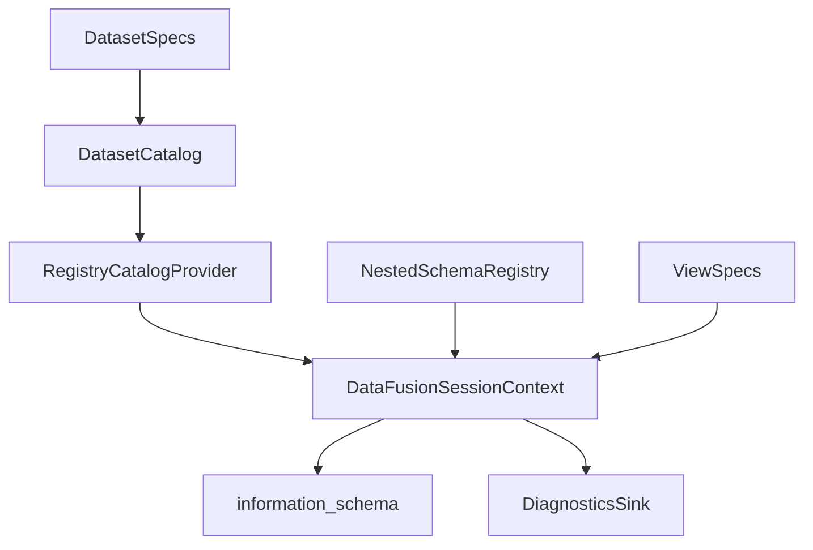

# DataFusion Catalog Migration Design Spec (DataFusion-Only)

## Objective
Migrate all schema definitions and dataset registration flows to the DataFusion catalog
framework, register all datasets (including derived and intermediate datasets) in the
DataFusion catalog, and fully decommission `GLOBAL_SCHEMA_REGISTRY`. This document
defines the target design, implementation plan, and the concrete code patterns that
will be used, without performing the implementation.

## Scope Summary
- **DataFusion-only schema resolution** across all runtime paths.
- **Catalog completeness**: all dataset schemas (persistent + derived) are registered.
- **GLOBAL_SCHEMA_REGISTRY removal** and replacement at every call site.
- **ViewSpec wiring completion** for derived/nested datasets.
- **Schema handshake enforcement** for inferred schemas.
- **Test and documentation updates** to align with the new system.

## Non-Goals
- No implementation of the changes in this document.
- No introduction of alternative registries or non-DataFusion fallbacks.
- No alteration of DataFusion core behavior beyond catalog providers and schema
  registration flows.

## Design Tenets
- **DataFusion is the single source of runtime truth** for schema resolution.
- **Schemas are registered once per SessionContext** and validated via
  `information_schema` and `DESCRIBE`.
- **Derived datasets are treated as first-class** via view specs.
- **Schema drift is explicit**: inferred schemas must handshake against canonical specs.
- **No global singletons** for schema registries.

## Architecture Overview


## Scope 1: DataFusion-First Schema Resolution
**Goal:** Replace any schema lookups that use `GLOBAL_SCHEMA_REGISTRY` with a DataFusion
resolver that uses registered tables/views and the nested schema registry.

### Representative code pattern
```python
from datafusion import SessionContext

from datafusion_engine.schema_introspection import SchemaIntrospector
from datafusion_engine.schema_registry import is_nested_dataset, nested_schema_for


def resolve_schema(ctx: SessionContext, name: str) -> object:
    if is_nested_dataset(name):
        return nested_schema_for(name, allow_derived=True)
    try:
        return ctx.table(name).schema()
    except (KeyError, RuntimeError, TypeError, ValueError):
        return SchemaIntrospector(ctx).describe_query(f"SELECT * FROM {name}").schema
```

### Target file list
- `/home/paul/CodeAnatomy/src/normalize/schema_infer.py`
- `/home/paul/CodeAnatomy/src/relspec/compiler.py`
- `/home/paul/CodeAnatomy/src/relspec/graph.py`
- `/home/paul/CodeAnatomy/src/relspec/contracts.py`
- `/home/paul/CodeAnatomy/src/relspec/rules/validation.py`
- `/home/paul/CodeAnatomy/src/relspec/incremental.py`
- `/home/paul/CodeAnatomy/src/hamilton_pipeline/modules/outputs.py`
- `/home/paul/CodeAnatomy/src/hamilton_pipeline/modules/cpg_build.py`
- `/home/paul/CodeAnatomy/src/hamilton_pipeline/modules/incremental.py`

### Implementation checklist
- [ ] Add a shared resolver helper that depends on `SessionContext` and
      `datafusion_engine.schema_registry`.
- [ ] Replace all `GLOBAL_SCHEMA_REGISTRY.dataset_specs.get(...)` schema lookups.
- [ ] Ensure nested datasets always resolve via `nested_schema_for(..., allow_derived=True)`.

## Scope 2: Catalog Completeness (All Datasets)
**Goal:** Ensure that every dataset schema is registered in DataFusion, including
derived and intermediate datasets. Persistent datasets register as zero-row tables,
derived datasets register as views via `ViewSpec`.

### Representative code pattern
```python
import pyarrow as pa
from datafusion import SessionContext

from datafusion_engine.runtime import DataFusionViewRegistry
from datafusion_engine.schema_registry import register_schema
from schema_spec.view_specs import ViewSpec


def register_zero_row_table(ctx: SessionContext, name: str, schema: pa.Schema) -> None:
    arrays = [pa.array([], type=field.type) for field in schema]
    batch = pa.record_batch(arrays, schema=schema)
    ctx.register_record_batches(name, [[batch]])


def register_view(ctx: SessionContext, view: ViewSpec, registry: DataFusionViewRegistry) -> None:
    view.register(ctx, record_view=registry.record, validate=True)
```

### Target file list
- `/home/paul/CodeAnatomy/src/datafusion_engine/runtime.py`
- `/home/paul/CodeAnatomy/src/datafusion_engine/schema_registry.py`
- `/home/paul/CodeAnatomy/src/schema_spec/view_specs.py`
- `/home/paul/CodeAnatomy/src/datafusion_engine/query_fragments.py`
- `/home/paul/CodeAnatomy/src/ibis_engine/registry.py`

### Implementation checklist
- [ ] Add a catalog bootstrap function that registers all canonical schemas.
- [ ] Register all dataset specs as zero-row tables.
- [ ] Register all view specs with validation via `DESCRIBE` or `ctx.table(...).schema()`.
- [ ] Verify completeness using `information_schema.tables`.

## Scope 3: Decommission `GLOBAL_SCHEMA_REGISTRY`
**Goal:** Remove the singleton and replace its usage with DataFusion catalog registration
and local spec sources.

### Representative code pattern
```python
from schema_spec.system import DatasetSpec


def dataset_spec_from_location(location: object) -> DatasetSpec | None:
    spec = getattr(location, "dataset_spec", None)
    if isinstance(spec, DatasetSpec):
        return spec
    return None
```

### Target file list
- `/home/paul/CodeAnatomy/src/schema_spec/system.py`
- `/home/paul/CodeAnatomy/src/schema_spec/__init__.py`
- `/home/paul/CodeAnatomy/src/cpg/schemas.py`
- `/home/paul/CodeAnatomy/src/incremental/schemas.py`
- `/home/paul/CodeAnatomy/src/relspec/registry/rules.py`
- `/home/paul/CodeAnatomy/src/relspec/registry/snapshot.py`

### Implementation checklist
- [ ] Remove `GLOBAL_SCHEMA_REGISTRY` definition and exports.
- [ ] Replace all imports of `GLOBAL_SCHEMA_REGISTRY` with explicit sources:
      `DatasetLocation.dataset_spec`, `DatasetCatalog`, or DataFusion catalog lookups.
- [ ] Update any cached registries to accept explicit `SchemaRegistry` or dataset specs.

## Scope 4: ViewSpec Wiring for Derived and Nested Datasets
**Goal:** Ensure derived/nested datasets are represented as `ViewSpec` objects with
explicit schemas and are registered consistently.

### Representative code pattern
```python
import pyarrow as pa

from datafusion_engine.query_fragments import SqlFragment
from schema_spec.view_specs import ViewSpec


def fragment_to_view(fragment: SqlFragment, schema: pa.Schema) -> ViewSpec:
    return ViewSpec(name=fragment.name, sql=fragment.sql, schema=schema)
```

### Target file list
- `/home/paul/CodeAnatomy/src/datafusion_engine/query_fragments.py`
- `/home/paul/CodeAnatomy/src/datafusion_engine/schema_registry.py`
- `/home/paul/CodeAnatomy/src/schema_spec/view_specs.py`
- `/home/paul/CodeAnatomy/src/schema_spec/system.py`

### Implementation checklist
- [ ] Populate `SqlFragment.schema` for all nested SQL fragments.
- [ ] Add `ViewSpec` derivation for nested/derived datasets.
- [ ] Register view specs during runtime schema bootstrap.

## Scope 5: Schema Inference Handshake Enforcement
**Goal:** Require inferred schemas to handshake against canonical specs to prevent
silent schema drift.

### Representative code pattern
```python
from schema_spec.schema_inference import SchemaInferenceHarness


def require_schema_handshake(name: str, table: object) -> tuple[object, str]:
    result = SchemaInferenceHarness().infer(name, table)
    # Compare result.spec.schema() to canonical schema fingerprint.
    return result.spec, result.ddl_fingerprint
```

### Target file list
- `/home/paul/CodeAnatomy/src/schema_spec/schema_inference.py`
- `/home/paul/CodeAnatomy/src/ibis_engine/registry.py`
- `/home/paul/CodeAnatomy/src/datafusion_engine/runtime.py`

### Implementation checklist
- [ ] Enforce a canonical schema handshake on inference paths.
- [ ] Persist fingerprints in diagnostics snapshots.
- [ ] Fail fast on mismatch with clear diagnostics.

## Scope 6: Tests and Documentation
**Goal:** Replace global-registry tests and document the DataFusion catalog
registration contract.

### Representative code pattern
```python
def test_datafusion_catalog_is_complete(ctx) -> None:
    missing = ctx.sql(
        "SELECT expected.name FROM expected "
        "LEFT JOIN information_schema.tables t "
        "ON expected.name = t.table_name "
        "WHERE t.table_name IS NULL"
    ).to_pylist()
    assert not missing
```

### Target file list
- `/home/paul/CodeAnatomy/tests/unit/test_global_schema_registry_nested.py`
- `/home/paul/CodeAnatomy/docs/plans/datafusion_schema_oo_overhaul_plan.md`
- `/home/paul/CodeAnatomy/docs/python_library_reference/datafusion_schema.md`

### Implementation checklist
- [ ] Replace global-registry unit tests with catalog completeness tests.
- [ ] Add tests for view registration and `DESCRIBE` validation.
- [ ] Update docs to describe DataFusion catalog as the runtime contract.

## Migration Plan (Execution Order)
1. Add a catalog bootstrap helper in the DataFusion runtime.
2. Register all dataset schemas (persistent + derived) in DataFusion.
3. Replace global-registry schema resolution at call sites.
4. Remove `GLOBAL_SCHEMA_REGISTRY` and update exports.
5. Enforce schema handshake on inference paths.
6. Update tests and documentation.

## Dependencies and References
- `/home/paul/CodeAnatomy/docs/plans/datafusion_schema_oo_overhaul_plan.md`
- `/home/paul/CodeAnatomy/docs/python_library_reference/datafusion_schema.md`
- `/home/paul/CodeAnatomy/src/datafusion_engine/schema_registry.py`
- `/home/paul/CodeAnatomy/src/datafusion_engine/runtime.py`
*** End Patch"}the tool should not be JSON. Non-freeform. Need adjust. Use ApplyPatch freeform, not JSON. Let's resend. Also note file content begins with weird BOM char? I used "" maybe; remove. We'll reapply properly. Let's try again. We'll send patch as freeform. Ensure no BOM. We'll add file. Let's redo with ApplyPatch properly. Use patch. We'll overwrite file; Add File. Ensure no weird characters. We'll include standard ASCII. We'll reapply patch. If previous attempt failed due to JSON; no file created. We'll do again. We'll use freeform patch. Let's do. See tool. We'll call.}
