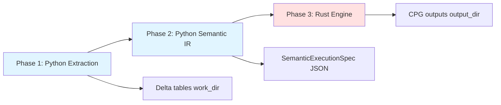
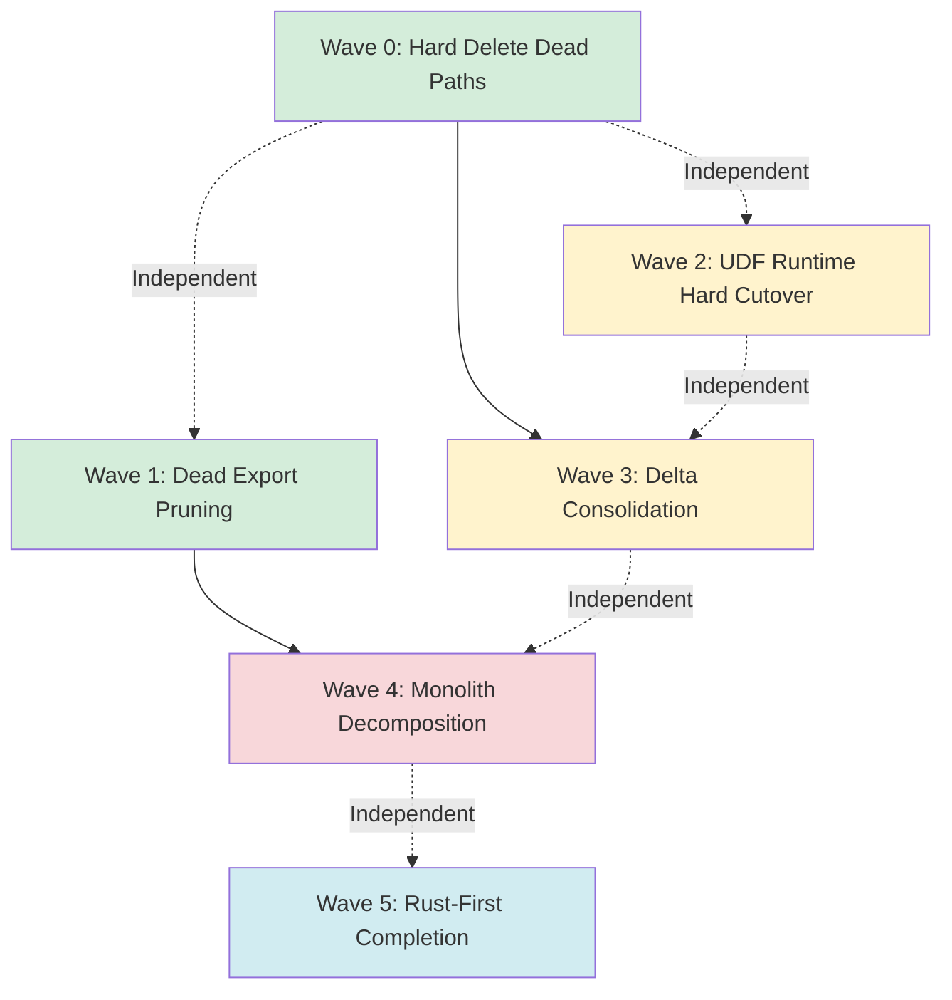

# DataFusion Engine Decomposition Implementation Plan

**Date:** 2026-02-12 (revised 2026-02-13)
**Status:** DRAFT — Review Integrated
**Owner:** Engineering Team
**Assessment Source:** `docs/plans/datafusion_engine_decomposition_assessment_v1_2026-02-12.md`
**Review Source:** `docs/plans/datafusion_engine_decomposition_plan_review_v2_2026-02-13.md`

---

## Design-Phase Posture

This is a **design-phase hard cutover**, not a conservative migration:

1. **No shims.** No compatibility bridges. No dual-path runtime behavior.
2. **No deprecation holding period** for internal architecture modules.
3. **Break old internal import paths** in the same wave they are replaced.
4. **Single extension surface:** `datafusion_ext` only — remove `datafusion._internal` fallback code paths and runtime probing.
5. **Prefer Rust ownership** for execution-critical paths now. Python remains orchestration/control plane only where necessary.

If a wave lands, legacy path(s) are removed immediately in that wave.

---

## Executive Summary

This plan operationalizes the decomposition of `src/datafusion_engine/` (73,655 LOC) by removing dead code (~1,670 LOC), pruning dead exports (~530 LOC), performing hard cutover of UDF and extension surfaces (~600 LOC), and restructuring monolithic files for maintainability. Total immediate actionable scope: ~2,800 LOC removal + 12,648 LOC restructuring across 5 waves.

**Execution waves:**
1. **Wave 0** — Hard delete dead paths (zero production callers): ~1,040 LOC removed
2. **Wave 1** — Dead export pruning from live files (corrected dead-set): ~530 LOC removed
3. **Wave 2** — UDF runtime hard cutover (standardize on `datafusion_ext`): ~300 LOC simplified
4. **Wave 3** — Delta control-plane consolidation (protocol migration already complete): ~300 LOC removed
5. **Wave 4** — Monolith decomposition with direct import rewrite (no compat modules): 12,648 LOC restructured

**Wave 5** — Rust-first completion (execution runtime, lineage, dataset registration): ~7,567 LOC removal.

---

## Architecture Context

The pipeline has three phases with Python and Rust owning distinct responsibilities:



**Python's legitimate DataFusion usage:**
- **Extraction** — Build and execute DataFusion queries to transform evidence tables
- **Semantic IR** — Assemble view definitions (not executed) for Rust compiler

**Rust owns:**
- Session construction (`SessionStateBuilder`)
- Plan compilation, rule application, scheduling
- Execution and materialization
- UDF implementations (all UDFs are Rust-native)
- Delta control plane

**DataFusion version alignment:** Python bindings are `datafusion` 51.0.0 (PyPI), Rust crate is 51.0 (Cargo.toml). Keep in sync.

---

## Wave 0: Dead Code Deletion

**Scope:** Hard delete files with zero production callers. No callsite changes required. Explicit binary decisions for borderline modules.

### Files to Delete

#### 1. `src/datafusion_engine/workload/` subpackage (307 LOC) — DECISION REQUIRED

**Evidence:** Zero imports from `src/` runtime call paths. Test-backed but not wired into pipeline.

**What it was:** Planned feature for dynamic session tuning based on workload classification (BATCH_INGEST, INTERACTIVE_QUERY, etc.). Never wired into the pipeline.

**Binary decision (must be made in this wave):**
- **Option A (recommended): Delete all workload modules + tests now.** The feature was never wired in, and the go-forward Rust engine owns session tuning via `SessionBuildOverrides`.
- **Option B: Keep and wire into go-forward runtime now.** Only choose this if workload classification is an active requirement for extraction-phase session tuning.

**Files (delete if Option A):**
- `src/datafusion_engine/workload/__init__.py` (~10 LOC)
- `src/datafusion_engine/workload/classifier.py` (~170 LOC)
- `src/datafusion_engine/workload/session_profiles.py` (~137 LOC)

#### 2. `src/datafusion_engine/plan/pipeline_runtime.py` (541 LOC)

**Evidence:** Zero imports from `src/`. One test file imports it.

**What it was:** Two-pass planning pipeline for old rustworkx scheduling system. Imports from `relspec.inferred_deps` (now deprecated).

**Code snippet showing dead dependency:**
```python
# src/datafusion_engine/plan/pipeline_runtime.py (line 25)
from relspec.inferred_deps import InferredDeps, infer_deps_from_view_nodes
# ^^^ This is the old rustworkx scheduling system, now replaced by Rust
```

**Associated test file to delete:**
- `tests/unit/datafusion_engine/plan/test_pipeline_scan_policy_inference_wiring.py` (~50 LOC)

#### 3. `src/datafusion_engine/delta/plugin_options.py` (~122 LOC)

**Evidence:** Registered in `delta/__init__.py` lazy-load registry but never imported.

**What it was:** Delta plugin option resolution for session-to-plugin configuration bridging. Superseded by Rust plugin system.

**File edit required:**
- `src/datafusion_engine/delta/__init__.py` — Remove lazy-load entries

### File Edit: `delta/__init__.py`

**Current state (lines to remove):**
```python
# src/datafusion_engine/delta/__init__.py
__all__ = [
    # ... other exports ...
    "delta_plugin_options_from_session",  # REMOVE
    "delta_plugin_options_json",          # REMOVE
]

_LAZY_REGISTRY = {
    # ... other entries ...
    "delta_plugin_options_from_session": (
        "datafusion_engine.delta.plugin_options",
        "delta_plugin_options_from_session",
    ),  # REMOVE
    "delta_plugin_options_json": (
        "datafusion_engine.delta.plugin_options",
        "delta_plugin_options_json",
    ),  # REMOVE
}

if TYPE_CHECKING:
    # ... other imports ...
    from datafusion_engine.delta.plugin_options import (  # REMOVE BLOCK
        delta_plugin_options_from_session,
        delta_plugin_options_json,
    )
```

**After cleanup:**
```python
# src/datafusion_engine/delta/__init__.py
__all__ = [
    # ... other exports (plugin_options entries removed) ...
]

_LAZY_REGISTRY = {
    # ... other entries (plugin_options entries removed) ...
}

if TYPE_CHECKING:
    # ... other imports (plugin_options block removed) ...
```

### File Edit: `plan/__init__.py`

**Check for stale re-exports:**
```bash
# Verify pipeline_runtime is not re-exported
grep -n "pipeline_runtime" src/datafusion_engine/plan/__init__.py
```

If found, remove the re-export.

### Wave 0 Implementation Checklist

- [ ] **Pre-flight checks**
  - [ ] Run `/cq calls workload` to confirm zero src/ callers
  - [ ] Run `/cq calls pipeline_runtime` to confirm zero src/ callers
  - [ ] Run `/cq calls plugin_options` to confirm zero src/ callers
  - [ ] Run full test suite: `uv run pytest tests/ -m "not e2e" -q`

- [ ] **Decide and execute workload subpackage (binary decision)**
  - [ ] Confirm decision: delete (recommended) or keep-and-wire
  - [ ] If deleting:
    - [ ] Delete `src/datafusion_engine/workload/__init__.py`
    - [ ] Delete `src/datafusion_engine/workload/classifier.py`
    - [ ] Delete `src/datafusion_engine/workload/session_profiles.py`
    - [ ] Delete any associated test files under `tests/unit/datafusion_engine/workload/`
    - [ ] Remove directory: `rmdir src/datafusion_engine/workload/`

- [ ] **Delete pipeline_runtime**
  - [ ] Delete `src/datafusion_engine/plan/pipeline_runtime.py`
  - [ ] Delete `tests/unit/datafusion_engine/plan/test_pipeline_scan_policy_inference_wiring.py`
  - [ ] Check `src/datafusion_engine/plan/__init__.py` for stale re-exports, remove if present

- [ ] **Delete plugin_options**
  - [ ] Delete `src/datafusion_engine/delta/plugin_options.py`
  - [ ] Edit `src/datafusion_engine/delta/__init__.py`:
    - [ ] Remove `delta_plugin_options_from_session` from `__all__`
    - [ ] Remove `delta_plugin_options_json` from `__all__`
    - [ ] Remove both entries from `_LAZY_REGISTRY`
    - [ ] Remove TYPE_CHECKING import block for plugin_options

- [ ] **Post-flight checks**
  - [ ] Run `uv run ruff format`
  - [ ] Run `uv run ruff check --fix`
  - [ ] Run `uv run pyrefly check`
  - [ ] Run `uv run pyright`
  - [ ] Run full test suite: `uv run pytest tests/ -m "not e2e" -q`
  - [ ] Verify no import errors: `uv run python -c "from datafusion_engine import *"`

**Expected outcome:** ~1,040 LOC removed, 0 callsite changes, all tests pass.

---

## Wave 1: Dead Export Pruning (Corrected Dead-Set)

**Scope:** Remove dead exports from live files. Requires verifying zero callers with `/cq calls`. Do not preserve legacy exports for compatibility — this is a hard cutover.

> **REVIEW CORRECTION (2026-02-13):** The original dead-export candidate lists contained false positives — symbols initially classified as dead that are actually live internal dependencies. The corrected lists below exclude these. Each symbol must still be verified with `/cq calls` before deletion. See specific correction notes per file.

### 1A: `schema/registry.py` — dead exports (~300-400 LOC, corrected count)

This is the second-largest file in the module (4,166 LOC).

> **CORRECTION:** The following symbols were incorrectly classified as dead but are live. **Do NOT delete:**
> - Code at lines 1721, 1739 — live internal callers
> - Code at lines 2136, 2170 — live internal callers
> - Code at line 4017 — referenced by `session/runtime.py` (lines 112, 6350)
>
> Re-verify all candidates with `/cq calls` before proceeding.

#### Dead Schema View-Name Constants (6 constants)

**Code snippet:**
```python
# src/datafusion_engine/schema/registry.py
# DEAD — Zero callers in src/ or tests/
AST_VIEW_NAMES: frozenset[str] = frozenset({...})
BYTECODE_VIEW_NAMES: frozenset[str] = frozenset({...})
SCIP_VIEW_NAMES: frozenset[str] = frozenset({...})
SYMTABLE_VIEW_NAMES: frozenset[str] = frozenset({...})
TREE_SITTER_VIEW_NAMES: frozenset[str] = frozenset({...})
CST_VIEW_NAMES: frozenset[str] = frozenset({...})
```

**Verification command:**
```bash
/cq calls AST_VIEW_NAMES
/cq calls BYTECODE_VIEW_NAMES
/cq calls SCIP_VIEW_NAMES
/cq calls SYMTABLE_VIEW_NAMES
/cq calls TREE_SITTER_VIEW_NAMES
/cq calls CST_VIEW_NAMES
```

**Note:** Keep `AST_CORE_VIEW_NAMES` and `AST_OPTIONAL_VIEW_NAMES` (used by `session/runtime.py`).

#### Dead Pipeline Schema Constants (4 constants)

**Code snippet:**
```python
# src/datafusion_engine/schema/registry.py
# DEAD — Hamilton pipeline event tracking no longer exists
PIPELINE_PLAN_DRIFT_SCHEMA: pa.Schema = pa.schema([...])
PIPELINE_TASK_EXPANSION_SCHEMA: pa.Schema = pa.schema([...])
PIPELINE_TASK_GROUPING_SCHEMA: pa.Schema = pa.schema([...])
PIPELINE_TASK_SUBMISSION_SCHEMA: pa.Schema = pa.schema([...])
```

**Verification command:**
```bash
/cq calls PIPELINE_PLAN_DRIFT_SCHEMA
/cq calls PIPELINE_TASK_EXPANSION_SCHEMA
/cq calls PIPELINE_TASK_GROUPING_SCHEMA
/cq calls PIPELINE_TASK_SUBMISSION_SCHEMA
```

#### Dead DataFusion Schema Constants (3 constants)

**Code snippet:**
```python
# src/datafusion_engine/schema/registry.py
# DEAD — Old schema constants for DataFusion tracking
DATAFUSION_RUNS_SCHEMA: pa.Schema = pa.schema([...])
DATAFUSION_SQL_INGEST_SCHEMA: pa.Schema = pa.schema([...])
DATAFUSION_VIEW_ARTIFACTS_SCHEMA: pa.Schema = pa.schema([...])
```

**Keep these (actively used):**
```python
# KEEP — Used by session/runtime.py, materialize_pipeline.py
DATAFUSION_PLAN_ARTIFACTS_SCHEMA: pa.Schema = pa.schema([...])
DATAFUSION_PIPELINE_EVENTS_V2_SCHEMA: pa.Schema = pa.schema([...])
```

#### Dead Validator Functions (11 functions, ~100 LOC)

**Code snippet:**
```python
# src/datafusion_engine/schema/registry.py
# DEAD — Abandoned validation layer from old extractor validation system

def validate_ast_views(ctx: SessionContext) -> None: ...
def validate_bytecode_views(ctx: SessionContext) -> None: ...
def validate_cst_views(ctx: SessionContext) -> None: ...
def validate_scip_views(ctx: SessionContext) -> None: ...
def validate_symtable_views(ctx: SessionContext) -> None: ...
def validate_ts_views(ctx: SessionContext) -> None: ...

def validate_required_bytecode_functions(ctx: SessionContext) -> None: ...
def validate_required_cst_functions(ctx: SessionContext) -> None: ...
def validate_required_symtable_functions(ctx: SessionContext) -> None: ...

def validate_schema_metadata(schema: pa.Schema, expected: dict) -> None: ...
def validate_udf_info_schema_parity(ctx: SessionContext) -> None: ...
```

**Verification command:**
```bash
/cq calls validate_ast_views
/cq calls validate_bytecode_views
# ... repeat for all 11 functions
```

**Keep these (actively used):**
```python
# KEEP — Used by session/runtime.py, materialize_pipeline.py
def validate_nested_types(ctx: SessionContext, table_name: str) -> None: ...
```

#### Dead Nested Dataset Functions (15+ functions, ~200 LOC)

**Code snippet:**
```python
# src/datafusion_engine/schema/registry.py
# DEAD — Experimental nested dataset extraction system never used

def extract_nested_context_for(path: str) -> str | None: ...
def extract_nested_path_for(dataset_name: str) -> str | None: ...
def extract_nested_role_for(path: str) -> str | None: ...
def extract_nested_spec_for(path: str) -> NestedSpec | None: ...
def extract_datasets_for_path(path: str) -> list[str]: ...

def is_extract_nested_dataset(table_name: str) -> bool: ...
def is_extract_intrinsic_nested_dataset(table_name: str) -> bool: ...
def is_nested_dataset(table_name: str) -> bool: ...
def is_intrinsic_nested_dataset(table_name: str) -> bool: ...

def nested_context_for(table_name: str) -> str | None: ...
def nested_role_for(table_name: str) -> str | None: ...
def datasets_for_path(path: str) -> list[str]: ...
def struct_for_path(path: str) -> pa.StructType | None: ...
def identity_fields_for(table_name: str) -> list[str]: ...
```

**Keep these (actively used):**
```python
# KEEP — Used by session/runtime.py for nested view setup
def nested_view_specs() -> list[NestedViewSpec]: ...
def nested_view_spec(table_name: str) -> NestedViewSpec | None: ...
def nested_path_for(table_name: str) -> str | None: ...
```

#### Dead Relationship Schema Map and Index (2 constants)

**Code snippet:**
```python
# src/datafusion_engine/schema/registry.py
# DEAD — Old relationship schema tracking
RELATIONSHIP_SCHEMA_BY_NAME: Mapping[str, pa.Schema] = {...}
NESTED_DATASET_INDEX: Mapping[str, NestedSpec] = {...}
```

#### Live Exports to KEEP (Critical Path)

**Code snippet showing KEEP pattern:**
```python
# src/datafusion_engine/schema/registry.py
# KEEP — CRITICAL PATH (extraction, semantics)

def extract_schema_for(table_name: str) -> pa.Schema:
    """Return the PyArrow schema for a registered extraction table.

    This is the primary schema lookup API used across extraction and
    semantic compilation. Used by 18+ files.
    """
    ...

def validate_nested_types(ctx: SessionContext, table_name: str) -> None:
    """Validate nested field types in a registered table.

    Used by session/runtime.py and materialize_pipeline.py.
    """
    ...

def nested_view_specs() -> list[NestedViewSpec]:
    """Return all nested view specifications.

    Used by session setup for nested view registration.
    """
    ...

def registered_table_names() -> frozenset[str]:
    """Return all registered table names.

    Used by catalog introspection.
    """
    ...

# Keep these schema constants (actively used)
DATAFUSION_PLAN_ARTIFACTS_SCHEMA: pa.Schema = pa.schema([...])
DATAFUSION_PIPELINE_EVENTS_V2_SCHEMA: pa.Schema = pa.schema([...])
AST_CORE_VIEW_NAMES: frozenset[str] = frozenset({...})
AST_OPTIONAL_VIEW_NAMES: frozenset[str] = frozenset({...})
```

### 1B: `dataset/registration.py` — dead exports (~193 LOC, corrected)

> **CORRECTION:** The original candidate list contained live internals. The following lines are **NOT dead** and must be preserved:
> - Line 230 — live internal caller
> - Line 571 — live internal caller
> - Line 1114, 1122, 1222 — live internal callers
>
> Re-verify each candidate with `/cq calls` before deletion.

**Dead exports (verified subset):**

**Code snippet:**
```python
# src/datafusion_engine/dataset/registration.py
# DEAD — Zero external importers

@dataclass(frozen=True)
class DataFusionCacheSettings:
    """DEAD — Old cache settings."""
    ...  # ~9 lines

@dataclass(frozen=True)
class DatasetInputSource:
    """DEAD — Old input plugin system."""
    ...  # ~71 lines

@dataclass(frozen=True)
class DatasetRegistrationOptions:
    """DEAD — Old registration options."""
    ...  # ~8 lines

@dataclass(frozen=True)
class DatasetRegistration:
    """DEAD — Old registration result."""
    ...  # ~9 lines

def register_dataset_spec(
    ctx: SessionContext,
    spec: DatasetSpec,
    options: DatasetRegistrationOptions | None = None,
) -> DatasetRegistration:
    """DEAD — Spec-based registration path."""
    ...  # ~52 lines

def resolve_registry_options(
    ctx: SessionContext,
    options: DatasetRegistrationOptions | None,
) -> ResolvedOptions:
    """DEAD — Options resolver."""
    ...  # ~44 lines
```

**Live exports to KEEP:**
```python
# src/datafusion_engine/dataset/registration.py
# KEEP — Actively used

@dataclass(frozen=True)
class DataFusionCachePolicy:
    """KEEP — 18 callers."""
    ...

def register_dataset_df(
    ctx: SessionContext,
    name: str,
    df: DataFrame,
) -> None:
    """KEEP — 3 callers (extraction core)."""
    ...

@dataclass(frozen=True)
class DataFusionRegistryOptions:
    """KEEP — 2 callers."""
    ...

def dataset_input_plugin(plugin_name: str) -> InputPlugin:
    """KEEP — 2 callers."""
    ...

def input_plugin_prefixes() -> frozenset[str]:
    """KEEP — 2 callers."""
    ...
```

### 1C: `extract/templates.py` — dead exports (~20-30 LOC, corrected)

> **CORRECTION:** The original candidate list contained live internals. The following lines are **NOT dead** and must be preserved:
> - Line 251 — live internal caller
> - Line 461 — live internal caller
> - Lines 1413, 1424 — live internal callers
>
> Re-verify each candidate with `/cq calls` before deletion.

**Dead exports (verified subset):**

**Code snippet:**
```python
# src/datafusion_engine/extract/templates.py
# DEAD — Zero importers

CONFIGS: Mapping[str, ExtractorConfigSpec] = {...}  # ~5 lines
TEMPLATES: Mapping[str, DatasetTemplateSpec] = {...}  # ~5 lines

DatasetTemplateSpec: TypeAlias = ...  # ~3 lines
ExtractorConfigSpec: TypeAlias = ...  # ~3 lines
ExtractorTemplate: TypeAlias = ...  # ~3 lines

def flag_default(flag_name: str) -> Any:
    """Return default value for a feature flag."""
    ...  # ~10 lines
```

**Live exports to KEEP:**
```python
# src/datafusion_engine/extract/templates.py
# KEEP — Heavily used

def config(extractor_name: str) -> ExtractorConfig:
    """KEEP — 450+ call sites."""
    ...

def template(template_name: str) -> DatasetTemplate:
    """KEEP — 116 call sites."""
    ...

def dataset_template_specs() -> list[DatasetTemplateSpec]:
    """KEEP — Used by extraction orchestrator."""
    ...

def expand_dataset_templates(specs: list[DatasetTemplateSpec]) -> list[Dataset]:
    """KEEP — Used by extraction orchestrator."""
    ...
```

### 1D: `datafusion_engine/__init__.py` — Stale re-exports

**Action:** After removing dead exports from submodules, audit `src/datafusion_engine/__init__.py` to remove stale re-exports.

**Code snippet:**
```python
# src/datafusion_engine/__init__.py
# Check for stale lazy-load entries pointing to deleted code

_LAZY_REGISTRY = {
    # ... remove any entries for deleted exports ...
}

if TYPE_CHECKING:
    # ... remove any type-only imports for deleted exports ...
}

__all__ = [
    # ... remove any deleted export names ...
]
```

### Wave 1 Implementation Checklist

- [ ] **Pre-flight checks**
  - [ ] Run `/cq calls <export>` for each identified dead export to confirm zero callers
  - [ ] Document any unexpected callers found (re-assess if not actually dead)
  - [ ] Run full test suite: `uv run pytest tests/ -m "not e2e" -q`

- [ ] **Prune schema/registry.py**
  - [ ] Remove 6 dead schema view-name constants
  - [ ] Remove 4 dead pipeline schema constants
  - [ ] Remove 3 dead DataFusion schema constants
  - [ ] Remove 11 dead validator functions
  - [ ] Remove 15+ dead nested dataset functions
  - [ ] Remove 2 dead relationship constants
  - [ ] Verify `extract_schema_for()` and other KEEP exports remain intact

- [ ] **Prune dataset/registration.py**
  - [ ] Remove `DataFusionCacheSettings` class
  - [ ] Remove `DatasetInputSource` class
  - [ ] Remove `DatasetRegistrationOptions` class
  - [ ] Remove `DatasetRegistration` class
  - [ ] Remove `register_dataset_spec()` function
  - [ ] Remove `resolve_registry_options()` function
  - [ ] Verify `register_dataset_df()` and other KEEP exports remain intact

- [ ] **Prune extract/templates.py**
  - [ ] Remove `CONFIGS` constant
  - [ ] Remove `TEMPLATES` constant
  - [ ] Remove `DatasetTemplateSpec` type alias
  - [ ] Remove `ExtractorConfigSpec` type alias
  - [ ] Remove `ExtractorTemplate` type alias
  - [ ] Remove `flag_default()` function
  - [ ] Verify `config()`, `template()` and other KEEP exports remain intact

- [ ] **Update datafusion_engine/__init__.py**
  - [ ] Remove stale entries from `_LAZY_REGISTRY`
  - [ ] Remove stale TYPE_CHECKING imports
  - [ ] Remove stale names from `__all__`

- [ ] **Post-flight checks**
  - [ ] Run `uv run ruff format`
  - [ ] Run `uv run ruff check --fix`
  - [ ] Run `uv run pyrefly check`
  - [ ] Run `uv run pyright`
  - [ ] Run full test suite: `uv run pytest tests/ -m "not e2e" -q`
  - [ ] Verify no import errors: `uv run python -c "from datafusion_engine import *"`

**Expected outcome:** ~530-640 LOC removed, minimal callsite changes, all tests pass.

---

## Wave 2: UDF Runtime Hard Cutover

**Scope:** Standardize on `datafusion_ext` as the single extension surface. Remove all `datafusion._internal` fallback code paths, runtime probing, and mixed-module contract resolution. Enforce fail-fast behavior for missing Rust UDF entrypoints — no Python soft-fail retries, no compatibility fallback modules.

### Architecture Context: DataFusion UDF Best Practices

**Current Rust implementation already follows best-in-class patterns:**

```rust
// rust/datafusion_ext/src/udf/ (EXISTING)
// All UDFs use ScalarUDFImpl (Layer 3 - full power)

impl ScalarUDFImpl for MyUDF {
    fn return_type_from_exprs(
        &self,
        args: &[Expr],
        schema: &DFSchema,
        arg_types: &[DataType],
    ) -> Result<Arc<Field>> {
        // Layer 3: Dynamic return types with metadata
        Ok(Arc::new(Field::new("result", DataType::Utf8, false)
            .with_metadata(HashMap::from([
                ("semantic_type".to_string(), "span_id".to_string()),
            ]))
        ))
    }

    fn signature(&self) -> &Signature {
        // Named parameters for better error messages
        Signature::exact(
            vec![DataType::Int64, DataType::Utf8],
            Volatility::Immutable,  // Foldable by optimizer
        ).with_parameter_names(vec!["offset", "text"])
    }

    fn simplify(&self) -> Option<ExprSimplifier> {
        // Optional: Expression rewriting for optimization
        Some(Box::new(|args, info| {
            // Constant folding, null propagation, etc.
        }))
    }
}
```

**Key patterns:**
- `return_type_from_exprs()` (Layer 3) enables metadata-aware return types
- `Volatility::Immutable` allows constant folding and caching
- Named parameters via `signature().with_parameter_names()`
- Optional `simplify()` for expression rewriting
- `FunctionFactory` support for `CREATE FUNCTION` (already implemented)

### Current Problem: Dual Extension Surfaces and Fallback Paths

The Python UDF platform installer has fallback detection, retry logic, and dual-module probing (`datafusion._internal` + `datafusion_ext`) that was needed during the Python→Rust transition. This violates the single-extension-surface contract and must be eliminated.

**Code snippet showing current fallback logic:**
```python
# src/datafusion_engine/udf/platform.py (CURRENT - 425 LOC)
# This file has extensive fallback paths that are no longer needed

def install_rust_udf_platform(
    ctx: SessionContext,
    *,
    options: RustUdfPlatformOptions | None = None,
) -> RustUdfPlatform:
    """Install Rust UDF platform with fallback and retry logic."""
    options = options or RustUdfPlatformOptions()

    # REMOVE: Fallback detection
    if not _is_native_available():
        _LOGGER.warning("Native UDF platform not available, using fallback")
        return _build_fallback_platform(ctx, options)

    # REMOVE: Soft-fail logging for retry loops
    if _SOFT_FAIL_LOGGED.get(ctx):
        return _cached_platform(ctx)

    # REMOVE: Complex retry + validation
    max_retries = options.max_retries or 3
    for attempt in range(max_retries):
        try:
            snapshot = register_rust_udfs(ctx)
            if snapshot is None:
                _LOGGER.warning(f"UDF registration attempt {attempt+1} returned None")
                continue
            # ... validation logic ...
            break
        except Exception as e:
            if attempt == max_retries - 1:
                _LOGGER.error(f"UDF registration failed after {max_retries} attempts")
                return _build_fallback_platform(ctx, options)
            _LOGGER.warning(f"Retry {attempt+1}: {e}")
            time.sleep(0.1 * (attempt + 1))

    # ... 200+ more lines of fallback handling ...
```

### Target Architecture: Single Extension Surface (`datafusion_ext`)

**Code snippet for simplified installation:**
```python
# src/datafusion_engine/udf/platform.py (HARD CUTOVER - ~200 LOC)

def install_rust_udf_platform(
    ctx: SessionContext,
    *,
    options: RustUdfPlatformOptions | None = None,
) -> RustUdfPlatform:
    """Install Rust UDF platform into a DataFusion session.

    All UDFs are Rust-native via datafusion_ext. No Python
    fallback paths exist — Rust UDF availability is a hard requirement.

    DataFusion best practice: UDFs use ScalarUDFImpl Layer 3 with
    return_type_from_exprs for metadata-aware return types, named
    parameters via Signature.with_parameter_names(), and Volatility.Immutable
    for foldable functions.

    Parameters
    ----------
    ctx : SessionContext
        DataFusion session to install UDFs into.
    options : RustUdfPlatformOptions | None
        Platform configuration (function factory, expr planners).

    Returns
    -------
    RustUdfPlatform
        Installed platform with UDF snapshot, rewrite tags, and docs.

    Raises
    ------
    ImportError
        If datafusion._internal is unavailable (hard requirement).
    RuntimeError
        If UDF registration fails.
    """
    options = options or RustUdfPlatformOptions()

    # Direct registration (no fallback)
    snapshot = register_rust_udfs(ctx)
    snapshot_hash = rust_udf_snapshot_hash(snapshot)

    # Optional: Function factory for CREATE FUNCTION support
    factory_status = None
    factory_policy = None
    if options.enable_function_factory:
        factory_status, factory_policy = _install_function_factory(
            ctx,
            enabled=True,
            hook=options.function_factory_hook,
            policy=options.function_factory_policy,
        )

    # Optional: Expression planners for custom syntax
    planner_status = None
    planner_policy = None
    if options.enable_expr_planners:
        planner_status, planner_policy = _install_expr_planners(
            ctx,
            names=options.expr_planner_names,
        )

    return RustUdfPlatform(
        snapshot=snapshot,
        snapshot_hash=snapshot_hash,
        rewrite_tags=rewrite_tag_index(ctx),
        domain_planner_names=domain_planner_names_from_snapshot(snapshot),
        docs=rust_udf_docs(ctx) if snapshot else None,
        function_factory=factory_status,
        expr_planners=planner_status,
        function_factory_policy=factory_policy,
        expr_planner_policy=planner_policy,
    )
```

### Target: Hard-Cutover UDF Runtime

**Code snippet for hard-cutover runtime:**
```python
# src/datafusion_engine/udf/runtime.py (HARD CUTOVER)

def register_rust_udfs(ctx: SessionContext) -> Mapping[str, object]:
    """Register all Rust-native UDFs into the session.

    This is a hard requirement — no Python fallback exists.
    Uses datafusion_ext as the single extension surface.

    DataFusion best practice: UDFs use ScalarUDFImpl Layer 3 with
    return_type_from_exprs for metadata-aware return types, Volatility.Immutable
    for foldable functions, and named parameter support via Signature.

    Parameters
    ----------
    ctx : SessionContext
        DataFusion session to register UDFs into.

    Returns
    -------
    Mapping[str, object]
        UDF snapshot mapping function names to metadata.

    Raises
    ------
    ImportError
        If datafusion_ext is unavailable.
    RuntimeError
        If UDF registration fails.
    """
    module = importlib.import_module("datafusion_ext")
    snapshot = module.register_codeanatomy_udfs(ctx)

    # Track registration for cleanup
    _RUST_UDF_CONTEXTS.add(ctx)
    _RUST_UDF_SNAPSHOTS[ctx] = snapshot

    return snapshot
```

### Files to Edit

#### 1. `src/datafusion_engine/udf/platform.py`

**Changes:**
- Remove `_is_native_available()` fallback detection
- Remove `_build_fallback_platform()` fallback constructor
- Remove `_SOFT_FAIL_LOGGED` tracking
- Remove retry loops in `install_rust_udf_platform()`
- Simplify to direct `register_rust_udfs()` call
- Keep function factory and expr planner installation (optional features)

**Estimated reduction:** ~200 LOC (425 → ~225)

#### 2. `src/datafusion_engine/udf/runtime.py`

**Changes:**
- Remove `try: ... except ImportError: return None` patterns
- Change `register_rust_udfs()` to raise ImportError directly (no swallowing)
- Remove Python UDF fallback branches (none exist anymore)
- Simplify snapshot validation (no retry logic)

**Estimated reduction:** ~100 LOC (1,677 → ~1,577)

#### 3. `src/datafusion_engine/udf/factory.py`

**Changes:**
- Remove retry loops in function factory installation
- Use direct Rust registration
- Keep `FunctionFactory` protocol implementation (still needed)

**Estimated reduction:** Minor (~20-30 LOC)

### Wave 2 Implementation Checklist

- [ ] **Pre-flight checks**
  - [ ] Verify all UDFs are Rust-native: `rg "def.*udf" src/datafusion_engine/udf/` should return zero Python UDF implementations
  - [ ] Verify `datafusion_ext.register_codeanatomy_udfs` exists: `uv run python -c "from datafusion_ext import register_codeanatomy_udfs"`
  - [ ] Audit all `datafusion._internal` references: `rg "datafusion._internal" src/datafusion_engine/`
  - [ ] Run full test suite: `uv run pytest tests/ -m "not e2e" -q`

- [ ] **Standardize on `datafusion_ext` extension surface**
  - [ ] Replace all `datafusion._internal` imports with `datafusion_ext` across `src/datafusion_engine/`
  - [ ] Remove runtime probing that keeps both module contracts alive
  - [ ] Remove fallback resolution and mixed-module detection logic

- [ ] **Hard cutover udf/platform.py**
  - [ ] Remove `_is_native_available()` function
  - [ ] Remove `native_udf_platform_available()` function
  - [ ] Remove `_build_fallback_platform()` function
  - [ ] Remove `_SOFT_FAIL_LOGGED` module-level tracking dict
  - [ ] Rewrite `install_rust_udf_platform()`: direct registration, no fallback paths, no retry loops
  - [ ] Keep function factory installation logic
  - [ ] Keep expr planner installation logic
  - [ ] Update docstring to document hard requirement and single extension surface

- [ ] **Hard cutover udf/runtime.py**
  - [ ] Change `register_rust_udfs()` to raise ImportError instead of returning None
  - [ ] Remove all `try: ... except ImportError: return None` patterns
  - [ ] Remove Python UDF fallback detection
  - [ ] Remove snapshot validation retry logic
  - [ ] Update docstring to document hard requirement

- [ ] **Hard cutover udf/factory.py**
  - [ ] Remove retry loops
  - [ ] Use direct Rust registration via `datafusion_ext`
  - [ ] Keep `FunctionFactory` protocol (still needed for CREATE FUNCTION)

- [ ] **Update callers — fail-fast enforcement**
  - [ ] Check if any caller swallows ImportError from `install_rust_udf_platform()`
  - [ ] Update all callers to propagate error (Rust UDF is hard requirement)
  - [ ] Zero remaining `except ImportError` branches for UDF registration

- [ ] **Post-flight checks**
  - [ ] Run `uv run ruff format`
  - [ ] Run `uv run ruff check --fix`
  - [ ] Run `uv run pyrefly check`
  - [ ] Run `uv run pyright`
  - [ ] Run full test suite: `uv run pytest tests/ -m "not e2e" -q`
  - [ ] Verify zero `datafusion._internal` references remain: `rg "datafusion._internal" src/datafusion_engine/` returns empty
  - [ ] Run extraction pipeline smoke test

**Expected outcome:** ~300 LOC simplified, single extension surface, fail-fast semantics, all tests pass.

---

## Wave 3: Delta Control-Plane Consolidation

**Scope:** Consolidate the Python Delta control plane. Protocol validation migration to Rust is already complete — no new Rust work required. Focus on scan policy inference evaluation, Python wrapper simplification, and conformance validation.

### Architecture Context: DataFusion Delta Integration Best Practices

**DataFusion provides `DeltaTableProvider` implementing `TableProvider` trait:**

```rust
// rust/datafusion_ext/src/delta_control_plane.rs (EXISTING)
// Already uses best-in-class Delta integration

impl TableProvider for DeltaTableProvider {
    fn schema(&self) -> SchemaRef {
        // Delta schema from transaction log
        self.snapshot.schema()
    }

    fn scan(&self, ...) -> Result<Arc<dyn ExecutionPlan>> {
        // File-level pruning from Delta log
        // + row-group level pruning from Parquet metadata
        self.create_physical_plan(...)
    }

    fn supports_filters_pushdown(&self, filters: &[Expr]) -> Result<Vec<FilterPushdown>> {
        // Predicate pushdown support
        filters.iter()
            .map(|_| FilterPushdown::Inexact)
            .collect()
    }

    fn statistics(&self) -> Result<Statistics> {
        // Delta transaction log statistics
        self.snapshot.statistics()
    }

    fn insert_into(&self, ...) -> Result<Arc<dyn ExecutionPlan>> {
        // ACID write support
        self.create_insert_plan(...)
    }
}
```

**Key patterns:**
- Delta provides file-level pruning from transaction log
- DataFusion provides row-group level pruning from Parquet metadata
- `collect_statistics = true` (DataFusion 48+) enables cost-based join planning
- `parquet.pushdown_filters = true` + `parquet.enable_page_index = true` for late materialization
- Schema is authoritative from Delta transaction log (no Python inference needed)

### 3A: Protocol Validation — Already Complete (Conformance Only)

> **REVIEW CORRECTION (2026-02-13):** Protocol move-to-Rust is already complete. The Rust implementation at `rust/datafusion_python/src/codeanatomy_ext.rs:2401` already provides protocol gate validation, and Python at `src/datafusion_engine/delta/protocol.py:194,212,217` already delegates to the Rust side. **Do not allocate migration effort here.**

**Action:** Replace protocol migration tasks with conformance/performance validation:
- Verify Python protocol path delegates to Rust (not reimplementing)
- Add integration test confirming Rust-backed validation returns expected results
- Remove any remaining Python-side duplicate validation logic if found
- Document that protocol validation is Rust-owned in module docstring

### 3B: Evaluate `scan_policy_inference.py` for Deletion

**Current callers:**
1. `src/datafusion_engine/plan/pipeline_runtime.py` (line 27) — DELETED in Wave 0
2. `src/relspec/policy_compiler.py` (line 20) — TYPE_CHECKING import only

**Code snippet showing relspec usage:**
```python
# src/relspec/policy_compiler.py (line 20)

from typing import TYPE_CHECKING

if TYPE_CHECKING:
    from datafusion_engine.delta.scan_policy_inference import ScanPolicyOverride
    # ^^^ Only used for type hints, not runtime

def compile_runtime_profile(...) -> RuntimeProfile:
    # Check if ScanPolicyOverride is actually used at runtime here
    ...
```

**Verification steps:**
1. Delete `pipeline_runtime.py` in Wave 0
2. Check if `relspec/policy_compiler.py` uses `ScanPolicyOverride` at runtime (not just TYPE_CHECKING)
3. Use `/cq calls ScanPolicyOverride` to find all usages
4. If only TYPE_CHECKING imports remain, delete `scan_policy_inference.py`

**If dead, estimated LOC removed:** ~499

### 3C: Simplify `delta/control_plane.py` Facade

**Current state:** 2,337 LOC Python facade that marshals parameters to Rust. With protocol validation confirmed as Rust-owned, simplify Python wrappers to minimal orchestration only.

**Code snippet showing typical facade pattern:**
```python
# src/datafusion_engine/delta/control_plane.py (CURRENT)

def create_delta_provider(
    ctx: SessionContext,
    table_uri: str,
    options: DeltaProviderOptions | None = None,
) -> DeltaProvider:
    """Create a Delta table provider.

    This is a Python facade that marshals to Rust implementation.
    """
    options = options or DeltaProviderOptions()

    # Marshal options to Rust-compatible format
    rust_options = {
        "storage_options": dict(options.storage_options) if options.storage_options else {},
        "scan_overrides": _marshal_scan_overrides(options.scan_overrides),
        "predicate_str": options.predicate_str,
    }

    # Call Rust implementation (via datafusion_ext, per Wave 2 cutover)
    provider = datafusion_ext.create_delta_table_provider(
        ctx,
        table_uri,
        rust_options,
    )

    return DeltaProvider(
        table_uri=table_uri,
        provider=provider,
        options=options,
    )
```

**Target:** Evaluate if `_marshal_scan_overrides()` and similar helpers can be moved to Rust. Remove any duplicate validation already handled by Rust. Simplify to minimal orchestration only.

**Estimated reduction:** ~200-300 LOC (2,337 → ~2,050)

### Files to Edit

#### 1. `src/datafusion_engine/delta/protocol.py`

**Conformance verification (no migration needed):**
- Verify `validate_delta_protocol()` delegates to Rust (not reimplementing)
- Remove any remaining Python-side duplicate validation logic
- Update module docstring to state Rust ownership explicitly

#### 2. `src/datafusion_engine/delta/scan_policy_inference.py`

**Evaluate for deletion:**
- After Wave 0, check remaining callers
- If only TYPE_CHECKING imports remain, delete file
- If runtime usage exists, document why it's needed

#### 3. `src/datafusion_engine/delta/control_plane.py`

**Simplify Python wrappers to minimal orchestration only:**
- Evaluate `_marshal_scan_overrides()` and similar helpers for Rust absorption
- Document facade responsibilities in docstring
- Remove any duplicate validation already handled by Rust

### Wave 3 Implementation Checklist

- [ ] **Pre-flight checks**
  - [ ] Verify Wave 0 complete (pipeline_runtime.py deleted)
  - [ ] Run `/cq calls ScanPolicyOverride` to find all usages
  - [ ] Run `/cq calls validate_delta_protocol` to find all callers
  - [ ] Run full test suite: `uv run pytest tests/ -m "not e2e" -q`

- [ ] **Protocol conformance verification (no Rust changes needed)**
  - [ ] Verify `delta/protocol.py` delegates to Rust implementation
  - [ ] Remove any remaining Python-side reimplementation of protocol validation
  - [ ] Update module docstring to document Rust ownership
  - [ ] Add integration test confirming Rust-backed validation returns expected results
  - [ ] Run tests: `uv run pytest tests/unit/datafusion_engine/delta/test_protocol.py -v`

- [ ] **Evaluate scan_policy_inference.py**
  - [ ] Check `src/relspec/policy_compiler.py` line 20 for runtime usage
  - [ ] Run `/cq calls ScanPolicyOverride` — if only TYPE_CHECKING, proceed with deletion
  - [ ] If safe to delete:
    - [ ] Delete `src/datafusion_engine/delta/scan_policy_inference.py`
    - [ ] Remove import from `src/datafusion_engine/delta/__init__.py`
    - [ ] Remove TYPE_CHECKING import from `src/relspec/policy_compiler.py`
  - [ ] If not safe, document why it's still needed

- [ ] **Simplify control_plane.py**
  - [ ] Identify helper functions that could move to Rust
  - [ ] Remove duplicate validation already handled by Rust
  - [ ] Document facade responsibilities in module docstring

- [ ] **Post-flight checks**
  - [ ] Run `uv run ruff format`
  - [ ] Run `uv run ruff check --fix`
  - [ ] Run `uv run pyrefly check`
  - [ ] Run `uv run pyright`
  - [ ] Run full test suite: `uv run pytest tests/ -m "not e2e" -q`
  - [ ] Run Delta integration test: `uv run pytest tests/integration/delta/ -v`

**Expected outcome:** ~300 LOC removed, protocol conformance verified, scan policy evaluated, all tests pass.

---

## Wave 4: Monolith Decomposition (Direct Import Rewrite)

**Scope:** Restructure the two largest files for maintainability with direct import rewrite. Zero net LOC change — this is code organization only. **No compatibility re-export modules.** Bulk-update all imports repo-wide in the same wave. Delete legacy modules once replacements compile and tests pass.

### 4A: Split `session/runtime.py` (8,482 LOC → 4 files)

This is the largest file in the entire codebase. It conflates extraction-phase session construction with feature gating, introspection, and configuration — concerns that span multiple responsibility domains.

**Current structure:**
```
session/runtime.py (8,482 LOC, 194 top-level definitions)
├── Runtime profile management (~1,500 LOC)
├── Session construction and configuration (~2,000 LOC)
├── Feature gate resolution (~1,000 LOC)
├── UDF registration orchestration (~500 LOC)
├── Dataset introspection (~1,500 LOC)
├── Schema validation helpers (~500 LOC)
├── Delta session integration (~500 LOC)
├── Cache policy resolution (~300 LOC)
└── Encoding/normalization helpers (~200 LOC)
```

**Target structure:**
```
session/
├── __init__.py          # Public re-exports (unchanged API surface)
├── config.py            # NEW: Configuration classes and profile types (~1,500 LOC)
├── features.py          # NEW: Feature gates and capability resolution (~1,000 LOC)
├── introspection.py     # NEW: Dataset/schema/UDF introspection helpers (~2,000 LOC)
├── runtime.py           # REDUCED: Core session construction (~4,000 LOC)
├── facade.py            # Existing (unchanged)
├── factory.py           # Existing (unchanged)
├── delta_session_builder.py  # Existing (unchanged)
├── helpers.py           # Existing (unchanged)
├── streaming.py         # Existing (unchanged)
├── cache_policy.py      # Existing (unchanged)
```

#### Extract `session/config.py` (~1,500 LOC)

**Code snippet for new file:**
```python
"""Session configuration types and runtime profile definitions.

Extracted from session/runtime.py to isolate configuration concerns
from session construction logic.

DataFusion best practice: Use SessionConfig.with_*() builder methods
for deterministic session construction. Key settings:
- target_partitions: Controls parallelism (CPU-bound)
- batch_size: Controls memory granularity (8192 default)
- collect_statistics: true (DataFusion 48+) for cost-based planning
- parquet.pushdown_filters: true for late materialization
- parquet.enable_page_index: true for page-level pruning
- optimizer.max_passes: 3 for deterministic rule application
- optimizer.skip_failed_rules: false for strict plan validation
"""
from __future__ import annotations

from dataclasses import dataclass, field
from typing import TYPE_CHECKING, Literal

import msgspec
from core.config_base import FingerprintableConfig, config_fingerprint
from core_types import DeterminismTier

if TYPE_CHECKING:
    from collections.abc import Mapping, Sequence


@dataclass(frozen=True)
class DataFusionRuntimeProfile:
    """Immutable runtime profile for DataFusion session construction.

    Controls session-level configuration: batch sizes, memory limits,
    parallelism, feature gates, and Delta store policies.

    Attributes
    ----------
    target_partitions : int
        Number of parallel partitions (default: CPU count).
    batch_size : int
        Row batch size for processing (default: 8192).
    memory_limit_mb : int | None
        Memory limit in MB (None = unlimited).
    collect_statistics : bool
        Enable statistics collection for cost-based planning (default: True).
    parquet_pushdown_filters : bool
        Enable Parquet filter pushdown (default: True).
    parquet_enable_page_index : bool
        Enable Parquet page-level pruning (default: True).
    optimizer_max_passes : int
        Maximum optimizer passes (default: 3).
    optimizer_skip_failed_rules : bool
        Skip failed optimizer rules (default: False for strict validation).
    """
    target_partitions: int = field(default_factory=lambda: os.cpu_count() or 4)
    batch_size: int = 8192
    memory_limit_mb: int | None = None
    collect_statistics: bool = True  # DataFusion 48+ default
    parquet_pushdown_filters: bool = True
    parquet_enable_page_index: bool = True
    optimizer_max_passes: int = 3
    optimizer_skip_failed_rules: bool = False

    # ... more profile fields extracted from runtime.py ...


@dataclass(frozen=True)
class SessionConfigOptions:
    """Session configuration options for extraction phase.

    These options control DataFusion session behavior during extraction
    query execution. They are separate from CPG execution configuration
    (which is owned by Rust).
    """
    profile: DataFusionRuntimeProfile = field(default_factory=DataFusionRuntimeProfile)
    enable_function_factory: bool = False
    enable_expr_planners: bool = False

    # ... more config options extracted from runtime.py ...


def default_extraction_profile() -> DataFusionRuntimeProfile:
    """Return default runtime profile for extraction phase.

    Extraction queries are typically CPU-bound with moderate memory usage.
    """
    return DataFusionRuntimeProfile(
        target_partitions=os.cpu_count() or 4,
        batch_size=8192,
        memory_limit_mb=4096,  # 4GB default for extraction
        collect_statistics=True,
        parquet_pushdown_filters=True,
        parquet_enable_page_index=True,
    )


# ... more functions extracted from runtime.py ...
```

#### Extract `session/features.py` (~1,000 LOC)

**Code snippet for new file:**
```python
"""Feature gate resolution and capability detection.

Extracted from session/runtime.py to isolate feature-gate logic
from session construction.

Feature gates control optional DataFusion capabilities:
- Schema evolution adapters (Rust-native via SessionStateBuilder)
- CDF (Change Data Feed) input registration
- Parquet metadata caching (list_files_cache_limit, metadata_cache_limit)
- Statistics collection (collect_statistics)
"""
from __future__ import annotations

from dataclasses import dataclass
from typing import TYPE_CHECKING

if TYPE_CHECKING:
    from datafusion import SessionContext


@dataclass(frozen=True)
class FeatureGateSnapshot:
    """Snapshot of resolved feature gates for a session.

    Feature gates control optional DataFusion capabilities. They are
    resolved at session construction time and remain immutable for the
    session's lifetime.

    Attributes
    ----------
    schema_evolution_adapter : bool
        Enable Rust-native schema evolution adapters.
    cdf_enabled : bool
        Enable Change Data Feed (CDF) input registration.
    metadata_cache_enabled : bool
        Enable Parquet metadata caching.
    statistics_collection : bool
        Enable statistics collection (DataFusion 48+ default).
    """
    schema_evolution_adapter: bool = False
    cdf_enabled: bool = False
    metadata_cache_enabled: bool = False
    statistics_collection: bool = True  # DataFusion 48+ default


def resolve_feature_gates(
    ctx: SessionContext,
    options: SessionConfigOptions,
) -> FeatureGateSnapshot:
    """Resolve feature gates for a session.

    Feature gates are resolved based on session configuration and
    runtime environment. They control optional capabilities.

    Parameters
    ----------
    ctx : SessionContext
        DataFusion session to resolve gates for.
    options : SessionConfigOptions
        Session configuration options.

    Returns
    -------
    FeatureGateSnapshot
        Resolved feature gate snapshot.
    """
    # ... feature gate resolution logic extracted from runtime.py ...


# ... more functions extracted from runtime.py ...
```

#### Extract `session/introspection.py` (~2,000 LOC)

**Code snippet for new file:**
```python
"""Dataset, schema, and UDF introspection helpers.

Extracted from session/runtime.py to isolate introspection concerns
from session construction logic.

These helpers query registered tables, schemas, and UDFs from DataFusion
sessions for extraction-phase workflows.
"""
from __future__ import annotations

from typing import TYPE_CHECKING

import pyarrow as pa

if TYPE_CHECKING:
    from datafusion import SessionContext
    from collections.abc import Sequence


def registered_tables(ctx: SessionContext) -> frozenset[str]:
    """Return all registered table names in the session.

    Parameters
    ----------
    ctx : SessionContext
        DataFusion session to introspect.

    Returns
    -------
    frozenset[str]
        Registered table names.
    """
    # ... introspection logic extracted from runtime.py ...


def table_schema(ctx: SessionContext, table_name: str) -> pa.Schema:
    """Return the PyArrow schema for a registered table.

    Parameters
    ----------
    ctx : SessionContext
        DataFusion session to query.
    table_name : str
        Table name to get schema for.

    Returns
    -------
    pa.Schema
        Table schema.

    Raises
    ------
    KeyError
        If table is not registered.
    """
    # ... schema lookup logic extracted from runtime.py ...


def registered_udfs(ctx: SessionContext) -> frozenset[str]:
    """Return all registered UDF names in the session.

    Parameters
    ----------
    ctx : SessionContext
        DataFusion session to introspect.

    Returns
    -------
    frozenset[str]
        Registered UDF names.
    """
    # ... UDF introspection logic extracted from runtime.py ...


# ... more functions extracted from runtime.py ...
```

#### Update `session/__init__.py` (No Compat Re-Exports)

Per the hard-cutover posture, `session/__init__.py` should **not** re-export symbols from the new submodules. Instead, all callers across the repo must be bulk-updated to import directly from the new module locations.

**Code snippet for updated `__init__.py`:**
```python
"""DataFusion session construction and runtime for extraction phase.

After Wave 4 decomposition, import directly from submodules:
- datafusion_engine.session.config (profiles, config types)
- datafusion_engine.session.features (feature gates)
- datafusion_engine.session.introspection (dataset/schema/UDF queries)
- datafusion_engine.session.runtime (core session construction)
"""
from __future__ import annotations
```

**Bulk-update strategy:**
```bash
# Find all callers to update
rg "from datafusion_engine.session.runtime import" src/ tests/
rg "from datafusion_engine.session import" src/ tests/

# Update imports in-wave (no holding period)
# Example: DataFusionRuntimeProfile moves to session.config
# Old: from datafusion_engine.session.runtime import DataFusionRuntimeProfile
# New: from datafusion_engine.session.config import DataFusionRuntimeProfile
```

### 4B: Split `schema/registry.py` (4,166 LOC → 3 files after Wave 1 pruning)

After Wave 1 removes ~56 dead exports, the remaining live code (~3,850 LOC) should be split by responsibility domain.

**Target structure:**
```
schema/
├── __init__.py              # Public re-exports
├── extraction_schemas.py    # NEW: Schemas for extraction table outputs (~1,500 LOC)
├── nested_views.py          # NEW: Nested view spec helpers (~500 LOC)
├── observability_schemas.py # NEW: Pipeline event and artifact schemas (~300 LOC)
├── registry.py              # REMOVED (split into above three)
├── alignment.py             # Existing (unchanged)
├── catalog_contracts.py     # Existing (unchanged)
├── contracts.py             # Existing (unchanged)
├── derivation.py            # Existing (unchanged)
├── field_types.py           # Existing (unchanged)
├── finalize.py              # Existing (unchanged)
├── introspection.py         # Existing (unchanged)
├── policy.py                # Existing (unchanged)
├── spec_protocol.py         # Existing (unchanged)
├── validation.py            # Existing (unchanged)
```

#### Extract `schema/extraction_schemas.py` (~1,500 LOC)

**Code snippet for new file:**
```python
"""Schema definitions for extraction evidence tables.

These schemas define the Arrow schema contracts for extraction outputs.
DataFusion best practice: Use explicit schemas rather than inference
for stability. Schemas should declare NOT NULL constraints via Arrow
Field.nullable=False and use schema metadata for semantic annotations.

All extraction schemas use byte span types (bstart/bend) as canonical
coordinates. These are defined in datafusion_engine.arrow.semantic.
"""
from __future__ import annotations

import pyarrow as pa

from datafusion_engine.arrow.semantic import byte_span_type, span_type

# Core extraction schemas used by extract_schema_for()

# AST extraction schemas
AST_NODES_SCHEMA: pa.Schema = pa.schema([
    pa.field("file_id", pa.utf8(), nullable=False, metadata={"semantic_type": "file_id"}),
    pa.field("node_id", pa.utf8(), nullable=False, metadata={"semantic_type": "node_id"}),
    pa.field("node_type", pa.utf8(), nullable=False),
    pa.field("bstart", pa.int64(), nullable=False, metadata={"semantic_type": "byte_offset"}),
    pa.field("bend", pa.int64(), nullable=False, metadata={"semantic_type": "byte_offset"}),
    # ... more fields extracted from registry.py ...
])

AST_EDGES_SCHEMA: pa.Schema = pa.schema([
    pa.field("source_id", pa.utf8(), nullable=False, metadata={"semantic_type": "node_id"}),
    pa.field("target_id", pa.utf8(), nullable=False, metadata={"semantic_type": "node_id"}),
    pa.field("edge_type", pa.utf8(), nullable=False),
    # ... more fields extracted from registry.py ...
])

# LibCST extraction schemas
CST_NODES_SCHEMA: pa.Schema = pa.schema([
    # ... extracted from registry.py ...
])

# Bytecode extraction schemas
BYTECODE_INSTRUCTIONS_SCHEMA: pa.Schema = pa.schema([
    # ... extracted from registry.py ...
])

# SCIP extraction schemas
SCIP_OCCURRENCES_SCHEMA: pa.Schema = pa.schema([
    # ... extracted from registry.py ...
])

# Symtable extraction schemas
SYMTABLE_SYMBOLS_SCHEMA: pa.Schema = pa.schema([
    # ... extracted from registry.py ...
])

# Tree-sitter extraction schemas
TS_NODES_SCHEMA: pa.Schema = pa.schema([
    # ... extracted from registry.py ...
])

# Schema registry mapping table names to schemas
_EXTRACTION_SCHEMA_REGISTRY: dict[str, pa.Schema] = {
    "ast_nodes_v1": AST_NODES_SCHEMA,
    "ast_edges_v1": AST_EDGES_SCHEMA,
    "cst_nodes_v1": CST_NODES_SCHEMA,
    "bytecode_instructions_v1": BYTECODE_INSTRUCTIONS_SCHEMA,
    "scip_occurrences_v1": SCIP_OCCURRENCES_SCHEMA,
    "symtable_symbols_v1": SYMTABLE_SYMBOLS_SCHEMA,
    "ts_nodes_v1": TS_NODES_SCHEMA,
    # ... more mappings extracted from registry.py ...
}


def extract_schema_for(table_name: str) -> pa.Schema:
    """Return the PyArrow schema for a registered extraction table.

    This is the primary schema lookup API used across extraction and
    semantic compilation. Used by 18+ files.

    Parameters
    ----------
    table_name : str
        Table name to get schema for.

    Returns
    -------
    pa.Schema
        Table schema with semantic metadata.

    Raises
    ------
    KeyError
        If table is not registered.
    """
    if table_name not in _EXTRACTION_SCHEMA_REGISTRY:
        raise KeyError(f"No extraction schema for table: {table_name}")
    return _EXTRACTION_SCHEMA_REGISTRY[table_name]


# ... more functions extracted from registry.py ...
```

#### Extract `schema/nested_views.py` (~500 LOC)

**Code snippet for new file:**
```python
"""Nested view specification and registration helpers.

Extracted from schema/registry.py to isolate nested view concerns.

Nested views are DataFusion views that project struct fields from
extraction tables. They are registered during session setup to provide
flat access to nested data.
"""
from __future__ import annotations

from dataclasses import dataclass
from typing import TYPE_CHECKING

import pyarrow as pa

if TYPE_CHECKING:
    from datafusion import SessionContext


@dataclass(frozen=True)
class NestedViewSpec:
    """Specification for a nested view registration.

    Attributes
    ----------
    view_name : str
        Name of the view to create.
    source_table : str
        Source table containing nested struct.
    nested_path : str
        Dot-separated path to nested field (e.g., "metadata.spans").
    """
    view_name: str
    source_table: str
    nested_path: str


def nested_view_specs() -> list[NestedViewSpec]:
    """Return all nested view specifications.

    Used by session setup for nested view registration.

    Returns
    -------
    list[NestedViewSpec]
        All nested view specifications.
    """
    # ... logic extracted from registry.py ...


def nested_view_spec(table_name: str) -> NestedViewSpec | None:
    """Return the nested view spec for a table name, if it exists.

    Parameters
    ----------
    table_name : str
        Table name to lookup.

    Returns
    -------
    NestedViewSpec | None
        Nested view spec if table is a nested view, None otherwise.
    """
    # ... logic extracted from registry.py ...


def nested_path_for(table_name: str) -> str | None:
    """Return the nested path for a table name, if it is a nested view.

    Parameters
    ----------
    table_name : str
        Table name to lookup.

    Returns
    -------
    str | None
        Nested path if table is a nested view, None otherwise.
    """
    # ... logic extracted from registry.py ...


# ... more functions extracted from registry.py ...
```

#### Extract `schema/observability_schemas.py` (~300 LOC)

**Code snippet for new file:**
```python
"""Schema definitions for pipeline observability events and artifacts.

These schemas define the Arrow schema contracts for pipeline events,
plan artifacts, and execution metrics. They are used by the observability
layer (src/obs/) for telemetry collection.

DataFusion best practice: Use explicit schemas with semantic metadata
for observability data to enable stable querying and aggregation.
"""
from __future__ import annotations

import pyarrow as pa

# Pipeline event schemas (V2)
DATAFUSION_PIPELINE_EVENTS_V2_SCHEMA: pa.Schema = pa.schema([
    pa.field("event_id", pa.utf8(), nullable=False, metadata={"semantic_type": "event_id"}),
    pa.field("timestamp_ns", pa.int64(), nullable=False, metadata={"semantic_type": "timestamp"}),
    pa.field("event_type", pa.utf8(), nullable=False),
    pa.field("task_name", pa.utf8(), nullable=True),
    # ... more fields extracted from registry.py ...
])

# Plan artifact schemas
DATAFUSION_PLAN_ARTIFACTS_SCHEMA: pa.Schema = pa.schema([
    pa.field("artifact_id", pa.utf8(), nullable=False, metadata={"semantic_type": "artifact_id"}),
    pa.field("plan_type", pa.utf8(), nullable=False),  # "logical", "optimized", "physical"
    pa.field("plan_repr", pa.utf8(), nullable=False),
    # ... more fields extracted from registry.py ...
])

# ... more schemas extracted from registry.py ...
```

#### Update `schema/__init__.py` (No Compat Re-Exports)

Per the hard-cutover posture, `schema/__init__.py` should **not** re-export symbols from the new submodules. All callers must be bulk-updated to import directly from the new module locations.

**Code snippet for updated `__init__.py`:**
```python
"""DataFusion schema definitions and registry.

After Wave 4 decomposition, import directly from submodules:
- datafusion_engine.schema.extraction_schemas (extract_schema_for, table schemas)
- datafusion_engine.schema.nested_views (NestedViewSpec, nested_view_specs)
- datafusion_engine.schema.observability_schemas (pipeline events, plan artifacts)
"""
from __future__ import annotations
```

**Bulk-update strategy:**
```bash
# Find all callers to update
rg "from datafusion_engine.schema.registry import" src/ tests/
rg "from datafusion_engine.schema import" src/ tests/

# Update imports in-wave (no holding period)
# Example: extract_schema_for moves to schema.extraction_schemas
# Old: from datafusion_engine.schema.registry import extract_schema_for
# New: from datafusion_engine.schema.extraction_schemas import extract_schema_for
```

### Wave 4 Implementation Checklist

- [ ] **Pre-flight checks**
  - [ ] Verify Wave 1 complete (dead exports removed from registry.py)
  - [ ] Run full test suite: `uv run pytest tests/ -m "not e2e" -q`
  - [ ] Document current import patterns: `rg "from datafusion_engine.session.runtime import" src/ tests/`
  - [ ] Document current import patterns: `rg "from datafusion_engine.schema.registry import" src/ tests/`

- [ ] **Split session/runtime.py**
  - [ ] Create `src/datafusion_engine/session/config.py`
    - [ ] Extract `DataFusionRuntimeProfile` and related classes
    - [ ] Extract profile factory functions
    - [ ] Extract ~1,500 LOC of config logic
  - [ ] Create `src/datafusion_engine/session/features.py`
    - [ ] Extract `FeatureGateSnapshot` and related classes
    - [ ] Extract feature gate resolution logic
    - [ ] Extract ~1,000 LOC of feature logic
  - [ ] Create `src/datafusion_engine/session/introspection.py`
    - [ ] Extract introspection functions (`registered_tables`, `table_schema`, etc.)
    - [ ] Extract ~2,000 LOC of introspection logic
  - [ ] Update `src/datafusion_engine/session/runtime.py`
    - [ ] Remove extracted code
    - [ ] Add imports from new modules
    - [ ] Retain ~4,000 LOC of core session construction
  - [ ] Update `src/datafusion_engine/session/__init__.py`
    - [ ] Add re-exports from new modules
    - [ ] Maintain existing public API surface

- [ ] **Split schema/registry.py**
  - [ ] Create `src/datafusion_engine/schema/extraction_schemas.py`
    - [ ] Extract all extraction schema constants
    - [ ] Extract `extract_schema_for()` function
    - [ ] Extract ~1,500 LOC of extraction schema logic
  - [ ] Create `src/datafusion_engine/schema/nested_views.py`
    - [ ] Extract `NestedViewSpec` and related classes
    - [ ] Extract nested view registration logic
    - [ ] Extract ~500 LOC of nested view logic
  - [ ] Create `src/datafusion_engine/schema/observability_schemas.py`
    - [ ] Extract observability schema constants
    - [ ] Extract ~300 LOC of observability schema logic
  - [ ] Delete `src/datafusion_engine/schema/registry.py` (fully decomposed)
  - [ ] Update `src/datafusion_engine/schema/__init__.py`
    - [ ] Add re-exports from new modules
    - [ ] Maintain existing public API surface

- [ ] **Bulk-update imports across codebase (no compat re-exports)**
  - [ ] Find all `from datafusion_engine.session.runtime import` in `src/` and `tests/`
  - [ ] Find all `from datafusion_engine.schema.registry import` in `src/` and `tests/`
  - [ ] Rewrite all imports to point to new submodule locations
  - [ ] Run `uv run ruff check --fix` to auto-fix remaining imports
  - [ ] Manually fix any remaining broken imports
  - [ ] Verify zero remaining imports of old module paths: `rg "from datafusion_engine.schema.registry import" src/ tests/`

- [ ] **Delete legacy modules immediately**
  - [ ] Delete `src/datafusion_engine/schema/registry.py` (fully decomposed into 3 files)
  - [ ] Verify no remaining references: `rg "schema.registry" src/datafusion_engine/`

- [ ] **Post-flight checks**
  - [ ] Run `uv run ruff format`
  - [ ] Run `uv run ruff check --fix`
  - [ ] Run `uv run pyrefly check`
  - [ ] Run `uv run pyright`
  - [ ] Run full test suite: `uv run pytest tests/ -m "not e2e" -q`
  - [ ] Verify zero remaining imports of deleted module paths
  - [ ] Verify zero references to removed symbols

**Expected outcome:** 12,648 LOC restructured (0 net change), legacy modules deleted, all imports updated, all tests pass.

---

## Wave 5: Rust-First Completion

**Scope:** Direct cutover of execution-critical paths to Rust ownership. Python remains for orchestration/control plane only where necessary. Prioritized by runtime criticality and DataFusion-native leverage.

**Rust transition priority order:**
1. `src/datafusion_engine/plan/execution_runtime.py` — Direct cutover to Rust-backed execution path; remove Python legacy internals.
2. `src/datafusion_engine/lineage/datafusion.py` and `lineage/scan.py` — Move lineage scan/planning internals to Rust.
3. `src/datafusion_engine/dataset/registration.py` — Split orchestration (Python) vs provider/catalog mechanics (Rust), then remove old Python mechanics.

### 5A: Session Factory Transition

**Rust side already implements best-in-class session construction:**

```rust
// rust/codeanatomy_engine/src/session/factory.rs (EXISTING)
// Already implements DataFusion best practices

pub fn build_execution_session(
    config: &ExecutionConfig,
) -> Result<SessionContext> {
    // SessionStateBuilder (builder-first, no post-build mutation)
    let mut builder = SessionStateBuilder::new()
        .with_default_features()
        .with_config(session_config_from_execution_config(config));

    // FairSpillPool (bounded memory, spill-to-disk)
    let runtime_env = RuntimeEnvBuilder::new()
        .with_memory_pool(Arc::new(FairSpillPool::new(
            config.memory_limit_bytes,
        )))
        .build()?;
    builder = builder.with_runtime_env(Arc::new(runtime_env));

    // Register UDFs (Rust-native)
    for udf in codeanatomy_udfs() {
        builder = builder.with_scalar_udf(udf);
    }

    // Build session
    let state = builder.build();
    Ok(SessionContext::new_with_state(state))
}

fn session_config_from_execution_config(config: &ExecutionConfig) -> SessionConfig {
    SessionConfig::new()
        .with_target_partitions(config.target_partitions)
        .with_batch_size(config.batch_size)
        .with_collect_statistics(true)  // DataFusion 48+ cost-based planning
        .with_parquet_pushdown_filters(true)  // Late materialization
        .with_parquet_enable_page_index(true)  // Page-level pruning
        .set_bool("optimizer.skip_failed_rules", false)  // Strict validation
        .set_usize("optimizer.max_passes", 3)  // Deterministic, bounded
        .set_bool("execution.enable_dynamic_filter_pushdown", true)  // DF 51+
        .set_bool("execution.filter_null_join_keys", true)  // Join optimization
        .set_bool("catalog.information_schema", true)  // Catalog introspection
}
```

**Key patterns already implemented:**
1. SessionStateBuilder (builder-first construction)
2. FairSpillPool (bounded memory management)
3. collect_statistics = true (cost-based optimizer)
4. parquet.pushdown_filters = true (late materialization)
5. parquet.enable_page_index = true (page-level pruning)
6. optimizer.skip_failed_rules = false (strict validation)
7. optimizer.max_passes = 3 (deterministic, bounded)
8. enable_dynamic_filter_pushdown = true (DF 51+)
9. filter_null_join_keys = true (join optimization)
10. information_schema = true (catalog introspection)

**Rust extraction session stub (future):**

```rust
// rust/codeanatomy_engine/src/session/extraction.rs (FUTURE STUB)
// When extraction transitions to Rust, this module will provide
// extraction-specific session construction.

pub fn build_extraction_session(
    config: &ExtractionConfig,
) -> Result<SessionContext> {
    // Extraction-specific SessionConfig (different from execution)
    let session_config = SessionConfig::new()
        .with_target_partitions(config.parallelism)
        .with_batch_size(8192)  // Extraction default
        .with_collect_statistics(true)
        .with_parquet_pushdown_filters(true)
        .with_parquet_enable_page_index(true);

    // Extraction-specific memory pool (different limits)
    let runtime_env = RuntimeEnvBuilder::new()
        .with_memory_pool(Arc::new(FairSpillPool::new(
            config.memory_limit_bytes.unwrap_or(4 * 1024 * 1024 * 1024),  // 4GB default
        )))
        .build()?;

    let mut builder = SessionStateBuilder::new()
        .with_config(session_config)
        .with_runtime_env(Arc::new(runtime_env));

    // Register extraction-specific UDFs (col_to_byte, span_id, etc.)
    for udf in extraction_udfs() {
        builder = builder.with_scalar_udf(udf);
    }

    // Register Delta providers for extraction inputs
    for input_spec in &config.input_tables {
        let provider = create_delta_table_provider(&input_spec.uri, &input_spec.options)?;
        builder = builder.with_table_provider(
            input_spec.table_name.clone(),
            Arc::new(provider),
        );
    }

    let state = builder.build();
    Ok(SessionContext::new_with_state(state))
}
```

**Python session factory — direct cutover target:**

When extraction transitions to Rust, `src/datafusion_engine/session/factory.py` is deleted. The Rust side already has best-in-class session construction in `rust/codeanatomy_engine/src/session/factory.rs`. The extraction-specific session builder will be added to `rust/codeanatomy_engine/src/session/extraction.rs`.

### 5B: Lineage Direct Cutover

**Rust lineage extraction stub (future):**

```rust
// rust/codeanatomy_engine/src/compiler/lineage.rs (FUTURE STUB)
// When lineage transitions to Rust, this module will provide
// Rust-native lineage extraction from LogicalPlan.

use datafusion::logical_expr::{LogicalPlan, Expr};
use datafusion::common::tree_node::{TreeNode, TreeNodeRecursion};
use std::collections::HashSet;

/// Extract referenced table names from a LogicalPlan.
///
/// DataFusion provides plan introspection via:
/// - LogicalPlan::inputs() — child plan references
/// - LogicalPlan.apply() / TreeNode trait — recursive plan walking
/// - LogicalPlan::TableScan variant — extract table references
/// - Expr::Column — extract column references
pub fn referenced_tables(plan: &LogicalPlan) -> Result<Vec<String>> {
    let mut tables = HashSet::new();

    plan.apply(|node| {
        if let LogicalPlan::TableScan(scan) = node {
            tables.insert(scan.table_name.to_string());
        }
        Ok(TreeNodeRecursion::Continue)
    })?;

    Ok(tables.into_iter().collect())
}

/// Extract referenced columns from a LogicalPlan.
pub fn referenced_columns(plan: &LogicalPlan) -> Result<Vec<(String, String)>> {
    let mut columns = HashSet::new();

    plan.apply(|node| {
        if let LogicalPlan::TableScan(scan) = node {
            // Extract projection columns
            if let Some(projection) = &scan.projection {
                for idx in projection {
                    if let Some(field) = scan.source.schema().field(*idx).ok() {
                        columns.insert((
                            scan.table_name.to_string(),
                            field.name().to_string(),
                        ));
                    }
                }
            }
        }
        Ok(TreeNodeRecursion::Continue)
    })?;

    Ok(columns.into_iter().collect())
}
```

**Python lineage — direct cutover target:**

`src/datafusion_engine/lineage/datafusion.py` and `lineage/scan.py` are cutover targets. The Rust side will use DataFusion's `TreeNode` trait for plan walking and `LogicalPlan` introspection. Python's `lineage/diagnostics.py` stays (observability concern).

### 5C: Dataset Registration Split

**Split `dataset/registration.py` by ownership:**
- **Python keeps:** Extraction orchestration, request shaping
- **Rust takes:** Provider/catalog mechanics, Delta table provider construction, identity hashing

This is the highest-complexity cutover but also the highest payoff.

### Wave 5 Implementation Checklist

Prioritized by runtime criticality.

- [ ] **Priority 1: Plan execution direct cutover**
  - [ ] Move extraction plan execution to Rust-backed path
  - [ ] Remove Python legacy internals from `plan/execution_runtime.py`
  - [ ] Delete `src/datafusion_engine/plan/execution_runtime.py` (~348 LOC)

- [ ] **Priority 2: Lineage direct cutover**
  - [ ] Create `rust/codeanatomy_engine/src/compiler/lineage.rs`
  - [ ] Implement `referenced_tables()` using TreeNode trait
  - [ ] Implement `referenced_columns()` using plan introspection
  - [ ] Expose via PyO3 if Python needs lineage data
  - [ ] Delete `src/datafusion_engine/lineage/datafusion.py` (~570 LOC)
  - [ ] Delete `src/datafusion_engine/lineage/scan.py` (~824 LOC)
  - [ ] Keep `src/datafusion_engine/lineage/diagnostics.py` (observability)

- [ ] **Priority 3: Extraction session cutover**
  - [ ] Create `rust/codeanatomy_engine/src/session/extraction.rs`
  - [ ] Implement `build_extraction_session()` with extraction-specific config
  - [ ] Register extraction-specific UDFs (col_to_byte, span_id, etc.)
  - [ ] Register Delta providers for extraction inputs
  - [ ] Expose via PyO3 for Python extraction orchestrator
  - [ ] Update Python extraction to call Rust session builder
  - [ ] Delete `src/datafusion_engine/session/factory.py` (~433 LOC)

- [ ] **Priority 4: Dataset registration split**
  - [ ] Split orchestration (Python) from provider/catalog mechanics (Rust)
  - [ ] Move Delta table provider construction and identity hashing to Rust
  - [ ] Delete remaining Python registration mechanics (~2,500 LOC)

- [ ] **Priority 5: UDF metadata cleanup**
  - [ ] Remove Python UDF metadata layer (no longer needed)
  - [ ] Delete `src/datafusion_engine/udf/catalog.py` (~1,215 LOC)
  - [ ] Delete `src/datafusion_engine/udf/runtime.py` (~1,577 LOC post-Wave 2)

**Expected outcome (when complete):** ~7,567 LOC removed, Python remains orchestration/control plane only.

---

## Cross-Cutting Concerns

### DataFusion Version Alignment

**Current versions:**
- Python: `datafusion` 51.0.0 (PyPI)
- Rust: `datafusion` 51.0 (Cargo.toml)

**Policy:** Keep Python and Rust DataFusion versions in sync. When upgrading DataFusion:
1. Update `pyproject.toml` → `datafusion = "X.Y.Z"`
2. Update `rust/Cargo.toml` → `datafusion = "X.Y"`
3. Run `bash scripts/rebuild_rust_artifacts.sh`
4. Run full test suite
5. Update any code for breaking changes

**Breaking change tracking:**
- DataFusion 48: `collect_statistics` default changed to true
- DataFusion 50: `FairSpillPool` API updated
- DataFusion 51: `enable_dynamic_filter_pushdown` added

### Test Impact Analysis

#### Wave 0: Dead Code Deletion

**Test files to delete:**
- `tests/unit/datafusion_engine/plan/test_pipeline_scan_policy_inference_wiring.py`

**Test files potentially affected:**
- None (zero production callers)

#### Wave 1: Dead Export Pruning

**Test files potentially affected:**
- `tests/unit/datafusion_engine/schema/test_registry.py` — May have tests for dead exports
- `tests/unit/datafusion_engine/dataset/test_registration.py` — May have tests for dead exports

**Action:** Review test files, remove tests for deleted exports.

#### Wave 2: UDF Runtime Hard Cutover

**Test files affected:**
- `tests/unit/datafusion_engine/udf/test_platform.py` — Remove fallback path tests
- `tests/unit/datafusion_engine/udf/test_runtime.py` — Update tests for hard requirement
- `tests/integration/udf/` — Update integration tests if needed

#### Wave 3: Delta Control-Plane Consolidation

**Test files affected:**
- `tests/unit/datafusion_engine/delta/test_protocol.py` — Add conformance test for Rust-backed validation
- `tests/integration/delta/` — Verify Delta integration still works

#### Wave 4: Monolith Decomposition

**Test files affected:**
- `tests/unit/datafusion_engine/session/test_runtime.py` — Update imports
- `tests/unit/datafusion_engine/schema/test_registry.py` — Update imports
- All test files that import from `session.runtime` or `schema.registry`

**Action:** Run `uv run ruff check --fix` to auto-fix imports, manually fix remaining.

### Import Cleanup Strategy

After each wave, run import cleanup:

```bash
# Auto-fix imports
uv run ruff check --fix

# Check for unused imports
uv run ruff check --select F401

# Check for missing imports
uv run pyrefly check

# Verify no import errors
uv run python -c "from datafusion_engine import *"
```

### Quality Gate (Run After Each Wave)

```bash
# Single command for all checks
uv run ruff format && \
uv run ruff check --fix && \
uv run pyrefly check && \
uv run pyright && \
uv run pytest tests/ -m "not e2e" -q
```

**Timing:** Run quality gate AFTER completing each wave, not mid-task.

---

## Execution Dependencies



**Legend:**
- Solid arrows: Hard dependency (must complete before dependent wave)
- Dashed arrows: Independent (can run in parallel)
- Green: Zero risk (deletions only)
- Yellow: Low risk (hard cutover)
- Red: Medium risk (structural changes)
- Blue: Rust-first completion

**Execution order:**
1. **Wave 0** must complete before **Wave 3** (scan_policy_inference.py evaluation depends on pipeline_runtime.py deletion)
2. **Wave 1** must complete before **Wave 4** (schema/registry.py split depends on dead export removal)
3. All other waves can proceed independently

**Recommended sequence:**
1. Wave 0 (hard delete) — Safest, highest impact
2. Wave 1 (dead export pruning, corrected) — Low risk, enables Wave 4
3. Wave 2 (UDF hard cutover to `datafusion_ext`) — Independent, medium impact
4. Wave 3 (Delta consolidation, protocol already done) — Depends on Wave 0
5. Wave 4 (monolith decomposition, direct import rewrite) — Depends on Wave 1, highest effort
6. Wave 5 (Rust-first completion) — Prioritized by runtime criticality

---

## Success Criteria

### Wave 0 Success

- [ ] All 5 dead files deleted
- [ ] All associated test files deleted
- [ ] `delta/__init__.py` cleaned up
- [ ] ~1,040 LOC removed
- [ ] All tests pass
- [ ] No import errors

### Wave 1 Success

- [ ] ~56 dead exports removed from schema/registry.py
- [ ] ~6 dead exports removed from dataset/registration.py
- [ ] ~5 dead exports removed from extract/templates.py
- [ ] `datafusion_engine/__init__.py` cleaned up
- [ ] ~530-640 LOC removed
- [ ] All tests pass
- [ ] No import errors

### Wave 2 Success

- [ ] Single extension surface: `datafusion_ext` only
- [ ] Zero `datafusion._internal` references remain in `src/datafusion_engine/`
- [ ] UDF platform: no fallback paths, no retry loops
- [ ] UDF runtime: fail-fast on missing Rust entrypoints
- [ ] ~300 LOC simplified
- [ ] All tests pass

### Wave 3 Success

- [ ] Protocol conformance verified (already Rust-backed)
- [ ] `scan_policy_inference.py` evaluated for deletion
- [ ] Control plane simplified (minimal orchestration only)
- [ ] ~300 LOC removed
- [ ] All tests pass
- [ ] Delta integration tests pass

### Wave 4 Success

- [ ] `session/runtime.py` split into 4 files (8,482 → 4,000 + 1,500 + 1,000 + 2,000)
- [ ] `schema/registry.py` split into 3 files and deleted (~3,850 → 1,500 + 500 + 300)
- [ ] Zero remaining imports of old module paths
- [ ] No compat re-export modules
- [ ] 12,648 LOC restructured (0 net change)
- [ ] All tests pass

### Wave 5 Success

- [ ] Plan execution cutover to Rust complete
- [ ] Lineage cutover to Rust complete
- [ ] Session factory cutover to Rust complete
- [ ] Dataset registration split (Python orchestration / Rust mechanics)
- [ ] Python remains orchestration/control plane only

### Overall Success

- [ ] ~2,400 LOC removed (Waves 0-3)
- [ ] 12,648 LOC restructured (Wave 4)
- [ ] All quality gates pass
- [ ] Zero remaining imports of deleted module paths
- [ ] Zero runtime branches for compatibility/fallback module resolution
- [ ] Benchmarks not worse than baseline on target workloads

---

## Hard-Cutover Acceptance Gates

Use these explicit execution gates per wave. All must pass before a wave is considered complete.

1. **Zero remaining imports** of deleted module paths.
2. **Zero references** to removed symbols.
3. **Zero runtime branches** for compatibility/fallback module resolution.
4. **Benchmarks not worse** than baseline on target workloads.
5. **Full repo quality gate passes:**

```bash
uv run ruff format && uv run ruff check --fix && uv run pyrefly check && uv run pyright && uv run pytest -q
```

6. **Config reproducibility:** Persist `SHOW ALL` / `information_schema.df_settings` snapshots alongside benchmark plans for each wave.

---

## Document Metadata

**Version:** 1.1 (review integrated)
**Date:** 2026-02-12 (revised 2026-02-13)
**Authors:** Engineering Team
**Status:** DRAFT — Review Integrated
**Related Documents:**
- `docs/plans/datafusion_engine_decomposition_assessment_v1_2026-02-12.md`
- `docs/plans/datafusion_engine_decomposition_plan_review_v2_2026-02-13.md`

**Next Steps:**
1. Begin Wave 0 execution (hard delete dead paths)
2. Proceed to Wave 1 with corrected dead-export lists
