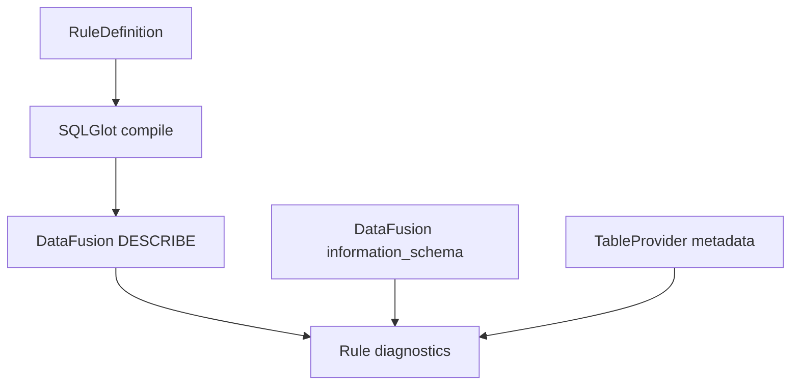

# DataFusion Schema RuleSpec Integration Plan (Design-Phase)

## Goals
- Replace RuleSpec schema checks with DataFusion introspection and computed schemas.
- Use TableProvider metadata (constraints, defaults, DDL provenance) for contracts.
- Integrate DataFusion schema debugging (`DESCRIBE`, `EXPLAIN`) into diagnostics.
- Leverage catalog auto-load and schema-on-read for dynamic adaptability.
- Normalize nested schema views (struct/map/unnest) for CPG pipelines.
- Keep Ibis as the front-end over shared DataFusion `SessionContext`.

## Non-goals
- Changing dataset semantics, names, or row payloads.
- Reintroducing a Python-only schema authority.
- Removing Ibis or replacing SQLGlot as the rule compiler.
- Adding test-only logic or monkeypatching in production code.

## Architecture target
DataFusion owns schema reality; RuleSpec queries DataFusion for validation.



---

## Scope 0: DataFusion-backed RuleSpec schema context
Status: Completed

### Objective
Provide a single DataFusion-aware schema context for RuleSpec that replaces
`SchemaRegistry` lookups with `SessionContext` + `information_schema`.

### Target files
- `src/relspec/runtime.py`
- `src/relspec/registry/rules.py`
- `src/relspec/registry/snapshot.py`
- `src/relspec/rules/validation.py`
- `src/datafusion_engine/schema_introspection.py`
- `src/datafusion_engine/schema_authority.py`

### Implementation checklist
- [x] Add a `RelspecSchemaContext` that exposes table/column lookups via DataFusion.
- [x] Replace `SchemaRegistry` usage in diagnostics with the new context.
- [x] Keep contract metadata only (no schema authority) in `schema_spec/system.py`.

### Code pattern
```python
from datafusion_engine.runtime import DataFusionRuntimeProfile
from datafusion_engine.schema_introspection import SchemaIntrospector

ctx = DataFusionRuntimeProfile().session_context()
introspector = SchemaIntrospector(ctx)
columns = introspector.table_columns("cst_refs")
schema = ctx.table("cst_refs").schema()
```

---

## Scope 1: DataFusion computed-schema validation for RuleSpec SQL
Status: Completed

### Objective
Validate rule SQL using DataFusion-computed schemas (`DESCRIBE <query>`) rather
than static schema maps.

### Target files
- `src/relspec/rules/validation.py`
- `src/relspec/compiler.py`
- `src/relspec/rules/contract_rules.py`

### Implementation checklist
- [x] Add `describe_query_schema(sql)` helper using `ctx.sql("DESCRIBE ...")`.
- [x] Replace `missing_schema_columns` checks with DESCRIBE results.
- [x] Emit diagnostics when output schemas drift from expected contracts.

### Code pattern
```python
sql = "SELECT file_id, path FROM cst_refs"
rows = ctx.sql(f"DESCRIBE {sql}").to_arrow_table().to_pylist()
columns = {row["column_name"] for row in rows}
```

---

## Scope 2: TableProvider metadata for contracts and DDL
Status: Completed

### Objective
Use DataFusion TableProvider metadata (constraints, defaults, DDL provenance) as
the contract source of truth.

### Target files
- `src/schema_spec/system.py`
- `src/relspec/contracts.py`
- `src/datafusion_engine/schema_introspection.py`
- `src/datafusion_engine/runtime.py`

### Implementation checklist
- [x] Extend `SchemaIntrospector` to expose provider metadata.
- [x] Attach contract metadata to DataFusion table registrations where needed.
- [x] Replace `table_spec_from_schema` DDL rendering with provider DDL.

### Code pattern
```python
provider = introspector.table_provider("cst_refs")
ddl = provider.get_table_definition() if provider is not None else None
constraints = provider.constraints() if provider is not None else None
```

---

## Scope 3: Schema debugging as a first-class diagnostic
Status: Completed

### Objective
Integrate `EXPLAIN` (with schema printing) into RuleSpec diagnostics to expose
actual planner schema and coercions.

### Target files
- `src/relspec/rules/validation.py`
- `src/datafusion_engine/runtime.py`
- `src/engine/runtime_profile.py`

### Implementation checklist
- [x] Enable `datafusion.explain.show_schema` in runtime config where safe.
- [x] Add diagnostics that capture `EXPLAIN` output for failed rules.
- [x] Preserve schema snapshots for auditability.

### Code pattern
```python
ctx.sql("SET datafusion.explain.show_schema = true")
plan = ctx.sql("EXPLAIN SELECT * FROM cst_refs").to_pylist()
```

---

## Scope 4: Scan-time schema adapters and hardening
Status: Completed

### Objective
Move schema normalization to scan-time by using DataFusion listing/table
configuration and (where needed) projection expressions.

### Target files
- `src/datafusion_engine/runtime.py`
- `src/datafusion_engine/scan_io.py`
- `src/ibis_engine/scan_io.py`
- `src/datafusion_engine/schema_registry.py`

### Implementation checklist
- [x] Centralize scan-time schema options (CSV/JSON/Parquet) in runtime profile.
- [x] Use DataFusion scan options to align schema drift before query planning.
- [x] Remove bespoke schema adaptation utilities that duplicate DataFusion behavior.

### Code pattern
```python
ctx.sql(
    """
    CREATE EXTERNAL TABLE repo_files
    STORED AS PARQUET
    LOCATION 's3://bucket/repo_files/'
    OPTIONS ('schema_infer_max_records'='5000')
    """
)
```

---

## Scope 5: Catalog auto-load + schema-on-read for dynamic datasets
Status: Completed

### Objective
Enable dynamic schema discovery for datasets that are not explicitly registered,
with safe config gating.

### Target files
- `src/datafusion_engine/runtime.py`
- `src/datafusion_engine/schema_introspection.py`
- `src/relspec/registry/datasets.py`

### Implementation checklist
- [x] Add config flags for catalog auto-load and URL table access.
- [x] Prefer catalog discovery before Python registry fallbacks.
- [x] Document when dynamic discovery is allowed (dev vs prod).

### Code pattern
```python
ctx.enable_url_table()
ctx.sql("SELECT * FROM 's3://bucket/datasets/foo.parquet'")
```

---

## Scope 6: Nested schema view conventions for CPG (struct/map/unnest)
Status: Completed

### Objective
Standardize nested CPG view patterns (spans, attrs, node structs) using
DataFusion struct/map/unnest functions.

### Target files
- `src/datafusion_engine/query_fragments.py`
- `src/datafusion_engine/schema_registry.py`
- `src/extract/cst_extract.py`
- `src/hamilton_pipeline/modules/cpg_build.py`

### Implementation checklist
- [x] Define canonical span/attrs views for CST/SCIP/symtable datasets.
- [x] Use `map_entries` + `unnest` for attrs expansion views.
- [x] Ensure nested views are registered and validated in runtime.

### Code pattern
```sql
SELECT
  base.file_id,
  kv['key'] AS attr_key,
  kv['value'] AS attr_value
FROM cst_refs base
CROSS JOIN unnest(map_entries(base.attrs)) AS kv
```

---

## Scope 7: Typed parameter metadata for param tables
Status: Completed

### Objective
Align param table schemas with DataFusion’s typed parameter facilities and
`information_schema` views.

### Target files
- `src/ibis_engine/param_tables.py`
- `src/datafusion_engine/schema_introspection.py`
- `src/relspec/rules/validation.py`

### Implementation checklist
- [x] Query parameter types from DataFusion when available.
- [x] Use DataFusion schema to validate param table inputs.
- [x] Remove redundant Python param schema definitions.

### Code pattern
```python
params = introspector.query_params("SELECT * FROM params.p_file_ids")
param_schema = ctx.table("params.p_file_ids").schema()
```

---

## Execution order
1. Scope 0: DataFusion-backed RuleSpec schema context. ✅
2. Scope 1: DESCRIBE-based computed schema validation. ✅
3. Scope 2: TableProvider metadata and DDL provenance. ⏳
4. Scope 3: EXPLAIN-based schema diagnostics. ✅
5. Scope 4: Scan-time schema adapters. ⏳
6. Scope 5: Catalog auto-load and schema-on-read. ⏳
7. Scope 6: Nested schema view conventions. ✅
8. Scope 7: Typed parameter metadata for param tables. ⏳
7. Scope 6: Nested schema view conventions.
8. Scope 7: Typed parameter metadata alignment.
