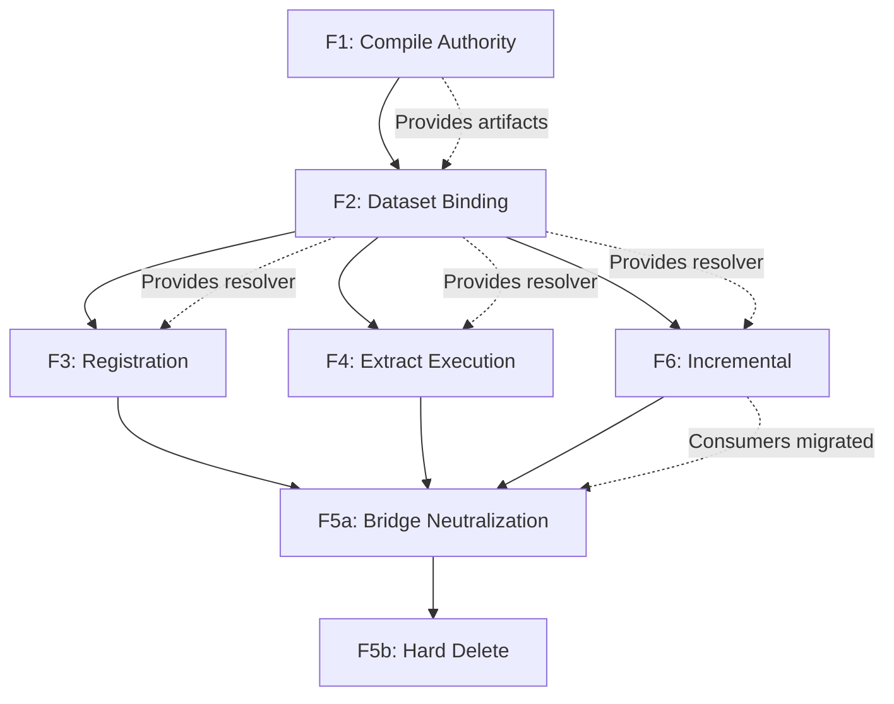

# Semantic-Compiled Architecture: Remaining Scope Implementation Plan v1 (2026-02-07)

## 1. Purpose and Scope

This document provides a comprehensive, implementation-ready plan for completing ALL remaining semantic-compiled architecture scope from the master plan (`docs/plans/semantic_compiled_followup_activities_master_plan_v1_2026-02-06.md`, sections 11-12).

**Coverage:** Waves F1-F6 (F7 already complete)

**Audience:** Implementation agents executing detailed architectural changes

**Exit State:** Single compile authority, single dataset binding authority, single registration authority, single extract execution authority, zero runtime bridge types in core orchestration.

---

## 2. Baseline Snapshot (Current State Summary)

### 2.1 Governance Status

**Cutover Checker:** `scripts/check_semantic_compiled_cutover.py`
- Status: **12 rules, zero violations** in strict mode
- Allowlist: `ir_pipeline.py`, `compile_context.py`, `test_semantic_ir_snapshot.py`
- **Stale entry:** `naming_compat.py` remains in allowlist despite file deletion in F7 — remove as part of governance cleanup
- CI/CD: Runs on every PR in strict mode
- Authority: Blocks legacy patterns (see Section 7 for rule inventory)
- **Pending checker enhancements:** Path-scoped rule logic, optional AST-backed validation (see Section 7.4)

### 2.2 Compile Authority

**Production entrypoint:** `compile_semantic_program()` at `src/semantics/compile_context.py:102-122`

**Manifest structure:** `SemanticProgramManifest` at `src/semantics/program_manifest.py:35-86`
- Fields: `semantic_ir`, `requested_outputs`, `input_mapping`, `validation_policy`, `dataset_bindings`, `validation`, `udf_snapshot`, `fingerprint`
- Dataset bindings: `ManifestDatasetBindings` at program_manifest.py:18-32 with `locations: Mapping[str, DatasetLocation]`

**Callsites (4 total):**
1. `build_cpg()` at `src/semantics/pipeline.py:1362` - compiles manifest
2. `build_cpg_from_inferred_deps()` at `src/semantics/pipeline.py:1925` - **DUPLICATE** recompile
3. `run_zero_row_bootstrap_validation()` at `src/datafusion_engine/session/runtime.py:4534` - validation path
4. Test usage (expected)

**Problem:** Duplicate compilation in `build_cpg_from_inferred_deps()` - compiles at line 1925 AFTER already calling `build_cpg()` at line 1898 (which internally compiles at line 1362).

### 2.3 Wave Completion Status

| Wave | Status | Key Gap |
|------|--------|---------|
| F1 - Compile Authority | **Partial** | Duplicate compile in `build_cpg_from_inferred_deps`, parallel view-node build |
| F2 - Dataset Binding | **Partial** | 30 `dataset_catalog_from_profile` callsites across 22 files |
| F3 - Registration | **Partial** | 31 `register_dataset_df` callsites, duplicate listing registration |
| F4 - Extract Execution | **Partial** | Executor mapping in task_execution.py, not adapter_registry |
| F5 - Runtime Cleanup | **Unimplemented** | `SemanticRuntimeConfig` still exists and widely used |
| F6 - Incremental | **Unimplemented** | 6 catalog callsites in incremental modules |
| F7 - Naming Compat | **Complete** | `naming_compat.py` deleted, zero `_v1` refs in `src/` |

### 2.4 Decommissioned Patterns (Verified Zero Callsites)

- `require_semantic_inputs`
- `semantic_runtime_from_profile`
- `apply_semantic_runtime_config`
- `_extract_outputs_for_template`
- `_REQUIRED_INPUTS`, `_SUPPORTS_PLAN`, `_EXTRACTOR_EXTRA_INPUTS`
- `register_table_provider` (legacy wrapper, removed from `src/`)
- `cpg_nodes_v1`, `cpg_edges_v1` (removed from `src/`)

---

## 3. DataFusion Stack Context

Understanding DataFusion's registration model is critical for implementing target architecture.

### 3.1 Core DataFusion Registration

**Primary API:** `SessionContext.register_table(name: str, table_provider: TableProvider)`

**TableProvider interface:** DataFusion's abstraction for table sources
- Implementations: `ListingTable` (file-based), Delta Lake tables (via FFI PyCapsule), in-memory tables
- Execution: DataFusion's Acero engine consumes TableProvider for scan operations
- Schema: TableProvider exposes schema for query planning

**Deprecated API:** `register_table_provider()` - removed from codebase

### 3.2 Delta Lake Integration

**Delta TableProvider:** Rust delta-kernel FFI via PyCapsule capsule protocol
- Registration: Delta tables registered as native TableProvider instances
- CDF support: Change Data Feed via `_change_data` virtual column
- Snapshot pinning: `version` parameter for reproducible reads

**Write path:** `deltalake.write_deltalake()` with overwrite semantics
- Schema mode: `"overwrite"` for deterministic zero-row bootstrap
- Partitioning: Optional via `partition_by` parameter

### 3.3 Listing Table Pattern

**ListingTable:** File-based table provider for Parquet/Arrow/CSV
- Configuration: File paths, format, partition columns
- Optimization: Supports predicate pushdown, column projection
- Current duplication: Listing registration logic exists in BOTH:
  - `src/datafusion_engine/dataset/registration.py::_register_listing_table`
  - `src/datafusion_engine/tables/registration.py::register_listing_table`

### 3.4 Registration Stack in Codebase

```
RegistryFacade (registry_facade.py)
    ├─> DatasetCatalog (dataset/registry.py)
    ├─> ProviderRegistry (provider/registry.py)
    ├─> UdfCatalog (udf/catalog.py)
    └─> ViewRegistry (views/graph.py)
```

**Pipeline registration paths:**
1. `register_dataset_df()` at `dataset/registration.py:1133` - 31 callsites
2. `register_dataset()` (generic) - 15 callsites
3. `ensure_view_graph()` at `views/registration.py:169` - canonical view registration (4 callsites)
4. RegistryFacade methods - unified facade over multiple registries

**Target:** Collapse to single pipeline-facing registration surface through RegistryFacade.

---

## 4. Implementation Waves

## 4.1 Wave F1 Completion: Compile Authority Collapse

### 4.1.1 Objective

**Eliminate duplicate compilation and view-node building in `build_cpg_from_inferred_deps()`.**

Current problem: `build_cpg()` compiles manifest and builds view nodes, then `build_cpg_from_inferred_deps()` recompiles the same manifest and rebuilds the same view nodes independently.

**Root cause:** `build_cpg()` returns `None`, forcing `build_cpg_from_inferred_deps()` to recompile to access manifest/IR/nodes for lineage extraction.

### 4.1.2 Current State

**build_cpg() flow (pipeline.py:1295-1426):**
1. Line 1362: Compiles manifest via `compile_semantic_program()`
2. Line 1376: Builds view nodes via `_view_nodes_for_cpg()`
3. Line 1389: Registers view graph via `register_view_graph()`
4. Returns: `None` (throws away compilation artifacts)

**build_cpg_from_inferred_deps() flow (pipeline.py:1845-1968):**
1. Line 1898: Calls `build_cpg()` (which compiles internally)
2. Line 1925: **DUPLICATE** recompiles manifest via `compile_semantic_program()`
3. Line 1939: **DUPLICATE** rebuilds view nodes via `_view_nodes_for_cpg()`
4. Line 1960: Extracts lineage from view nodes
5. Returns: Dependency dictionary for rustworkx

**Helper functions:**
- `_view_nodes_for_cpg()` at pipeline.py:1052-1092 - builds `ViewNode` list from `CpgViewNodesRequest`
- `CpgViewNodesRequest` dataclass at pipeline.py:97-108 - parameters for view node construction

**Registration authority split:**
- `build_cpg()` uses `register_view_graph()` at line 1389
- `ensure_view_graph()` at `views/registration.py:169` - canonical registration entrypoint (used by driver_factory, plan/pipeline, task_execution)
- These paths do not converge

### 4.1.3 Changes

**Step 1: Create CpgBuildArtifacts dataclass**

File: `src/semantics/pipeline.py`
Location: After line 108 (after `CpgViewNodesRequest`)

```python
@dataclass(frozen=True)
class CpgBuildArtifacts:
    """Compilation artifacts from CPG build operations."""

    manifest: SemanticProgramManifest
    semantic_ir: SemanticIR
    nodes: list[ViewNode]
    udf_snapshot: Mapping[str, object]
```

**Step 2: Refactor build_cpg() to return artifacts**

File: `src/semantics/pipeline.py:1295`
Current signature:
```python
def build_cpg(
    ctx: SessionContext,
    *,
    runtime_profile: DataFusionRuntimeProfile | None = None,
    runtime_config: SemanticRuntimeConfig,
    options: CpgBuildOptions | None = None,
) -> None:
```

New signature:
```python
def build_cpg(
    ctx: SessionContext,
    *,
    runtime_profile: DataFusionRuntimeProfile | None = None,
    runtime_config: SemanticRuntimeConfig,
    options: CpgBuildOptions | None = None,
) -> CpgBuildArtifacts:
```

Changes:
1. Line 1348: Capture `snapshot` (already exists)
2. Line 1362: Capture `manifest` (already exists)
3. Line 1376: Capture `nodes` (already exists)
4. After line 1415 (before function end): Return artifacts instead of None

```python
        # After all registration/materialization
        return CpgBuildArtifacts(
            manifest=manifest,
            semantic_ir=semantic_ir,
            nodes=nodes,
            udf_snapshot=snapshot,
        )
```

**Step 3: Refactor build_cpg_from_inferred_deps() to consume artifacts**

File: `src/semantics/pipeline.py:1845`

Current code (lines 1898-1962):
```python
        build_cpg(
            ctx,
            runtime_profile=runtime_profile,
            runtime_config=runtime_config,
            options=resolved,
        )

        deps: dict[str, object] = {}
        input_mapping, use_cdf = _resolve_semantic_input_mapping(
            ctx,
            runtime_profile=runtime_profile,
            use_cdf=effective_use_cdf,
            cdf_inputs=resolved.cdf_inputs,
        )
        resolved_outputs = _resolve_requested_outputs(resolved.requested_outputs)
        incremental_outputs = _incremental_requested_outputs(
            _IncrementalOutputRequest(
                ctx=ctx,
                runtime_profile=runtime_profile,
                runtime_config=runtime_config,
                input_mapping=input_mapping,
                use_cdf=use_cdf,
                requested_outputs=resolved.requested_outputs,
            )
        )
        if incremental_outputs is not None:
            resolved_outputs = incremental_outputs
        manifest = compile_semantic_program(  # DUPLICATE
            runtime_profile=runtime_profile,
            outputs=resolved_outputs,
            policy="schema_plus_optional_probe",
            ctx=ctx,
            input_mapping=input_mapping,
        )
        validation = manifest.validation
        if validation is None:
            msg = "Semantic manifest compile must include input validation results."
            raise ValueError(msg)
        if not validation.valid:
            raise SemanticInputValidationError(validation)
        semantic_ir = manifest.semantic_ir
        nodes = _view_nodes_for_cpg(  # DUPLICATE
            CpgViewNodesRequest(
                ctx=ctx,
                runtime_profile=runtime_profile,
                runtime_config=runtime_config,
                cache_policy=resolved.cache_policy,
                config=resolved.config,
                input_mapping=input_mapping,
                use_cdf=use_cdf,
                requested_outputs=resolved_outputs,
                semantic_ir=semantic_ir,
            )
        )
```

New code (replace lines 1898-1962):
```python
        artifacts = build_cpg(
            ctx,
            runtime_profile=runtime_profile,
            runtime_config=runtime_config,
            options=resolved,
        )

        deps: dict[str, object] = {}
        manifest = artifacts.manifest
        semantic_ir = artifacts.semantic_ir
        nodes = artifacts.nodes
```

**Step 4: Update build_cpg() callers**

**Caller 1:** Tests - update to handle returned artifacts (implementation detail, not specified here)

**Caller 2:** `run_zero_row_bootstrap_validation()` at `session/runtime.py:4534`
- Currently: Calls `build_cpg()` and ignores return value
- Change: Ignore returned artifacts (add `_ = build_cpg(...)`)
- **Note:** The bootstrap path does NOT call `build_cpg()` directly for its own compilation — it calls it only to validate the semantic pipeline. No return-handling migration is needed beyond suppressing the unused result.

**Implementation strategy:** Prefer introducing an internal helper `_build_cpg_artifacts(...)` that returns `CpgBuildArtifacts`, while keeping `build_cpg()` as the external-facing function. This avoids a broad public API break:

```python
def _build_cpg_artifacts(
    ctx: SessionContext,
    *,
    runtime_profile: DataFusionRuntimeProfile | None = None,
    runtime_config: SemanticRuntimeConfig,
    options: CpgBuildOptions | None = None,
) -> CpgBuildArtifacts:
    """Internal helper that returns build artifacts."""
    # ... existing build_cpg logic, but returns artifacts ...

def build_cpg(
    ctx: SessionContext,
    *,
    runtime_profile: DataFusionRuntimeProfile | None = None,
    runtime_config: SemanticRuntimeConfig,
    options: CpgBuildOptions | None = None,
) -> None:
    """External API — preserves existing None-return contract."""
    _build_cpg_artifacts(ctx, runtime_profile=runtime_profile, ...)
```

`build_cpg_from_inferred_deps()` then calls `_build_cpg_artifacts()` to get `CpgBuildArtifacts` without breaking external callers of `build_cpg()`.

### 4.1.4 New Types

**CpgBuildArtifacts (new dataclass):**
```python
@dataclass(frozen=True)
class CpgBuildArtifacts:
    """Compilation artifacts from CPG build operations.

    Attributes
    ----------
    manifest
        Compiled semantic program manifest with validation results.
    semantic_ir
        Semantic intermediate representation.
    nodes
        View nodes for registration and lineage extraction.
    udf_snapshot
        Rust UDF snapshot for reproducibility.
    """

    manifest: SemanticProgramManifest
    semantic_ir: SemanticIR
    nodes: list[ViewNode]
    udf_snapshot: Mapping[str, object]
```

Location: `src/semantics/pipeline.py` (add after line 108)

Exports: Add to `__all__` at bottom of pipeline.py

### 4.1.5 Migration Steps

1. **Add CpgBuildArtifacts dataclass** (pipeline.py:109)
2. **Extract `_build_cpg_artifacts()` internal helper** from `build_cpg()` that returns `CpgBuildArtifacts`
3. **Keep `build_cpg()` as thin wrapper** calling `_build_cpg_artifacts()` and discarding the return — preserves external API contract
4. **Simplify build_cpg_from_inferred_deps()** to call `_build_cpg_artifacts()` and consume artifacts (pipeline.py:1898-1962)
5. **Update test callers** as needed
6. **Add CpgBuildArtifacts to __all__** (pipeline.py, bottom)

### 4.1.6 Deletions

**Lines to delete:**
- `build_cpg_from_inferred_deps()` lines 1906-1962: All duplicate compilation/view-node building logic

**No file deletions** in this wave.

### 4.1.7 Exit Criteria

1. **Single compilation per build:** `compile_semantic_program()` called exactly once per `build_cpg_from_inferred_deps()` invocation
2. **Single view-node build per build:** `_view_nodes_for_cpg()` called exactly once per `build_cpg_from_inferred_deps()` invocation
3. **Artifacts returned:** `build_cpg()` returns `CpgBuildArtifacts` with all compilation products
4. **No duplicate code:** Lines 1906-1962 in `build_cpg_from_inferred_deps()` deleted
5. **Smoke tests pass:** See Section 4.1.8

### 4.1.8 Smoke Tests

```bash
# Verify single compilation
uv run pytest tests/integration/test_semantic_pipeline.py -v -k test_build_cpg

# Verify inferred deps path
uv run pytest tests/integration/relspec/test_compile_execution_plan.py -v

# Verify bootstrap path
uv run pytest tests/integration/test_zero_row_bootstrap_e2e.py -v

# CQ verification
./cq calls build_cpg
./cq calls build_cpg_from_inferred_deps
./cq calls compile_semantic_program  # Should show 2 production callsites
```

### 4.1.9 CQ Recipe Guide

**Activity: Pre-implementation discovery (run before writing any code)**

| Recipe | Purpose |
|--------|---------|
| `./cq calls build_cpg` | Census all callers of `build_cpg()`. Every caller currently expects `None` return and must be updated to handle `CpgBuildArtifacts`. |
| `./cq calls build_cpg_from_inferred_deps` | Identify external callers that depend on the current return dict shape. Determines migration surface for the refactored function. |
| `./cq calls compile_semantic_program` | Verify exactly which production paths compile manifests. Expect the duplicate at `pipeline.py:1925` — this is the callsite to eliminate. |
| `./cq calls _view_nodes_for_cpg` | Confirm the duplicate view-node build exists. Should show 2 callsites in `pipeline.py` (one in `build_cpg`, one in `build_cpg_from_inferred_deps`). Both callers must converge to one. |
| `./cq sig-impact build_cpg --to "build_cpg(ctx: SessionContext, *, runtime_profile: DataFusionRuntimeProfile \| None = None, runtime_config: SemanticRuntimeConfig, options: CpgBuildOptions \| None = None) -> CpgBuildArtifacts"` | Classify all callsites as `would_break`, `ambiguous`, or `ok` for the return type change from `None` to `CpgBuildArtifacts`. Identifies which callers need explicit update. |
| `./cq search CpgViewNodesRequest` | Understand current request object usage before modifying the view-node build path. Shows how the request is constructed in both the original and duplicate paths. |
| `./cq impact build_cpg --param runtime_config` | Trace how `runtime_config` flows into `build_cpg()` and which downstream functions consume it. Critical for understanding the artifact surface. |

**Activity: Mid-implementation verification (run after creating CpgBuildArtifacts and changing return type)**

| Recipe | Purpose |
|--------|---------|
| `./cq search CpgBuildArtifacts` | Verify the new dataclass is defined and referenced correctly. Should appear in `pipeline.py` definition + all updated callers. |
| `./cq search "compile_semantic_program" --in src/semantics/pipeline.py` | Count occurrences in pipeline.py. During refactoring, confirms when the duplicate call has been removed (should drop from 2 to 1). |

**Activity: Post-implementation validation (run after all changes complete)**

| Recipe | Purpose |
|--------|---------|
| `./cq calls compile_semantic_program` | **Exit gate.** Must show exactly 2 production callsites (`build_cpg` + bootstrap). The duplicate at `~line 1925` must be gone. |
| `./cq calls _view_nodes_for_cpg` | **Exit gate.** Must show exactly 1 callsite (inside `build_cpg` only). The duplicate in `build_cpg_from_inferred_deps` must be gone. |
| `./cq search "compile_semantic_program" --in src/semantics/pipeline.py` | **Exit gate.** Must show 1 occurrence in pipeline.py (not two). |
| `./cq q "entity=function name=build_cpg expand=callees" --format mermaid` | Visualize the call graph to confirm single compilation flow — `build_cpg` → `compile_semantic_program` → `_view_nodes_for_cpg`, no parallel path. |

---

## 4.2 Wave F2 Completion: Dataset Binding Authority

### 4.2.1 Objective

**Thread manifest dataset bindings through orchestration and eliminate distributed catalog lookups.**

Target: Reduce `dataset_catalog_from_profile()` callsites from 30 (across 22 files) to 4 compile-boundary callsites only.

### 4.2.2 Current State

**Census: 30 callsites to dataset_catalog_from_profile() across 22 files**

Classification by usage pattern:

**Compile boundary (keep, 4 sites):**
1. `src/semantics/compile_context.py:61` - `CompileContext.dataset_bindings()` method
2. `src/datafusion_engine/registry_facade.py:389` - facade construction
3. `src/datafusion_engine/views/registry_specs.py:166` - view registry catalog
4. `src/datafusion_engine/plan/bundle.py:1911` - plan bundle catalog

**Orchestration layer (migrate, 14 sites):**
1. `src/datafusion_engine/dataset/resolution.py:254` - `_resolve_dataset_location()`
2. `src/datafusion_engine/delta/cdf.py:58` - `register_cdf_inputs()`
3. `src/datafusion_engine/io/write.py:863` - `WritePipeline._dataset_location_for_destination()`
4. `src/datafusion_engine/plan/pipeline.py:148` - `_scan_planning()`
5. `src/datafusion_engine/session/runtime.py:4081` - `RuntimeProfileCatalog.location()`
6. `src/datafusion_engine/session/runtime.py:4129` - `RuntimeProfileCatalog.catalog()`
7. `src/datafusion_engine/session/runtime.py:7616` - `record_dataset_readiness()`
8. `src/datafusion_engine/views/graph.py:849` - view graph dataset resolution
9. `src/datafusion_engine/views/graph.py:1205` - second view graph resolution
10. `src/engine/materialize_pipeline.py:256` - scan unit planning
11. `src/engine/materialize_pipeline.py:430` - second scan unit planning
12. `src/extract/coordination/materialization.py:442` - extract materialization
13. `src/extract/coordination/materialization.py:494` - second extract materialization
14. `src/extract/infrastructure/worklists.py:195` - worklist locations
15. `src/semantics/pipeline.py:569` - pipeline registration
16. `src/semantics/pipeline.py:2038` - second pipeline registration
17. `src/hamilton_pipeline/driver_factory.py:579` - manifest for view
18. `src/hamilton_pipeline/modules/task_execution.py:601` - task execution
19. `src/hamilton_pipeline/modules/task_execution.py:860` - second task execution

**Incremental modules (Wave F6 overlap, 6 sites):**
1. `src/semantics/incremental/cdf_runtime.py:83`
2. `src/semantics/incremental/delta_context.py:130`
3. `src/semantics/incremental/delta_context.py:203`
4. `src/semantics/incremental/delta_updates.py:47`
5. `src/semantics/incremental/plan_bundle_exec.py:110`
6. `src/semantics/incremental/snapshot.py:186`

**Common pattern:** All access `runtime.profile` or `runtime_profile`, call `dataset_catalog_from_profile()`, then lookup location by name.

### 4.2.3 New Types

**ManifestDatasetResolver protocol:**

File: `src/semantics/program_manifest.py` (add after `ManifestDatasetBindings` class)

```python
from typing import Protocol

class ManifestDatasetResolver(Protocol):
    """Read-only protocol for resolving dataset locations from manifest bindings."""

    def location(self, name: str) -> DatasetLocation | None:
        """Return dataset location for a name, or None if not found.

        Parameters
        ----------
        name
            Dataset name to resolve.

        Returns
        -------
        DatasetLocation | None
            Location if found, None otherwise.
        """
        ...

    def has_location(self, name: str) -> bool:
        """Check if a dataset location exists.

        Parameters
        ----------
        name
            Dataset name to check.

        Returns
        -------
        bool
            True if location exists.
        """
        ...

    def names(self) -> Sequence[str]:
        """Return all dataset names in the resolver.

        Returns
        -------
        Sequence[str]
            All dataset names.
        """
        ...
```

**ManifestDatasetBindings implementation (update existing class):**

File: `src/semantics/program_manifest.py:18-32` (add methods to existing dataclass)

```python
@dataclass(frozen=True)
class ManifestDatasetBindings:
    """Resolved dataset bindings for a semantic program."""

    locations: Mapping[str, DatasetLocation]

    def payload(self) -> dict[str, object]:
        """Return a JSON-serializable payload for diagnostics."""
        return {
            name: {
                "path": str(location.path),
                "format": location.format,
            }
            for name, location in sorted(self.locations.items())
        }

    # NEW METHODS (add below payload())

    def location(self, name: str) -> DatasetLocation | None:
        """Return dataset location for a name, or None if not found."""
        return self.locations.get(name)

    def has_location(self, name: str) -> bool:
        """Check if a dataset location exists."""
        return name in self.locations

    def names(self) -> Sequence[str]:
        """Return all dataset names in the resolver."""
        return tuple(self.locations.keys())
```

**Type exports:**

Add to `__all__` in `src/semantics/program_manifest.py`:
```python
__all__ = ["ManifestDatasetBindings", "ManifestDatasetResolver", "SemanticProgramManifest"]
```

### 4.2.4 Migration Steps

**Phase 1: Update compile boundary to provide resolver**

File: `src/semantics/pipeline.py`

Add resolver to `build_cpg()` return (update `CpgBuildArtifacts` from F1):
```python
@dataclass(frozen=True)
class CpgBuildArtifacts:
    """Compilation artifacts from CPG build operations."""

    manifest: SemanticProgramManifest
    semantic_ir: SemanticIR
    nodes: list[ViewNode]
    udf_snapshot: Mapping[str, object]
    resolver: ManifestDatasetResolver  # NEW FIELD
```

Update `build_cpg()` return (line ~1416):
```python
        return CpgBuildArtifacts(
            manifest=manifest,
            semantic_ir=semantic_ir,
            nodes=nodes,
            udf_snapshot=snapshot,
            resolver=manifest.dataset_bindings,  # NEW
        )
```

**Phase 2: Thread resolver through orchestration seams**

**Seam 1: Task execution (hamilton_pipeline/modules/task_execution.py)**

Current code (line ~601):
```python
catalog = dataset_catalog_from_profile(runtime_profile)
location = catalog.get(dataset_name)
```

New parameter for functions needing dataset resolution:
```python
def execute_task(
    ...,
    dataset_resolver: ManifestDatasetResolver,  # NEW
) -> ...:
    location = dataset_resolver.location(dataset_name)
    if location is None:
        msg = f"Dataset {dataset_name} not found in manifest bindings"
        raise ValueError(msg)
```

**Seam 2: Extract materialization (extract/coordination/materialization.py)**

Add `dataset_resolver` parameter to `materialize_extract_plan()` signature (line 634):

Current:
```python
def materialize_extract_plan(
    name: str,
    plan: DataFusionPlanBundle,
    *,
    runtime_profile: DataFusionRuntimeProfile,
    determinism_tier: DeterminismTier,
    options: ExtractMaterializeOptions | None = None,
) -> TableLike | pa.RecordBatchReader:
```

New:
```python
def materialize_extract_plan(
    name: str,
    plan: DataFusionPlanBundle,
    *,
    runtime_profile: DataFusionRuntimeProfile,
    dataset_resolver: ManifestDatasetResolver,  # NEW
    determinism_tier: DeterminismTier,
    options: ExtractMaterializeOptions | None = None,
) -> TableLike | pa.RecordBatchReader:
```

Replace catalog lookups (lines 442, 494) with resolver calls:
```python
# Old:
catalog = dataset_catalog_from_profile(runtime_profile)
location = catalog.get(name)

# New:
location = dataset_resolver.location(name)
```

**Seam 3: Plan pipeline (datafusion_engine/plan/pipeline.py)**

Add `dataset_resolver` to scan planning functions (line ~148).

**Seam 4: Materialize pipeline (engine/materialize_pipeline.py)**

Add `dataset_resolver` parameter to scan unit planning (lines 256, 430).

**Seam 5: View graph (datafusion_engine/views/graph.py)**

Add `dataset_resolver` parameter to view graph dataset resolution (lines 849, 1205).

**Seam 6: Write pipeline (datafusion_engine/io/write.py)**

Add `dataset_resolver` to `WritePipeline` initialization (line 863).

**Seam 7: Session runtime (datafusion_engine/session/runtime.py)**

Update `RuntimeProfileCatalog` methods to accept resolver (lines 4081, 4129, 7616).

**Phase 3: Update top-level orchestrators**

All orchestrators calling migrated functions must thread resolver from compile boundary:

1. `build_cpg()` - already has access via `artifacts.resolver`
2. `build_cpg_from_inferred_deps()` - already has access via `artifacts.resolver`
3. Hamilton driver factory - receive resolver from upstream
4. Task execution nodes - receive resolver as parameter

**Phase 4: Keep compile boundary callsites**

These 4 callsites remain unchanged (compile authority):
1. `src/semantics/compile_context.py:61`
2. `src/datafusion_engine/registry_facade.py:389`
3. `src/datafusion_engine/views/registry_specs.py:166`
4. `src/datafusion_engine/plan/bundle.py:1911`

### 4.2.5 Execution Strategy: SemanticExecutionContext

**Optimization:** Instead of threading many new parameters (`dataset_resolver`, `registry_facade`, `manifest`, `runtime_profile`) through each function signature independently, introduce a single shared context object:

```python
@dataclass(frozen=True)
class SemanticExecutionContext:
    """Shared execution context carrying compiled artifacts and authorities.

    Thread this single object instead of N individual parameters to reduce
    callsite churn and simplify migration rollback.

    Attributes
    ----------
    manifest
        Compiled semantic program manifest.
    dataset_resolver
        Dataset location resolver from manifest bindings.
    registry_facade
        Unified registration facade.
    runtime_profile
        DataFusion runtime profile.
    ctx
        DataFusion session context.
    """

    manifest: SemanticProgramManifest
    dataset_resolver: ManifestDatasetResolver
    registry_facade: RegistryFacade
    runtime_profile: DataFusionRuntimeProfile
    ctx: SessionContext
```

**Benefits:**
1. Smaller diffs — one parameter change per function instead of N
2. Easier migration rollback — revert one object instead of many parameters
3. Less callsite churn — callers pass one object, not a growing parameter list
4. Cleaner API stability — new fields added to context without signature changes

**Usage:** Construct at compile boundary (after `build_cpg()` or `_build_cpg_artifacts()`), thread through orchestration:

```python
exec_ctx = SemanticExecutionContext(
    manifest=artifacts.manifest,
    dataset_resolver=artifacts.manifest.dataset_bindings,
    registry_facade=facade,
    runtime_profile=runtime_profile,
    ctx=ctx,
)
```

**Location:** `src/semantics/pipeline.py` (add alongside `CpgBuildArtifacts`)

### 4.2.6 Manifest Versioning

Add explicit manifest schema version for forward-compatible evolution:

```python
@dataclass(frozen=True)
class SemanticProgramManifest:
    manifest_version: int = 1  # NEW FIELD
    # ... existing fields ...
```

Add deterministic serialization tests:
- Manifest roundtrip golden test (serialize → deserialize → compare)
- Version compatibility assertion

### 4.2.7 Resolver API Expansion

Add explicit APIs to `ManifestDatasetBindings` to reduce repeated defensive code:

```python
def require_location(self, name: str) -> DatasetLocation:
    """Return dataset location or raise structured KeyError."""
    location = self.locations.get(name)
    if location is None:
        msg = f"Required dataset location not found: {name!r}"
        raise KeyError(msg)
    return location

def subset(self, names: Sequence[str]) -> ManifestDatasetBindings:
    """Return a new bindings object filtered to the given names."""
    return ManifestDatasetBindings(
        locations={n: self.locations[n] for n in names if n in self.locations}
    )

def to_payload(self) -> dict[str, object]:
    """Return canonical deterministic-ordered serialization."""
    return {
        name: {
            "path": str(location.path),
            "format": location.format,
        }
        for name, location in sorted(self.locations.items())
    }
```

### 4.2.8 Governance Target

Replace fixed numeric callsite targets with allowlist/path-based governance goals:

**Instead of:** "Reduce to 4 callsites"
**Use:** "Zero `dataset_catalog_from_profile` callsites outside compile-boundary module allowlist"

Compile-boundary allowlist:
- `src/semantics/compile_context.py`
- `src/datafusion_engine/registry_facade.py`
- `src/datafusion_engine/views/registry_specs.py`
- `src/datafusion_engine/plan/bundle.py`

Any callsite outside this allowlist is a governance violation.

### 4.2.9 Cutover Checker Rules

Add to `scripts/check_semantic_compiled_cutover.py`:

```python
_CHECKS: tuple[tuple[str, tuple[str, ...]], ...] = (
    # ... existing checks ...
    (
        "orchestration-layer dataset_catalog_from_profile usage",
        ("dataset_catalog_from_profile(",),
    ),
)

_ORCHESTRATION_ALLOWLIST_SUFFIXES: tuple[str, ...] = (
    "src/semantics/compile_context.py",
    "src/datafusion_engine/registry_facade.py",
    "src/datafusion_engine/views/registry_specs.py",
    "src/datafusion_engine/plan/bundle.py",
)

def _is_orchestration_allowlisted(path: Path) -> bool:
    normalized = str(path).replace("\\", "/")
    return any(normalized.endswith(suffix) for suffix in _ORCHESTRATION_ALLOWLIST_SUFFIXES)
```

Update `_find_violations()` to check orchestration allowlist for `dataset_catalog_from_profile` pattern.

### 4.2.10 Deletions

**No file deletions** in this wave.

**Import deletions:**
- Remove `from datafusion_engine.dataset.registry import dataset_catalog_from_profile` from 14 orchestration files after migration

### 4.2.11 Exit Criteria

1. **Resolver protocol exists:** `ManifestDatasetResolver` protocol in `program_manifest.py`
2. **Bindings implement protocol:** `ManifestDatasetBindings` has `location()`, `has_location()`, `names()`, `require_location()`, `subset()`, `to_payload()` methods
3. **SemanticExecutionContext exists:** Shared context object carrying manifest, resolver, facade, profile, ctx
4. **Orchestration threaded:** All 14 orchestration callsites accept execution context or resolver parameter
5. **Compile boundary preserved:** Zero `dataset_catalog_from_profile` callsites outside allowlist
6. **Manifest versioning:** `manifest_version` field present, roundtrip golden test passes
7. **Cutover checker enforces:** New rule blocks orchestration-layer catalog lookups
8. **CQ verification:** `./cq calls dataset_catalog_from_profile` shows only allowlisted callsites

### 4.2.12 Smoke Tests

```bash
# Verify resolver protocol
uv run pytest tests/unit/semantics/test_program_manifest.py -v -k resolver

# Verify orchestration seams
uv run pytest tests/integration/test_semantic_pipeline.py -v
uv run pytest tests/integration/extraction/test_materialize_extract_plan.py -v

# CQ verification
./cq calls dataset_catalog_from_profile  # Should show only compile-boundary (allowlisted) callsites
./cq search ManifestDatasetResolver  # Should show protocol usage
./cq search SemanticExecutionContext  # Should show context threading
```

### 4.2.13 CQ Recipe Guide

**Activity: Pre-implementation discovery (run before writing any code)**

| Recipe | Purpose |
|--------|---------|
| `./cq calls dataset_catalog_from_profile` | **Critical.** Full census of all 30 callsites. Use this output to build the migration checklist and classify each callsite as compile-boundary (keep), orchestration (migrate), or incremental (Wave F6). |
| `./cq search ManifestDatasetBindings` | Understand current construction and consumption of manifest bindings. Expect to find `compile_context.py` (constructor) and `program_manifest.py` (definition). |
| `./cq impact dataset_catalog_from_profile --param profile` | Trace how the `profile` parameter flows through catalog construction. Reveals which callers truly need the full profile vs just a location lookup — the latter are migration candidates. |
| `./cq search "catalog.get(" --in src/datafusion_engine` | Find the `catalog.get(name)` lookup pattern that will be replaced with `resolver.location(name)`. Each match is a mechanical replacement point. |
| `./cq search "catalog.has(" --in src/datafusion_engine` | Find the `catalog.has(name)` check pattern that will be replaced with `resolver.has_location(name)`. |
| `./cq sig-impact materialize_extract_plan --to "materialize_extract_plan(name: str, plan: DataFusionPlanBundle, *, runtime_profile: DataFusionRuntimeProfile, dataset_resolver: ManifestDatasetResolver, determinism_tier: DeterminismTier, options: ExtractMaterializeOptions \| None = None) -> TableLike \| pa.RecordBatchReader"` | Before adding `dataset_resolver` parameter: classify which of 25 callers would break. Plan migration order from this output. |
| `./cq q "entity=import name=dataset_catalog_from_profile"` | List all import sites. After migration, each import outside the compile boundary must be removed. |

**Activity: Per-seam migration verification (run after migrating each seam)**

| Recipe | Purpose |
|--------|---------|
| `./cq search "dataset_catalog_from_profile" --in src/hamilton_pipeline` | After migrating `task_execution.py` and `driver_factory.py`: must show 0 results. |
| `./cq search "dataset_catalog_from_profile" --in src/engine` | After migrating `materialize_pipeline.py`: must show 0 results. |
| `./cq search "dataset_catalog_from_profile" --in src/extract` | After migrating extract modules: must show 0 results. |
| `./cq search "dataset_catalog_from_profile" --in src/datafusion_engine/io` | After migrating `write.py`: must show 0 results. |
| `./cq search "dataset_catalog_from_profile" --in src/datafusion_engine/plan` | After migrating `pipeline.py`: must show 0 results (keep `bundle.py` compile-boundary site). |
| `./cq search "dataset_resolver" --in src/hamilton_pipeline` | Verify resolver is threaded through Hamilton pipeline modules after migration. |

**Activity: Post-implementation validation (run after all changes complete)**

| Recipe | Purpose |
|--------|---------|
| `./cq calls dataset_catalog_from_profile` | **Exit gate.** Must show exactly 4 compile-boundary callsites (`compile_context.py`, `registry_facade.py`, `registry_specs.py`, `bundle.py`). Any orchestration callsite is a missed migration. |
| `./cq search ManifestDatasetResolver` | Verify protocol is defined and consumed across orchestration modules. Should appear in `program_manifest.py` (definition) + all migrated orchestration files. |
| `./cq search "dataset_resolver.location(" ` | Verify resolver lookups replaced catalog lookups in orchestration code. Should show 14+ occurrences across migrated files. |
| `./cq q "entity=import name=ManifestDatasetResolver"` | Verify the protocol is imported in all files that accept it as a parameter. |

---

## 4.3 Wave F3 Completion: Registration Consolidation

### 4.3.1 Objective

**Collapse registration surface area and eliminate duplicate listing registration.**

Target: Choose one listing registration authority, reduce `register_dataset_df` fan-out, keep `RegistryFacade` as pipeline-facing surface.

### 4.3.2 Current State

**Registration callsite census:**
- `register_dataset_df()` - 31 callsites across 21 files
- `register_dataset()` (generic) - 15 callsites across 12 files

**Duplicate listing registration:**
1. `src/datafusion_engine/dataset/registration.py::_register_listing_table` (private helper)
2. `src/datafusion_engine/tables/registration.py::register_listing_table` (public API)

**Registration stack:**
```
Pipeline callers
    └─> RegistryFacade (registry_facade.py:134)
            ├─> register_dataset_df() → DatasetCatalog + ProviderRegistry
            └─> register_dataset() → RegistrationResult
                    └─> DataFusionIOAdapter (io/adapter.py:100)
                            └─> register_listing_table() OR Delta registration
```

**RegistryFacade methods (registry_facade.py:160-228):**
- `register_dataset_df()` - returns DataFrame (line 160)
- `register_dataset()` - returns RegistrationResult (line 217)
- Both orchestrate: dataset catalog registration → provider registration

**DataFusionIOAdapter (io/adapter.py:100):**
- `register_view()` - register computed view
- `register_listing_table()` - register file-based table
- `register_delta_table()` - register Delta table
- `register_delta_cdf()` - register CDF view

### 4.3.3 Changes

**Step 1: Choose listing registration authority**

**Decision: Keep `tables/registration.py::register_listing_table()` as sole authority**

Rationale:
- `tables/registration.py` is the dedicated table registration module
- `dataset/registration.py` should focus on dataset catalog, not provider logic
- Cleaner separation of concerns

**Step 2: Remove duplicate listing registration in dataset/registration.py**

File: `src/datafusion_engine/dataset/registration.py`

Find `_register_listing_table()` function (private helper).

**Delete:** Entire `_register_listing_table()` function definition

**Update callsites:** Replace calls to `_register_listing_table()` with calls to `tables.registration.register_listing_table()`

**Important:** The current `register_listing_table()` in `tables/registration.py` uses a context-protocol API (`ListingRegistrationContext`), not positional arguments:

```python
# Current API (tables/registration.py):
class ListingRegistrationContext(Protocol):
    @property
    def ctx(self) -> SessionContext: ...
    @property
    def name(self) -> str: ...
    @property
    def location(self) -> DatasetLocation: ...
    @property
    def options(self) -> DataFusionRegistryOptions: ...
    @property
    def runtime_profile(self) -> DataFusionRuntimeProfile | None: ...

def register_listing_table(context: ListingRegistrationContext) -> ListingRegistrationResult:
    ...
```

Migration approach — **do not rewrite callsites to a non-existent positional signature.** Instead:

1. First refactor `_register_listing_table()` into a delegating wrapper around the authoritative `register_listing_table()`:
   ```python
   # Old (dataset/registration.py):
   def _register_listing_table(ctx, name, location, cache_policy):
       # direct implementation

   # Intermediate (delegating wrapper):
   def _register_listing_table(ctx, name, location, cache_policy):
       # Build a context adapter and delegate
       adapter_ctx = _ListingRegistrationAdapter(ctx, name, location, cache_policy)
       result = register_listing_table(adapter_ctx)
       return result.df
   ```

2. After proving functional parity via tests, remove the wrapper entirely.

**Step 3: Consolidate register_dataset_df fan-out**

**Analysis:** 31 callsites fall into categories:
1. **Direct pipeline orchestration** (keep, route through facade)
2. **Legacy compatibility wrappers** (migrate to facade)
3. **Internal registration helpers** (keep, document as internal)

**Approach:** Add docstring guidance to `register_dataset_df()` directing new callers to use `RegistryFacade.register_dataset_df()` instead.

File: `src/datafusion_engine/dataset/registration.py:1133`

Update docstring:
```python
def register_dataset_df(
    ctx: SessionContext,
    *,
    name: str,
    location: DatasetLocation,
    options: DatasetRegistrationOptions | None = None,
) -> DataFrame:
    """Register a dataset location with DataFusion and return a DataFrame.

    .. deprecated::
        For new code, prefer using RegistryFacade.register_dataset_df() for
        unified registration with rollback semantics.

    Returns:
    -------
    datafusion.dataframe.DataFrame
        DataFusion DataFrame for the registered dataset.
    """
```

**Step 4: Route high-priority orchestration through facade**

High-priority files using `register_dataset_df()` directly:
1. `src/hamilton_pipeline/modules/task_execution.py`
2. `src/engine/materialize_pipeline.py`
3. `src/datafusion_engine/bootstrap/zero_row.py`
4. `src/extract/coordination/materialization.py`

**Approach:** Thread `RegistryFacade` instance through these orchestrators.

Example (task_execution.py):
```python
# Old:
from datafusion_engine.dataset.registration import register_dataset_df
df = register_dataset_df(ctx, name=name, location=location)

# New:
# Receive facade as parameter
def execute_task(..., registry_facade: RegistryFacade) -> ...:
    df = registry_facade.register_dataset_df(
        name=name,
        location=location,
        cache_policy=cache_policy,
    )
```

### 4.3.4 Migration Steps

1. **Refactor `_register_listing_table` into delegating wrapper** — build adapter context, delegate to `tables/registration.py::register_listing_table()` (do NOT delete yet)
2. **Run smoke tests** to verify functional parity between wrapper and direct implementation
3. **After parity proven: delete `_register_listing_table` wrapper** and update callers to use `register_listing_table()` directly with appropriate context objects
4. **Add deprecation notice** to `register_dataset_df()` docstring
5. **Thread RegistryFacade** through high-priority orchestrators (4 files)
6. **Update imports** in migrated files

### 4.3.5 Deletions

**Function deletions:**
- `src/datafusion_engine/dataset/registration.py::_register_listing_table` (entire function)

**No file deletions** in this wave.

### 4.3.6 Exit Criteria

1. **Single listing authority:** Only `tables/registration.py::register_listing_table()` exists
2. **Duplicate removed:** `_register_listing_table()` deleted from `dataset/registration.py`
3. **Facade documented:** Deprecation notice in `register_dataset_df()` docstring
4. **High-priority migrated:** 4 orchestration files use `RegistryFacade.register_dataset_df()`
5. **CQ verification:** `./cq calls _register_listing_table` shows 0 callsites

### 4.3.7 Smoke Tests

```bash
# Verify no duplicate listing registration
./cq search _register_listing_table  # Should show 0 results

# Verify facade usage
./cq calls "RegistryFacade.register_dataset_df"

# Integration smoke
uv run pytest tests/integration/test_semantic_pipeline.py -v
uv run pytest tests/unit/test_registry_facade_rollback.py -v
```

### 4.3.8 CQ Recipe Guide

**Activity: Pre-implementation discovery (run before writing any code)**

| Recipe | Purpose |
|--------|---------|
| `./cq calls register_dataset_df` | Full census of 31 callsites. Classify each as: pipeline orchestration (migrate to facade), internal helper (keep), or test (update). |
| `./cq calls _register_listing_table` | Find all callers of the private duplicate. Should show callsites only in `dataset/registration.py`. These must be redirected to `tables/registration.py::register_listing_table` before deletion. |
| `./cq calls register_listing_table` | Find all callers of the public authority in `tables/registration.py`. Understand current consumer set to verify no breakage from consolidation. |
| `./cq search "RegistryFacade" --in src/datafusion_engine` | Map current facade usage and threading patterns. Shows which orchestration modules already use the facade vs calling `register_dataset_df` directly. |
| `./cq q "entity=function name=_register_listing_table"` | Get the full definition of the duplicate function. Compare its behavior with the public authority to understand any differences before deletion. |
| `./cq q "entity=function name=register_listing_table in=src/datafusion_engine/tables"` | Get the authority function definition for side-by-side comparison with the duplicate. |
| `./cq search "RegistryFacade.register_dataset_df" --in src` | Find existing facade method callers. These are already on the target pattern — no migration needed for them. |

**Activity: Mid-implementation verification (run during migration)**

| Recipe | Purpose |
|--------|---------|
| `./cq search "_register_listing_table" --in src/datafusion_engine/dataset` | After deletion: must show 0 results. Any remaining reference is a broken callsite. |
| `./cq calls register_listing_table` | After migration: should show increased callsite count as callers of the deleted function are redirected here. |

**Activity: Post-implementation validation (run after all changes complete)**

| Recipe | Purpose |
|--------|---------|
| `./cq search "def _register_listing_table("` | **Exit gate.** Must show 0 results. Confirms duplicate function definition is deleted. |
| `./cq search "_register_listing_table" --in src` | **Exit gate.** Must show 0 results anywhere in `src/`. No dangling references or calls to the deleted function. |
| `./cq calls "RegistryFacade.register_dataset_df"` | Should show increased callsite count from migrated orchestration callers. |
| `./cq search "from datafusion_engine.dataset.registration import register_dataset_df" --in src/hamilton_pipeline` | After facade migration: should show 0 results in Hamilton pipeline (now uses facade). |

---

## 4.4 Wave F4 Completion: Extract Execution Contract

### 4.4.1 Objective

**Centralize extract adapter execution mapping and eliminate template-name duplication.**

Current problem: `_EXTRACT_ADAPTER_EXECUTORS` dict in `task_execution.py` duplicates template-name knowledge from `adapter_registry.py`.

**Layering constraint:** The executor registry must remain in the orchestration layer (`hamilton_pipeline/`) to avoid coupling `datafusion_engine` to `hamilton_pipeline` execution concerns and prevent import cycles. Keep adapter *metadata* in `datafusion_engine/extract/adapter_registry.py`; keep execution *dispatch* in an orchestration-side module.

### 4.4.2 Current State

**Adapter metadata (adapter_registry.py):**
- Centralized adapter metadata (template names, schemas, required inputs)
- Location: `src/datafusion_engine/extract/adapter_registry.py`

**Execution mapping (task_execution.py):**
- `_EXTRACT_ADAPTER_EXECUTORS` dict at top of file
- Maps adapter names to callable functions
- Location: `src/hamilton_pipeline/modules/task_execution.py`

**Current dispatch pattern (task_execution.py:839-852):**
```python
_EXTRACT_ADAPTER_EXECUTORS: Mapping[
    str,
    Callable[[TaskExecutionInputs, ExtractSession, str], Mapping[str, object]],
] = {
    "repo_scan": _extract_repo_scan,
    "scip": _extract_scip,
    "python_imports": _extract_python_imports,
    "python_external": _extract_python_external,
    "ast": _extract_ast,
    "cst": _extract_cst,
    "tree_sitter": _extract_tree_sitter,
    "bytecode": _extract_bytecode,
    "symtable": _extract_symtable,
}
```

**Note:** Template keys are `"ast"`, `"cst"`, `"tree_sitter"`, etc. — not `"ast_extract"`, `"cst_extract"`. All migration code must use actual template key names.

**materialize_extract_plan() usage:**
- 25 callsites across 13 files
- Most callers: individual extractors (ast_extract, bytecode_extract, etc.)
- Location: `src/extract/coordination/materialization.py:634`

### 4.4.3 Changes

**Step 1: Create execution registry in orchestration layer**

**File: `src/hamilton_pipeline/modules/extract_execution_registry.py` (NEW)**

Move the executor mapping from `task_execution.py` into a dedicated orchestration-side module. This keeps execution dispatch in the Hamilton layer and avoids coupling `datafusion_engine` to execution concerns.

```python
"""Centralized extract adapter execution registry.

Adapter template names from ``datafusion_engine.extract.adapter_registry``
are the canonical key source. Execution callables live here in the orchestration
layer to prevent import cycles.
"""
from __future__ import annotations

from typing import TYPE_CHECKING, Callable, Mapping

if TYPE_CHECKING:
    from hamilton_pipeline.modules.task_execution import (
        ExtractSession,
        TaskExecutionInputs,
    )

# Import executor functions (same as current task_execution.py)
from hamilton_pipeline.modules.task_execution import (
    _extract_ast,
    _extract_bytecode,
    _extract_cst,
    _extract_python_external,
    _extract_python_imports,
    _extract_repo_scan,
    _extract_scip,
    _extract_symtable,
    _extract_tree_sitter,
)

_EXTRACT_ADAPTER_EXECUTORS: Mapping[
    str,
    Callable[[TaskExecutionInputs, ExtractSession, str], Mapping[str, object]],
] = {
    "repo_scan": _extract_repo_scan,
    "scip": _extract_scip,
    "python_imports": _extract_python_imports,
    "python_external": _extract_python_external,
    "ast": _extract_ast,
    "cst": _extract_cst,
    "tree_sitter": _extract_tree_sitter,
    "bytecode": _extract_bytecode,
    "symtable": _extract_symtable,
}


def get_extract_executor(
    adapter_name: str,
) -> Callable[[TaskExecutionInputs, ExtractSession, str], Mapping[str, object]]:
    """Return extract executor callable for adapter template name.

    Parameters
    ----------
    adapter_name
        Adapter template name (e.g., ``"ast"``, ``"cst"``).

    Returns
    -------
    Callable
        Executor callable.

    Raises
    ------
    ValueError
        If adapter name is unknown.
    """
    executor = _EXTRACT_ADAPTER_EXECUTORS.get(adapter_name)
    if executor is None:
        msg = f"Unknown extract adapter: {adapter_name}"
        raise ValueError(msg)
    return executor
```

**Step 2: Add canonical "template → executor key" bridge function**

File: `src/datafusion_engine/extract/adapter_registry.py`

Add a helper that maps adapter template names to executor keys, keeping the canonical key source in the metadata layer:

```python
def adapter_executor_key(adapter_name: str) -> str:
    """Return the canonical executor key for an adapter template name.

    Use this function as the single source of truth for the mapping
    between adapter metadata names and execution dispatch keys.

    Parameters
    ----------
    adapter_name
        Adapter template name from the adapter registry.

    Returns
    -------
    str
        Executor dispatch key (same as adapter_name by convention).
    """
    return adapter_name
```

**Step 3: Update task_execution.py to delegate**

File: `src/hamilton_pipeline/modules/task_execution.py`

**Delete:** `_EXTRACT_ADAPTER_EXECUTORS` dict from this file.

**Replace:** Import from the new registry module.

```python
# Old:
handler = _EXTRACT_ADAPTER_EXECUTORS.get(adapter.name)

# New:
from hamilton_pipeline.modules.extract_execution_registry import get_extract_executor
handler = get_extract_executor(adapter.name)
```

### 4.4.4 New Exports

Add to `src/hamilton_pipeline/modules/extract_execution_registry.py`:
```python
__all__ = [
    "get_extract_executor",
]
```

Add to `src/datafusion_engine/extract/adapter_registry.py` `__all__`:
```python
__all__ = [
    # ... existing exports ...
    "adapter_executor_key",
]
```

### 4.4.5 Migration Steps

1. **Create `hamilton_pipeline/modules/extract_execution_registry.py`** with `_EXTRACT_ADAPTER_EXECUTORS` dict and `get_extract_executor()` helper
2. **Add `adapter_executor_key()` bridge function** to `datafusion_engine/extract/adapter_registry.py` to establish canonical key source
3. **Delete `_EXTRACT_ADAPTER_EXECUTORS`** from `task_execution.py`
4. **Update `task_execution.py`** to import and call `get_extract_executor()` from the new registry module
5. **Verify executor keys match adapter template names** — compare keys in `extract_execution_registry.py` against `adapter_registry.py` template names

### 4.4.6 Deletions

**Dict deletions:**
- `src/hamilton_pipeline/modules/task_execution.py::_EXTRACT_ADAPTER_EXECUTORS` (entire dict — moved to `extract_execution_registry.py`)

**New files:**
- `src/hamilton_pipeline/modules/extract_execution_registry.py` (execution dispatch extracted from task_execution.py)

### 4.4.7 Exit Criteria

1. **Executor mapping centralized:** `_EXTRACT_ADAPTER_EXECUTORS` in `hamilton_pipeline/modules/extract_execution_registry.py` only
2. **Task execution delegated:** `task_execution.py` imports `get_extract_executor()` from `extract_execution_registry`
3. **Bridge function exists:** `adapter_executor_key()` in `adapter_registry.py` prevents key drift
4. **Executor keys verified:** All keys in executor registry match adapter template names from adapter metadata
5. **CQ verification:** `./cq search _EXTRACT_ADAPTER_EXECUTORS --in src/hamilton_pipeline/modules/task_execution.py` shows 0 results

### 4.4.8 Smoke Tests

```bash
# Verify executor mapping moved out of task_execution.py
./cq search "_EXTRACT_ADAPTER_EXECUTORS" --in src/hamilton_pipeline/modules/task_execution.py  # Should show 0 results
./cq search "_EXTRACT_ADAPTER_EXECUTORS" --in src/hamilton_pipeline/modules/extract_execution_registry.py  # Should show 1 definition

# Verify delegation
./cq calls get_extract_executor

# Integration smoke
uv run pytest tests/integration/extraction/test_materialize_extract_plan.py -v
uv run pytest tests/integration/test_semantic_pipeline.py -v
```

### 4.4.9 CQ Recipe Guide

**Activity: Pre-implementation discovery (run before writing any code)**

| Recipe | Purpose |
|--------|---------|
| `./cq search _EXTRACT_ADAPTER_EXECUTORS` | Find all references to the executor dict. Before migration, should be in `task_execution.py` only. Confirms what needs to move. |
| `./cq calls materialize_extract_plan` | Full census of 25 callsites across 13 files. Each extractor file calling this directly is a migration candidate to call `execute_extract_adapter` instead. |
| `./cq search "ExtractTemplateAdapter" --in src/datafusion_engine/extract` | Understand existing adapter metadata registry structure. The executor mapping must align with template key names exactly (e.g., `"ast"`, `"cst"`, `"tree_sitter"`, NOT `"ast_extract"`). |
| `./cq q "entity=function name=~^_extract_ in=src/hamilton_pipeline/modules"` | Find all private extract handler functions that the executor dict maps to. These are the implementation functions being referenced in the mapping. |
| `./cq q "entity=import name=materialize_extract_plan"` | List all import sites for `materialize_extract_plan`. After migration, most extractor files should import `execute_extract_adapter` instead. |
| `./cq search "adapter.name" --in src/hamilton_pipeline/modules/task_execution.py` | Understand how adapter names are resolved in the current dispatch path. |

**Activity: Mid-implementation verification (run after moving the dict)**

| Recipe | Purpose |
|--------|---------|
| `./cq search "_EXTRACT_ADAPTER_EXECUTORS" --in src/hamilton_pipeline/modules/task_execution.py` | After moving dict: must show 0 results in `task_execution.py`. |
| `./cq search "_EXTRACT_ADAPTER_EXECUTORS" --in src/hamilton_pipeline/modules/extract_execution_registry.py` | After moving dict: should show 1 result in `extract_execution_registry.py`. |
| `./cq search "get_extract_executor" --in src` | Verify new accessor function is imported and called from task_execution.py. |

**Activity: Post-implementation validation (run after all changes complete)**

| Recipe | Purpose |
|--------|---------|
| `./cq search _EXTRACT_ADAPTER_EXECUTORS` | **Exit gate.** Must show exactly 1 result in `extract_execution_registry.py`. Zero results in `task_execution.py`. |
| `./cq calls get_extract_executor` | Verify the accessor function is called from `task_execution.py` dispatch path. |
| `./cq search "adapter.name" --in src/hamilton_pipeline/modules/task_execution.py` | Verify dispatch still uses adapter names correctly after refactoring. |

---

## 4.5 Wave F5 Completion: Runtime Type Cleanup

### 4.5.1 Objective

**Eliminate SemanticRuntimeConfig bridge type and migrate fields to manifest/runtime policy.**

Current problem: `SemanticRuntimeConfig` (src/semantics/runtime.py) duplicates configuration already available in `DataFusionRuntimeProfile` and `SemanticProgramManifest`.

### 4.5.2 Current State

**SemanticRuntimeConfig fields (semantics/runtime.py:22-50):**
```python
@dataclass(frozen=True)
class SemanticRuntimeConfig:
    output_locations: Mapping[str, str] = field(default_factory=dict)
    cache_policy_overrides: Mapping[str, CachePolicy] = field(default_factory=dict)
    cdf_enabled: bool = False
    cdf_cursor_store: CdfCursorStore | None = None
    storage_options: Mapping[str, str] | None = None
    schema_evolution_enabled: bool = True
```

**Key consumers:**
1. `build_cpg()` at `pipeline.py:1298` - takes `runtime_config` parameter
2. `_materialize_semantic_outputs()` at `pipeline.py:1627` - uses `runtime_config`
3. `_write_semantic_output()` at `pipeline.py:1588` - accesses `write_context.runtime_config`
4. `_build_semantic_diagnostics_context()` at `pipeline.py:1727` - uses `runtime_config.storage_options`
5. `SemanticOutputWriteContext` dataclass at `pipeline.py` - holds `runtime_config`
6. `_SemanticDiagnosticsContext` dataclass at `pipeline.py:1654-1658` - holds `runtime_config`

**Migration targets:**

| Field | Current Consumer | Target Location |
|-------|-----------------|-----------------|
| `output_locations` | `_semantic_output_locations()` (pipeline.py:1495) | Manifest dataset bindings |
| `cache_policy_overrides` | `_semantic_cache_policy_for_row()` (registry_specs.py:143) | `DataFusionRuntimeProfile.data_sources.semantic_output.cache_overrides` |
| `cdf_enabled` | `build_cpg()` (pipeline.py:1380) | `DataFusionRuntimeProfile.features.enable_delta_cdf` |
| `cdf_cursor_store` | Incremental modules | Profile incremental config |
| `storage_options` | `_build_semantic_diagnostics_context()` (pipeline.py:1748) | `DataFusionRuntimeProfile.data_sources` policy bundles (no direct `storage_options` field on profile — see explicit mapping below) |
| `schema_evolution_enabled` | `_write_semantic_output()` (pipeline.py:1588) | Manifest policy or profile |

### 4.5.3 Changes

**Step 1: Map output_locations to manifest bindings**

File: `src/semantics/pipeline.py:1495`

Function: `_semantic_output_locations()`

Current:
```python
def _semantic_output_locations(
    runtime_config: SemanticRuntimeConfig,
    ...
) -> Mapping[str, str]:
    return runtime_config.output_locations
```

New:
```python
def _semantic_output_locations(
    manifest: SemanticProgramManifest,
    ...
) -> Mapping[str, str]:
    return {
        name: str(location.path)
        for name, location in manifest.dataset_bindings.locations.items()
    }
```

**Step 2: Map cache_policy_overrides to profile**

File: `src/datafusion_engine/views/registry_specs.py:143`

Function: `_semantic_cache_policy_for_row()`

Current:
```python
def _semantic_cache_policy_for_row(
    view_name: str,
    runtime_config: SemanticRuntimeConfig,
) -> CachePolicy:
    return runtime_config.cache_policy(view_name, default="none")
```

New:
```python
def _semantic_cache_policy_for_row(
    view_name: str,
    runtime_profile: DataFusionRuntimeProfile,
) -> CachePolicy:
    overrides = runtime_profile.data_sources.semantic_output.cache_overrides
    return overrides.get(view_name, "none")
```

Note: `DataFusionRuntimeProfile.data_sources.semantic_output.cache_overrides` already exists at `session/runtime.py:159`.

**Step 3: Map cdf_enabled to profile**

File: `src/semantics/pipeline.py:1380`

Current:
```python
effective_use_cdf = (
    resolved.use_cdf if resolved.use_cdf is not None else runtime_config.cdf_enabled
)
```

New:
```python
effective_use_cdf = (
    resolved.use_cdf if resolved.use_cdf is not None
    else runtime_profile.features.enable_delta_cdf
)
```

Note: `DataFusionRuntimeProfile.features.enable_delta_cdf` already exists.

**Step 4: Map cdf_cursor_store to profile**

File: Multiple incremental modules (defer to Wave F6)

**Step 5: Map storage_options to profile policy bundles**

File: `src/semantics/pipeline.py:1748`

Function: `_build_semantic_diagnostics_context()`

**Important:** `DataFusionRuntimeProfile` does NOT have a direct top-level `storage_options` field. Storage options live under `data_sources` policy bundles. The correct mapping depends on the specific use context.

Current:
```python
storage_options = runtime_config.storage_options or {}
```

New — use the storage options helper from `utils/storage_options.py`:
```python
from utils.storage_options import resolve_storage_options

storage_options = resolve_storage_options(runtime_profile) or {}
```

**Explicit field mapping table:**

| SemanticRuntimeConfig field | Profile path | Notes |
|---|---|---|
| `output_locations` | `manifest.dataset_bindings.locations` | Via `ManifestDatasetResolver` from F2 |
| `cache_policy_overrides` | `runtime_profile.data_sources.semantic_output.cache_overrides` | Already exists at `session/runtime.py:159` |
| `cdf_enabled` | `runtime_profile.features.enable_delta_cdf` | Already exists |
| `cdf_cursor_store` | Profile incremental config (Wave F6) | Deferred to incremental convergence |
| `storage_options` | `runtime_profile.data_sources` policy bundles | No direct field — use `resolve_storage_options()` helper or derive from the relevant `DatasetLocation.storage_options` |
| `schema_evolution_enabled` | `runtime_profile.policies.schema_evolution_enabled` | May require adding field to policies struct |

**Step 6: Map schema_evolution_enabled to profile**

File: `src/semantics/pipeline.py:1588`

Function: `_write_semantic_output()`

Current:
```python
schema_evolution_enabled = write_context.runtime_config.schema_evolution_enabled
```

New:
```python
schema_evolution_enabled = runtime_profile.policies.schema_evolution_enabled
```

Note: May require adding `schema_evolution_enabled` field to `DataFusionRuntimeProfile.policies`.

**Step 7: Remove SemanticRuntimeConfig from pipeline signatures**

Update all functions taking `runtime_config: SemanticRuntimeConfig`:
1. `build_cpg()` - remove parameter, use `runtime_profile` directly
2. `_materialize_semantic_outputs()` - remove parameter, use `manifest` + `runtime_profile`
3. `SemanticOutputWriteContext` - remove `runtime_config` field, add needed profile fields
4. `_SemanticDiagnosticsContext` - remove `runtime_config` field, add `storage_options` field

**Step 8: Delete src/semantics/runtime.py**

After all consumers migrated, delete entire file.

### 4.5.4 Migration Steps (Staged: F5a + F5b)

**Stage F5a: Bridge neutralization (stop new usages, migrate all core callsites)**

1. **Add schema_evolution_enabled to profile** (if needed) - `session/runtime.py`
2. **Update _semantic_output_locations()** - use manifest bindings
3. **Update _semantic_cache_policy_for_row()** - use profile overrides
4. **Update cdf_enabled usage** - use profile features
5. **Update storage_options usage** - use profile policy bundles (see explicit mapping table above)
6. **Update schema_evolution_enabled usage** - use profile policies
7. **Remove runtime_config parameter** from pipeline functions
8. **Update SemanticOutputWriteContext** - remove runtime_config field
9. **Update _SemanticDiagnosticsContext** - remove runtime_config field
10. **Keep `src/semantics/runtime.py` as thin compatibility shim** — empty or re-exporting from profile types
11. **Add governance rule** blocking new `SemanticRuntimeConfig` usages in `src/`

**Gate: `./cq search "SemanticRuntimeConfig" --in src` must show zero usages outside `semantics/runtime.py` itself.**

**Stage F5b: Hard delete (after all callsites verified at zero)**

12. **Delete src/semantics/runtime.py** — only after `./cq search "SemanticRuntimeConfig" --in src` shows zero results
13. **Remove stale imports** from `src/semantics/__init__.py`
14. **Remove re-exports** from any `__init__.py` files

### 4.5.5 Deletions

**File deletions:**
- `src/semantics/runtime.py` (entire file)

**Type deletions:**
- `SemanticRuntimeConfig` dataclass
- `CachePolicy` type alias (may remain if used elsewhere, or migrate to profile types)

**Import deletions:**
- All `from semantics.runtime import SemanticRuntimeConfig` imports

### 4.5.6 Exit Criteria

1. **File deleted:** `src/semantics/runtime.py` no longer exists
2. **Imports removed:** No imports of `SemanticRuntimeConfig` in `src/`
3. **Manifest used:** Output locations resolved from `manifest.dataset_bindings`
4. **Profile used:** Cache policies, CDF, storage options all from `runtime_profile`
5. **CQ verification:** `./cq search SemanticRuntimeConfig` shows 0 results in `src/`

### 4.5.7 Smoke Tests

**Stage F5a (bridge neutralization):**
```bash
# Verify no usages outside the shim
./cq search "SemanticRuntimeConfig" --in src  # Should show 0 results outside semantics/runtime.py

# Verify field migration
./cq search "runtime_config\\." --in src/semantics/pipeline.py --regex  # Should show 0 results

# Integration smoke
uv run pytest tests/integration/test_semantic_pipeline.py -v
uv run pytest tests/integration/test_zero_row_bootstrap_e2e.py -v
```

**Stage F5b (hard delete):**
```bash
# Verify file deleted
test ! -f src/semantics/runtime.py

# Verify no imports
./cq search "from semantics.runtime import"  # Should show 0 results in src/
./cq search "semantics.runtime" --in src  # Should show 0 results

# Integration smoke
uv run pytest tests/integration/test_semantic_pipeline.py -v
uv run pytest tests/integration/test_incremental_partitioned_updates.py -v
```

### 4.5.8 CQ Recipe Guide

**Activity: Pre-implementation discovery (run before writing any code)**

| Recipe | Purpose |
|--------|---------|
| `./cq search SemanticRuntimeConfig` | **Critical.** Full census of all references (imports, type annotations, constructors, field accesses). Every hit in `src/` must be migrated before the file can be deleted. |
| `./cq calls SemanticRuntimeConfig` | Find all constructor callsites. Each must be eliminated or replaced with profile/manifest access patterns. |
| `./cq impact build_cpg --param runtime_config` | Trace how `runtime_config` flows through `build_cpg()` into downstream consumers. Shows the complete field-access tree that must be migrated. |
| `./cq search "runtime_config\\." --in src/semantics/pipeline.py --regex` | Find all field access patterns (e.g., `runtime_config.output_locations`, `runtime_config.cdf_enabled`). Each is a specific migration point with a known target. |
| `./cq search "output_locations" --in src/semantics` | Understand how `output_locations` is consumed. Verifies that manifest bindings can replace this field. |
| `./cq search "cache_policy_overrides" --in src` | Verify this field is dead code (expected: only test references). If true, no migration needed — just delete. |
| `./cq search "cdf_cursor_store" --in src` | Verify this field is dead code (expected: only type declaration, no runtime consumers). |
| `./cq search "schema_evolution_enabled" --in src` | Find all consumers of this field. Each must be migrated to `runtime_profile.policies`. |
| `./cq search "storage_options" --in src/semantics/pipeline.py` | Find storage_options usage in pipeline to verify migration path to `runtime_profile.storage_options`. |
| `./cq search "CachePolicy" --in src` | Determine if the `CachePolicy` type alias is used outside `SemanticRuntimeConfig`. If so, it must be preserved elsewhere before file deletion. |

**Activity: Per-field migration verification (run after migrating each field)**

| Recipe | Purpose |
|--------|---------|
| `./cq search "runtime_config.output_locations"` | After migrating output_locations to manifest bindings: must show 0 results. |
| `./cq search "runtime_config.cdf_enabled"` | After migrating cdf_enabled to profile.features: must show 0 results. |
| `./cq search "runtime_config.schema_evolution_enabled"` | After migrating to profile.policies: must show 0 results. |
| `./cq search "runtime_config.storage_options"` | After migrating to profile.storage_options: must show 0 results. |
| `./cq search "runtime_config.cache_policy"` | After removing dead code: must show 0 results. |
| `./cq search "runtime_config" --in src` | **Aggregate check.** After all field migrations: should show 0 results in `src/`. Any remaining hit is a missed migration. |

**Activity: Post-implementation validation (run after all changes complete)**

| Recipe | Purpose |
|--------|---------|
| `./cq search SemanticRuntimeConfig --in src` | **Exit gate.** Must show 0 results in `src/`. Any remaining reference blocks file deletion. |
| `./cq search "from semantics.runtime import"` | **Exit gate.** Must show 0 results in `src/`. All imports must be removed. |
| `./cq search "semantics.runtime" --in src` | **Exit gate.** Must show 0 results. No module references remain (including `__init__.py` re-exports). |
| `./cq search "SemanticRuntimeConfig" --in tests` | Inventory test references. Tests may need updating but don't block `src/` file deletion. |

---

## 4.6 Wave F6 Completion: Incremental Convergence

### 4.6.1 Objective

**Align incremental modules with manifest dataset bindings and unified registration.**

Current problem: 6 callsites in incremental modules still use `dataset_catalog_from_profile()` directly instead of manifest-bound resolver.

### 4.6.2 Current State

**6 callsites in incremental modules:**

1. `src/semantics/incremental/cdf_runtime.py:83` - `_load_changed_inputs()`
   - Pattern: Builds catalog for CDF table registration

2. `src/semantics/incremental/delta_context.py:130` - `_resolve_dataset_location()`
   - Pattern: Context method for dataset resolution

3. `src/semantics/incremental/delta_context.py:203` - second resolution method
   - Pattern: Another context-level resolution

4. `src/semantics/incremental/delta_updates.py:47` - `_apply_changed_inputs_for_context()`
   - Pattern: Builds catalog for delta update application

5. `src/semantics/incremental/plan_bundle_exec.py:110` - `_execute_plan_bundle()`
   - Pattern: Builds catalog for plan execution

6. `src/semantics/incremental/snapshot.py:186` - `_resolve_dataset_location_for_context()`
   - Pattern: Snapshot resolution

**Common pattern across all sites:**
```python
catalog = dataset_catalog_from_profile(context.runtime.profile)
location = catalog.get(dataset_name)
```

**Incremental runtime context types:**
- `DeltaContext` - holds runtime profile
- `IncrementalRuntime` - orchestrates incremental processing
- `CdfRuntime` - manages CDF-specific logic

### 4.6.3 Changes

**Step 1: Add resolver to incremental context types**

File: `src/semantics/incremental/delta_context.py`

Update `DeltaContext` to accept resolver:

```python
@dataclass
class DeltaContext:
    """Context for Delta-based incremental processing."""

    runtime: IncrementalRuntime
    dataset_resolver: ManifestDatasetResolver  # NEW FIELD
    # ... existing fields ...
```

File: `src/semantics/incremental/cdf_runtime.py`

Update `CdfRuntime` initialization to accept resolver:

```python
@dataclass
class CdfRuntime:
    """CDF-specific runtime for incremental processing."""

    profile: DataFusionRuntimeProfile
    dataset_resolver: ManifestDatasetResolver  # NEW FIELD
    cursor_store: CdfCursorStore | None = None
    # ... existing fields ...
```

**Step 2: Replace catalog lookups with resolver lookups**

**Site 1: cdf_runtime.py:83**

Current:
```python
def _load_changed_inputs(context: CdfRuntime) -> ...:
    catalog = dataset_catalog_from_profile(context.profile)
    location = catalog.get(input_name)
```

New:
```python
def _load_changed_inputs(context: CdfRuntime) -> ...:
    location = context.dataset_resolver.location(input_name)
    if location is None:
        msg = f"Dataset {input_name} not found in manifest bindings"
        raise ValueError(msg)
```

**Site 2: delta_context.py:130**

Current:
```python
def _resolve_dataset_location(self) -> DatasetLocation:
    catalog = dataset_catalog_from_profile(self.runtime.profile)
    return catalog.get(self.dataset_name)
```

New:
```python
def _resolve_dataset_location(self) -> DatasetLocation:
    location = self.dataset_resolver.location(self.dataset_name)
    if location is None:
        msg = f"Dataset {self.dataset_name} not found in manifest bindings"
        raise ValueError(msg)
    return location
```

**Sites 3-6:** Similar pattern for remaining callsites.

**Step 3: Thread resolver from compile boundary**

Incremental processing entrypoints must receive resolver from manifest:

File: `src/semantics/incremental/` (top-level orchestrator)

```python
def run_incremental_processing(
    manifest: SemanticProgramManifest,  # Already has dataset_bindings
    runtime_profile: DataFusionRuntimeProfile,
    ...
) -> ...:
    resolver = manifest.dataset_bindings  # Implements ManifestDatasetResolver

    delta_context = DeltaContext(
        runtime=incremental_runtime,
        dataset_resolver=resolver,  # Thread through
        ...
    )

    cdf_runtime = CdfRuntime(
        profile=runtime_profile,
        dataset_resolver=resolver,  # Thread through
        ...
    )
```

**Step 4: Align incremental registration with unified facade**

Current: Incremental modules use `register_dataset_df()` and `DataFusionIOAdapter.register_view()` directly.

New: Route through `RegistryFacade` for unified registration.

Example (delta_updates.py):
```python
# Old:
from datafusion_engine.dataset.registration import register_dataset_df
df = register_dataset_df(ctx, name=name, location=location)

# New:
# Receive facade as parameter
def apply_delta_updates(..., registry_facade: RegistryFacade) -> ...:
    df = registry_facade.register_dataset_df(
        name=name,
        location=location,
        cache_policy=cache_policy,
    )
```

### 4.6.4 Migration Steps

1. **Add dataset_resolver field** to `DeltaContext` (delta_context.py)
2. **Add dataset_resolver field** to `CdfRuntime` (cdf_runtime.py)
3. **Replace catalog lookup in cdf_runtime.py:83** with resolver call
4. **Replace catalog lookup in delta_context.py:130** with resolver call
5. **Replace catalog lookup in delta_context.py:203** with resolver call
6. **Replace catalog lookup in delta_updates.py:47** with resolver call
7. **Replace catalog lookup in plan_bundle_exec.py:110** with resolver call
8. **Replace catalog lookup in snapshot.py:186** with resolver call
9. **Thread resolver from incremental entrypoints**
10. **Route registration through RegistryFacade** (delta_updates.py, plan_bundle_exec.py)

### 4.6.5 Deletions

**No file deletions** in this wave.

**Import deletions:**
- Remove `from datafusion_engine.dataset.registry import dataset_catalog_from_profile` from 6 incremental files

### 4.6.6 Exit Criteria

1. **Resolver threaded:** `DeltaContext` and `CdfRuntime` have `dataset_resolver` field
2. **Catalog lookups removed:** 6 callsites replaced with resolver calls
3. **Registration unified:** Incremental registration uses `RegistryFacade`
4. **CQ verification:** `./cq calls dataset_catalog_from_profile` shows 0 callsites in `incremental/`

### 4.6.7 Smoke Tests

```bash
# Verify no incremental catalog lookups
./cq search "dataset_catalog_from_profile" --in src/semantics/incremental  # Should show 0 results

# Verify resolver usage
./cq search "dataset_resolver" --in src/semantics/incremental

# Integration smoke
uv run pytest tests/integration/test_incremental_partitioned_updates.py -v
uv run pytest tests/integration/test_semantic_incremental_overwrite.py -v
uv run pytest tests/integration/storage/test_cdf_cursor_lifecycle.py -v
```

**Additional F6 validation:** Add one integration test comparing non-incremental vs incremental binding resolution for the same dataset set. This test should:
1. Compile a manifest with known dataset bindings
2. Verify that `resolver.location(name)` returns identical results when called from the incremental path vs the non-incremental path
3. Confirm that incremental registration calls pass through the same facade contract used in non-incremental path

### 4.6.8 CQ Recipe Guide

**Activity: Pre-implementation discovery (run before writing any code)**

| Recipe | Purpose |
|--------|---------|
| `./cq search "dataset_catalog_from_profile" --in src/semantics/incremental` | Census all 6 callsites in incremental modules. Each must be migrated to resolver. This is the definitive list of migration points. |
| `./cq calls DeltaAccessContext` | Find all constructor callsites. Each must be updated to pass `dataset_resolver` when constructing the context. |
| `./cq search "DeltaAccessContext" --in src/semantics/incremental` | Map all usage of `DeltaAccessContext` — both construction and field access — to plan resolver field addition. |
| `./cq search "IncrementalRuntime" --in src/semantics/incremental` | Understand `IncrementalRuntime` structure as an alternative location for the resolver field. Shows all construction and access patterns. |
| `./cq search "CdfRuntime" --in src/semantics/incremental` | Understand `CdfRuntime` construction and usage to plan resolver threading for CDF modules. |
| `./cq q "entity=function inside='class DeltaAccessContext'"` | List all methods on `DeltaAccessContext`. Identifies which methods use catalog lookups and need resolver access. |
| `./cq search "register_dataset_df" --in src/semantics/incremental` | Find incremental registration callsites. These are Wave F3 migration candidates that should route through `RegistryFacade`. |
| `./cq search "catalog.get(" --in src/semantics/incremental` | Find the specific lookup pattern `catalog.get(name)` in incremental code. Each is a mechanical replacement to `resolver.location(name)`. |
| `./cq search "catalog.has(" --in src/semantics/incremental` | Find the check pattern `catalog.has(name)` in incremental code. Each is a mechanical replacement to `resolver.has_location(name)`. |

**Activity: Per-module migration verification (run after migrating each module)**

| Recipe | Purpose |
|--------|---------|
| `./cq search "dataset_catalog_from_profile" --in src/semantics/incremental/cdf_runtime.py` | After migrating CDF runtime: must show 0 results. |
| `./cq search "dataset_catalog_from_profile" --in src/semantics/incremental/delta_context.py` | After migrating Delta context: must show 0 results. |
| `./cq search "dataset_catalog_from_profile" --in src/semantics/incremental/delta_updates.py` | After migrating Delta updates: must show 0 results. |
| `./cq search "dataset_catalog_from_profile" --in src/semantics/incremental/plan_bundle_exec.py` | After migrating plan bundle exec: must show 0 results. |
| `./cq search "dataset_catalog_from_profile" --in src/semantics/incremental/snapshot.py` | After migrating snapshot: must show 0 results. |

**Activity: Post-implementation validation (run after all changes complete)**

| Recipe | Purpose |
|--------|---------|
| `./cq search "dataset_catalog_from_profile" --in src/semantics/incremental` | **Exit gate.** Must show 0 results across all incremental modules. |
| `./cq search "dataset_resolver" --in src/semantics/incremental` | Verify resolver is used across all incremental modules. Should show 6+ references (one per migrated callsite). |
| `./cq search "from datafusion_engine.dataset.registry import" --in src/semantics/incremental` | Verify the `dataset_catalog_from_profile` import is removed from all incremental modules. |
| `./cq calls dataset_catalog_from_profile` | **Cross-wave gate.** Combined with F2 results, total should now be exactly 4 compile-boundary callsites (zero in incremental). |

---

## 5. Cross-Wave Dependencies



**Dependency analysis:**

1. **F1 must complete first:** Provides `CpgBuildArtifacts` including manifest and resolver
2. **F2 depends on F1:** Uses `artifacts.resolver` from F1
3. **F3, F4 depend on F2:** Need `ManifestDatasetResolver` from F2
4. **F6 depends on F2:** Needs resolver for incremental modules
5. **F5a depends on F3, F4, F6:** Runtime bridge neutralization safe only after ALL consumers migrated
6. **F5b depends on F5a:** Hard delete only after zero callsites confirmed
7. **F6 must complete BEFORE F5:** Deleting runtime bridge types before incremental path is migrated would break incremental modules

**Recommended execution order (serialized for safety):**
1. F1 — compile authority
2. F2 — dataset binding authority (unblocks everything)
3. F3 — registration consolidation
4. F4 — extract execution contract
5. F6 — incremental convergence
6. F5a — runtime bridge neutralization (after all consumers moved)
7. F5b — runtime bridge hard delete (after zero callsite verification)

---

## 6. Comprehensive Deletion Ledger

**Ledger columns:** Each deletion target tracks operational state:

| Column | Values | Description |
|--------|--------|-------------|
| Status | `done` / `in_progress` / `blocked` | Current migration state |
| Owner | Agent/wave identifier | Who is responsible |
| Blocking Dependency | Wave ID or symbol | What must complete first |
| Proof Command | CQ/shell command | How to verify completion |

### 6.1 Wave F1 Deletions

**Code deletions:**
- `src/semantics/pipeline.py:1906-1962` - Duplicate compile/view-node build logic in `build_cpg_from_inferred_deps()`

**No file deletions.**

### 6.2 Wave F2 Deletions

**Import deletions (14 files):**
- `src/datafusion_engine/dataset/resolution.py` - Remove `dataset_catalog_from_profile` import
- `src/datafusion_engine/delta/cdf.py` - Remove import
- `src/datafusion_engine/io/write.py` - Remove import
- `src/datafusion_engine/plan/pipeline.py` - Remove import
- `src/datafusion_engine/session/runtime.py` - Remove import (keep compile-boundary usage)
- `src/datafusion_engine/views/graph.py` - Remove import (keep compile-boundary usage)
- `src/engine/materialize_pipeline.py` - Remove import
- `src/extract/coordination/materialization.py` - Remove import
- `src/extract/infrastructure/worklists.py` - Remove import
- `src/semantics/pipeline.py` - Remove import (keep compile-boundary usage)
- `src/hamilton_pipeline/driver_factory.py` - Remove import
- `src/hamilton_pipeline/modules/task_execution.py` - Remove import

**No file deletions.**

### 6.3 Wave F3 Deletions

**Function deletions:**
- `src/datafusion_engine/dataset/registration.py::_register_listing_table()` - Entire private function (duplicate of tables/registration.py version)

**No file deletions.**

### 6.4 Wave F4 Deletions

**Dict deletions:**
- `src/hamilton_pipeline/modules/task_execution.py::_EXTRACT_ADAPTER_EXECUTORS` - Entire dict, moved to `hamilton_pipeline/modules/extract_execution_registry.py`

**New files:**
- `src/hamilton_pipeline/modules/extract_execution_registry.py`

### 6.5 Wave F5 Deletions

**File deletions:**
- `src/semantics/runtime.py` - Entire file (SemanticRuntimeConfig bridge type)

**Type deletions:**
- `SemanticRuntimeConfig` dataclass
- `SemanticBuildOptions` dataclass
- `CachePolicy` type alias (if not used elsewhere)

**Import deletions (all files importing SemanticRuntimeConfig):**
- `src/semantics/pipeline.py`
- `src/datafusion_engine/session/runtime.py`
- `src/engine/materialize_pipeline.py`
- `src/datafusion_engine/views/graph.py`
- All incremental modules (6 files)

### 6.6 Wave F6 Deletions

**Import deletions (6 files):**
- `src/semantics/incremental/cdf_runtime.py` - Remove `dataset_catalog_from_profile` import
- `src/semantics/incremental/delta_context.py` - Remove import
- `src/semantics/incremental/delta_updates.py` - Remove import
- `src/semantics/incremental/plan_bundle_exec.py` - Remove import
- `src/semantics/incremental/snapshot.py` - Remove import

**No file deletions.**

### 6.7 Total Deletion Count

**Files:** 1 (semantics/runtime.py)
**Functions:** 1 (_register_listing_table)
**Dicts:** 1 (_EXTRACT_ADAPTER_EXECUTORS)
**Code blocks:** 1 (build_cpg_from_inferred_deps duplicate logic)
**Import deletions:** ~30 across all waves

---

## 7. Governance Updates

### 7.1 Current Cutover Checker Rules

Existing rules in `scripts/check_semantic_compiled_cutover.py`:

1. Direct `build_semantic_ir` usage outside compile-context internals
2. Imperative extract template switch usage (`_extract_outputs_for_template`)
3. Legacy extractor required-input map usage (`_REQUIRED_INPUTS`, `_SUPPORTS_PLAN`)
4. Legacy relspec extractor extra-input map usage (`_EXTRACTOR_EXTRA_INPUTS`)
5. Legacy semantic runtime bridge usage (`semantic_runtime_from_profile`)
6. Legacy semantic runtime bridge apply usage (`apply_semantic_runtime_config`)
7. Legacy semantic runtime bridge import (`datafusion_engine.semantics_runtime`)
8. Legacy wrapper semantic input validation usage (`require_semantic_inputs`)
9. Legacy extract.helpers import usage
10. Duplicate dataset-location map helper usage (`_dataset_location_map`)
11. Legacy `cpg_nodes_v1` reference
12. Legacy `cpg_edges_v1` reference

**Allowlist:**
- `src/semantics/ir_pipeline.py`
- `src/semantics/compile_context.py`
- ~~`src/semantics/naming_compat.py`~~ **(STALE — file deleted in F7, remove this entry)**
- `tests/semantics/test_semantic_ir_snapshot.py`

**Immediate cleanup:** Remove `src/semantics/naming_compat.py` from `_ALLOWLIST_SUFFIXES` in `scripts/check_semantic_compiled_cutover.py:65`.

### 7.2 New Rules to Add

**Wave F2 - Dataset binding authority:**

```python
(
    "orchestration-layer dataset_catalog_from_profile usage",
    ("dataset_catalog_from_profile(",),
),
```

**Allowlist update:**
```python
_ORCHESTRATION_ALLOWLIST_SUFFIXES: tuple[str, ...] = (
    "src/semantics/compile_context.py",
    "src/datafusion_engine/registry_facade.py",
    "src/datafusion_engine/views/registry_specs.py",
    "src/datafusion_engine/plan/bundle.py",
)
```

**Wave F3 - Registration consolidation:**

```python
(
    "duplicate listing registration (_register_listing_table)",
    ("def _register_listing_table(",),
),
```

**Wave F4 - Extract execution:**

```python
(
    "task_execution-local extract adapter executor mapping",
    ("_EXTRACT_ADAPTER_EXECUTORS",),
),
```

**Allowlist update:**
```python
# Allow extract_execution_registry.py to own executor mapping
_EXTRACT_EXECUTOR_ALLOWLIST: tuple[str, ...] = (
    "src/hamilton_pipeline/modules/extract_execution_registry.py",
)
```

**Wave F5 - Runtime cleanup:**

```python
(
    "SemanticRuntimeConfig import usage",
    ("from semantics.runtime import",),
),
```

**Wave F6 - Incremental convergence:**

```python
(
    "incremental-module dataset_catalog_from_profile usage",
    ("dataset_catalog_from_profile(",),
),
```

**Allowlist update:**
```python
# No allowlist - incremental modules must use resolver
```

### 7.3 Updated Checker File

File: `scripts/check_semantic_compiled_cutover.py`

Full updated `_CHECKS` tuple after all waves:

**Pre-wave cleanup:** Remove stale `src/semantics/naming_compat.py` from `_ALLOWLIST_SUFFIXES`.

```python
_CHECKS: tuple[tuple[str, tuple[str, ...]], ...] = (
    # Existing checks (1-12)
    ("direct build_semantic_ir usage outside compile-context internals", ("build_semantic_ir(",)),
    ("imperative extract template switch usage", ("_extract_outputs_for_template(",)),
    ("legacy extractor required-input map usage", ("_REQUIRED_INPUTS", "_SUPPORTS_PLAN")),
    ("legacy relspec extractor extra-input map usage", ("_EXTRACTOR_EXTRA_INPUTS",)),
    ("legacy semantic runtime bridge usage", ("semantic_runtime_from_profile(",)),
    ("legacy semantic runtime bridge apply usage", ("apply_semantic_runtime_config(",)),
    ("legacy semantic runtime bridge import", ("datafusion_engine.semantics_runtime",)),
    ("legacy wrapper semantic input validation usage", ("require_semantic_inputs(",)),
    ("legacy extract.helpers import usage", ("from extract.helpers import",)),
    ("duplicate dataset-location map helper usage", ("_dataset_location_map(",)),
    ("legacy cpg_nodes_v1 reference", ("cpg_nodes_v1",)),
    ("legacy cpg_edges_v1 reference", ("cpg_edges_v1",)),

    # New checks (F2-F6)
    ("orchestration-layer dataset_catalog_from_profile usage", ("dataset_catalog_from_profile(",)),
    ("duplicate listing registration (_register_listing_table)", ("def _register_listing_table(",)),
    ("task_execution-local extract adapter executor mapping", ("_EXTRACT_ADAPTER_EXECUTORS",)),
    ("SemanticRuntimeConfig import usage", ("from semantics.runtime import",)),
    ("incremental-module dataset_catalog_from_profile in incremental/", ("dataset_catalog_from_profile(",)),
)
```

Update `_is_allowlisted()` to handle new allowlists.

### 7.4 Guardrail Enhancements

**Path-scoped rule logic:** For high-risk checks (e.g., `dataset_catalog_from_profile` in orchestration), add path-aware enforcement:

```python
def _is_violation(path: Path, label: str, text: str) -> bool:
    """Check if match is a true violation considering path scope."""
    if "dataset_catalog_from_profile(" in text:
        # Only flag if NOT in compile-boundary module
        return not _is_orchestration_allowlisted(path)
    return True
```

**Optional AST-backed validation:** For method/function definitions where string matching is ambiguous, add optional AST validation:

```python
# Example: verify _register_listing_table is truly a function def, not a string match
import ast
tree = ast.parse(text)
for node in ast.walk(tree):
    if isinstance(node, ast.FunctionDef) and node.name == "_register_listing_table":
        return True  # True violation
return False  # String match, not a violation
```

**"No new direct catalog lookup" policy:** Explicitly block new direct `dataset_catalog_from_profile()` lookups in target modules:

1. `src/semantics/pipeline.py`
2. `src/hamilton_pipeline/modules/task_execution.py`
3. `src/engine/materialize_pipeline.py`
4. `src/semantics/incremental/*`

### 7.5 CQ Validation Granularity

**Stable acceptance gates per wave:**

1. Track callsite counts before/after each wave with one CQ command bundle:
   ```bash
   # Pre-wave inventory (capture counts)
   ./cq calls compile_semantic_program
   ./cq calls dataset_catalog_from_profile
   ./cq calls register_dataset_df
   ./cq search SemanticRuntimeConfig --in src
   ./cq search _register_listing_table --in src
   ```

2. Require "no increase" on unrelated legacy seams in every wave
3. Capture artifacts path from CQ output into the migration log for reproducibility

---

## 8. Validation Protocol

### 8.1 Per-Wave Smoke Tests

**Wave F1:**
```bash
uv run pytest tests/integration/test_semantic_pipeline.py::test_build_cpg -v
uv run pytest tests/integration/relspec/test_compile_execution_plan.py -v
uv run pytest tests/integration/test_zero_row_bootstrap_e2e.py -v
./cq calls compile_semantic_program  # Should show 2 production callsites
./cq calls build_cpg_from_inferred_deps
```

**Wave F2:**
```bash
uv run pytest tests/unit/semantics/test_program_manifest.py::test_resolver_protocol -v
uv run pytest tests/integration/test_semantic_pipeline.py -v
uv run pytest tests/integration/extraction/test_materialize_extract_plan.py -v
./cq calls dataset_catalog_from_profile  # Should show 4 compile-boundary callsites
./cq search ManifestDatasetResolver
```

**Wave F3:**
```bash
./cq search _register_listing_table  # Should show 0 results
./cq calls "RegistryFacade.register_dataset_df"
uv run pytest tests/integration/test_semantic_pipeline.py -v
uv run pytest tests/unit/test_registry_facade_rollback.py -v
```

**Wave F4:**
```bash
./cq search "_EXTRACT_ADAPTER_EXECUTORS" --in src/hamilton_pipeline/modules/task_execution.py  # Should show 0 results
./cq search "_EXTRACT_ADAPTER_EXECUTORS" --in src/hamilton_pipeline/modules/extract_execution_registry.py  # Should show 1 definition
./cq calls get_extract_executor
uv run pytest tests/integration/extraction/test_materialize_extract_plan.py -v
uv run pytest tests/integration/test_semantic_pipeline.py -v
```

**Wave F5a (bridge neutralization):**
```bash
./cq search "SemanticRuntimeConfig" --in src  # Should show 0 results outside semantics/runtime.py
./cq search "runtime_config\\." --in src/semantics/pipeline.py --regex  # Should show 0 results
uv run pytest tests/integration/test_semantic_pipeline.py -v
uv run pytest tests/integration/test_zero_row_bootstrap_e2e.py -v
```

**Wave F5b (hard delete):**
```bash
test ! -f src/semantics/runtime.py
./cq search "from semantics.runtime import"  # Should show 0 results in src/
./cq search "semantics.runtime" --in src  # Should show 0 results
uv run pytest tests/integration/test_semantic_pipeline.py -v
uv run pytest tests/integration/test_incremental_partitioned_updates.py -v
```

**Wave F6:**
```bash
./cq search "dataset_catalog_from_profile" --in src/semantics/incremental  # Should show 0 results
./cq search "dataset_resolver" --in src/semantics/incremental
uv run pytest tests/integration/test_incremental_partitioned_updates.py -v
uv run pytest tests/integration/test_semantic_incremental_overwrite.py -v
uv run pytest tests/integration/storage/test_cdf_cursor_lifecycle.py -v
```

### 8.2 CQ Verification Commands

**Pre-wave inventory:**
```bash
# Census current state
./cq calls dataset_catalog_from_profile
./cq calls register_dataset_df
./cq calls materialize_extract_plan
./cq search SemanticRuntimeConfig
./cq search _register_listing_table
```

**Post-wave verification:**
```bash
# Verify deletions
./cq search <deleted_symbol>  # Should show 0 results in src/

# Verify migrations
./cq calls <new_entrypoint>  # Should show expected callsite count

# Verify governance
uv run scripts/check_semantic_compiled_cutover.py --strict  # Should show 0 findings
```

### 8.3 Full Gate After All Waves

```bash
# Quality gate
uv run ruff format && uv run ruff check --fix && uv run pyrefly check && uv run pyright

# Test suite
uv run pytest tests/unit/ -v
uv run pytest tests/integration/ -v -m "not e2e"

# Governance
uv run scripts/check_semantic_compiled_cutover.py --strict

# CQ verification
./cq calls compile_semantic_program  # 2 production callsites
./cq calls dataset_catalog_from_profile  # 4 compile-boundary callsites
./cq search SemanticRuntimeConfig  # 0 results in src/
./cq search _EXTRACT_ADAPTER_EXECUTORS  # 1 result in adapter_registry.py
./cq search _register_listing_table  # 0 results
```

---

## 9. Risk Assessment

### 9.1 Wave F1 Risks

**Risk: Breaking build_cpg() callers**
- **Mitigation:** Only 4 callsites, 3 are production (easy to update)
- **Detection:** Type errors at compile time
- **Severity:** Low

**Risk: Lineage extraction breaks after refactor**
- **Mitigation:** Smoke test `test_compile_execution_plan.py` catches breaks
- **Detection:** Integration tests
- **Severity:** Medium

### 9.2 Wave F2 Risks

**Risk: Resolver protocol incomplete**
- **Mitigation:** Add unit tests for `ManifestDatasetBindings` protocol implementation
- **Detection:** Type checking + unit tests
- **Severity:** Low

**Risk: Missing dataset bindings at runtime**
- **Mitigation:** Resolver returns `None` for missing, explicit error handling required
- **Detection:** Runtime errors in smoke tests
- **Severity:** Medium

**Risk: Large orchestration surface area (14 files)**
- **Mitigation:** Migrate in phases, test after each file
- **Detection:** Integration tests per file
- **Severity:** High

### 9.3 Wave F3 Risks

**Risk: Choosing wrong listing registration authority**
- **Mitigation:** Choose `tables/registration.py` for cleaner separation
- **Detection:** Code review
- **Severity:** Low

**Risk: Registration facade not threaded through all paths**
- **Mitigation:** CQ verification shows direct callsites
- **Detection:** `./cq calls register_dataset_df`
- **Severity:** Medium

### 9.4 Wave F4 Risks

**Risk: Missing extractor in adapter registry mapping**
- **Mitigation:** Copy complete mapping from task_execution.py
- **Detection:** Runtime errors for missing adapters
- **Severity:** Medium

**Risk: materialize_extract_plan signature changes break callers**
- **Mitigation:** Add `dataset_resolver` parameter with default/optional
- **Detection:** Type errors
- **Severity:** Low

### 9.5 Wave F5 Risks

**Risk: Missing runtime configuration after deletion**
- **Mitigation:** Staged approach (F5a/F5b) — neutralize bridge first, hard delete only after zero-callsite verification
- **Detection:** Unit tests for each consumer; `./cq search "SemanticRuntimeConfig" --in src` gate
- **Severity:** High (reduced by staging)

**Risk: Profile fields don't exist for runtime config equivalents**
- **Mitigation:** Add missing fields to `DataFusionRuntimeProfile` first; use explicit field mapping table (Section 4.5.3)
- **Detection:** Type errors
- **Severity:** Medium

**Risk: `storage_options` mapping is not straightforward**
- **Mitigation:** `DataFusionRuntimeProfile` has no direct `storage_options` field — use `data_sources` policy bundles or `resolve_storage_options()` helper
- **Detection:** Runtime errors in diagnostics context
- **Severity:** Medium

**Risk: Incremental modules still reference SemanticRuntimeConfig**
- **Mitigation:** F6 must complete BEFORE F5 — serialized execution order ensures incremental consumers migrated first
- **Detection:** Import errors
- **Severity:** High (reduced by wave ordering F6→F5)

### 9.6 Wave F6 Risks

**Risk: Incremental context types break**
- **Mitigation:** Add resolver field gradually, test after each context update
- **Detection:** Type errors + integration tests
- **Severity:** Medium

**Risk: CDF cursor store not migrated to profile**
- **Mitigation:** Add `cdf_cursor_store` to profile incremental config
- **Detection:** Runtime errors
- **Severity:** Medium

### 9.7 Cross-Wave Risks

**Risk: Dependency order violation**
- **Mitigation:** Follow strict execution order F1→F2→F3→F4→F6→F5a→F5b
- **Detection:** Type errors, import errors
- **Severity:** High

**Risk: Incomplete cutover checker rules**
- **Mitigation:** Add new rules before wave execution, test in strict mode
- **Detection:** Manual rule verification
- **Severity:** Low

---

## 10. Appendix: DataFusion Registration Reference

### 10.1 Core Registration APIs

**register_table() (current):**
```python
ctx.register_table(
    name: str,
    table_provider: TableProvider,
) -> DataFrame
```

**TableProvider implementations:**
- `ListingTable` - File-based tables (Parquet, Arrow, CSV)
- Delta tables - Via FFI PyCapsule from delta-kernel
- In-memory tables - From PyArrow tables

### 10.2 Delta Lake Registration

**Delta table as TableProvider:**
```python
from deltalake import DeltaTable

delta_table = DeltaTable(
    table_uri=path,
    version=snapshot_version,  # For snapshot pinning
    storage_options=storage_options,
)

# Extract TableProvider via PyCapsule
provider = delta_table.__arrow_c_stream__(requested_schema)

# Register with DataFusion
df = ctx.register_table(table_name, provider)
```

**CDF registration:**
```python
# CDF accessed via _change_data pseudo-column
df = ctx.sql(f"SELECT * FROM {table_name} WHERE _change_data IS NOT NULL")
```

### 10.3 Listing Table Registration

**Pattern:**
```python
from datafusion import SessionContext

# Listing table from file paths
df = ctx.read_parquet(
    path,
    file_extension=".parquet",
    table_partition_cols=partition_cols,
)

# Register as named table
ctx.register_table(name, df)
```

**Codebase helper:**
```python
# tables/registration.py::register_listing_table (context-protocol API)
class ListingRegistrationContext(Protocol):
    @property
    def ctx(self) -> SessionContext: ...
    @property
    def name(self) -> str: ...
    @property
    def location(self) -> DatasetLocation: ...
    @property
    def options(self) -> DataFusionRegistryOptions: ...
    @property
    def runtime_profile(self) -> DataFusionRuntimeProfile | None: ...

def register_listing_table(
    context: ListingRegistrationContext,
) -> ListingRegistrationResult:
    # Creates ListingTable provider via context protocol
    # Registers with DataFusion
    # Returns ListingRegistrationResult (with df, provider, details)
```

### 10.4 RegistryFacade Pattern

**Unified registration:**
```python
facade = RegistryFacade(
    dataset_catalog=catalog,
    provider_registry=provider_reg,
    udf_registry=udf_reg,
    view_registry=view_reg,
)

# Register with rollback on failure
df = facade.register_dataset_df(
    name=name,
    location=location,
    cache_policy=cache_policy,
    overwrite=True,
)
```

---

## 11. Summary

This plan provides implementation-ready guidance for completing Waves F1-F6 of the semantic-compiled architecture.

**Key outcomes after all waves:**
1. **Single compile authority** - `compile_semantic_program()` only, no duplicates; internal `_build_cpg_artifacts()` helper preserves external API
2. **Single dataset binding authority** - Manifest bindings + resolver protocol + `SemanticExecutionContext` shared threading object
3. **Single registration authority** - RegistryFacade + one listing registration path (context-protocol API)
4. **Single extract execution authority** - `extract_execution_registry.py` in Hamilton layer owns executors; bridge function prevents key drift
5. **Zero runtime bridge types** - `SemanticRuntimeConfig` deleted via staged F5a/F5b approach
6. **Incremental convergence** - Same bindings/registration as non-incremental; binding parity test added
7. **Manifest versioned** - `manifest_version` field with deterministic roundtrip golden test

**Execution sequence:** F1 → F2 → F3 → F4 → F6 → F5a → F5b

**Total deletions:** 1 file, 1 function, 1 dict, 1 code block, ~30 import removals

**New files:** 1 (`hamilton_pipeline/modules/extract_execution_registry.py`)

**Governance:** 6 new cutover checker rules block regressions; stale `naming_compat.py` allowlist entry removed; path-scoped + optional AST-backed enforcement enhancements

**Validation:** Per-wave smoke tests (all referencing existing test files) + full gate after completion + CQ callsite count tracking per wave

---

## 12. Review Integration Log

This document incorporates feedback from `docs/plans/semantic_compiled_remaining_scope_plan_feedback_v1_2026-02-07.md`. Key changes:

**Corrections applied:**
- Fixed `bootstrap/runtime.py` → `session/runtime.py` path references
- Updated rule count from 13 to 12
- Removed incorrect bootstrap `build_cpg` caller note
- Fixed F3 listing registration signature to use `ListingRegistrationContext` protocol
- Fixed F4 adapter names to actual template keys (`"ast"`, `"cst"`, etc.)
- Moved F4 executor registry to Hamilton layer to prevent import cycles
- Fixed F5 `storage_options` mapping to use `data_sources` policy bundles
- Replaced 4 non-existent test file references with existing test files
- Flagged stale `naming_compat.py` allowlist entry for removal

**Optimizations integrated:**
- Added `SemanticExecutionContext` shared threading object (Section 4.2.5)
- Staged F5 into F5a (bridge neutralization) + F5b (hard delete)
- Serialized wave ordering to F1→F2→F3→F4→F6→F5a→F5b
- Added CQ validation granularity per wave (Section 7.5)

**Enhancements added:**
- Manifest versioning with golden test (Section 4.2.6)
- Resolver API expansion: `require_location()`, `subset()`, `to_payload()` (Section 4.2.7)
- Allowlist-based governance targets replacing brittle numeric counts (Section 4.2.8)
- Decommission ledger with status/owner/blocking columns (Section 6)
- Path-scoped + AST-backed checker enhancements (Section 7.4)
- "No new direct catalog lookup" policy for target modules (Section 7.4)

**Wave-specific adjustments:**
- F1: Prefer internal `_build_cpg_artifacts()` helper over public API break
- F2: Protocol introduction optional; use allowlist governance not numeric targets
- F3: Staged deletion — delegating wrapper first, then remove after parity proven
- F4: Executor registry in orchestration layer (Hamilton), not `datafusion_engine`
- F5: Staged deprecation (F5a/F5b); explicit field mapping table with real profile paths
- F6: Same execution context; integration test for binding comparison; converge before F5
