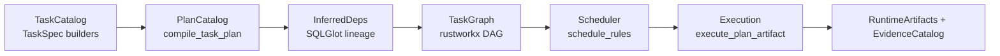

# Task/Plan Catalog Pivot — Comprehensive Implementation Plan

> **Goal**: Replace rule‑registry and declared inputs with an inference‑first **Task/Plan Catalog** that derives dependency graphs from Ibis/SQLGlot lineage, builds rustworkx graphs, and emits optional Hamilton DAGs. This plan assumes a full rewrite is acceptable and targets a streamlined, inference‑driven architecture.

---

## 0) Target Architecture Overview

### Core Concepts
- **TaskSpec**: declarative description of *what* to compute (output name + Ibis/SQLGlot builder).
- **PlanArtifact**: compiled Ibis plan + SQLGlot lineage + fingerprints.
- **InferredDeps**: table and column‑level dependencies derived from compiled expressions.
- **TaskGraph**: bipartite rustworkx DAG (evidence ↔ task) built purely from inference.
- **RuntimeArtifacts**: execution‑time state (materialized tables, view refs, fingerprints, schema cache).

### Representative Code Pattern (core flow)
```python
# task_catalog.py (new)
@dataclass(frozen=True)
class TaskSpec:
    name: str
    output: str
    build: Callable[[ExecutionContext], IbisTable]
    kind: Literal["view", "compute", "materialization"] = "view"
    cache_policy: CachePolicy = "none"


# plan_catalog.py (new)
@dataclass(frozen=True)
class PlanArtifact:
    task: TaskSpec
    plan: IbisPlan
    sqlglot_ast: Expression
    deps: InferredDeps
    plan_fingerprint: str


def compile_task_plan(task: TaskSpec, *, backend: IbisCompilerBackend, ctx: ExecutionContext) -> PlanArtifact:
    table = task.build(ctx)
    plan = compile_ibis_plan(table, backend=backend, ctx=ctx)
    sg_expr = ibis_to_sqlglot(plan.expr, backend=backend, params=None)
    deps = infer_deps_from_sqlglot_expr(
        sg_expr,
        rule_name=task.name,
        output=task.output,
    )
    fp = plan_fingerprint(sg_expr)
    return PlanArtifact(task=task, plan=plan, sqlglot_ast=sg_expr, deps=deps, plan_fingerprint=fp)
```

---

## Scope 1 — Introduce Task/Plan Catalog (foundation)

### Why
Establish the canonical inference‑first API: task definitions, plan compilation, lineage extraction, and fingerprints. This replaces rule definitions/spec tables as the source of truth.

### Status
**Completed** — catalogs + compilation helpers are live; unit tests added.

### Representative Code Snippets
```python
# src/relspec/task_catalog.py (new)
@dataclass(frozen=True)
class TaskCatalog:
    tasks: tuple[TaskSpec, ...]

    def by_name(self) -> Mapping[str, TaskSpec]:
        return {task.name: task for task in self.tasks}


# src/relspec/plan_catalog.py (new)
@dataclass(frozen=True)
class PlanCatalog:
    artifacts: tuple[PlanArtifact, ...]

    def by_output(self) -> Mapping[str, PlanArtifact]:
        return {artifact.task.output: artifact for artifact in self.artifacts}
```

### Target Files
- **New**: `src/relspec/task_catalog.py`
- **New**: `src/relspec/plan_catalog.py`
- **Update**: `src/relspec/inferred_deps.py` (ensure API supports SQLGlot expressions and Ibis plans)
- **Update**: `src/relspec/runtime_artifacts.py` (continue as the runtime store)

### Implementation Checklist
- [x] Define `TaskSpec` and `TaskCatalog` (view/compute/materialization + cache policy).
- [x] Define `PlanArtifact` and `PlanCatalog` (plan, SQLGlot AST, lineage, fingerprints).
- [x] Implement `compile_task_plan()` helper for Ibis → SQLGlot → lineage.
- [x] Add unit tests for catalog indexing and plan compilation.

---

## Scope 2 — Inference‑Only Graph Builder

### Why
Replace all rule‑based graph constructors with a single inference path from `PlanCatalog`.

### Status
**Completed** — inference‑only graph builder shipped; legacy constructors removed.

### Representative Code Snippets
```python
# src/relspec/graph_inference.py (new)
@dataclass(frozen=True)
class TaskGraph:
    graph: rx.PyDiGraph
    evidence_idx: dict[str, int]
    task_idx: dict[str, int]


def build_task_graph(artifacts: Sequence[PlanArtifact]) -> TaskGraph:
    deps = [artifact.deps for artifact in artifacts]
    return build_rule_graph_from_inferred_deps(deps)
```

### Target Files
- **New**: `src/relspec/graph_inference.py`
- **Update**: `src/relspec/rustworkx_graph.py` (keep inferred builder, remove legacy paths)

### Implementation Checklist
- [x] Introduce `TaskGraph` wrapper (optional; or reuse existing `RuleGraph`).
- [x] Provide `build_task_graph(PlanCatalog)` that uses inferred deps.
- [x] Remove/disable `build_rule_graph_from_definitions` and other legacy constructors.

---

## Scope 3 — Scheduler & Validation: Edge‑First

### Why
Guarantee readiness based on **inferred column requirements** instead of declared inputs.

### Status
**Completed** — column/type/metadata edge validation wired into scheduling.

### Representative Code Snippets
```python
# src/relspec/rustworkx_schedule.py (updated)
if not validate_edge_requirements(graph, rule_idx, catalog=evidence):
    continue
```

### Target Files
- **Update**: `src/relspec/rustworkx_schedule.py`
- **Update**: `src/relspec/graph_edge_validation.py`

### Implementation Checklist
- [x] Ensure scheduler only validates through `GraphEdge` requirements.
- [x] Include required column/types/metadata checks.
- [x] Provide diagnostics for failed edges (column‑level).

---

## Scope 4 — Replace Rule Registry with Task Catalog

### Why
Rule registry + spec tables are tightly coupled to declared inputs. Inference pivot requires a task catalog and builder registry instead.

### Status
**Completed** — normalize, relationship, and CPG task catalogs now emit real plans.

### Representative Code Snippet
```python
# src/relspec/task_registry.py (new)
@dataclass
class TaskRegistry:
    tasks: dict[str, TaskSpec] = field(default_factory=dict)

    def register(self, task: TaskSpec) -> None:
        self.tasks[task.name] = task

    def build_catalog(self) -> TaskCatalog:
        return TaskCatalog(tasks=tuple(self.tasks.values()))
```

### Target Files
- **New**: `src/relspec/task_registry.py`
- **Update**: `src/normalize/*` to emit TaskSpec builders instead of RuleDefinition
- **Update**: `src/cpg/*` to consume TaskCatalog instead of rules
- **Update**: `src/hamilton_pipeline/*` to synthesize from TaskGraph

### Implementation Checklist
- [x] Create `TaskRegistry` and task discovery hooks.
- [x] Replace normalize rule factories with task catalog builders.
- [x] Define relationship task builders (rule‑free) and register into the catalog.
- [x] Update Hamilton orchestration to operate on TaskCatalog/TaskGraph.

---

## Scope 5 — Execution Engine Rewrite

### Why
The current execution pipeline expects rule definitions; inference pivot should compile plans directly from tasks.

### Status
**Completed** — plan execution is wired into Hamilton with RuntimeArtifacts + EvidenceCatalog updates.

### Representative Code Snippets
```python
# src/relspec/execution.py (new)
@dataclass(frozen=True)
class TaskExecutionContext:
    runtime: RuntimeArtifacts
    backend: IbisCompilerBackend


def execute_task_plan(artifact: PlanArtifact, *, ctx: TaskExecutionContext) -> TableLike:
    return materialize_ibis_plan(artifact.plan, execution=ctx.runtime)
```

### Target Files
- **New**: `src/relspec/execution.py`
- **Update**: `src/normalize/runner.py` (use TaskCatalog + PlanCatalog)
- **Update**: `src/hamilton_pipeline/modules/*` (consume PlanArtifacts)

### Implementation Checklist
- [x] Introduce a minimal execution harness for PlanArtifacts.
- [x] Replace rule‑compiler pipeline with plan‑catalog execution in the pipeline.
- [x] Align runtime artifacts + evidence catalog updates during task execution.

---

## Scope 6 — Incremental + Caching (fingerprint‑based)

### Why
Incremental logic should be based on plan fingerprints and inferred lineage rather than rule definitions.

### Status
**Completed** — plan fingerprints are persisted and used to gate execution.

### Representative Code Snippet
```python
@dataclass(frozen=True)
class IncrementalDiff:
    changed_tasks: tuple[str, ...]


def diff_plan_catalog(prev: PlanCatalog, curr: PlanCatalog) -> IncrementalDiff:
    prev_fp = {a.task.name: a.plan_fingerprint for a in prev.artifacts}
    curr_fp = {a.task.name: a.plan_fingerprint for a in curr.artifacts}
    changed = [name for name, fp in curr_fp.items() if prev_fp.get(name) != fp]
    return IncrementalDiff(changed_tasks=tuple(sorted(changed)))
```

### Target Files
- **Replace**: `src/relspec/incremental.py` with plan‑diff logic
- **Update**: `src/relspec/rules/cache.py` (if retained, rewire to PlanCatalog)

### Implementation Checklist
- [x] Implement fingerprint‑diff for Task/Plan catalogs.
- [x] Update incremental scheduling to target changed tasks only.

---

## Scope 7 — Decommission Rule System

### Why
Once all pipelines use Task/Plan catalog, the rule registry, spec tables, and rule handlers are obsolete.

### Status
**Mostly complete** — rule registry/spec modules deleted; some rule‑named models remain but are inert.

### Files to Decommission/Delete
> **Status (current repo):**
- [x] `src/relspec/rules/`
- [x] `src/relspec/registry/`
- [x] `src/relspec/adapters/`
- [x] `src/relspec/extract/`
- [x] `src/relspec/normalize/` (relspec‑side normalize rule specs)
- [x] `src/relspec/compiler.py`
- [x] `src/relspec/engine.py`
- [x] `src/relspec/plan.py`
- [x] `src/relspec/validate.py`
- [x] `src/relspec/graph.py` (rule‑level graph plan path)
- [x] `src/relspec/incremental.py` (replaced with PlanCatalog diff implementation)

### Implementation Checklist
- [x] Remove all imports of rule registry/spec tables.
- [x] Remove rule‑definition serialization/contract tables.
- [x] Delete deprecated graph builders.

---

## Scope 8 — Update Documentation & Invariants

### Target Files
- **Update**: `CLAUDE.md`
- **Update**: `docs/plans/calculation_driven_scheduling_and_orchestration.md`
- **New**: `docs/plans/task_plan_catalog_pivot.md` (this plan)

### Status
**Completed** — core docs updated and diagram added.

### Implementation Checklist
- [x] Replace “rules registry” terminology with “task/plan catalog.”
- [x] Document TaskSpec lifecycle + compilation + inference.
- [x] Add diagrams for TaskCatalog → PlanCatalog → TaskGraph → Scheduler.

### Diagram — Task/Plan Catalog Flow


---

## Cross‑Cutting Decommission List (Functions)

> **Delete once all call sites are migrated**
> **Status (current repo):**
- [x] `relspec.rustworkx_graph.build_rule_graph_from_definitions`
- [x] `relspec.rustworkx_graph.build_rule_graph_from_relationship_rules`
- [x] `relspec.rustworkx_graph.build_rule_graph_from_normalize_rules`
- [x] `relspec.rules.*` (all rule definition/spec/handler functions)
- [x] `relspec.registry.*` (rule registry / snapshot / rule discovery)
- [x] `relspec.compiler.*` (rule compilation pipeline)
- [x] `relspec.engine.*` (rule execution engine)
- [x] `relspec.plan.*` (rule plan composition)
- [x] `relspec.validate.*` (rule validation pipeline)
- [x] `relspec.incremental.*` (rule‑based incremental)
- [x] `relspec.graph.compile_graph_plan` (rule‑based graph plan)

---

## Migration Order (Recommended)
1. **Scope 1** (Task/Plan catalogs)
2. **Scope 2** (Inference‑only graph)
3. **Scope 3** (Edge‑first scheduling)
4. **Scope 4** (Task registry + adapters rewrite)
5. **Scope 5** (Execution engine rewrite)
6. **Scope 6** (Incremental rewrite)
7. **Scope 7** (Delete rule system)
8. **Scope 8** (Docs + invariants)

---

## Acceptance Criteria
- No manual `inputs=` or rule spec dependency declarations remain.
- All dependency graphs derived from SQLGlot lineage.
- Scheduler only uses edge requirements (columns/types/metadata).
- Plan fingerprints drive caching and incremental diffs.
- Rule registry/spec tables removed from runtime path.
- Hamilton DAGs generated from inferred TaskGraph.

---

## Next Steps (if you want me to proceed)
1. Populate `GraphEdge.required_types` / `required_metadata` from schema-aware inference (currently validated but always empty).
2. Add targeted tests for edge validation (types/metadata) and incremental plan gating.
3. Decide whether legacy `normalize/runner.py` should be refactored to consume TaskCatalogs or explicitly marked as legacy-only.
4. Add small diagnostics for incremental plan diff (counts + changed task names) to the diagnostics sink.
